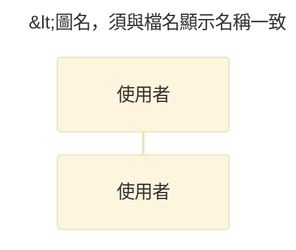

# Mermaid 製圖慣例

> 通用 OOAD 規則與圖族語意仍由 `diagram-guides/`、`traceability.md` 與 review checklist 管理；本檔只規範 Mermaid source。

## 檔案與固定骨架

使用 `.mmd`，檔名為 `圖{章}-{節}-{序}-{名稱}-vX-x.mmd`。



- `[DOC:MUST]` YAML frontmatter `title` 與八個 metadata comment 欄位齊全。
- `[FF:SHOULD]` 使用 `theme: base` 與既定 renderer config；需要調色時集中管理 theme variables。
- `[FF:SHOULD-NOT]` 不使用已被 Mermaid 官方標為 deprecated 的 init directive；改用 frontmatter `config`。
- `[DOC:SHOULD]` 可加入 `accTitle`／`accDescr`，但不得與顯示 title 或圖說矛盾。

## 圖種映射

| OOAD 圖 | Mermaid source | 注意 |
|---|---|---|
| 循序圖 | `sequenceDiagram` | 支援 participant、autonumber、alt/opt/loop/par |
| 類別圖 | `classDiagram` | 支援 members、relationships、multiplicity、namespace |
| 狀態機圖 | `stateDiagram-v2` | transition 仍須遵守 event／guard／effect 語意 |
| 活動流程 | `flowchart` | Mermaid 無獨立 UML Activity Diagram；正式名稱與圖說須誠實標示 |
| 套件／元件／佈署 | `flowchart` + `subgraph` 可視覺化 | 不具完整 UML semantics；嚴格 UML 優先 PlantUML |
| 使用個案／物件／通訊圖 | 無完整原生對應 | 優先 PlantUML，或明確標為非正式視覺化 |

## 驗證與匯出

允許的 gate：

1. 本機 Mermaid CLI（`mmdc`）；
2. 已核准的 Mermaid／UML MCP；
3. 已核准的 Kroki instance。

```powershell
mmdc -i "diagrams/chapter06/圖6-1-1-登入循序圖-v1-0.mmd" `
  -o "images/圖6-1-1-登入循序圖-v1-0.png"

python .claude/skills/ooad-uml-diagramming/scripts/validate_diagram_artifacts.py `
  --diagram-dir docs/00_Deliverables/System_Manual/diagrams/chapter06 `
  --image-dir docs/00_Deliverables/System_Manual/images `
  --chapter docs/00_Deliverables/System_Manual/chapters/06_設計模型.md `
  --toc docs/00_Deliverables/System_Manual/圖表目錄.md `
  --require-version
```

CLI／MCP 成功後仍要開啟 PNG／SVG 目視檢查。不同 Mermaid renderer 版本可能改變 layout；回報中記錄 renderer 與版本。
