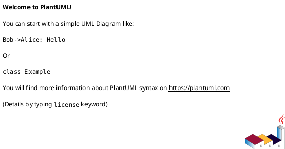

# 事實來源與追溯

> 通用層。編號前綴的實際格式由專案定義，本 skill 只消費。

## 圖檔頭宣告

`[DOC:MUST]` 每個圖源開頭必須有宣告區塊，缺任一欄位不得產出。PlantUML 使用 `' key: value`，Mermaid 使用 `%% key: value`；欄位語意相同。



| 欄位 | 說明 | 允許值 |
|---|---|---|
| `ooad-phase` | OOAD 階段 | 需求分析／物件分析／系統設計／物件設計／實作／測試 |
| `chapter` | 所屬章節 | `5-3`、`6-1`⋯⋯（決定套用哪組防顛倒檢查） |
| `realizes` | 實現的需求編號 | `UC-xx` 或 `FR-xx`，可多值。無法填寫代表這張圖是孤兒 |
| `source` | 事實來源 | 路徑或文件名 +（類型） |
| `verified` | 查證日期 | `YYYY-MM-DD` |
| `status` | 狀態 | `draft` / `reviewed` / `approved` |
| `implemented` | 實作狀態 | `yes` / `partial` / `planned` |
| `ai-assisted` | AI 協助的可追溯紀錄 | `no`，或 `yes / 工具 / 使用範圍` |

> `ai-assisted` 是**來源資料**，不是揭露紀錄本身。它讓 AI 參與情形可被追溯，
> 但**不規定** AI 使用表的紀錄粒度 —— 一圖一筆或按工作範圍合併，由專案決定。
> 見 `local/ntub-format-rules.md`。

## 事實來源層級

`[DOC:MUST]` 由高到低，衝突時取高者：

1. 程式碼與設定
2. schema 定義
3. 現況文件
4. 既有手冊
5. 歷史文件

`[DOC:MUST]` 歷屆手冊、初評舊圖、舊會議紀錄**不得**作為現況證據。

`[DOC:SHOULD]` 易變的環境資訊（暫時通道位址、外部服務端點、憑證效期）不寫進 UML 圖本體，
改置於章節文字或附錄。

`[DOC:MUST]` `implemented` 為 `partial` 或 `planned` 時，圖上必須以 note 或 stereotype
標示，不得以圖示暗示已完成。

## 反向工程的界線

| 層級 | 是否允許讀程式碼產圖 | 理由 |
|---|---|---|
| 分析層（分析類別圖、分析物件圖） | **禁止** `[OOAD:MUST]` | 反向工程會把實作細節帶進分析層，這是類別圖畫顛倒的主要成因 |
| 設計層（設計類別圖、循序圖、狀態機圖） | 允許，須在 `source` 標註 | — |
| 實作層（套件圖、元件圖、佈署圖） | 允許，須在 `source` 標註 | — |

分析層的事實來源應為需求清單、使用個案描述與領域討論，不是程式碼。

---

## 追溯鏈

```
FR-xx / NFR-xx ──┬─→ UC-xx ──→ 設計圖（realizes: UC-xx）──→ 元件編號 ──→ 測試案例
                 │
                 └─→（內部流程）──→ 設計圖（realizes: FR-xx）──→ 元件編號 ──→ 測試案例
```

### 各層的標註義務

| 產物 | 必須標註 | 標記 |
|---|---|---|
| 設計層互動圖（循序圖／通訊圖） | `realizes` 指向 `UC-xx` 或 `FR-xx` | `[OOAD:MUST]` |
| 活動圖 | `realizes` 指向 `UC-xx` 或 `FR-xx` | `[OOAD:MUST]` |
| 設計類別圖的每個類別 | 來源分析類別，或標「技術新增」 | `[OOAD:SHOULD]` |
| 狀態機圖 | 對應的設計類別名稱 | `[OOAD:MUST]` |
| 資料庫集合 | 對應的持久化類別 | `[OOAD:SHOULD]` |
| 元件清單的每個元件 | 所屬套件 | `[OOAD:SHOULD]` |
| 測試案例 | `FR/NFR/UC-ID` + 被測元件編號 | `[OOAD:MUST]` |

### 使用個案實現的宣告格式

`[OOAD:SHOULD]` 在章節文字中宣告成套對應：

> UC-03 由〔QaController、QaService、SegmentRepository〕＋〔圖6-1-3〕＋〔圖7-4-2〕共同實現。

## 完整性檢查

`[OOAD:MUST]` review 第 4 層執行：

| 檢查 | 定義 | 處置 |
|---|---|---|
| **孤兒圖** | 沒有任何 `UC-ID` 或 `FR-ID` 指向的圖 | 補標註，或說明為何這張圖不需追溯（例如系統架構圖） |
| **孤兒需求** | 沒有任何圖或元件涵蓋的 `UC-ID` / `FR-ID` | 補圖，或在需求清單標示實作狀態 |
| **斷鏈** | `realizes` 指向不存在的編號 | 修正編號 |
| **測試缺口** | 有圖有元件但無測試案例 | 在測試章標示為待補驗收 |

### 可執行的檢查方式

```bash
# 列出所有圖的 realizes 標註
grep -rh "^' realizes:" diagrams/ | sort -u

# 找出缺少宣告欄位的 PlantUML source；Mermaid 與跨平台檢查使用 validate_diagram_artifacts.py
for f in $(find diagrams -name "*.puml"); do
  for k in ooad-phase chapter realizes source verified status implemented ai-assisted; do
    grep -q "^' $k:" "$f" || echo "$f 缺少 $k"
  done
done
```

## 提示級規則

`[OOAD:HEURISTIC]`

- 一個章節的圖數量遠超過該章的需求數量，可能在湊圖 → 僅提示
- `verified` 日期距今超過三個月且 `source` 指向程式碼，圖可能已過期 → 僅提示

## 圖的失效觸發

`[DOC:SHOULD]` 下列變更發生時，相關圖應重新查證：

| 變更 | 影響的圖 |
|---|---|
| schema 或資料模型變更 | 設計類別圖、集合關聯圖、狀態機圖 |
| 路由或對外介面增刪 | 循序圖、元件圖、元件清單 |
| 佈署拓撲或執行環境變更 | 佈署圖、執行環境拓撲圖 |
| 狀態轉換規則變更 | 狀態機圖 |
| 需求增刪 | 使用個案圖、活動圖、追溯矩陣 |
