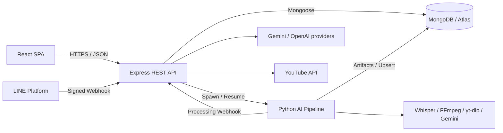
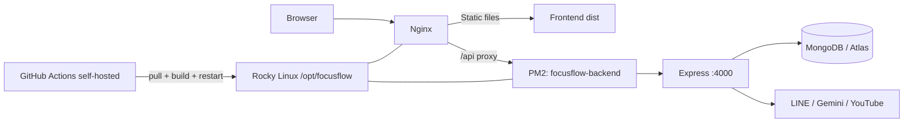
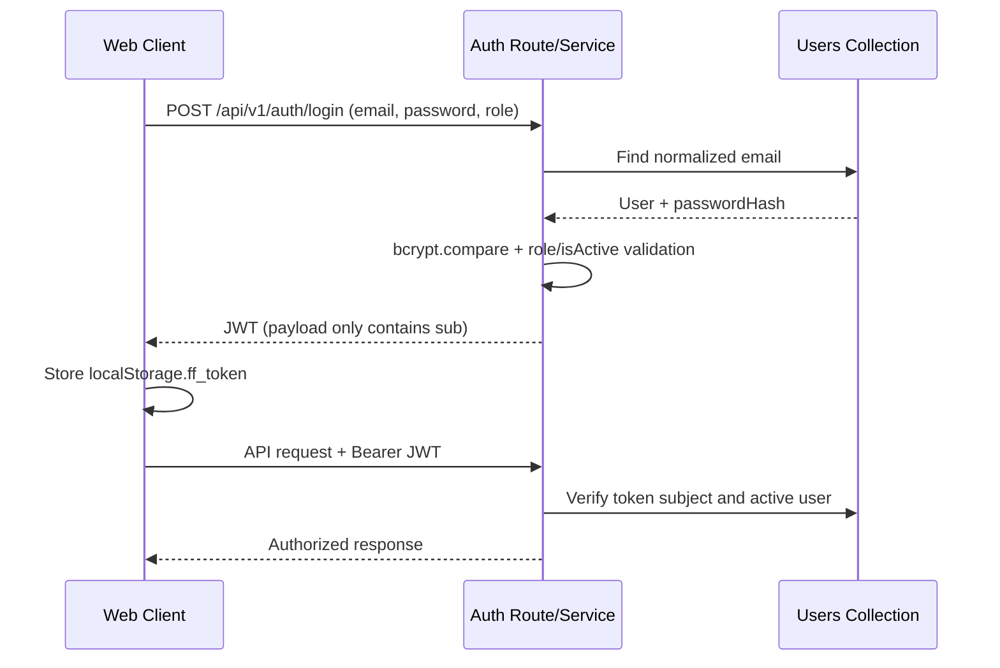
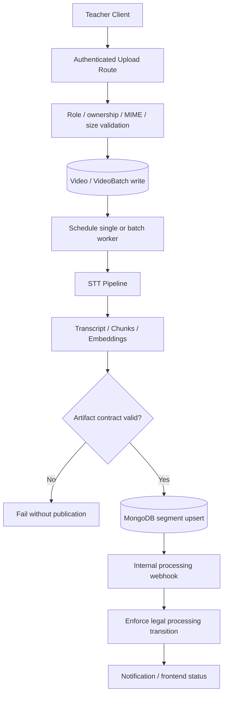
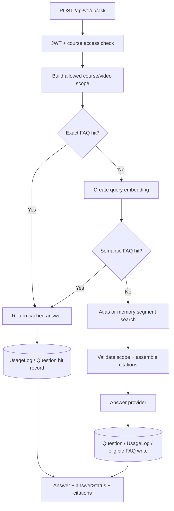
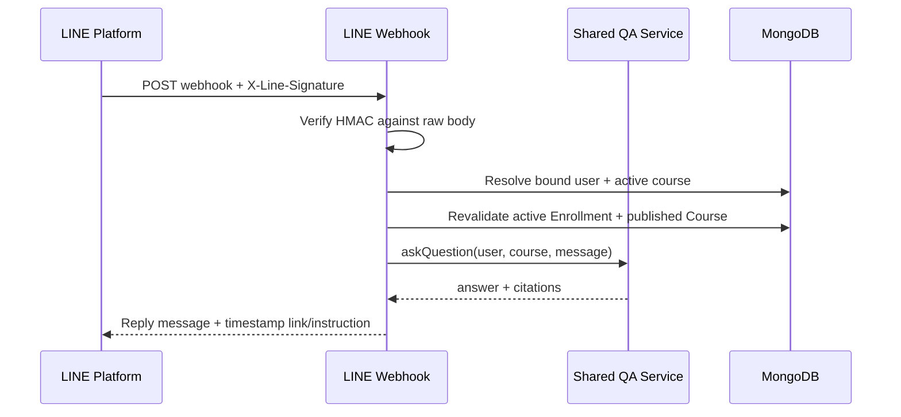

# Architecture Description（FocusFlow 系統架構說明書）

本文件用來建立開發者與 AI 對 FocusFlow 的共同架構認知，說明穩定的系統邊界、分層、資料流與開發原則。

> 真相來源優先序：目前程式碼、routes／models／tests 與 runtime 查證 > 最近 git history／diff > [docs/current-status.md](docs/current-status.md) > [backend/docs/current-state.md](backend/docs/current-state.md) > 其他歷史文件。
>
> 本文件只記錄低頻變動的架構。功能完成度、部署可用性與待辦放在 [docs/current-status.md](docs/current-status.md)；重要決策與原因放在 [docs/decision-log.md](docs/decision-log.md)。
>
> `docs/05_Database_Schema_Contract/MongoDB_契約定版_v1_已過期.md` 只供歷史參考，不是目前資料契約。

### 閱讀捷徑（How to Read This Document）

| 目的 | 建議閱讀順序 |
|------|--------------|
| 30 秒理解系統 | 1. 系統概述 → 3.2 Entry Points → 5.1 Architecture Invariants |
| 接手一項功能 | 3.2 Change Map → 對應的 3.x 元件 → 4.x 資料流 → 5.2 工程規則 |
| 判斷目前能否上線 | 不從本文件推論；改查 `docs/current-status.md`、`backend/docs/current-state.md` 與 `/health` |
| 修改資料或外部整合 | 先讀 3.7／3.9、5.1，再確認授權與 live evidence |

---

## 1. 系統概述（System Overview）

### 專案目標

FocusFlow 是 AI 教學影片問答系統：將教師上傳的影片轉成可檢索知識，讓學生從網頁或 LINE 提問，取得有來源片段與影片時間戳的回答。

### 核心功能

1. **身分與課程權限**：提供 student／teacher／admin 登入、角色控制、修課資格與課程管理。
2. **影片處理**：接收本機影片或 YouTube 來源，追蹤 `queued → processing → completed / failed` 狀態。
3. **AI 資料生產**：執行音訊抽取、STT、逐字稿正規化、Chunking、Embedding 與 MongoDB publication。
4. **來源式問答**：依課程權限搜尋相關片段，產生答案、citations 與影片時間戳；網頁與 LINE 共用同一個 QA service。
5. **教學營運功能**：提供 Dashboard、通知、觀看進度、FAQ cache、ShortAsset feed 與管理介面。

### 目標用戶

| 角色 | 主要需求 |
|------|----------|
| `student` | 查看已修課程、觀看影片、提問、查看來源與時間戳、綁定 LINE |
| `teacher` | 建立課程、指派學生、上傳與管理影片、追蹤處理狀態與課程統計 |
| `admin` | 管理使用者、課程、影片、通知、事件與全站統計 |

### 系統邊界



AI Pipeline 是獨立 Python CLI，不內嵌在 Express process；Backend 可在影片建立或批次處理時啟動／恢復 Pipeline，Pipeline 再以 MongoDB 與 internal webhook 交付結果。

---

## 2. 技術棧（Tech Stack）

| 區域 | 主要技術 | Runtime／入口 |
|------|----------|---------------|
| Frontend | React 19、JavaScript、Vite 8、Three.js、GSAP | `frontend/focus-flow/src/main.jsx`；開發預設 port `5173` |
| Backend | Node.js、Express 4、Mongoose 8、JWT、bcryptjs、Multer | `backend/src/server.js`；預設 port `4000` |
| AI Pipeline | Python 3.10+、Faster-Whisper、Gemini Embedding、FFmpeg、yt-dlp、rapidfuzz | `STT_Whisper/src/main.py`、`batch_main.py` |
| Database | MongoDB／MongoDB Atlas、Atlas Vector Search | Backend Mongoose models + Pipeline／Database uploaders |
| API 文件 | OpenAPI YAML、Swagger UI | `/docs`、`/docs/openapi.yaml` |
| Infrastructure | Rocky Linux 9、Nginx、PM2、GitHub Actions self-hosted runner | `.github/workflows/deploy.yml`；部署路徑 `/opt/focusflow` |
| Testing | Node `node:test`、Frontend `node:test` + ESLint + Vite build、Python `unittest` | 各子系統 tests／指令 |

部署 workflow 在 push `main` 後由 self-hosted runner pull code、安裝 Backend dependencies、build Frontend、重啟 PM2 Backend 並 reload Nginx。這是目前部署拓撲，不代表每次 workflow 成功後所有 live provider 與公開端點都已驗收；實際狀態以 [docs/current-status.md](docs/current-status.md) 與 `/health` 為準。

---

## 3. 系統元件與分層（System Components & Layering）

### 3.1 Repository 高層結構

```text
focusflow/
├── backend/                    # Express REST API 與主要業務邏輯
│   ├── src/
│   │   ├── routes/             # URL、middleware 與 controller 綁定
│   │   ├── controllers/        # Request/response orchestration
│   │   ├── services/           # 業務邏輯、資料存取、外部整合
│   │   ├── models/             # Mongoose schema 與 index 宣告
│   │   ├── middleware/         # JWT、RBAC、upload、signature、error
│   │   ├── config/             # Env、CORS 與 provider 設定
│   │   └── utils/              # 共用 response、error、validation helpers
│   ├── tests/
│   └── docs/
├── frontend/focus-flow/        # Student／Teacher／Admin React SPA
│   └── src/
│       ├── components/         # 共用 layout 與 UI 元件
│       ├── pages/              # 依角色切分的頁面
│       ├── services/           # 前端 domain/API orchestration
│       ├── utils/
│       ├── api.js              # API base、JWT 注入、統一錯誤解析
│       ├── App.jsx
│       └── main.jsx
├── STT_Whisper/                # 單支／批次 STT、Chunk、Embedding、Resume
│   ├── src/
│   ├── tests/
│   └── data/                   # Runtime input/output，不是 source of truth
├── database/                   # Collection/index setup、uploader、修復工具
├── docs/                       # 動態進度、決策、契約與會議紀錄
├── .agents/skills/             # Codex repo-local skills
├── .claude/rules/              # API、Database、Security、Testing 規範
└── .github/workflows/          # CI/CD workflows
```

`node_modules/`、`dist/`、`.venv/`、uploads、private data、pipeline outputs 與暫存 logs 都是 runtime／generated artifacts，不是架構來源。

### 3.2 Entry Points 與 Code Map

#### 主要入口（Entry Points）

| 想理解的範圍 | 第一個入口 | 接著閱讀 |
|--------------|------------|----------|
| Backend process | `backend/src/server.js` | `app.js` → `routes/index.js` |
| Express middleware／mount | `backend/src/app.js` | `middleware/`、各 `*.routes.js` |
| 對外 API | `backend/src/routes/index.js` | module route → controller → service → model |
| Frontend boot | `frontend/focus-flow/src/main.jsx` | `App.jsx`／`AdminApp.jsx` → `components/DashboardApp.jsx` |
| Frontend API | `frontend/focus-flow/src/api.js` | `pages/`、`services/videoUpload.js` |
| 單支 AI Pipeline | `STT_Whisper/src/main.py` | stage modules → `job_manager.py` → uploader |
| 批次 AI Pipeline | `STT_Whisper/src/batch_main.py` | `batch_manager.py` → manifest／checkpoint／resume |
| Database tooling | `database/tools/mongodb_uploader.py` | `database/tools/setup/`、`database/README.md` |
| Deployment | `.github/workflows/deploy.yml` | Backend `server.js`、Frontend build、PM2／Nginx runtime |
| API contract | `backend/docs/openapi.yaml` | 實際 route files；internal endpoints 以程式碼為準 |

#### 修改導覽（Change Map）

| 要修改什麼 | 從這裡開始 | 依賴方向／同步檢查 |
|------------|------------|---------------------|
| API endpoint／response | `backend/src/routes/<module>.routes.js` | controller → service → model；同步 route tests、consumer、OpenAPI |
| 登入／角色／修課權限 | `auth.routes.js`、`middleware/auth.middleware.js`、`role.middleware.js` | `auth.service.js`、`courseAccess.service.js`、`enrollment.service.js`、security rules／tests |
| QA／citation／FAQ | `qa.routes.js` → `qa.controller.js` → `qa.service.js` | `bridgeScope`、`faqCache`、`queryEmbedding`、`answerGeneration`、`questionRecording` 與 QA／citation tests |
| Video／batch／processing | `video.routes.js`、`videoBatch.controller.js` | `video.service`、`videoBatch*`、`videoProcessing`、`sttProcessLifecycle` 與 batch／route tests |
| Frontend page／API | `main.jsx`、`App.jsx`、`components/DashboardApp.jsx` | role page → `api.js`／service；同步 frontend tests、lint、build |
| STT／Chunk／Embedding | `STT_Whisper/src/main.py` 或 `batch_main.py` | manager／checkpoint → stage → artifact → uploader；同步 `STT_Whisper/tests/` 與 README |
| Schema／index／publication | `backend/src/models/`、`database/tools/`、Pipeline uploader | 先做 contract review；同步 seed／harness／tests；shared Atlas 寫入另需授權 |
| Deploy／runtime | `.github/workflows/deploy.yml`、`backend/src/app.js`、`config/` | 同步 `/health`、runtime docs、Nginx／PM2／public smoke；workflow 綠燈不等於驗收完成 |

### 3.3 Backend 分層

Backend 固定依賴方向：

```text
routes → controllers → services → models
```

| Layer | 責任 | 禁止事項 |
|-------|------|----------|
| Routes / Presentation | 宣告 URL、HTTP method、authentication、authorization、upload 等 middleware | 不寫業務邏輯或直接操作資料庫 |
| Controllers / Presentation | 解構與基本驗證 request、呼叫 service、透過共用 helper 組裝 response | 不堆疊主要業務規則，不直接查 Model |
| Services / Business Logic | 權限與資源規則、狀態轉換、資料存取、provider orchestration | 不依賴 Express `req`／`res` |
| Models / Data Access Contract | Mongoose schema、欄位契約、index | 不處理 HTTP 或 UI 語意 |

共用 middleware 鏈包含：

```text
authenticate (JWT)
→ authorizeRoles (RBAC)
→ upload / lineSignature / internalProcessingAuth
→ controller
→ notFoundHandler / errorHandler
```

### 3.4 API 與路由模組

一般業務 API 統一掛在 `/api/v1`；`/health` 與 `/docs` 是頂層 operational endpoints。

| 模組 | 主要路徑 | 主要責任 |
|------|----------|----------|
| `auth` | `/api/v1/auth/*` | 註冊、role-aware login、`/me`、private avatar |
| `courses` | `/api/v1/courses/*` | 課程 CRUD、Enrollment、課程影片關係 |
| `videos` / `video-batches` | `/api/v1/videos/*`、`/api/v1/video-batches/*`、nested course paths | 上傳、批次、狀態、retry、attach/detach、watched |
| `qa` | `/api/v1/qa/ask`、course FAQ paths | FAQ cache、檢索、回答、citations、紀錄 |
| `line` | `/api/v1/line/*` | Signed webhook、bind token、選課與共用 QA |
| `notifications` | `/api/v1/notifications/*` | 列表、cursor、read state、admin fanout |
| `youtube` | `/api/v1/youtube/*` | Shorts feed、YouTube metadata／availability |
| `stats` / `admin` | `/api/v1/stats/*`、`/api/v1/admin/*` | 角色 Dashboard 與管理功能 |
| `internal-video` | `/api/v1/internal/videos/*` | Pipeline processing webhook；shared secret，不使用一般 JWT |
| Operational | `/health`、`/docs` | Runtime readiness 與 API 文件 |

URL 使用小寫 kebab-case、資源以複數名詞為主，巢狀資源原則上不超過兩層。JavaScript 變數、JSON 與目前正式 MongoDB 欄位使用 camelCase。

### 3.5 Frontend 分層

```text
main.jsx
├── /admin → AdminApp.jsx → AdminLoginPage → DashboardApp
└── other  → App.jsx      → Login/Register → DashboardApp
                                      ↓
                            role + sub page mapping
                                      ↓
                         pages → services → api.js → Backend
```

- `components/` 放共用 UI、layout 與導航；`pages/` 負責角色頁面組合。
- `services/` 處理較完整的前端 domain/API 流程；共用 API request 由 `api.js` 統一處理。
- API base URL 由 `VITE_API_BASE_URL` 控制，預設指向 `http://localhost:4000/api/v1`。
- JWT 存於 `localStorage.ff_token`；`apiFetch()` 自動加入 `Authorization: Bearer <token>`。
- 目前 Dashboard 主要以 React component state 的 `role + sub` 切換；只有 `/admin` 是獨立 URL 入口，不能假設已使用完整 URL router。

### 3.6 AI Pipeline 分層

```text
Input discovery
→ audio extraction / download
→ Faster-Whisper STT
→ transcript normalization
→ Leaf chunking（可選 Parent hierarchy）
→ Gemini embeddings
→ artifact validation / checkpoint
→ JSON / JSONL export
→ MongoDB publication（顯式啟用）
→ Backend processing webhook
```

單支入口為 `STT_Whisper/src/main.py`；批次入口為 `batch_main.py`。Batch manifest、execution lease、checkpoint 與 resume 用來隔離單支失敗並避免同一批次被多個 worker 同時修改。

Backend 觸發的單支輸出放在 `STT_Whisper/data/outputs/runs/<videoId>/`，避免共用輸出被併發覆蓋。Pipeline 可產生資料並透過 uploader publication，但 shared MongoDB／Atlas 寫入、外部模型 smoke 與正式 Gate 啟用仍是獨立授權和驗收事項。

### 3.7 資料存取與核心契約

| Model／Collection | 架構定位 |
|------------------|----------|
| `users` | 身分、角色、密碼雜湊、LINE 綁定與對話狀態 |
| `courses` | 課程容器、owner、狀態與掛載影片引用 |
| `enrollments` | `studentId × courseId` 修課授權、progress 與 soft revoke |
| `videos` | App-owned 影片與 legacy pipeline metadata 的相容混合邊界 |
| `videobatches` | 多影片批次、items、execution／retry 狀態 |
| `video_segments_text` | Leaf 文字片段、時間戳與 text embedding；QA 主要檢索來源 |
| Parent segment collection | Hierarchical Retrieval 的 Parent metadata／embedding；名稱由 env contract 控制 |
| `video_segments_video` | 視覺 citation／video embedding；仍存在 snake_case legacy 邊界 |
| `faqs` | 課程 FAQ cache、命中統計與相似問題快取 |
| `questions` / `usage_logs` | 問答結果、matches／runtime 與使用行為稽核 |
| `notifications` | 使用者通知、read state 與 fanout 去重 |
| `shortassets` | 課程 Short metadata、發布／封存與 YouTube availability |
| `line_bind_tokens` | 一次性 LINE 綁定 token 與 TTL |

`videos` 目前同時相容 App-owned record 與 Pipeline metadata record。新欄位以 camelCase 為準；`video_id` 等 snake_case 只在明確 legacy／跨系統契約邊界讀取，不得擴散成新的 Backend API 欄位。

- `Video.isAppOwnedRecord(video)`：具備 `courseId`、`uploadedBy`、`title` 與 `processing.status` 的 App 正式影片。
- `Video.isPipelineMetadataRecord(video)`：具備 `videoId` 或 legacy `video_id`，但不符合 App-owned contract 的 Pipeline metadata。

兩者暫時混存在 `videos`，讓 Pipeline metadata 可經 `course.videoIds` 進入 QA scope；是否拆分 physical collection 仍屬跨組資料庫決策。

### 3.8 核心授權模型

FocusFlow 不是單純的功能權限表，而是：

```text
Role（RBAC）
+ Resource relationship（Enrollment / owner）
+ Resource status（published / active）
```

- Student 採 default deny：只有 `active Enrollment ∩ published Course` 可以存取 Course、Video、QA／FAQ、Shorts、課程通知與 LINE 問答。
- Teacher 只能管理自己擁有的課程與相關影片；Admin 可執行全站管理操作。
- 課程 owner teacher 與 admin 可指派或 soft revoke Enrollment；撤銷後保留 Question／UsageLog 歷史。
- LINE 每次選課與提問都重新驗證相同 access policy，不把舊 `activeCourseId` 當成永久授權。

### 3.9 外部整合（External Integrations）

| 整合 | 用途 | 邊界與失敗處理 |
|------|------|----------------|
| MongoDB／Atlas Vector Search | App 資料、segment retrieval、runtime records | Backend 以 Mongoose 存取；Pipeline／Database uploader 負責 publication；shared write／index 需獨立授權 |
| Gemini／OpenAI | Query embedding、回答生成；Pipeline embedding | Provider 由 env 選擇；契約不相容必須 fail fast／closed，不能把 mock 當 live readiness |
| Faster-Whisper／FFmpeg／yt-dlp | 音訊抽取、STT、YouTube media 取得 | 只在 Python Pipeline／受控 worker 執行；失敗回報 processing state，不在 Express request 內做長工 |
| LINE Messaging API | 帳號綁定、課程切換與問答 | Inbound webhook 必須驗 `X-Line-Signature`；問答重用 `qa.service` 與 Enrollment policy |
| YouTube | 本機影片上傳、播放 metadata、Short availability | OAuth／availability 是部署狀態；API 成功不等於學生一定可播放，需另做 read-only/live 驗收 |

### 3.10 部署 Runtime（Deployment View）



部署 workflow 只負責更新程式、build 與 restart。公開 DNS／TLS、Nginx proxy、`/health`、provider credentials、MongoDB／index 與瀏覽器行為都必須分開驗證。

---

## 4. 關鍵資料流向（Key Data Flows）

### 4.1 登入與已驗證 API



### 4.2 影片上傳與 AI 處理（Write Flow）



狀態轉換只允許：

```text
queued → processing → completed
                   ↘ failed → retry → processing
```

非法轉換必須回傳明確衝突錯誤，不能靜默修正；batch retry 沿用既有 batch／manifest／checkpoint，不建立平行真相來源。

### 4.3 網頁 QA（Read + Derived Write Flow）



QA 的檢索範圍由 course access、course/video relationship 與 BridgeScope 共同決定。網頁與 LINE 最終都呼叫 `qa.service.askQuestion()`，不可各自實作另一套檢索或權限邏輯。

| BridgeScope mode | 課程影片組成 | 搜尋邊界 |
|------------------|--------------|----------|
| `standard` | 只有 App-owned 影片或沒有影片 | 以正常課程／影片關係建立 scope |
| `qa_scope_only` | 只有 Pipeline metadata 影片 | 只使用 bridge 允許的 course/video IDs |
| `mixed_scope` | App-owned 與 Pipeline metadata 並存 | 合併兩種允許範圍後再過濾 segments |

QA providers 可由環境變數切換：

| 設定 | 可選值 | 責任 |
|------|--------|------|
| `QA_QUERY_EMBEDDING_PROVIDER` | `mock` / `openai` / `gemini` | Query embedding |
| `QA_ANSWER_PROVIDER` | `template` / `openai` / `gemini` | Answer generation |
| `QA_VECTOR_SEARCH_MODE` | `memory` / `atlas` | Segment retrieval |

本機 mock／memory 測試只證明程式路徑，不代表 Atlas、Gemini 或 production readiness。

### 4.4 LINE 問答



LINE 對話狀態存在 User 文件：`lineConversationState`、最近三輪的 `lineConversationHistory` 與 `activeCourseId`。撤銷資格時必須同步清除失效 scope 與對話上下文。

### 4.5 Stable Embedding 與 Hierarchical Retrieval 安全門

- Leaf 與 Parent artifact 必須攜帶 provider、model、dimension、instruction、generation、normalization、contract/schema 與 task type。
- Uploader 在 publication 前阻擋缺欄或不相容 artifact；Parent 以 `generationVersion` 與 `isActive=true` 表示可檢索 generation。
- Backend 啟用 hierarchy 前必須唯讀驗證 active Parent／Child Leaf generation、`chunkId_1` 與 Parent vector index filter contract。
- `.env` 中的 active-contract JSON 只屬部署宣告，不能取代 live MongoDB／index evidence。
- 任一 live evidence 缺失或不相容時，shadow／serve 必須 fail closed；Leaf fallback 與 Gate 狀態以 runtime 設定為準。

---

## 5. 架構設計原則（Architecture Principles）

以下規則同時約束開發者與 AI；詳細寫法見 `.claude/rules/`，驗收門檻見 `AGENTS.md`。

### 5.1 Architecture Invariants（不可破壞的不變量）

1. **單一業務邏輯入口**：網頁與 LINE 的問答必須共用 `qa.service.askQuestion()`；不得複製另一套 scope、retrieval 或 answer 邏輯。
2. **權限永遠由 Server 決定**：Student 內容存取固定為 `active Enrollment ∩ published Course`；前端隱藏、舊 token、`activeCourseId` 或知道資源 ID 都不構成授權。
3. **Backend 依賴方向固定**：`routes → controllers → services → models`；controller 不直接操作 Model，service 不依賴 Express `req`／`res`。
4. **Pipeline 是獨立執行邊界**：長時間 STT／Embedding 不在 HTTP request process 內執行；Backend 與 Pipeline 只透過受控 process、artifact、MongoDB publication 與 authenticated webhook 交接。
5. **處理狀態與批次必須冪等**：processing transition 只能走合法狀態機；webhook replay、retry、restart 不得重複計數、覆寫第一個 failure 或建立第二份 batch truth。
6. **Embedding contract 不可混用**：Leaf／Parent／Query 的 provider、model、dimension、instruction、generation 與 normalization 必須相容；env 宣告不能取代 live data／index evidence。
7. **Legacy 只能被包在邊界內**：新 API、JS 與 Mongoose 欄位一律 camelCase；snake_case 只在明確 uploader／legacy adapter 讀寫，不得向新模組擴散。
8. **測試證據不可跨級誤稱**：mock／memory／unit tests、隔離 Mongo、shared Atlas、live provider、browser E2E 與 production deploy 是不同驗收層級。

### 5.2 工程規則（Engineering Rules）

| 原則 | 必須遵守 | 禁止／邊界 |
|------|----------|-------------|
| 單向分層 | 維持 `routes → controllers → services → models`；資料庫操作與主要業務邏輯放 service | Controller 直接操作 Model、在 route 堆業務邏輯 |
| 統一 API | 使用 `/api/v1`、小寫 kebab-case、camelCase JSON；成功／錯誤透過 `sendSuccess`、`buildErrorResponse` | 任意 `res.json()` 建立另一種 response shape |
| 統一錯誤 | Service 拋 `AppError`；async controller 使用 `asyncHandler`；最後交給 global error middleware | 吞掉 Error、回傳 200 假裝成功、在 production 洩漏 stack／query |
| Authentication | 一般受保護 API 先 `authenticate` 再 `authorizeRoles`；JWT payload 只保存 `sub`，每次查 active user | 信任前端 role、在 token 放敏感資料、繞過 middleware |
| Authorization | Student default deny；以 Enrollment、ownership 與 resource status 做 server-side 驗證 | 只因知道 ID／URL 就允許存取、把 UI 隱藏當成權限控制 |
| Webhook Security | LINE 驗證 raw body HMAC；internal processing endpoint 驗證專用 shared secret | 把 internal webhook 當一般公開 API、測試或正式環境跳過簽章 |
| Input / Secrets | 所有輸入先驗證與 trim；ObjectId 使用共用 validator；secrets 只放 `.env` | Hardcode credential、回傳 `passwordHash`／LINE ID 等敏感欄位 |
| Frontend API | 已驗證 request 統一經 `apiFetch()` 或既有 service；錯誤保持可見與可處理 | 各頁自行複製 token／response parsing，造成 auth contract 分岔 |
| Data Contract | 新 JS／API／Mongoose 欄位使用 camelCase；schema 變更保留向下相容；唯一性優先交給 DB index | 用新 snake_case 欄位擴大 legacy、只靠 service 先查再避免競態 |
| Processing | 狀態轉換、webhook、retry 與 publication 必須冪等；batch 使用 manifest／lease／checkpoint | 兩個 worker 同時修改同一批次、retry 建立第二份狀態真相 |
| External Providers | Provider 狀態由 env + `/health` + live evidence 判斷；不相容契約 fail fast／closed | 把 mock、in-memory、舊 snapshot 或綠色 unit tests 說成 live readiness |
| Observability | 以 `/health`、runtime diagnostics、processing state 與結構化紀錄判斷系統狀態 | 只看 `.env.example`、workflow 結果或單次成功 log 推定目前可用 |
| Shared Data Safety | Shared Atlas 的 collection／index／publication／cleanup 必須先確認目標與取得授權 | Agent 自行寫入、建 index、migration、清除或啟服觸發 autoIndex |
| Verification | 依修改區域執行 tests／lint／build；真實 MongoDB、瀏覽器、外部 provider 與部署分開驗收 | 只因 local tests 通過就宣稱 released 或 production-ready |
| 文件邊界 | 穩定架構放本文件；動態進度放 `docs/current-status.md`；決策原因放 `docs/decision-log.md` | 在多份文件複製同一段高頻狀態，造成彼此過期 |

### 5.3 開發判斷順序

當文件彼此衝突時：

1. 查目前 routes、models、services、tests 與 runtime。
2. 查最近 git history／diff，確認新舊行為。
3. 查 `docs/current-status.md` 與 `backend/docs/current-state.md` 的動態邊界。
4. 查 OpenAPI、Database／Pipeline 契約與 subsystem README。
5. 舊 schema、會議紀錄與歷史摘要只作背景，不直接視為現行契約。
