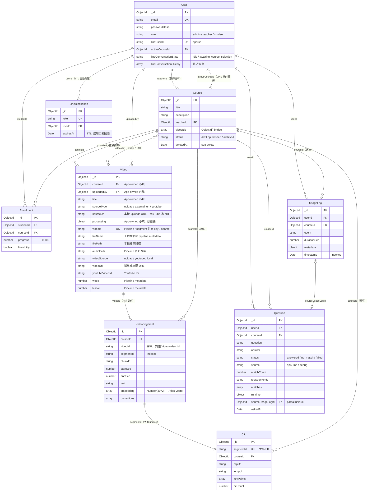

# FocusFlow 資料關聯圖

> 來源：`backend/src/models/*.js`（最後同步：2026-05-05）
>
> 兩種版本可選：
> - **Mermaid（本檔）**：純文字、Git 友善、GitHub/VSCode 直接預覽。改一個欄位只要改一行。
> - **draw.io**：[`data-model.drawio`](data-model.drawio) — 視覺化拖拉編輯（在 VSCode 安裝 `Draw.io Integration` 擴充套件即可直接開啟）。

---

## ER 圖（Mermaid）



---

## ⚠ Video 雙身份（同 collection 兩種文件）

`videos` collection 同時存放兩種互斥的文件，靠靜態方法區分：

| 類型 | 判別條件 | 用途 |
|------|----------|------|
| **App-owned** | `courseId` + `uploadedBy` + `title` + `processing.status` 全有值 | 教師從前端上傳的影片或貼上的 YouTube URL |
| **Pipeline metadata / legacy bridge** | 有 `videoId` 或 legacy `video_id` 且 **不** 是 App-owned | Python pipeline 寫入或舊資料保留的外部影片 metadata |

判別邏輯位於 [video.model.js:12-26](../src/models/video.model.js#L12-L26)：`Video.isAppOwnedRecord()` / `Video.isPipelineMetadataRecord()`。

設計目的：讓 QA pipeline 的外部影片可透過 `course.videoIds` 進入 QA 範圍，不需要獨立 collection。詳見 [bridgeScope.service.js](../src/services/bridgeScope.service.js)。

---

## 關鍵注意事項

| 主題 | 重點 |
|------|------|
| **VideoSegment 的 collection 名稱** | 由環境變數 `VIDEO_SEGMENT_COLLECTION` 決定（預設 `video_segments_text`），是為了對齊 AI Pipeline 寫入的 collection 並支援部署切換。正式 v1 契約另有 `video_segments_video` 用於影片多模態 embedding。 |
| **VideoSegment.videoId 是字串** | 不是 ObjectId！目前主要對應 `Video.videoId`；backend 也會在部分 bridge / cleanup 路徑用 `Video._id` 字串作為 segment key。Legacy `Video.video_id` 只保留讀取相容。 |
| **Question 使用 `userId`** | `questions` collection 的使用者欄位是 `userId`，不是 `studentId`；若統計或同步腳本讀到舊 `studentId`，需先轉成 `userId`。 |
| **Clip.segmentId 是字串** | 與 `VideoSegment.segmentId` 對應，用 string unique 而非 ObjectId ref。 |
| **`videoIds[]` vs `Video.courseId`** | 前者是 `Course` → `Video` 的 bridge 引用（多對多，可跨身份），後者是 `Video` → `Course` 的直接擁有（一對多）。BridgeScope 服務會合併兩者算出 QA 可搜尋範圍。 |
| **LineBindToken TTL** | `expiresAt` 加上 `expireAfterSeconds: 0` 索引，MongoDB 自動清除過期 token（10 分鐘有效）。 |
| **soft delete** | `Course` 與 `Video` 用 `deletedAt` 軟刪除，查詢時需過濾。 |

---

## 修改流程（給未來的你）

**改 Mermaid（推薦給日常更新）：**
1. 直接編輯本檔案的 ` ```mermaid ` 區塊
2. 在 VSCode 安裝 `Markdown Preview Mermaid Support` 擴充套件即可預覽
3. GitHub 會自動渲染

**改 draw.io（推薦給展示用大圖）：**
1. 在 VSCode 安裝 `hediet.vscode-drawio` 擴充套件
2. 雙擊 `data-model.drawio` 直接編輯
3. 或用瀏覽器開 https://app.diagrams.net/ → File → Open

**Schema 變動時要改的地方：**
1. 對應的 `backend/src/models/*.js`
2. 本檔的 Mermaid 區塊
3. `data-model.drawio`（若有展示需求）
4. `data-model.md`（學習筆記，有需要才改）
