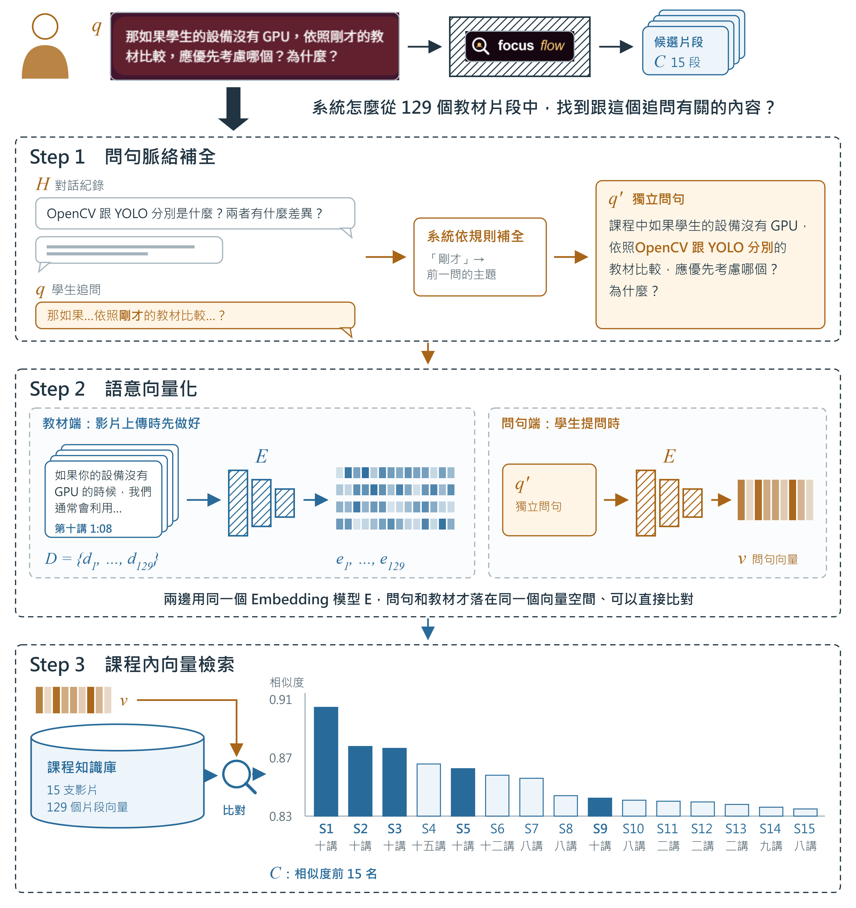
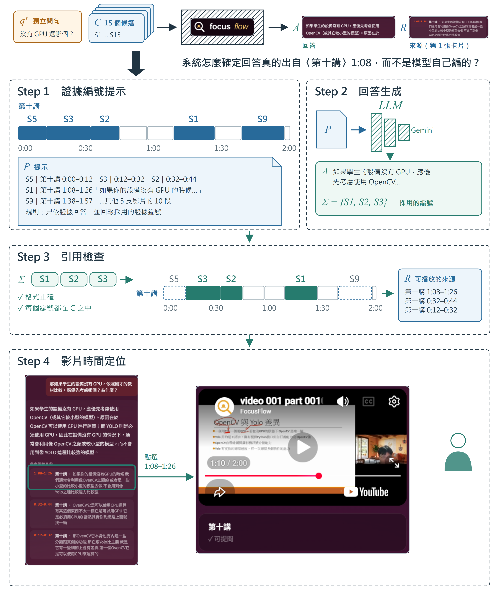
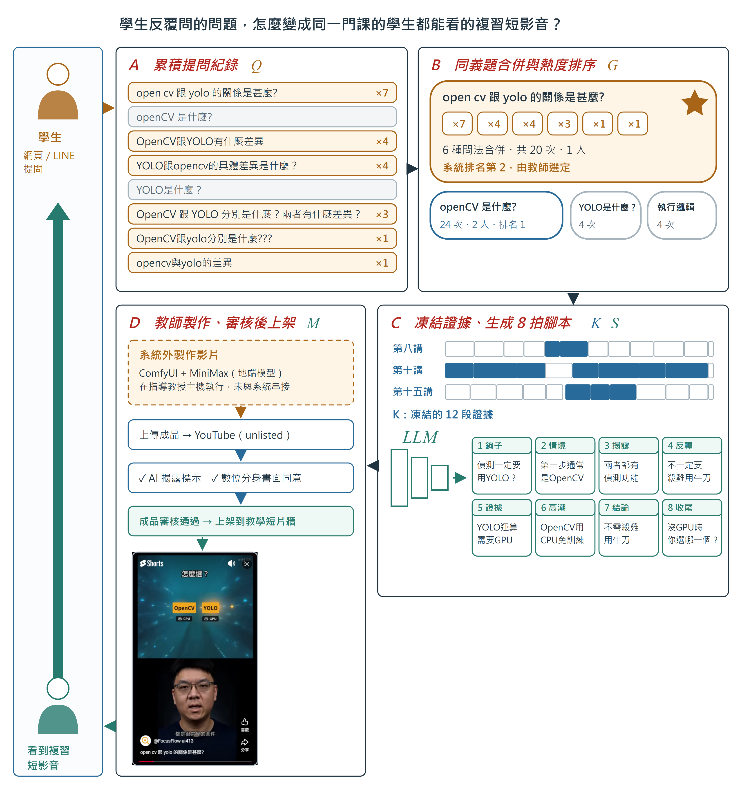

# 系統運作流程

以下以同一門課程〈影片處理工具 - OpenCV〉的真實使用紀錄為例，說明 Student 的追問如何找到相關教材、找到的 segment 如何變成附有影片 timestamp 的回答，以及反覆出現的提問如何轉為複習短影音。

## 追問如何找到相關教材

Student 在網頁多輪問答中提出追問後，系統會先補全追問的上下文，再將問句轉為語意向量，並只在該課程的影片範圍內檢索相似的 segment，作為後續回答的候選教材。為了讓讀者更清楚理解這段流程，其具體步驟如圖3-1-2所示。

圖3-1-2　學生的追問如何找到相關教材

針對圖3-1-2 的步驟，以下進行詳細說明：

- **問句脈絡補全：** Student 先問「OpenCV 跟 YOLO 分別是什麼？兩者有什麼差異？」，接著追問「那如果學生的設備沒有 GPU，依照剛才的教材比較，應優先考慮哪個？為什麼？」。追問中的「剛才」單獨拿去檢索會找不到內容，因此系統依規則從前一個問題取出主題，將追問補全為可單獨檢索的獨立問句 q′。此步驟不呼叫生成模型。
- **語意向量化：** 教材端的 segment 在 Teacher 上傳影片時，就已由 embedding 模型 E 轉為向量並存入資料庫；Student 提問時，系統以同一個模型 E 將 q′ 轉為問句向量 v。兩端使用相同的模型與向量維度，問句與教材才能直接比較。
- **課程內向量檢索：** 系統只在該課程的影片範圍內（本例為 15 支影片、129 個 segment）比對 v 與各 segment 向量的相似度，取相似度最高的 15 段作為候選 segment C，其中前三名皆來自〈第十講〉。圖中向量色塊為示意，相似度座標軸自 0.83 起算。

## 候選片段如何變成有來源的回答

延續同一個追問，系統將 15 個候選 segment 附上證據編號後交由生成式 AI 模型作答，並檢查模型引用的編號，只將實際採用的 segment 呈現為可回看的影片來源，Student 可再由來源跳回原影片核對教師的講解。其具體步驟與系統畫面如圖3-1-3所示。

圖3-1-3　候選片段如何變成有來源的回答

針對圖3-1-3 的步驟，以下進行詳細說明：

- **證據編號提示：** 每個候選 segment 依檢索排名給予證據編號 S1～S15。組成提示 P 時，系統將同一支影片的 segment 依影片時間排回原本的講解順序，編號維持不變，並要求模型只依證據作答。
- **回答生成：** 生成式 AI 模型除了產生回答 A，也必須回報實際採用的證據編號 Σ。本例 15 段候選中，模型採用了 S1、S2、S3 三段。若所有 segment 都沒有提到問題的主題，模型須回覆資料不足，且不附任何編號。
- **引用檢查：** 系統確認回傳格式正確，且每個編號都屬於本次的候選範圍，才將採用的 segment 轉為可播放的來源 R；未採用的 12 段不列為來源。此檢查確保回答引用的是本次實際提供的教材，但不代表逐句驗證回答內容。
- **影片時間定位：** Student 看到回答與三張引用卡片，點選〈第十講〉1:08–1:26 後，播放器即跳至該 timestamp，畫面正是教師比較 OpenCV 與 YOLO 的投影片。圖中系統畫面為正式網站截圖，引用卡片內文為語音轉寫原文。

## 反覆出現的提問如何變成複習短影音

同一門課程中反覆出現的提問，會在累積後另外啟動短影音製作流程：系統合併同義問題並排序，由 Teacher 選題後凍結證據、生成腳本，再由 Teacher 製作與審核影片，最後上架給同一門課程的學生，形成從學生出發、再回到學生的學習飛輪。此流程並非每次提問都會觸發，其具體步驟如圖3-1-4所示。

圖3-1-4　反覆出現的提問如何變成複習短影音

針對圖3-1-4 的步驟，以下進行詳細說明：

- **A 累積提問紀錄：** 系統彙整 Student 在網頁與 LINE 的提問紀錄 Q，並排除查無依據或回覆資料不足的題目。
- **B 同義題合併與熱度排序：** 系統將文字相同或語意相近的問法合併為同義題群 G，先依提問人數、再依提問次數排序。本例 6 種問法合併為「open cv 跟 yolo 的關係是甚麼?」一群，共 20 次提問，系統排名第 2，由 Teacher 選定為主題。本例的 20 次提問皆來自同一個測試帳號。
- **C 凍結證據、生成八拍腳本：** 選定主題後，系統檢索相關 segment 並補入同一支影片的相鄰片段，凍結為 12 段證據 K；再由 Gemini 產生八拍腳本 S，每一拍都標註引用的證據，並經 Teacher 審核通過。
- **D 教師製作、審核後上架：** Teacher 依腳本以外部工具（ComfyUI 搭配地端模型 MiniMax，尚未與本系統串接）製作影片 M 並上傳；上架前須確認 AI 揭露標示與數位分身書面同意，成品審核通過後才上架到該課程的教學短片牆。圖中 D 區下方即為 Student 於教學短片牆播放此短影音的系統畫面。
