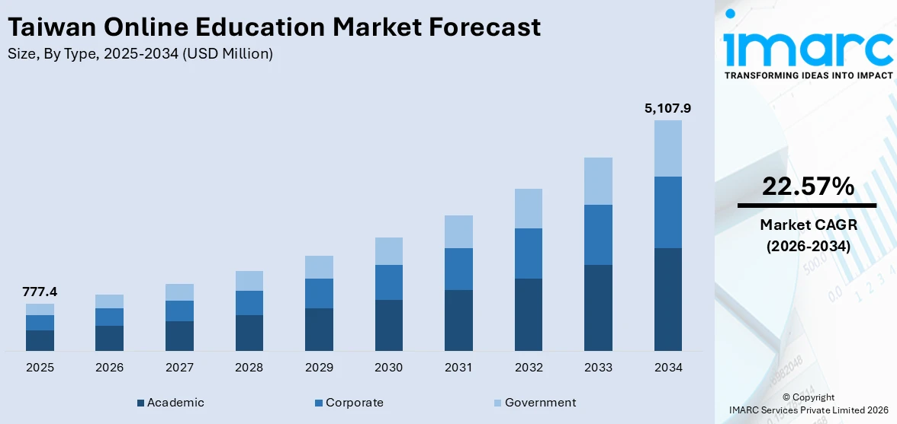
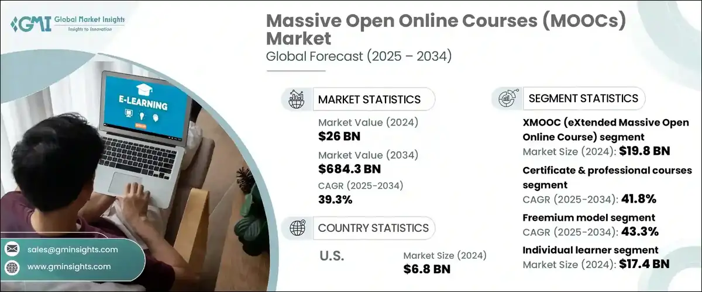

# 第1章 前言

> 現況基準：本章已於 2026-09-14 依目前程式碼、設定與專案現況文件完成第一階段文字校正。
> 初評市場圖表與競品比較仍屬歷史企劃資料，尚未重新查核，不作為 FocusFlow 功能完成或成效的證據。

[返回手冊索引](../README.md)

---

## 1-1 背景介紹

數位學習、混成教學、翻轉教學與大規模開放式線上課程，使課程錄影成為課前預習、課後複習及自主學習的重要教材。然而，影片長度與數量增加後，學習者即使知道想查找的觀念，也不一定知道內容出現在哪一支影片或哪一個時間點。僅靠章節標題與手動拖曳時間軸，容易耗費大量時間，也不利於針對問題反覆核對教師的原始說明。

FocusFlow 是以長篇教學影片為核心的 AI 學習輔助系統。系統將影片的語音內容轉為帶有時間資訊的逐字稿，再切分並建立可檢索的向量資料。學生可於網頁或完成帳號綁定後透過 LINE Bot 提問；系統依其修課範圍檢索課程內容，回傳回答、來源片段與影片時間點，讓學生能由答案回到原始教材核對前後文。

FocusFlow 不以取代教師或既有學習管理平台為目的。它所處理的是「如何從已授權的課程影片中找到與問題相關的內容」：教師仍負責教材、課程與修課名單，系統則提供影片處理、語意檢索、問答、學習進度及管理資訊等輔助能力。

## 1-2 動機

本專題源於下列教學現場問題：

1. 長影片的特定觀念不易定位，學生常須重看或反覆拖曳時間軸。
2. 學生課後遇到疑問時，未必能立即取得與該門課教材相符的說明。
3. 教師與助教可能重複回覆「哪一段影片有說明」等基礎問題。
4. 一般生成式 AI 的回答未必以教師實際教材為依據；若缺少來源與時間點，學生不易核對答案。
5. 行動裝置是常見的學習入口，因此系統除網頁外，也需要提供低學習門檻的提問方式。

初評原稿以台灣線上教育市場及全球 MOOCs 市場圖表說明數位學習環境。這些圖表保留作為企劃歷程，但其資料版本、原始統計口徑與授權狀態尚待人工重新確認。本手冊不以這些數值推論目前 FocusFlow 的市場成效。

> **歷史圖／待重製：** 下圖沿用初評原稿，尚未重新驗證資料來源與數值，也尚未依本手冊圖片規範更名。後續預定名稱應依最終圖序處理為「圖1-2-1-台灣線上教育市場規模-vX-x.png」。

圖1-2-1　台灣線上教育市場規模（初評歷史圖，待查核與重製）

> **歷史圖／待重製：** 下圖沿用初評原稿，尚未重新驗證資料來源與數值，也尚未依本手冊圖片規範更名。後續預定名稱應依最終圖序處理為「圖1-2-2-全球MOOCs市場規模-vX-x.png」。

圖1-2-2　全球 MOOCs 市場規模（初評歷史圖，待查核與重製）

## 1-3 系統目的與目標

FocusFlow 的主要目的，是把長篇教學影片轉換為可依課程權限搜尋、提問與回溯的學習資源。依目前專案實作，系統目標與邊界如下。

表1-3-1　系統目標、實際作法與目前範圍

| 目標 | 在 FocusFlow 中的實際作法 | 目前範圍 |
| --- | --- | --- |
| 建立可檢索的影片知識 | AI Pipeline 以 FFmpeg 擷取音訊、Faster-Whisper 產生逐字稿，完成正規化、分段與向量產物，再由匯入流程銜接 MongoDB | 單支 Pipeline 與可續跑的批次處理程式已存在；正式資料覆蓋率及共享 Atlas 契約仍須另行驗收 |
| 依課程內容回答 | 網頁與 LINE 問答共用後端問答服務，依授權課程範圍檢索片段，再由設定的回答供應者生成內容 | 已有回答狀態、來源片段與查無充分依據時的拒答語意；回答品質仍受逐字稿、向量、模型與部署設定影響 |
| 回到原始影片脈絡 | 回答可附來源影片、逐字稿摘要及起訖時間；網頁引用卡可跳轉對應影片時間點 | 已實作；若來源影片沒有可播放的 YouTube 連結，LINE 僅提示回網站查看時間點 |
| 落實角色與課程授權 | 使用者分為學生、教師、管理員；課程 API、QA、通知與 Shorts 依「有效修課紀錄且課程已發布」限制學生範圍 | 學生不得自助選課，MVP 沒有邀請碼；目前 `/uploads` 仍匿名提供本機媒體檔，是尚待修正的授權缺口，不能宣稱影片檔本身已完全受修課權限保護 |
| 支援教師管理影片 | 教師可建立與維護自己的課程、加入本機影片或 YouTube 連結、查看處理狀態、重試及管理課程影片關係 | 多檔前端使用單一 multipart 批次 API，並保存批次與單項狀態；真正的 Pipeline batch 模式由功能開關控制且預設關閉 |
| 支援多管道學習 | 網頁提供課程觀看、對話式問答、進度、通知及個人資料；LINE 提供綁定、課程選擇與問答 | LINE Webhook、憑證與外部連線仍須依部署環境個別驗收 |
| 提供營運與管理資訊 | 儀表板呈現課程、進度與問答統計；管理員可管理帳號、影片、事件及全站通知 | 統計反映系統已記錄的資料，不代表已證明學習成效 |
| 延伸短影音複習 | 學生牆只顯示其修課課程中已發布且可播放的 ShortAsset；教師端具候選、證據化腳本、人工成品上傳與審核流程 | 腳本自動化路由由功能開關控制且預設關閉；系統尚不會自動完成選段後的影片剪輯、9:16 渲染與字幕合成 |

除核心學習流程外，目前帳號功能也包含學生／教師自助註冊、忘記密碼、個人資料與密碼修改，以及經驗證的私有頭像讀寫；管理員入口獨立，且不開放管理員自助註冊。站內通知可呈現影片處理完成、系統公告及短影音成品退回等事件。這些功能用於形成可操作的產品流程，但不應被解讀為正式營運環境已完成全部安全、效能與可用性驗收。

初評原稿另以競品功能表呈現產品定位。由於第三方產品功能會持續變更，原表僅保留為待查核的企劃資料；下一版應重新確認比較日期、方案層級、測試條件與資料來源後再決定是否納入正式文件。

## 1-4 預期成果

本階段成果分為「目前已有程式依據的成果」與「仍待驗證或規劃的成果」，以避免將開發完成度與正式驗收混為一談。

### 已有程式依據的成果

- 建立學生、教師與管理員的角色式登入流程；學生及教師可自助註冊，管理員由獨立入口登入。
- 建立課程、影片、修課資格與觀看進度流程，並由後端對應用 API 執行課程所有權及修課權限檢查；本機 `/uploads` 媒體檔的匿名存取缺口仍待處理。
- 支援本機影片、YouTube 來源、單支與多檔上傳介面、處理狀態及失敗後重試。
- 建立從逐字稿、分段與向量資料到課程範圍問答的處理鏈，回答可附來源與影片時間點。
- 支援網頁對話紀錄與訊息重試，以及 LINE 帳號綁定、課程切換和問答。
- 提供角色儀表板、站內通知、個人資料、私有頭像、FAQ 快取與管理介面。
- 提供修課範圍內的短影音牆，以及由功能開關控制的教師短影音腳本與人工成品審核流程。

### 尚待驗證或後續發展的成果

- 正式學生試用、實際學習成效與教師減少答疑負擔的量化結果。
- 共享 Atlas 資料、索引及向量契約與目前 Pipeline 產物的一致性證據。
- Gemini、LINE、YouTube、STT 與正式部署在目標環境中的持續可用性、成本及容量驗證。
- 多影片 Pipeline batch 的正式環境負載與長時間執行驗收。
- 從來源影片自動決定剪輯區間、輸出剪輯檔、字幕與 9:16 版型渲染；現有腳本與人工成品發布流程不等同這套自動製作能力。
- 以真實使用資料驗證回答正確性、引用完整性、拒答品質與系統效能。

因此，本專題第一階段可主張的是：已建立一套以課程權限為邊界、可連結回答與原始影片片段的系統實作；不能僅依本機測試或既有程式碼，宣稱系統已正式上線、已完成學生試用驗收，或已證明能提升學習成效。
