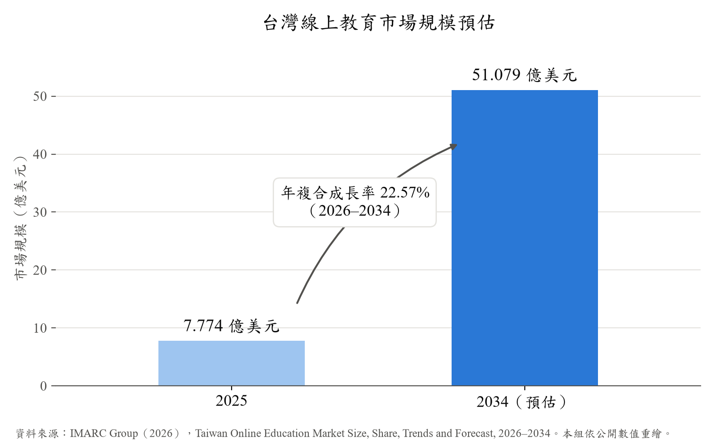
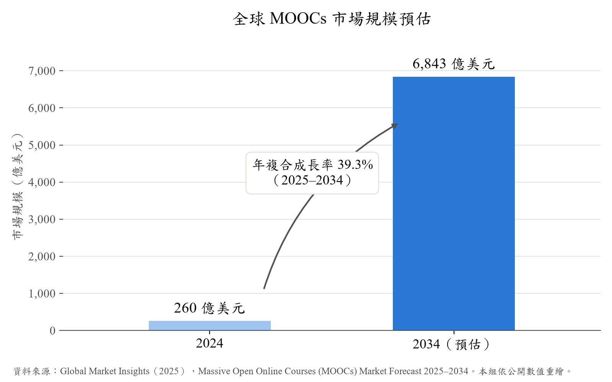

# 第1章 前言

## 1-1 背景介紹

近年來，數位學習、遠距教學、混成課程、翻轉教學與 MOOCs 線上課程已逐漸成為高等教育與自主學習的重要形式。教師可透過課程錄影、線上平台或雲端教材保存完整教學內容，學生也能依照自身時間安排，在課前預習、課後複習或考前回顧課程。然而，隨著教學影片數量增加與影片長度拉長，學生在複習時常面臨「知道自己想找某個觀念，卻不知道它出現在影片哪一段」的問題。

傳統教學影片多以播放時間軸、章節標題或手動拖曳方式瀏覽。對於一堂 40 至 90 分鐘的課程而言，學生若忘記概念出現位置，往往需要花費大量時間反覆搜尋，甚至可能因搜尋成本過高而放棄深入理解。另一方面，短影音與微學習形式也改變了學生取得資訊的習慣，學習者更期待快速進入重點並即時獲得回饋；但教育內容不同於一般短影音，不能只保留零散摘要，仍需連回原始課程脈絡，才能維持學習完整性。

因此，本專題希望開發一套結合 AI 影片理解、語音辨識、語意檢索與片段回放的學習輔助系統。系統將協助學生以自然語言對課程影片提問，並快速取得相關影片片段與重點內容，使長時間教學影片具備「可搜尋、可提問、可定位、可回到原始片段」的能力。透過此設計，學生能提升自主學習與複習效率，教師與助教也能減少重複性問題回覆的負擔。

## 1-2 動機

隨著線上教育與數位學習需求持續提升，課程影片已不再只是輔助教材，而逐漸成為學生課前預習、課後複習與自主學習的重要學習資源。為了說明本專題所處的教育環境與市場需求，本節先從台灣線上教育市場與全球 MOOCs 市場兩項資料進行觀察，以確認影片式教材與線上學習平台的發展趨勢。

圖1-2-1 顯示台灣線上教育市場在 2025 至 2034 年間呈現明顯成長趨勢，市場規模預估將由 2025 年的 7.774 億美元成長至 2034 年的 51.079 億美元，2026 至 2034 年複合年成長率達 22.57%（IMARC Group，2026）。此趨勢代表線上教育與數位學習需求正快速提升，課程影片、雲端教材與線上學習平台將成為學生自主學習的重要媒介。對本專題而言，當影片式教材使用量持續增加，如何協助學生更有效率地搜尋影片內容、定位重點片段並取得即時學習支援，便成為值得解決的實際問題。

圖1-2-1　台灣線上教育市場規模持續成長，顯示數位學習需求快速提升

圖1-2-2 顯示全球 MOOCs 市場規模預估將由 2024 年的 260 億美元成長至 2034 年的 6,843 億美元，2025 至 2034 年複合年成長率達 39.3%（Global Market Insights，2025），顯示開放式線上課程與自主學習市場具有高度成長潛力。MOOCs 課程多以影片作為主要教學形式，學習者通常需要自行安排時間觀看、理解與複習內容。然而，當課程影片數量龐大且單支影片時間較長時，學生容易面臨重點查找困難與無法即時提問的問題。因此，本專題 FocusFlow 可作為 MOOCs 或線上課程平台的輔助工具，透過 AI 問答、語意檢索與 timestamp 回溯，提升影片教材的可搜尋性與互動性。

圖1-2-2　全球 MOOCs 市場快速擴張，凸顯線上課程與自主學習發展潛力

兩張圖由本組依報告公開的起訖年數值與年複合成長率重繪；出版商未公開逐年數值，因此圖中只呈現起訖兩年。完整書目與查閱日期見第 14 章。

在翻轉教學與線上自學情境中，學生通常需要自行觀看影片並吸收課程內容。一旦遇到不理解的觀念，若無法即時獲得教師或助教協助，學習過程便容易中斷。現有學習平台多半將影片視為靜態教材，主要功能集中在影片上傳、播放、分類與管理，較少提供以課程內容為基礎的即時問答與片段定位機制。因此，學生若對影片內容產生疑問，仍需自行查找筆記、搜尋網路資料、詢問同學，或等待教師與助教回覆。這種延遲回饋不僅影響學習效率，也使影片教材的互動性與再利用價值受到限制。

另一方面，教師與助教也經常面臨學生重複提問的情況。例如，學生可能反覆詢問某個概念出現在影片哪一段、某個操作步驟如何完成，或考前應優先複習哪些課程片段。這類問題雖然屬於基礎學習需求，但若完全依賴教師與助教人工回覆，將增加教學支援負擔，也使教師較難將時間集中於進階教學、課程設計與個別化輔導。

此外，一般生成式 AI 工具雖然可以隨時回答問題，但其回答未必以教師實際使用的教材為依據，也不會指出教師在哪一段影片講過這個觀念。學生取得的是一段看似合理的文字，卻無法確認它與課堂說法是否一致。因此，若能透過系統協助學生先完成基礎問題查找與影片片段定位，將有助於降低學生卡關時間，也能減少教師與助教重複回答相似問題的負擔。

基於上述問題，本專題希望開發一套結合教學影片與 AI 問答的學習輔助系統，取名為「FocusFlow」。本系統並非取代教師教學，而是作為課後複習、影片教材整理與自主學習的輔助工具。透過讓學生能以自然語言對課程影片提問，並快速取得相關影片片段與重點內容，FocusFlow 期望讓長時間教學影片不再只是被動播放的教材，而能成為可搜尋、可提問、可回到原始課程脈絡的互動式學習資源。

## 1-3 系統目的與目標

隨著數位學習、翻轉教學與 MOOCs 線上課程逐漸普及，課程影片已成為學生課前預習、課後複習與自主學習的重要教材。然而，現有學習平台多半仍以「影片上傳、分類、播放」為主要功能，學生若想尋找特定觀念，通常只能依靠章節標題、筆記或手動拖曳時間軸。當課程影片時間較長、內容密度較高時，這種方式容易造成複習效率低落，也使學生在自學過程中遇到問題時無法即時獲得支援。

本系統旨在建立一套以長篇教學影片為核心的 AI 問答與 timestamp 回溯平台，協助教師將課程影片轉換為可搜尋、可提問、可定位的學習資料。與傳統影片播放平台不同，FocusFlow 不只是提供影片觀看功能，而是結合語音轉文字、影片內容切分、向量化檢索與相似度比對等技術，使學生能以自然語言對課程內容提問，並快速取得相關影片片段、重點內容與原始時間碼。系統目標並非取代教師教學，而是作為課後複習、影片教材整理與自主學習的輔助工具，讓學生學習不中斷，也協助教師與助教減少重複回答基礎問題的負擔。

本系統設計遵循以下核心目標：

1. **建立可搜尋的教學影片資料架構**：本系統將教師上傳的 video 轉換為可被查詢的學習資料。系統會透過 FFmpeg 進行音訊抽取，並使用 STT 語音轉文字技術產生逐字稿，再依據時間與語意進行 segment 切分，使原本只能被播放的長影片，能被整理為具有時間碼、段落內容與課程脈絡的結構化資料。系統另保留以 YouTube 課程連結匯入影片的介面，供後續擴充使用。

2. **實現影片內容向量化與語意檢索**：本系統透過 Gemini Embedding 技術，將逐字稿切分後的 segment 進行向量化處理。完成 embedding 後，系統可將學生問題與課程片段轉換為可比對的向量資料，作為後續語意搜尋與問答回覆的基礎；正式環境以 MongoDB Atlas Vector Search 執行檢索。影片畫面的向量資料已預留結構，目前尚未納入問答流程。

3. **提供自然語言問答與快速片段定位**：本系統支援學生以自然語言針對課程內容提問，並透過 Cosine Similarity 餘弦相似度演算法，比對學生問題與影片段落之間的語意相似度，快速找出最相關的 segment。透過此設計，學生不需要手動拖曳整部影片，即可直接取得與問題相關的課程片段與初步回答。為控制使用成本與回答品質，系統設有單題字數上限、每位學生每日提問次數上限，以及相似問題的 FAQ 快取機制。

4. **保留原始課程脈絡與時間戳（timestamp）回溯能力**：本系統在 AI 回答中會提供相關 timestamp，使學生能從系統回覆直接回到原始影片片段確認內容。若教材中找不到足以回答的依據，系統會明確回覆資料不足，不以課外內容補充。此設計能避免 AI 回答與課程教材脫節，讓學生在快速取得答案的同時，仍能回到教師原始講解脈絡中理解前後概念，提升學習可信度與複習完整性。

5. **建立學生與教師皆可使用的課程管理流程**：本系統第一階段 MVP 建立 Student、Teacher、Admin 三種角色權限與登入機制。Teacher 可建立 course 並上傳 video，系統會記錄影片處理狀態，讓使用者確認影片是否已完成 AI Pipeline 處理；Student 僅能針對自己有修課紀錄且已發布的 course 進行提問，修課名單由 Teacher 或 Admin 指派；Admin 則由獨立入口登入，管理使用者、課程、影片、系統事件與全站公告。

6. **串接 LINE Bot 與 Web 介面，提升使用便利性**：本系統提供 Web 介面作為主要操作平台，並串接 LINE Bot，使學生完成 LINE 帳號綁定後，能在熟悉的通訊環境中進行課程問答與切換課程。此設計能降低學生使用門檻，讓學習支援不侷限於單一平台，而能延伸至日常通訊情境中，達到隨時提問、即時查找課程片段的效果。

7. **降低影片儲存與播放成本**：本系統可將課程影片自動上傳至 YouTube（設為不公開），並透過 iframe 嵌入方式於前端網頁播放。系統本身主要儲存影片 metadata、逐字稿、segment、embedding 與 timestamp 等資料，不直接承擔大量影音串流成本，藉此降低伺服器頻寬負擔，也提升系統未來擴充與部署的可行性。需說明的是，「不公開」代表取得連結者即可觀看，與「僅限修課學生」並不相同。

8. **由學生提問產生教學短影音**：系統以課程的提問紀錄為來源自動選題，生成以課程片段為依據的短影音腳本；教師依腳本製作影片並上傳，經審核通過後才上架，且僅限該課程的修課學生可見。透過此設計，學生的提問不只換得一次性回答，也回過頭成為課程的複習素材。

下表整理 FocusFlow 與現有學習工具的功能差異。相較於一般影片平台或單純 AI 聊天工具，FocusFlow 的核心特色在於能將「學生提問」與「原始課程影片片段」連結，使學生不只得到文字回覆，也能回到影片時間點確認教師講解內容。表中第三方工具的功能為本組於 2026 年 9 月觀察所得，各工具可能隨改版調整。「生成短片」一列中，FocusFlow 產出的是附引用的短影音腳本，影片由教師以外部工具製作並經審核後上架，故標記為部分支援。

表1-3-1　現有學習工具與 FocusFlow 功能比較表

| 項目／系統 | FocusFlow | NotebookLM | 一般課程影片平台 | YouTube 章節功能 | 一般 AI 聊天工具 | 校內 LMS 平台 |
| --- | --- | --- | --- | --- | --- | --- |
| 課程影片播放 | V | △ | V | V | X | V |
| 課程影片上傳與管理 | V | △ | V | V | X | V |
| 自然語言提問 | V | V | X | X | V | X |
| 依課程內容回答 | V | V | X | X | △ | X |
| 回傳影片 timestamp | V | △ | X | V | X | X |
| 連回原始影片片段 | V | △ | X | V | X | X |
| 影片內容向量化檢索 | V | △ | X | X | X | X |
| 減少教師／助教重複答疑 | V | V | X | X | △ | X |
| 學生提問紀錄輔助教材調整 | V | X | X | X | X | △ |
| 生成短片 | △ | V | X | X | △ | X |
| 依學生提問紀錄選題 | V | X | X | X | X | X |
| 學習脈絡保留 | 高 | 中 | 中 | 中 | 低 | 中 |

從表1-3-1 可看出，FocusFlow 並非單純的影片播放平台，也不是一般聊天式 AI 工具。一般課程影片平台與 LMS 雖能提供影片播放與教材管理功能，但較缺乏以影片內容為基礎的即時問答與語意檢索能力；一般 AI 聊天工具雖可回答問題，卻不一定能對應到教師實際講解的課程片段。FocusFlow 則透過 STT、segment 切分、Gemini Embedding、Cosine Similarity 與 timestamp 回溯設計，讓學生能直接以問題定位影片重點，並回到原始課程脈絡中確認內容，進而提升影片教材的可搜尋性、互動性與複習效率。

除工具類型的比較外，表1-3-2 進一步比較 FocusFlow 與目前市面上學習平台在「以 AI 回答課程影片問題」上的做法。表中資料依各平台官方說明頁整理，查核日期為 2026-09-19；官方說明未提及的項目標為「官方說明未提及」，不代表該平台一定沒有此功能。

表1-3-2　FocusFlow 與現有線上學習平台的課程 AI 問答比較

| 比較面向 | PressPlay Academy | Hahow 好學校 | Udemy | Coursera | FocusFlow |
| --- | --- | --- | --- | --- | --- |
| 課程來源 | 平台上架的創作者課程 | 平台上架的講師課程 | 講師上架的課程 | 大學與企業夥伴的課程 | 授課教師自己的課堂錄影 |
| 學生取得方式 | 訂閱或購買單課 | 購買課程（另有會員制度） | 購買課程或個人訂閱方案 | 付費訂閱或課程 | 由 Teacher 或 Admin 指派修課 |
| AI 課程問答 | 有，「AI 助教」Beta，限 Plus 訂閱方案，每日 20 則 | 曾推出「Hahowise」AI 學習助教（Beta），官方介紹頁已下架，現況無法確認 | 有，「AI Assistant」，只在講師參加 Udemy GenAI 計畫的課程提供 | 有，「Coursera AI」，限 Coursera Plus 等付費方案 | 有，每位學生每日預設 5 題 |
| AI 回答範圍 | 使用者有觀看權限的 Plus 內容，可跨課程整理 | 無法確認 | 目前正在上的課程 | 課程內容，並參考學習者個人檔案 | 學生有修課且已發布的 course |
| 回答指向影片片段 | 官方說明會「提供對應的影片段落」 | 無法確認 | 官方說明未提及 | 官方說明未提及 | 附起訖 timestamp，網頁可直接跳到影片時間點 |
| 提問入口 | 僅網頁版，App 規劃中 | 無法確認 | 網頁與手機瀏覽器 | 網頁，App 內有限 | Web 介面與 LINE Bot |
| 短影音產出 | 官方說明未提及 | 無法確認 | 官方說明未提及 | 官方說明未提及 | 依提問紀錄自動選題並生成附引用腳本，教師製作影片、審核通過後上架，僅該課程修課學生可見 |
| 教材中文支援 | 繁體中文 | 繁體中文 | AI Assistant 支援簡體中文，不含繁體中文 | 未查證 | 繁體中文 |

由表1-3-2 可看出，「以 AI 回答課程內容並指回影片段落」已是線上學習平台共同發展的方向，其中 PressPlay Academy 的 AI 助教同樣以課程逐字稿為依據並提供對應影片段落。FocusFlow 的差異不在於是否具備 AI 問答，而在於服務情境與範圍：商業平台的 AI 助教涵蓋的是平台上架、學生付費取得的課程，FocusFlow 則讓授課教師直接上傳自己的課堂錄影，由系統自動完成語音轉文字與索引，並依修課名單限定每位學生可查詢的範圍；提問入口除 Web 介面外另提供 LINE Bot；有找到依據的回答都附可跳轉的 timestamp，教材中找不到依據時明確拒答並不附來源。此外，FocusFlow 另將提問紀錄回饋為教材：系統依學生實際提出的問題自動選題並生成短影音腳本，經教師製作與審核後上架，供同課程學生複習；四個比較平台的官方說明頁均未提及以學習者提問紀錄產出複習短影音的功能。

## 1-4 預期成果

本專題預期完成一套可實際操作的 FocusFlow 第一階段 MVP，讓長篇教學影片不再只是被動播放的教材，而能被轉換為可搜尋、可提問與可回溯的互動式學習資源。系統以「課程影片 AI 問答」為核心，完成登入與課程列表、教師上傳影片與處理、LINE 帳號綁定、LINE Bot 提問與 timestamp 跳轉等主要流程，使學生能在課後複習或自主學習時，透過自然語言提問快速找到相關影片片段，並回到原始課程脈絡中補充理解；系統並已部署於學校虛擬機，可經 `https://focusflow.ntub.edu.tw` 以受信任憑證連線，校內試用自 2026-09-21 起於兩門 course 進行，共 27 位學生完成修課指派。

在學生使用情境中，本系統希望能縮短學生從「產生疑問」到「找到對應影片內容」的時間。當學生忘記某個概念出現於影片哪一段時，不再需要反覆拖曳進度條或重新觀看整部影片，而是能透過 AI 問答取得初步回覆、相關 segment 與 timestamp，進一步跳轉至原影片確認教師講解內容。學生亦可在修課範圍內瀏覽由教師審核後上架的短影音，作為複習輔助；這些短影音的主題來自學生實際提出的問題，使提問紀錄能回饋為課程教材。截至 2026-09-25，系統已產生 5 份短影音腳本（其中 3 份通過教師審核），並有 2 支短影音完成上架。透過此設計，系統預期能提升課後複習、考前整理與自主學習的效率，降低學生因找不到片段或等待回覆而中斷學習的情況。

在教師與助教使用情境中，本系統預期能提升教學影片的再利用價值，並減少重複性問題回覆的負擔。教師上傳課程影片後，系統將透過 AI Pipeline 自動建立逐字稿、segment 與 embedding，使影片內容能被檢索與問答使用；教師另可查看影片處理狀態、重試失敗項目、管理修課名單，並在短影音流程中確認腳本與成品。此外，當多位學生針對同一個觀念或同一段影片提出疑問時，教師可由提問紀錄判斷該段教材是否說明不夠清楚，進一步補充教材、調整課程設計或在課堂中加強說明。助教與教師因此可將更多時間投入進階概念說明、課程設計與個別化輔導，而非反覆協助學生查找相同影片片段或回答基礎問題。

在系統實作層面，本階段完成前端、後端、MongoDB、AI Pipeline 與 LINE Bot 的基礎串接，並建立可延伸的資料處理流程。系統保存課程、影片 metadata、逐字稿、segment、embedding 與 timestamp 等必要資料，作為後續問答檢索與影片回溯的基礎。

除核心問答流程外，本階段另完成四項輔助介面，使三種角色都能在系統內完成日常工作：

- **角色儀表板**：依登入者身分顯示不同摘要。學生看到自己修課的課程數、影片觀看進度與近期提問；教師看到自己開設的課程、影片處理狀態與課程的提問統計；管理員看到全站的使用者、課程、影片與提問數量。
- **站內通知**：系統在特定事件發生時主動通知使用者，例如教師上傳的影片完成 AI Pipeline 處理、短影音成品被退回需要修改，或管理員發布全站公告。通知保留已讀狀態，避免重複查看。
- **學習進度**：系統記錄學生開啟與看完的影片，學生可在課程頁看到自己還有哪些影片尚未觀看，教師則可由統計掌握課程整體的觀看情形。
- **管理介面**：管理員由獨立入口登入，可停用或啟用帳號、查詢與刪除影片、檢視系統事件與各項服務狀態，並發布全站公告。

回答品質方面，本專題建立一組固定的 50 題題庫，涵蓋單一片段可答的事實題、需跨片段歸納的整合題，以及課程教材中沒有答案的負向題，並依正確性、忠實性、完整性、引用與 timestamp、清晰度、拒答恰當性六個面向逐題評分（每面向 1 至 5 分）。第一輪評測（2026-08-24）的加權分數為 4.35／5，第二輪（2026-09-03）提升至 4.68／5；兩輪的致命錯誤皆為 0，亦即系統未出現編造課程教材以外內容的情形，負向題也都正確回覆資料不足。此結果僅代表該題庫與該次執行設定下的表現，評測方式、逐題結果與判讀邊界見第 10 章。

至於未來可擴充的方向，包括：依學生的提問與觀看紀錄分析學習歷程、由系統自動評估每次回答的品質並標記需人工檢查的案例、為每支影片自動整理重點摘要、細化角色權限（例如區分助教與教師）、以及依個別學生的學習狀況推薦優先複習的片段。上述功能目前僅為規劃方向，不列為本階段 MVP 的驗收範圍。

整體而言，FocusFlow 預期能證明「長篇教學影片」可以透過 AI 技術轉換為具備搜尋、問答與片段定位能力的學習資源。其核心價值不在於取代教師，而是協助學生在課後學習過程中更快找到答案，也協助教師與助教降低基礎問題支援負擔，進一步提升影片教材在翻轉教學、MOOCs 與線上課程中的應用價值。
