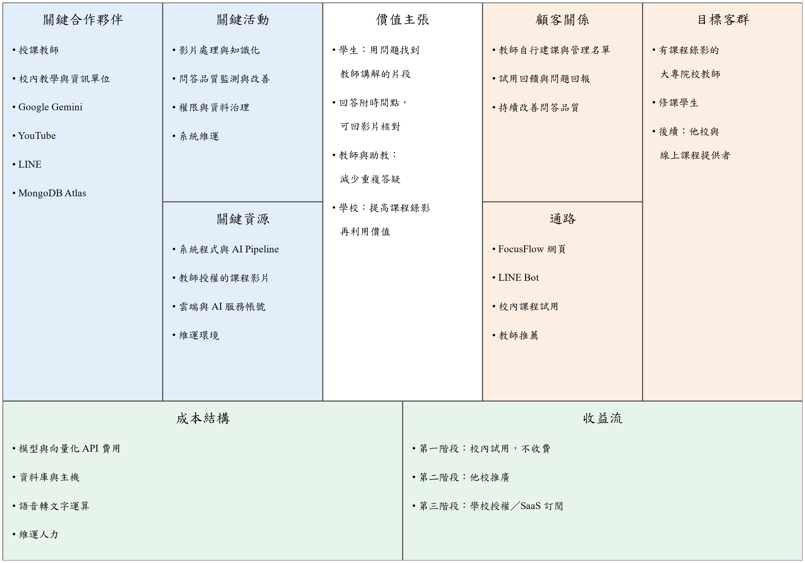

# 第2章 營運計畫

## 2-1 可行性分析

本節從技術、教育應用、操作、經濟與營運、法律與資料使用五個面向，評估 FocusFlow 是否具備實際開發與導入的條件。FocusFlow 已有可運作的系統實作，因此各面向會同時說明「目前已經做到什麼」與「還缺哪些證據」；程式碼與本機測試只能證明具備實作基礎，不能直接證明正式營運的效能、學習成效或商業可行性。

### 技術可行性

FocusFlow 採前後端分離加上離線 AI Pipeline 的架構。前端以 React 與 Vite 建立單頁式應用程式，後端以 Node.js、Express 與 Mongoose 提供 REST API，資料存放於 MongoDB；AI Pipeline 以 Python 撰寫，負責把影片轉成可檢索的逐字稿片段與向量。表2-1-1 列出每項核心功能所使用的技術，以及目前的完成狀態。

表2-1-1　核心功能、使用技術與功能範圍

| 核心功能 | 使用技術 | 功能範圍與邊界 |
| --- | --- | --- |
| 身分與權限 | JWT、bcrypt、角色中介層、獨立管理員入口、修課資格檢查 | 本機影片檔以 `/uploads` 路徑提供，檔案本身不另行驗證修課權限 |
| 課程與影片管理 | React、Express、MongoDB | 教師上傳本機影片（單支或多支），系統記錄處理狀態並可重試失敗項目；支援 attach／detach 與重複檔案檢查 |
| 音訊擷取與語音轉文字 | FFmpeg、Faster-Whisper | 教師上傳後由後端自動觸發 Pipeline |
| 逐字稿分段與向量化 | 正規化與分段程式、Gemini Embedding（gemini-embedding-2，3072 維） | 多影片批次 Pipeline 具 manifest、lease 與 checkpoint resume，由 `VIDEO_BATCH_PIPELINE_ENABLED` 控制，預設關閉 |
| 問題與片段比對 | 向量相似度（Cosine Similarity）；正式環境可改用 MongoDB Atlas Vector Search | 只在學生有權限的課程範圍內檢索 |
| 生成回答並附時間點 | Gemini 生成模型；回答附來源片段與起訖時間 | 第二輪內部評測加權 4.68／5、致命錯誤 0（見第 10 章） |
| 網頁與 LINE 提問 | React 網頁、LINE Messaging API | LINE Webhook 經通道服務連入後端 |
| 影片播放與頻寬 | YouTube Data API 自動上傳（不公開）＋ iframe 嵌入 | 正式環境啟用自動上傳；unlisted 連結可被轉傳 |
| 通知與統計 | 站內通知、已讀狀態、角色儀表板與使用事件記錄 | 統計反映系統已記錄的行為，不能直接解讀為學習成效 |
| 短影音複習 | 學生修課限定 feed、ShortAsset 狀態；教師候選片段、證據腳本與人工成品審核 | 腳本自動化預設關閉；系統不自動執行剪輯、9:16 渲染、配音或字幕合成 |

由表2-1-1 可看出，FocusFlow 的每項核心功能都有對應的實作，而不只是停在概念。系統自 2026-09-10 起部署於學校虛擬機，可經 `https://focusflow.ntub.edu.tw` 從校外連線。技術面的主要風險不在「做不做得出來」，而在正式環境的長期穩定性：外部 AI 服務的可用性與配額，以及 LINE Webhook 對通道服務的依賴。

### 教育應用可行性

FocusFlow 適用於已經有課程錄影的課程，主要情境是課後複習、缺課補學、考前整理與翻轉教學。學生以問題進入內容，不必從頭拖曳時間軸；回答附有來源片段與時間點，學生可以回到教師的原始講解核對。對教師與助教而言，「這個概念在哪一段影片有講」這類定位型問題，可先由系統回答，減少重複答疑。

系統不以 AI 取代教師。教師仍決定教材內容與修課名單；系統只在教師上傳的教材範圍內回答，教材中找不到依據時明確回覆無法回答，而非自行補充課外內容。

學習成效須以校內試用資料驗證，應觀察的指標包括：找到目標片段所需時間、引用連結的點擊與回看情形、學生對回答有無幫助的評價、拒答是否恰當，以及教師實際減少的答疑時間。本章就教育情境的適用性提出說明，不主張已提升成績或學習效率。

### 操作可行性

各角色都不需要接觸資料庫或 AI Pipeline：

- **學生**：登入後查看已指派的課程、觀看影片、在網頁上以對話方式提問；也可以在「LINE Bot」頁面取得一次性綁定資訊，綁定 LINE 後直接在 LINE 上提問與切換課程。
- **教師**：在網頁建立課程、管理修課名單、上傳影片並查看處理進度，處理失敗時可自行重試。
- **管理員**：由獨立入口登入，管理帳號、影片、系統事件、統計與全站公告。

介面提供處理狀態、錯誤訊息與失敗重試。LINE、YouTube 或 AI 服務暫時無法使用時，相關功能會失敗或降級，系統不是可完全離線運作的產品；各功能的實際操作畫面見第 12 章。

### 經濟與營運可行性

FocusFlow 第一階段定位為畢業專題與校內試用，不是已商業營運的產品。系統沿用成熟的開源框架與雲端服務，不自行開發影音串流、語音辨識模型或向量資料庫，大幅降低初期開發成本。

持續營運的成本主要來自外部服務與主機。表2-1-2 列出主要成本項目，以及系統中已經實作、用來控制這些成本的機制。

表2-1-2　主要營運成本與已實作的控制機制

| 成本項目 | 產生原因 | 已實作的控制機制 |
| --- | --- | --- |
| 生成模型費用 | 每次問答呼叫 Gemini 產生回答 | FAQ 快取：相同或高度相似（相似度 ≥ 0.95）的問題直接回覆，不再呼叫模型；每位學生每日提問上限（預設 5 題）與單題字數上限（預設 50 字） |
| 向量化費用 | 影片片段與學生問題都需要 embedding | 影片只在上傳或重新處理時向量化一次；逐字稿與向量存於資料庫重複使用 |
| 影片儲存與串流頻寬 | 課程影片檔案大、播放流量高 | 自動上傳至 YouTube 並以 iframe 播放（正式環境已啟用），由 YouTube 承擔串流；系統主要保存逐字稿、片段、向量與影片資訊 |
| 語音轉文字運算 | Faster-Whisper 需要 CPU／GPU 運算 | 在自有主機離線執行，不按次付費；失敗時只重試失敗的影片 |
| 主機與資料庫 | 學校虛擬機、MongoDB Atlas、網域與憑證 | 使用學校提供的虛擬機；HTTPS 憑證採 Let's Encrypt 免費憑證並自動續約 |

每門課與每位學生的成本核算需要下列用量資料：每小時影片的轉錄與向量化成本、每次問答的模型費用、FAQ 快取命中率、資料庫與備份用量、YouTube API 配額與維運工時。本章不提出確定的售價或損益結論。

### 法律與資料使用可行性

FocusFlow 處理的資料包括帳號資料、課程影片、逐字稿、提問與回答紀錄、觀看事件與 LINE 識別碼，涉及下列法律與平台規範：

- **著作權**：影片、聲音、簡報及其中引用的第三方素材，需由上傳的教師確認具有上傳、轉錄、向量化並提供修課學生使用的權利。系統要求教師上傳自己的教材，不另行下載或散布他人影片。
- **個人資料保護**：學生的帳號、提問紀錄與學習歷程屬個人資料，蒐集與利用應符合《個人資料保護法》的告知與目的限制。系統回應中不回傳密碼雜湊與 LINE 識別碼，錯誤訊息在正式環境不回傳內部細節；但資料保存期限、刪除申請與外部 AI 服務的資料處理條款，仍需團隊訂定正式規則。
- **平台規範**：使用 YouTube Data API 上傳與嵌入影片需遵守 YouTube 服務條款；LINE Bot 需遵守 LINE 官方帳號與 Messaging API 規範。
- **AI 回答揭露**：回答附上來源片段與時間點，讓學生能回到原始影片核對；短影音成品上架前，系統要求教師確認 AI 揭露標示與數位分身同意。

系統已在 API 層以角色、課程擁有者與修課資格限制資料存取，但仍有兩項邊界需要說明：第一，本機影片檔的 `/uploads` 路徑目前可經 ngrok 通道匿名讀取；第二，上傳至 YouTube 的影片採「不公開」而非「私人」，是因為私人影片無法嵌入播放，代表取得連結的人仍可觀看。權限機制也不等於完整的法遵方案，這些缺口需在正式導入前處理。

## 2-2 商業模式－Business model

本節以 Business Model Canvas 九宮格整理 FocusFlow 的商業模式（表2-2-1、圖2-2-1）。第一階段的重點不是營利，而是先驗證「學生是否真的用問題找片段」「教師是否願意提供教材」這兩個前提；前提成立後，再依團隊於 2026-05-19 指導會議決議的三個推廣階段擴大導入。

表2-2-1　FocusFlow 商業模式九宮格

| 構面 | 內容 |
| --- | --- |
| 目標客群 | 有課程錄影的大專院校教師與修課學生；後續擴及他校與線上課程提供者 |
| 價值主張 | 學生：以問題直接找到教師講解的影片片段，回答附時間點可核對。教師與助教：減少重複回答定位型問題。學校：提高既有課程錄影的再利用價值 |
| 通路 | FocusFlow 網頁、LINE Bot；校內課程試用與教師推薦 |
| 顧客關係 | 教師自行建立課程與管理名單；透過試用回饋與問題回報持續改善 |
| 收益流 | 第一階段不收費，以校內試用與需求驗證為主；後續規劃學校授權與 SaaS 訂閱 |
| 關鍵資源 | 系統程式、AI Pipeline、教師授權的課程影片、雲端與 AI 服務帳號、維運環境 |
| 關鍵活動 | 影片處理與知識化、問答品質監測與改善、權限與資料治理、系統維運 |
| 關鍵合作夥伴 | 授課教師、校內教學與資訊單位；Google（Gemini、YouTube）、LINE、MongoDB 等服務供應商 |
| 成本結構 | 模型與向量化 API、資料庫、主機、語音轉文字運算、維運人力（見表2-1-2） |

圖2-2-1　FocusFlow 商業模式九宮格

在收益與效益方面，FocusFlow 對學校的價值主要是「降低成本」而非直接販售內容：若系統能分擔教師與助教回答定位型問題的時間，並讓既有課程錄影被更有效地使用，就能以教學支援效益說明導入理由。推廣依下列三個階段進行，每個階段都以前一階段的驗證結果作為進入條件：

表2-2-2　推廣階段規劃

| 階段 | 做法 | 進入下一階段的條件 |
| --- | --- | --- |
| 一、校內測試 | 在本校已有錄影的課程試用，免費提供 | 取得試用數據：學生實際使用率、找到片段的時間、回答滿意度、教師答疑負擔的變化 |
| 二、他校推廣 | 以校內試用成果向他校教師或教學單位推廣 | 確認跨校導入所需的帳號整合、教材授權與維運分工 |
| 三、SaaS 授權 | 以學校或單位為對象，依課程數或使用量收取授權或訂閱費用 | 完成成本試算、服務水準與資料治理規範，並確認願付價格 |

以上三階段為推廣規劃。願付價格與採購流程需於校內試用階段一併驗證。

## 2-3 市場分析－STP

本節以 STP（市場區隔、目標市場、產品定位）分析 FocusFlow 的市場位置。

### 市場區隔（Segmentation）

依「是否有長篇課程錄影」與「是否有明確的修課名單」兩個條件，可將潛在市場分為三個區隔：

1. **大專院校課程**：教師有固定的課程錄影，修課名單明確，學生有課後複習與考前整理的需求。教材授權由授課教師本人處理，導入門檻最低。
2. **線上課程平台與自學者**：課程影片數量龐大，學習者多半非同步自學。但如第 1 章表1-3-2 所示，PressPlay Academy、Udemy、Coursera 等平台已開始在自家課程中導入 AI 助教。
3. **補習教育與企業內訓**：有大量訓練影片，也有明確的學員名單，但對權限稽核、資料保存與服務水準的要求較高。

### 目標市場（Targeting）

FocusFlow 第一階段以**大專院校課程**為目標市場，主要使用者是修課學生，教師與助教則是導入的關鍵決策者。選擇此區隔的理由有三：

- 課程錄影已經存在，不需要另外製作內容，教師上傳即可使用。
- 修課名單明確，正好對應系統「依修課資格限定問答範圍」的設計。
- 商業線上課程平台的 AI 助教只涵蓋平台上架的付費課程，學校自己的課堂錄影不在其服務範圍內。

線上課程平台、補習教育與企業內訓列為後續方向；目前系統沒有可直接安裝到 LMS 或其他平台的外掛，不將整合能力寫成已完成。

### 產品定位（Positioning）

FocusFlow 定位為「**學校課堂錄影的 AI 問答助教：只依授課教師的教材回答，並帶學生回到影片中的講解時間點**」。與各類競爭者的區隔如下：

- **相較於一般影片平台與學校的錄影系統**：不只提供播放與章節，學生可以直接用問題找到片段。
- **相較於一般 AI 聊天工具**：回答只依據該門課的教材，附來源與時間點；找不到依據時明確拒答。
- **相較於商業線上課程平台的 AI 助教**：服務對象是學校自己的課堂錄影與修課學生，而不是平台上架販售的課程；並提供 LINE 作為提問入口。
- **相較於學習管理系統（LMS）**：聚焦影片知識化與問答，不取代作業、成績、點名等教務功能。

## 2-4 競爭力分析SWOT-TOWS

本節以 SWOT 整理 FocusFlow 的內部優勢、劣勢與外部機會、威脅（表2-4-1），再以 TOWS 交叉比對提出因應策略（表2-4-2）。

表2-4-1　SWOT 分析

| 類型 | 分析內容 |
| --- | --- |
| 優勢（Strengths） | 1. 回答附來源片段與可跳轉的影片時間點，學生可回到原始講解核對。 2. 問答範圍依修課資格限定，找不到依據時明確拒答；內部評測致命錯誤為 0。 3. 同時提供網頁與 LINE 兩種提問入口，共用同一套權限與問答服務。 4. 教師上傳影片後自動完成語音轉文字與向量化，不需額外製作內容。 5. 系統已部署並可從校外以 HTTPS 連線。 |
| 劣勢（Weaknesses） | 1. 尚未進行正式學生試用，缺乏學習成效與使用數據。 2. LINE 依賴 ngrok 通道，且該通道使 `/uploads` 影片檔可被匿名讀取。 3. 回答品質依賴語音轉文字品質與外部模型，評測只涵蓋單一題庫。 4. 尚無每門課或每位學生的成本數據。 5. 團隊規模小，長期維運人力有限。 |
| 機會（Opportunities） | 1. 線上教育與 MOOCs 市場持續成長（見第 1 章圖1-2-1、圖1-2-2），課程錄影愈來愈多。 2. 商業平台的 AI 助教只服務自家上架課程，學校課堂錄影仍缺乏類似工具。 3. Udemy 的 AI Assistant 目前不支援繁體中文課程，繁體中文教材的 AI 問答仍有空間。 4. 學生普遍使用 LINE，可降低提問門檻。 |
| 威脅（Threats） | 1. PressPlay Academy 的 AI 助教已能依逐字稿回答並提供對應影片段落，同類功能可能被其他平台或 LMS 快速跟進。 2. 通用 AI 工具持續進步，學生可能直接使用而不經過課程系統。 3. 依賴 Google Gemini、YouTube、LINE 等外部服務，其價格、配額或規範變動會直接影響營運。 4. 回答錯誤或教材、個資處理不當，會降低教師與學生的信任。 |

表2-4-2　TOWS 交叉策略

| 策略 | 建議作法 |
| --- | --- |
| SO：以優勢掌握機會 | 鎖定商業平台未涵蓋的學校課堂錄影，以「教師上傳即可用、回答附時間點、LINE 可提問」作為校內推廣重點，並以繁體中文課程累積案例。 |
| WO：改善劣勢掌握機會 | 儘快啟動校內試用，收集找片段時間、回答滿意度與教師答疑負擔等數據；同時為 LINE 建立正式對外通道並修正 `/uploads` 權限，達到可試用的安全基準。 |
| ST：以優勢降低威脅 | 以「依修課範圍回答、找不到就拒答、每個回答都能回到影片核對」作為和通用 AI 工具的區隔；持續以固定題庫評測回答品質，並公開評測方法。 |
| WT：降低劣勢避免威脅 | 保留替換模型與向量服務的設定彈性，降低單一供應商風險；以 FAQ 快取與提問上限控制成本；在正式導入前訂定教材授權、個資保存與事故處理規則。 |

綜合而言，FocusFlow 的機會在於「學校課堂錄影」這個商業平台未涵蓋的區隔，但同類 AI 助教功能已經出現在市場上，差異化必須建立在學校情境與可核對的回答品質上。下一步應優先完成校內試用與上述安全修正，以實際數據取代目前的營運假設。
