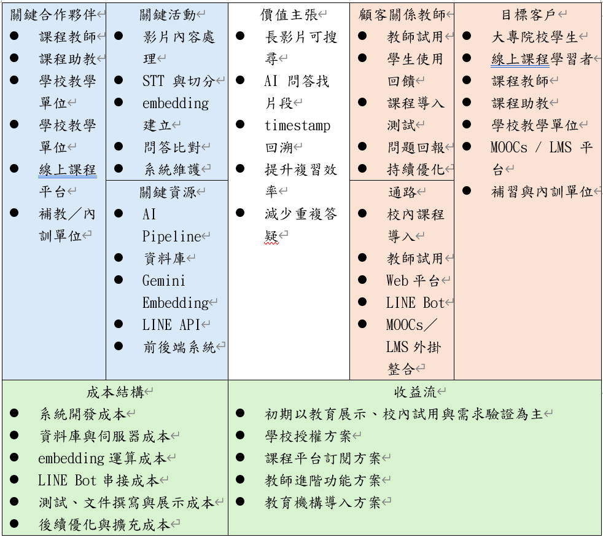

# 第2章 營運計畫

> 現況基準：本章已於 2026-09-14 依目前專案實作重新區分技術事實與營運假設。
> 商業模式、STP、SWOT／TOWS、經費及市場規模尚未經使用者研究或財務資料驗證，須由專題團隊於定稿前確認。

[返回手冊索引](../README.md)

---

## 2-1 可行性分析

FocusFlow 的可行性應分別由技術、教育應用、操作、經濟營運及法律與資料治理評估。程式碼與本機測試只能證明系統具備實作基礎，不能直接證明正式部署效能、學習成效或商業可行性。

### 技術可行性

FocusFlow 採前後端分離架構：React／Vite 前端提供學生、教師與管理員介面；Node.js／Express 後端提供身分驗證、課程、影片、問答、LINE、通知、統計及管理 API；MongoDB／Mongoose 保存應用資料；Python AI Pipeline 使用 FFmpeg、Faster-Whisper 與 Gemini embedding 相關流程，產生逐字稿、分段與向量資料。

表2-1-1　核心能力、現有證據與限制

| 核心能力 | 已存在的實作 | 現況限制 |
| --- | --- | --- |
| 身分與角色 | JWT、學生自助註冊、教師／管理員帳號管理、角色式登入、獨立管理員入口、個人資料／密碼／私有頭像 | 正式帳號政策、密碼重設寄信與部署安全設定仍須環境驗收 |
| 課程與修課 | 課程狀態、教師所有權、Enrollment 指派／名單匯入／撤銷、學生進度 | 學生不得自助選課；應用 API 只接受有效修課與已發布課程的交集，但 `/uploads` 匿名媒體路徑尚未符合此邊界 |
| 影片管理 | 本機檔案或 YouTube 來源、處理狀態、attach／detach、失敗重試、重複檔案檢查 | 外部來源、檔案清理與 YouTube 可播放性須分別驗證；YouTube unlisted 連結可被轉傳 |
| 多影片處理 | 前端以單一 multipart 請求建立持久化 VideoBatch，保留單項狀態與重試；Pipeline 有 manifest、lease、checkpoint 與 resume | `VIDEO_BATCH_PIPELINE_ENABLED` 預設關閉；正式 STT／Gemini、壓力與部署端到端尚未完成 |
| AI 問答 | 課程範圍檢索、FAQ 快取、回答狀態、來源引用、網頁對話與 LINE 問答 | 品質依賴逐字稿、向量、模型與資料契約；共享 Atlas 及正式題組仍有獨立驗收門檻 |
| 通知與統計 | 影片完成通知、系統公告、已讀狀態、角色儀表板與使用事件 | 統計反映已記錄行為，不能直接解讀為學習成效 |
| 短影音 | 學生修課限定 feed、ShortAsset 狀態與 YouTube 可用性；教師候選、證據腳本、人工成品上傳及審核介面 | 腳本自動化預設關閉；系統未自動執行選段後的剪輯、9:16 渲染、配音或字幕合成 |

上述模組顯示核心資料流可由現有技術支撐。但正式可行性仍取決於目標環境的資料、索引、外部服務憑證、容量、成本、監控與回復流程，不宜以單元測試通過直接宣稱已可長期穩定營運。

### 教育應用可行性

系統適合用於已具有教學影片的課程。學生以問題進入內容，不需從頭尋找；回答附來源片段與時間點，使學生能回到教師原始講解。這種設計具備課後複習與補課的應用合理性，也可能降低教師與助教重複協助定位片段的負擔。

目前尚未取得足以證明學習成效的正式研究結果。後續應以真實課程試用，觀察任務完成時間、引用點擊與影片回看情況、回答是否有幫助、拒答是否適當，以及教師實際節省的答疑時間。未完成上述驗證前，本章僅主張「具備可試用的教育情境」，不主張已提升成績或學習效率。

### 操作可行性

學生的主要流程為登入、查看已指派課程、選擇影片、觀看或提問；亦可產生一次性綁定資訊後使用 LINE Bot。教師以網頁建立課程、管理修課名單、加入影片並查看處理結果。管理員由獨立入口處理帳號、影片、事件、統計與全站通知。各角色不需直接操作資料庫或 AI Pipeline。

介面已具備錯誤提示、處理狀態與部分失敗重試，但使用手冊仍須以實際畫面與正式帳號流程驗證。LINE、YouTube 與 AI 服務不可用時，部分功能會降級或失敗，並非全離線系統。

### 經濟與營運可行性

目前專案定位為畢業專題與校內試用，不是已投入商業營運的產品。系統重用成熟的開源框架與受管服務，降低自行開發身分系統、影音串流、語音辨識模型及向量資料庫的初期成本；然而，Gemini、MongoDB Atlas、YouTube API、VM、網域／憑證、網路流量、影片處理 CPU／GPU 及維運人力仍可能形成費用或配額限制。

目前 repository 未提供可據以核算每位學生、每門課或每小時影片成本的完整財務資料。正式營運評估至少應記錄：每小時影片轉錄與 embedding 成本、每次問答模型成本、資料庫與備份用量、YouTube 配額、VM 資源、錯誤重試成本及維運工時。未完成成本試算前，不宜提出確定售價或損益結論。

### 法律與資料使用可行性

FocusFlow 會處理帳號資料、課程影片、逐字稿、提問與回答紀錄、觀看事件及 LINE 識別資訊。課程管理者須確認影片、聲音、簡報與第三方素材具有上傳、轉錄、向量化及提供修課學生使用的權利；YouTube 來源及上傳也須遵守平台規範。

系統已在應用 API 與資料查詢層以角色、課程所有權與 Enrollment 限制資料存取，頭像亦採驗證後讀取；但目前 `/uploads` 仍以匿名靜態路徑提供本機媒體檔，尚未形成完整的影片檔授權邊界。權限機制也不等同完整法遵方案，仍須由團隊處理媒體交付缺口，並確認告知與同意、資料保存期限、刪除申請、備份、外部 AI 服務資料處理條款及事件處理程序。影片上傳至 YouTube 時若採 unlisted，取得連結者仍可能觀看，不能宣稱平台權限可完全阻止連結外流。

短影音流程會要求教師確認 AI 揭露與相關同意，再建立待審成品；此為系統留存確認紀錄的控制點，不代表系統能代替團隊取得著作權、肖像權或聲音使用授權。

## 2-2 商業模式－Business model

本節為待驗證的營運假設，而非目前已成立的商業模式。初期建議以校內課程試用為主，先驗證問題是否存在、核心流程是否可靠、教師是否願意提供教材，以及學生是否會使用來源片段回看，再評估對外方案。

表2-2-1　商業模式假設

| 構面 | 第一階段假設 | 待驗證問題 |
| --- | --- | --- |
| 目標使用者 | 有長篇錄影教材的大專課程教師與修課學生 | 哪類課程最常遇到片段難找與重複答疑？ |
| 價值主張 | 讓學生以課程問題找到回答、來源片段與時間點 | 是否比手動搜尋更快？學生是否實際回看來源？ |
| 使用管道 | FocusFlow 網頁、LINE Bot；影片播放使用原始來源或 YouTube | 使用者偏好網頁或 LINE？外部服務限制是否可接受？ |
| 顧客關係 | 教師建立／管理課程與名單，學生依修課權限使用 | 課程導入、名單維護與問題回報由誰負責？ |
| 核心活動 | 影片處理、檢索問答、權限管理、品質監測與支援 | 模型品質、資料更新與故障恢復需要多少人力？ |
| 核心資源 | 系統程式、課程影片授權、AI／資料庫／影音服務及維運環境 | 授權、配額、成本與容量是否可持續？ |
| 合作對象 | 授課教師、校內教學與資訊單位、外部平台供應商 | 誰負責內容、個資、網路與服務帳號？ |
| 成本結構 | 運算、模型 API、資料庫、VM、網路、儲存與維運 | 尚缺正式用量與單位成本資料 |
| 收益或效益 | 第一階段以教學支援與研究驗證為主；授權／訂閱僅為後續選項 | 願付價格、採購流程及可量化效益尚未驗證 |

> **歷史圖／待重繪：** 下圖為初評版本的 Business Model Canvas，內容可能與上表及目前系統邊界不一致。圖片未修改，後續應依定稿內容重繪並更名為「圖2-2-1-商業模式九宮格-vX-x.png」。

圖2-2-1　FocusFlow 商業模式（初評歷史圖，待重繪）

## 2-3 市場分析－STP

本節採 STP 作為初步市場定位工具，內容屬企劃假設，尚未以市場調查或訪談樣本驗證。

### 市場區隔（Segmentation）

- **大專院校錄影課程：** 有固定授課教師、明確修課名單及長篇教材，適合驗證課程範圍問答。
- **線上課程與自主學習者：** 具有大量長影片與非同步學習需求，但教材授權及帳號整合較複雜。
- **補習教育與企業內訓：** 可能需要可追溯的內容問答與進度觀察，但權限、稽核及資料保存要求較高。

### 目標市場（Targeting）

第一階段以專題團隊可取得授權、可維護修課名單且能收集回饋的校內課程為主要目標。學生是主要學習使用者，教師則是教材與課程管理者。LMS、MOOCs、補教與企業內訓僅列為後續可能方向，現有 repository 未包含可直接安裝至這些平台的正式外掛，因此不能將整合能力寫成已完成。

### 產品定位（Positioning）

FocusFlow 定位為「以授權課程為範圍、回答可回到影片來源的教學影片問答輔助系統」。與一般影片播放器相比，系統強調自然語言檢索與時間點；與一般聊天工具相比，系統強調修課授權、課程範圍與來源引用；與完整 LMS 相比，系統聚焦影片知識化與問答，不取代作業、成績、點名與完整教務功能。

## 2-4 競爭力分析SWOT-TOWS

表2-4-1　SWOT 分析

| 類型 | 目前判讀 |
| --- | --- |
| 優勢（Strengths） | 問答可連結課程來源與時間點；網頁與 LINE 共用授權及問答服務；角色、課程、修課、影片處理與通知形成可操作鏈；應用 API 採 Enrollment 預設拒絕。 |
| 劣勢（Weaknesses） | `/uploads` 本機媒體仍可匿名存取；正式題組、共享 Atlas、外部服務及長期部署證據仍不足；影片與問答品質依賴外部模型與資料契約；多媒體處理成本高；短影音自動剪輯與渲染尚未完成。 |
| 機會（Opportunities） | 課程錄影及非同步學習普及；教師需要提高既有教材可搜尋性；具來源的 AI 回答可補足一般聊天工具與影片播放器之間的缺口。 |
| 威脅（Threats） | LMS、影音平台或通用 AI 可能提供相似功能；教材與個資治理不足會降低信任；API 成本、配額與供應商異動可能影響服務；回答錯誤可能造成學習風險。 |

表2-4-2　TOWS 策略

| 策略 | 建議作法 |
| --- | --- |
| SO：以優勢掌握機會 | 先以已授權的校內課程驗證「提問—引用—回看片段」流程，累積可量化的任務與使用證據。 |
| WO：改善劣勢掌握機會 | 優先完成正式題組、共享資料契約、外部服務與部署驗收，再擴充課程；以回答狀態與拒答案例持續改善品質。 |
| ST：以優勢降低威脅 | 維持伺服器端課程授權、來源引用與時間點核對，清楚區隔一般聊天工具；所有效益主張均附驗證條件。 |
| WT：降低劣勢避免威脅 | 建立資料保存、教材授權、成本上限、服務降級、備份與事故處理規則；對尚未完成的功能維持功能開關關閉。 |

下一階段營運工作應先完成校內試用設計、成本紀錄與資料治理決策，再更新商業模式及市場定位。若缺少訪談、問卷或正式財務資料，應保留「待確認」，不以企劃推測取代證據。
