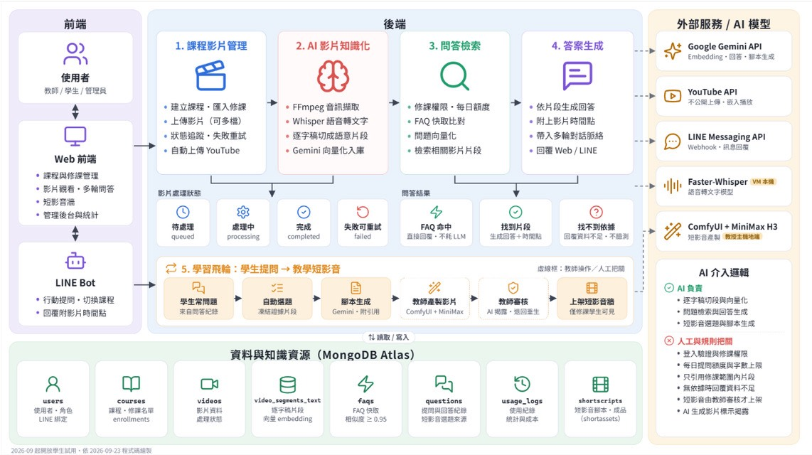

# 第3章 系統規格

## 3-1 系統架構

本系統名為 FocusFlow，主要設計目標為將教學影片轉換為可被搜尋、可被提問，並能回溯至特定時間戳的學習知識資源，使學生在觀看教學影片時能更快速地找到所需內容，並降低教師重複回答相同問題的負擔。為達成此目標，本系統以教學影片為核心資料來源，結合語音辨識、語意分段與向量檢索等技術，建立可供學生提問與系統回覆的問答流程，並透過 Web 前端與 LINE Bot 提供操作與使用介面，使教師、學生與管理員能各自在合適的環境下完成課程影片管理、影片觀看與提問互動等工作。

整體架構分為三個部分：(1) 使用者互動與課程入口；(2) 後端核心流程與 AI 問答控制；(3) 影片知識化與資料資源整合。各部分之說明如下：

**使用者互動與課程入口：** 本系統提供教師、學生與管理員三種角色，並以 Web 前端作為主要操作介面。教師可於 Web 前端建立課程、匯入修課名單、上傳教學影片（可一次選擇多支），並檢視影片處理狀態；學生可於 Web 前端瀏覽自己修課且已發布的課程影片、觀看影片內容，並針對影片提出問題；管理員則透過獨立入口進行使用者、課程、影片與系統事件的管理。為配合學生在行動裝置上的使用情境，本系統另提供 LINE Bot 作為行動端的提問入口，學生在綁定帳號後即可於 LINE 中輸入問題、切換課程，並由系統回覆對應的答案與影片時間戳，使學習互動不限於 Web 前端的使用情境。

**後端核心流程與 AI 問答控制：** 後端負責本系統的整體流程控制，主要包含課程影片管理、AI 影片知識化、問答檢索與答案生成四項工作。當教師於前端建立課程並上傳影片後，後端會記錄影片基本資料，並啟動 AI 影片知識化流程，將影片內容處理為可檢索的知識資料。當學生透過 Web 前端或 LINE Bot 提出問題時，後端會先檢查修課權限與每日提問額度，比對 FAQ 快取；未命中時將問題進行語意轉換，並從先前處理完成的影片語意片段中檢索相關內容。若檢索結果足以支援回答，便交由生成式 AI 模型產生回覆並附上對應的影片時間戳；若檢索結果不足以回答問題，系統則回覆查無相關內容，以避免提供與影片無關的資訊。

**影片知識化與資料資源整合：** 影片知識化流程是本系統的核心處理階段。系統先透過 Faster-Whisper 將影片音訊轉換為帶有時間戳的逐字稿，再依語意完整性將逐字稿切分為較短的片段，並使用 Google Gemini 提供的文字向量嵌入模型，將片段轉換為語意向量後寫入資料庫，作為後續檢索的依據。資料層採用 MongoDB Atlas 作為主要儲存環境，集中保存課程與影片基本資料、逐字稿、語意片段與向量資料，以及學生提問與系統使用紀錄等內容，使影片資料、知識資料與使用歷程能在同一資料環境中相互對應，支援問答檢索與後續維護分析。

圖3-1-1 為本系統之系統架構圖，呈現前端介面、後端核心流程、外部服務與 AI 模型，以及資料與知識資源之間的整體關係。

圖3-1-1　FocusFlow 系統架構圖

教師於 Web 前端建立課程與影片資料後，後端會將影片上傳至 YouTube（設為不公開）作為播放來源，並由 Faster-Whisper 與 Google Gemini API 完成逐字稿生成、語意分段與向量化處理，將影片內容轉換為可檢索的知識資料並寫入資料庫；學生於 Web 前端或經由 LINE Messaging API 從 LINE Bot 提出問題後，後端會在該生修課範圍內的語意片段中檢索相關內容，再交由生成式 AI 模型產生回答，最後將答案與對應的影片時間戳回傳至原本的提問介面。

影片處理狀態分為待處理（queued）、處理中（processing）、完成（completed）與失敗可重試（failed）四種，教師可於介面確認進度並重試失敗項目；問答結果則分為 FAQ 命中（直接回覆，不呼叫生成模型）、找到片段（生成回答並附時間點）與找不到依據（回覆資料不足）三種。

架構圖右側另標示「學習飛輪」與「AI 介入邏輯」。學習飛輪指系統由學生的提問紀錄自動選題，凍結證據後產生附引用的短影音腳本，教師據此製作影片並經審核後上架，短影音僅限修課學生可見；其中影片製作與審核由教師操作，系統不自動完成剪輯與渲染。AI 介入邏輯則區分責任：逐字稿切分與向量化、問題檢索與答案生成、短影音選題與腳本生成由 AI 負責；登入驗證與課程權限、提問額度與字數上限、只引用修課範圍內片段、無依據時回覆資料不足、短影音經教師審核後才上架，以及 AI 生成影片標示揭露，則由系統規則與人工把關。

透過上述流程，教師端的影片建立工作與學生端的提問互動形成完整的閉環，使教學影片能由原本僅供觀看的素材，轉換為可被檢索、可被提問並可回到特定片段的知識來源。

## 3-2 系統軟、硬體需求與技術平台

本系統採用前後端分離架構，前端以 React 19 + Vite 建構單頁應用程式（SPA），後端使用 Node.js + Express 提供 RESTful API，資料庫採用 MongoDB Atlas，並透過 Mongoose 操作資料模型與索引。AI 影片處理 Pipeline 使用 Python + FFmpeg + Faster-Whisper 進行音訊抽取與語音轉文字，並以 Google Gemini Embedding 產生文字向量，供後續問答檢索使用。

目前第一階段的核心能力為教師上傳影片、系統自動執行 AI Pipeline、學生針對影片內容提問，以及系統回傳答案與對應時間戳。音訊向量與影片畫面向量目前屬於驗證支線，主要作為後續多模態檢索的基礎，尚未納入正式問答流程；階層式（Parent／Child）檢索亦已具備程式實作，正式環境維持關閉。

整體系統以網頁形式提供教師端課程影片管理、影片上傳、處理狀態追蹤與統計功能；學生端則可透過 Web 前端或 LINE Bot 進行課程瀏覽與提問。考量學生多在行動情境下使用，系統選擇整合 LINE Messaging API 作為輕量化提問入口，降低額外安裝 App 或學習新介面的門檻。

LINE 是台灣使用普及率最高的即時通訊軟體，依 LINE 台灣 2024 年 12 月公布的使用數據，LINE 在台用戶數達 2,200 萬人，顯示其作為學生端行動入口具有高度可行性。對學生使用者而言，LINE 是其日常已熟悉且高頻使用的應用程式；以 LINE Bot 作為提問入口，可省去額外下載 App、註冊帳號或安裝 PWA 等門檻，降低使用阻力。此設計同時也降低了開發與維護成本：LINE 平台已負責處理推播、訊息儲存與跨裝置同步，本系統僅需專注於後端 Webhook 與對話邏輯的開發。

為釐清本系統運行時採用的技術堆疊，將各層級核心技術整理如表3-2-1：

表3-2-1　系統技術平台選型

| 層級 | 採用技術 | 用途說明 |
| --- | --- | --- |
| 前端框架 | React 19 + Vite | 建構單頁應用程式，提供學生、教師、管理員三種角色介面 |
| 前端互動 | GSAP、Three.js、qrcode.react | 提供動畫、3D 視覺元素與 LINE Bot QR Code 顯示 |
| 後端框架 | Node.js + Express 4 | 提供 RESTful API、JWT 身分驗證、檔案上傳與後端業務邏輯 |
| 後端資料模型 | Mongoose 8 | 定義 MongoDB Schema、資料驗證與資料存取 |
| 資料庫 | MongoDB Atlas | 儲存使用者、課程、影片、逐字稿、向量片段與使用紀錄 |
| 語音轉文字 | Faster-Whisper | 將教學影片音訊轉錄為帶時間戳的逐字稿 |
| 音訊處理 | FFmpeg／imageio-ffmpeg | 從影片檔案抽取音訊，供語音轉文字流程使用 |
| 文字向量嵌入 | Google Gemini Embedding（`gemini-embedding-2`，3072 維） | 將影片文字片段與學生問題轉換為語意向量 |
| 問答生成 | Google Gemini API（可切換 OpenAI） | 根據檢索片段生成自然語言答案 |
| 向量檢索 | Atlas Vector Search（正式環境）／Memory mode（本機開發與測試） | 以餘弦相似度比對問題與片段；正式環境使用 `text_embedding_index` |
| 影片託管與播放 | YouTube Data API v3、iframe 嵌入 | 影片以不公開方式上傳並嵌入前端播放，降低串流負擔 |
| 即時通訊整合 | LINE Messaging API | 提供學生端 LINE Bot 提問入口 |
| 郵件寄送 | Nodemailer／SMTP | 寄送忘記密碼驗證信 |
| API 文件 | Swagger UI（OpenAPI 3.0） | 提供 API 規格查閱與測試介面 |
| 套件管理 | npm、pip、venv | 管理前後端與 Python Pipeline 的相依套件 |

考量網路環境差異與裝置多樣性，本系統前端介面支援各類網路連線模式（Wi-Fi／4G／5G），並利用 Vite 建置時產生的程式碼分割（code splitting）與快取機制，於低速網路下仍可維持基本可用性。LINE Bot 端則因 LINE 平台本身具備離線訊息暫存與重送機制，使用者於網路不穩時仍能順暢提問，待連線恢復後接收回應。

為使系統能穩定運行於主流裝置，使用者端硬體需求詳列如表3-2-2：

表3-2-2　使用者端硬體需求

| 系統硬體需求—裝置端 | 需求規格說明 |
| --- | --- |
| 裝置類型 | 支援瀏覽器之智慧型手機／平板／電腦；LINE Bot 端需安裝 LINE App |
| 作業系統版本 | Android 8.0 以上／iOS 13 以上／Windows 10 以上／macOS 11 以上 |
| 瀏覽器建議版本 | Chrome、Edge、Safari、Firefox 等主流瀏覽器之最新穩定版 |
| LINE App 版本 | iOS 13.7 以上／Android 12.0 以上對應之 LINE 最新穩定版 |
| 網路需求 | Wi-Fi／4G／5G，觀看影片建議具備穩定網路連線 |
| 螢幕解析度 | 建議 1280×720 以上，行動裝置可依 LINE App 或瀏覽器畫面自適應 |
| 儲存空間需求 | 使用者端僅需基本瀏覽器快取空間，影片與系統資料主要儲存於伺服器與 MongoDB Atlas |
| 帳號需求 | 學生與教師可自行註冊；學生須由教師或管理員加入修課名單後才能存取課程 |

正式環境的伺服器端配置如表3-2-3。表中內容依 2026-09-19 的部署設定與服務狀態整理。

表3-2-3　伺服器端環境配置

| 項目 | 配置說明 |
| --- | --- |
| 主機 | 學校虛擬機，作業系統為 Rocky Linux 9 |
| 網頁伺服器 | nginx 1.20.1，提供前端靜態檔並將 `/api/` 反向代理至後端 |
| 網域與憑證 | `focusflow.ntub.edu.tw`，採 Let's Encrypt 憑證並自動續約；對外僅開放 443 |
| 安全設定 | HSTS、`X-Content-Type-Options`、`X-Frame-Options`、`Referrer-Policy`；API 另有 CSP 與 `Permissions-Policy`；CORS 限定允許的來源網域 |
| 後端執行 | Node.js 執行 Express 服務，由 PM2 管理，監聽 port 4000 |
| AI Pipeline | 與後端同一台主機，以 Python 執行；Faster-Whisper 預設使用 CPU、`small` 模型與 int8 量化 |
| 資料庫 | MongoDB Atlas，含 `text_embedding_index` 向量索引 |
| 外部服務憑證 | Gemini API 金鑰、LINE Channel Secret 與 Access Token、YouTube OAuth 憑證、SMTP 帳號 |
| 部署方式 | 推送至 GitHub `main` 後，由虛擬機上的 GitHub Actions self-hosted runner 拉取程式、安裝套件、建置前端並重啟後端 |

由於尚未以特定課程數、影片時數或同時上線人數進行負載測試，本章不訂定回應時間或容量保證；正式規格應於校內試用期間依實際用量補充。

## 3-3 使用標準與工具

本系統以物件導向分析與設計（OOAD）方法進行需求分析與系統設計，塑模標準採用 UML 2.x：第 5 章以使用個案圖、活動圖與分析類別圖描述需求，第 6 章以循序圖與設計類別圖描述設計，第 7 章以佈署圖、套件圖、元件圖與狀態機描述實作。開發流程採反覆漸進方式，依階段（Phase）與衝刺（Sprint）分批完成，每一批先訂定規格與驗收條件，再進行實作、測試與部署；尚未完成驗收的新功能以功能開關（feature flag）預設關閉。系統對外介面採 REST 風格，請求與回應使用 JSON 並統一成功與錯誤格式，API 規格以 OpenAPI 3.0 描述。

以下列出本組於開發 FocusFlow AI 教學影片問答系統時所使用的主要開發工具與技術，並說明各項工具的特點與選用理由：

- **Node.js**：具備非同步與事件驅動特性，適合處理 Web API 請求與即時資料交換。本系統使用 Node.js 作為後端執行環境，負責處理登入驗證、課程資料、影片資料、問答請求與 LINE Bot 訊息流程。
- **Express**：為 Node.js 常用的輕量級 Web 應用框架，提供路由、中介層與請求處理功能。本系統使用 Express 建立 RESTful API，便於前端、資料庫與外部服務進行整合。
- **MongoDB**：為文件型 NoSQL 資料庫，適合儲存結構較彈性的資料。本系統使用 MongoDB 儲存使用者資料、課程資料、影片資訊、影片文字片段、問答紀錄與 LINE 綁定資料，並搭配 MongoDB Atlas Vector Search 進行語意檢索。
- **Mongoose**：為 Node.js 操作 MongoDB 的 ODM 工具，可透過 Schema 定義資料格式與驗證規則。本系統使用 Mongoose 管理各資料集合的欄位結構，使資料存取與維護更具一致性。
- **React**：為前端使用者介面開發函式庫，採用元件化設計方式，適合建立單頁式應用程式。本系統使用 React 製作學生、教師與管理員介面，提供課程瀏覽、影片問答、LINE 綁定與後台管理等功能。
- **Vite**：為現代化前端建置工具，具備快速啟動與熱更新特性。本系統使用 Vite 建立前端開發環境，並產生正式部署用的靜態檔。
- **Python**：具備豐富的 AI 與資料處理套件，適合開發語音辨識與資料前處理流程。本系統使用 Python 建立 AI Pipeline，負責影片音訊處理、語音轉文字、文字分段與向量嵌入。
- **Faster-Whisper**：為 Whisper 語音辨識模型的高效能實作，可將影片音訊轉換為含時間戳的文字稿。本系統使用 Faster-Whisper 產生教學影片逐字稿，作為後續問答檢索的資料來源。
- **Google Gemini API**：提供文字向量嵌入與生成式 AI 回答能力。本系統使用 Gemini API 將問題與影片片段轉換為向量，並根據檢索結果產生學生提問的回答內容。
- **YouTube Data API**：提供影片上傳與管理能力。本系統使用此 API 將教師上傳的影片以不公開方式上傳至專題頻道，並於前端以 iframe 嵌入播放。
- **LINE Messaging API**：為 LINE 官方提供的 Bot 開發介面。本系統使用 LINE Messaging API 接收學生提問、完成帳號綁定與回覆 AI 問答內容，提供行動端的學習互動入口。
- **Visual Studio Code**：為本組主要使用的程式碼編輯器，支援 JavaScript、React、Python、Markdown 等語言開發，並可透過擴充套件輔助除錯、格式化與版本控制。
- **GitHub 與 GitHub Actions**：用於版本控制與團隊協作管理，支援多人分支開發、程式碼歷程追蹤與專案檔案保存；並透過 GitHub Actions 的 self-hosted runner 將 `main` 分支自動部署至虛擬機。
- **MongoDB Compass**：為 MongoDB 官方圖形化資料庫管理工具。本組使用 MongoDB Compass 檢視資料內容、確認 Collection 結構與測試查詢結果，提升資料庫除錯效率。
- **PlantUML／Mermaid／Diagrams.net**：用於繪製系統相關圖表。本組使用 PlantUML 與 Mermaid 製作使用個案圖、循序圖、類別圖等 UML 圖，並使用 Diagrams.net 繪製系統架構與部署相關圖表。
- **Microsoft Word／PowerPoint**：本組使用 Microsoft Word 撰寫系統手冊與專題報告，並使用 Microsoft PowerPoint 製作專題簡報與成果展示資料。

各項工具與環境依用途分類整理如表3-3-1：

表3-3-1　開發環境與工具表

| 分類 | 項目 | 使用工具 |
| --- | --- | --- |
| 系統開發環境 | 作業系統 | Windows 11、macOS |
| 系統開發環境 | 程式撰寫工具 | Visual Studio Code |
| 系統開發環境 | AI 程式輔助 | Claude Code、Codex |
| 程式開發工具 | 前端技術 | React 19、Vite、JavaScript、HTML、CSS、ESLint、GSAP、Three.js |
| 程式開發工具 | 後端技術 | Node.js、Express、RESTful API、JWT（jsonwebtoken）、bcryptjs、Multer、CORS |
| 程式開發工具 | AI Pipeline | Python 3、Faster-Whisper、Google Gemini API、PyMongo、FFmpeg |
| 程式開發工具 | 外部服務整合 | LINE Messaging API、YouTube Data API、Webhook、HMAC-SHA256 簽章驗證、SMTP |
| 程式開發工具 | 相依套件管理 | npm（Node.js）、pip + venv（Python） |
| 資料庫設計與管理 | 資料庫與工具 | MongoDB Atlas（雲端託管）、Mongoose 8（ODM）、MongoDB Compass（GUI） |
| API 文件與測試 | 規格與測試 | Swagger UI（OpenAPI 3.0）、swagger-ui-express、js-yaml |
| 測試工具 | 自動化測試 | Node.js 內建測試框架（`node:test`）、Python `unittest`、ESLint |
| 部署與維運 | 伺服器環境 | Rocky Linux 9、nginx、PM2、GitHub Actions self-hosted runner、Let's Encrypt |
| 文件與美工工具 | 系統架構與部署圖 | Diagrams.net（draw.io）、Python matplotlib |
| 文件與美工工具 | UML 圖（使用個案／循序／類別／活動） | PlantUML、Mermaid |
| 文件與美工工具 | 報告書撰寫 | Microsoft Word、Notion |
| 文件與美工工具 | 簡報製作 | Microsoft PowerPoint、Canva |
| 專案管理平台 | 版本控管與專案協作 | Git、GitHub、Notion |
| 專案管理平台 | 檔案儲存 | GitHub、Google Drive |
