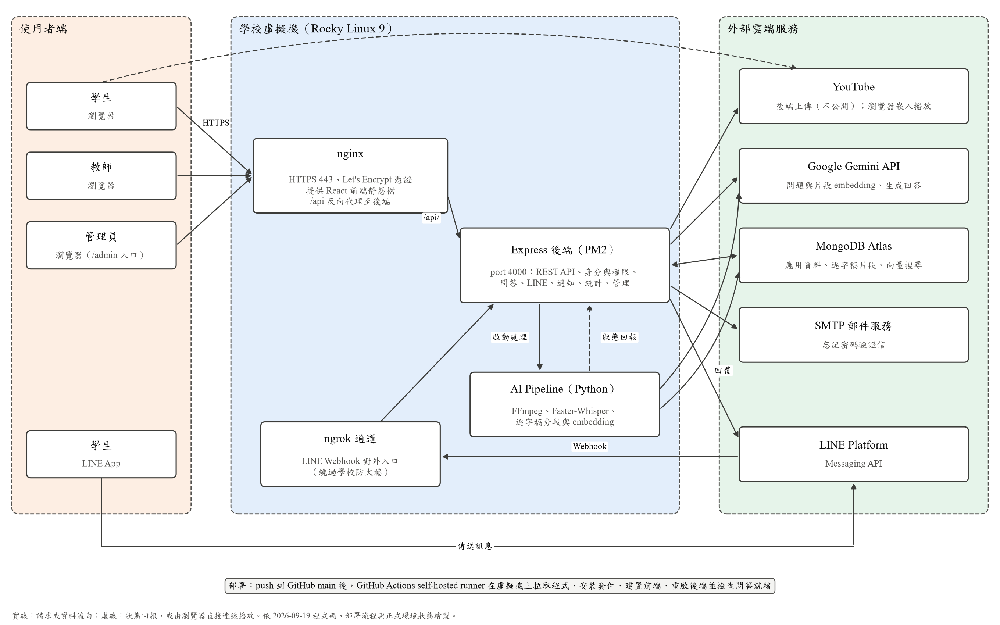

# 第3章 系統規格

## 3-1 系統架構

FocusFlow 採前後端分離架構，並把耗時的影片處理交給獨立的 Python AI Pipeline。整體分為三個區域（圖3-1-1）：

- **使用者端**：學生、教師、管理員以瀏覽器使用網頁；學生另可透過 LINE App 提問。
- **學校虛擬機**：執行 nginx、Express 後端與 AI Pipeline，並以 ngrok 通道接收 LINE Webhook。
- **外部雲端服務**：MongoDB Atlas、Google Gemini、YouTube、LINE Platform 與 SMTP 郵件服務。

圖3-1-1　FocusFlow 系統架構圖

圖3-1-1 的主要資料流如下：

1. **網頁操作**：瀏覽器以 HTTPS 連到 nginx。nginx 提供 React 前端的靜態檔，並把 `/api/` 開頭的請求轉給 Express 後端。
2. **影片處理**：教師上傳影片後，後端在同一台虛擬機上啟動 AI Pipeline。Pipeline 擷取音訊、轉成逐字稿、分段並呼叫 Gemini 產生向量，寫入 MongoDB Atlas，再透過內部 Webhook 回報處理狀態。若啟用 YouTube 自動上傳，後端另將影片以「不公開」上傳到 YouTube，學生的瀏覽器直接嵌入 YouTube 播放。
3. **網頁問答**：後端把學生的問題交給 Gemini 產生向量，在 MongoDB Atlas 以向量搜尋找出學生有權限的課程片段，再請 Gemini 依片段生成回答，回傳回答、來源片段與時間點。
4. **LINE 問答**：學生在 LINE 傳訊息後，LINE Platform 呼叫 Webhook。學校防火牆不開放 port 80，目前 Webhook 經 ngrok 通道進入後端；後端驗證簽章後，使用與網頁相同的問答服務，再經 LINE Messaging API 回覆。

### 使用者介面

前端是單一的 React 應用程式，依網址分成兩個入口：一般入口提供學生與教師的登入、註冊與操作頁面；`/admin` 為管理員專用入口，管理員不開放自助註冊。各角色的主要頁面如下：

- **學生**：儀表板、我的課程（觀看影片與對話式問答）、短影音牆、LINE Bot 綁定、個人資料。
- **教師**：儀表板、課程管理（修課名單、影片掛載）、影片上傳、短影音腳本、短影片審核、個人資料。
- **管理員**：總覽、使用者管理、課程管理、影片管理、統計、個人資料。

站內通知在三個角色的頁首都可查看。

### 後端應用服務

後端以 Express 提供 REST API，所有路由掛在 `/api/v1` 之下，程式遵循 `routes → controllers → services → models` 的分層：路由負責組合身分驗證與角色檢查，控制器處理輸入與回應，服務層負責權限與業務規則，Mongoose 模型定義資料結構。表3-1-1 列出目前的後端模組。

表3-1-1　後端主要模組與用途

| 模組（路由） | 在本系統中的用途 |
| --- | --- |
| 身分驗證（`/auth`） | 登入、學生與教師註冊、個人資料、修改與忘記密碼、私有頭像；連續登入失敗會暫時鎖定 |
| 課程（`/courses`） | 課程建立與維護、修課名單指派與撤銷、影片掛載、觀看進度、課程 FAQ 快取管理 |
| 影片（`/videos`） | 本機影片單支與批次上傳、處理狀態、失敗重試、YouTube 上傳重試、影片刪除 |
| 問答（`/qa`、`/conversations`） | 課程範圍檢索與回答生成、FAQ 快取、網頁對話紀錄與訊息重試 |
| LINE（`/line`） | Webhook 簽章驗證、一次性帳號綁定、課程切換、共用問答服務 |
| 通知（`/notifications`） | 影片處理完成、系統公告、短影音退回等站內通知與已讀狀態 |
| 統計與管理（`/stats`、`/admin`） | 角色儀表板統計；管理員的使用者、影片、事件、公告與系統服務狀態管理 |
| 短影音（`/shorts`、短影音腳本路由、`/youtube/shorts`） | 修課範圍內的短影音牆、教師的候選片段、腳本與人工成品審核 |
| 內部處理（`/internal`） | AI Pipeline 回報處理開始、完成、失敗，以共享密鑰驗證，不對外開放 |
| 健康檢查（`/health`） | 回報問答、LINE、YouTube 上傳、短影音同步等執行條件是否就緒 |

學生能存取哪些資料由後端判斷，不依賴前端是否隱藏按鈕：課程、影片、問答、FAQ、短影音與 LINE 的課程範圍，都要求學生同時具備「有效修課紀錄」且「課程已發布」；教師只能管理自己的課程，管理員可跨課程管理。

### AI Pipeline

AI Pipeline 以 Python 撰寫，由後端在教師上傳影片後自動啟動（單支影片執行 `src/main.py`，批次執行 `src/batch_main.py`）。主要步驟如下：

1. 以 FFmpeg 從影片擷取音訊。
2. 以 Faster-Whisper 產生帶時間資訊的逐字稿。
3. 正規化逐字稿、處理專有名詞，並切分成片段。
4. 以 Gemini embedding（gemini-embedding-2，3072 維）產生片段向量。
5. 將影片資訊、逐字稿與片段向量寫入 MongoDB。
6. 透過內部 Webhook 通知後端處理開始、完成或失敗。

每個步驟都有進度紀錄，失敗時可從中斷處續跑。多影片批次模式有獨立的批次紀錄與續跑機制，但由 `VIDEO_BATCH_PIPELINE_ENABLED` 控制，預設關閉。

下列功能具備程式實作，但**不用於正式問答**：階層式（Parent／Child）檢索，正式環境的 `/health` 顯示為關閉；`video_segments_video` 影片畫面向量未接入問答流程。Pipeline 另會產出音訊向量檔，問答流程也不使用。

### 資料層

資料存放於 MongoDB，正式環境使用 MongoDB Atlas。後端以 Mongoose 定義 19 個資料模型，主要包括：

- **帳號與權限**：User、Avatar、Enrollment、LineBindToken
- **課程與影片**：Course、Video、VideoBatch、Clip
- **問答與對話**：Question、Faq、Conversation、Message、UsageLog
- **影片知識**：VideoSegment（逐字稿片段與向量，collection 為 `video_segments_text`）、VideoSegmentParent、VideoSegmentVideo
- **通知與短影音**：Notification、ShortScript、ShortAsset

正式環境的問答使用 Atlas Vector Search 索引 `text_embedding_index`，搜尋 `video_segments_text` 中的片段向量；部署流程在重啟後端後，會確認問答服務已就緒才算部署成功。各 collection 的欄位、關聯與索引見第 8 章。

## 3-2 系統軟、硬體需求與技術平台

### 技術平台

表3-2-1 的版本取自目前的套件清單（`package.json`、`requirements.txt`）。`^` 或 `>=` 表示允許的版本範圍，不代表正式主機固定使用表中版本。

表3-2-1　系統技術平台

| 層級 | 技術與版本 | 在本系統中的用途 |
| --- | --- | --- |
| 前端框架 | React ^19.2、Vite ^8.0 | 單頁應用程式與正式版建置 |
| 前端互動 | GSAP ^3.14、Three.js ^0.183、qrcode.react ^4.2 | 介面動態效果、LINE 綁定 QR Code |
| 後端框架 | Node.js、Express ^4.19 | REST API、檔案上傳、Webhook |
| 資料存取 | Mongoose ^8.13、MongoDB Driver ^7.1 | 資料模型、驗證、索引與資料庫操作 |
| 身分與安全 | jsonwebtoken ^9.0、bcryptjs ^2.4、cors ^2.8、Multer ^2.0 | JWT 驗證、密碼雜湊、來源限制、檔案接收 |
| 郵件與文件 | Nodemailer ^6.10、swagger-ui-express ^5.0 | 忘記密碼驗證信、API 文件頁面 |
| AI Pipeline | Python、faster-whisper >=1.1、imageio-ffmpeg >=0.5、yt-dlp、NumPy、rapidfuzz、google-genai >=1.0、PyMongo >=4.11 | 音訊擷取、語音轉文字、逐字稿處理、呼叫 Gemini、寫入資料庫 |
| AI 服務 | Google Gemini（gemini-embedding-2；回答模型預設 gemini-3.5-flash） | 問題與片段向量、依片段生成回答；後端也可切換為 OpenAI 或測試用的 mock |
| 向量檢索 | MongoDB Atlas Vector Search（正式環境）；memory 模式（本機開發與測試） | 依餘弦相似度找出相關片段 |
| 外部整合 | LINE Messaging API、YouTube Data API v3、SMTP | LINE 問答、影片上傳與嵌入播放、寄送驗證信 |
| API 文件 | OpenAPI 3、Swagger UI（`/docs`） | 主要 API 的規格說明；統計與管理端點以 route 定義為準 |

### 使用者端需求

表3-2-2　使用者端軟硬體需求

| 項目 | 需求 |
| --- | --- |
| 裝置 | 可執行現代瀏覽器的桌上型電腦、筆記型電腦、平板或手機 |
| 瀏覽器 | 仍有安全更新的 Chrome、Edge、Firefox 或 Safari |
| LINE | 使用 LINE 提問時，需安裝 LINE App 並加入 FocusFlow 官方帳號 |
| 網路 | 需連上網際網路；播放影片需要穩定頻寬 |
| 帳號 | 學生與教師可自行註冊；學生需由教師或管理員加入修課名單後，才看得到課程 |

### 正式環境

表3-2-3 為 2026-09-19 查證的正式環境配置。

表3-2-3　正式環境配置

| 項目 | 目前配置 | 查證方式 |
| --- | --- | --- |
| 主機 | 學校虛擬機（Rocky Linux 9），公開 IP 140.131.115.105 | 部署紀錄 |
| 網域與憑證 | `focusflow.ntub.edu.tw`；Let's Encrypt 憑證，由 acme.sh 每日檢查並自動續約 | 部署紀錄、正式站連線 |
| 網頁伺服器 | nginx 1.20.1；只開放 443，port 80 由學校防火牆封鎖 | 正式站回應標頭 |
| 安全標頭 | HSTS、`X-Content-Type-Options`、`X-Frame-Options`、`Referrer-Policy`；API 另有 CSP 與 `Permissions-Policy` | 正式站回應標頭 |
| 跨來源存取（CORS） | 只允許 `https://focusflow.ntub.edu.tw`；其他網域的預檢請求不會取得允許標頭 | 以兩個不同 Origin 實測 |
| 後端執行 | Express 由 PM2 管理，監聽 port 4000 | 部署流程 |
| LINE Webhook | 經 ngrok 通道進入後端；`/health` 顯示 LINE 為 live 就緒 | `/health` |
| 問答設定 | Atlas 向量搜尋、Gemini embedding 與回答；問答就緒 | `/health` |
| YouTube 自動上傳 | 已啟用，憑證有效且具 `youtube.force-ssl` 權限；刪除時轉私人的功能也已就緒 | `/health` |
| 部署方式 | push 到 GitHub `main` 後，由虛擬機上的 GitHub Actions self-hosted runner 自動部署 | `.github/workflows/deploy.yml` |

正式環境目前有兩項已知限制：

- **ngrok 通道對外開放整個後端**。正式網域的 nginx 沒有把 `/uploads` 轉給後端（2026-09-19 實測回傳前端頁面），但 ngrok 通道直接連到 port 4000，可繞過 nginx 存取後端，包括匿名的 `/uploads` 靜態檔路徑。上傳的本機影片檔因此仍有未受修課權限保護的入口。
- **本機影片在正式網域的播放依賴 YouTube**。前端以相對路徑 `/uploads/...` 播放本機影片，而正式網域的 nginx 不轉送此路徑；因此在正式站上，影片需要上傳到 YouTube 才能正常播放。此結論依 nginx 設定推得。

### 伺服器端需求

表3-2-4　伺服器端軟硬體需求

| 項目 | 需求 |
| --- | --- |
| 作業系統 | 可執行 Node.js 與 Python 的 Linux 環境；正式環境為 Rocky Linux 9 |
| 執行環境 | Node.js（後端與前端建置）、Python 3（AI Pipeline）、FFmpeg（系統安裝或由 imageio-ffmpeg 提供）；正式主機的實際版本：**待填** |
| CPU 與記憶體 | Faster-Whisper 預設以 CPU、`small` 模型、int8 量化執行；影片越長、同時處理的影片越多，需求越高。正式主機規格：**待填** |
| 磁碟空間 | 上傳的影片、擷取的音訊、處理中間檔與前端建置產物；處理成功後會清除部分暫存檔 |
| 網路 | 對外開放 443；能連到 MongoDB Atlas、Gemini、YouTube、LINE 與 SMTP |
| 外部服務帳號 | MongoDB Atlas、Gemini API 金鑰、LINE Channel Secret 與 Access Token、YouTube OAuth 憑證、SMTP 帳號；缺少任一項時，對應功能會停用或回報未設定 |

repository 目前沒有以特定課程數、影片時數或同時上線人數做過的負載測試，因此本章不訂定回應時間或容量保證。

## 3-3 使用標準與工具

### 開發方法與分析設計標準

本專題以物件導向分析與設計（OOAD）進行需求分析與系統設計，並採用下列標準與方法：

- **塑模標準**：UML 2.x。第 5 章以使用個案圖、活動圖與分析類別圖描述需求，第 6 章以循序圖與設計類別圖描述設計，第 7 章以佈署圖、套件圖、元件圖與狀態機描述實作。
- **開發流程**：反覆漸進式開發。系統依階段（Phase）與衝刺（Sprint）分批完成，每一批先訂定規格與驗收條件，再實作、測試與部署；尚未驗收的新功能以功能開關（feature flag）預設關閉，驗收後才在正式環境啟用。
- **介面標準**：REST 風格的 HTTP API，請求與回應使用 JSON，成功與錯誤回應格式統一；API 規格以 OpenAPI 3 描述。

表3-3-1　使用標準與實作方式

| 類別 | 採用標準 | 在本系統中的用途 |
| --- | --- | --- |
| 分析與設計 | OOAD、UML 2.x | 第 5～7 章的需求、設計與實作模型 |
| HTTP API | REST、JSON、統一成功與錯誤回應格式 | 前端、LINE 與管理功能以一致方式呼叫後端 |
| API 規格 | OpenAPI 3、Swagger UI | 說明主要 API；統計與管理端點以 route 定義為準 |
| 身分驗證 | JWT Bearer Token、bcrypt 密碼雜湊 | 驗證登入者；角色與資料權限由後端重新判斷 |
| 傳輸安全 | HTTPS（TLS）、HSTS、CORS 白名單 | 加密傳輸，限制可呼叫 API 的網域 |
| Webhook 驗證 | LINE `X-Line-Signature`（HMAC-SHA256）、內部處理 Webhook 共享密鑰 | 拒絕未通過驗證的外部或 Pipeline 請求 |
| 版本控制與部署 | Git、GitHub、GitHub Actions | 保存程式與文件歷史；push 到 `main` 自動部署 |

### 開發與 CASE 工具

表3-3-2　開發與 CASE 工具

| 類別 | 工具 | 用途 |
| --- | --- | --- |
| UML 繪圖 | PlantUML | 第 5、6 章 UML 圖的原始檔（`.puml`）與圖片 |
| 程式編輯 | Visual Studio Code | 前端、後端與 Pipeline 程式開發 |
| 版本控制 | Git、GitHub | 原始碼管理、協作與部署觸發 |
| API 文件 | Swagger UI | 瀏覽與測試 API |
| 自動化測試 | Node.js 內建測試框架（`node:test`）、Python `unittest`、ESLint | 後端 84 個測試檔、前端 10 個測試檔、Pipeline 15 個測試檔；前端另以 ESLint 檢查程式規則 |
| 圖表繪製 | Python matplotlib | 第 1～3 章的市場圖、商業模式九宮格與系統架構圖 |
| AI 輔助工具 | OpenAI ChatGPT、OpenAI Codex、Claude Code | 規劃、程式實作與文件整理；使用範圍記錄於第 14 章 AI 使用表 |

初評原稿另列出 MongoDB Compass、Microsoft Word／PowerPoint、Notion、Canva、Google Drive、Mermaid、Diagrams.net 等工具；repository 中找不到可佐證的檔案，是否實際使用由團隊於定稿前確認後再列入。
