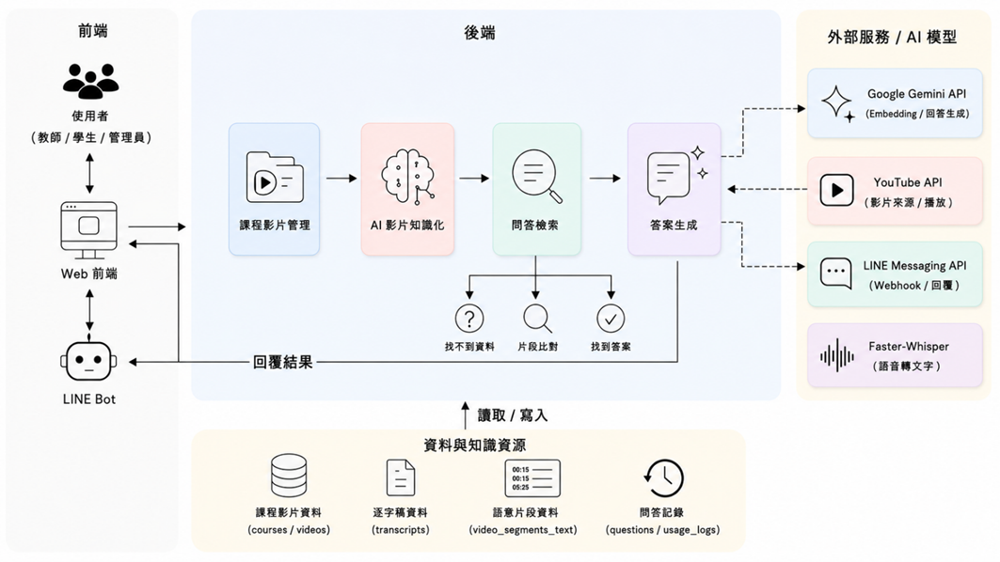

# 第3章 系統規格

> 狀態：初評原稿轉製，待核對現況。
> 原始資料日期：2026-06-02；Markdown 整理日期：2026-09-13。
> 來源：[初評系統手冊 DOCX](../source-documents/專題手冊_初評最終版.docx)，原第3章。

本章重用原稿文字、表格及嵌入圖像；尚未逐圖核對版面、合併儲存格與圖表編號，不代表最新版功能或正式驗收結果。

## 本次整理與待補

TODO：對照目前套件清單、部署環境與授權範圍更新軟硬體需求。既有文件的最低 OS 版本不等於相容性實測。

補充現況來源（尚待逐項套用）：[現行架構](../../../../ARCHITECTURE.md)、[共用架構圖](../../../20_Architecture/system-diagrams/)。

[返回手冊索引](../README.md)

---

## 3-1 系統架構

本系統名為FocusFlow，主要設計目標為將教學影片轉換為可被搜尋、可被提問，並能回溯至特定時間戳的學習知識資源，使學生在觀看教學影片時能更快速地找到所需內容，並降低教師重複回答相同問題的負擔。為達成此目標，本系統以教學影片為核心資料來源，結合語音辨識、語意分段與向量檢索等技術，建立可供學生提問與系統回覆的問答流程，並透過Web前端與LINE Bot提供操作與使用介面，使教師、學生與管理員能各自在合適的環境下完成課程影片管理、影片觀看與提問互動等工作。

整體架構分為三個部分：(1)使用者互動與課程入口；(2)後端核心流程與AI問答控制；(3)影片知識化與資料資源整合。各部分之說明如下：

使用者互動與課程入口：本系統提供教師、學生與管理員三種角色，並以Web前端作為主要操作介面。教師可於Web前端建立課程、上傳教學影片或貼上YouTube影片連結，並檢視影片處理狀態；學生可於Web前端瀏覽所屬課程影片、觀看影片內容，並針對影片提出問題；管理員則透過Web前端進行使用者、課程、影片與相關系統資料的管理。為配合學生在行動裝置上的使用情境，本系統另提供LINE Bot作為行動端的提問入口，學生在綁定帳號後即可於LINE中輸入問題，並由系統回覆對應的答案與影片時間戳，使學習互動不限於Web前端的使用情境。

後端核心流程與AI問答控制：後端負責本系統的整體流程控制，主要包含課程影片管理、AI影片知識化、問答檢索與答案生成四項工作。當教師於前端建立課程並上傳影片或提供YouTube影片連結後，後端會記錄影片基本資料，並啟動AI影片知識化流程，將影片內容處理為可檢索的知識資料。當學生透過Web前端或LINE Bot提出問題時，後端會將問題進行語意轉換，並從先前處理完成的影片語意片段中檢索相關內容；若檢索結果足以支援回答，便會交由生成式AI模型產生回覆並附上對應的影片時間戳，若檢索結果不足以回答問題，系統則會回覆查無相關內容，以避免提供與影片無關的資訊。

影片知識化與資料資源整合：影片知識化流程是本系統的核心處理階段。系統先透過Faster-Whisper將影片音訊轉換為帶有時間戳的逐字稿，再依語意完整性將逐字稿切分為較短的片段，並使用Google Gemini提供的文字向量嵌入模型，將片段轉換為語意向量後寫入資料庫，作為後續檢索的依據。資料層採用MongoDB作為主要儲存環境，集中保存課程與影片基本資料、逐字稿、語意片段與向量資料，以及學生提問與系統使用紀錄等內容，使影片資料、知識資料與使用歷程能在同一資料環境中相互對應，支援問答檢索與後續維護分析。

圖3-11為本系統之系統架構圖，呈現前端介面、後端核心流程、外部服務與AI模型，以及資料與知識資源之間的整體關係。

教師於Web前端建立課程與影片資料後，後端會透過YouTube API處理影片來源資訊，並由Faster-Whisper與Google Gemini API完成逐字稿生成、語意分段與向量化處理，將影片內容轉換為可檢索的知識資料並寫入資料庫;學生於Web前端或經由LINE Messaging API從LINE Bot提出問題後，後端會在語意片段中檢索相關內容，再交由生成式AI模型產生回答，最後將答案與對應的影片時間戳回傳至原本的提問介面。

透過上述流程，教師端的影片建立工作與學生端的提問互動形成完整的閉環，使教學影片能由原本僅供觀看的素材，轉換為可被檢索、可被提問並可回到特定片段的知識來源。

圖3-11系統流程圖

## 3-2 系統軟、硬體需求與技術平台

本系統採用前後端分離架構，前端以React19+Vite建構單頁應用程式（SPA），後端使用Node.js+Express提供RESTful API，資料庫採用MongoDB Atlas，並透過Mongoose操作資料模型與索引。AI影片處理Pipeline使用Python+FFmpeg+Faster-Whisper進行音訊抽取與語音轉文字，並以Google Gemini Embedding產生文字向量，供後續問答檢索使用。

目前第一階段的核心能力為教師上傳影片、系統自動執行AI Pipeline、學生針對影片內容提問，以及系統回傳答案與對應時間戳。音訊embedding與影片片段embedding目前屬於驗證支線，主要作為後續多模態檢索的基礎，還不是正式穩定功能。

整體系統以網頁形式提供教師端課程影片管理、影片上傳、處理狀態追蹤與簡易統計功能；學生端則可透過Web前端或LINE Bot進行課程瀏覽與提問。考量學生多在行動情境下使用，系統選擇整合LINE Messaging API作為輕量化提問入口，降低額外安裝App或學習新介面的門檻。

LINE是台灣使用普及率最高的即時通訊軟體，依LINE台灣2024年官方公布資料，LINE台灣月活躍用戶數達2，200萬人，滲透率約93%，顯示其作為學生端行動入口具有高度可行性。對學生使用者而言，LINE是其日常已熟悉且高頻使用的應用程式；以LINE Bot作為提問入口，可省去額外下載App、註冊帳號或安裝PWA等門檻，降低使用阻力、提升黏著度，這是PWA或原生App難以企及的優勢。此設計同時也降低了開發與維護成本：LINE平台已負責處理推播、訊息儲存與跨裝置同步，本系統僅需專注於後端Webhook與對話邏輯的開發。[1]

為釐清本系統運行時採用的技術堆疊，將各層級核心技術整理如表3-21：

表3-21系統技術平台選型

| 層級 | 採用技術 | 用途說明 |
| --- | --- | --- |
| 前端框架 | React19+Vite | 建構單頁應用程式，提供學生、教師、管理員三種角色介面 |
| 前端互動 | GSAP、Three.js、qrcode.react | 提供動畫、3D視覺元素與LINE Bot QR Code顯示 |
| 後端框架 | Node.js+Express4 | 提供RESTful API、JWT身分驗證、檔案上傳與後端業務邏輯 |
| 後端資料模型 | Mongoose8 | 定義MongoDB Schema、資料驗證與資料存取 |
| 資料庫 | MongoDB Atlas | 儲存使用者、課程、影片、逐字稿、向量片段與使用紀錄 |
| 語音轉文字 | Faster-Whisper | 將教學影片音訊轉錄為帶時間戳的逐字稿 |
| 音訊處理 | FFmpeg/imageio-ffmpeg | 從影片檔案抽取音訊，供STT Pipeline使用 |
| 文字向量嵌入 | Google Gemini Embedding | 將影片文字片段與學生問題轉換為語意向量 |
| 問答生成 | Google Gemini API（可切換OpenAI） | 根據檢索片段生成自然語言答案 |
| 向量檢索 | Memory mode /Atlas Vector Search | 開發或展示時可使用Memory mode；Atlas Vector Search需確認索引已建立後啟用 |
| 即時通訊整合 | LINE Messaging API | 提供學生端LINE Bot提問入口 |
| API文件 | Swagger UI（OpenAPI3.0） | 提供API規格查閱與測試介面 |
| 套件管理 | npm、pip、venv | 管理前後端與Python Pipeline的相依套件 |

考量網路環境差異與裝置多樣性，本系統前端介面支援各類網路連線模式（Wi-Fi/4G/5G），並利用Vite建置時自動產生的程式碼分割（code splitting）與快取機制，於低速網路下仍可維持基本可用性。LINE Bot端則因LINE平台本身具備離線訊息暫存與重送機制，使用者於網路不穩時仍能順暢提問，待連線恢復後接收回應。

為使系統能穩定運行於主流裝置，使用者端硬體需求詳列如表3-22：

表3-22使用者端硬體需求

| 系統硬體需求—裝置端 | 需求規格說明 |
| --- | --- |
| 裝置類型 | 支援瀏覽器之智慧型手機/平板/電腦；LINE Bot端需安裝LINE App |
| 作業系統版本 | Android8.0以上/iOS13以上/Windows10以上/macOS11以上 |
| 瀏覽器建議版本 | Chrome、Edge、Safari、Firefox等主流瀏覽器 |
| LINE App版本 | iOS13.7以上/Android12.0以上對應之LINE最新穩定版 |
| 網路需求 | Wi-Fi/4G/5G，觀看影片建議具備穩定網路連線 |
| 螢幕解析度 | 建議1280×720以上，行動裝置可依LINE App或瀏覽器畫面自適應 |
| 儲存空間需求 | 使用者端僅需基本瀏覽器快取空間，影片與系統資料主要儲存於伺服器與MongoDB Atlas |

## 3-3 使用標準與工具

以下列出了本組於開發FocusFlow AI教學影片問答系統時所使用的主要開發工具與技術，並說明各項工具的特點與選用理由：[1]

Node.js：具備非同步與事件驅動特性，適合處理Web API請求與即時資料交換。本系統使用Node.js作為後端執行環境，負責處理登入驗證、課程資料、影片資料、問答請求與LINE Bot訊息流程。

Express：為Node.js常用的輕量級Web應用框架，提供路由、中介層與請求處理功能。本系統使用Express建立RESTful API，便於前端、資料庫與外部服務進行整合。

MongoDB：為文件型NoSQL資料庫，適合儲存結構較彈性的資料。本系統使用MongoDB儲存使用者資料、課程資料、影片資訊、影片文字片段、問答紀錄與LINE綁定資料，並搭配MongoDB Atlas Vector Search進行語意檢索。

Mongoose：為Node.js操作MongoDB的ODM工具，可透過Schema定義資料格式與驗證規則。本系統使用Mongoose管理各資料集合的欄位結構，使資料存取與維護更具一致性。

React：為前端使用者介面開發函式庫，採用元件化設計方式，適合建立單頁式應用程式。本系統使用React製作學生、教師與管理員介面，提供課程瀏覽、影片問答、LINE綁定與後台管理等功能。

Vite：為現代化前端建置工具，具備快速啟動與熱更新特性。本系統使用Vite建立前端開發環境，提升畫面開發與測試效率。

Python：具備豐富的AI與資料處理套件，適合開發語音辨識與資料前處理流程。本系統使用Python建立AI Pipeline，負責影片音訊處理、語音轉文字、文字分段與向量嵌入。

Faster-Whisper：為Whisper語音辨識模型的高效能實作，可將影片音訊轉換為含時間戳的文字稿。本系統使用Faster-Whisper產生教學影片逐字稿，作為後續問答檢索的資料來源。

Google Gemini API：提供文字向量嵌入與生成式AI回答能力。本系統使用Gemini API將問題與影片片段轉換為向量，並根據檢索結果產生學生提問的回答內容。

LINE Messaging API：為LINE官方提供的Bot開發介面。本系統使用LINE Messaging API接收學生提問、完成帳號綁定與回覆AI問答內容，提供行動端的學習互動入口。

Visual Studio Code：為本組主要使用的程式碼編輯器，支援JavaScript、React、Python、Markdown等語言開發，並可透過擴充套件輔助除錯、格式化與版本控制。

GitHub：用於版本控制與團隊協作管理，支援多人分支開發、程式碼歷程追蹤與專案檔案保存。本組透過GitHub管理前端、後端與AI Pipeline程式碼。

MongoDB Compass：為MongoDB官方圖形化資料庫管理工具。本組使用MongoDB Compass檢視資料內容、確認Collection結構與測試查詢結果，提升資料庫除錯效率。

Plant UML/Diagrams.net：用於繪製系統相關圖表。本組使用Plant UML製作用例圖、循序圖、類別圖等UML圖，並使用Diagrams.net繪製系統架構圖與部署相關圖表。

Microsoft Word/PowerPoint：本組使用Microsoft Word撰寫系統手冊與專題報告，並使用Microsoft Power Point製作專題簡報與成果展示資料。

各項工具與環境依用途分類整理如表3-31：

表3-31工具表

| 系統開發環境 |  |
| --- | --- |
| 作業系統 | Windows11、macOS |
| 程式撰寫工具 | Visual Studio Code |
| AI程式輔助 | Claude Code、Codex |
| 程式開發工具 |  |
| 前端技術 | React19、Vite、JavaScript、HTML、CSS、ESLint、GSAP、Three.js |
| 後端技術 | Node.js、Express、RESTful API、JWT(jsonwebtoken)、bcryptjs、Multer、CORS |
| AI Pipeline | Python3、Faster-Whisper、Google Gemini API、PyMongo、ffmpeg |
| LINE Bot整合 | LINE Messaging API、Webhook、HMAC-SHA256簽章驗證 |
| 相依套件管理 | npm（Node.js）、pip+venv（Python） |
| 資料庫設計與管理 | MongoDB Atlas（雲端託管）、Mongoose8（ODM）、MongoDB Compass（GUI） |
| API文件與測試 | Swagger UI（OpenAPI3.0）、swagger-ui-express、js-yaml |
| 文件與美工工具 |  |
| 系統架構與部署圖 | draw.io（Diagrams.net） |
| UML圖（用例／循序／類別／活動） | Plant UML、Mermaid |
| 報告書撰寫 | Microsoft Word、Notion |
| 簡報製作 | Microsoft Power Point、Canva |
| 專案管理平台 |  |
| 版本控管與專案協作 | Git、GitHub、Notion |
| 檔案儲存 | GitHub、Google Drive |
