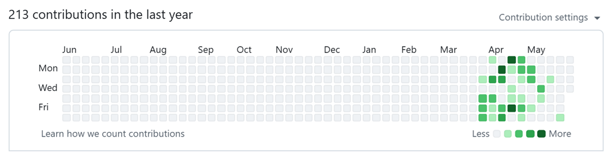
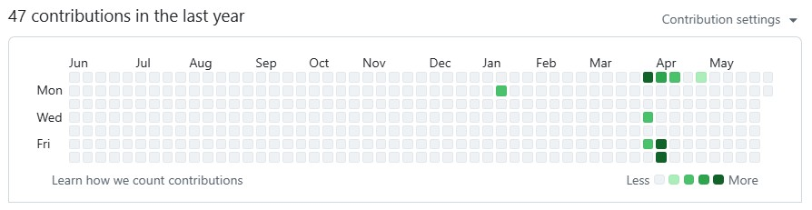

# 第4章 專案時程與組織分工

> 狀態：初評原稿轉製，待核對現況。
> 原始資料日期：2026-06-02；Markdown 整理日期：2026-09-13。
> 來源：[初評系統手冊 DOCX](../source-documents/專題手冊_初評最終版.docx)，原第4章。

本章重用原稿文字、表格及嵌入圖像；尚未逐圖核對版面、合併儲存格與圖表編號，不代表最新版功能或正式驗收結果。

## 本次整理與待補

TODO：更新完整兩學期甘特圖、每項一位主要負責人／最多兩位次要負責人的分工表、具中文姓名與學號的 GitHub 紀錄，並由全體確認合計 100% 的貢獻度。

補充現況來源（尚待逐項套用）：[教授與組內會議](../../../50_Meetings/README.md)。

[返回手冊索引](../README.md)

---

## 4-1 專案時程[2]

根據專案工作流程，我們將開發過程分成多個項目，將專案彙整成甘特圖如下：

圖4-11專案時程甘特圖

## 4-2 專案組織與分工[2]

表4-21專業組織與分工表

●：主要負責人、○：次要負責人

| 項目/組員 | 111246062邱偉豪 | 111246064 張庭語 | 111246084鍾百陶 | 111246085張家瑜 |  |
| --- | --- | --- | --- | --- | --- |
| 系統規劃 | MVP範圍與系統架構規劃 |  |  | ● |  |
|  | 使用者需求分析 |  |  | ○ | ● |
|  | 功能樹與流程設計 | ● |  | ○ |  |
|  | 影片處理與AI問答流程 |  | ○ | ● |  |
| 前端開發 | 首頁入口頁面 |  |  |  | ● |
|  | 使用者登入頁面 |  |  |  | ● |
|  | 角色切換 |  |  |  | ● |
|  | 側邊導覽列 |  |  |  | ● |
|  | 頂部資訊列 |  |  |  | ● |
|  | 學生儀表板頁面 |  |  |  | ● |
|  | 學生課程列表頁面 |  |  |  | ● |
|  | 學生課程詳細頁面 |  |  |  | ● |
|  | 學生影片播放功能 |  |  |  | ● |
|  | 學生AI問答面板 |  |  | ○ | ● |
|  | 學生LINE Bot綁定頁面 |  |  | ● | ○ |
|  | 教師儀表板頁面 |  |  |  | ● |
|  | 教師課程管理頁面 |  |  |  | ● |
|  | 教師新增課程功能 |  |  | ● | ○ |
|  | 教師影片上傳頁面 |  |  | ● | ○ |
|  | 教師影片處理狀態顯示 |  |  | ● | ○ |
|  | 管理員總覽頁面 |  |  |  | ● |
|  | 管理員使用者管理頁面 |  |  | ● | ○ |
|  | 管理員課程管理頁面 |  |  | ● | ○ |
|  | 管理員影片管理頁面 |  |  | ● | ○ |
|  | 管理員統計頁面 |  |  |  | ● |
|  | 整體UI視覺設計（首頁／登入／Dashboard／側邊列／圖示） |  |  |  | ● |
|  | 視覺互動效果（3D Button／Bubble Scene動態背景） |  |  |  | ● |
| 後端開發 | 登入驗證與JWT權限控管 | ● |  |  |  |
|  | API架構與基礎中介層 | ● |  |  |  |
|  | 課程CRUDAPI | ● |  | ○ |  |
|  | 影片管理API（上傳／列表／詳細／刪除） | ● |  | ○ |  |
|  | 影片處理控制API（狀態查詢／重試／內部回報） | ● |  | ○ |  |
|  | AI問答API | ● |  | ○ |  |
|  | LINE Webhook與簽章驗證 | ● |  | ○ |  |
|  | LINE綁定Token API | ● |  | ○ |  |
|  | 統計API（學生／教師／管理員） | ○ |  | ● |  |
|  | 管理員後台API | ○ |  | ● |  |
|  | 問題紀錄API | ○ |  | ● |  |
| 資料庫設計 | MongoDB資料模型設計 | ○ |  | ● |  |
|  | 影片片段與處理狀態結構 |  | ○ | ● |  |
|  | Embedding與向量資料結構 |  | ● | ○ |  |
|  | 問答匹配片段紀錄結構 | ○ |  | ● |  |
|  | MongoDB索引與Vector Search |  | ○ | ● |  |
|  | 資料匯入與Demo Seed工具 | ● |  | ○ |  |
| AI模組 | RAG檢索流程 | ○ | ● |  |  |
|  | 問題向量化、向量搜尋、答案生成 | ○ |  | ● |  |
|  | 回答附帶影片片段與時間戳 | ○ |  | ● |  |
|  | 問題與回答紀錄保存 | ○ |  | ● |  |
|  | 影片檔案掃描與音訊抽取 |  | ● |  |  |
|  | Whisper語音轉文字 |  | ● |  |  |
|  | 逐字稿快取、正規化與術語校正 |  | ● |  |  |
|  | 逐字稿切段Chunking |  | ● |  |  |
|  | Gemini Embedding |  | ● |  |  |
|  | STT Pipeline輸出檔案產製 |  | ● |  |  |
|  | MongoDB上傳與後端回報 |  | ○ | ● |  |
|  | 暫存檔清理機制 |  | ● |  |  |
| 部署維運 | VM環境建置與SSH設定 | ● |  |  |  |
|  | Nginx反向代理與SELinux設定 | ● |  |  |  |
|  | PM2服務管理與開機自啟 | ● |  |  |  |
|  | GitHub Actions Self-hosted Runner CI/CD | ● |  |  |  |
|  | ngrok HTTPS Tunnel（LINE Bot Webhook） | ● |  |  |  |
| 測試驗證 | 後端API測試 | ● |  |  |  |
|  | AI問答測試 | ● |  | ○ |  |
|  | LINE Bot流程測試 | ● |  | ○ |  |
|  | Demo Seed與MVP驗收測試 | ● |  | ○ |  |
| 文件撰寫 | 第1章前言 |  | ● |  |  |
|  | 第2章營運計畫 |  | ● |  |  |
|  | 第3章系統架構 | ● |  |  |  |
|  | 第4章專案時程與組織分工 | ● |  |  |  |
|  | 第5章需求模型 |  | ● |  |  |
|  | 第6章設計模型 | ● |  |  |  |
|  | 第7章實作模型 | ● |  |  |  |
|  | 第8章資料庫設計 | ● |  | ○ |  |
|  | 統整 | ○ | ● |  |  |
|  | README、Swagger與架構文件維護 | ● |  |  |  |
|  | ESG論文統整 |  | ● |  |  |
| 美術設計 | Logo設計 |  |  |  | ● |
|  | 前端静態圖片與圖示資源製作 |  |  |  | ● |
|  | 名牌設計與製作 |  |  |  | ● |
| 報告 | 簡報製作 |  |  |  | ● |

表4-22組員工作內容與貢獻度

| 序號 | 姓名 | 工作內容 | 貢獻度 |
| --- | --- | --- | --- |
| 1 | 組長11246084鍾百陶 | 系統規劃：MVP範圍、系統架構、AI問答與影片處理流程前端：教師上傳／處理狀態頁、管理員資料管理頁、LINE QR code與綁定頁面後端與資料庫：統計／後台／問題紀錄API、向量搜尋與答案生成、MongoDB模型、向量結構、Vector Search索引 | 25% |
| 2 | 組員11246062邱偉豪 | 後端：API架構、JWT、課程／影片／AI問答／LINE相關API、Demo Seed工具部署：VM、Nginx、PM2、GitHub Actions CI/CD、ngrok測試：後端、AI問答、LINE流程自動化測試文件：第3、4、6、7、8章及README、Swagger、會議紀錄 | 25% |
| 3 | 組員11246064張庭語 | AI模組：音訊抽取、Whisper STT、逐字稿Chunking、Gemini Embedding、STT輸出、暫存清理系統規劃：RAG檢索流程文件：第1、2、5章、論文章節統整 | 25% |
| 4 | 組員11246085張家瑜 | 前端：首頁、登入、Dashboard、學生課程／影片／AI問答頁、教師與管理員儀表板UI/UX：整體視覺、3D Button、Bubble Scene動態背景系統規劃：角色分流架構美術：Logo設計、名牌設計與製作報告：簡報製作 | 25% |
| 總計 | 100% |  |  |

## 4-3 上傳GitHub紀錄

11246062邱偉豪11246062邱偉豪11246085張家瑜11246085張家瑜11246064 張庭語11246064 張庭語11246084鍾百陶11246084鍾百陶

圖4-31上傳GitHub紀錄

圖4-32 11246062邱偉豪上傳GitHub紀錄

圖4-33 11246084鍾百陶上傳GitHub紀錄

圖4-34 11246085張家瑜上傳GitHub紀錄

圖4-35 11246064張庭語上傳GitHub紀錄

從2026/03/22開始全組使用Github協同管理，故Github上傳筆數較少。
