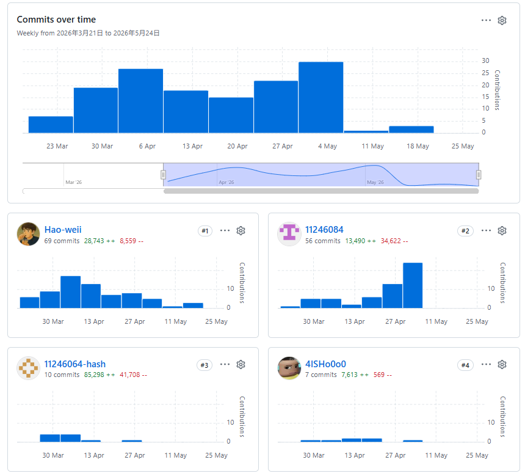
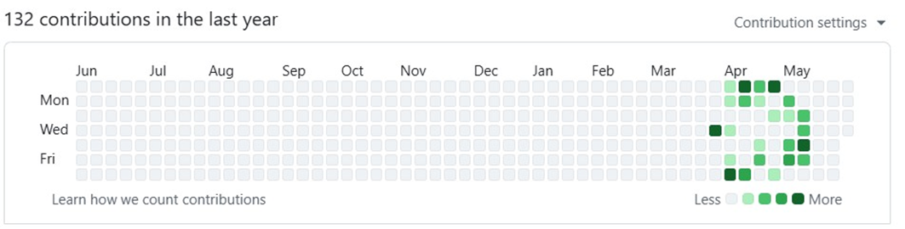
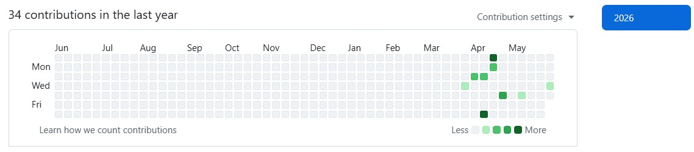

# 第4章 專案時程與組織分工

> Git commit 可用來確認版本歷程，但無法涵蓋會議、研究、設計、文件、測試及外部平台操作，也不能直接換算個人貢獻度。

---

## 4-1 專案時程

FocusFlow 的工作可依交付物分為需求與原型、MVP 串接、權限與品質補強、批次／檢索擴充、學生試用準備及系統手冊定稿等階段。實際開發具有反覆驗證與跨模組整合，不宜將圖中的日期解讀為功能在該日即完成正式驗收。

目前可由程式與歷史確認的主要里程碑包括：前後端與 AI Pipeline 主線、課程影片問答及 LINE 流程；角色式驗證、Enrollment、通知與私有頭像；多影片批次與可續跑 Pipeline；引用、多輪對話及短影音腳本／人工成品審核。正式學生試用、共享 Atlas 契約、外部服務持續可用性及完整上線驗收仍是獨立工作。

> **歷史圖／待重繪：** 下圖為初評甘特圖，未完整反映 2026 年 7 月至 9 月的 Enrollment、批次、階層式檢索、通知、頭像、學生試用與短影音工作，也未標示各項驗收邊界。EMF 在部分 Markdown 閱讀器可能無法顯示。本階段保留原檔，後續應依實際兩學期時程重繪為 PNG，並更名為「圖4-1-1-專案時程甘特圖-vX-x.png」。

圖4-1-1　專案時程甘特圖（初評歷史圖，待重繪）

## 4-2 專案組織與分工

下列分工沿用初評原稿，呈現團隊原先對主要與次要負責人的聲明。repository 可證明功能存在與提交者，但不足以獨立證明每一項工作的完整參與者；表中內容及貢獻度必須由四位成員共同確認後，才能作為正式定稿。

表4-2-1　專案組織與分工表（初評聲明，待全體確認）

●：主要負責人、○：次要負責人

| 項目/組員 | 11246062邱偉豪 | 11246064 張庭語 | 11246084鍾百陶 | 11246085張家瑜 |
| --- | --- | --- | --- | --- |
| 系統規劃 | MVP範圍與系統架構規劃 |  |  | ● |
|  | 使用者需求分析 |  |  | ○ | ● |
|  | 功能樹與流程設計 | ● |  | ○ |
|  | 影片處理與AI問答流程 |  | ○ | ● |
| 前端開發 | 首頁入口頁面 |  |  |  | ● |
|  | 使用者登入頁面 |  |  |  | ● |
|  | 角色切換 |  |  |  | ● |
|  | 側邊導覽列 |  |  |  | ● |
|  | 頂部資訊列 |  |  |  | ● |
|  | 學生儀表板頁面 |  |  |  | ● |
|  | 學生課程列表頁面 |  |  |  | ● |
|  | 學生課程詳細頁面 |  |  |  | ● |
|  | 學生影片播放功能 |  |  |  | ● |
|  | 學生AI問答面板 |  |  | ○ | ● |
|  | 學生LINE Bot綁定頁面 |  |  | ● | ○ |
|  | 教師儀表板頁面 |  |  |  | ● |
|  | 教師課程管理頁面 |  |  |  | ● |
|  | 教師新增課程功能 |  |  | ● | ○ |
|  | 教師影片上傳頁面 |  |  | ● | ○ |
|  | 教師影片處理狀態顯示 |  |  | ● | ○ |
|  | 管理員總覽頁面 |  |  |  | ● |
|  | 管理員使用者管理頁面 |  |  | ● | ○ |
|  | 管理員課程管理頁面 |  |  | ● | ○ |
|  | 管理員影片管理頁面 |  |  | ● | ○ |
|  | 管理員統計頁面 |  |  |  | ● |
|  | 整體UI視覺設計（首頁／登入／Dashboard／側邊列／圖示） |  |  |  | ● |
|  | 視覺互動效果（3D Button／Bubble Scene動態背景） |  |  |  | ● |
| 後端開發 | 登入驗證與JWT權限控管 | ● |  |  |
|  | API架構與基礎中介層 | ● |  |  |
|  | 課程CRUDAPI | ● |  | ○ |
|  | 影片管理API（上傳／列表／詳細／刪除） | ● |  | ○ |
|  | 影片處理控制API（狀態查詢／重試／內部回報） | ● |  | ○ |
|  | AI問答API | ● |  | ○ |
|  | LINE Webhook與簽章驗證 | ● |  | ○ |
|  | LINE綁定Token API | ● |  | ○ |
|  | 統計API（學生／教師／管理員） | ○ |  | ● |
|  | 管理員後台API | ○ |  | ● |
|  | 問題紀錄API | ○ |  | ● |
| 資料庫設計 | MongoDB資料模型設計 | ○ |  | ● |
|  | 影片片段與處理狀態結構 |  | ○ | ● |
|  | Embedding與向量資料結構 |  | ● | ○ |
|  | 問答匹配片段紀錄結構 | ○ |  | ● |
|  | MongoDB索引與Vector Search |  | ○ | ● |
|  | 資料匯入與Demo Seed工具 | ● |  | ○ |
| AI模組 | RAG檢索流程 | ○ | ● |  |
|  | 問題向量化、向量搜尋、答案生成 | ○ |  | ● |
|  | 回答附帶影片片段與時間戳 | ○ |  | ● |
|  | 問題與回答紀錄保存 | ○ |  | ● |
|  | 影片檔案掃描與音訊抽取 |  | ● |  |
|  | Whisper語音轉文字 |  | ● |  |
|  | 逐字稿快取、正規化與術語校正 |  | ● |  |
|  | 逐字稿切段Chunking |  | ● |  |
|  | Gemini Embedding |  | ● |  |
|  | STT Pipeline輸出檔案產製 |  | ● |  |
|  | MongoDB上傳與後端回報 |  | ○ | ● |
|  | 暫存檔清理機制 |  | ● |  |
| 部署維運 | VM環境建置與SSH設定 | ● |  |  |
|  | Nginx反向代理與SELinux設定 | ● |  |  |
|  | PM2服務管理與開機自啟 | ● |  |  |
|  | GitHub Actions Self-hosted Runner CI/CD | ● |  |  |
|  | ngrok HTTPS Tunnel（LINE Bot Webhook） | ● |  |  |
| 測試驗證 | 後端API測試 | ● |  |  |
|  | AI問答測試 | ● |  | ○ |
|  | LINE Bot流程測試 | ● |  | ○ |
|  | Demo Seed與MVP驗收測試 | ● |  | ○ |
| 文件撰寫 | 第1章前言 |  | ● |  |
|  | 第2章營運計畫 |  | ● |  |
|  | 第3章系統架構 | ● |  |  |
|  | 第4章專案時程與組織分工 | ● |  |  |
|  | 第5章需求模型 |  | ● |  |
|  | 第6章設計模型 | ● |  |  |
|  | 第7章實作模型 | ● |  |  |
|  | 第8章資料庫設計 | ● |  | ○ |
|  | 統整 | ○ | ● |  |
|  | README、Swagger與架構文件維護 | ● |  |  |
|  | ESG論文統整 |  | ● |  |
| 美術設計 | Logo設計 |  |  |  | ● |
|  | 前端静態圖片與圖示資源製作 |  |  |  | ● |
|  | 名牌設計與製作 |  |  |  | ● |
| 報告 | 簡報製作 |  |  |  | ● |

表4-2-2　組員工作內容與貢獻度（初評聲明，待全體確認）

| 序號 | 姓名 | 工作內容 | 貢獻度 |
| --- | --- | --- | --- |
| 1 | 組長11246084鍾百陶 | 系統規劃：MVP範圍、系統架構、AI問答與影片處理流程前端：教師上傳／處理狀態頁、管理員資料管理頁、LINE QR code與綁定頁面後端與資料庫：統計／後台／問題紀錄API、向量搜尋與答案生成、MongoDB模型、向量結構、Vector Search索引 | 25% |
| 2 | 組員11246062邱偉豪 | 後端：API架構、JWT、課程／影片／AI問答／LINE相關API、Demo Seed工具部署：VM、Nginx、PM2、GitHub Actions CI/CD、ngrok測試：後端、AI問答、LINE流程自動化測試文件：第3、4、6、7、8章及README、Swagger、會議紀錄 | 25% |
| 3 | 組員11246064張庭語 | AI模組：音訊抽取、Whisper STT、逐字稿Chunking、Gemini Embedding、STT輸出、暫存清理系統規劃：RAG檢索流程文件：第1、2、5章、論文章節統整 | 25% |
| 4 | 組員11246085張家瑜 | 前端：首頁、登入、Dashboard、學生課程／影片／AI問答頁、教師與管理員儀表板UI/UX：整體視覺、3D Button、Bubble Scene動態背景系統規劃：角色分流架構美術：Logo設計、名牌設計與製作報告：簡報製作 | 25% |
| 總計 | — | — | 100% |

## 4-3 上傳 GitHub 紀錄

本專案使用 Git 與 GitHub 保存程式及文件版本。以 2026-09-14 的目前 `HEAD`（`b55ee76`）執行 `git shortlog -sne HEAD`，可辨識四組學號 Email／作者別名；結果如下。此數字為目前版本歷史中的 commit 歸屬，不等於程式碼行數、工作時數或貢獻度。

表4-3-1　目前 repository commit 歸屬快照

| 學號 | 姓名 | Git 作者識別 | Commit 數 |
| --- | --- | --- | ---: |
| 11246062 | 邱偉豪 | `Weihao <11246062@ntub.edu.tw>` | 155 |
| 11246084 | 鍾百陶 | `11246084 <11246084@ntub.edu.tw>` | 118 |
| 11246064 | 張庭語 | `zty930925 <11246064@ntub.edu.tw>` | 42 |
| 11246085 | 張家瑜 | `4ISHo0o0 <11246085@ntub.edu.tw>` | 17 |

未推送、共同作者、合併、改寫歷史或使用不同 Email 的提交會影響統計結果，別名對應以成員確認為準。

> **歷史圖／待重製：** 以下五張截圖為初評時點，明顯早於目前 `HEAD`，只可作為歷史佐證。圖片本階段不修改；定稿時應由同一基準 commit 重新產生總覽與個人紀錄，並遮蔽不必要的個資或本機資訊。

圖4-3-1　GitHub 上傳紀錄總覽（初評歷史圖，待重製為「圖4-3-1-GitHub上傳紀錄總覽-vX-x.png」）

圖4-3-2　11246062 邱偉豪 GitHub 紀錄（初評歷史圖，待重製為「圖4-3-2-邱偉豪GitHub紀錄-vX-x.png」）

圖4-3-3　11246084 鍾百陶 GitHub 紀錄（初評歷史圖，待重製為「圖4-3-3-鍾百陶GitHub紀錄-vX-x.png」）

圖4-3-4　11246085 張家瑜 GitHub 紀錄（初評歷史圖，待重製為「圖4-3-4-張家瑜GitHub紀錄-vX-x.png」）

圖4-3-5　11246064 張庭語 GitHub 紀錄（初評歷史圖，待重製為「圖4-3-5-張庭語GitHub紀錄-vX-x.png」）
