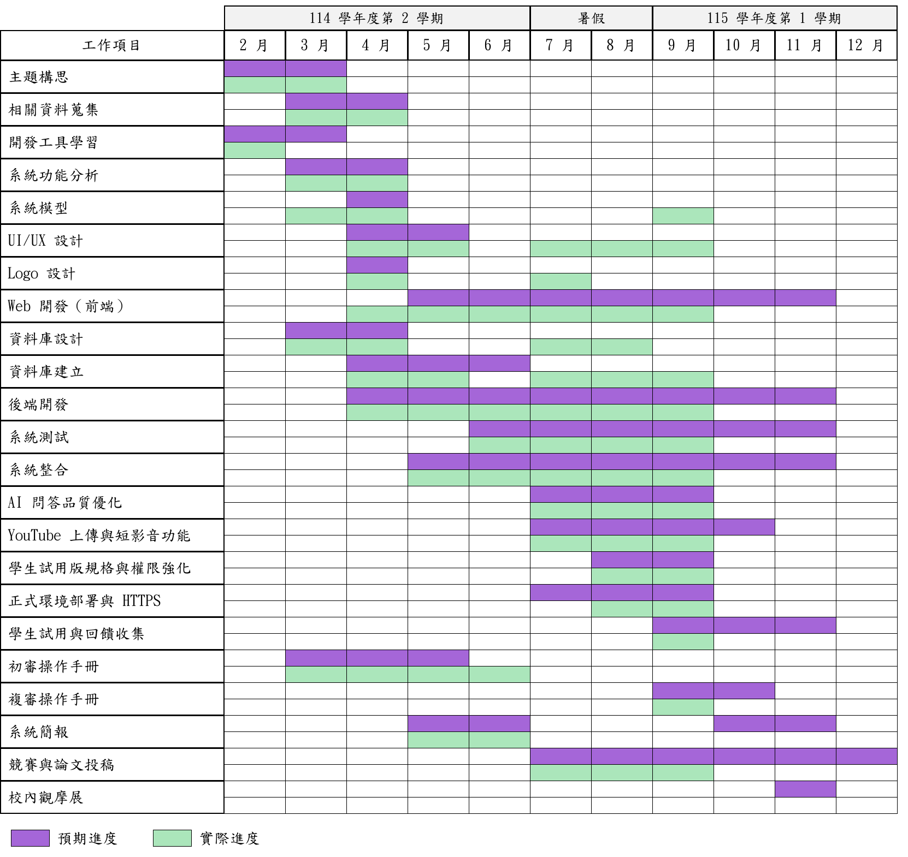

# 第4章 專案時程與組織分工

## 4-1 專案時程

本專題自 2026 年 2 月開始，橫跨 114 學年度第 2 學期與 115 學年度第 1 學期。根據專案工作流程，我們將整體開發過程分成多個工作項目，並彙整成圖4-1-1 的甘特圖。2026 年 6 月的專題審查後，團隊依評審意見與教授會議決議進入第二階段開發，新增「AI 問答品質優化」、「YouTube 上傳與短影音功能」、「學生試用版規格與權限強化」、「正式環境部署與 HTTPS」、「學生試用與回饋收集」、「競賽與論文投稿」及「校內觀摩展」等項目。系統自 2026 年 9 月 21 日起透過 https://focusflow.ntub.edu.tw 開放學生試用，這項進度也已反映在圖中。

圖4-1-1　專案時程甘特圖

圖4-1-1 中，紫色為預期進度，綠色為實際進度。第一學期（2～6 月）的項目集中在系統規劃與 MVP 開發，暑假與第二學期（7～12 月）則以功能擴充、正式環境部署與學生試用為主。6 月起各月份的工作重點整理如下：

表4-1-1　6 月起各月份工作重點

| 月份 | 階段 | 主要工作內容 |
| --- | --- | --- |
| 2026/06 | 專題審查與檢討 | 審查文件送件與簡報、評審提問檢討；修正 STT Pipeline 在 Linux VM 上的觸發路徑 |
| 2026/07 | Phase 2 功能擴充 | 學生教學短片牆頁面；影片自動上傳 YouTube 與多課程掛載；FAQ 快取；Pipeline 斷點續跑與長影片穩定性；Chunk 策略優化；角色登入、站內通知與頭貼；Topbar 與個人資料頁；全站 RWD；管理員獨立登入入口；多影片批次上傳 |
| 2026/08 | 檢索強化與試用規劃 | 階層式檢索（Parent Embedding 與 Leaf fallback）；Citation 契約；多輪對話問答；Gemini stable embedding 遷移；修課授權與學生名單管理；問答品質評測工具；學生試用版後端規格 v1.0～v1.2；短影片製作規格與教師短影片審核頁 |
| 2026/09 | 學生試用與成果審查準備 | 學生試用版安全隔離與驗收；正式環境 Atlas 問答啟用；Let’s Encrypt HTTPS 憑證與正式網域；短影音腳本自動生成、審核與上架；忘記密碼、登入鎖定與每日提問上限；全系統中文化；問題回報功能；9/21 開放學生試用；系統手冊改寫 |
| 2026/10～12 | 驗收與成果發表 | 整理學生試用驗收證據；成果簡報與展示；校內觀摩展；校外競賽；繳交最終文件 |

## 4-2 專案組織與分工

本組共四位成員，由鍾百陶擔任組長。表4-2-1 依系統規劃、前端開發、後端開發、資料庫設計、AI 自動化、部署維運、測試驗證、文件撰寫、美術設計與報告等類別，標示每個工作項目的主要負責人與次要負責人。

●：主要負責人、○：次要負責人

表4-2-1　專案組織與分工表

| 類別 | 項目 | 11246062 邱偉豪 | 11246064 張庭語 | 11246084 鍾百陶 | 11246085 張家瑜 |
| --- | --- | --- | --- | --- | --- |
| 系統規劃 | MVP 範圍與系統架構規劃 |  |  | ● |  |
|  | 使用者需求分析 |  |  | ○ | ● |
|  | 功能樹與流程設計 | ● |  |  | ○ |
|  | 影片處理與 AI 問答流程 |  | ○ | ● |  |
|  | 學生試用版後端規格與施工單 | ● |  | ○ |  |
|  | 階層式檢索資料契約 | ○ | ● |  |  |
|  | 短影音製作規格與腳本架構 |  |  | ● | ○ |
| 前端開發 | 首頁入口頁面 |  |  |  | ● |
|  | 使用者登入頁面 |  |  |  | ● |
|  | 角色切換與登入後導向 |  |  |  | ● |
|  | 側邊導覽列 |  |  |  | ● |
|  | 頂部資訊列 |  |  |  | ● |
|  | 學生儀表板頁面 |  |  |  | ● |
|  | 學生課程列表頁面 |  |  |  | ● |
|  | 學生課程詳細頁面 |  |  |  | ● |
|  | 學生影片播放功能 |  |  |  | ● |
|  | 學生 AI 問答面板 |  | ○ |  | ● |
|  | 學生 LINE Bot 綁定頁面 |  |  | ● | ○ |
|  | 教師儀表板頁面 |  |  |  | ● |
|  | 教師課程管理頁面 |  |  |  | ● |
|  | 教師新增課程功能 |  |  | ● | ○ |
|  | 教師影片上傳頁面 |  | ○ | ● | ○ |
|  | 教師影片處理狀態顯示 |  | ○ | ● | ○ |
|  | 管理員總覽頁面 |  |  |  | ● |
|  | 管理員使用者管理頁面 |  |  | ● | ○ |
|  | 管理員課程管理頁面 |  |  | ● | ○ |
|  | 管理員影片管理頁面 |  |  | ● | ○ |
|  | 管理員統計頁面 |  |  |  | ● |
|  | 整體 UI 視覺設計（首頁／登入／Dashboard／側邊列／圖示） |  |  |  | ● |
|  | 視覺互動效果（3D Button／Bubble Scene 動態背景） |  |  |  | ● |
|  | 學生教學短片牆頁面 | ○ |  |  | ● |
|  | Topbar 通知與使用者選單 |  |  |  | ● |
|  | 個人資料頁面（頭貼／姓名／密碼） |  |  |  | ● |
|  | 全站 RWD 響應式排版 |  |  |  | ● |
|  | 管理員獨立登入入口 |  |  |  | ● |
|  | 教師短影片審核頁面 |  |  | ○ | ● |
|  | 教師短影音腳本與成品上傳頁面 |  |  | ● | ○ |
|  | 多輪對話問答介面與引用片段顯示 | ○ | ● |  | ○ |
|  | 多影片批次上傳介面 |  | ● |  | ○ |
|  | 問題回報與意見回饋入口 | ○ |  |  | ● |
|  | 全系統中文化與學生端體驗修正 |  |  | ● | ○ |
| 後端開發 | API 架構與基礎中介層 | ● |  |  |  |
|  | 登入驗證與 JWT 權限控管 | ● |  |  |  |
|  | 課程 CRUD API | ● |  |  | ○ |
|  | 影片管理 API（上傳／列表／詳細／刪除） | ● |  | ○ |  |
|  | 影片處理控制 API（狀態查詢／重試／內部回報） | ● | ○ | ○ |  |
|  | AI 問答 API | ● | ○ | ○ |  |
|  | LINE Webhook 與簽章驗證 | ● |  | ○ |  |
|  | LINE 綁定 Token API | ● |  | ○ |  |
|  | 統計 API（學生／教師／管理員） | ○ |  | ● |  |
|  | 管理員後台 API（使用者／影片／事件紀錄） | ○ |  | ● |  |
|  | 問題紀錄 API | ○ |  | ● |  |
|  | 角色登入、站內通知與頭貼 API | ● |  | ○ |  |
|  | 修課授權與學生名單管理（含 CSV 匯入） | ● |  | ○ |  |
|  | YouTube 自動上傳、重試與刪除轉私人 |  | ○ | ● |  |
|  | FAQ 快取機制 |  | ● | ○ |  |
|  | 多影片批次處理與續跑 |  | ● |  |  |
|  | 多輪對話 API 與對話紀錄 |  | ● |  |  |
|  | LINE 多輪追問與跨課程隔離 | ● | ○ |  |  |
|  | 短影音腳本生成、審核與上架 API |  |  | ● |  |
|  | 忘記密碼、登入鎖定與每日提問上限 |  |  | ● |  |
|  | 系統服務狀態 API 與安全標頭 |  |  | ● |  |
|  | OpenAPI 補齊與 route 覆蓋測試 | ● |  |  |  |
| 資料庫設計 | MongoDB 資料模型設計 | ○ |  | ● |  |
|  | 影片片段與處理狀態結構 |  | ○ | ● |  |
|  | Embedding 與向量資料結構 |  | ● | ○ |  |
|  | 問答匹配片段紀錄結構 | ○ | ○ | ● |  |
|  | MongoDB 索引設計（含 Atlas Vector Search） |  | ○ | ● |  |
|  | 資料匯入與 Demo Seed 工具 | ● |  | ○ |  |
|  | Parent 階層片段結構與索引 |  | ● | ○ |  |
|  | 對話與訊息集合（conversations／messages） |  | ● |  |  |
|  | 通知、頭貼與修課集合 | ● |  | ○ |  |
|  | Stable Embedding 遷移與試用版向量重建 | ○ | ● |  |  |
| AI 自動化 | RAG 檢索流程 | ○ | ● |  |  |
|  | 問題向量化、向量搜尋、答案生成 | ○ |  | ● |  |
|  | 回答附帶影片片段與時間戳 |  |  | ● |  |
|  | 問題與回答紀錄保存 | ○ |  | ● |  |
|  | 影片檔案掃描與音訊抽取 |  | ● |  |  |
|  | Whisper 語音轉文字 |  | ● |  |  |
|  | 逐字稿快取、正規化與術語校正 |  | ● |  |  |
|  | 逐字稿切段 Chunking |  | ● |  |  |
|  | Gemini Embedding（文字／音訊／影片片段） |  | ● |  |  |
|  | STT Pipeline 輸出檔案產製 |  | ● |  |  |
|  | MongoDB 上傳與後端回報 |  | ○ | ● |  |
|  | 暫存檔清理機制 |  | ● |  |  |
|  | Pipeline 工作追蹤、斷點續跑與長影片穩定性 |  | ● |  |  |
|  | Chunk 策略與 STT 準確度優化 |  | ● |  |  |
|  | Parent Embedding 與階層式檢索 | ○ | ● |  |  |
|  | 問答 Prompt 調整與回答品質評測 |  | ○ | ● |  |
|  | 正式環境檢索診斷與引用收斂 | ○ | ● |  |  |
|  | 短影音選題與引用驗證腳本生成 |  | ○ | ● |  |
|  | 教師數位分身腳本範例與模板 |  |  |  | ● |
|  | 生成式影片測試（Veo／動態圖文方案） | ● |  |  | ○ |
| 部署維運 | VM 環境建置與 SSH 設定 | ● |  |  |  |
|  | Nginx 反向代理與 SELinux 設定 | ● |  |  |  |
|  | PM2 服務管理與開機自啟 | ● |  |  |  |
|  | GitHub Actions Self-hosted Runner CI/CD | ● |  |  |  |
|  | ngrok HTTPS Tunnel（LINE Bot Webhook） | ● |  |  |  |
|  | Let’s Encrypt HTTPS 憑證與正式網域 | ○ |  | ● |  |
|  | 正式環境 Atlas 問答啟用與上線檢查 | ○ |  | ● |  |
|  | 環境變數範本與跨服務設定同步 |  | ● |  |  |
| 測試驗證 | 後端 API 測試 | ● |  |  |  |
|  | AI 問答測試 |  | ● |  | ○ |
|  | LINE Bot 流程測試 |  | ● | ○ |  |
|  | Demo Seed 與 MVP 驗收測試 | ● |  | ○ | ○ |
|  | 學生試用版安全隔離與驗收測試 | ● | ○ |  | ○ |
|  | 多輪對話穩定性測試 |  | ● |  |  |
|  | 學生試用與回饋收集 |  | ○ |  | ● |
| 文件撰寫 | 第 1 章 前言 |  | ● |  |  |
|  | 第 2 章 營運計畫 |  | ● |  |  |
|  | 第 3 章 系統規格 | ● |  |  |  |
|  | 第 4 章 專案時程與組織分工 | ● |  |  |  |
|  | 第 5 章 需求模型 |  | ● |  |  |
|  | 第 6 章 設計模型 | ● |  |  |  |
|  | 第 7 章 實作模型 | ● |  |  |  |
|  | 第 8 章 資料庫設計 | ● |  | ○ |  |
|  | 統整 | ○ | ● |  |  |
|  | README、Swagger 與架構文件維護 | ● |  |  |  |
|  | ESG 論文統整 |  | ● |  |  |
|  | 手冊第 1～3 章改寫 |  | ○ | ● |  |
|  | 手冊第 4、13 章 |  |  |  | ● |
|  | 手冊第 5～11 章改寫與 UML 重繪 | ● |  |  |  |
|  | 手冊第 12 章 使用手冊 | ○ |  |  | ● |
|  | 第 14 章 參考資料 |  | ○ | ● |  |
|  | 學生試用版規格書與驗收證據 | ● | ○ | ○ |  |
|  | 會議紀錄整理 |  | ● |  | ○ |
|  | 競賽企劃書與系統概述 |  | ● |  |  |
| 美術設計 | 前端靜態圖片與圖示資源製作 |  |  |  | ● |
|  | Logo 設計（含 SVG 版本與網站 Favicon） |  |  |  | ● |
|  | 名牌製作 |  |  |  | ● |
| 報告 | 簡報製作 |  |  |  | ● |
|  | 成果簡報製作 |  |  |  | ● |

表4-2-2 為四位成員在兩個學期的主要工作內容與貢獻度，貢獻度合計為 100%。

表4-2-2　組員工作內容與貢獻度

| 序號 | 姓名 | 工作內容 | 貢獻度 |
| --- | --- | --- | --- |
| 1 | 組長 11246084 鍾百陶 | 系統規劃與AI問答流程；向量搜尋、答案生成、FAQ快取與統計後台API；YouTube自動上傳；短影片腳本自動化、上架與審核；通知、忘記密碼與個人資料；教師與管理員頁面；手冊第1～3、12章與全冊整合 | 25% |
| 2 | 組員 11246062 邱偉豪 | 後端API架構、JWT與課程、影片、問答、LINE API；修課名單與CSV匯入；VM、Nginx、PM2、CI/CD與HTTPS部署；自動化測試與試用驗收；影像檢索與問答評測；手冊第3～11章與附錄 | 25% |
| 3 | 組員 11246064 張庭語 | AI模組：音訊抽取、Whisper語音轉文字、逐字稿切段與Gemini Embedding；可續跑Pipeline與批次處理；階層式檢索；多輪問答前後端；RAG檢索流程；手冊第1、2、5章與論文統整 | 25% |
| 4 | 組員 11246085 張家瑜 | 前端首頁、登入、儀表板與學生課程、影片、問答頁；教學短片牆；管理員獨立登入入口；短影片審核頁；整體UI視覺與3D Button、Bubble Scene動態效果；Logo、名牌設計與簡報製作 | 25% |
| 總計 | — | — | 100% |

## 4-3 上傳 GitHub 紀錄

本專題使用 Git 管理程式與文件版本，程式碼存放於公開的 GitHub 儲存庫 `https://github.com/11246084/focusflow`。全組自 2026 年 3 月下旬開始以 GitHub 協同開發，日常開發在 dev 分支進行，確認無誤後再合併到 main 主分支，主分支的更新會自動部署到正式網站。

表4-3-1 為截至 2026 年 9 月 30 日，GitHub 主分支上各成員的提交次數。提交次數反映版本紀錄的數量，一次提交可能是一行修正，也可能是一整個功能，因此不等於工作量；會議討論、資料研究、介面設計、測試與文件校對等工作也未必以提交的形式呈現。

表4-3-1　GitHub 提交紀錄統計

| 學號 | 姓名 | GitHub 帳號 | 提交次數 |
| --- | --- | --- | ---: |
| 11246062 | 邱偉豪 | Hao-weii | 228 |
| 11246084 | 鍾百陶 | 11246084 | 139 |
| 11246064 | 張庭語 | 11246064-hash | 44 |
| 11246085 | 張家瑜 | 4ISHo0o0 | 19 |
| 合計 | — | — | 430 |

圖4-3-1 為 GitHub 儲存庫的貢獻者統計頁面，擷取於 2026 年 9 月 30 日，顯示近三個月（6 月 27 日至 9 月 27 日）主分支每週的提交次數，不含合併提交；下方依成員分列，並以方框標註每位成員的學號與姓名。

圖4-3-1　GitHub 貢獻者統計

圖4-3-2 至圖4-3-5 為四位成員個人 GitHub 頁面上的年度貢獻紀錄，每一格代表一天，顏色越深代表當天的貢獻越多。年度貢獻除了本專題的提交之外，也包含成員在其他儲存庫的提交、拉取請求與議題等活動，因此數字與表4-3-1 不同。

圖4-3-2　11246062 邱偉豪 GitHub 紀錄

接著是 11246084 鍾百陶 的年度貢獻紀錄（圖4-3-3）。

圖4-3-3　11246084 鍾百陶 GitHub 紀錄

接著是 11246085 張家瑜 的年度貢獻紀錄（圖4-3-4）。

圖4-3-4　11246085 張家瑜 GitHub 紀錄

接著是 11246064 張庭語 的年度貢獻紀錄（圖4-3-5）。

圖4-3-5　11246064 張庭語 GitHub 紀錄

貢獻者統計頁面只擷取了近三個月，圖4-3-6 另依主分支的完整提交紀錄，繪出兩個學期每週的提交次數：上方為全組合計，下方依成員分列。3 月至 5 月為第一學期的 MVP 開發期，6 月進行專題審查，提交較少；7 月起進入暑假與第二學期的功能擴充，9 月因學生試用上線與系統手冊整理，提交次數達到高峰。

圖4-3-6　兩學期每週提交次數
