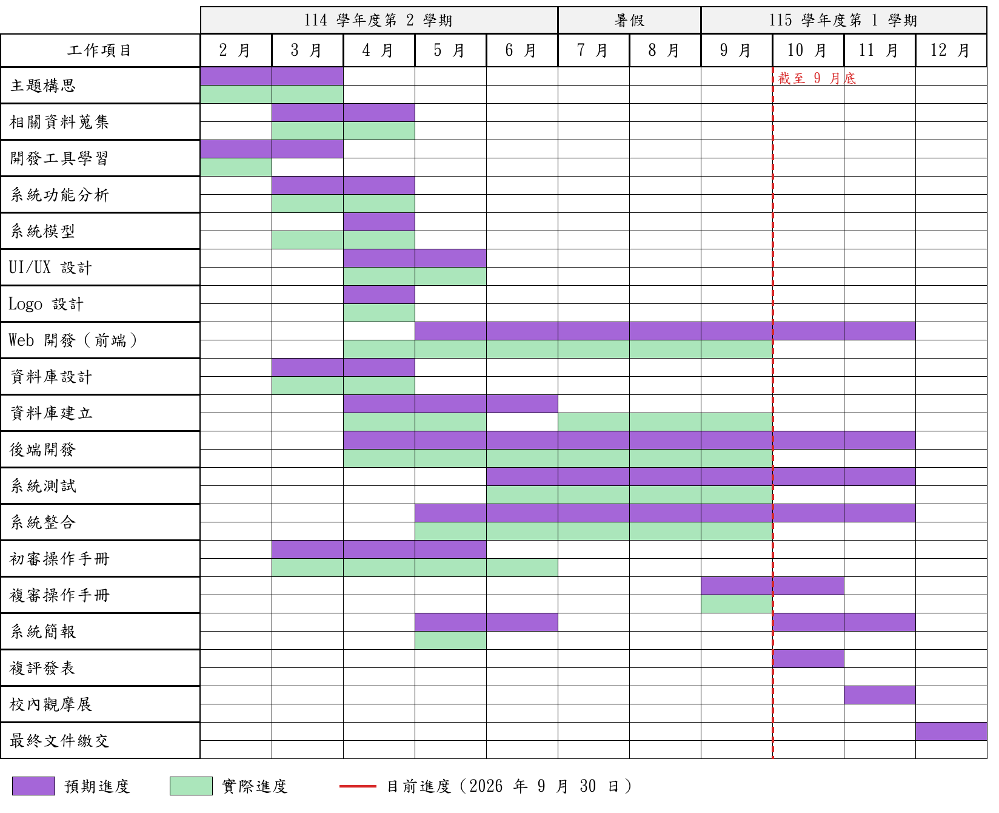
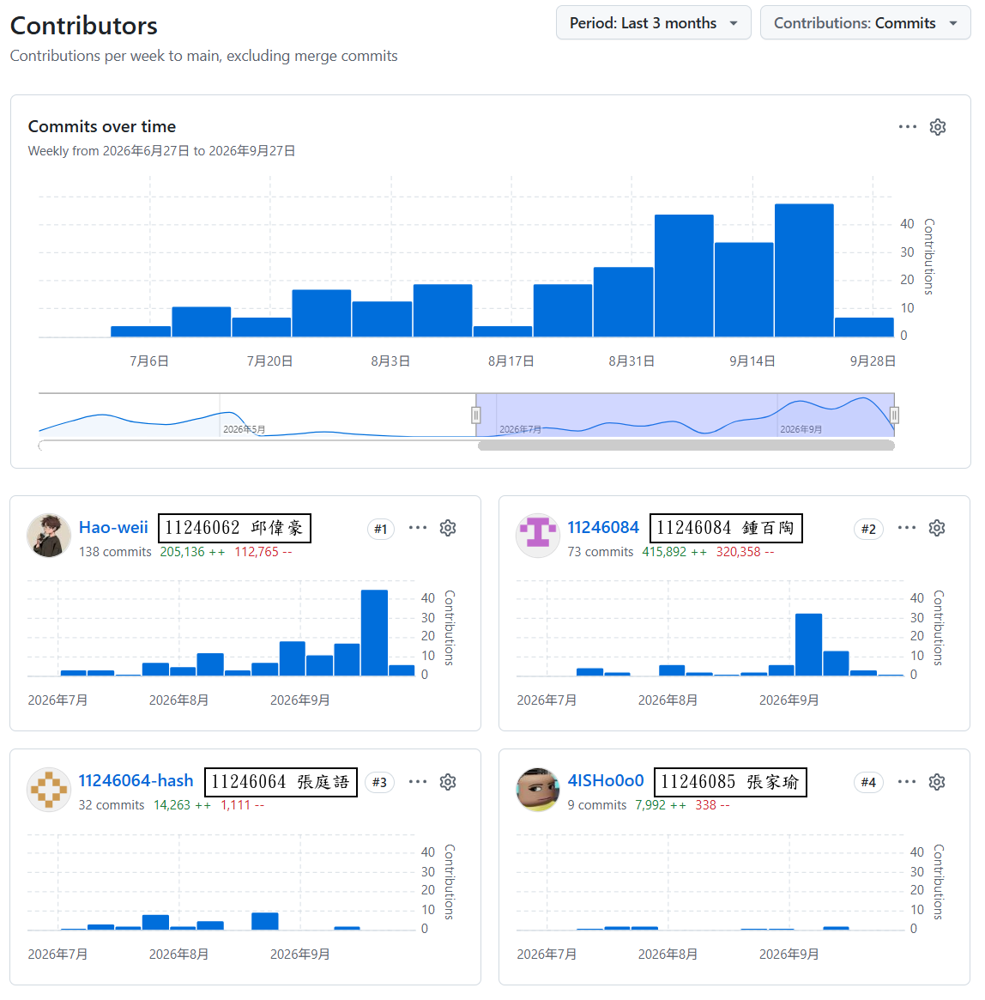
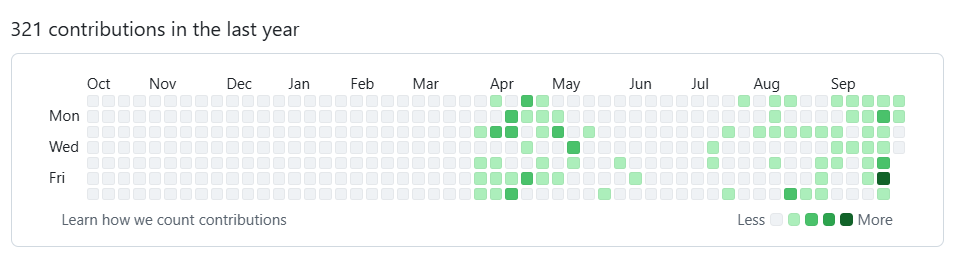
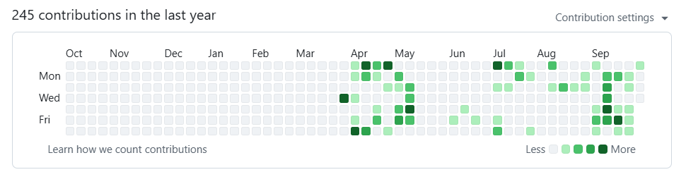
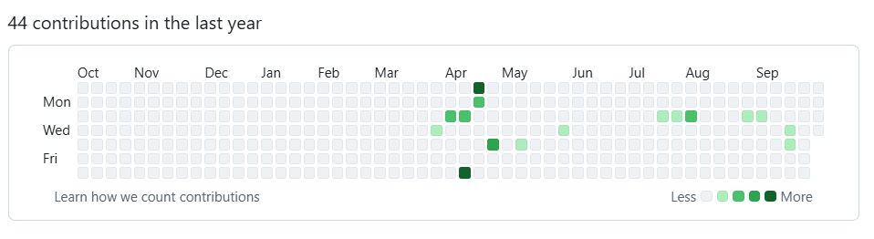
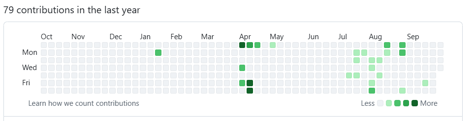
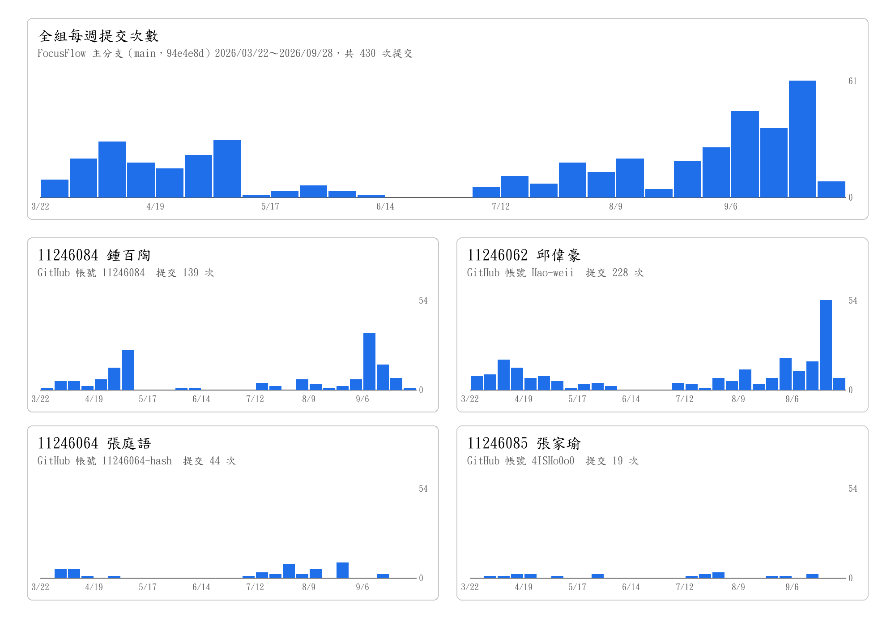

# 第4章 專案時程與組織分工

## 4-1 專案時程

本專題自 2026 年 2 月開始，橫跨 114 學年度第 2 學期與 115 學年度第 1 學期。第一學期（2～6 月）完成主題構思、資料蒐集、需求分析、系統模型與 MVP 開發，建立教師上傳影片、語音轉文字、向量檢索與 AI 問答的主要流程，並於 6 月 2 日參加初評。

暑假與第二學期（7～9 月）依初評意見持續擴充系統：7 月加入 YouTube 自動上傳、FAQ 快取、教學短片牆與多影片批次上傳；8 月完成修課學生管理與 CSV 匯入、階層式檢索與網頁多輪問答；9 月加入短影片腳本自動化與審核、忘記密碼、個人頭像與問題回報，完成 HTTPS 正式憑證等上線準備，並於 9 月 21 日起開放學生試用。10 月起依學校時程進行複評發表、11 月參加校內觀摩展，12 月繳交最終文件。

圖4-1-1 中，紫色為預期進度，綠色為實際進度，紅色虛線標示截至 2026 年 9 月底的進度。第一學期的預期與實際進度沿用初評時的規劃，第二學期的實際進度依組內會議紀錄與 GitHub 提交紀錄整理，複評發表、校內觀摩展與最終文件繳交則依系上公告的專題時程排定。

圖4-1-1　專案時程甘特圖

## 4-2 專案組織與分工

本組共四位成員，由鍾百陶擔任組長。表4-2-1 依系統規劃、前端開發、後端開發、資料庫設計、AI 模組、部署維運、測試驗證、文件撰寫、美術設計與報告等類別，標示每個工作項目的主要負責人與次要負責人；其中標示「（二）」的項目為第二學期新增的工作。

表4-2-1　專案組織與分工表

●：主要負責人、○：次要負責人

| 類別 | 項目 | 11246062 邱偉豪 | 11246064 張庭語 | 11246084 鍾百陶 | 11246085 張家瑜 |
| --- | --- | --- | --- | --- | --- |
| 系統規劃 | MVP範圍與系統架構規劃 |  |  | ● |  |
|  | 使用者需求分析 |  |  | ○ | ● |
|  | 功能樹與流程設計 | ● |  | ○ |  |
|  | 影片處理與AI問答流程 |  | ○ | ● |  |
| 前端開發 | 首頁入口頁面 |  |  |  | ● |
|  | 使用者登入頁面 |  |  |  | ● |
|  | 角色切換 |  |  |  | ● |
|  | 側邊導覽列 |  |  |  | ● |
|  | 頂部資訊列 |  |  |  | ● |
|  | 學生儀表板頁面 |  |  |  | ● |
|  | 學生課程列表頁面 |  |  |  | ● |
|  | 學生課程詳細頁面 |  |  |  | ● |
|  | 學生影片播放功能 |  |  |  | ● |
|  | 學生AI問答面板 |  |  | ○ | ● |
|  | 學生LINE Bot綁定頁面 |  |  | ● | ○ |
|  | 教師儀表板頁面 |  |  |  | ● |
|  | 教師課程管理頁面 |  |  |  | ● |
|  | 教師新增課程功能 |  |  | ● | ○ |
|  | 教師影片上傳頁面 |  |  | ● | ○ |
|  | 教師影片處理狀態顯示 |  |  | ● | ○ |
|  | 管理員總覽頁面 |  |  |  | ● |
|  | 管理員使用者管理頁面 |  |  | ● | ○ |
|  | 管理員課程管理頁面 |  |  | ● | ○ |
|  | 管理員影片管理頁面 |  |  | ● | ○ |
|  | 管理員統計頁面 |  |  |  | ● |
|  | 整體UI視覺設計（首頁／登入／Dashboard／側邊列／圖示） |  |  |  | ● |
|  | 視覺互動效果（3D Button／Bubble Scene動態背景） |  |  |  | ● |
|  | （二）修課學生管理與CSV匯入介面 | ● |  | ○ |  |
|  | （二）網頁多輪問答與對話紀錄介面 | ○ | ● |  |  |
|  | （二）教學短片牆頁面 | ○ |  |  | ● |
|  | （二）管理員獨立登入入口 | ○ |  |  | ● |
|  | （二）短影片腳本與成品上傳頁面 |  |  | ● |  |
|  | （二）短影片審核頁面 |  |  | ○ | ● |
|  | （二）個人資料、頭像與忘記密碼頁面 | ○ |  | ● |  |
|  | （二）問題回報與意見回饋 | ● |  |  |  |
| 後端開發 | 登入驗證與JWT權限控管 | ● |  |  |  |
|  | API架構與基礎中介層 | ● |  |  |  |
|  | 課程CRUD API | ● |  | ○ |  |
|  | 影片管理API（上傳／列表／詳細／刪除） | ● |  | ○ |  |
|  | 影片處理控制API（狀態查詢／重試／內部回報） | ● |  | ○ |  |
|  | AI問答API | ● |  | ○ |  |
|  | LINE Webhook與簽章驗證 | ● |  | ○ |  |
|  | LINE綁定Token API | ● |  | ○ |  |
|  | 統計API（學生／教師／管理員） | ○ |  | ● |  |
|  | 管理員後台API | ○ |  | ● |  |
|  | 問題紀錄API | ○ |  | ● |  |
|  | （二）修課名單與CSV匯入API | ● |  | ○ |  |
|  | （二）多影片批次上傳與處理API | ○ | ● |  |  |
|  | （二）網頁多輪問答API | ○ | ● |  |  |
|  | （二）FAQ快取與提問額度控管 | ○ |  | ● |  |
|  | （二）YouTube自動上傳與刪除下架 | ○ |  | ● |  |
|  | （二）短影片腳本自動化與審核API | ○ |  | ● |  |
|  | （二）通知、忘記密碼與登入鎖定 | ○ |  | ● |  |
|  | （二）問題回報API | ● |  |  |  |
| 資料庫設計 | MongoDB資料模型設計 | ○ |  | ● |  |
|  | 影片片段與處理狀態結構 |  | ○ | ● |  |
|  | Embedding與向量資料結構 |  | ● | ○ |  |
|  | 問答匹配片段紀錄結構 | ○ |  | ● |  |
|  | MongoDB索引與Vector Search |  | ○ | ● |  |
|  | 資料匯入與Demo Seed工具 | ● |  | ○ |  |
|  | （二）修課、通知、對話與短影片集合擴充 | ● | ○ | ○ |  |
| AI模組 | RAG檢索流程 | ○ | ● |  |  |
|  | 問題向量化、向量搜尋、答案生成 | ○ |  | ● |  |
|  | 回答附帶影片片段與時間戳 | ○ |  | ● |  |
|  | 問題與回答紀錄保存 | ○ |  | ● |  |
|  | 影片檔案掃描與音訊抽取 |  | ● |  |  |
|  | Whisper語音轉文字 |  | ● |  |  |
|  | 逐字稿快取、正規化與術語校正 |  | ● |  |  |
|  | 逐字稿切段Chunking |  | ● |  |  |
|  | Gemini Embedding |  | ● |  |  |
|  | STT Pipeline輸出檔案產製 |  | ● |  |  |
|  | MongoDB上傳與後端回報 |  | ○ | ● |  |
|  | 暫存檔清理機制 |  | ● |  |  |
|  | （二）可續跑Pipeline與批次處理 |  | ● |  |  |
|  | （二）階層式檢索（Parent Chunk） | ○ | ● | ○ |  |
|  | （二）影像與文字並行檢索 | ● |  |  |  |
|  | （二）問答品質評測 | ● | ○ |  |  |
| 部署維運 | VM環境建置與SSH設定 | ● |  |  |  |
|  | Nginx反向代理與SELinux設定 | ● |  |  |  |
|  | PM2服務管理與開機自啟 | ● |  |  |  |
|  | GitHub Actions Self-hosted Runner CI/CD | ● |  |  |  |
|  | ngrok HTTPS Tunnel（LINE Bot Webhook） | ● |  |  |  |
|  | （二）HTTPS正式憑證與學生試用上線 | ● |  | ○ |  |
| 測試驗證 | 後端API測試 | ● |  |  |  |
|  | AI問答測試 | ● |  | ○ |  |
|  | LINE Bot流程測試 | ● |  | ○ |  |
|  | Demo Seed與MVP驗收測試 | ● |  | ○ |  |
|  | （二）學生試用驗收測試 | ● |  | ○ |  |
| 文件撰寫 | 第1章前言 |  | ● | ○ |  |
|  | 第2章營運計畫 |  | ● | ○ |  |
|  | 第3章系統架構 | ● |  | ○ |  |
|  | 第4章專案時程與組織分工 | ● |  | ○ |  |
|  | 第5章需求模型 | ○ | ● |  |  |
|  | 第6章設計模型 | ● |  |  |  |
|  | 第7章實作模型 | ● |  |  |  |
|  | 第8章資料庫設計 | ● |  | ○ |  |
|  | （二）第9～11章程式、測試模型與操作手冊 | ● |  |  |  |
|  | （二）第12章使用手冊 | ○ |  | ● |  |
|  | （二）附錄與評審意見修正 | ● |  | ○ |  |
|  | 統整 | ○ | ● | ○ |  |
|  | README、Swagger與架構文件維護 | ● |  |  |  |
|  | ESG論文統整 |  | ● |  |  |
| 美術設計 | Logo設計 |  |  |  | ● |
|  | 前端靜態圖片與圖示資源製作 |  |  |  | ● |
|  | 名牌設計與製作 |  |  |  | ● |
| 報告 | 簡報製作 |  |  |  | ● |

表4-2-2 為四位成員在兩個學期的主要工作內容與貢獻度，貢獻度合計為 100%。

表4-2-2　組員工作內容與貢獻度

| 序號 | 姓名 | 工作內容 | 貢獻度 |
| --- | --- | --- | --- |
| 1 | 組長 11246084 鍾百陶 | 系統規劃與AI問答流程；向量搜尋、答案生成、FAQ快取與統計後台API；YouTube自動上傳；短影片腳本自動化、上架與審核；通知、忘記密碼與個人資料；教師與管理員頁面；手冊第1～3、12章與全冊整合 | 25% |
| 2 | 組員 11246062 邱偉豪 | 後端API架構、JWT與課程、影片、問答、LINE API；修課名單與CSV匯入；VM、Nginx、PM2、CI/CD與HTTPS部署；自動化測試與試用驗收；影像檢索與問答評測；手冊第3～11章與附錄 | 25% |
| 3 | 組員 11246064 張庭語 | AI模組：音訊抽取、Whisper語音轉文字、逐字稿切段與Gemini Embedding；可續跑Pipeline與批次處理；階層式檢索；多輪問答前後端；RAG檢索流程；手冊第1、2、5章與論文統整 | 25% |
| 4 | 組員 11246085 張家瑜 | 前端首頁、登入、儀表板與學生課程、影片、問答頁；教學短片牆；管理員獨立登入入口；短影片審核頁；整體UI視覺與3D Button、Bubble Scene動態效果；Logo、名牌設計與簡報製作 | 25% |
| 總計 | — | — | 100% |

## 4-3 上傳 GitHub 紀錄

本專題使用 Git 管理程式與文件版本，程式碼存放於公開的 GitHub 儲存庫 `https://github.com/11246084/focusflow`。全組自 2026 年 3 月下旬開始以 GitHub 協同開發，日常開發在 dev 分支進行，確認無誤後再合併到 main 主分支，主分支的更新會自動部署到正式網站。

表4-3-1 為截至 2026 年 9 月 30 日，GitHub 主分支上各成員的提交次數。提交次數反映版本紀錄的數量，一次提交可能是一行修正，也可能是一整個功能，因此不等於工作量；會議討論、資料研究、介面設計、測試與文件校對等工作也未必以提交的形式呈現。

表4-3-1　GitHub 提交紀錄統計

| 學號 | 姓名 | GitHub 帳號 | 提交次數 |
| --- | --- | --- | ---: |
| 11246062 | 邱偉豪 | Hao-weii | 228 |
| 11246084 | 鍾百陶 | 11246084 | 139 |
| 11246064 | 張庭語 | 11246064-hash | 44 |
| 11246085 | 張家瑜 | 4ISHo0o0 | 19 |
| 合計 | — | — | 430 |

圖4-3-1 為 GitHub 儲存庫的貢獻者統計頁面，擷取於 2026 年 9 月 30 日，顯示近三個月（6 月 27 日至 9 月 27 日）主分支每週的提交次數，不含合併提交；下方依成員分列，並以方框標註每位成員的學號與姓名。

圖4-3-1　GitHub 貢獻者統計

圖4-3-2 至圖4-3-5 為四位成員個人 GitHub 頁面上的年度貢獻紀錄，每一格代表一天，顏色越深代表當天的貢獻越多。年度貢獻除了本專題的提交之外，也包含成員在其他儲存庫的提交、拉取請求與議題等活動，因此數字與表4-3-1 不同。

圖4-3-2　11246062 邱偉豪 GitHub 紀錄

圖4-3-3　11246084 鍾百陶 GitHub 紀錄

圖4-3-4　11246085 張家瑜 GitHub 紀錄

圖4-3-5　11246064 張庭語 GitHub 紀錄

貢獻者統計頁面只擷取了近三個月，圖4-3-6 另依主分支的完整提交紀錄，繪出兩個學期每週的提交次數：上方為全組合計，下方依成員分列。3 月至 5 月為第一學期的 MVP 開發期，6 月進行初評，提交較少；7 月起進入第二學期的功能擴充，9 月因學生試用上線與系統手冊複評整理，提交次數達到高峰。

圖4-3-6　兩學期每週提交次數
