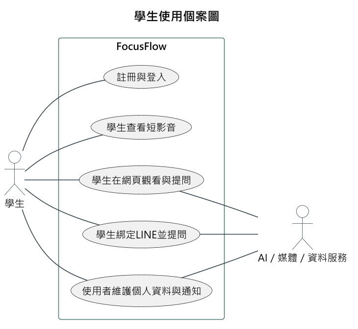
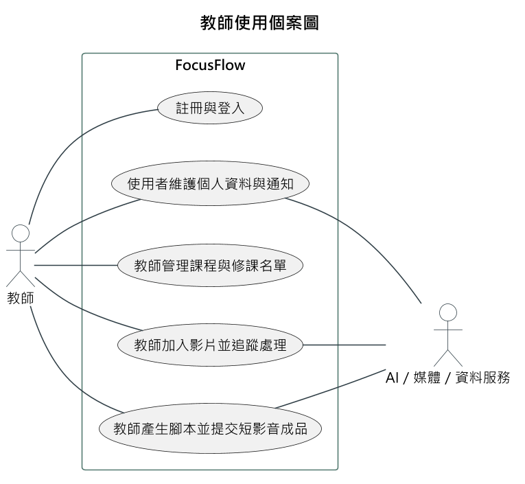
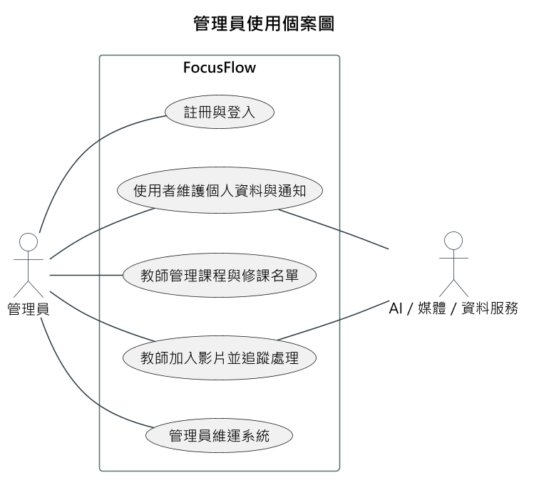
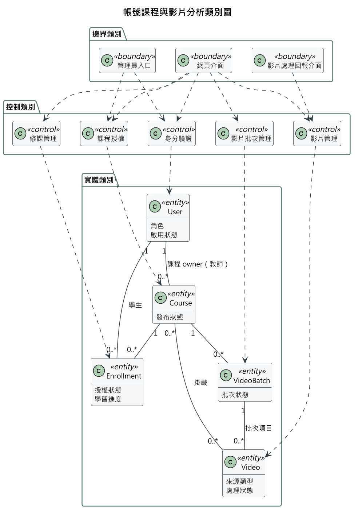
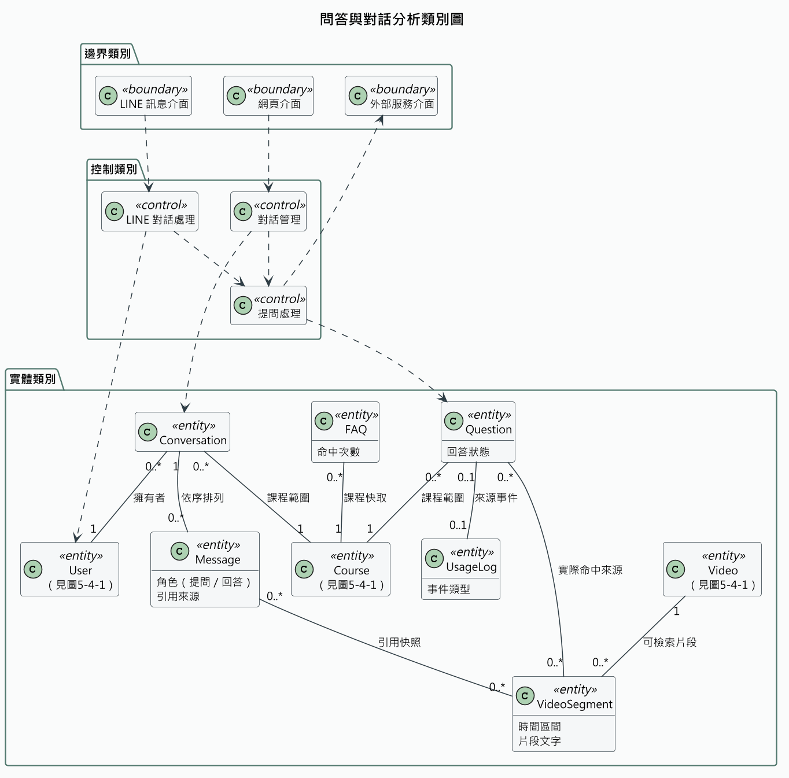
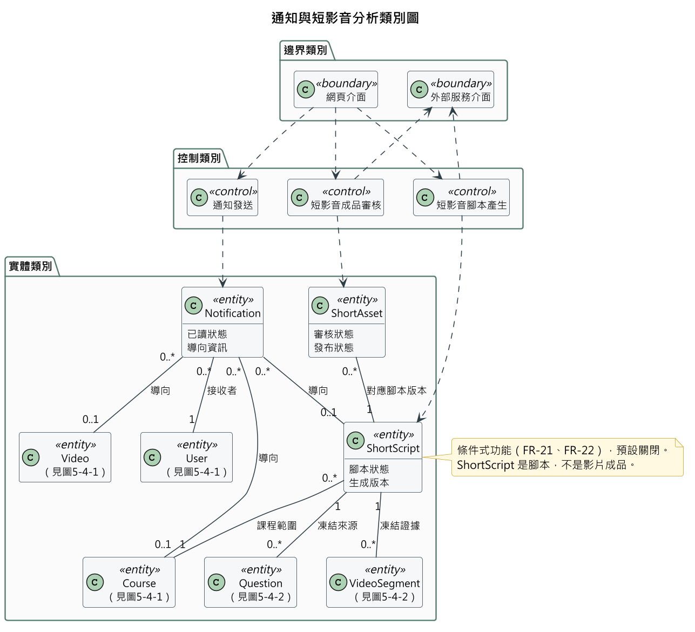

# 第5章 需求模型

> 現況基準：本章已於 2026-09-14 依目前路由、服務、資料模型與前端操作頁面完成第一階段文字校正。
> 需求編號用於串接本章使用個案與後續設計／測試文件；「已實作」只表示目前 repository 有對應程式，不代表正式環境已完成驗收。

[返回手冊索引](../README.md)

---

## 5-1 使用者需求

FocusFlow 的主要使用者為學生、教師與管理員，LINE 平台則是學生問答的外部系統。所有角色的可見功能必須由後端權限再次驗證，不以選單是否顯示作為授權依據。

### 功能性需求

表5-1-1　功能性需求與使用個案追溯表

| 編號 | 功能性需求 | 目前狀態 | 對應使用個案 |
| --- | --- | --- | --- |
| FR-01 | 系統應允許學生或教師以姓名、Email、密碼及角色自助註冊；不得透過公開註冊建立管理員帳號。 | 已實作 | UC-01 |
| FR-02 | 系統應以 Email、密碼及所選角色驗證登入；帳號角色不符、停用或憑證錯誤時應拒絕。 | 已實作 | UC-01 |
| FR-03 | 已登入使用者應能查看與修改個人姓名、Email、密碼及私有頭像；忘記密碼流程應以驗證碼重設。 | 已實作；寄信依 SMTP 設定 | UC-06 |
| FR-04 | 一般入口與 `/admin` 應分流；非管理員不得進入管理介面，管理員不提供自助註冊。 | 已實作 | UC-01、UC-09 |
| FR-05 | 教師應能建立、查看、修改及刪除自己的課程，並管理 draft／published／archived 狀態；管理員可跨課程管理。 | 已實作 | UC-02、UC-09 |
| FR-06 | 課程教師或管理員應能以學生 Email 指派、以名單匯入及 soft revoke Enrollment，並保留撤銷稽核資訊。 | 已實作 | UC-02 |
| FR-07 | 學生只應存取「有效 Enrollment 且 Course 為 published」的課程、影片、QA／FAQ、課程通知、Shorts 與 LINE 課程範圍。系統不得提供學生自助選課、邀請碼或申請審核流程。 | 應用 API 已實作；`/uploads` 匿名媒體交付尚未符合本需求 | UC-04、UC-05、UC-07 |
| FR-08 | 教師或管理員應能將本機影片或 YouTube 連結加入可管理的課程，並阻擋同課程的明確重複來源。 | 已實作 | UC-03 |
| FR-09 | 教師或管理員應能以單一 multipart 請求建立多影片批次，查看批次／單項狀態，並對允許的失敗項目重試。 | 已實作；Pipeline batch 模式預設關閉 | UC-03 |
| FR-10 | 系統應記錄影片 queued、processing、completed、failed 狀態與嘗試資訊；非法狀態轉換及重複回報不得破壞既有結果。 | 已實作 | UC-03 |
| FR-11 | 教師或管理員應能將既有影片掛載至其他可管理課程或解除掛載；刪除與解除掛載須保持不同語意。 | 已實作 | UC-03 |
| FR-12 | 學生應能播放授權影片，系統應記錄開啟事件；達成觀看門檻時以不重複方式更新修課進度。 | UI／事件流程已實作；本機影片檔仍缺少授權式交付 | UC-04 |
| FR-13 | 學生應能在授權課程中建立／續用網頁對話、提出問題、查看歷史訊息，並對可重試的失敗訊息重試。 | 已實作 | UC-04 |
| FR-14 | 問答回覆應提供回答狀態及實際命中的來源資訊，包括影片、片段文字與可用時間點；使用者可由引用跳回影片。 | 已實作 | UC-04、UC-05 |
| FR-15 | 當權限不足、影片尚未可用或檢索證據不足時，系統應拒絕請求或回覆無充分答案，不得虛構課程內容。 | 已實作的契約；品質仍須正式題組驗證 | UC-04、UC-05 |
| FR-16 | 系統得對無對話歷史且符合條件的問答使用 FAQ 快取；影片重處理或內容移除時應依規則失效快取。 | 已實作；可由功能設定控制 | UC-04 |
| FR-17 | 已登入使用者應能取得一次性 LINE 綁定資訊；綁定後學生可在有效修課課程間選擇並提問，LINE 問答應重用後端課程授權與 QA 服務。 | 已實作；需 LINE 部署設定 | UC-05 |
| FR-18 | 使用者應能查看站內通知並標記單筆或全部已讀；系統可發送影片完成、短影音退回等通知，管理員可發送全站公告。 | 已實作 | UC-06、UC-09 |
| FR-19 | 系統應提供學生、教師與管理員相符的儀表板及統計；管理員可維護使用者、影片並查看事件資料。 | 已實作 | UC-09 |
| FR-20 | 學生短影音牆只應顯示其有效修課且已發布課程中，狀態為 published 且 YouTube 可播放的 ShortAsset。 | 已實作 | UC-07 |
| FR-21 | 啟用短影音腳本功能時，教師或管理員應能由課程提問候選建立凍結證據、生成腳本版本、核准、要求修改或放棄主題。生成內容只能引用凍結證據。 | 條件式實作；`SHORT_SCRIPT_AUTOMATION_ENABLED` 預設關閉 | UC-08 |
| FR-22 | 啟用短影音腳本功能且教師已備妥成品時，系統應允許人工上傳成品、留存 AI 揭露／同意確認、上傳 YouTube 供預覽，並以成品審核決定是否進入學生牆。系統不得宣稱會自動剪輯或渲染成品。 | 條件式／人工流程；外部上傳另需設定 | UC-08 |

### 非功能性需求

表5-1-2　非功能性需求表

| 編號 | 非功能性需求 | 驗證重點 |
| --- | --- | --- |
| NFR-01 | **授權安全：** 所有受保護 API 與非公開媒體交付應驗證身分，並依角色、課程所有權、Enrollment 與資源狀態判斷權限。 | API 已有跨角色與撤銷測試；`/uploads` 匿名靜態路徑為未完成項 |
| NFR-02 | **憑證安全：** 密碼只保存雜湊；Webhook 應驗簽；secret 不得寫入程式、文件或回應。 | 檢查 bcrypt、JWT、LINE 簽章與部署 secret 管理 |
| NFR-03 | **隱私：** 私有頭像必須登入後讀取；Email、LINE 識別、提問與使用紀錄不得無授權公開。 | 驗證匿名與跨帳號讀取被拒絕，並補資料保存／刪除政策 |
| NFR-04 | **資料完整性：** 影片處理、批次、重試、Webhook 回放、Enrollment 指派及審核版本應具冪等或衝突保護。 | 驗證重複請求、程序重啟、部分失敗及並行更新 |
| NFR-05 | **可追溯性：** 問答引用只能來自實際檢索片段；影片、批次、短影音腳本與審核應保存狀態及必要稽核欄位。 | 由 API 回應與資料紀錄核對來源、版本、時間及操作者 |
| NFR-06 | **失敗透明度：** 外部服務或資料未就緒時應回傳可判讀的錯誤、拒答或降級狀態，不得以成功訊息掩蓋失敗。 | 模擬 Gemini、LINE、YouTube、SMTP、MongoDB 及檔案錯誤 |
| NFR-07 | **可用性：** 核心頁面應呈現載入、空資料、錯誤與重試狀態；重新整理後應能恢復有效登入或批次追蹤。 | 以瀏覽器流程驗證 session restore、zero-state 與重試 |
| NFR-08 | **效能與容量：** 問答、影片處理與批次需在目標使用規模內可接受；未完成負載測試前不得承諾固定秒數或同時人數。 | 建立目標課程量、影片時數、併發、p95 與成本基準後測試 |
| NFR-09 | **相容性與可及性：** 網頁應支援受安全更新的主流瀏覽器及鍵盤操作；引用卡片等互動元件需可聚焦與啟動。 | 建立瀏覽器／裝置矩陣及鍵盤、焦點、對比測試 |
| NFR-10 | **可維護性：** 後端維持 routes／controllers／services／models 分層；API、前端消費端、資料契約與文件需同步。 | 文件連結、lint、build、單元／整合測試及 contract review |
| NFR-11 | **資料治理：** 教材、逐字稿、提問、使用事件、暫存檔與備份應有授權、保存及刪除規則。 | 需由專題團隊與資料管理者作人工決策並形成政策 |
| NFR-12 | **部署驗收：** 本機或 mock 測試不得替代共享 Atlas、真實 AI、LINE、YouTube、SMTP、HTTPS 與正式瀏覽器驗收。 | 各外部邊界分別保存目標、時間、版本、結果與回復證據 |

## 5-2 使用個案圖（Use Case diagram）

表5-2-1　行為者與系統邊界

| 行為者 | 主要責任與權限 |
| --- | --- |
| Student（學生） | 使用自己的帳號及有效修課資格查看課程、影片、進度、QA、通知與 Shorts；可綁定 LINE。不能建立 Enrollment 或自行加入課程。 |
| Teacher（教師） | 建立與管理自己的課程、Enrollment、影片及批次；在功能開啟時管理短影音腳本與成品。不能管理其他教師課程。 |
| Admin（管理員） | 由獨立入口登入，跨課程管理使用者、課程、影片、Enrollment、通知、事件與統計。短影音 API 允許 admin，但目前 SPA 沒有管理員短影音導覽頁。 |
| AI／媒體／資料服務（外部系統） | 提供 Gemini、YouTube、SMTP、MongoDB Atlas 等能力；FocusFlow 為達成自身使用個案而呼叫這些服務，憑證、配額與回應失敗均位於系統外部邊界。 |

LINE 不在此表列為行為者：LINE Platform 是學生提問訊息進出的**傳遞管道**（角色類似網頁使用個案中
的瀏覽器），不是為自己的目的與系統互動的次要行為者；真正的行為者仍是 Student。LINE 的 webhook
簽章驗證、綁定 token 與 Reply API 是通道層的技術契約，留給第 6-1 節循序圖（LINE 帳號綁定／切換
課程／問答）呈現，不在使用個案圖中另立行為者。

目前文字模型應至少包含 UC-01 至 UC-09。各使用個案與 FR／NFR 的對應已列於表5-1-1及表5-3-1至表5-3-9。
使用個案圖依行為者拆為三張：學生視角如圖5-2-1所示，教師視角如圖5-2-2所示，管理員視角如圖5-2-3
所示，三張合計涵蓋 UC-01 至 UC-09。拆圖原因是三種角色共用 UC-01 與 UC-06、教師與管理員另共用
UC-02 與 UC-03，全部畫在同一張圖時關聯線大量交錯，在 A4 版面上難以判讀；依行為者拆圖後每張圖
都是單一主要行為者的扇形展開，關聯線幾乎不交錯。UC-01 與 UC-06 因為三種角色都會使用，在三張圖
中都會出現；UC-02 與 UC-03 由教師與管理員共用，在圖5-2-2與圖5-2-3中都會出現。

三張圖的共同記法：系統邊界框為「FocusFlow」；關聯採無箭頭實線（UML 使用個案關聯的標準記法）；
主要行為者一律置於邊界左側、次要（外部）行為者 AI／媒體／資料服務置於右側，以左右位置區分
「由角色發起」與「由系統向外呼叫」，不因版面需要把主要行為者移到右側。

判讀重點：

- UC-01（註冊與登入）與 UC-06（維護個人資料與通知）由三種角色共用，因為註冊登入與個人資料
  管理不分角色；UC-09（管理員維運系統）僅 Admin 可用，UC-04、UC-05、UC-07 僅 Student 可用。
- 教師與管理員的差異在於：兩者都可操作 UC-01、UC-02、UC-03、UC-06，但教師另有 UC-08（產生腳本
  並提交短影音成品）、管理員另有 UC-09（維運系統）。管理員的跨課程權限不取代 `teacherId` 所
  表示的課程 owner，教師仍只能管理自己的課程。
- Admin 對 UC-08（教師產生腳本並提交短影音成品）只有後端 API 權限，目前 SPA 沒有對應的管理員
  導覽頁（見表5-3-8），因此 UC-08 不出現在圖5-2-3，避免暗示管理員能從畫面完成此使用個案。
- UC-05（學生綁定LINE並提問）的行為者只有 Student；LINE Platform 是傳遞管道而非次要行為者
  （見上方說明），因此不在圖上出現。
- AI／媒體／資料服務作為次要行為者，關聯到 UC-03（Pipeline STT／embedding）、UC-04（Gemini
  答案生成）、UC-05（LINE 問答重用同一 QA 服務）、UC-06（FR-03 忘記密碼 SMTP）與 UC-08（Gemini
  腳本生成、YouTube 上傳）；這些是系統為達成自身使用個案而呼叫的外部能力，方向與 LINE Platform
  相反（系統主動呼叫，而非被動接收傳遞），因此可合法作為次要行為者。
- 內部技術流程（Pipeline webhook、FAQ 快取失效、批次排程、通知 fanout）不出現在使用個案圖中，
  已登錄為對應 FR 條目，由第 5-3 節活動圖與第 6-1 節循序圖承接。

圖5-2-1 學生使用個案圖

圖5-2-2 教師使用個案圖

圖5-2-3 管理員使用個案圖

## 5-3 使用個案描述（Activity diagram）

本節以文字敘述可驗證的活動流程。每個使用個案均包含前提、主流程、例外／拒絕及結果，後續活動圖應由這些流程產生，而不應沿用與程式不一致的舊圖。

表5-3-1　UC-01 註冊與登入

| 欄位 | 說明 |
| --- | --- |
| 行為者 | Student、Teacher、Admin |
| 前提 | 使用者未登入；註冊者具有未使用的 Email |
| 主流程 | 1. 學生或教師選擇角色並填寫註冊資料。2. 系統建立對應角色帳號並簽發 token。3. 使用者以 Email、密碼及角色登入。4. 系統驗證帳號狀態與角色，導向相符頁面。管理員直接由 `/admin` 登入。 |
| 例外／拒絕 | Email 重複、密碼不足、帳號停用、密碼錯誤或角色不符時拒絕；管理員角色不得由公開註冊建立；非管理員進入管理員入口時顯示禁止訊息。 |
| 結果 | 成功者取得已驗證 session；失敗者不取得受保護資料。 |
| 追溯需求 | FR-01、FR-02、FR-04、NFR-01、NFR-02 |

表5-3-2　UC-02 教師管理課程與修課名單

| 欄位 | 說明 |
| --- | --- |
| 行為者 | Teacher、Admin |
| 前提 | 行為者已登入；教師為課程 owner，或行為者為管理員 |
| 主流程 | 1. 建立或開啟課程。2. 編輯課程名稱、說明及狀態。3. 以學生完整 Email 指派，或匯入名單。4. 查看 active／revoked 紀錄。5. 必要時撤銷學生；系統保留歷史並清除該課程的 LINE active scope。6. 課程完成準備後設為 published。 |
| 例外／拒絕 | 非 owner 教師、無效學生、停用帳號、錯誤名單或超出匯入限制時拒絕或逐筆列為 skipped；學生端不存在自行加入、邀請碼或審核入口。 |
| 結果 | 課程與 Enrollment 狀態可追溯；只有 active Enrollment 與 published Course 的交集對學生生效。 |
| 追溯需求 | FR-05、FR-06、FR-07、NFR-01、NFR-04 |

表5-3-3　UC-03 教師加入影片並追蹤處理

| 欄位 | 說明 |
| --- | --- |
| 行為者 | Teacher、Admin |
| 前提 | 行為者已登入且可管理目標課程；本機檔案符合上傳限制，或 YouTube URL 有效 |
| 主流程 | 1. 選擇單支／多支本機影片或輸入 YouTube URL。2. 系統驗證來源並建立 Video；多檔建立一個 VideoBatch 及單項識別。3. 系統啟動單支 adapter 或已啟用的 Pipeline batch。4. Pipeline 回報 queued／processing／completed／failed。5. 前端輪詢並保存追蹤資訊。6. 教師可對允許的失敗項目重試，或管理影片的 attach／detach 關係。 |
| 例外／拒絕 | 非課程 owner、格式／大小不符、同課程重複影片、batch 回應缺項、非法狀態轉換、來源檔遺失或不可安全重試時拒絕；部分失敗須保留其他單項結果。 |
| 結果 | 影片及批次狀態被保存；completed 只表示 Pipeline 狀態完成，不自動證明正式向量索引、YouTube 播放或回答品質均已驗收。 |
| 追溯需求 | FR-08～FR-11、NFR-04～NFR-06 |

表5-3-4　UC-04 學生在網頁觀看與提問

| 欄位 | 說明 |
| --- | --- |
| 行為者 | Student |
| 前提 | 學生已登入，具有目標課程 active Enrollment，且課程為 published |
| 主流程 | 1. 系統列出學生可存取課程。2. 學生開啟課程與影片，系統記錄開啟事件。3. 達觀看門檻後，系統以不重複方式更新 watched 與進度。4. 學生建立或續用課程對話並輸入問題。5. 系統重新檢查課程權限，檢索允許的影片內容並生成回答。6. 介面呈現回答狀態與來源卡片。7. 學生點擊引用，跳到對應影片與時間點。 |
| 例外／拒絕 | Enrollment 無效、課程未發布、影片不屬於授權範圍、問題空白、資料未就緒、配額不足或證據不足時拒絕或回覆無充分答案；可重試訊息才提供重試。目前 `/uploads` 靜態媒體 URL 未套用此授權流程。 |
| 結果 | 學生取得可核對來源的回答，或取得明確拒答／失敗狀態；對話、問題與必要使用事件被記錄。非公開本機媒體仍須補授權交付後，才能宣稱本個案端到端符合 FR-07／FR-12。 |
| 追溯需求 | FR-07、FR-12～FR-16、NFR-01、NFR-05～NFR-09 |

表5-3-5　UC-05 學生綁定 LINE 並提問

| 欄位 | 說明 |
| --- | --- |
| 行為者 | Student（LINE Platform 為訊息傳遞管道，非行為者，見表5-2-1後說明） |
| 前提 | 學生具有 FocusFlow 帳號；LINE Webhook 與 Bot 設定可用 |
| 主流程 | 1. 學生於網頁要求一次性綁定 token 或課程 QR Code。2. 學生將綁定訊息送至 Bot。3. Webhook 驗證 LINE 簽章與 token，連結 LINE userId。4. 系統只列出學生有效修課且已發布的課程。5. 學生選擇課程並提問。6. 系統再次驗證 Enrollment，重用 QA 服務回覆回答與時間資訊。 |
| 例外／拒絕 | 簽章錯誤、token 無效／過期、LINE 已綁定其他帳號、無有效課程、課程已撤銷或證據不足時拒絕或提示重新操作；沒有可播放連結時提示回網站查看時間點。 |
| 結果 | 綁定與課程 scope 有效時完成問答；撤銷 Enrollment 後原課程 scope 與對話上下文不再可用。 |
| 追溯需求 | FR-07、FR-14、FR-15、FR-17、NFR-01、NFR-02、NFR-06 |

表5-3-6　UC-06 使用者維護個人資料與通知

| 欄位 | 說明 |
| --- | --- |
| 行為者 | Student、Teacher、Admin |
| 前提 | 使用者已登入 |
| 主流程 | 1. 使用者開啟個人資料。2. 修改姓名；變更 Email 或密碼時輸入目前密碼。3. 選擇合規頭像，前端處理後上傳，後端以私有資料保存。4. Topbar 載入個人通知。5. 使用者標記單筆或全部已讀；具有導向資訊的通知可開啟對應頁面。 |
| 例外／拒絕 | Email 重複、目前密碼錯誤、頭像格式／大小不符、匿名或跨帳號頭像讀取時拒絕；網路錯誤不應誤清除仍可能有效的登入資訊。 |
| 結果 | 個人資料與頭像更新後同步至頁面；通知讀取狀態被保存。 |
| 追溯需求 | FR-03、FR-18、NFR-02、NFR-03、NFR-07 |

表5-3-7　UC-07 學生查看短影音

| 欄位 | 說明 |
| --- | --- |
| 行為者 | Student |
| 前提 | 學生已登入且至少一門 active Enrollment 課程已發布可播放 ShortAsset |
| 主流程 | 1. 學生開啟 Shorts 頁面。2. 後端取得有效修課課程。3. 查詢 published、publishedAt 非空且 YouTube availability 為 playable 的 ShortAsset。4. 以游標分頁回傳。5. 前端呈現 9:16 影片卡及課程資訊。 |
| 例外／拒絕 | 無 Enrollment 時顯示空狀態；非學生、課程未發布、資產未審核／未發布、YouTube 不可播放或已封存時不回傳。 |
| 結果 | 學生只看到目前授權範圍內可播放的已發布短影音。 |
| 追溯需求 | FR-07、FR-20、NFR-01、NFR-06 |

表5-3-8　UC-08 教師產生腳本並提交短影音成品

| 欄位 | 說明 |
| --- | --- |
| 行為者 | Teacher；Admin 具後端 API 權限，但目前 SPA 無對應導覽頁 |
| 前提 | 行為者可管理目標課程；短影音腳本功能已啟用；課程具有可用提問與 Leaf 證據；生成與 YouTube 上傳另需有效設定 |
| 主流程 | 1. 查看由課程問題彙整的候選。2. 選擇主題，系統凍結實際 Leaf 與鄰接證據。3. 生成引用凍結 chunk 的腳本版本。4. 教師核准、要求檢索／敘事修改或放棄主題。5. 教師在系統外製作完成影片。6. 上傳成品並確認 AI 揭露／同意，系統排程以 unlisted 上傳 YouTube 供預覽。7. 教師或管理員審核成品；核准且上傳完成才標記 published，退回則通知腳本 owner 並盡力將 YouTube 影片轉為 private。 |
| 例外／拒絕 | 功能關閉時路由回 404；無證據、生成引用越界、腳本狀態不符、揭露／同意未確認、檔案遺失、YouTube 未設定、版本已變更或同版本重複審核時拒絕。可能已送出 bytes 的失敗不得自動重試。 |
| 結果 | 腳本、版本、證據與審核歷史可追溯；只有目前 generation 通過審核且上傳成功的資產進入學生牆。系統不產生剪輯完成檔。 |
| 追溯需求 | FR-21、FR-22、NFR-04～NFR-06、NFR-11、NFR-12 |

表5-3-9　UC-09 管理員維運系統

| 欄位 | 說明 |
| --- | --- |
| 行為者 | Admin |
| 前提 | 管理員已由 `/admin` 驗證登入 |
| 主流程 | 1. 查看全站統計與近期事件。2. 查看／更新使用者啟用狀態與角色。3. 查看／管理課程與影片。4. 必要時管理 Enrollment 或刪除異常影片。5. 發送系統公告。短影音相關後端 API 雖允許 admin，但目前管理員 SPA 沒有對應導覽頁，不列為可由介面完成的主流程。 |
| 例外／拒絕 | 非管理員、無效識別碼、狀態衝突或資料關聯不允許時拒絕；外部服務失敗須呈現明確狀態，不得假裝操作完成。 |
| 結果 | 管理操作與必要事件被保存；受影響使用者依最新帳號、課程與資產狀態取得內容。 |
| 追溯需求 | FR-04～FR-06、FR-18、FR-19、NFR-01、NFR-04～NFR-06 |

## 5-4 分析類別圖（Analysis class diagram）

分析類別模型應先表達需求概念，再由第 8 章對應至實際 MongoDB collections。依目前系統，可將類別分為邊界類別、控制類別及實體類別。

本節的邊界與控制類別採「責任導向」的概念名稱（例如「課程授權」而非 `CourseAccessService`），
原因是分析類別圖描述的是問題領域的責任歸屬，不是程式結構；若在此直接使用 `*Service`、`*Webhook`
等實作名稱，會把設計層決策提前寫進需求模型，也會與第 6-2 節設計類別圖重複。實體類別沿用領域名詞
（User、Course⋯），以便與第 6 章設計類別與第 8 章集合對照。分析責任如何落實為程式類別，見表6-2-1。

表5-4-1　主要分析類別

| 類別類型 | 代表類別（分析層概念名稱） | 責任 |
| --- | --- | --- |
| 邊界類別 | 網頁介面、管理員入口、LINE 訊息介面、影片處理回報介面、外部服務介面 | 接收角色操作或外部事件，呈現結果，不自行決定課程授權 |
| 控制類別 | 身分驗證、課程授權、修課管理、影片管理、影片批次管理、提問處理、對話管理、LINE 對話處理、通知發送、短影音腳本產生、短影音成品審核 | 執行驗證、權限、狀態機、檢索、回答、通知及審核流程 |
| 核心實體 | User、Course、Enrollment、Video、VideoBatch | 表達帳號角色、課程所有權、修課授權、影片來源與處理批次 |
| 問答實體 | VideoSegment、Question、FAQ、Conversation、Message | 表達可檢索片段、提問／回答、快取及多輪對話來源 |
| 營運實體 | Notification、UsageLog | 表達通知已讀、來源、事件與統計基礎 |
| 短影音實體 | ShortScript、ShortAsset | 表達候選證據、腳本版本／回饋，以及成品 generation、審核、YouTube 與發布狀態 |

主要關係如下：

- User 依角色為學生、教師或管理員；角色是 User 的狀態，不需要建立三份互不相容的帳號資料。
- Teacher User 擁有多個 Course；Admin 可跨課程管理，但不取代 `teacherId` 所表示的課程 owner。
- Student User 與 Course 透過 Enrollment 建立多對多關係。Enrollment 的 active／revoked 狀態是內容授權及進度的主要依據，不能以 Course 公開存在或 `activeCourseId` 取代。
- Course 與 Video 具有課程關係；Video 可掛載至多門可管理課程，但仍保留主要 course／owner 與處理資訊。VideoBatch 聚合多個影片項目及其部分成功／失敗狀態。
- Video 產生多個可檢索片段；Question／Message 的來源只能指向實際檢索到的片段與時間資訊。
- Conversation 屬於單一 User 與 Course，包含依序排列的 user／assistant Message；LINE 的短期對話狀態目前另存於 User。
- Notification 屬於 recipient User，並可關聯 Course、Video 或 ShortScript，以支援導向與去重。
- ShortScript 屬於 Course，凍結來源 Question 與 Leaf 證據並保存生成版本；ShortAsset 可連回 ShortScript／version，另保存成品審核與 YouTube 狀態。腳本不是影片成品。

分析類別圖依子領域拆為三張，取代初評歷史圖：帳號、課程與影片如圖5-4-1所示，問答與對話如
圖5-4-2所示，通知與短影音如圖5-4-3所示。三張合計涵蓋表5-4-1列出的全部分析類別。拆圖原因是
表5-4-1共約三十個類別，全部畫在同一張圖時關聯線密度過高、A4 版面無法判讀；依子領域拆圖後每張
圖維持在十三個類別以內。跨子領域的類別在其他圖中以「（見圖5-4-x）」標示，只畫必要的關聯，
完整關聯保留在該類別所屬的那張圖。

三張圖的共同記法：邊界、控制、實體三層由上而下以套件分組；邊界到控制、控制到實體之間以虛線
依賴表示協作方向，不標多重性（協作不是具有基數的領域關聯）；實體之間的關聯兩端均標多重性。
控制類別對實體只畫「主要責任對象」一條線，完整的跨類別存取以第 6-1 節循序圖呈現，與圖6-2-1
採相同做法，避免大量依賴線穿越套件。屬性只列概念名稱、不標型別，維持分析層抽象程度。

判讀重點：

- 角色是 User 的屬性而不是三個子類別，因此圖上只有一個 User，不建立學生／教師／管理員三份
  互不相容的帳號資料。
- Enrollment 是 User 與 Course 之間的關聯實體，學生的內容授權來自「active Enrollment × published
  Course」的交集；圖上刻意不畫 User 直接連到 Course 的學生關聯，避免誤導成課程公開即可存取。
- Question 與 Message 對 VideoSegment 的關聯代表「來源只能指向實際檢索到的片段」，這是可追溯性
  需求（NFR-05）在分析層的對應，不是任意的多對多關係。
- ShortScript 與 ShortAsset 是兩個不同實體：前者是腳本與凍結證據，後者是人工製作後上傳的成品；
  圖5-4-3以 note 標示這組功能為條件式（FR-21、FR-22，預設關閉），系統不產生剪輯完成檔。
- LINE 的短期對話狀態與目前課程目前存放於 User，尚未獨立成實體，因此圖5-4-2沒有對應的實體類別。

圖5-4-1 帳號課程與影片分析類別圖

圖5-4-2 問答與對話分析類別圖

圖5-4-3 通知與短影音分析類別圖
