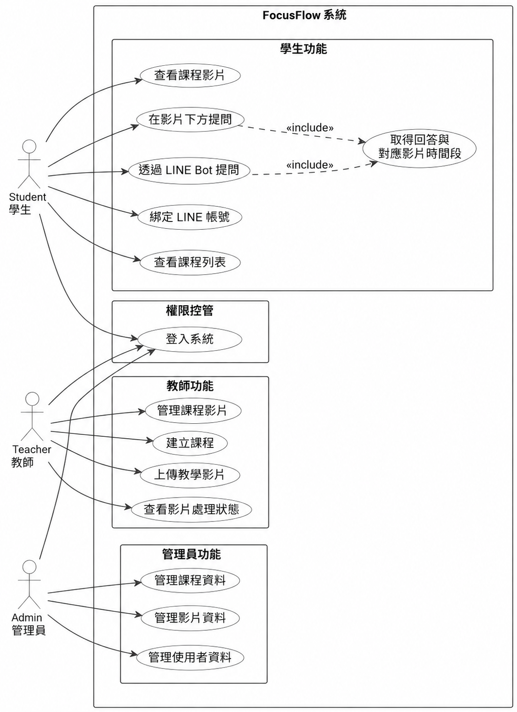
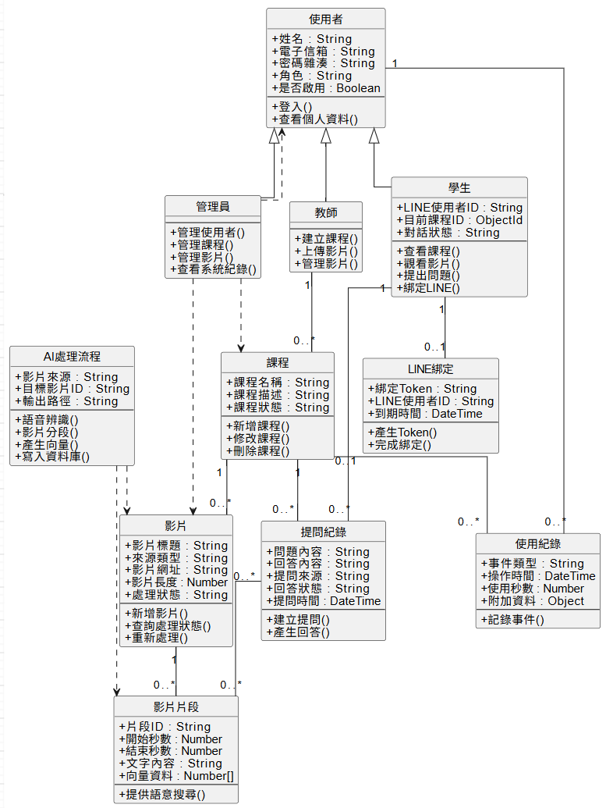

# 第5章 需求模型

> 狀態：初評原稿轉製，待核對現況。
> 原始資料日期：2026-06-02；Markdown 整理日期：2026-09-13。
> 來源：[初評系統手冊 DOCX](../source-documents/專題手冊_初評最終版.docx)，原第5章。

本章重用原稿文字、表格及嵌入圖像；尚未逐圖核對版面、合併儲存格與圖表編號，不代表最新版功能或正式驗收結果。

## 本次整理與待補

TODO：補齊非功能需求及需求編號；以新版登入、修課資格、批次上傳、多輪問答和短片審核流程重核 UML 使用個案／活動／分析類別圖。

補充現況來源（尚待逐項套用）：[學生試用版規格](../../../30_Features/Student_Pilot_Backend/specs/2026-09_Student_Pilot_Backend_Spec.md)。

[返回手冊索引](../README.md)

---

## 5-1 使用者需求

FocusFlow主要目標為協助學生在長篇課程影片中快速查找重點，並透過AI問答與影片時間段回覆，降低課後複習與考前查找的時間成本。系統使用者主要包含學生、教師、管理員，以及作為外部互動入口的LINE Bot。學生可透過網頁影片下方提問區塊或LINE Bot進行提問；教師負責建立課程、上傳教學影片並查看影片處理狀態；管理員則負責系統資料與使用者管理。

表5-11功能性需求表

| Use Case | 需求 |
| --- | --- |
| 登入系統 | 使用者可透過帳號登入FocusFlow系統，系統會依照使用者角色導向對應的操作頁面。學生、教師與管理員登入後，會看到符合其權限的課程、影片或管理功能。 |
| 查看課程列表 | 學生可查看自己可存取的課程，作為進入課程影片與提問功能的入口。教師則可查看自己建立或管理的課程，以便後續新增影片與追蹤處理狀態。 |
| 查看課程影片 | 學生可進入課程影片頁面觀看教學影片，並在觀看過程中針對不理解或想複習的內容進行提問。此功能是學生進行影片學習與AI問答的主要入口。 |
| 建立課程 | 教師可建立課程資料，作為教學影片與學習內容的管理單位。課程建立後，教師可將相關教學影片加入課程中，提供學生後續觀看與查詢。 |
| 上傳教學影片 | 教師可將教學影片加入課程中，讓系統進行後續影片處理。影片上傳後，系統會保存影片資料，並作為後續逐字稿、片段切分與問答索引建立的來源。 |
| 查看影片處理狀態 | 教師可查看影片目前處理階段，例如等待處理、處理中、處理完成或處理失敗。透過處理狀態，教師可確認影片是否已可提供學生進行問答與複習使用。 |
| 管理課程影片 | 教師可管理自己課程中的影片資料，包含確認影片是否成功加入課程，以及是否完成處理。此功能可協助教師維持課程影片資料的完整性。 |
| 影片內容處理 | 系統可將教學影片轉換為逐字稿、影片片段與可查詢索引，使原本較難搜尋的長影片內容能支援後續AI問答。此需求是FocusFlow能提供影片時間段回覆的基礎。 |
| 綁定LINE帳號 | 學生可將FocusFlow帳號與LINE帳號綁定，使系統能辨識LINE使用者對應的學生身份。完成綁定後，學生即可透過LINE Bot作為網頁之外的提問入口。 |
| 在影片下方提問 | 學生可在系統網頁的影片下方提問區塊輸入問題，針對目前觀看的課程影片進行查詢。系統會依據問題搜尋相關影片片段，協助學生快速找到重點內容。 |
| 透過LINE Bot提問 | 學生完成LINE綁定後，可透過LINE Bot輸入課程相關問題。此功能讓學生不一定要進入網頁，也能透過熟悉的LINE介面進行課程複習與提問。 |
| 取得回答與對應影片時間段 | 系統可根據學生問題搜尋相關影片片段，回傳回答與原影片對應時間段。學生可依照回覆回到影片中的重點段落，確認教師完整講解內容。 |
| 記錄提問與使用紀錄 | 系統可記錄學生提問、回答結果與互動紀錄，作為後續學習分析與系統優化的基礎。透過紀錄資料，未來也可協助教師了解學生常見問題與學習需求。 |
| 管理使用者資料 | 管理員可查看與管理系統中的使用者資料，以維持帳號與權限設定正常。此功能可協助平台進行基本使用者維護與角色管理。 |
| 管理課程與影片資料 | 管理員可查看與管理系統中的課程及影片資料，協助維持平台資料完整性。當課程或影片資料異常時，管理員可進行檢查與維護。 |

## 5-2 使用個案圖（Use Case diagram）

本系統使用個案圖主要呈現Student、Teacher、Admin與LINE Bot之間的功能關係：

Student為主要學習者，可查看課程影片、在網頁影片下方提問，也可綁定LINE後透過LINE Bot提問。

Teacher主要負責建立課程、上傳教學影片與查看影片處理狀態。

Admin則負責管理使用者、課程與影片資料。

LINE Bot作為外部提問入口，負責接收學生訊息並回傳系統產生的回答與影片時間段。

表5-21使用個案圖角色說明

| Actor | 說明 |
| --- | --- |
| Student | 學生，主要學習者，可查看課程影片、提問、綁定LINE。 |
| Teacher | 教師，負責建立課程、上傳教學影片、查看影片處理狀態。 |
| Admin | 管理員，負責管理使用者、課程與影片資料。 |
| LINE Bot | 外部互動入口，接收學生問題並回傳回答與影片時間段。 |

圖5-21使用個案圖

圖5-2-1為FocusFlow使用個案圖，主要呈現學生、教師、管理員與LINE Bot之間的功能關係。學生可透過學生端登入窗口，查看課程列表與課程影片，並可在影片下方提問；完成LINE帳號綁定後，也能透過LINE Bot進行課程問答。教師可透過教師端登入窗口，建立課程、上傳教學影片、查看影片處理狀態並管理課程影片。管理員可透過管理員端登入窗口，管理使用者、課程與影片資料。LINE Bot作為外部提問入口，協助學生進行帳號綁定與課程問答，並將系統產生的回答與對應影片時間段回傳給學生。

## 5-3 使用個案描述（Activity diagram）

本節依據前述使用者需求與使用個案圖，針對FocusFlow主要功能流程進行使用個案描述。使用個案描述主要用來說明不同角色在系統中的操作步驟，以及系統對應的回應方式。本系統主要使用情境包含使用者登入、教師建立課程與上傳影片、學生綁定LINE帳號、學生透過網頁或LINE Bot進行提問，以及管理員管理系統資料等功能。

表5-31使用者登入系統與查看對應資料

| 使用個案名稱：各使用者身分登入系統與查看對應資料 |  |
| --- | --- |
| 行為者 | Student、Teacher、Admin |
| 前提 | 使用者已擁有系統帳號 |
| 結束狀態 | 使用者成功登入系統，並進入符合角色權限的操作頁面 |
| 事件路徑： |  |
| Actor動作 | 系統回應 |
| 使用者進入FocusFlow登入頁面 | 系統顯示登入畫面 |
| 使用者輸入帳號與密碼 | 系統驗證帳號密碼是否正確 |
| 使用者點擊登入 | 系統依照使用者角色導向對應頁面 |
| 學生登入後查看可存取課程與影片 | 系統顯示學生可查看的課程列表與影片資料 |
| 教師登入後查看自己建立或管理的課程 | 系統顯示教師課程管理頁面 |
| 管理員登入後查看系統管理資料 | 系統顯示使用者、課程與影片管理頁面 |

表5-32教師建立課程與上傳教學影片

| 使用個案名稱：教師建立課程與上傳教學影片 |  |
| --- | --- |
| 行為者 | Teacher |
| 前提 | 教師已登入系統，並具備課程管理權限 |
| 結束狀態 | 課程與教學影片資料成功建立，影片進入處理流程 |
| 事件路徑： |  |
| Actor動作 | 系統回應 |
| 教師進入課程管理頁面 | 系統顯示教師目前建立或管理的課程資料 |
| 教師點擊建立課程 | 系統顯示課程建立表單 |
| 教師輸入課程名稱、課程說明等資料 | 系統儲存課程資料 |
| 教師於課程中上傳教學影片 | 系統儲存影片資料，並將影片加入指定課程 |
| 教師查看影片處理狀態 | 系統顯示影片目前處理階段，例如等待處理、處理中、處理完成或處理失敗 |
| 影片完成處理後 | 系統產生可供學生提問使用的影片片段與索引資料 |

表5-33查看影片處理狀態

| 使用個案名稱：查看影片處理狀態 |  |
| --- | --- |
| 行為者 | Teacher |
| 前提 | 教師已登入系統，且課程中已有上傳影片 |
| 結束狀態 | 教師了解影片目前處理階段 |
| 事件路徑： |  |
| Actor動作 | 系統回應 |
| 教師進入課程管理頁面 | 系統顯示教師管理的課程清單 |
| 教師選擇指定課程 | 系統顯示該課程中的影片資料 |
| 教師查看影片處理狀態 | 系統顯示影片狀態，例如等待處理、處理中、已完成或處理失敗 |
| 若影片已完成處理 | 系統標示該影片可供學生進行問答 |
| 若影片處理失敗 | 系統顯示失敗狀態，供教師後續確認或重新處理 |

表5-34學生綁定LINE帳號

| 使用個案名稱：學生綁定LINE帳號 |  |
| --- | --- |
| 行為者 | Student、LINE Bot |
| 前提 | 學生已登入FocusFlow系統，且尚未完成LINE帳號綁定 |
| 結束狀態 | 學生的FocusFlow帳號與LINE帳號成功綁定 |
| 事件路徑： |  |
| Actor動作 | 系統回應 |
| 學生進入系統中的LINE綁定頁面 | 系統產生LINE綁定資訊，例如：QR Code |
| 學生開啟LINE Bot並傳送綁定資訊 | LINE Bot接收學生傳送的綁定資訊 |
| 系統驗證綁定資訊是否有效 | 若驗證成功，系統將LINE userId與學生帳號連結 |
| LINE Bot回覆綁定結果 | 系統顯示或回傳綁定成功訊息 |
| 若綁定資訊錯誤或過期 | LINE Bot回覆綁定失敗，並提示學生重新取得綁定資訊 |

表5-35學生於網頁影片下方提問

| 使用個案名稱：學生於網頁影片下方提問 |  |
| --- | --- |
| 行為者 | Student |
| 前提 | 學生已登入系統，並進入可觀看的課程影片頁面 |
| 結束狀態 | 學生取得與問題相關的回答及對應影片時間段 |
| 事件路徑： |  |
| Actor動作 | 系統回應 |
| 學生進入課程影片頁面 | 系統顯示課程影片與影片下方提問區塊 |
| 學生觀看影片並於提問區輸入問題 | 系統接收學生問題 |
| 學生送出問題 | 系統依據目前課程與影片內容搜尋相關影片片段 |
| 系統產生回答與對應影片時間段 | 系統於網頁介面顯示回答內容與影片時間位置 |
| 學生點擊或查看對應時間段 | 系統協助學生回到原影片中的相關講解段落 |

表5-36學生透過LINE Bot提問

| 使用個案名稱：學生透過LINE Bot提問 |  |
| --- | --- |
| 行為者 | Student、LINE Bot |
| 前提 | 學生已完成LINE帳號綁定，且系統可判斷學生可提問的課程範圍 |
| 結束狀態 | 學生透過LINE Bot取得回答與對應影片時間段 |
| 事件路徑： |  |
| Actor動作 | 系統回應 |
| 學生開啟LINE Bot | LINE Bot等待學生輸入問題 |
| 學生輸入想複習的課程問題 | LINE Bot接收問題並傳送至FocusFlow系統 |
| 系統查詢學生LINE綁定資料 | 系統確認該LINE使用者對應的FocusFlow學生帳號 |
| 系統判斷學生可提問的課程範圍 | 系統搜尋相關影片片段 |
| 系統產生回答與對應影片時間段 | LINE Bot回傳回答與影片時間位置給學生 |
| 學生依據回覆內容進行複習 | 學生可回到原影片對應段落確認完整說明 |

表5-37取得回答與對應影片時間段

| 使用個案名稱：取得回答與對應影片時間段 |  |
| --- | --- |
| 行為者 | Student |
| 前提 | 學生已透過系統網頁或LINE Bot提出問題 |
| 結束狀態 | 學生取得回答，並能回到原影片對應段落確認內容 |
| 事件路徑： |  |
| Actor動作 | 系統回應 |
| 學生提出問題 | 系統接收問題並判斷提問來源 |
| 系統查詢相關課程與影片資料 | 系統搜尋與問題相關的影片片段 |
| 系統整理回答內容 | 系統產生回答與對應影片時間段 |
| 學生查看回答內容 | 系統提供原影片對應時間段，協助學生回到影片重點位置 |
| 若查無相關片段 | 系統回覆未找到明確結果，並建議學生調整提問方式 |

表5-38管理員管理使用者資料

| 使用個案名稱：管理員管理使用者資料 |  |
| --- | --- |
| 行為者 | Admin |
| 前提 | 管理員已登入系統，並具備管理權限 |
| 結束狀態 | 管理員完成使用者資料查看或維護 |
| 事件路徑： |  |
| Actor動作 | 系統回應 |
| 管理員進入系統管理頁面 | 系統顯示管理功能選單 |
| 管理員選擇使用者管理功能 | 系統顯示使用者資料列表 |
| 管理員查看指定使用者資料 | 系統顯示該使用者帳號、角色與相關資料 |
| 管理員依需求進行資料維護 | 系統更新並保存使用者資料 |

表5-39管理員管理課程與影片資料

| 使用個案名稱：管理員管理課程與影片資料 |  |
| --- | --- |
| 行為者 | Admin |
| 前提 | 管理員已登入系統，並具備管理權限 |
| 結束狀態 | 管理員完成課程與影片資料查看或維護 |
| 事件路徑： |  |
| Actor動作 | 系統回應 |
| 管理員進入系統管理頁面 | 系統顯示管理功能選單 |
| 管理員選擇課程管理或影片管理功能 | 系統顯示課程或影片資料列表 |
| 管理員查看指定課程或影片資料 | 系統顯示課程名稱、影片資料與處理狀態 |
| 管理員依需求進行資料維護 | 系統更新並保存課程或影片資料 |

## 5-4 分析類別圖（Analysis class diagram）

圖5-41為FocusFlow系統分析類別圖，呈現系統需求階段的主要概念類別與其關聯。圖中以使用者為核心，並依角色區分為學生、教師與管理員。學生可查看課程、觀看影片、提出問題並綁定LINE；教師可建立課程、上傳影片與管理影片；管理員則負責管理使用者、課程、影片與查看系統紀錄。

在課程與影片關係中，一位教師可建立多門課程，每門課程可包含多部影片。影片可由本機上傳或YouTube URL建立，並透過AI處理流程進行語音辨識、影片分段、向量產生與資料庫寫入。處理完成後，每部影片可產生多個影片片段，影片片段包含起訖秒數、文字內容與向量資料，作為後續問答檢索的依據。

在問答流程中，學生可針對課程提出提問紀錄，系統會依據問題內容搜尋相關影片片段，並產生回答內容。因此，提問紀錄會連結到課程與影片片段，用以表示回答來源與時間戳依據。LINE綁定則用於連結學生帳號與LINE使用者身份，使學生可透過LINE Bot選擇課程並提出問題。

此外，使用紀錄用於記錄使用者在系統中的互動行為，例如登入、觀看影片、提出問題與查看片段等，作為後續統計與管理功能的基礎。本圖屬於需求分析階段的概念模型，重點在於描述系統中的主要類別、屬性、操作與資料流向，並非傳統關聯式資料庫ERD；後續MongoDB collection設計將以此圖作為基礎進一步細化。

圖5-41系統分析類別圖
