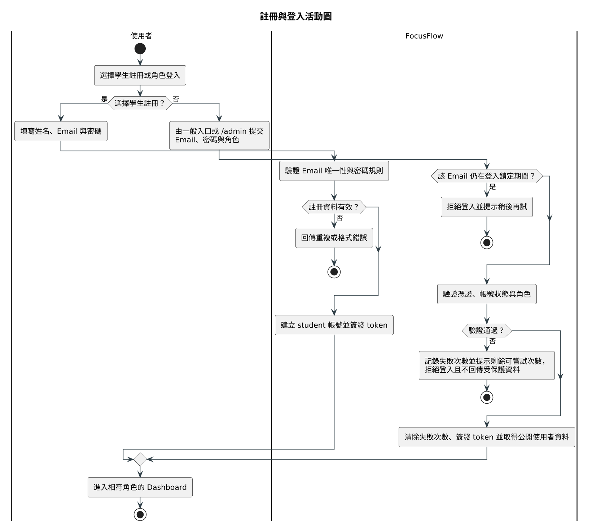
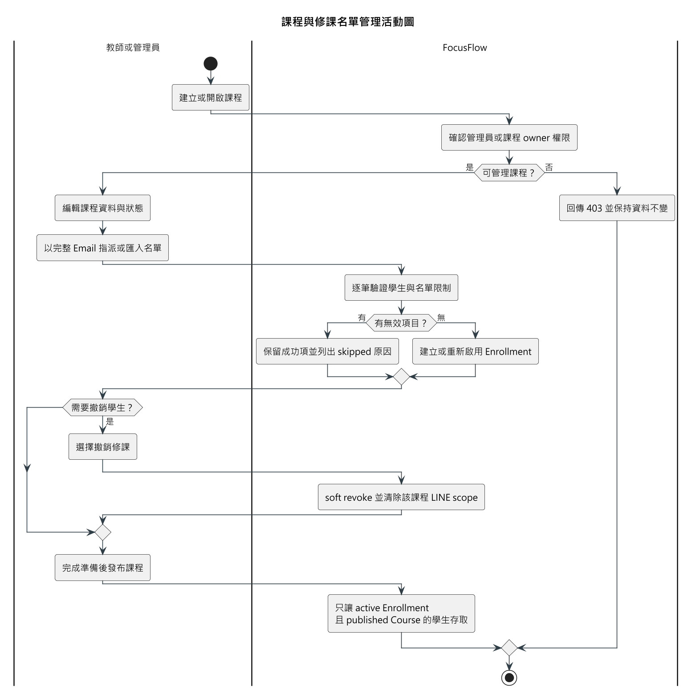
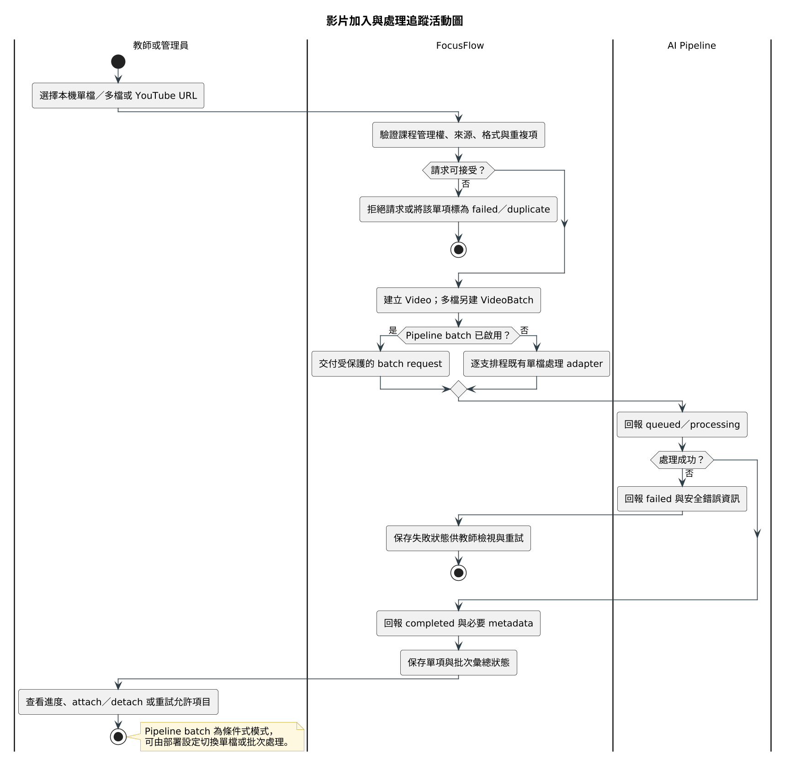
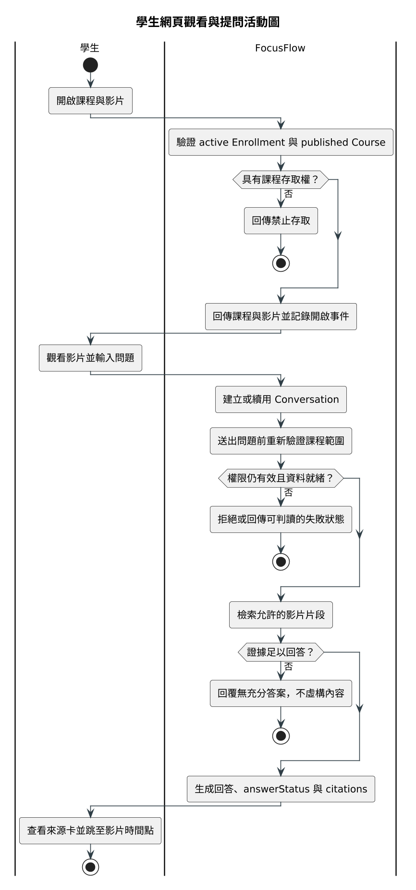
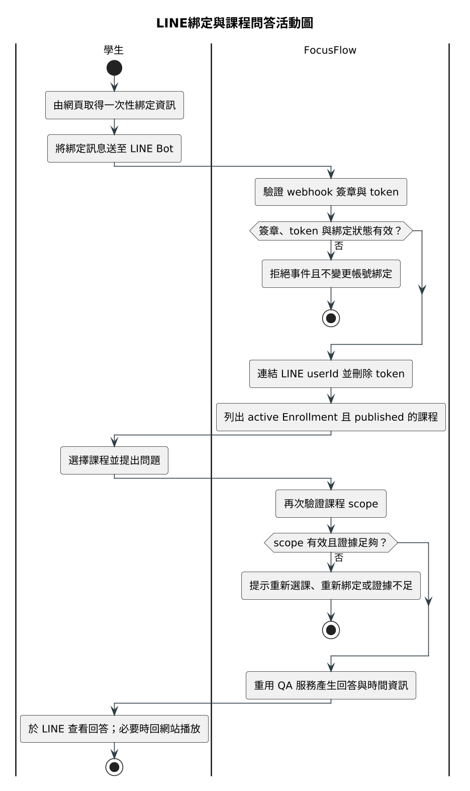
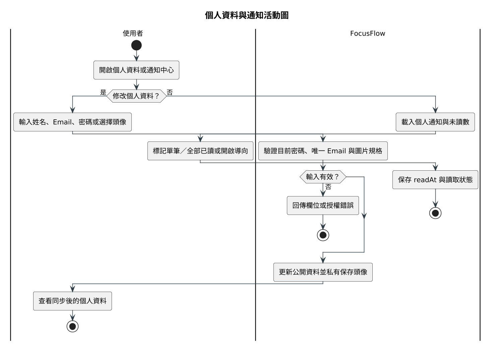
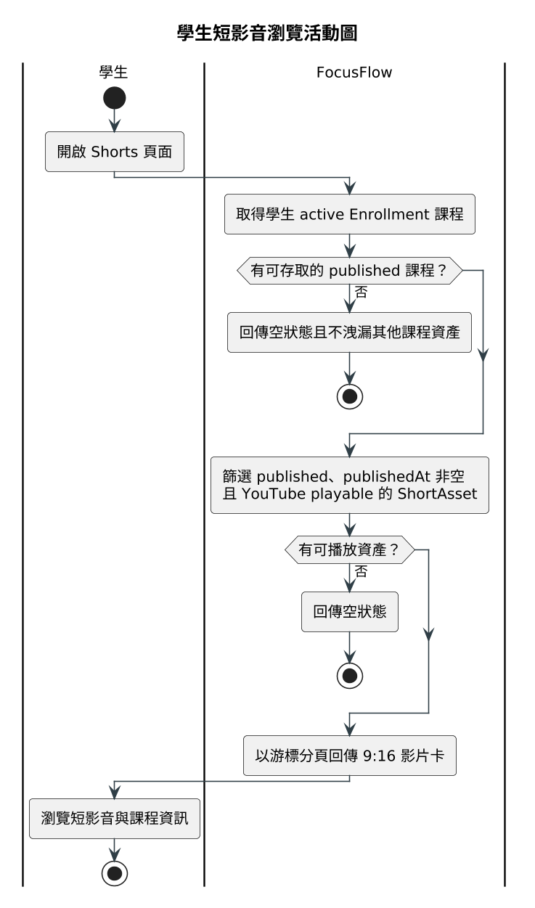
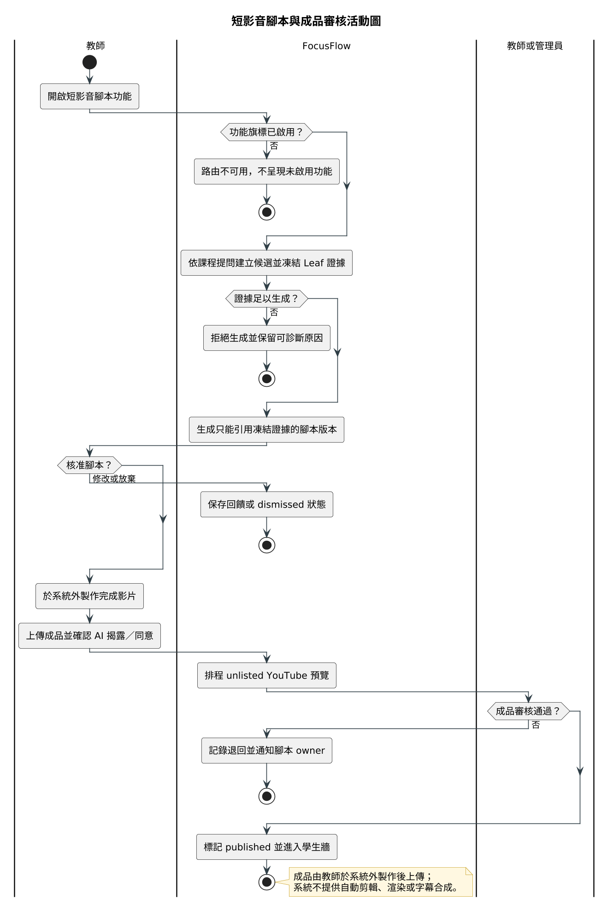
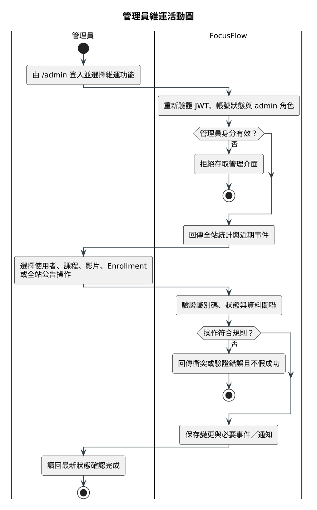
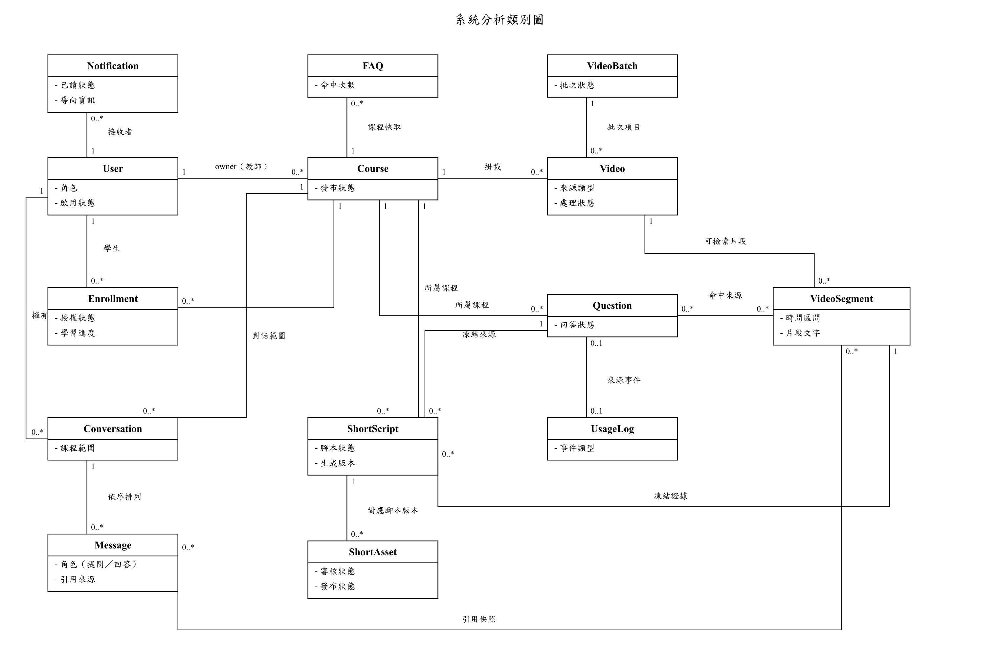

# 第5章 需求模型

## 5-1 使用者需求

FocusFlow 的主要使用者為學生、教師與管理員，LINE 平台則是學生問答的外部系統。所有角色的可見功能必須由後端權限再次驗證，不以選單是否顯示作為授權依據。

### 功能性需求

表5-1-1　功能性需求與使用個案追溯表

| 編號 | 功能性需求 | 對應使用個案 |
| --- | --- | --- |
| FR-01 | 系統應允許學生以姓名、Email 與密碼自助註冊；教師與管理員帳號由管理流程建立，不得透過公開註冊建立。 | UC-01 |
| FR-02 | 系統應以 Email、密碼及所選角色驗證登入；帳號角色不符、停用或憑證錯誤時應拒絕。登入失敗但未達鎖定門檻時，應提示使用者剩餘可嘗試次數；同一 Email 連續登入失敗達門檻時，應暫時鎖定該帳號的登入嘗試。 | UC-01 |
| FR-03 | 已登入使用者應能查看與修改個人姓名、Email、密碼及私有頭像；忘記密碼流程應以驗證碼重設。 | UC-06 |
| FR-04 | 一般入口與 `/admin` 應分流；非管理員不得進入管理介面，管理員不提供自助註冊。 | UC-01、UC-09 |
| FR-05 | 教師應能建立、查看、修改及刪除自己的課程，並管理 draft／published／archived 狀態；管理員可跨課程管理。 | UC-02、UC-09 |
| FR-06 | 課程教師或管理員應能以學生 Email 指派、以名單匯入及 soft revoke Enrollment，並保留撤銷稽核資訊。 | UC-02 |
| FR-07 | 學生只應存取「有效 Enrollment 且 Course 為 published」的課程、影片、QA／FAQ、課程通知、Shorts 與 LINE 課程範圍。系統不得提供學生自助選課、邀請碼或申請審核流程。 | UC-04、UC-05、UC-07 |
| FR-08 | 教師或管理員應能將本機影片或 YouTube 連結加入可管理的課程，並阻擋同課程的明確重複來源。 | UC-03 |
| FR-09 | 教師或管理員應能以單一 multipart 請求建立多影片批次，查看批次／單項狀態，並對允許的失敗項目重試。 | UC-03 |
| FR-10 | 系統應記錄影片 queued、processing、completed、failed 狀態與嘗試資訊；非法狀態轉換及重複回報不得破壞既有結果。 | UC-03 |
| FR-11 | 教師或管理員應能將既有影片掛載至其他可管理課程或解除掛載；刪除與解除掛載須保持不同語意。 | UC-03 |
| FR-12 | 學生應能播放授權影片，系統應記錄開啟事件；達成觀看門檻時以不重複方式更新修課進度。 | UC-04 |
| FR-13 | 學生應能在授權課程中建立／續用網頁對話、提出問題、查看歷史訊息，並對可重試的失敗訊息重試。 | UC-04 |
| FR-14 | 問答回覆應提供回答狀態及實際命中的來源資訊，包括影片、片段文字與可用時間點；使用者可由引用跳回影片。 | UC-04、UC-05 |
| FR-15 | 當權限不足、影片尚未可用或檢索證據不足時，系統應拒絕請求或回覆無充分答案，不得虛構課程內容。 | UC-04、UC-05 |
| FR-16 | 系統得對無對話歷史且符合條件的問答使用 FAQ 快取；影片重處理或內容移除時應依規則失效快取。 | UC-04 |
| FR-17 | 已登入使用者應能取得一次性 LINE 綁定資訊；綁定後學生可在有效修課課程間選擇並提問，LINE 問答應重用後端課程授權與 QA 服務。 | UC-05 |
| FR-18 | 使用者應能查看站內通知並標記單筆或全部已讀；系統可發送影片完成、短影音退回等通知，管理員可發送全站公告。 | UC-06、UC-09 |
| FR-19 | 系統應提供學生、教師與管理員相符的儀表板及統計；管理員可維護使用者、影片並查看事件資料。 | UC-09 |
| FR-20 | 學生短影音牆只應顯示其有效修課且已發布課程中，狀態為 published 且 YouTube 可播放的 ShortAsset。 | UC-07 |
| FR-21 | 啟用短影音腳本功能時，教師或管理員應能由課程提問候選建立凍結證據、生成腳本版本、核准、要求修改或放棄主題。生成內容只能引用凍結證據。 | UC-08 |
| FR-22 | 啟用短影音腳本功能且教師已備妥成品時，系統應允許人工上傳成品、留存 AI 揭露／同意確認、上傳 YouTube 供預覽，並以成品審核決定是否進入學生牆。成品由教師於系統外製作，系統不提供自動剪輯或渲染功能。 | UC-08 |

### 非功能性需求

表5-1-2　非功能性需求表

| 編號 | 非功能性需求 |
| --- | --- |
| NFR-01 | **授權安全：** 所有受保護 API 與非公開媒體交付應驗證身分，並依角色、課程所有權、Enrollment 與資源狀態判斷權限。 |
| NFR-02 | **憑證安全：** 密碼只保存雜湊；Webhook 應驗簽；secret 不得寫入程式、文件或回應。 |
| NFR-03 | **隱私：** 私有頭像必須登入後讀取；Email、LINE 識別、提問與使用紀錄不得無授權公開。 |
| NFR-04 | **資料完整性：** 影片處理、批次、重試、Webhook 回放、Enrollment 指派及審核版本應具冪等或衝突保護。 |
| NFR-05 | **可追溯性：** 問答引用只能來自實際檢索片段；影片、批次、短影音腳本與審核應保存狀態及必要稽核欄位。 |
| NFR-06 | **失敗透明度：** 外部服務或資料未就緒時應回傳可判讀的錯誤、拒答或降級狀態，不得以成功訊息掩蓋失敗。 |
| NFR-07 | **可用性：** 核心頁面應呈現載入、空資料、錯誤與重試狀態；重新整理後應能恢復有效登入或批次追蹤。 |
| NFR-08 | **效能與容量：** 問答、影片處理與批次需在目標使用規模內可接受。 |
| NFR-09 | **相容性與可及性：** 網頁應支援受安全更新的主流瀏覽器及鍵盤操作；引用卡片等互動元件需可聚焦與啟動。 |
| NFR-10 | **可維護性：** 後端維持 routes／controllers／services／models 分層；API、前端消費端、資料契約與文件需同步。 |
| NFR-11 | **資料治理：** 教材、逐字稿、提問、使用事件、暫存檔與備份應有授權、保存及刪除規則。 |
| NFR-12 | **部署驗收：** 本機或 mock 測試不得替代共享 Atlas、真實 AI、LINE、YouTube、SMTP、HTTPS 與正式瀏覽器驗收。 |

## 5-2 使用個案圖（Use Case diagram）

表5-2-1　行為者與系統邊界

| 行為者 | 主要責任與權限 |
| --- | --- |
| Student（學生） | 使用自己的帳號及有效修課資格查看課程、影片、進度、QA、通知與 Shorts；可綁定 LINE。不能建立 Enrollment 或自行加入課程。 |
| Teacher（教師） | 建立與管理自己的課程、Enrollment、影片及批次；在功能開啟時管理短影音腳本與成品。不能管理其他教師課程。 |
| Admin（管理員） | 由獨立入口登入，跨課程管理使用者、課程、影片、Enrollment、通知、事件與統計。 |
| AI／媒體／資料服務（外部系統） | 提供 Gemini、YouTube、SMTP、MongoDB Atlas 等能力；FocusFlow 為達成自身使用個案而呼叫這些服務，憑證、配額與回應失敗均位於系統外部邊界。 |

LINE Platform 是學生透過 LINE Bot 提問時的訊息傳遞管道，角色類似網頁使用個案中的瀏覽器；提問的
行為者仍是 Student，技術契約見第6-1節循序圖。

使用個案圖依行為者拆為三張：學生（圖5-2-1）、教師（圖5-2-2）、管理員（圖5-2-3），合計涵蓋
UC-01 至 UC-09（FR／NFR 對應見表5-1-1及表5-3-1至表5-3-9）。UC-01、UC-06 由三種角色共用（UC-01
公開自助註冊僅開放 Student）；UC-02、UC-03 由 Teacher 與 Admin 共用，教師僅管自己課程；UC-04、
UC-05、UC-07 僅 Student；UC-08 僅 Teacher；UC-09 僅 Admin。AI／媒體／資料服務為次要行為者，
關聯 UC-03（STT／embedding）、UC-04（AI 答案）、UC-05（問答服務重用）、UC-06（驗證信）、
UC-08（腳本生成與 YouTube 上傳）。

圖5-2-1 學生使用個案圖

圖5-2-2 教師使用個案圖

圖5-2-3 管理員使用個案圖

## 5-3 使用個案描述（Activity diagram）

本節先以表格定義可驗證的使用個案，再以活動圖呈現角色操作、系統判斷、例外分支與完成條件。

表5-3-1　UC-01 註冊與登入

| 欄位 | 說明 |
| --- | --- |
| 行為者 | Student、Teacher、Admin |
| 前提 | 使用者未登入；若為學生註冊，須具有未使用的 Email；教師與管理員帳號已由管理流程建立。 |

事件路徑：

| 步驟 | Actor 動作 | 系統回應 |
| --- | --- | --- |
| 1 | 學生填寫姓名、Email 與密碼註冊 | 驗證 Email 唯一性與密碼規則，建立學生帳號並簽發 token |
| 2 | 使用者以 Email、密碼及角色登入（管理員直接由 `/admin` 登入） | 先檢查該 Email 是否仍在登入鎖定期間，未鎖定才比對密碼 |
| 3 | — | 驗證帳號狀態與角色；驗證通過則簽發 token 並導向相符頁面，未通過則記錄失敗次數並提示剩餘可嘗試次數 |

| 欄位 | 說明 |
| --- | --- |
| 例外／拒絕 | Email 重複、密碼不足、帳號停用、密碼錯誤或角色不符時拒絕；登入失敗但未達鎖定門檻時提示剩餘可嘗試次數，同一 Email 連續登入失敗達門檻時暫時鎖定，鎖定期間一律拒絕且不比對密碼；教師與管理員角色不得由公開註冊建立；非管理員進入管理員入口時顯示禁止訊息。 |
| 結果 | 成功者取得已驗證 session；失敗者不取得受保護資料。 |
| 追溯需求 | FR-01、FR-02、FR-04、NFR-01、NFR-02 |

圖5-3-1 註冊與登入活動圖

表5-3-2　UC-02 教師管理課程與修課名單

| 欄位 | 說明 |
| --- | --- |
| 行為者 | Teacher、Admin |
| 前提 | 行為者已登入；教師為課程 owner，或行為者為管理員 |

事件路徑：

| 步驟 | Actor 動作 | 系統回應 |
| --- | --- | --- |
| 1 | 建立或開啟課程 | 確認管理員或課程 owner 權限 |
| 2 | 編輯課程名稱、說明及狀態 | 保存課程異動 |
| 3 | 以學生完整 Email 指派，或匯入名單 | 逐筆驗證學生與名單限制，建立或重新啟用 Enrollment；無效項目列為 skipped 並保留原因 |
| 4 | 查看 active／revoked 紀錄 | 回傳目前修課名單狀態 |
| 5 | 必要時撤銷學生 | soft revoke 並保留歷史，清除該課程的 LINE active scope |
| 6 | 課程完成準備後設為 published | 只讓 active Enrollment 且 published Course 的學生存取 |

| 欄位 | 說明 |
| --- | --- |
| 例外／拒絕 | 非 owner 教師、無效學生、停用帳號、錯誤名單或超出匯入限制時拒絕或逐筆列為 skipped；學生端不存在自行加入、邀請碼或審核入口。 |
| 結果 | 課程與 Enrollment 狀態可追溯；只有 active Enrollment 與 published Course 的交集對學生生效。 |
| 追溯需求 | FR-05、FR-06、FR-07、NFR-01、NFR-04 |

圖5-3-2 課程與修課名單管理活動圖

表5-3-3　UC-03 教師加入影片並追蹤處理

| 欄位 | 說明 |
| --- | --- |
| 行為者 | Teacher、Admin |
| 前提 | 行為者已登入且可管理目標課程；本機檔案符合上傳限制，或 YouTube URL 有效 |

事件路徑：

| 步驟 | Actor 動作 | 系統回應 |
| --- | --- | --- |
| 1 | 選擇單支／多支本機影片或輸入 YouTube URL | 驗證來源並建立 Video；多檔另建一個 VideoBatch 及單項識別 |
| 2 | — | 啟動單支 adapter 或已啟用的 Pipeline batch |
| 3 | — | AI Pipeline 回報 queued／processing／completed／failed |
| 4 | 於介面追蹤處理進度 | 保存單項與批次彙總狀態供輪詢 |
| 5 | 對允許的失敗項目重試，或管理影片的 attach／detach 關係 | 依請求更新影片與批次狀態 |

| 欄位 | 說明 |
| --- | --- |
| 例外／拒絕 | 非課程 owner、格式／大小不符、同課程重複影片、batch 回應缺項、非法狀態轉換、來源檔遺失或不可安全重試時拒絕；部分失敗須保留其他單項結果。 |
| 結果 | 影片及批次狀態被保存，教師可由批次與單項狀態追蹤處理結果。 |
| 追溯需求 | FR-08～FR-11、NFR-04～NFR-06 |

圖5-3-3 影片加入與處理追蹤活動圖

表5-3-4　UC-04 學生在網頁觀看與提問

| 欄位 | 說明 |
| --- | --- |
| 行為者 | Student |
| 前提 | 學生已登入，具有目標課程 active Enrollment，且課程為 published |

事件路徑：

| 步驟 | Actor 動作 | 系統回應 |
| --- | --- | --- |
| 1 | — | 列出學生可存取課程 |
| 2 | 開啟課程與影片 | 記錄開啟事件 |
| 3 | 觀看影片達觀看門檻 | 以不重複方式更新 watched 與進度 |
| 4 | 建立或續用課程對話並輸入問題 | 重新檢查課程權限，檢索允許的影片內容並生成回答 |
| 5 | — | 呈現回答狀態與來源卡片 |
| 6 | 點擊引用卡片 | 跳到對應影片與時間點 |

| 欄位 | 說明 |
| --- | --- |
| 例外／拒絕 | Enrollment 無效、課程未發布、影片不屬於授權範圍、問題空白、資料未就緒、配額不足或證據不足時拒絕或回覆無充分答案；可重試訊息才提供重試。本機影片之 `/uploads` 靜態媒體 URL 屬直接連結存取，不經過此授權流程。 |
| 結果 | 學生取得可核對來源的回答，或取得明確拒答／失敗狀態；對話、問題與必要使用事件被記錄。 |
| 追溯需求 | FR-07、FR-12～FR-16、NFR-01、NFR-05～NFR-09 |

圖5-3-4 學生網頁觀看與提問活動圖

表5-3-5　UC-05 學生綁定 LINE 並提問

| 欄位 | 說明 |
| --- | --- |
| 行為者 | Student（LINE Platform 為訊息傳遞管道，非行為者，見表5-2-1後說明） |
| 前提 | 學生具有 FocusFlow 帳號；LINE Webhook 與 Bot 設定可用 |

事件路徑：

| 步驟 | Actor 動作 | 系統回應 |
| --- | --- | --- |
| 1 | 於網頁要求一次性綁定 token 或課程 QR Code | 產生一次性綁定資訊 |
| 2 | 將綁定訊息送至 LINE Bot | Webhook 驗證 LINE 簽章與 token，連結 LINE userId |
| 3 | — | 只列出學生有效修課且已發布的課程 |
| 4 | 選擇課程並提問 | 再次驗證 Enrollment，重用 QA 服務回覆回答與時間資訊 |

| 欄位 | 說明 |
| --- | --- |
| 例外／拒絕 | 簽章錯誤、token 無效／過期、LINE 已綁定其他帳號、無有效課程、課程已撤銷或證據不足時拒絕或提示重新操作；沒有可播放連結時提示回網站查看時間點。 |
| 結果 | 綁定與課程 scope 有效時完成問答；撤銷 Enrollment 後原課程 scope 與對話上下文不再可用。 |
| 追溯需求 | FR-07、FR-14、FR-15、FR-17、NFR-01、NFR-02、NFR-06 |

圖5-3-5 LINE綁定與課程問答活動圖

表5-3-6　UC-06 使用者維護個人資料與通知

| 欄位 | 說明 |
| --- | --- |
| 行為者 | Student、Teacher、Admin |
| 前提 | 使用者已登入 |

事件路徑：

| 步驟 | Actor 動作 | 系統回應 |
| --- | --- | --- |
| 1 | 開啟個人資料 | 顯示目前資料 |
| 2 | 修改姓名；變更 Email 或密碼時輸入目前密碼 | 驗證目前密碼與 Email 唯一性後更新 |
| 3 | 選擇合規頭像並上傳 | 前端處理後由後端以私有資料保存 |
| 4 | 開啟 Topbar 通知 | 載入個人通知與未讀數 |
| 5 | 標記單筆或全部已讀，或開啟具導向資訊的通知 | 保存讀取狀態並視需要導向對應頁面 |

| 欄位 | 說明 |
| --- | --- |
| 例外／拒絕 | Email 重複、目前密碼錯誤、頭像格式／大小不符、匿名或跨帳號頭像讀取時拒絕；網路錯誤不應誤清除仍可能有效的登入資訊。 |
| 結果 | 個人資料與頭像更新後同步至頁面；通知讀取狀態被保存。 |
| 追溯需求 | FR-03、FR-18、NFR-02、NFR-03、NFR-07 |

圖5-3-6 個人資料與通知活動圖

表5-3-7　UC-07 學生查看短影音

| 欄位 | 說明 |
| --- | --- |
| 行為者 | Student |
| 前提 | 學生已登入且至少一門 active Enrollment 課程已發布可播放 ShortAsset |

事件路徑：

| 步驟 | Actor 動作 | 系統回應 |
| --- | --- | --- |
| 1 | 開啟 Shorts 頁面 | 取得學生 active Enrollment 課程 |
| 2 | — | 查詢 published、publishedAt 非空且 YouTube availability 為 playable 的 ShortAsset |
| 3 | — | 以游標分頁回傳 |
| 4 | 瀏覽影片卡與課程資訊 | 呈現 9:16 影片卡及課程資訊 |

| 欄位 | 說明 |
| --- | --- |
| 例外／拒絕 | 無 Enrollment 時顯示空狀態；非學生、課程未發布、資產未審核／未發布、YouTube 不可播放或已封存時不回傳。 |
| 結果 | 學生只看到目前授權範圍內可播放的已發布短影音。 |
| 追溯需求 | FR-07、FR-20、NFR-01、NFR-06 |

圖5-3-7 學生短影音瀏覽活動圖

表5-3-8　UC-08 教師產生腳本並提交短影音成品

| 欄位 | 說明 |
| --- | --- |
| 行為者 | Teacher（腳本生成、成品上傳與製作流程由教師介面完成；成品審核步驟另開放 Admin 經後端 API 執行） |
| 前提 | 行為者可管理目標課程；短影音腳本功能已啟用；課程具有可用提問與 Leaf 證據；生成與 YouTube 上傳另需有效設定 |

事件路徑：

| 步驟 | Actor 動作 | 系統回應 |
| --- | --- | --- |
| 1 | 查看由課程問題彙整的候選 | — |
| 2 | 選擇主題 | 凍結實際 Leaf 與鄰接證據 |
| 3 | — | 生成只引用凍結 chunk 的腳本版本 |
| 4 | 核准腳本、要求檢索／敘事修改或放棄主題 | 依決定保存回饋或 dismissed 狀態 |
| 5 | 於系統外製作完成影片，上傳成品並確認 AI 揭露／同意 | 排程以 unlisted 上傳 YouTube 供預覽 |
| 6 | 教師或管理員審核成品 | 核准且上傳完成才標記 published 並上牆；退回則通知腳本 owner 並盡力將 YouTube 影片轉為 private |

| 欄位 | 說明 |
| --- | --- |
| 例外／拒絕 | 功能關閉時路由回 404；無證據、生成引用越界、腳本狀態不符、揭露／同意未確認、檔案遺失、YouTube 未設定、版本已變更或同版本重複審核時拒絕。可能已送出 bytes 的失敗不得自動重試。 |
| 結果 | 腳本、版本、證據與審核歷史可追溯；只有目前 generation 通過審核且上傳成功的資產進入學生牆。系統不產生剪輯完成檔。 |
| 追溯需求 | FR-21、FR-22、NFR-04～NFR-06、NFR-11、NFR-12 |

圖5-3-8 短影音腳本與成品審核活動圖

表5-3-9　UC-09 管理員維運系統

| 欄位 | 說明 |
| --- | --- |
| 行為者 | Admin（短影音相關後端 API 亦對 admin 開放，惟管理後台介面以使用者、課程、影片與統計為主要導覽範圍，短影音成品審核仍由教師介面或直接呼叫 API 完成，不列入本使用個案主流程） |
| 前提 | 管理員已由 `/admin` 驗證登入 |

事件路徑：

| 步驟 | Actor 動作 | 系統回應 |
| --- | --- | --- |
| 1 | 開啟管理後台 | 回傳全站統計與近期事件 |
| 2 | 查看／更新使用者啟用狀態與角色 | 驗證資料關聯規則並保存變更 |
| 3 | 查看／管理課程與影片 | 驗證資料關聯規則並保存變更 |
| 4 | 必要時管理 Enrollment 或刪除異常影片 | 保存變更並清理關聯資料 |
| 5 | 發送系統公告 | 建立通知並發送 |

| 欄位 | 說明 |
| --- | --- |
| 例外／拒絕 | 非管理員、無效識別碼、狀態衝突或資料關聯不允許時拒絕；外部服務失敗須呈現明確狀態，不得假裝操作完成。 |
| 結果 | 管理操作與必要事件被保存；受影響使用者依最新帳號、課程與資產狀態取得內容。 |
| 追溯需求 | FR-04～FR-06、FR-18、FR-19、NFR-01、NFR-04～NFR-06 |

圖5-3-9 管理員維運活動圖

## 5-4 分析類別圖（Analysis class diagram）

分析類別模型先表達需求概念，再由第 8 章對應至實際 MongoDB collections，分為邊界類別、控制類別
及實體類別；邊界／控制類別採責任導向命名（如「課程授權」），落實為程式類別的對應見表6-2-1。

表5-4-1　主要分析類別

| 類別類型 | 代表類別（分析層概念名稱） | 責任 |
| --- | --- | --- |
| 邊界類別 | 網頁介面、管理員入口、LINE 訊息介面、影片處理回報介面、外部服務介面 | 接收角色操作或外部事件，呈現結果，不自行決定課程授權 |
| 控制類別 | 身分驗證、課程授權、修課管理、影片管理、影片批次管理、提問處理、對話管理、LINE 對話處理、通知發送、短影音腳本產生、短影音成品審核 | 執行驗證、權限、狀態機、檢索、回答、通知及審核流程 |
| 核心實體 | User、Course、Enrollment、Video、VideoBatch | 表達帳號角色、課程所有權、修課授權、影片來源與處理批次 |
| 問答實體 | VideoSegment、Question、FAQ、Conversation、Message | 表達可檢索片段、提問／回答、快取及多輪對話來源 |
| 營運實體 | Notification、UsageLog | 表達通知已讀、來源、事件與統計基礎 |
| 短影音實體 | ShortScript、ShortAsset | 表達候選證據、腳本版本／回饋，以及成品 generation、審核、YouTube 與發布狀態 |

系統分析類別圖如圖5-4-1所示，呈現實體類別間的領域關聯與多重性；邊界／控制類別歸屬見表5-4-1，
不重複畫入圖中。補充關係（圖上不易一眼看出者）：Admin 跨課程管理不取代 `teacherId` 代表的課程
owner；VideoBatch 聚合多支影片的部分成功／失敗狀態；LINE 短期對話狀態存於 User，未獨立成實體。

判讀重點：

- User 僅一個類別，角色為屬性；學生內容授權來自「active Enrollment × published Course」交集，
  非 User 直接連到 Course。
- Question／Message 對 VideoSegment 的關聯代表回答只能引用實際檢索片段（對應 NFR-05 可追溯性）。
- ShortScript（腳本／凍結證據）與 ShortAsset（人工上傳成品）為不同實體，以版本關聯連結。

圖5-4-1 系統分析類別圖
