# 第6章 設計模型

FocusFlow 後端維持 routes → controllers → services → models 分層。第6章屬物件設計（Object Design）：6-1 以循序圖（Sequence Diagram）呈現跨物件互動，6-2 以設計類別圖（Design Class Diagram）說明分析責任如何落實到程式設計，並補一張設計物件圖（Design Object Diagram）呈現特定執行時點的實例快照。本章不把資料庫 collection 綱要當成類別圖；完整欄位、index 與文件參照限制留在第8章。

## 6-1 循序圖（Sequence Diagram）

本節依官方「循序圖或通訊圖擇一」採循序圖，並與第5章 9 個使用個案一一對應，一張圖只回答一個主要觸發情境。圖中參與者統一畫在使用者、前端頁面、後端 API、資料庫這個業務互動層級，必要時加上 AI Pipeline 或 LINE Bot；不展開成個別 service 類別，service 與 domain 物件的對應留給 6-2 設計類別圖說明。

### 6-1-1 註冊與登入

本圖對應第5章 UC-01（表5-3-1），回答「使用者提交註冊或登入資料後，系統如何驗證並簽發存取憑證」；流程如圖6-1-1所示。

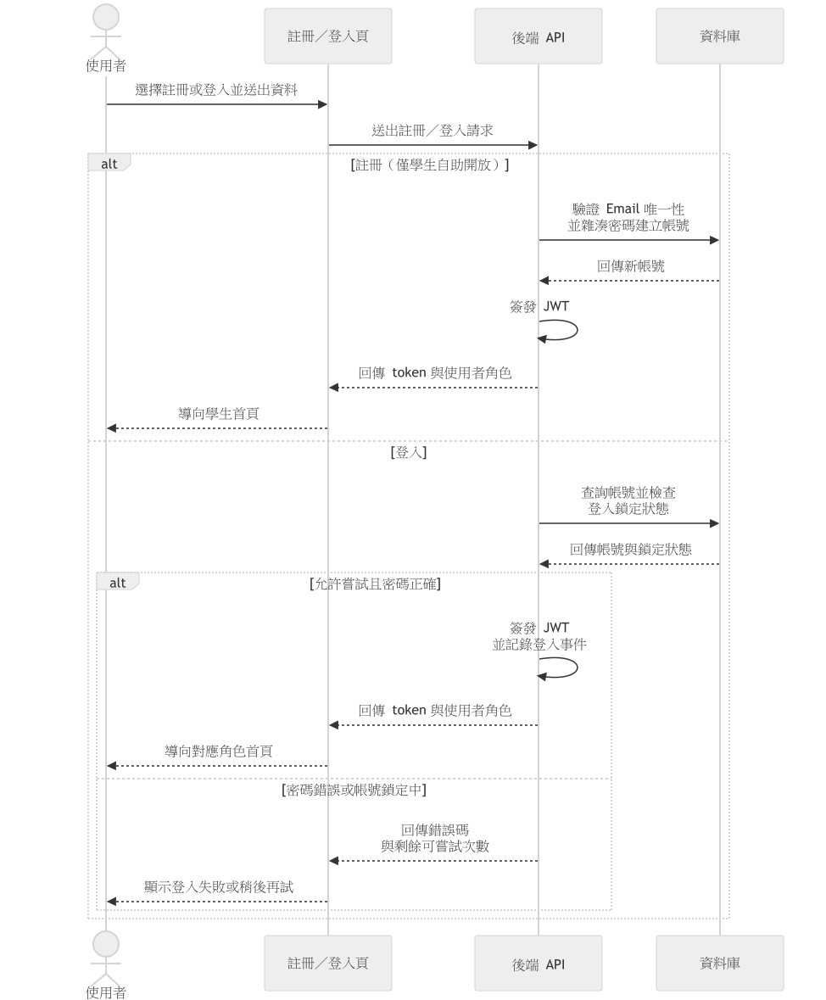

圖6-1-1 註冊與登入循序圖

判讀重點是自助註冊只開放學生，教師與管理員帳號須由管理流程建立，因此註冊分支不做角色選擇。登入分支的協作順序刻意把「查詢帳號並檢查登入鎖定狀態」放在「比對密碼」之前：鎖定期間即使密碼正確也不比對，直接拒絕，這樣才能真正擋住暴力嘗試，而不是先驗證密碼再事後鎖定。失敗與鎖定回應不區分帳號是否存在，避免經由錯誤訊息反推 Email 是否已註冊；只有驗證通過的路徑才會簽發 JWT 並記錄登入事件，兩者是同一次成功交易的結果，不會出現「已登入但未留下事件」的情況。

### 6-1-2 課程與修課名單管理

本圖對應第5章 UC-02（表5-3-2），回答「教師或管理員如何建立課程、維護修課名單並發布課程」；流程如圖6-1-2所示。

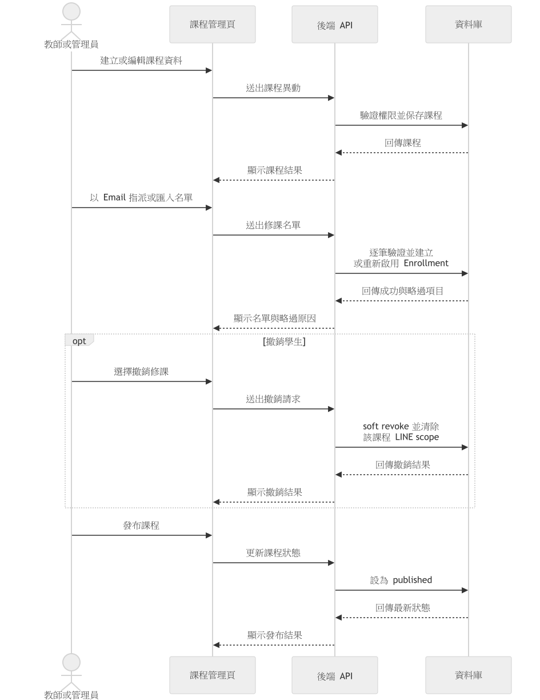

圖6-1-2 課程與修課名單管理循序圖

判讀重點是名單指派與匯入逐筆驗證，無效項目只略過並保留原因，不影響其他成功項目，這代表 Enrollment 建立是以「單筆結果獨立」而非「整批成敗綁在一起」的方式設計。撤銷修課採 soft revoke 而非刪除紀錄，並同步清除該課程的 LINE 問答範圍，讓學生撤銷後即使先前已在 LINE 綁定該課程，也不會繼續拿到該課程的答案。課程狀態機以「教師或管理員明確發布」為界：draft 狀態下即使 Enrollment 已建立，學生仍無法存取，這把「名單是否就緒」與「課程是否對外開放」拆成兩個各自可控的判斷點。

### 6-1-3 影片加入與處理追蹤

本圖對應第5章 UC-03（表5-3-3），回答「教師或管理員送出影片後，AI Pipeline 如何處理並回報狀態」；流程如圖6-1-3所示。

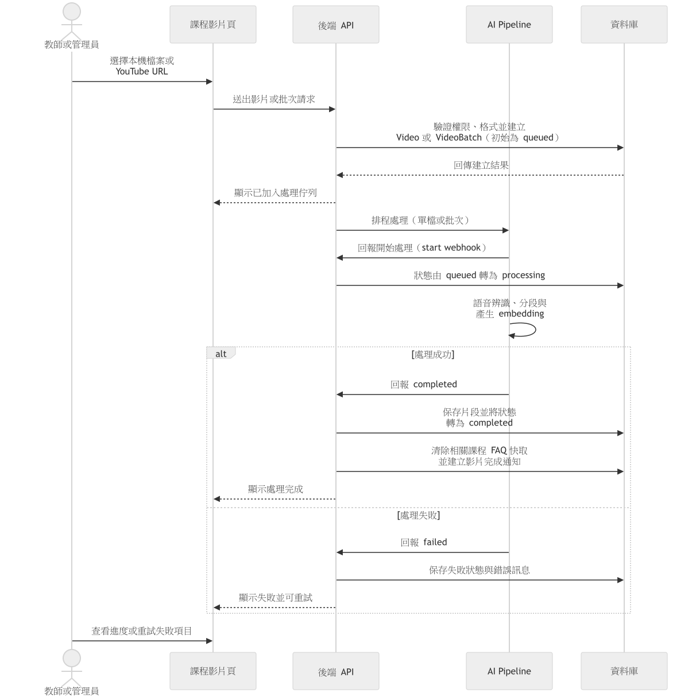

圖6-1-3 影片加入與處理追蹤循序圖

判讀重點是單檔與批次共用同一套處理狀態機（queued／processing／completed／failed）：Video 或 VideoBatch 一建立即為 queued，AI Pipeline 實際開始運算前會先回報「開始處理」把狀態轉為 processing，語音辨識與 embedding 是在 processing 狀態下進行，而不是處理完才回頭補狀態；批次中單一影片失敗只反映在該影片自己的狀態上，不影響其他已成功項目。完成 webhook 除了保存片段與 completed 狀態，還會一併清除該課程既有的 FAQ 快取並建立影片完成通知——這是因為片段內容已經更新，舊快取答案可能已經過時，必須靠這次完成事件觸發失效，通知則讓教師不必持續輪詢即可得知結果。教師可依批次與單項狀態追蹤結果，並只對允許重試的失敗項目重新排入 queued。

### 6-1-4 學生網頁觀看與提問

本圖對應第5章 UC-04（表5-3-4），回答「學生觀看課程影片並提問後，系統如何檢索片段並回傳可核對的答案」；流程如圖6-1-4所示。

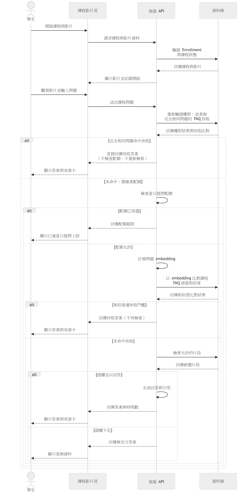

圖6-1-4 學生網頁觀看與提問循序圖

判讀重點是每次提問都重新驗證課程存取權，不沿用開啟影片當下的授權結果，因此撤銷修課或課程下架能在下一次提問立即生效，不必等既有對話結束。回答生成前會先經過兩層 FAQ 快取判斷：完全相同文字的提問直接比對快取，命中即回傳、不進入配額檢查與檢索，成本最低；未命中時才檢查當日提問配額，配額允許後才計算問題 embedding，並以語意相似度比對課程既有 FAQ，第二層命中同樣略過檢索與生成。這個順序代表配額只保護「真正動用檢索與生成」的提問，完全相同的重複提問不會計入學生的每日次數。兩層快取都未命中時才進入片段檢索與回答生成：證據足以回答時，答案會附上可核對的時間戳與來源片段，可讓學生跳回原始影片位置；證據不足時系統明確回覆查無資料，不臆測課程內容。

### 6-1-5 LINE綁定與課程問答

本圖對應第5章 UC-05（表5-3-5），回答「學生如何把 LINE 帳號與 FocusFlow 綁定，並在 LINE 上完成課程問答」；流程如圖6-1-5所示。

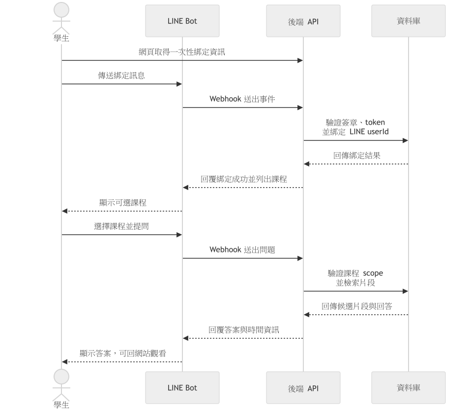

圖6-1-5 LINE綁定與課程問答循序圖

判讀重點是綁定訊息須先通過 webhook 簽章與一次性 token 雙重驗證才建立關聯：簽章確保訊息確實來自 LINE 平台，token 則確保是該學生本人在網頁端主動發起的綁定，兩者缺一都不會建立 LINE userId 與帳號的對應。綁定完成後系統只列出該學生目前有效修課且已發布的課程供選擇，避免學生在 LINE 上看到未授權課程的存在。選課與提問共用第6-1-4圖已說明的課程授權與檢索邏輯（含 FAQ 快取與配額判斷），本圖只呈現 LINE 特有的簽章驗證、綁定與訊息往返，不重複繪製 QA 內部協作，兩張圖以「傳遞管道」與「回答邏輯」分工，避免同一套檢索流程被畫成兩份彼此可能不同步的版本。

### 6-1-6 個人資料與通知

本圖對應第5章 UC-06（表5-3-6），回答「使用者如何維護個人資料，以及如何讀取與確認系統通知」；流程如圖6-1-6所示。

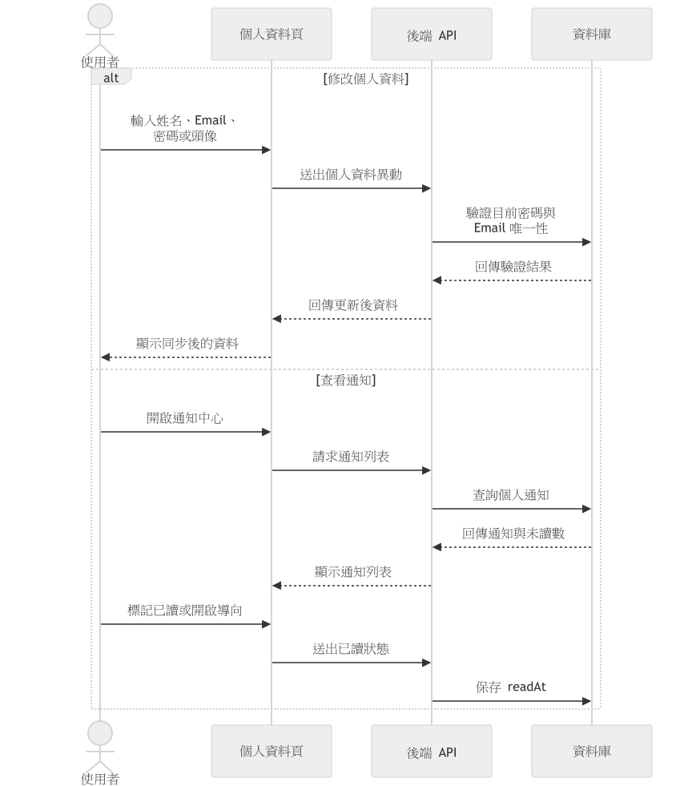

圖6-1-6 個人資料與通知循序圖

判讀重點是兩條路徑各自獨立、互不阻塞：修改個人資料須先驗證目前密碼，變更 Email 時另加唯一性檢查，確保帳號控制權與識別資訊的異動都經過確認，不是單純的表單更新；查看通知只讀取屬於自己的通知，標記已讀會保存讀取時間 `readAt`，讓「已讀」成為可追溯的事件而非單純的畫面狀態，且不會影響其他使用者對同一則系統公告的已讀狀態。兩條路徑共用同一個個人資料頁面，但在後端各自對應獨立的驗證與資料存取，這也是本圖不與其他角色專屬流程合併繪製的原因——個人資料與通知是三種角色共用的行為，與角色專屬的課程或維運操作屬於不同的協作邊界。

### 6-1-7 學生短影音瀏覽

本圖對應第5章 UC-07（表5-3-7），回答「學生開啟短影音頁面時，系統如何篩選出可播放的內容」；流程如圖6-1-7所示。

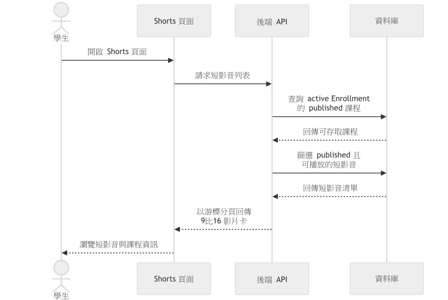

圖6-1-7 學生短影音瀏覽循序圖

判讀重點是篩選分兩階段收斂，而不是單一查詢：先以學生目前有效修課且已發布的課程框出課程範圍，再從中篩選狀態為 published 且 YouTube 可播放的短影音，任一階段不通過都不會出現在牆上。這種兩階段設計讓「修課授權」與「短影音上架狀態」各自獨立變化：課程被撤銷修課會立即收斂可見範圍，短影音被下架或審核退回也會立即從牆上消失，不需要互相等待對方的狀態更新。沒有可播放內容時回傳空狀態而非錯誤，也不會透露其他課程是否存在短影音，維持與其他學生專屬功能一致的最小揭露原則。

### 6-1-8 短影音腳本與成品審核

本圖對應第5章 UC-08（表5-3-8），回答「教師如何取得 AI 生成的短影音腳本，並讓成品通過審核後上架」；流程如圖6-1-8所示。

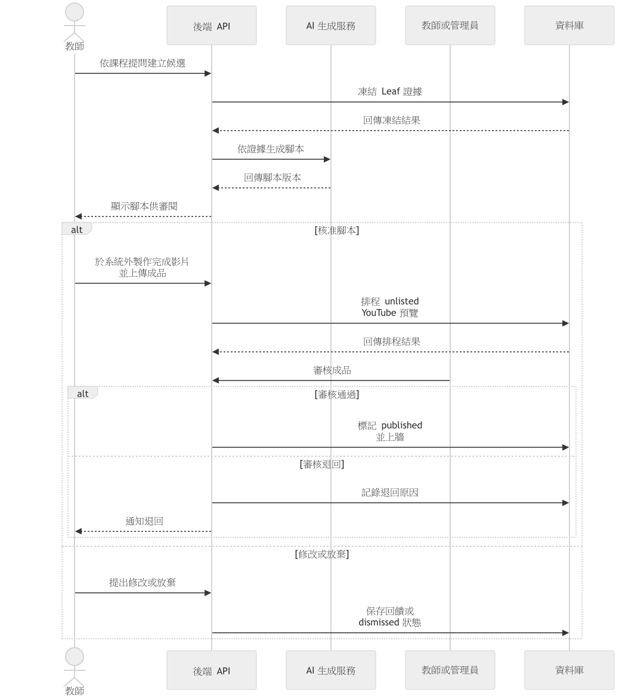

圖6-1-8 短影音腳本與成品審核循序圖

判讀重點是腳本生成前會先凍結一批 Leaf 證據，生成內容只能引用這批已凍結的片段，這讓腳本的可信度可回溯到具體的課程逐字稿，而不是任由生成模型自由發揮。教師核准腳本後，系統的責任在此中斷：完成影片須由教師於系統外自行剪輯製作再上傳，系統本身不提供自動剪輯或渲染，這是設計上的範圍界線而非缺漏。成品上傳後另需經過教師或管理員審核，只有審核通過且上傳成功的版本才會標記 published 並上牆；退回時會記錄退回原因並通知腳本提出者，讓「腳本核准」與「成品上架」成為兩個各自把關、互不預設對方結果的獨立關卡。

### 6-1-9 管理員維運

本圖對應第5章 UC-09（表5-3-9），回答「管理員如何在後台管理使用者、課程、影片與公告」；流程如圖6-1-9所示。

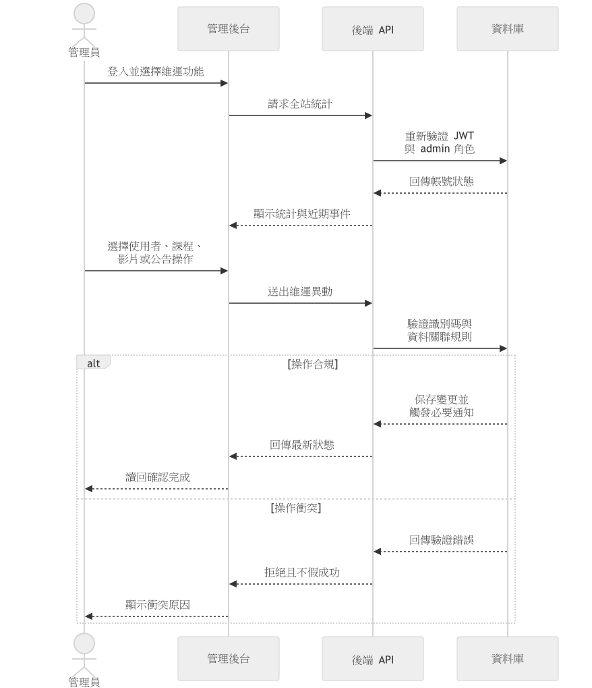

圖6-1-9 管理員維運循序圖

判讀重點是每次維運操作都重新驗證管理員身分與資料關聯規則，不沿用登入當下或前一個操作留下的授權假設；操作衝突（例如識別碼不存在或狀態不允許）時系統明確拒絕並回傳衝突原因，不會為了呈現操作成功而掩蓋實際失敗。變更成功後才保存資料並視需要觸發必要通知，這個順序確保管理員看到的「完成」畫面與資料庫實際狀態一致，管理員也可讀回最新狀態自行核對，不必只依賴前端的樂觀更新。管理員入口與一般登入分流（見圖6-1-1）在此圖中延續：每一次維運請求都當作獨立事件重新驗證，而不是把入口分流的結果當成後續操作永久有效的授權。

## 6-2 設計類別圖（Design Class Diagram）與設計物件圖（Design Object Diagram）

本節依第5章分析責任分組，將設計類別拆為帳號／課程／影片、問答／對話、通知／短影音三張設計類別圖，並另附一張設計物件圖。共同出現的 User、Course 等類別是同一設計類別在不同子領域圖中的重複投影，不代表建立多套實作。圖中只列理解責任所需的代表性屬性與方法，不列 `_id`、timestamps、index 等儲存細節；完整欄位定義見第8章。

表6-2-1　分析責任到設計圖的落實

| 分析責任 | 設計圖 |
| --- | --- |
| 帳號、課程、修課與影片 | 圖6-2-1 |
| 多輪對話、課程授權與來源式問答 | 圖6-2-2 |
| 通知、學生短影音與教師成品流程 | 圖6-2-3 |
| 學生網頁問答完成時的物件配置 | 圖6-2-4 |

### 6-2-1 帳號、課程與影片設計類別圖

本圖對應第5章 UC-01、UC-02、UC-03，說明帳號安全、課程管理、修課指派與影片批次如何由具體 service 與 domain 物件分工承擔；設計如圖6-2-1所示。

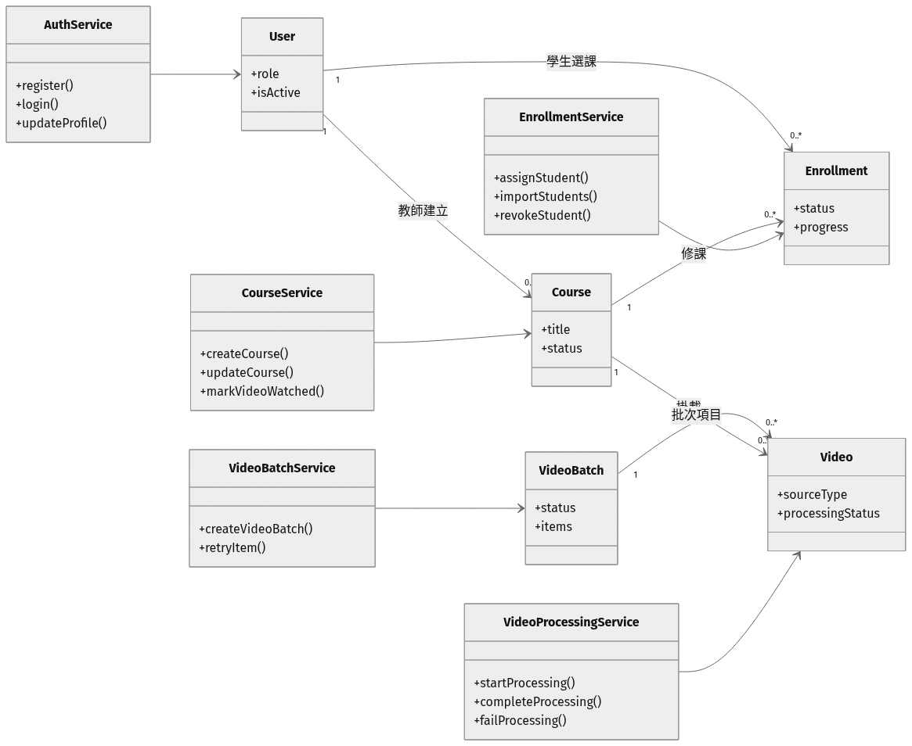

圖6-2-1 帳號課程與影片設計類別圖

判讀重點是 Course 與 Video 為可多課程掛載的設計關係，一支影片可同時屬於多門課程，因此影片本身不記錄單一課程的從屬狀態，掛載關係由 Course 一側維護；VideoBatch 只保存批次彙總（成功、失敗、處理中的統計與項目對應），實際的影片處理狀態仍集中由 VideoProcessingService 控制並寫回個別 Video，避免批次彙總與單支影片狀態各自更新而互相矛盾。EnrollmentService 與 CourseService 分屬不同物件（Enrollment 與 Course），對應 6-1-2 圖中「名單管理」與「課程發布」是兩個各自獨立、互不阻塞的操作序列。

### 6-2-2 問答與對話設計類別圖

本圖對應第5章 UC-04、UC-05，說明網頁與 LINE 共用的課程授權、提問限額、FAQ 快取與檢索回答責任如何分工；設計如圖6-2-2所示。

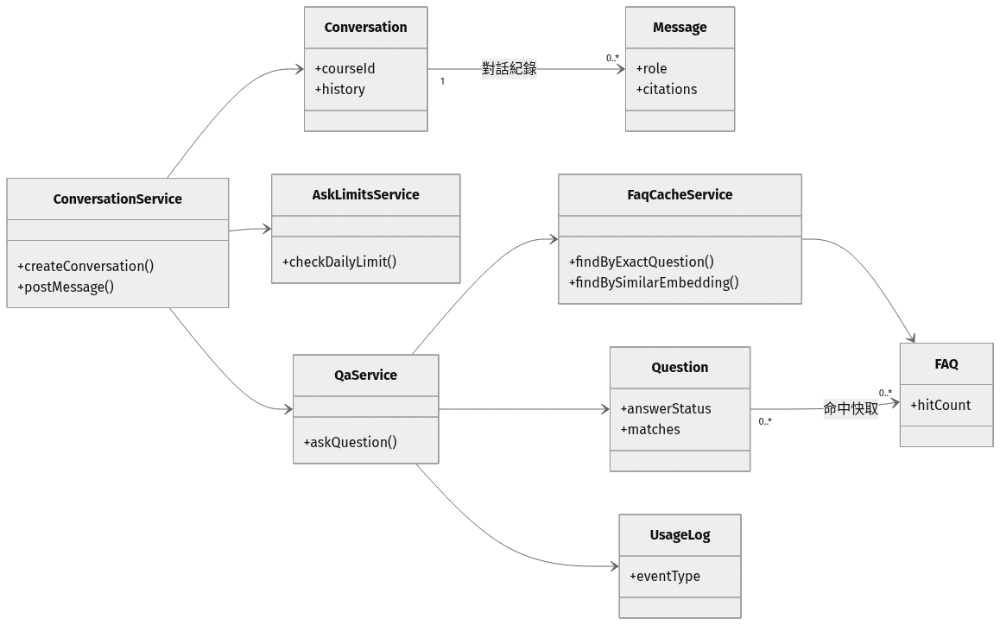

圖6-2-2 問答與對話設計類別圖

判讀重點是 QaService 對外只有一個入口 `askQuestion()`，但內部依序委派 FaqCacheService 的兩個方法：`findByExactQuestion()` 對應完全相同文字命中，`findBySimilarEmbedding()` 對應 embedding 語意相似度命中，兩者是圖6-1-4呈現的兩層快取在設計層的對應物件責任，不是同一個方法的兩種參數。AskLimitsService 的每日配額檢查被放在兩層快取之間，因此配額只保護真正進入檢索與生成的提問。Question 保存的是當次檢索快照（含 matches），Message 上的 citations 才是回答實際採用的來源，兩者用途不同：前者是稽核用的檢索證據，後者是呈現給使用者的可核對引用；FAQ 快取命中時仍會關聯回原始 Question，讓快取答案與其他即時生成的答案共用同一套稽核路徑，不需要為快取命中另建一套記錄機制。

### 6-2-3 通知與短影音設計類別圖

本圖對應第5章 UC-06、UC-07、UC-08，區分通知、學生短影音瀏覽與教師腳本／成品審核三條責任線；設計如圖6-2-3所示。

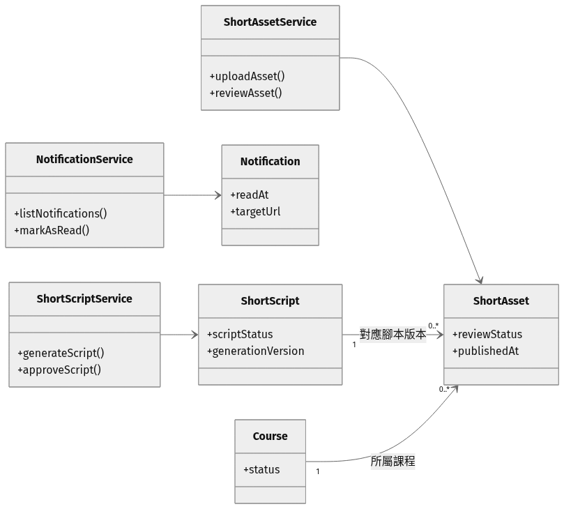

圖6-2-3 通知與短影音設計類別圖

判讀重點是 ShortScript 與 ShortAsset 是兩個獨立物件，以版本關聯（一份腳本對應多個成品版本）連結，而不是同一物件的不同欄位：ShortScript 記錄腳本內容與 `generationVersion`，ShortAsset 記錄成品上傳與 `reviewStatus`／`publishedAt`。這代表「腳本核准」與「成品上架」是圖6-1-8中兩個各自獨立的關卡在設計層的對應，成品是否上架只看該次 generation 的審核狀態，不會因為腳本本身已核准就自動視為上架。NotificationService 與短影音兩條服務各自獨立運作，只在特定事件（如影片完成、成品退回）發送通知，並非通知服務主動輪詢短影音狀態。

### 6-2-4 學生網頁問答授權與引用設計物件圖

官方把設計物件圖列為延伸項目，本節對應第5章 UC-04，以一次學生網頁問答完成後的實例快照，說明設計類別如何共同存在；情境如圖6-2-4所示。

圖6-2-4 Web問答授權與引用設計物件圖

圖中 `student01`、`course01`、`question01` 等為示例值，非實際帳號或課程資料。快照呈現學生的目前課程（透過 `activeCourseId` 指向而非直接持有課程資料）、對話中的一問一答訊息，以及該次提問對應的使用紀錄；`message02` 連到 `question01` 而不是反過來，說明一則助理訊息在生成當下才產生對應的提問紀錄，順序與圖6-1-4的「先檢索與生成、才記錄使用事件」一致。它是圖6-2-1與圖6-2-2中設計類別的具體實例，不是把第5章分析物件直接搬到本章。
