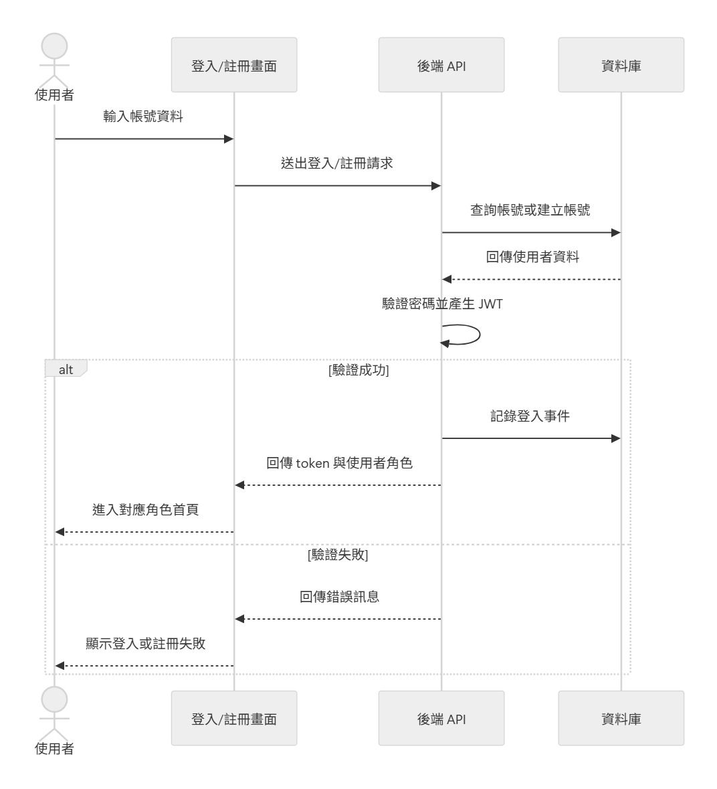
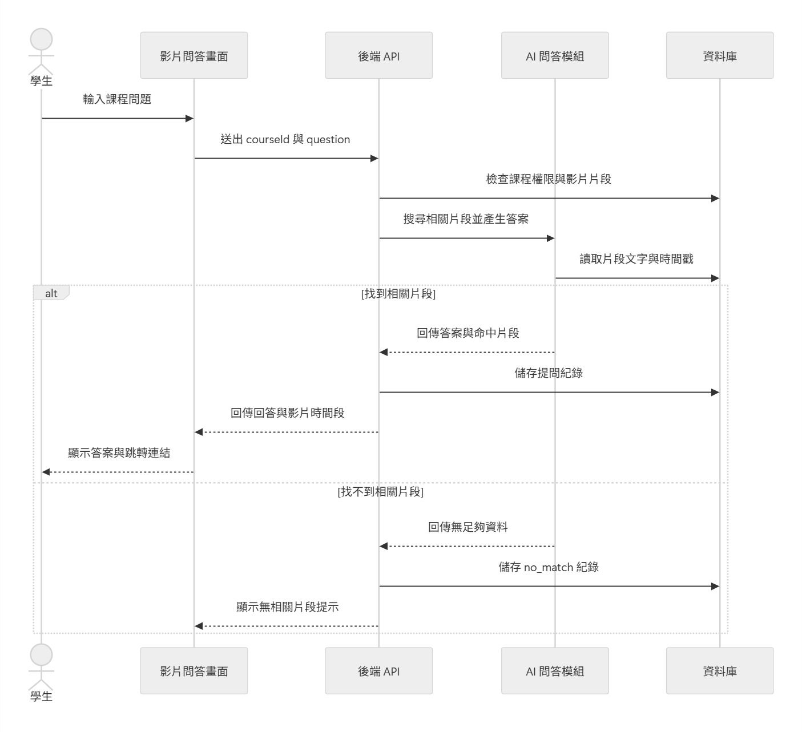

# 第6章 設計模型

> 狀態：初評原稿轉製，待核對現況。
> 原始資料日期：2026-06-02；Markdown 整理日期：2026-09-13。
> 來源：[初評系統手冊 DOCX](../source-documents/專題手冊_初評最終版.docx)，原第6章。

本章重用原稿文字、表格及嵌入圖像；尚未逐圖核對版面、合併儲存格與圖表編號，不代表最新版功能或正式驗收結果。

## 本次整理與待補

TODO：依目前服務與資料模型更新循序／通訊圖、設計類別圖；原稿 UML 圖保留作可修訂來源。

補充現況來源（尚待逐項套用）：[ARCHITECTURE](../../../../ARCHITECTURE.md)。

[返回手冊索引](../README.md)

---

## 6-1 循序圖（Sequential diagram）與通訊圖（Communication diagram）

圖6-11為使用者登入與註冊流程的循序圖，描述使用者在FocusFlow前端登入頁或註冊頁輸入帳號資料後，系統如何與後端API及資料庫互動。當使用者送出資料後，後端會查詢使用者帳號、驗證密碼或建立新帳號。若驗證成功，系統會產生JWT token，並依照使用者角色進入學生、教師或管理員首頁；若驗證失敗，系統會回傳錯誤訊息並顯示於畫面上。[1]

圖6-11循序圖-使用者登入與註冊

圖6-12為教師上傳影片與系統處理流程的循序圖。教師在課程影片畫面上傳本機影片或輸入YouTube URL後，前端會將影片資料送至後端API。後端建立影片資料並將處理狀態設為queued，接著啟動AI Pipeline。AI Pipeline會進行語音轉文字、分段與embedding建立，並將影片片段與索引資料寫入資料庫。若處理成功，影片狀態會更新為completed；若處理失敗，則更新為failed並提供重試依據。

圖6-12循序圖-教師上傳影片與系統處理

圖6-13為學生於網頁提問的循序圖。學生在影片問答畫面輸入課程問題後，系統會將課程編號與問題送至後端API。後端先檢查學生是否具有該課程的存取權，並確認影片片段是否已完成索引。若找到相關片段，AI問答模組會依據片段文字產生回答，系統再儲存提問紀錄並回傳回答與影片時間段；若找不到相關片段，則回覆無足夠資料的提示訊息。

圖6-13循序圖-學生網頁提問

圖6-14為LINE Bot提問流程的循序圖。學生可透過LINE Bot傳送綁定碼、切換課程或直接輸入課程問題。LINE Bot會將事件送至後端Webhook，後端先查詢使用者是否完成LINE綁定與課程選擇。若已完成綁定與選課，系統會呼叫AI問答模組查詢相關影片片段並產生答案，再將答案、秒數與影片連結回傳給學生；若尚未綁定或未選課，則回覆操作提示。

圖6-14循序圖-LINE Bot提問

圖6-15為管理員資料管理流程的循序圖。管理員進入管理後台後，可查詢使用者、課程、影片與系統使用紀錄。系統會向資料庫取得統計與清單資料並顯示於後台畫面。若管理員停用使用者或調整角色，後端會更新使用者資料；若管理員刪除影片，後端會刪除影片與對應片段資料，並回傳操作結果。

圖6-15循序圖-管理員資料管理

## 6-2 設計類別圖（Design class diagram）

圖6-21為FocusFlow的設計類別圖，呈現系統主要資料類別與彼此關係。使用者類別依角色區分為學生、教師與管理員。教師可建立多門課程，課程可包含多支影片；影片經AI Pipeline處理後會切分為多個影片片段，片段中包含逐字稿、開始秒數、結束秒數與向量資料。學生可透過網頁或LINE Bot提問，系統會建立提問紀錄並連結命中的影片片段，同時記錄使用紀錄以支援後續統計與管理。[1]

圖6-21設計類別圖

圖6-22為學生透過LINE Bot完成一次提問後的設計物件圖。此圖以實際執行時的資料實例說明物件關係：學生物件已完成LINE綁定，並將目前課程指向課程A；課程A包含已處理完成的影片A；影片A產生片段A；當學生提出問題後，系統建立提問A，並將該提問連結至命中的片段A。[1]

圖6-22設計物件圖-LINE提問完成後的資料實例
