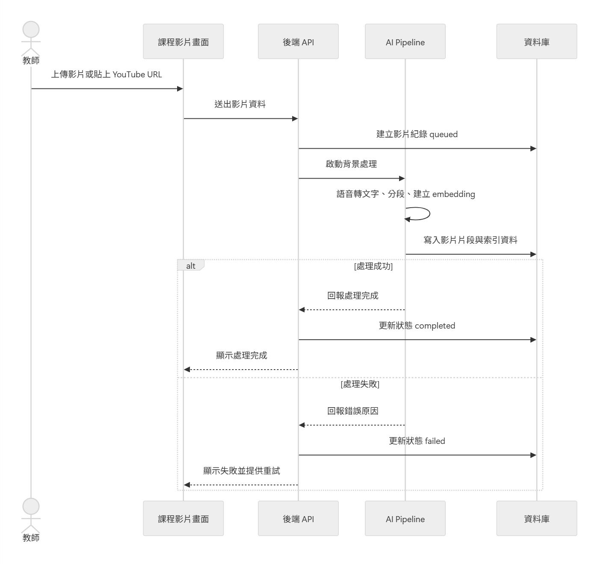
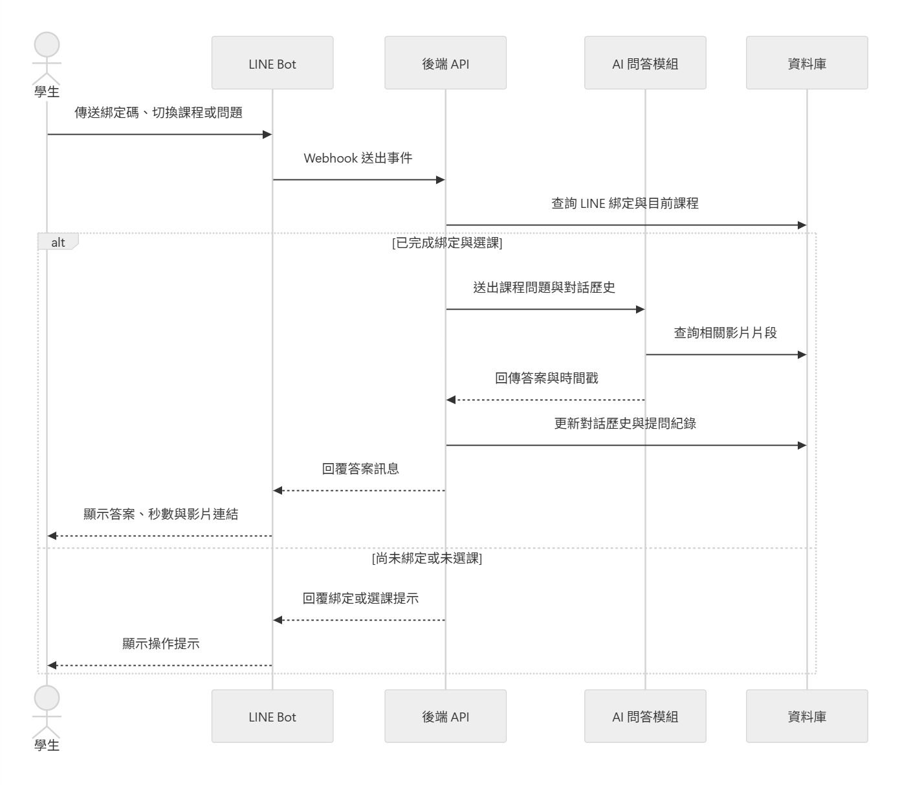
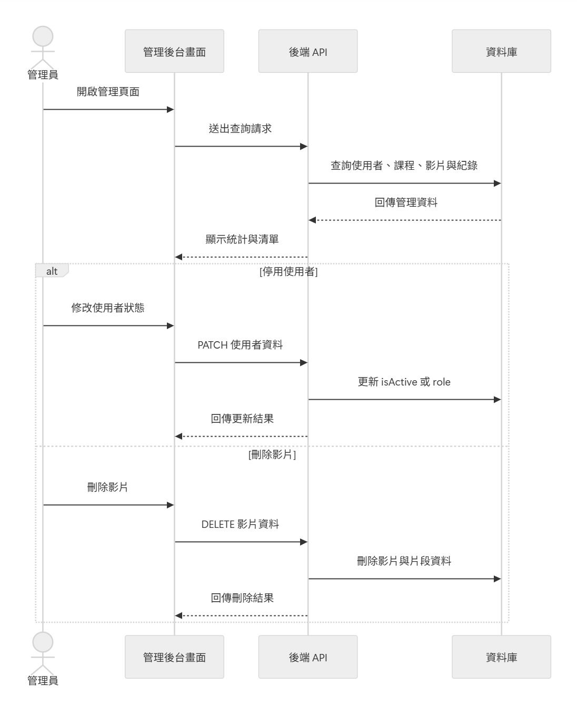
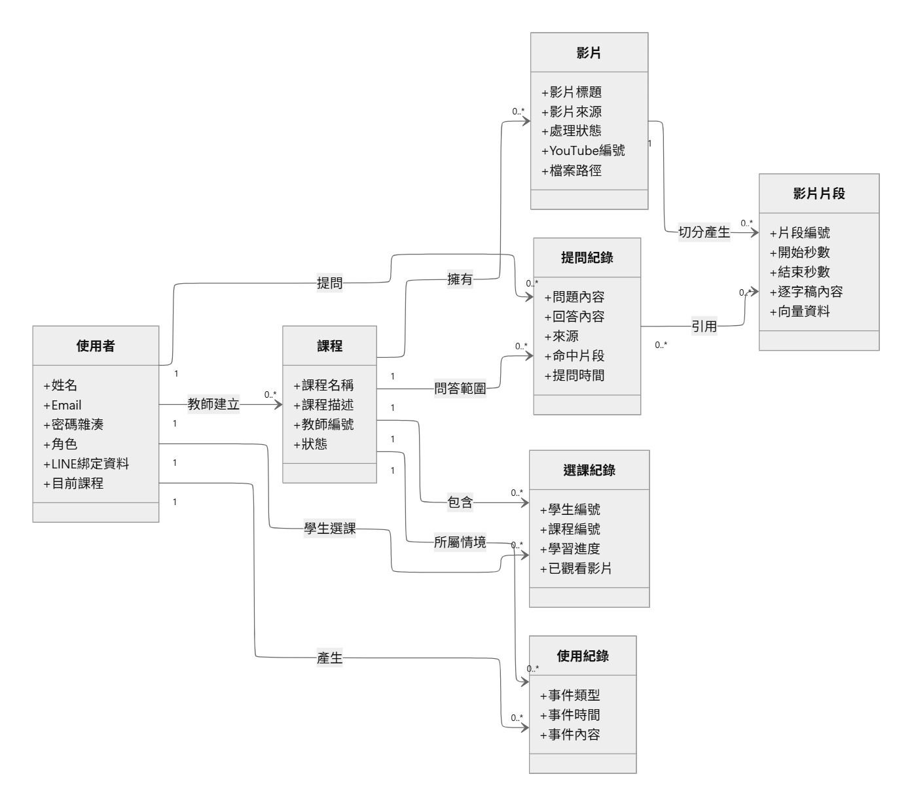
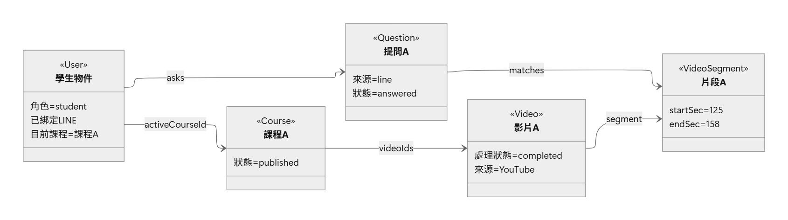

# 第6章 設計模型

> 本章依 2026-09-14 本機 checkout 的 route、service、model 與前端入口整理。初評原稿嵌入的 UML 圖保留作為歷史素材，**不作現況依據，均待依本章文字重繪**。

FocusFlow 是以課程權限為邊界的教學影片問答系統。Web SPA 與 LINE Bot 均透過 Express API 進入相同的身分驗證、修課權限與 QA 服務；AI Pipeline 則是獨立的 Python CLI，透過 MongoDB publication 與受 shared secret 保護的內部 webhook 回報影片處理狀態。

本章以「服務之間傳遞的責任與資料」說明設計；詳細欄位與索引見第 8 章，正式 API 路徑以 `backend/src/routes/` 為準。

[返回手冊索引](../README.md)

---

## 6-1 循序圖（Sequential diagram）與通訊圖（Communication diagram）

### 身分驗證與角色入口

1. 使用者在一般入口登入或註冊。一般入口提供 student、teacher 註冊；admin 沒有自助註冊入口，須由管理流程建立帳號。
2. 前端以 `POST /api/v1/auth/login` 或註冊端點送出資料；後端驗證輸入、比對 bcrypt 密碼雜湊或建立使用者，並簽發只含使用者識別碼的 JWT。
3. 前端將 token 儲存在 `localStorage.ff_token`，之後由 `apiFetch()` 以 `Authorization: Bearer ...` 帶入請求；重新載入時以 `/auth/me` 還原 session。只有收到 401／403 才清除本機憑證，暫時的網路或 5xx 錯誤會保留 session 供重試。
4. `main.jsx` 只對 `/admin` 啟用獨立的 `AdminApp`；該入口再次確認角色為 admin。其餘角色以 `DashboardApp` 的 role 與 sub-page state 切換頁面，並非完整 URL router。

> **歷史圖／待重繪：**下圖未反映獨立 admin 入口、session restore 與目前的錯誤處理邊界。

圖6-1-1　登入與註冊循序圖（初評歷史圖，待重繪）

### 教師建立影片、批次處理與處理狀態

教師或 admin 在可管理的課程中建立本機上傳或 YouTube URL 影片。單檔端點為 `POST /courses/:courseId/videos`；多檔端點為 `POST /courses/:courseId/video-batches`，最多十檔。多檔端點建立持久的 `VideoBatch` 與逐檔結果，前端可在重新整理後讀取進度。

每支 app-owned `Video` 一開始建立 `processing` 子文件，狀態依序為 `queued → processing → completed` 或 `failed`。Pipeline 以 `X-Processing-Secret` 呼叫 internal webhook：開始時轉為 `processing` 並遞增 `attemptCount`；完成時寫入影片長度、清除錯誤並觸發 FAQ 清除、完成通知與可選的 YouTube 上傳排程；失敗時保留錯誤碼與訊息。完成 webhook 可重送，副作用以可重試／去重方式處理。僅 `failed → queued` 可由重試流程發起，不能任意跳轉狀態。

`VIDEO_BATCH_PIPELINE_ENABLED` 控制批次是否使用 guarded pipeline-batch executor；關閉時批次仍可用，但以既有單支處理路徑排程，並將 `processingMode` 記為 `single_adapter`。因此 UI 批次、後端 batch aggregate 與 Python CLI batch 是相關但不同層次的能力。

> **歷史圖／待重繪：**下圖未呈現 `VideoBatch`、feature flag、internal webhook 驗證、完成後副作用與重送語意。

圖6-1-2　影片上傳與處理循序圖（初評歷史圖，待重繪）

### 網頁問答與來源回傳

學生以 `POST /api/v1/qa/ask` 傳送 `courseId` 與問題。後端先驗證 JWT，並以 active `Enrollment` 和 published `Course` 執行 default-deny 存取判斷；教師及 admin 則依其管理權限處理。接著 QA service 依 FAQ cache、課程／影片 allowlist、query embedding 與設定的檢索後端取得可用 Leaf 文字片段，生成回答或保守的無答案結果。

回應包含 `answer`、`citations[]`、`answerStatus` 與 runtime 訊號；`matches[]` 保留為 legacy/debug 相容欄位。每次 API 或 LINE 問答都會透過共用的記錄流程寫入 `usage_logs` 與 `questions`，其中引用帶有影片與時間範圍，供前端點擊跳轉。沒有可搜尋片段或證據不足時，系統回傳可辨識的 no-answer／runtime 狀態，不應把沒有來源的推測包裝為教材答案。

> **歷史圖／待重繪：**下圖未呈現 enrollment default-deny、FAQ cache、citation／answerStatus 契約與無答案分支。

圖6-1-3　學生網頁問答循序圖（初評歷史圖，待重繪）

### LINE Bot 問答

LINE Platform 送入 `POST /api/v1/line/webhook` 的請求先驗證 HMAC-SHA256 簽章，再解析原始 body。已登入的使用者可申請一次性 bind token；學生在 LINE 輸入 token 後，系統把 LINE 使用者 ID 與 FocusFlow 帳號連結。選定課程後，一般文字訊息進入與網頁相同的 QA service；對話歷史以環境設定 `MAX_CONVERSATION_TURNS`（目前程式預設四輪，最多八筆訊息）截斷後保存在使用者文件，僅作上下文輔助，不能越過課程權限。

LINE live smoke 曾有紀錄，但 webhook URL、Channel 設定與憑證屬環境狀態，沒有本次 live 驗證不得宣稱目前仍可用。

> **歷史圖／待重繪：**下圖未表達簽章驗證、一次性 token TTL 與共用 QA service。

圖6-1-4　LINE Bot 問答循序圖（初評歷史圖，待重繪）

### 管理端資料操作

管理端經 JWT 與 RBAC 後可使用 users、courses、videos、stats 與通知等管理 API。資料刪除或撤銷並非一律直接移除：課程／影片有其 cascade、detach／archive 與 FAQ invalidation 規則；`Enrollment` 以 active/revoked 狀態保留修課稽核；ShortAsset 在課程刪除前採封存處理。任何刪除實際會影響的外部 YouTube 資源、共享 Atlas 資料或歷史紀錄，仍須依對應服務的安全邊界執行。

> **歷史圖／待重繪：**下圖把管理動作概括為直接刪除，未反映目前的 RBAC、封存與 cascade 邊界。

圖6-1-5　管理員資料管理循序圖（初評歷史圖，待重繪）

## 6-2 設計類別圖（Design class diagram）

本系統的持久化類別以 MongoDB 文件與 Mongoose schema 表示，關聯由 `ObjectId` reference、service 權限規則和 index 維護，不是資料庫外鍵強制約束。核心關係如下：

表6-2-1　持久化類別關係與設計責任

| 類別／集合 | 主要關係與設計責任 |
| --- | --- |
| `User`、`Avatar` | User 具有 role、帳號狀態與 LINE 狀態；頭貼二進位資料放在一人一筆的 `Avatar`，User 只存 presence metadata。 |
| `Course`、`Enrollment` | Course 指向開課教師與影片引用；Enrollment 以 `(studentId, courseId)` unique 關係表示指派、撤銷、進度與已觀看影片。學生讀取需 active enrollment 且課程已 published。 |
| `Video`、`VideoBatch` | Video 表示 app-owned 課程影片及其 processing 狀態；VideoBatch 匯總多檔建立及逐檔結果。`videos` 仍與歷史 pipeline metadata 共用 collection，判定 app ownership 不能只看 legacy `video_id`。 |
| `VideoSegment`、`VideoSegmentParent`、`VideoSegmentVideo` | Leaf text segment（camelCase）是文字 QA 的主要檢索資料；Parent 是受 gate 保護的階層檢索資料；Video segment（snake_case）只作 course-scoped visual citation，並非 caption QA 或正式剪輯來源。 |
| `Question`、`UsageLog`、`Faq` | Question 保存結果、matches、runtime 與使用紀錄連結；UsageLog 保存稽核事件；Faq 是課程層快取，引用失效時必須整筆失效。 |
| `LineBindToken`、`Notification`、`ShortAsset` | token 以 TTL 自動清理；Notification 有 recipient/dedupe 設計；短影音候選／腳本、人工成品上傳、審核、YouTube 排程與學生 feed 已有功能開關控制的程式；系統不會由來源影片自動剪輯、渲染或合成字幕，外部上傳亦未在本階段 live 驗收。 |

> **歷史圖／待重繪：**下圖缺少 Enrollment、VideoBatch、FAQ、Notification、Avatar、ShortAsset 與 Parent segment，且將資料關係簡化為舊模型。

圖6-2-1　系統設計類別圖（初評歷史圖，待重繪）

下列物件情境是目前 LINE 問答的一個正確最小實例：已綁定的 student User 選定一門已發布、且自己具有 active Enrollment 的 Course；Course 允許範圍內的完成影片對應可搜尋的 `VideoSegment`；提交問題後新增 `UsageLog` 與 `Question`，Question 內保存允許公開的回答、引用快照與 runtime。這些文件以 ID 關聯，但 service 仍需重新驗證權限與引用有效性。

> **歷史圖／待重繪：**下圖未呈現 active Enrollment、Question／UsageLog 及 token／簽章等實際限制。

圖6-2-2　LINE 問答物件圖（初評歷史圖，待重繪）
