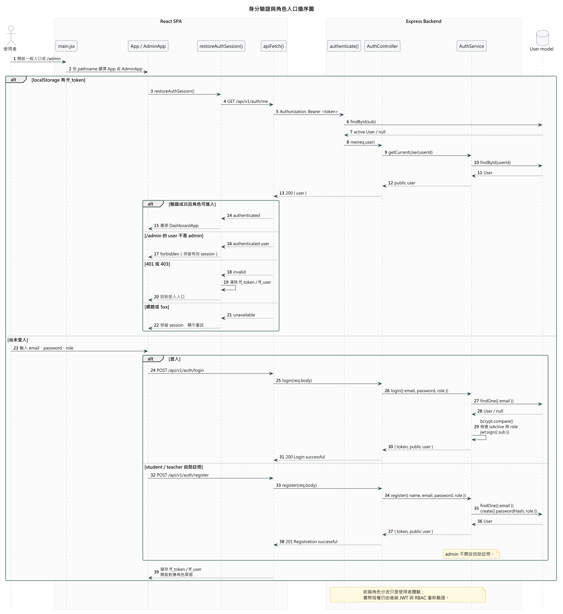
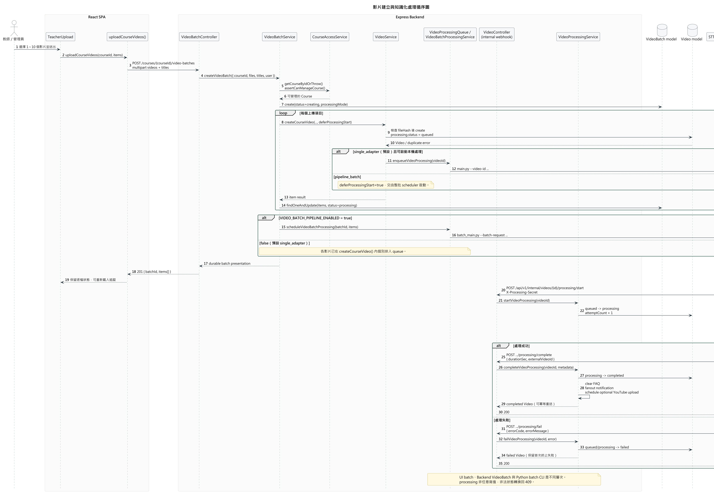
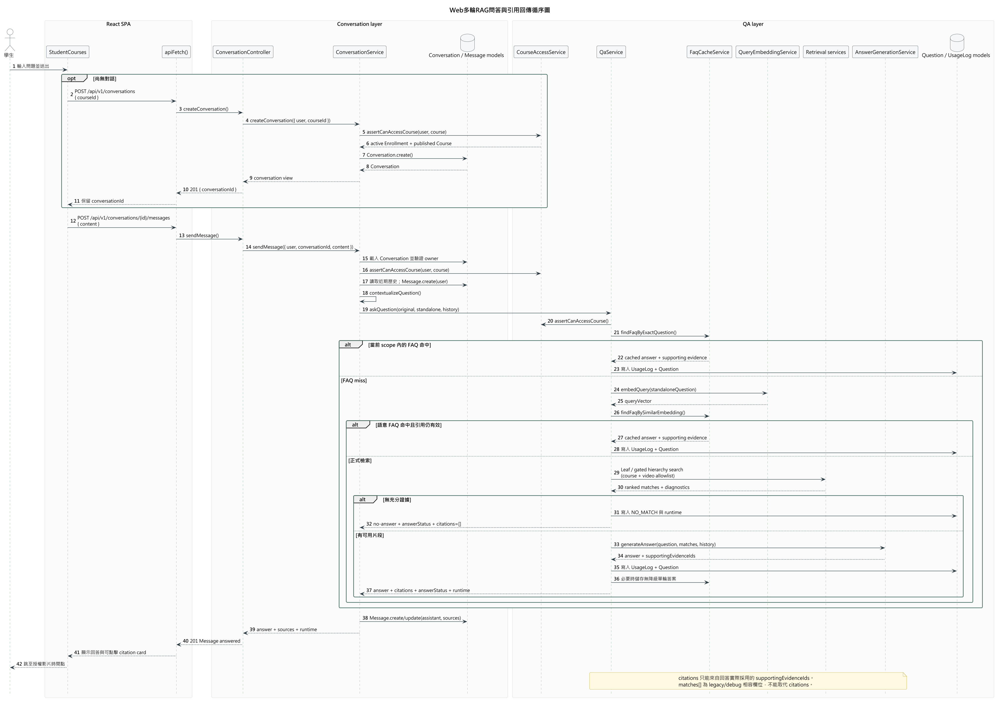
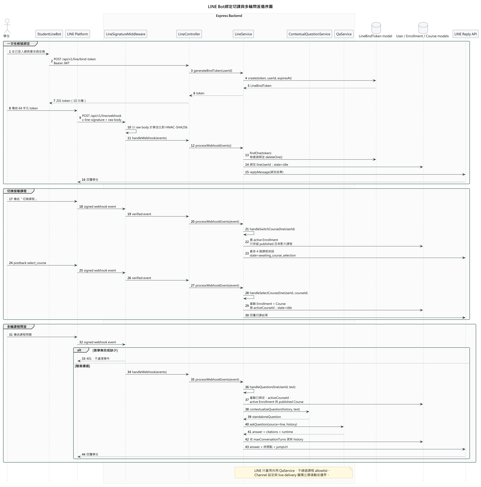
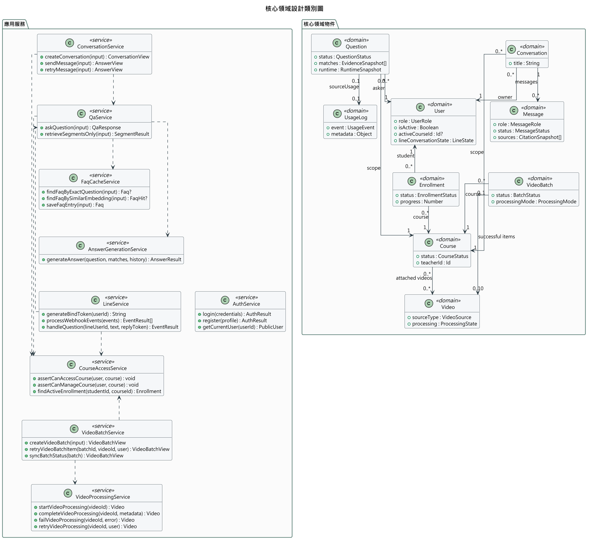

# 第6章 設計模型

> 本章依 2026-09-17 本機 checkout 的前端入口、backend routes／controllers／services／models 與 Pipeline 交接程式查證。初評舊圖僅保留為歷史素材，不作現況證據。本章確認的是 repository 設計與實作對應，不等同 shared Atlas、LINE、STT provider 或正式部署的 live 驗收。

FocusFlow 採用 routes → controllers → services → models 的後端分層。Web SPA 與 LINE Bot 最終共用課程授權與 QA 服務；AI Pipeline 則以受 shared secret 保護的 internal processing webhook 回報狀態。本章選擇循序圖（Sequence Diagram）表達重要互動，不再為相同流程另畫通訊圖（Communication Diagram）。

本章五張 UML 圖由 OpenAI Codex 協助依目前程式碼產出 PlantUML 工作母稿，AI 使用紀錄見 AI-UML-20260917。所有圖目前均為 draft，仍須由團隊人工確認；若最終公告仍要求 Visual Paradigm VPP／VPD，需依這些已查證母稿重製交付檔。

[返回手冊索引](../README.md)

---

## 6-1 循序圖（Sequence Diagram）或通訊圖（Communication Diagram）

本節採循序圖，依時間順序呈現物件間的訊息；同一流程不再重複繪製通訊圖。四張圖分別實現 UC-01、UC-03、UC-04 與 UC-05，涵蓋本系統最重要、跨元件最多的設計流程。

### 6-1-1 身分驗證與角色入口

本圖用來說明一般入口與 /admin 如何共用後端身分驗證，同時維持不同的角色入口。流程如圖6-1-1所示。

圖6-1-1 身分驗證與角色入口循序圖

判讀重點是「前端入口分流」與「後端授權」不可混為一談：main.jsx 只依 pathname 選擇 App 或 AdminApp；JWT 驗證與角色判斷仍由後端重新查詢 active User。重新載入時，restoreAuthSession() 只在 /auth/me 回傳 401／403 時清除憑證；網路或 5xx 問題保留 session 供重試。已驗證的非管理員開啟 /admin 時是 FORBIDDEN，不會被強制登出。

1. main.jsx 依網址選擇一般入口或管理員入口。
2. 若已有 ff_token，restoreAuthSession() 透過 apiFetch() 呼叫 GET /api/v1/auth/me。
3. authenticate() 驗證 JWT，並重新讀取 active User；AuthService.getCurrentUser() 回傳公開使用者資料。
4. 有效管理員進入管理介面；有效非管理員在 /admin 得到 forbidden；401／403 才清除本機憑證。
5. 尚未登入者使用 POST /api/v1/auth/login；AuthService.login() 比對 bcrypt 雜湊、帳號狀態與所選角色後簽發 JWT。

### 6-1-2 影片建立與知識化處理

本圖用來說明多檔上傳如何建立 durable VideoBatch、逐支建立 Video，並交由單支或 batch Pipeline 處理。流程如圖6-1-2所示。

圖6-1-2 影片建立與知識化處理循序圖

判讀重點是三個「批次」層次不同：前端一次送出多檔、backend 以 VideoBatch 保存 aggregate 與逐檔結果、Python Pipeline 可依 feature flag 使用 batch CLI。VIDEO_BATCH_PIPELINE_ENABLED=false 時，batch API 仍可使用，只是每支影片改走既有 VideoProcessingQueue。Pipeline 寫入可搜尋片段後，以 internal webhook 推進狀態；非法轉換回 409，重複 start／complete／fail 依各自契約安全處理。

1. 教師或管理員在 TeacherUpload 選擇一至十個檔案，前端以單一 multipart request 呼叫 batch API。
2. VideoBatchService.createVideoBatch() 先驗證課程管理權，再建立 VideoBatch。
3. 服務逐檔呼叫 VideoService.createCourseVideo()；每支影片以 processing.status=queued 建立，部分檔案失敗不會回滾其他成功項目。
4. feature flag 開啟時交由 VideoBatchProcessingService 啟動 batch CLI；關閉時由單支 queue 排程各影片。
5. Pipeline 依序執行 STT、Leaf chunk、embedding、artifact validation 與 segment upsert。
6. Pipeline 以 X-Processing-Secret 呼叫 start／complete／fail webhook；completed 後清除相關 FAQ、發送完成通知，並依設定排程 YouTube 上傳。

### 6-1-3 Web 多輪 RAG 問答與引用回傳

目前學生網頁並非直接以 /qa/ask 完成整個 UI 流程，而是使用 Conversation API 保存多輪訊息，再由 ConversationService 呼叫共用 QaService。完整流程如圖6-1-3所示。

圖6-1-3 Web多輪RAG問答與引用回傳循序圖

判讀重點是權限、檢索與引用均採 fail-closed。ConversationService 先驗證對話所有權與課程存取，再把近期訊息正規化為 standalone question；QaService 重新驗證 active Enrollment 與 published Course，並建立 course／video allowlist。FAQ 命中前會重新確認引用仍在目前 scope；正式回答的 citations 只取自 answer provider 回報的 supportingEvidenceIds，不能把所有 retrieval matches 當成答案證據。

1. 若尚無對話，學生先呼叫 POST /api/v1/conversations 建立屬於本人與該課程的 Conversation。
2. POST /api/v1/conversations/{id}/messages 建立 user Message，並讀取最近的有效訊息作為多輪上下文。
3. ConversationService 將追問轉成 standalone question，再呼叫 QaService.askQuestion()。
4. QaService 重新驗證課程權限，依序嘗試 exact FAQ、query embedding／semantic FAQ、Leaf 或 gated hierarchy retrieval。
5. 無充分證據時保存 NO_MATCH 與 runtime 並回傳可辨識的 no-answer；有證據時呼叫 AnswerGenerationService 取得回答與 supportingEvidenceIds。
6. 系統保存 UsageLog、Question 與 assistant Message，回傳 answer、citations、answerStatus 與 runtime；前端以 citation card 跳轉授權影片時間點。

### 6-1-4 LINE Bot 綁定、切課與多輪問答

本圖用來說明一次性帳號綁定、有效修課選單及共用 QA 服務如何串接。流程如圖6-1-4所示。

圖6-1-4 LINE Bot綁定切課與多輪問答循序圖

判讀重點是所有 LINE event 必須先以 raw body 驗證 HMAC-SHA256 簽章；綁定 token 有 10 分鐘效期且成功後立即刪除。課程清單只來自 active Enrollment、published Course 與仍有 Video record 的交集。即使 User 已保存 activeCourseId，每次提問仍會重新驗證 Enrollment 與 Course；失去權限時會清除目前課程與對話歷史。

1. 已登入使用者從網頁取得 64 字元一次性 bind token，LineBindToken 以 TTL index 輔助清理。
2. LINE webhook 先驗簽再解析事件；有效 token 綁定 lineUserId，並在成功後刪除 token。
3. 學生輸入「切換課程」時，系統列出最多四門目前可用課程，並把對話狀態改為 awaiting_course_selection。
4. postback 選課時再次驗證 Enrollment、Course 與可用影片，成功後寫入 activeCourseId 並回到 idle。
5. 一般問題先通過綁定、狀態與課程權限檢查，再由 ContextualQuestionService 產生 standalone question。
6. LineService 呼叫共用 QaService，依 MAX_CONVERSATION_TURNS 截斷並更新歷史，再透過 LINE Reply API 回傳答案、時間點與跳轉連結。

## 6-2 設計類別圖（Design Class Diagram）

本節的設計類別圖不是 MongoDB collection schema。它用 service 與核心領域物件說明分析責任如何落實到程式設計；HTTP／webhook Controller 已在 6-1 的循序圖呈現，為維持 A4 可讀性不在本圖重複。完整欄位、index、唯一性與文件型參照限制留在第 8 章。核心責任與依賴如圖6-2-1所示。

圖6-2-1 核心領域設計類別圖

表6-2-1 分析責任到設計類別的落實

| 分析責任 | 主要設計類別 | 落實方式 |
| --- | --- | --- |
| 身分驗證與角色入口 | AuthService、User | HTTP Controller 驗證輸入；Service 處理 bcrypt、帳號狀態、角色與 JWT；User 保存角色及啟用狀態。 |
| 課程授權 | CourseAccessService、Course、Enrollment | 所有 Web／LINE 問答與課程操作共用 owner／admin／active enrollment 判斷；published 只表示可被學生使用，不單獨構成授權。 |
| 影片批次與處理狀態 | VideoBatchService、VideoProcessingService、VideoBatch、Video | Batch service 保存逐檔結果與 executor mode；processing service 集中執行合法狀態轉換與完成副作用。 |
| 多輪 Web 問答 | ConversationService、Conversation、Message | 對話 service 驗證 owner／course、建立 standalone question，保存 user／assistant message 與 citation snapshot。 |
| 來源式回答 | QaService、FaqCacheService、AnswerGenerationService、Question、UsageLog | QA service 協調 scope、cache、retrieval、answer 與 audit；回答服務回報實際採用的 evidence IDs。 |
| LINE 整合 | LineService、User | Webhook Controller 接收已驗簽事件；Line service 處理綁定、狀態、切課、歷史與共用 QA routing。 |

圖中的 FaqCacheService 與 AnswerGenerationService 是從「提問處理」分析責任拆出的技術協作者。Service 對核心物件的使用由方法簽章與表6-2-1對照，不另以大量依賴線穿越兩個 package；Domain objects 只列出理解責任與關聯所需的代表性狀態，未把 _id、timestamps、index 等儲存細節塞入類別圖，因此不會與第 8 章的集合關聯圖重複。

官方將設計物件圖列為延伸項目而非必要項目。現有 LINE 問答舊物件圖缺少 active Enrollment、Question／UsageLog 與 service 重新驗權等關鍵限制，本輪不沿用；若後續要補，應從圖6-2-1選擇一個具體執行時點重新實例化，而不是把舊圖直接視為現況。
