# 第6章 設計模型

> 本章依 2026-09-19 本機 checkout 的前端入口、backend routes／controllers／services／models、測試所固定的契約與 Pipeline 交接程式查證。初評舊圖與歷屆手冊只作排版／拆圖粒度參考，不作 FocusFlow 現況證據。本章確認的是 repository 設計與實作對應，不等同 shared Atlas、LINE、STT provider、YouTube、Gemini 或正式部署的 live 驗收。

FocusFlow 後端維持 routes → controllers → services → models 分層。第 6 章屬物件設計（Object Design）：6-1 以循序圖（Sequence Diagram）呈現跨物件互動，6-2 以設計類別圖（Design Class Diagram）說明分析責任如何落實到程式設計，並補一張設計物件圖（Design Object Diagram）呈現特定執行時點的實例快照。本章不把資料庫 collection 綱要當成類別圖；完整欄位、index 與文件參照限制留在第 8 章。

本輪將原本 4 張過度密集的循序圖拆成 9 張單一情境圖，並將 1 張大型設計類別圖拆成 3 個子領域圖，再補 1 張設計物件圖。13 張 UML 圖均由 OpenAI Codex 協助依目前程式碼產出 PlantUML 工作母稿，AI 使用紀錄見 AI-UML-20260919；其中 5 張既有正式草稿的重大重繪標為 `v2-0`，8 張首次正式產出標為 `v1-0`。所有圖目前均為 `draft`，仍須由團隊人工確認；若正式交付仍要求 Visual Paradigm VPP／VPD，需依已查證母稿另行重製交付檔。

[返回手冊索引](../README.md)

---

## 6-1 循序圖（Sequence Diagram）或通訊圖（Communication Diagram）

本節依官方「循序圖或通訊圖擇一」採循序圖，不為同一流程重複繪製通訊圖。拆圖原則是一張圖只回答一個主要觸發情境；因此身分驗證、影片處理、Web 問答與 LINE 問答分別拆成可在 A4／Word 版面判讀的協作單元。課程 CRUD、通知讀取及管理員一般列表操作可由設計類別與第 9 章元件規格說明，不另以內容高度重複的循序圖湊數。

### 6-1-1 一般登入與帳號鎖定

本圖回答「使用者提交登入資料後，系統如何驗證密碼、角色與失敗次數」；流程如圖6-1-1所示。

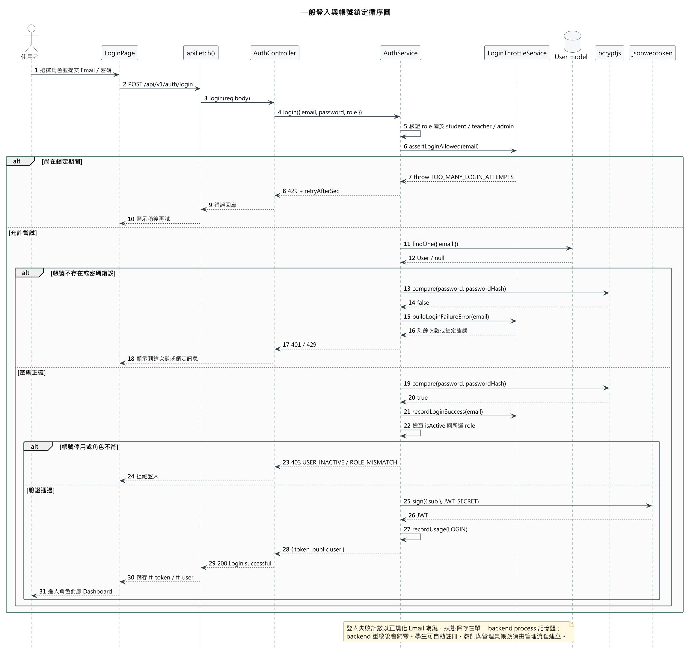

圖6-1-1 一般登入與帳號鎖定循序圖

判讀重點是帳號存在與不存在採一致的失敗計數回應，避免洩漏帳號是否存在。密碼正確後才檢查帳號啟用狀態與所選角色，通過後才簽發 JWT。登入 throttle 目前保存在單一 backend process 記憶體，backend 重啟後會歸零；它不是跨節點持久化鎖定。2026-09-18 起公開註冊只允許學生，教師與管理員不可自助註冊。

1. LoginPage 送出 Email、密碼與所選角色至 `POST /api/v1/auth/login`。
2. AuthService 先驗證角色值，再由 LoginThrottleService 判斷 Email 是否仍在鎖定期。
3. 系統查詢 User 並以 bcrypt 比對密碼；失敗時回傳剩餘次數，達門檻時回 429 與重試秒數。
4. 密碼正確時清除該 Email 的失敗紀錄，再檢查 `isActive` 與帳號角色。
5. 驗證通過後以 JWT secret 簽發 token、記錄登入事件，前端保存公開使用者資料並進入角色頁面。

### 6-1-2 Session 還原與角色入口

本圖回答「重新整理或直接開啟 `/admin` 時，前端如何還原 session 並維持後端授權邊界」；流程如圖6-1-2所示。

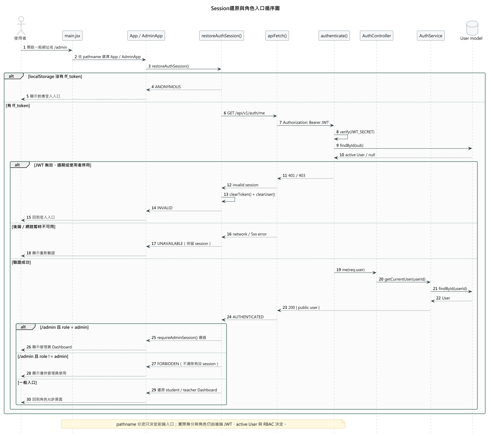

圖6-1-2 Session還原與角色入口循序圖

判讀重點是 `main.jsx` 的 pathname 分流只決定載入 App 或 AdminApp，不能取代後端 JWT 與 RBAC。`restoreAuthSession()` 只有在 `/auth/me` 回傳 401／403 時清除 token；網路或 5xx 會保留 session 供重試。已驗證但非管理員的使用者進入 `/admin` 時得到 forbidden UI，正常入口的有效 session 不被破壞。

1. `main.jsx` 依網址選擇一般入口或管理員入口。
2. 沒有 `ff_token` 時回到登入；有 token 時呼叫 `GET /api/v1/auth/me`。
3. authenticate middleware 驗證 JWT，並重新讀取 active User，而非信任本機快取角色。
4. 401／403 代表 session 無效並清除本機憑證；網路／5xx 代表暫時不可用並保留憑證。
5. `/admin` 另由 `requireAdminSession()` 檢查剛由後端取得的角色；一般入口則還原 student／teacher 導覽。

### 6-1-3 教師建立影片批次

本圖回答「教師一次送出多個影片後，backend 如何建立 durable VideoBatch 並保存逐檔結果」；流程如圖6-1-3所示。

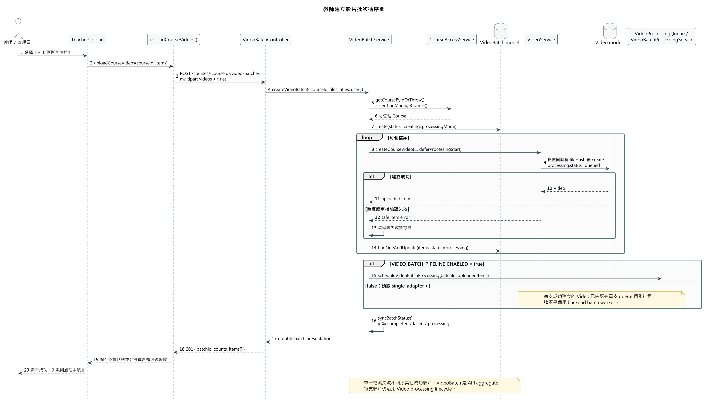

圖6-1-3 教師建立影片批次循序圖

判讀重點是 UI batch、backend VideoBatch 與 Python batch CLI 為不同層次。現在前端以單一 multipart batch API 上傳 1～10 個檔案；VideoBatchService 逐檔建立 Video，單檔失敗不回滾其他成功項目。`VIDEO_BATCH_PIPELINE_ENABLED=false` 時仍可使用 batch API，只是成功影片分別進入既有單支 queue。

1. TeacherUpload 驗證 1～10 個檔案後，以單一 multipart request 呼叫 batch API。
2. VideoBatchService 先驗證教師或管理員可管理該課程，再建立 `status=creating` 的 VideoBatch。
3. 服務逐檔呼叫 VideoService；每支成功影片以 `processing.status=queued` 建立，重複或驗證失敗只記錄該 item。
4. 每完成一個 item 就持久化 batch items，使程序中斷後仍能看到已處理結果。
5. feature flag 開啟時排程 Python batch；關閉時沿用各影片的單支處理 queue。
6. 回應包含 batchId、counts 與 items，前端可在重新整理後繼續查詢進度。

### 6-1-4 Pipeline 處理與狀態回報

本圖回答「已排程影片如何完成 STT、chunk、embedding、上傳與 backend 狀態回報」；流程如圖6-1-4所示。

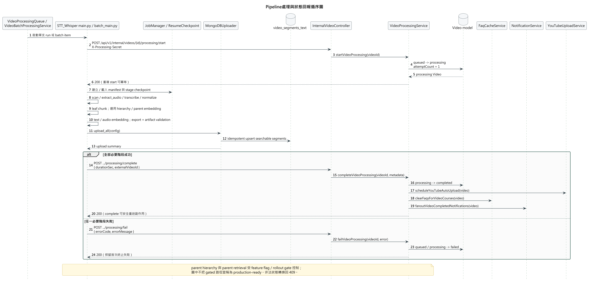

圖6-1-4 Pipeline處理與狀態回報循序圖

判讀重點是 Video processing 狀態不能任意覆寫。Pipeline 先以 shared secret 保護的 internal webhook 將 `queued` 推進為 `processing`，再執行可 checkpoint／resume 的階段。MongoDB upload 成功後才回報 `completed`；失敗則回報 `failed`。重複 start／complete／fail 依各自契約冪等或保留首次終止原因，非法轉換回 409。

1. 單支 queue 或 batch scheduler 啟動 `main.py`／`batch_main.py`。
2. Pipeline 呼叫 start webhook；VideoProcessingService 以合法轉換更新 Video 並增加 attemptCount。
3. JobManager 建立或載入 manifest，依 checkpoint 執行音訊抽取、STT、正規化、Leaf chunk、embedding 與 artifact validation。
4. hierarchy／parent embedding 僅在對應設定開啟時執行，不能由母稿存在推定 production rollout 已完成。
5. MongoDBUploader 以 idempotent upsert 寫入可搜尋片段。
6. 成功時 complete webhook 更新 duration／external ID、清除相關 FAQ、發送通知並選擇性排程 YouTube upload；失敗時 fail webhook保存錯誤。

### 6-1-5 Web 對話建立與續用

本圖回答「學生從課程頁送出訊息時，Conversation／Message API 如何建立或續用多輪對話」；流程如圖6-1-5所示。

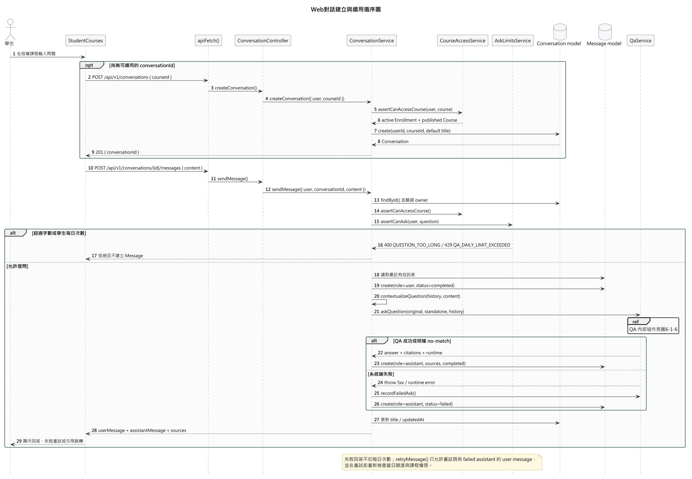

圖6-1-5 Web對話建立與續用循序圖

判讀重點是對話所有權、課程權限與提問限額在每次操作重新檢查。學生沒有 conversationId 時，送出問題的同一個 UI 情境先建立 Conversation，再送出 Message；不是直接以舊 `/qa/ask` 取代整個多輪流程。超過字數或每日次數時不建立 Message；系統端失敗則保存 failed assistant message，允許符合條件的重試。

1. 尚無對話時，前端呼叫 `POST /api/v1/conversations`；ConversationService 驗證 active Enrollment 與 published Course 後建立 Conversation。
2. 前端呼叫 `POST /api/v1/conversations/{id}/messages` 送出問題。
3. ConversationService 驗證對話 owner 與課程權限，再由 AskLimitsService 檢查字數與學生每日額度。
4. 允許提問時讀取最近有效訊息、建立 user Message，並把追問正規化成 standalone question。
5. 服務呼叫共用 QaService；QA 內部協作另見圖6-1-6。
6. 成功或 no-match 時保存完成的 assistant Message 與 citation snapshot；系統失敗時保存 failed message 並提供重試入口。

### 6-1-6 QA 檢索、回答與引用回傳

本圖回答「QaService 如何在 fail-closed 課程範圍內使用 FAQ、檢索與回答 provider，並產生可追溯引用」；流程如圖6-1-6所示。

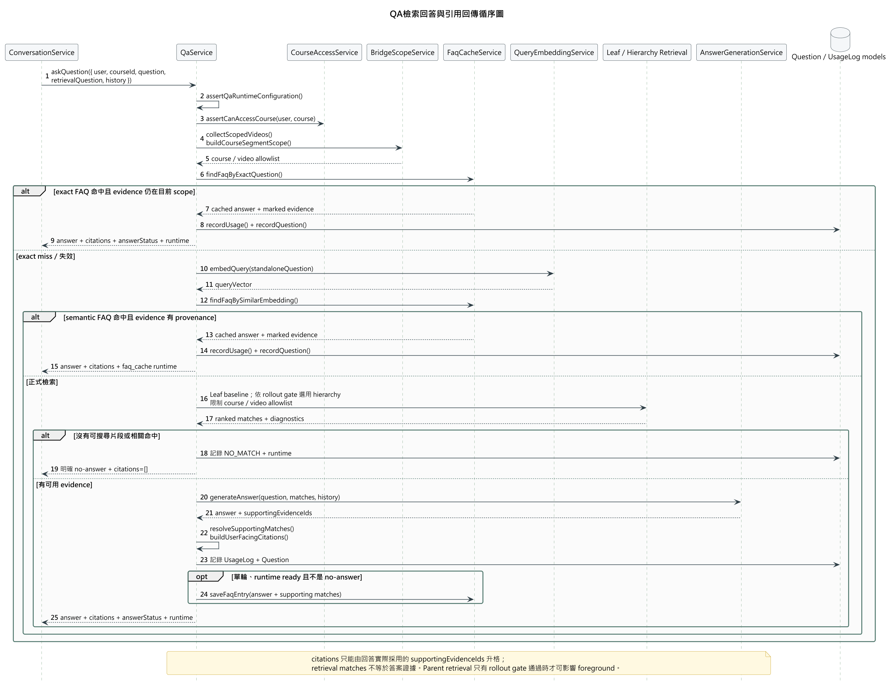

圖6-1-6 QA檢索回答與引用回傳循序圖

判讀重點是權限、FAQ 與 citations 均採 fail-closed。QaService 重新驗證 Course access 並建立 course／video allowlist；FAQ 命中仍要重驗 evidence 是否在目前 scope，舊 FAQ 若沒有答案實際採用 evidence 的 provenance 會略過。正式回答只把 AnswerGenerationService 回傳的 `supportingEvidenceIds` 升格為 citations，不能把全部 retrieval matches 當成答案證據。

1. QaService 先檢查 runtime 設定、Course、使用者課程權限與 scoped videos。
2. 啟用 FAQ 且沒有多輪歷史時，先嘗試 exact FAQ；命中前重驗引用 scope 與 provenance。
3. exact miss 時建立 query embedding，再嘗試 semantic FAQ。
4. FAQ miss 時執行 Leaf baseline；只有 rollout gate 通過時 hierarchy retrieval 才能影響 foreground。
5. 無片段或無相關命中時記錄 NO_MATCH，回傳明確 no-answer 與空 citations。
6. 有 evidence 時由 AnswerGenerationService 產生 answer 與 `supportingEvidenceIds`，再建立 citations、Question、UsageLog，符合條件時才寫入 FAQ。

### 6-1-7 LINE 帳號綁定

本圖回答「已登入使用者如何以一次性 token 把 LINE 帳號安全綁定至 FocusFlow」；流程如圖6-1-7所示。

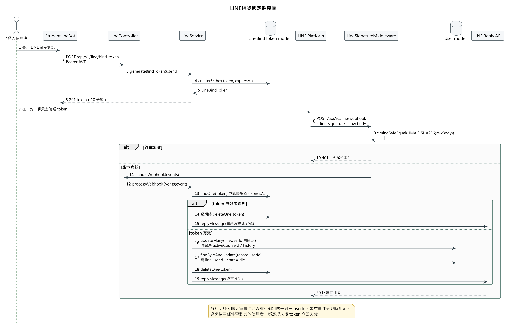

圖6-1-7 LINE帳號綁定循序圖

判讀重點是 token 有 10 分鐘效期且成功後立即刪除；LINE webhook 必須先用 raw body 驗證 HMAC-SHA256 才解析事件。同一個 LINE 帳號重新綁定其他系統帳號時，服務會先清除舊帳號的綁定與 LINE 專用狀態，避免 unique index 衝突與身分混用。

1. 已登入使用者呼叫 `POST /api/v1/line/bind-token`，LineService 產生 64 字元 token 與 expiresAt。
2. 使用者在 LINE 一對一聊天室傳送 token；LINE Platform 將事件送到 webhook。
3. LineSignatureMiddleware 以 raw request body 計算並安全比對 HMAC-SHA256。
4. LineService 即時查驗 token 是否存在及過期，不只依賴 TTL background cleanup。
5. 有效 token 會先解除同一 lineUserId 的舊綁定，再寫入新 User、重設 state，並刪除 token。
6. 群組或多人聊天室無法識別一對一 userId 時會拒絕，避免空條件誤抓其他使用者。

### 6-1-8 LINE 切換課程

本圖回答「已綁定學生如何只在目前有效修課範圍內選擇 LINE 問答課程」；流程如圖6-1-8所示。

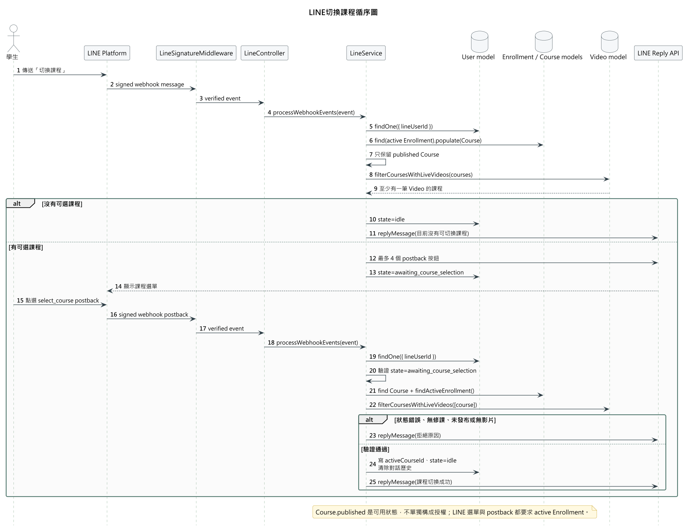

圖6-1-8 LINE切換課程循序圖

判讀重點是 Course `published` 只表示可用狀態，不單獨構成授權。課程選單只來自 active Enrollment、published Course 及至少一筆現存 Video 的交集；postback 選課時會再次驗證對話 state、Enrollment、Course 與影片。LINE Buttons Template 最多顯示四個課程按鈕。

1. 學生輸入「切換課程」，驗簽後由 LineService 查詢綁定 User。
2. 服務讀取 active Enrollment，保留 published Course，再排除沒有 Video record 的課程。
3. 沒有可選課程時回覆原因並回到 idle；有課程時送出最多四個 postback 按鈕並進入 awaiting state。
4. 學生點選課程後，服務確認 postback 只能在 awaiting state 使用，防止偽造跳過選單。
5. 服務重驗 Enrollment、Course 與 live Video；通過後寫入 activeCourseId、回到 idle 並清除舊對話歷史。

### 6-1-9 LINE 多輪問答

本圖回答「LINE 特有的身分、課程狀態、限額與訊息 delivery 如何包住共用 QA 核心」；流程如圖6-1-9所示。

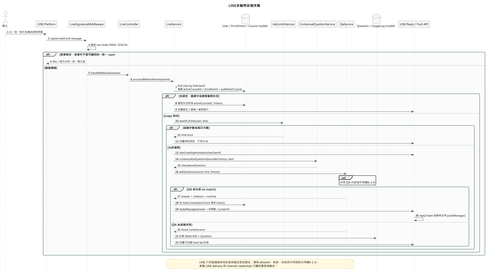

圖6-1-9 LINE多輪問答循序圖

判讀重點是 LINE 不繞過共用 QA。每次提問都重新驗證 lineUserId、activeCourseId、active Enrollment 與 published Course；失去權限時清除 active course 與歷史。AskLimitsService 與 Web 共用學生每日次數。QA 回覆時間較長時，若 replyToken 已過期，delivery 會改用 push，而不是把 delivery 失敗當成 QA 成功。

1. LINE webhook 驗證簽章與一對一 user source，拒絕無法識別使用者的群組事件。
2. LineService 檢查綁定、選課 state 與 activeCourseId，並重新查詢 Enrollment 與 Course。
3. AskLimitsService 檢查問題字數與學生每日次數；超過時回覆原因，不呼叫 AI。
4. 允許提問時顯示 loading animation，截斷最近歷史並建立 standalone question。
5. LineService 呼叫共用 QaService；課程 scope、檢索與 citation 契約見圖6-1-6，不在本圖重複。
6. 回答成功時更新 bounded history，組合答案、時間點及 jumpUrl；replyToken 過期時改用 push。系統端 QA 失敗則保存 failed Question／UsageLog 並回傳可判讀錯誤。

## 6-2 設計類別圖（Design Class Diagram）與設計物件圖（Design Object Diagram）

為保持 A4 可讀性，本節不以一張超大型圖塞入全部類別，而依第 5 章三張分析類別圖的責任分組，拆成帳號／課程／影片、問答／對話、通知／短影音三張設計類別圖。共同的 User、Course、Enrollment 會在需要的子領域圖中重複作為脈絡；這是同一設計類別的不同投影，不代表建立三套實作。圖中只列理解責任所需的代表性屬性與方法，不列 `_id`、timestamps、index 等儲存細節。

表6-2-1 分析責任到設計圖的落實

| 分析責任 | 設計圖 | 主要落實方式 |
| --- | --- | --- |
| 帳號、課程、修課與影片 | 圖6-2-1 | Auth／LoginThrottle、Course／Enrollment、VideoBatch／VideoProcessing services 與核心領域關聯。 |
| 多輪對話、課程授權與來源式問答 | 圖6-2-2 | Conversation、AskLimits、CourseAccess、Qa、FAQ 與 answer generation 協作，以及 Question／UsageLog 稽核。 |
| 通知、學生 Shorts 與教師成品流程 | 圖6-2-3 | Notification、ShortScript、ShortAsset 與人工成品發布責任；條件式或外部設定邊界明確標示 partial。 |
| Web 問答完成時的物件配置 | 圖6-2-4 | 以 active Enrollment、published Course、Conversation／Message、QaRequest／QaResponse、Question／UsageLog 實例化設計快照。 |

### 6-2-1 帳號、課程與影片設計類別圖

本圖用來說明帳號安全、課程管理、修課指派、影片批次與 processing lifecycle 如何由具體 service 與 domain object 承擔；設計如圖6-2-1所示。

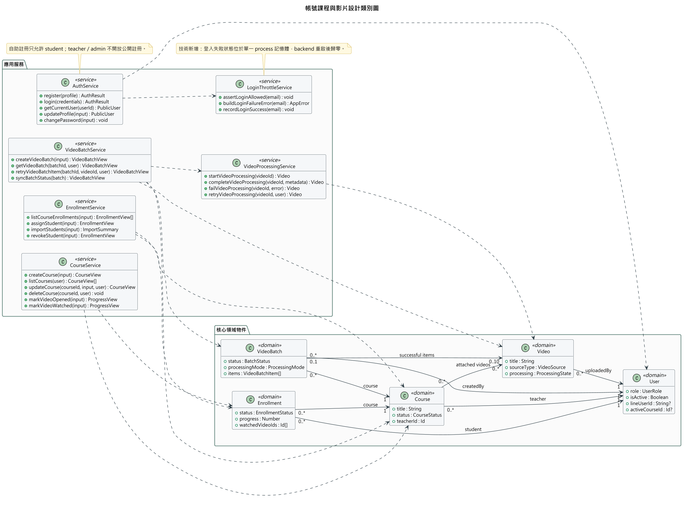

圖6-2-1 帳號課程與影片設計類別圖

判讀重點是 LoginThrottleService 為登入安全需求拆出的技術協作者；其 in-memory 狀態不是 User 的持久化欄位。VideoBatch 保存 API aggregate，Video 處理狀態仍由 VideoProcessingService 集中控制。Course 與 Video 為可多課程掛載的設計關係，刪除 Video 與解除課程掛載維持不同語意。

### 6-2-2 問答與對話設計類別圖

本圖用來說明 Web／LINE 共用課程授權、提問限額、FAQ、檢索回答與 audit 責任；設計如圖6-2-2所示。

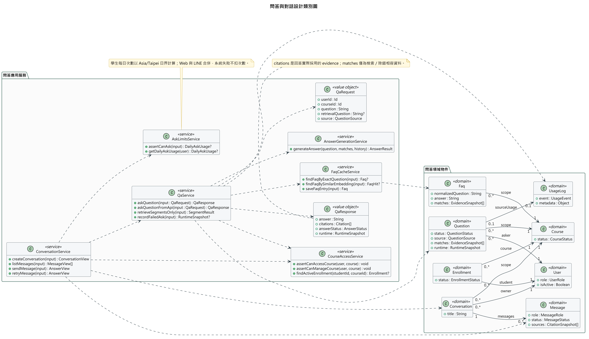

圖6-2-2 問答與對話設計類別圖

判讀重點是 QaRequest／QaResponse 為目前 JavaScript plain object contract 的設計表示，不是新增資料表。ConversationService 保存多輪訊息並呼叫 QaService；QaService 重新驗權並協調 FAQ、retrieval、answer 與 audit。Question 的 matches 是檢索快照，QaResponse 的 citations 才是回答實際使用 evidence 的對外表示。

### 6-2-3 通知與短影音設計類別圖

本圖用來區分已實作的通知／學生 ShortAsset feed 與條件式短影音腳本／人工成品流程；設計如圖6-2-3所示。

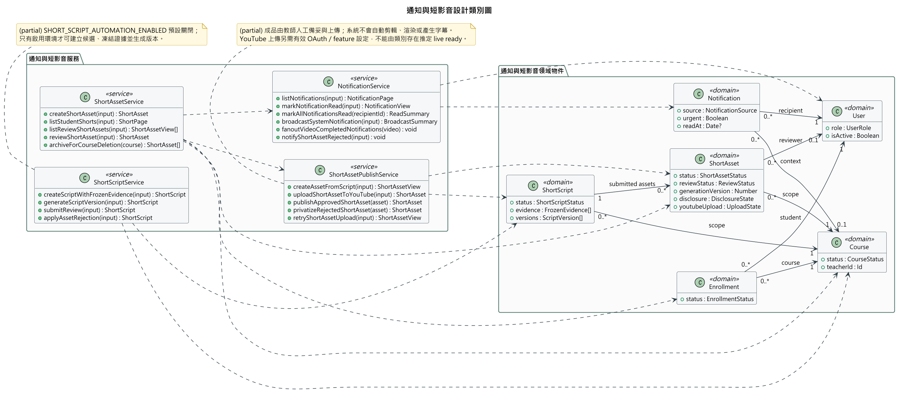

圖6-2-3 通知與短影音設計類別圖

判讀重點是整張圖標為 `implemented: partial`：NotificationService、學生修課限定 feed、ShortAsset review／archive 與 metadata sync 已有實作；ShortScript automation 預設關閉，YouTube 上傳另需有效設定。教師需自行備妥短片成品再上傳，系統沒有自動選片後完成 FFmpeg 剪輯、字幕與渲染的 worker，因此圖中不出現這些未完成能力。

### 6-2-4 Web 問答授權與引用設計物件圖

官方把設計物件圖列為延伸項目；本輪依使用者要求補上，以一筆 Web 問答完成後的實例快照說明設計類別如何共同存在。情境如圖6-2-4所示。

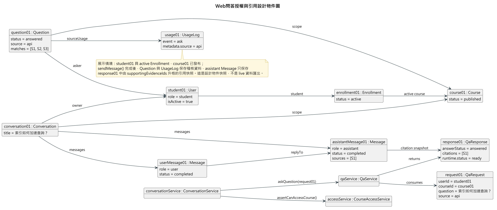

圖6-2-4 Web問答授權與引用設計物件圖

本圖中的 `student01`、`course01`、`question01` 等為匿名示例值，不是 shared Atlas 或正式環境資料。快照假設 active Enrollment 與 published Course 已通過授權；Conversation 包含 user／assistant Message，Question 連到對應 UsageLog，而 assistant Message 只保存 QaResponse 已升格為 citation 的來源快照。它實例化圖6-2-1與圖6-2-2中的設計類別，並包含 QaRequest／QaResponse 等技術設計物件，因此不是把第 5 章分析物件直接搬到第 6 章。

## 6-3 實作與驗收邊界

本章 UML 是以 repository 程式碼與 schema 反向查證的設計工作母稿。它可說明目前責任分派與呼叫順序，但不單獨證明下列外部狀態：shared Atlas search index、Gemini key／model、LINE channel credentials 與 webhook delivery、STT 模型、YouTube OAuth、正式部署、瀏覽器端到端行為或資料遷移。這些項目須在第 10 章以對應環境、時間、版本與實際結果另行驗收。

PlantUML 目前亦不是官方明列的 VPP／VPD 交付格式；團隊仍需確認是否能以 PlantUML／PNG 取代，或於交付前依本章母稿在 Visual Paradigm 重製。
