# 第7章 實作模型

> 本章依 2026-09-19 本機 checkout 的 `package.json`、入口程式、部署 workflow 與服務程式重整。新版圖稿描述目前可由程式與設定宣告驗證的結構；外部憑證、Atlas index、feature flags 與正式環境流程仍須依部署版本另行驗收。

[返回手冊索引](../README.md)

---

## 7-1 佈署圖（Deployment diagram）

FocusFlow 的實作由四個可獨立啟動的區域構成：React SPA、Express API、Python AI Pipeline 與 MongoDB／Atlas。瀏覽器與 LINE 不直接讀寫資料庫；所有課程權限、影片管理及問答請求都先進入 API。Pipeline 是 CLI，不內嵌於 Node.js process；它以執行產物、MongoDB upsert 與 internal processing webhook 和 API 協作。

表7-1-1　部署層級、用途與驗收邊界

| 層級 | 實作元件與用途 | 已知邊界 |
| --- | --- | --- |
| 使用端 | React 19 SPA（開發預設 5173）及 LINE App | SPA 以 `/admin` 分離管理員登入；其餘頁面主要以 component state 導覽。 |
| 應用層 | Node.js／Express 4 API（預設 4000）、JWT、Mongoose、Multer | API 依 routes → controllers → services → models 分層；internal processing endpoint 不用 JWT，改驗 shared secret。 |
| AI 處理層 | Python 3.10+、Faster-Whisper、FFmpeg／yt-dlp、Gemini embedding | 可處理單支或 CLI batch，具 checkpoint、manifest、resume；外部模型與實際媒體處理需另行 smoke。 |
| 資料與外部服務 | MongoDB／Atlas、Atlas Vector Search、Gemini／OpenAI provider、LINE、YouTube | 各服務是否已配置、index 是否存在、憑證是否有效，均是環境事實，不能由本機程式推定。 |

`.github/workflows/deploy.yml` 定義 push 至 `main` 後由 self-hosted runner 在 `/opt/focusflow` 拉取程式、安裝 backend dependencies、建置 frontend、調整 SELinux context、重啟 PM2 backend 並 reload Nginx。這描述部署自動化路徑，不代表 workflow、公開網址、LINE 或 AI provider 在每次部署後均已驗收。文件不記錄 IP、token、連線字串或其他環境秘密。

如圖7-1-1所示，Nginx 負責 HTTPS 靜態檔案與 API reverse proxy，PM2 管理 Node.js backend，Python Pipeline 以本機程序與受保護 webhook 協作。MongoDB Atlas、AI provider、LINE、YouTube 與 SMTP 均位於外部受管服務邊界；圖中的連線只表示介面責任，不代表憑證或 live provider 已驗收。

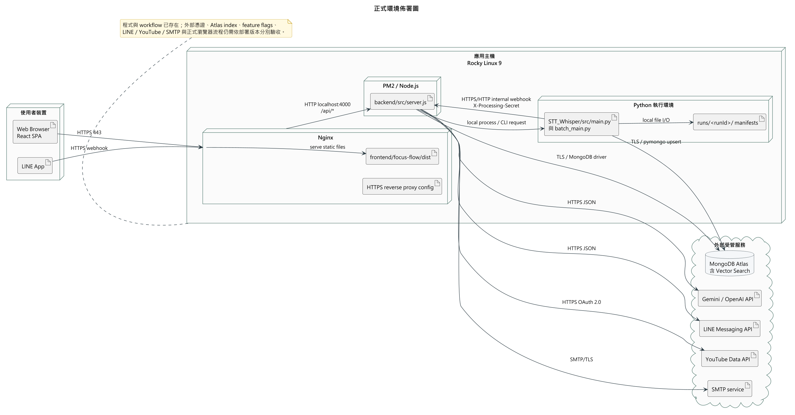

圖7-1-1 正式環境佈署圖

## 7-2 套件圖（Package diagram）

套件版本以本機 `package.json` 為準；使用 caret 的相依版本代表可安裝範圍，不是正式環境實際 lockfile 證據。套件的價值在於其在本系統中的責任，而非名稱羅列。

表7-2-1　主要套件與其在 FocusFlow 中的用途

| 區域 | 主要套件／工具 | 在 FocusFlow 中的用途 |
| --- | --- | --- |
| Frontend | React 19、React DOM、Vite 8 | 渲染三角色 SPA、提供開發伺服器與 production build。 |
| Frontend 視覺／整合 | Three.js、GSAP、`qrcode.react` | 登入／landing 視覺效果與 LINE 綁定 QR Code。 |
| Backend Web | Express 4、cors、morgan、dotenv、Multer | REST route/middleware、CORS／request log、環境讀取與影片 multipart 上傳。 |
| Backend 資料與安全 | Mongoose 8、MongoDB driver、jsonwebtoken、bcryptjs | Schema／資料存取、JWT、密碼雜湊與角色授權。 |
| Backend 服務整合 | Nodemailer、Swagger UI Express、js-yaml | 可設定的寄信、API 文件呈現與 OpenAPI YAML 讀取；寄信是否啟用取決於環境設定。 |
| Pipeline | Faster-Whisper、FFmpeg／imageio-ffmpeg、yt-dlp、rapidfuzz、google-genai、pymongo、numpy | 音訊取得、STT、正規化、embedding 與資料 publication；實際可用性受本機模型、媒體與憑證影響。 |

圖7-2-1由 `main.jsx` 進入一般或管理員 application shell，再依角色組合 pages、shared components、services 與 session utilities。前端只負責導覽與呼叫 API，資料權限仍由後端重驗。

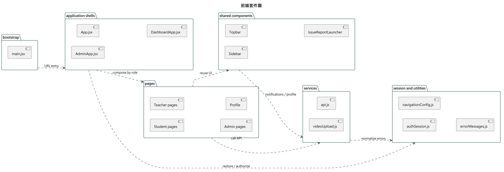

圖7-2-1 前端套件圖

圖7-2-2呈現後端固定的 routes → controllers → services → models 分層；middleware 執行認證、角色、上傳與錯誤處理，controller 不直接承擔主要業務規則。

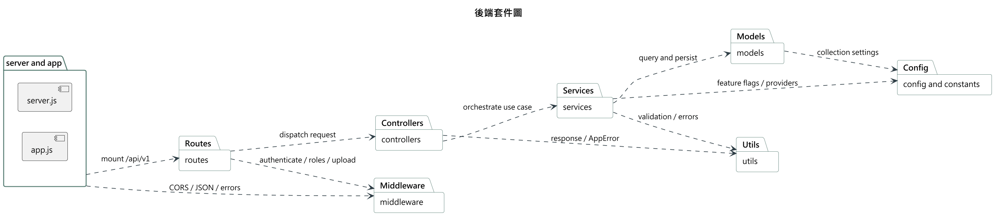

圖7-2-2 後端套件圖

圖7-2-3呈現 Pipeline 的 CLI 入口、持久化 orchestration、媒體／STT、chunk／embedding、publication 與 run artifacts。Parent hierarchy 可產生，但 production retrieval gate 仍須 active data、index／filter 與唯讀 E2E 證據。

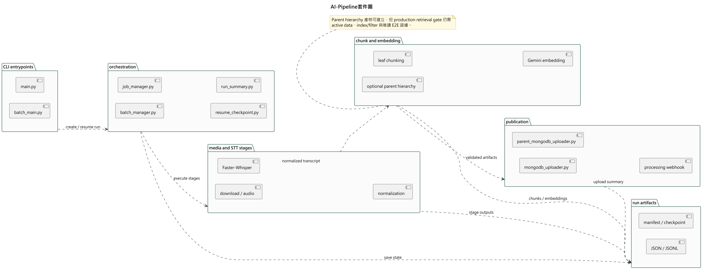

圖7-2-3 AI-Pipeline套件圖

圖7-2-4區分 app-owned Mongoose models、database tools、Pipeline publication、應用 collections 與 Atlas indexes。`setup` 與 legacy scripts 存在不代表可直接對 shared Atlas 執行；實際集合與 index 狀態須唯讀查證。

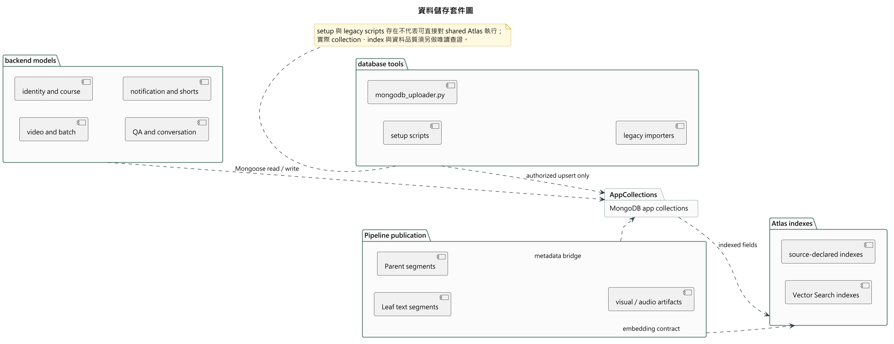

圖7-2-4 資料儲存套件圖

圖7-2-5說明 Web 與 LINE 通道如何共用課程授權、QA、embedding、回答、citation 驗證與問題記錄能力。FAQ cache 命中仍須重驗 citation allowlist；證據不足時回傳 no-answer，而非虛構內容。

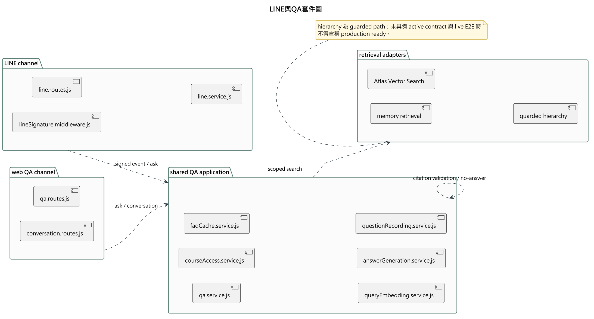

圖7-2-5 LINE與QA套件圖

## 7-3 元件圖（Component diagram）

以下為目前可由程式入口驗證的元件分工與依賴方向。

```text
main.jsx → App.jsx / AdminApp.jsx → DashboardApp → pages → services → api.js
                                                         ↓ HTTPS/JSON
routes → controllers → services → models → MongoDB
                         ├→ Gemini/OpenAI、LINE、YouTube adapters
                         └→ spawn/resume Python Pipeline
Pipeline stages → run artifact/checkpoint → MongoDB uploader → internal webhook
```

表7-3-1　主要元件責任與邊界

| 元件 | 主要責任 | 不應誤解為 |
| --- | --- | --- |
| `frontend/focus-flow/src/main.jsx`、`App.jsx`、`AdminApp.jsx` | 啟動 SPA、還原 session、分離 admin 入口。 | 已採用完整 client-side router。 |
| `DashboardApp.jsx`、pages、`api.js` | 依角色組合 Student／Teacher／Admin 頁面；集中 token header 與 HTTP 錯誤解析。 | 前端自行決定資料權限；權限仍由 API 重驗。 |
| `routes/`、`controllers/`、`services/`、`models/` | URL/middleware、request orchestration、業務規則與 schema 分層。 | controller 可直接任意寫 MongoDB。 |
| QA／citation 元件 | 取得允許範圍、檢索 Leaf segment、產生回答與 citations、記錄結果。 | 每個問題一定回答，或 visual segment 能產生畫面敘述。 |
| 影片／batch／processing 元件 | 單檔與多檔上傳、持久 batch aggregate、狀態轉換、重試與 webhook。 | batch flag 打開即代表所有 Pipeline CLI／外部服務 E2E 已驗收。 |
| Pipeline 元件 | 掃描／下載、音訊處理、STT、正規化、chunk、embedding、artifact validation、publication。 | 本機產物即代表已寫入 shared Atlas，或已可供正式環境 QA 使用。 |

圖7-3-1以 required／provided interfaces 表示 React SPA、Express API、Python AI Pipeline、外部 adapters 與 MongoDB／Atlas 的依賴方向。介面與 adapter 程式存在，仍不等於外部 provider、feature flag 或資料契約已在正式環境 ready。

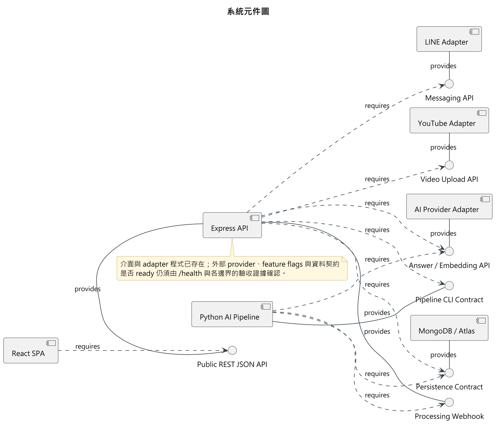

圖7-3-1 系統元件圖

## 7-4 狀態機（State machine）甚至時序圖（Timing diagram）

### 可由程式驗證的狀態與轉換

表7-4-1　主要狀態、事件與實作約束

| 對象 | 狀態／事件 | 實作約束 |
| --- | --- | --- |
| 登入 session | anonymous、authenticated、invalid、unavailable、forbidden | `/auth/me` 驗證 user 仍有效；只有 401／403 清除憑證；network／5xx 保留可能有效的 session。 |
| Course | `draft`、`published`、`archived` | 學生內容存取還需 active Enrollment；僅 published 不是充分條件。 |
| Enrollment | `active`、`revoked` | 唯一 `(studentId, courseId)` 關係可重新啟用並保留稽核資料；無 active record 採 default-deny。 |
| Video processing | `queued → processing → completed` 或 `failed`；`failed → queued` retry | internal start／complete／fail 均檢查合法前態；重送 completed 需保持冪等。 |
| VideoBatch | `creating`、`processing`、`completed`、`partial`、`failed` | 結果由逐檔 upload／processing 狀態彙總；最大十檔。 |
| LINE binding | unbound → token issued → bound → course selected | token 有 TTL；webhook 必須先驗簽。 |

`HIERARCHICAL_RETRIEVAL_ENABLED` 目前預設／部署 gate 為 false。Parent chunk artifact、schema、uploader 和 backend adapter 已存在，但未完成 active Leaf／Parent 資料、index/filter 與 read-only live E2E 的重新驗證前，QA 仍不得把 Parent retrieval 視為已啟用功能。

ShortAsset feed／metadata sync／封存、證據化候選與腳本、教師人工成品上傳／審核，以及通過後的發布與 YouTube 排程已有程式碼，但受 `SHORT_SCRIPT_AUTOMATION_ENABLED` 控制且預設關閉。系統尚不會從來源影片自動剪輯、渲染 9:16 成品或合成字幕；真實 YouTube lifecycle 與 feature-on browser E2E 也未在本階段驗收，不能用單一 `published` 欄位誤稱完整自動短影音產線。

圖7-4-1顯示 session 還原時，401／403 會清除無效憑證；network／5xx 則進入 unavailable 並保留可能有效的 session。一般角色誤進 `/admin` 時進入 forbidden，但不破壞正常入口可用的登入資訊。

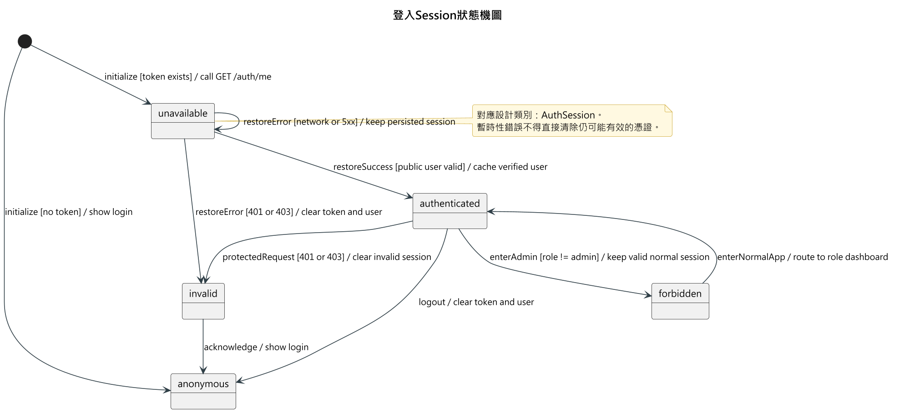

圖7-4-1 登入Session狀態機圖

圖7-4-2顯示 VideoBatch 由 `creating` 建立有序 items，進入 `processing` 後依單項結果彙整為 `completed`、`partial` 或 `failed`；可重試項目回到 processing，既有成功結果不被回滾。

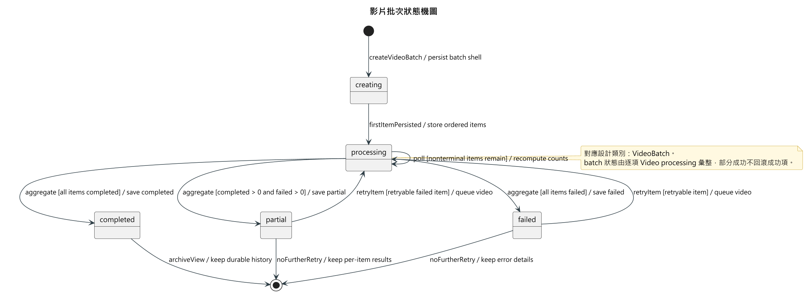

圖7-4-2 影片批次狀態機圖

圖7-4-3顯示單支影片 processing 的合法轉換與冪等重送。start、complete、fail webhook 都驗證前態；`failed → queued` 只在授權且可重試時成立，其他非法轉換回傳 409。

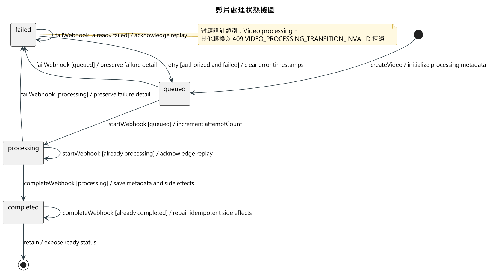

圖7-4-3 影片處理狀態機圖

圖7-4-4把 QA 分為 validating、retrieving、generating、answered、no_match 與 failed。課程 scope、資料 readiness、citation allowlist 與 evidence sufficiency 共同決定是否回答；no_match 是預期的安全結果，不是例外成功。

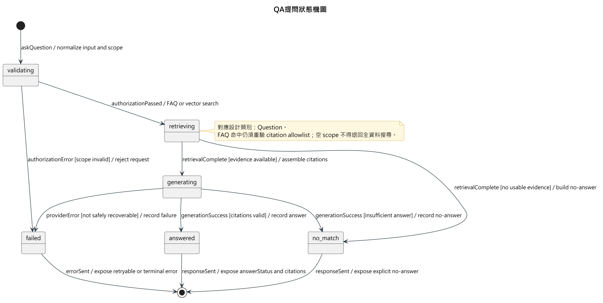

圖7-4-4 QA提問狀態機圖

圖7-4-5顯示 LINE 對話 scope 由綁定 token、有效修課與課程選擇共同形成；Webhook 必須先通過 HMAC-SHA256 簽章，Enrollment 撤銷或 scope 失效時回到無課程狀態。

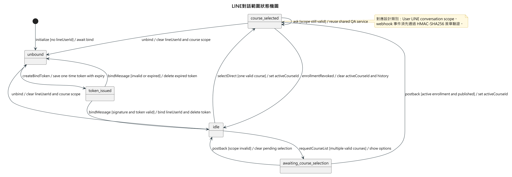

圖7-4-5 LINE對話範圍狀態機圖
