# 第7章 實作模型

> 狀態：初評原稿轉製，待核對現況。
> 原始資料日期：2026-06-02；Markdown 整理日期：2026-09-13。
> 來源：[初評系統手冊 DOCX](../source-documents/專題手冊_初評最終版.docx)，原第7章。

本章重用原稿文字、表格及嵌入圖像；尚未逐圖核對版面、合併儲存格與圖表編號，不代表最新版功能或正式驗收結果。

## 本次整理與待補

TODO：更新佈署、套件、元件與狀態機圖，納入目前批次／重試與完成後 YouTube 上傳流程。原稿圖不代表正式環境已驗收。

補充現況來源（尚待逐項套用）：[維運入口](../../../40_Operations/README.md)、[Pipeline README](../../../../STT_Whisper/README.md)。

[返回手冊索引](../README.md)

---

## 7-1 佈署圖（Deployment diagram）

圖7-11為本系統的佈署圖，分為客戶端、外部平台、校內伺服器與資料/AI服務四層。使用者透過瀏覽器（React19+ViteSPA）或LINE App進入系統：網頁請求由Nginx（port80）作為對外入口接收，再以/api/*Reverse Proxy轉送至Rocky Linux虛擬機（140.131.115.105）上以PM2常駐的Node.js/Express後端（port4000），處理JWT驗證、課程影片管理與QA問答；LINE Webhook則透過ngrok HTTPS Tunnel轉入同一後端。影片建立後由AI Pipeline Runtime執行Faster-Whisper STT、分段與Gemini Embedding，並將片段寫入MongoDB Atlas；QA問答則由後端呼叫Gemini API生成答案。GitHub Repository於push to main時觸發self-hosted GitHub Actions Runner，自動執行git pull、build與pm2restart完成持續部署。[1]

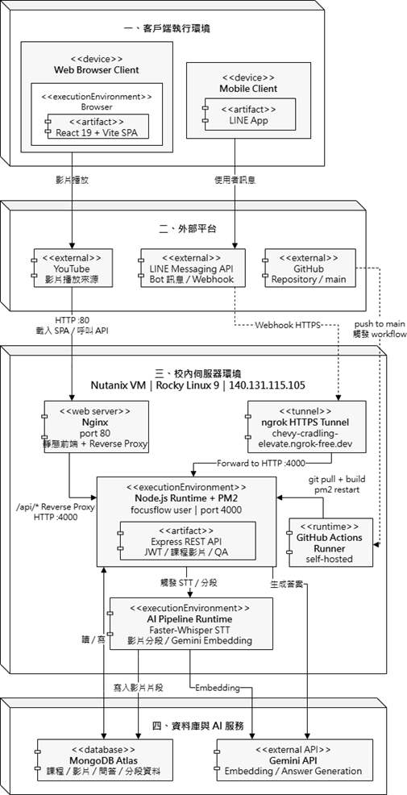

圖7-11佈署圖

## 7-2 套件圖（Package diagram）[1]

圖7-21為本系統前端介面所使用的套件圖。React（19.2.4）為前端主要UI框架，Vite（8.0.4）負責開發伺服器與前端建置流程；three（0.183.2）與GSAP（3.14.2）用於登入頁與互動場景的視覺效果；qrcode.react（4.2.0）則用於產生LINE綁定QR Code。透過這些套件，系統能提供教師、學生與管理員三種角色介面，並支援影片播放、課程管理、問答與LINE綁定流程。

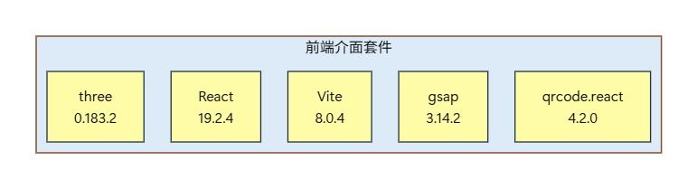

圖7-21套件圖-前端介面

圖7-22為本系統Web API服務所使用的套件圖。Express（4.19.2）為主要後端框架，用於建立RESTful API；Mongoose（8.13.2）負責MongoDB Schema、索引與資料存取；jsonwebtoken（9.0.2）用於JWT登入驗證與角色權限控管；multer（2.0.0）負責教師上傳本機影片檔案；swagger-ui-express（5.0.1）則提供API文件介面。透過這些套件的整合，後端能支援登入註冊、課程影片管理、QA提問、LINE Webhook、統計與後台管理功能。

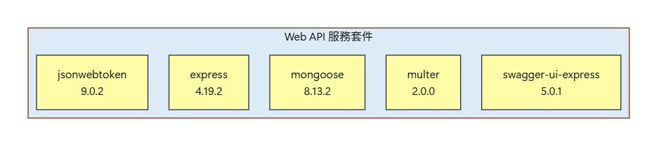

圖7-22套件圖-Web API服務

圖7-23為本系統AI影片處理流程所使用的套件圖。faster-whisper（>=1.1.0）負責將影片音訊轉換為逐字稿；yt-dlp（>=2026.3.17）用於下載YouTube影片音訊；imageio-ffmpeg（>=0.5.1）支援音訊抽取與媒體處理；rapidfuzz（>=3.13.0）用於專有名詞與逐字稿修正；google-genai（>=1.0.0）負責Gemini Embedding與多模態處理；numpy（>=1.26.4）則支援向量與數值運算。這些套件共同完成影片轉文字、分段、向量化與後續問答檢索所需的資料準備。

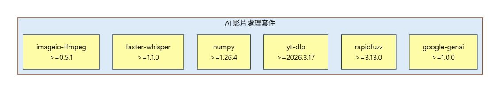

圖7-23套件圖-AI影片處理

圖7-24為本系統資料儲存與管理所使用的套件圖。後端透過mongodb（7.1.1）與Mongoose models連接MongoDB，管理users、courses、videos、questions、usage_logs與video_segments_text等資料；AI Pipeline則透過pymongo（>=4.11.0）將逐字稿、分段與embedding寫入資料庫。系統設計上支援MongoDB Atlas Vector Search作為向量檢索來源，也可依環境設定切換至memory模式進行本機檢索，以支援開發測試與展示環境。.

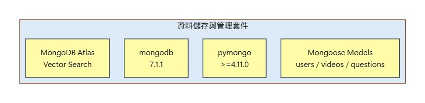

圖7-24套件圖-資料儲存與管理

圖7-25為本系統LINE整合與QA問答所使用的套件圖。LINE Messaging API用於接收學生訊息、課程選擇post back與回覆答案；Node.js fetch負責後端呼叫LINE Reply API；Gemini2.5Flash用於依據檢索片段產生grounded answer；gemini-embedding產生3072維query embedding，與影片片段embedding進行語意比對；questions與usage_logs則記錄學生提問、答案、命中片段、runtime訊號與使用行為。透過這些套件與服務的整合，學生可在網頁或LINE Bot中取得含影片時間戳的回答。

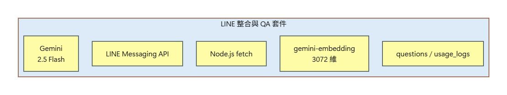

圖7-25套件圖-LINE整合與QA

## 7-3 元件圖（Component diagram）

圖7-31為FocusFlow系統的元件圖，說明各功能模組的組成與層級關係。以「登入」為核心，使用者進入系統後會依照角色分流至學生、教師或管理員介面。使用者管理包含帳號註冊、JWT驗證、個人資料與角色權限控管；課程與影片管理包含課程CRUD、影片上傳、YouTube URL建立、影片播放、觀看進度與處理狀態；問答與外部互動包含提問API、片段檢索、答案生成、提問紀錄、LINE綁定、課程切換與LINE提問回覆。AI Pipeline則負責Faster-Whisper STT、文字分段、Gemini Embedding與MongoDB寫入。[1]

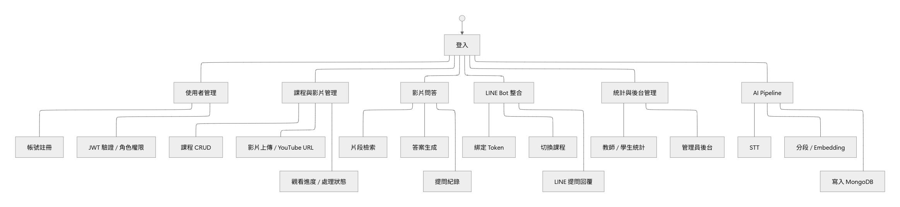

圖7-31元件圖

## 7-4 狀態機（State machine）或時序圖（Timing diagram）[1]

圖7-41為登入流程的狀態機，描述使用者從開啟登入頁、輸入Email與密碼，到系統驗證帳密並導向角色頁面的流程。若驗證成功，後端會回傳JWT，前端依使用者角色進入學生、教師或管理員頁面；若驗證失敗，系統會顯示錯誤訊息並回到輸入狀態，讓使用者重新嘗試。

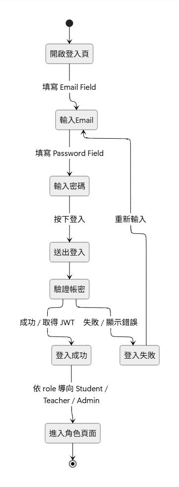

圖7-41狀態機-登入

圖7-42為帳號註冊流程的狀態機，描述使用者從開啟註冊頁、輸入姓名、Email、角色、密碼與確認密碼，到送出資料後由後端驗證與建立帳號的流程。若資料驗證成功，系統會儲存使用者資料並回傳JWT，使使用者完成註冊後直接登入；若欄位缺漏、Email重複或密碼不一致，系統會顯示錯誤訊息並返回註冊頁讓使用者修正。

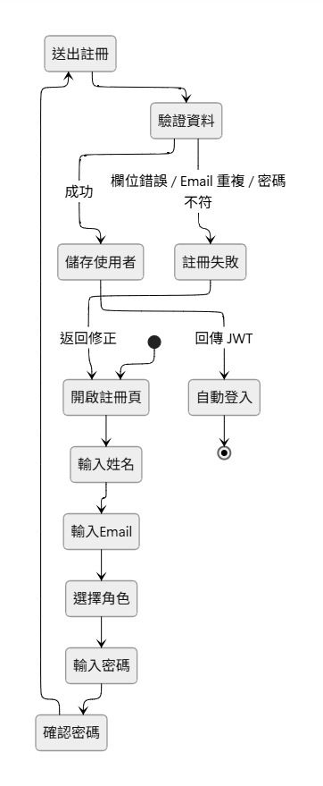

圖7-42狀態機-帳號註冊

圖7-43為影片處理流程的狀態機，描述教師建立本機影片或YouTube URL後，影片從queued進入processing，再由AI Pipeline完成STT、分段、embedding與MongoDB寫入的流程。若處理成功，狀態會轉為completed，學生即可在課程中提問並取得時間戳答案；若啟動失敗、STT失敗、Gemini Embedding失敗或資料庫寫入失敗，狀態會轉為failed，教師或管理員可執行retry重新排入queued。

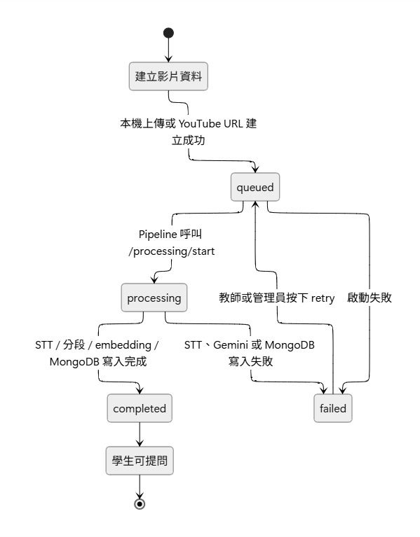

圖7-43狀態機-影片處理流程

圖7-44為學生提問與QA回答流程的狀態機，描述學生從網頁或LINE Bot輸入問題後，系統驗證登入狀態與課程權限，建立可搜尋範圍，再產生query embedding並搜尋相關影片片段。若找到可用片段，系統會使用Gemini依據片段生成答案；若沒有足夠資料，則回傳保守提示或無資料訊息。最後系統會將問題、答案、命中片段與runtime訊號寫入questions與usage_logs，並在前端或LINE中顯示答案與影片時間戳。

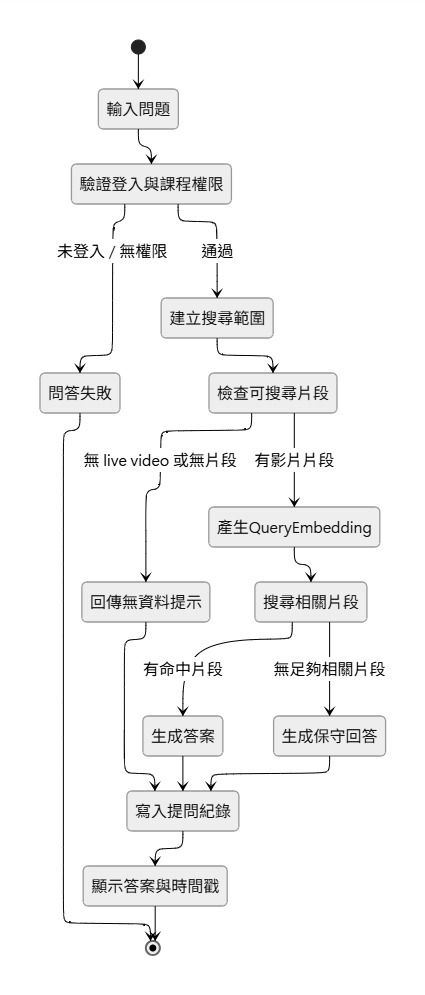

圖7-44狀態機-學生提問與QA回答

圖7-45為LINE Bot對話流程的狀態機，描述學生從尚未綁定LINE帳號開始，透過一次性綁定碼完成帳號連結，接著輸入「切換課程」並選擇可提問課程的流程。當學生已選定課程後，一般文字訊息會被視為課程問題並呼叫QA服務；若QA成功，LINE Bot會回覆答案與影片時間戳連結，若runtime設定或外部服務失敗，則回覆錯誤提示並保持在已選課程狀態，等待下一次操作。

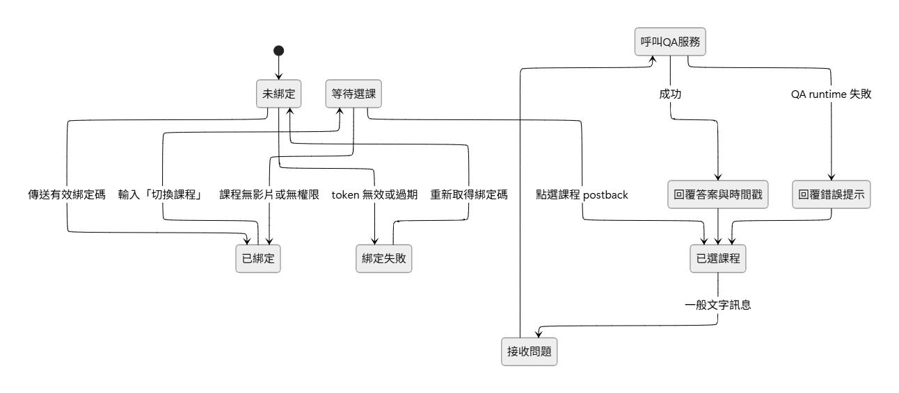

圖7-45狀態機-LINE Bot對話流程
