# 第7章 實作模型

## 7-1 佈署圖（Deployment diagram）

FocusFlow 由四個可獨立啟動的部分構成：在瀏覽器中執行的 React SPA、以 PM2 常駐的 Node.js／Express API、由 API 以子程序啟動的 Python AI Pipeline，以及外部受管的 MongoDB Atlas。瀏覽器與 LINE 都不直接讀寫資料庫；課程權限、影片管理與問答請求一律先進入 API，由 API 驗證身分與授權後再存取資料或呼叫外部服務。外部服務的憑證、Atlas 索引與正式主機的連線狀態屬執行環境事實，本章列出 2026-09-26 對正式環境的實測結果；環境設定會隨部署變動，實際狀態以 `/health` 端點為準。

表7-1-1　部署層級、用途與驗收邊界

| 層級 | 節點與 artifact | 用途 | 執行環境狀態 |
| --- | --- | --- | --- |
| 使用者裝置 | 網頁瀏覽器（React SPA）、LINE App | 學生、教師與管理員操作介面；學生亦可由 LINE 提問 | — |
| 外部平台 | LINE Platform、YouTube、GitHub | LINE 訊息轉送與回覆、影片嵌入播放與自動上傳、原始碼與部署工作來源 | 2026-09-26 `/health`：LINE 回覆流程與 Webhook 簽章驗證均為 ready；YouTube OAuth 憑證檢查通過，具 `youtube.force-ssl` 權限 |
| 校內虛擬機 | Nginx（`dist` 靜態檔、443 TLS 與 `/api/` 反向代理）、PM2（`focusflow-backend`）、Python 虛擬環境（`main.py`／`batch_main.py`）、`backend/uploads`、`ngrok.service`、GitHub Actions self-hosted runner | 提供網站與 API、執行語音辨識與向量化、暫存上傳影片、轉送 LINE webhook、自動部署 | Python 虛擬環境與語音模型為主機內部狀態，`/health` 不檢查 |
| 資料與 AI 服務 | MongoDB Atlas（含 Atlas Vector Search）、Gemini API、SMTP 郵件服務 | 儲存應用資料與影片片段、向量檢索、embedding 與回答生成、忘記密碼驗證信 | 2026-09-26：Atlas 三個向量索引均為 READY；Gemini 金鑰已設定；寄信帳號 `/health` 不檢查 |

如圖7-1-1所示，佈署圖由上而下分為使用者裝置、外部平台、校內虛擬機、資料與 AI 服務四層。

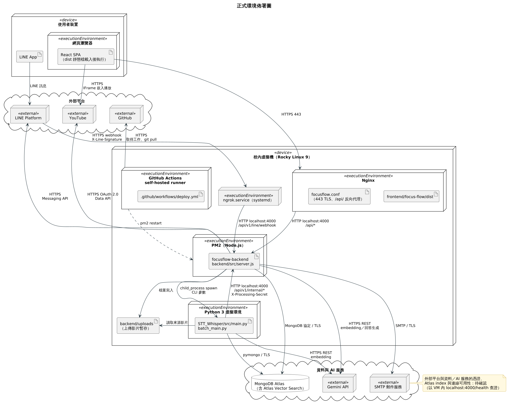

圖7-1-1 正式環境佈署圖

判讀重點如下：

- **網頁請求路徑**：瀏覽器以 HTTPS 443 連到 Nginx，Nginx 直接回應 `frontend/focus-flow/dist` 靜態檔，並把 `/api/` 開頭的請求轉給本機 `localhost:4000` 上的 `focusflow-backend`。學生觀看影片時，瀏覽器另以 YouTube IFrame 直接向 YouTube 取得串流，不經過 FocusFlow 主機。
- **LINE 路徑**：LINE Platform 把使用者訊息以 HTTPS webhook（附 `X-Line-Signature`）送到 `ngrok.service` 的公開通道，再轉到本機 4000 埠的 `/api/v1/line/webhook`，不經過 Nginx 的 443；後端回覆時再以 HTTPS 呼叫 LINE Messaging API。通道網址屬部署變動項，不列入圖中。
- **短影音生成端**：ComfyUI 與 MiniMax H3 執行於教授主機，屬校內外部的地端元件，不在圖7-1-1 的 FocusFlow 佈署範圍內，已可運作；FocusFlow 目前沒有呼叫 ComfyUI 的程式碼，腳本與成品都由教師人工搬運（複製腳本、上傳成品）。系統串接規劃中：由教授主機上的小程式主動領取工作，再呼叫本機 ComfyUI 的 HTTP API，且只有一台 GPU，工作需排隊。
- **影片處理路徑**：API 收到上傳影片後寫入 `backend/uploads`，再以 `child_process.spawn` 啟動 `STT_Whisper/src/main.py`（多影片批次為 `batch_main.py`）。Pipeline 讀取來源影片、呼叫 Gemini 產生 embedding、以 pymongo 把片段寫入 Atlas，處理的開始、完成與失敗則以 HTTP 呼叫本機 `/api/v1/internal/*`，並以 `X-Processing-Secret` 驗證身分。
- **外部服務**：API 以 MongoDB 協定（TLS）存取 Atlas，以 HTTPS 呼叫 Gemini（回答生成可依設定切換為 OpenAI）、LINE 與 YouTube Data API（OAuth 2.0），以 SMTP 寄送驗證信。
- **自動部署**：`.github/workflows/deploy.yml` 定義 push 到 `main` 後，由虛擬機上的 self-hosted runner 取得工作，在 `/opt/focusflow` 執行 `git pull`、安裝後端相依套件、建置前端、以 `restorecon` 修正 SELinux context，接著 `pm2 restart focusflow-backend` 並 `systemctl reload nginx`；最後在主機內檢查 `/health` 的問答就緒狀態與 Nginx 的 API 代理。
- **對外連接埠**：依部署紀錄，對外僅 443 提供 HTTPS，80 埠由學校防火牆阻擋，Nginx 的 80 轉址只在主機內部生效；HTTPS 憑證由 acme.sh 以 TLS-ALPN-01 簽發並自動續約。2026-09-26 從校外實測：443 可連線並提供 Let's Encrypt 憑證（效期至 2026-12-09），HTTP 80 連線逾時無回應，並回應 HSTS 等安全標頭；非白名單來源的 CORS 預檢不回 `Access-Control-Allow-Origin`。憑證首次自動續約尚未發生，預計於 2026-11 中旬前後。

文件不記錄 IP、token、連線字串或其他環境秘密。

## 7-2 套件圖（Package diagram）

套件圖回答「程式如何分群、誰依賴誰」。本節依責任把 FocusFlow 拆成五張圖：前端、後端、AI Pipeline、資料儲存，以及跨越 Web 與 LINE 兩個通道的問答程式。每張圖外框是實際目錄，內部套件以責任分群並列出代表檔案；虛線箭頭由依賴者指向被依賴者，箭頭文字說明依賴原因。第三方函式庫以 `«library»` 標示，圖中只列名稱；各套件的宣告版本統一列於第 9 章 9-2-3，本章不重複。

圖7-2-1 說明前端如何由網址入口一路分派到頁面與 API 呼叫。分群依邏輯責任劃分；其中 `DashboardApp.jsx` 實體位於 `components/`，但負責依角色組合頁面，因此歸入應用殼層。

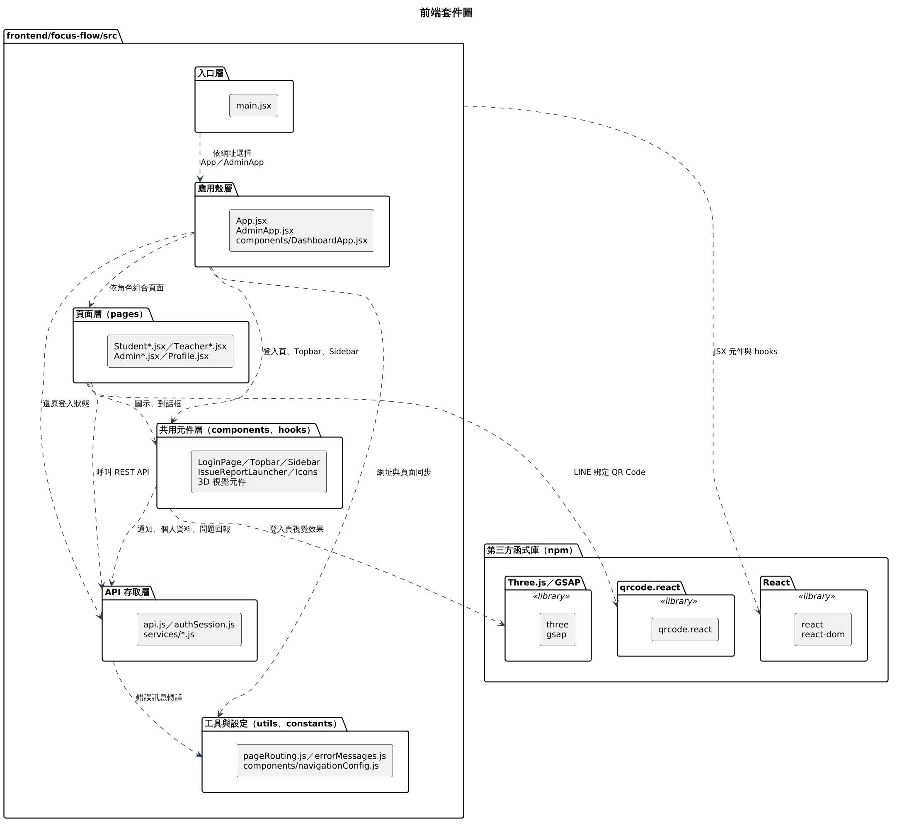

圖7-2-1 前端套件圖

`main.jsx` 依網址把 `/admin` 導向 `AdminApp.jsx`，其他路徑導向 `App.jsx`；應用殼層透過 `authSession.js` 還原登入狀態、以 `pageRouting.js` 同步網址，並由 `DashboardApp.jsx` 依角色組合學生、教師或管理員頁面。頁面與共用元件都只經由 API 存取層（`api.js`、`authSession.js` 與 `services/*.js`）呼叫後端，`api.js` 統一附加 JWT 並透過 `errorMessages.js` 把錯誤碼轉成中文訊息。前端只負責導覽與呈現，資料權限一律由後端重新驗證。

圖7-2-2 說明後端以 `backend/src` 的實體目錄分群，並標出分層規則的例外依賴。

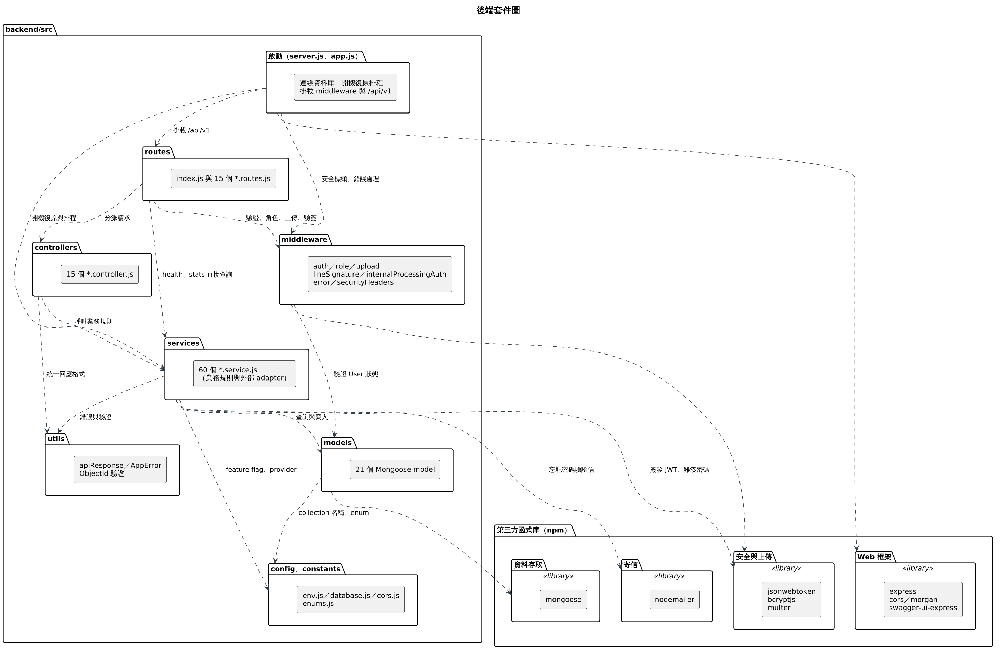

圖7-2-2 後端套件圖

主要依賴方向為 routes → controllers → services → models：routes 掛上 middleware 做身分驗證、角色授權、上傳限制與 webhook 驗簽，controllers 只負責解析請求與回應格式，業務規則與外部 API adapter 集中在 services，models 定義 Mongoose schema。圖中另標出三個例外：`health` 與 `stats` 兩個 route 直接呼叫 service、`authenticate` middleware 直接讀取 User model 確認帳號仍為啟用，以及啟動程式在開機時直接呼叫 service 復原排隊中的影片處理與啟動排程。

圖7-2-3 說明 AI Pipeline 依處理責任分成六群模組，由 CLI 入口串接各階段。

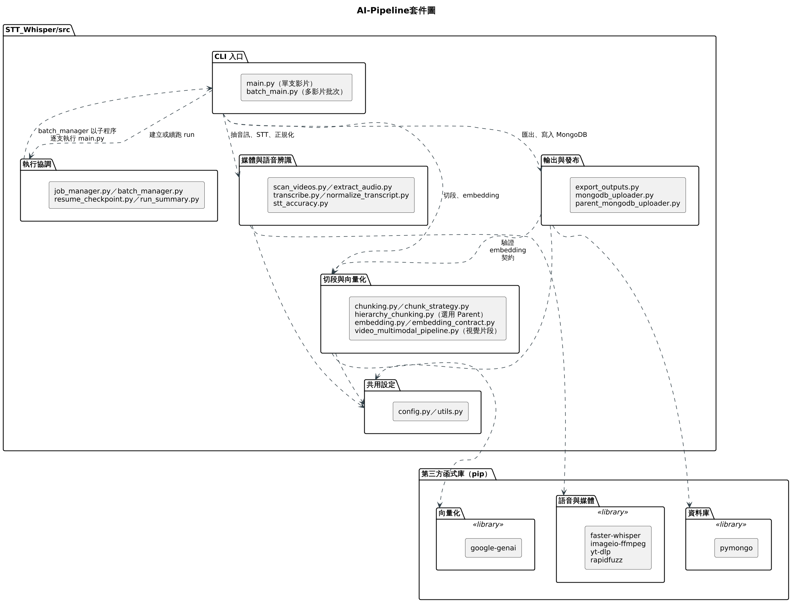

圖7-2-3 AI-Pipeline套件圖

`main.py` 處理單支影片：先由媒體與語音辨識模組抽取音訊、執行 Faster-Whisper 並正規化逐字稿，再交給切段與向量化模組產生 Leaf 片段、選用的 Parent 階層與 Gemini embedding，最後由輸出與發布模組匯出檔案並寫入 MongoDB；每個階段的進度由執行協調模組記錄 checkpoint，中斷後可續跑。`batch_main.py` 則由 `batch_manager.py` 以子程序逐支呼叫 `main.py`，因此執行協調與 CLI 入口之間存在雙向依賴。`main.py` 另以 HTTP 呼叫後端的 internal processing webhook 回報開始、完成與失敗（見圖7-4-3）。Parent 階層與其 embedding 是否產生由 `HIERARCHY_ENABLED` 控制，預設關閉。

圖7-2-4 說明哪些程式讀寫哪些資料集合，以及向量索引建立在哪裡。

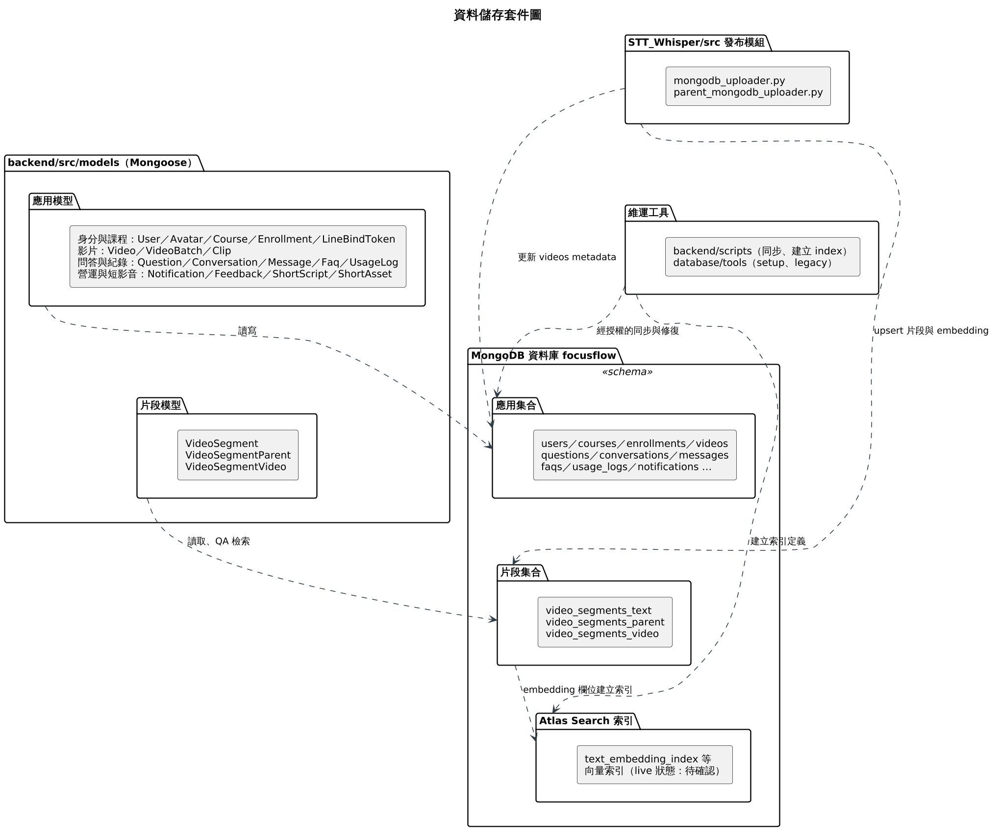

圖7-2-4 資料儲存套件圖

後端的應用模型讀寫使用者、課程、修課、影片、問答、通知與短影音等應用集合；片段模型則以讀取為主，供 QA 檢索使用。影片片段與 embedding 由 Pipeline 的發布模組 upsert 到 `video_segments_text` 等片段集合，並更新 `videos` 的處理 metadata。`backend/scripts` 與 `database/tools` 屬維運工具，用於同步資料、建立集合與索引；對共享 Atlas 執行前須先以唯讀查詢確認目標。向量索引（如 `text_embedding_index`）建立在片段集合的 embedding 欄位上，2026-09-26 實查三個向量索引均為 READY（見表8-2-29）。

圖7-2-5 說明網頁與 LINE 兩個提問通道如何共用同一套問答程式。

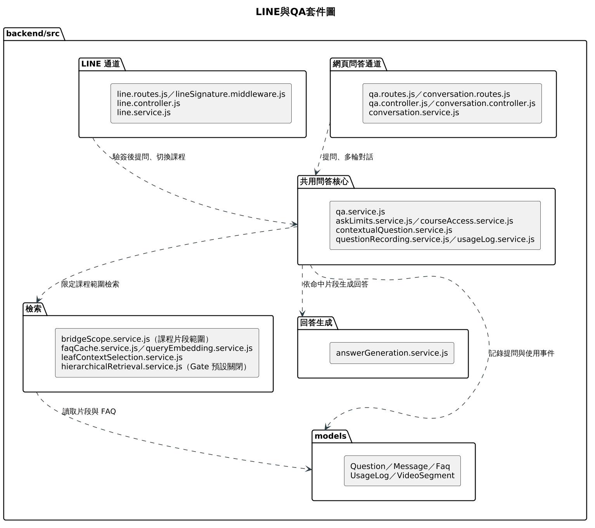

圖7-2-5 LINE與QA套件圖

網頁通道由 `qa.routes.js` 與 `conversation.routes.js` 進入，LINE 通道由 `line.routes.js` 進入並先經 `lineSignature.middleware.js` 驗簽；兩者都呼叫共用問答核心的 `qa.service.js`，並共用字數上限、每日提問次數與課程存取檢查。問答核心再依賴檢索套件取得課程範圍內的片段（含 FAQ 快取與 query embedding），交給回答生成套件產生答案，最後把提問與使用事件寫入 `questions` 與 `usage_logs`。FAQ 快取命中時仍會重新驗證引用片段是否仍在課程範圍內；課程範圍為空時不會退回搜尋全部資料。Parent 階層式檢索由 `HIERARCHICAL_RETRIEVAL_ENABLED` 控制，預設關閉，此時只使用 Leaf 片段。

表7-2-1 整理五張套件圖中出現的第三方函式庫，說明各自在 FocusFlow 中的用途，以及由哪個套件依賴。

表7-2-1　主要套件與其在 FocusFlow 中的用途

| 區域 | 函式庫 | 依賴它的套件（圖） | 在 FocusFlow 中的用途 |
| --- | --- | --- | --- |
| 前端 | react、react-dom | 整個 `frontend/focus-flow/src`（圖7-2-1） | 三角色 SPA 的元件與狀態管理 |
| 前端 | vite（開發工具） | 建置流程，不在執行期依賴中 | 開發伺服器與 production build，產出由 Nginx 提供的 `dist` |
| 前端 | three、gsap | 共用元件層（圖7-2-1） | 登入與首頁的 3D 背景與動畫效果 |
| 前端 | qrcode.react | 頁面層（圖7-2-1） | 產生 LINE 綁定 QR Code |
| 後端 | express、cors、morgan、swagger-ui-express | 啟動（圖7-2-2） | REST 路由、跨來源白名單、請求紀錄與 `/docs` API 文件 |
| 後端 | jsonwebtoken、bcryptjs、multer | middleware、services（圖7-2-2） | JWT 簽發與驗證、密碼雜湊、影片／頭貼／截圖的 multipart 上傳 |
| 後端 | mongoose | models（圖7-2-2） | schema 定義與資料存取；原生 `mongodb` driver 只用於同步、建立索引等維運腳本 |
| 後端 | nodemailer | services（圖7-2-2） | 忘記密碼驗證信 |
| AI Pipeline | faster-whisper、imageio-ffmpeg、yt-dlp、rapidfuzz | 媒體與語音辨識（圖7-2-3） | 語音辨識、音訊抽取、YouTube 音訊下載、專有名詞正規化 |
| AI Pipeline | google-genai | 切段與向量化（圖7-2-3） | 文字片段與視覺片段的 embedding |
| AI Pipeline | pymongo | 輸出與發布（圖7-2-3） | 把片段與 embedding upsert 到 MongoDB |

### 向量化流程與參數調整

FocusFlow 能回答「影片裡講了什麼」，前提是先把影片內容轉成電腦可以比對的形式。本小節說明三件事：一支影片如何變成可檢索的資料、學生提問時系統如何找出相關片段，以及開發過程中為了回答品質調整過哪些參數。

先說明幾個名詞：

- **片段（chunk）**：把整支影片的逐字稿切成數十字、十幾秒長的小段，每段記錄文字與在影片中的起訖秒數。片段是檢索與引用的最小單位，學生點選引用時，影片會跳到該片段的起點。
- **向量（embedding）**：由 AI 模型把一段文字轉成一串數字（本系統為 3072 個數字）。意思相近的文字，轉出的數字串在方向上也相近，因此可以用數學方法比較兩段文字的語意是否接近。
- **向量索引**：MongoDB Atlas（本系統使用的雲端資料庫服務）提供的功能，能在大量向量中快速找出與問題最接近的幾筆。
- **提示詞（prompt）**：系統交給回答生成模型的指示與資料，其中包含檢索到的片段。

圖7-2-6 左右兩欄分別是兩段流程：右側是影片上傳後，由 AI Pipeline 執行一次的「建立索引」；左側是學生每次提問時，由後端執行的「查詢」。兩者透過 Atlas 的向量索引銜接。此圖為資料流程示意，不屬於 UML 圖種。

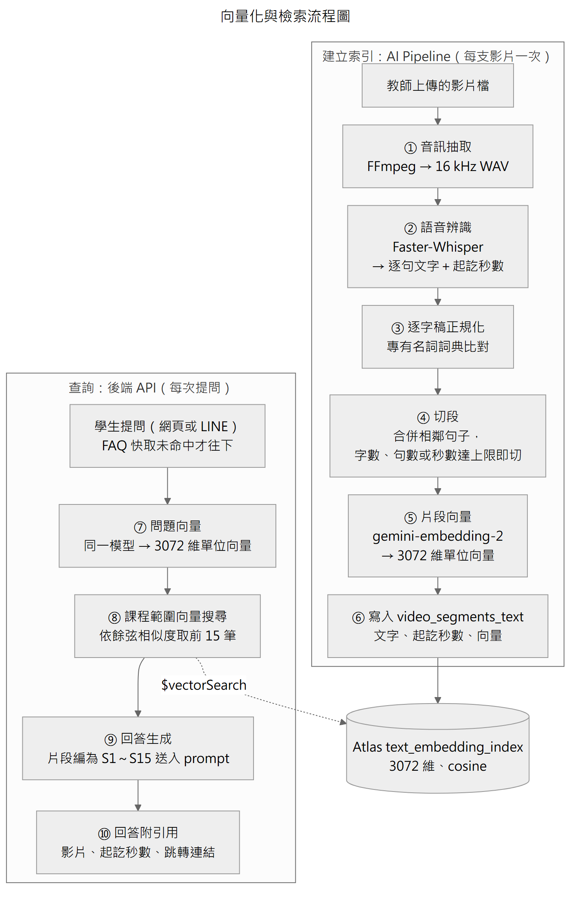

圖7-2-6 向量化與檢索流程圖

表7-2-2 逐步說明圖7-2-6 各步驟的處理內容與負責程式。

表7-2-2　向量化與檢索各步驟

| 步驟 | 處理內容 | 輸入 → 輸出 | 負責程式 |
| --- | --- | --- | --- |
| ① 音訊抽取 | 從影片檔取出聲音，轉成語音辨識模型需要的格式 | 影片檔 → 16 kHz 音訊檔 | `extract_audio.py` |
| ② 語音辨識 | 以 Faster-Whisper 模型把語音轉成文字，每一句都帶有開始與結束秒數，這是日後「跳到影片時間點」的來源 | 音訊檔 → 逐句文字與秒數 | `transcribe.py` |
| ③ 逐字稿正規化 | 依專有名詞詞典修正辨識錯誤的術語（例如把相近的錯字改回正確的課程用語） | 逐句文字 → 修正後的逐句文字 | `normalize_transcript.py` |
| ④ 切段 | 依時間順序合併相鄰的句子，只要再加一句就會超過字數、句數或秒數上限，就切成一個新片段；一句話不會被切開 | 逐句文字 → 片段 | `chunking.py` |
| ⑤ 片段向量 | 以 Google 的 `gemini-embedding-2` 模型把每個片段轉成 3072 維向量，再調整成長度為 1 的單位向量 | 片段文字 → 向量 | `embedding.py` |
| ⑥ 寫入資料庫 | 把片段文字、起訖秒數與向量存入資料庫，完成後才通知後端「處理完成」（圖6-1-3b） | 片段與向量 → 資料庫紀錄 | `mongodb_uploader.py` |
| ⑦ 問題向量 | 以同一個模型把學生的問題轉成 3072 維單位向量 | 問題文字 → 向量 | `queryEmbedding.service.js` |
| ⑧ 課程範圍向量搜尋 | 只在該學生有權限的課程影片中搜尋，依餘弦相似度（計算方式見本小節後段）由高到低取前 15 筆片段 | 問題向量 → 15 個片段 | `qa.service.js` |
| ⑨ 回答生成 | 把 15 個片段依序編號為 S1～S15 放進提示詞，生成模型必須依片段作答，並回報實際採用了哪些編號 | 片段 → 答案與採用的片段 | `answerGeneration.service.js` |
| ⑩ 回答附引用 | 每個採用的片段顯示為一張引用卡，註明影片與時間，點選後影片跳到該片段 | 採用的片段 → 引用卡 | `qa.service.js`、前端課程頁 |

片段與問題雖然使用同一個模型，但送入模型時加上不同的前置說明（片段標為「文件內容」、問題標為「搜尋查詢」），這是 `gemini-embedding-2` 為檢索用途建議的用法。此外，學生提問時系統會先查詢常見問題快取（FAQ 快取，見圖6-1-4c）：與過去問題的文字完全相同，或問題向量的相似度達 0.95 以上，就直接沿用先前的答案，不再執行 ⑧、⑨。

#### 參數設定

AI Pipeline 的參數會直接影響辨識品質與片段長度。表7-2-3 列出主要參數在三種情況下的值：程式的預設值、正式環境主機的設定，以及資料庫中既有片段在處理時使用的設定。

表7-2-3　AI Pipeline 主要參數

| 參數 | 程式預設值 | 正式環境主機 | 既有片段的處理設定（開發用電腦） |
| --- | --- | --- | --- |
| 語音辨識模型大小 | small | small | tiny |
| 運算裝置與數值精度 | CPU、int8 | CPU、int8 | CPU、int8 |
| 辨識語言 | 自動偵測 | 中文 | 中文 |
| 辨識時保留的候選數（beam size） | 5 | 5 | 1 |
| 略過無語音區段（VAD） | 開 | 開 | 開 |
| 每個片段的字數上限 | 220 字 | 220 字 | 120 字 |
| 每個片段的句數上限 | 6 句 | 6 句 | 4 句 |
| 每個片段的時長上限 | 45 秒 | 45 秒 | 20 秒 |
| 相鄰片段重疊的句數 | 0 | 0 | 0 |
| 向量模型與維度 | gemini-embedding-2、3072 維 | 同左 | 同左 |

語音辨識模型有 tiny、small 等不同大小，模型越大辨識越準確，但在 CPU 上處理越慢；beam size 是辨識時同時比較的候選句數，數值越大結果越穩定、也越慢。

兩種設定不同的原因是：資料庫中大部分既有片段，是團隊在開發用電腦上處理後上傳的，當時使用較小的 tiny 模型、beam size 1 與較短的片段上限；正式環境主機則沿用程式預設值。片段較短時，每個向量代表的內容較集中，但單一片段不一定足以回答問題，因此系統一次取 15 個片段送入提示詞（見表7-2-5）。目前尚未用同一批影片比較兩種設定的回答品質，因此無法斷定哪一種較佳。

表7-2-4 是 2026 年 9 月底資料庫中片段的統計。

表7-2-4　資料庫中的影片片段統計（2026 年 9 月）

| 項目 | 結果 |
| --- | --- |
| 片段數 | 938 個，來自 22 支影片，分屬「AI入門基礎課」（6 支影片、694 個片段）與「影片處理工具 - OpenCV」（16 支影片、244 個片段）兩門課 |
| 每個片段的字數 | 中位數 54 字，最少 2 字，最多 144 字 |
| 每個片段的時長 | 中位數 13.5 秒；只有 2 個片段超過 60 秒，原因是該句前後有長時間沒有說話，而一句話不會被切開 |
| 向量 | 每個片段一個 3072 維單位向量 |

「AI入門基礎課」的片段是在片段與問題改用不同前置說明（見表7-2-5 的 2026-08-08 調整）之前產生的：使用同一個模型、可以正常比對，但片段未加前置說明。若依現行做法重新產生，兩門課的處理方式即可一致。

#### 參數調整紀錄

表7-2-5 依時間列出開發過程中與檢索、回答品質有關的調整。

表7-2-5　檢索與回答參數調整紀錄

| 日期 | 調整內容 | 原因 | 效果 |
| --- | --- | --- | --- |
| 2026-07-13 | 新增常見問題快取：文字完全相同，或問題向量相似度達 0.95 以上，直接沿用先前的答案 | 同樣的問題不必每次重新搜尋與生成 | 命中時不需呼叫生成模型，回應較快、成本較低 |
| 2026-07-20 | 新增「相鄰片段重疊」選項，可讓前後片段共用 1～2 句 | 避免一句關鍵的話剛好被切在兩個片段之間 | 目前設為 0（不重疊），保留作為日後調整手段 |
| 2026-07-25 | 送入提示詞的片段數由 3 個提高為 15 個 | 只取 3 個片段時，整門課只有約 166 字進入提示詞（全課程逐字稿約 6,700 字），需要綜合多個片段的問題一律被回答「目前資料庫片段不足以回答這個問題。」 | 模型能取得足夠內容，可回答跨片段、跨影片的問題 |
| 2026-07-25 | 「答不出來」的回覆不存入常見問題快取 | 避免一次答不出來後，同一個問題永遠得到同樣的拒答 | 資料補齊後，同一個問題可以重新回答 |
| 2026-08-08 | 向量模型由預覽版改為正式版 `gemini-embedding-2`，片段與問題改用不同的前置說明，並一律調整為單位向量 | 預覽版與正式版的向量即使維度相同，也不能互相比較；系統須確保片段與問題使用完全相同的規則 | 後端的系統狀態檢查會逐項比對模型、維度與處理規則，不一致即標示為無法提供問答服務 |
| 2026-08-30 | 修改生成規則：只有在所有片段都沒有提到問題的主題時，才回覆「目前資料庫片段不足以回答這個問題。」 | 原本的規則讓模型在片段只講到一部分時也整題拒答 | 片段部分相關時，改為就現有內容回答 |
| 2026-09-09 | 「影片處理工具 - OpenCV」課程的片段依正式版規則重新產生向量 | 讓試用課程的片段與問題使用相同規則 | 試用課程的檢索依據一致 |
| 2026-09-24 | 程式預設的片段數也改為 15 個 | 原本只在設定檔中設為 15，未提供設定檔的環境仍取 3 個 | 各環境行為一致 |

#### 餘弦相似度如何計算

評審所問的「特徵值」，在本系統中就是步驟 ⑤、⑦ 產生的向量：由 `gemini-embedding-2` 模型把逐字稿片段或學生問題轉成的 3072 個數字，代表這段文字的語意。這些數字由模型產生，不是人工設計的特徵（例如關鍵字出現次數），也不是從影片畫面擷取的特徵；目前問答只比對文字的向量。

設問題向量為 $\mathbf{q}$、片段向量為 $\mathbf{d}$，兩者的餘弦相似度為兩向量夾角的餘弦值，如式7-2-1：

$$
\cos(\mathbf{q},\mathbf{d})=\frac{\mathbf{q}\cdot\mathbf{d}}{\lVert\mathbf{q}\rVert\,\lVert\mathbf{d}\rVert}=\frac{\sum_{i=1}^{3072} q_i d_i}{\sqrt{\sum_{i=1}^{3072} q_i^{2}}\;\sqrt{\sum_{i=1}^{3072} d_i^{2}}}
$$

式7-2-1 餘弦相似度

其中 $q_i$、$d_i$ 分別是兩個向量的第 $i$ 個數字。結果介於 $-1$ 與 $1$ 之間，越接近 1 代表兩段文字的語意越接近。由於步驟 ⑤、⑦ 已把向量調整為長度 1，式7-2-1 的分母等於 1，計算可簡化為兩向量對應數字相乘後加總，如式7-2-2：

$$
\lVert\mathbf{q}\rVert=\lVert\mathbf{d}\rVert=1\;\Rightarrow\;\cos(\mathbf{q},\mathbf{d})=\mathbf{q}\cdot\mathbf{d}=\sum_{i=1}^{3072} q_i d_i
$$

式7-2-2 單位向量的餘弦相似度

正式環境由 Atlas 的向量索引計算相似度並排序。Atlas 回傳的分數 $s$ 不是餘弦值本身，而是依式7-2-3 換算到 0～1 之間的值；兩者的排序結果相同。

$$
s=\frac{1+\cos(\mathbf{q},\mathbf{d})}{2},\qquad 0\le s\le 1
$$

式7-2-3 資料庫相似度分數與餘弦相似度的換算

常見問題快取的相似度比對，以及開發測試時不連接 Atlas 的情況，則由後端程式依式7-2-1 自行計算（程式見第 9 章表9-1-34）。

以下以一次實際查詢說明排序結果。問題為「神經網路和深度學習有什麼關係？訓練模型時要注意什麼？」，同時包含兩個子問題；搜尋範圍是「AI入門基礎課」的 694 個片段。表7-2-6 列出相似度最高的 6 個片段與第 15 個片段；該課 6 支影片的檔名為 aiA10_1140119_1～6，表中簡稱為影片 1～6。

表7-2-6　相似度排序實例（AI入門基礎課）

| 名次 | 資料庫分數 $s$ | 餘弦相似度 | 影片 | 時間 | 片段內容（節錄） |
| --- | --- | --- | --- | --- | --- |
| 1 | 0.7969 | 0.5937 | 影片 4 | 08:11–08:23 | 這個衍生出一個議題，就是深度學習，AI 的這種深度學習的這種模型 |
| 2 | 0.7963 | 0.5926 | 影片 4 | 10:41–10:54 | 現在的資料已經不夠用了……所有的資料並不是都適合拿來訓練 |
| 3 | 0.7959 | 0.5918 | 影片 2 | 08:37–08:54 | 深度學習所使用的神經網路，1980 年被提出來的 |
| 4 | 0.7908 | 0.5816 | 影片 4 | 11:33–11:46 | 用生成式 AI 生成訓練資料，來訓練新的生成式 AI |
| 5 | 0.7897 | 0.5795 | 影片 2 | 00:02–00:14 | 同樣的資料同樣的方法訓練六七次，可能只會成功一次 |
| 6 | 0.7876 | 0.5752 | 影片 4 | 08:23–08:36 | 它是一個黑盒子，中間經過大量的神經網路的運算 |
| 15 | 0.7807 | 0.5614 | 影片 2 | 05:13–05:24 | 自然語言……是怎麼放到模型裡面去的 |

片段內容為語音辨識結果，節錄時刪除贅字，並修正明顯的同音錯字。從表7-2-6 可以看出：

- **兩個子問題都找到了對應片段**：第 1、3、6 名談神經網路與深度學習，第 2、4、5 名談訓練資料與訓練結果。前 15 名分布在 5 支影片中，一起送入提示詞後，模型即可跨影片綜合回答，並以各片段的時間點作為引用。
- **相似度用來排序，不作為門檻**：這門課 694 個片段的餘弦相似度介於 0.38 與 0.59 之間，第 1 名與第 15 名只差 0.032。系統不設最低相似度，一律取前 15 名，是否足以回答由生成模型依片段內容判斷。
- **資料庫的快速搜尋與逐一計算結果相同**：Atlas 為了速度採用近似搜尋；以程式對 694 個片段逐一計算餘弦相似度後比對，前 15 名完全相同。表中兩欄分數也符合式7-2-3 的換算。

#### 影像與音訊向量的現況

`gemini-embedding-2` 可以把文字、影像與聲音轉成同一種 3072 維向量，因此在原理上，文字問題的向量可以直接和影片畫面的向量比較。FocusFlow 目前各類向量的實作程度不同，如表7-2-7：

表7-2-7　各類向量的實作現況

| 類型 | 產生方式 | 目前資料 | 問答是否使用 |
| --- | --- | --- | --- |
| 文字（逐字稿片段） | 影片上傳後自動執行（圖7-2-6 ①～⑥） | 938 個片段，已建立向量索引 | 是，問答依據 |
| 影像（影片畫面） | 以獨立程式把影片切成最長 120 秒的片段，直接轉成向量 | 16 個片段，全部來自「影片處理工具 - OpenCV」的第一講，已建立向量索引 | 尚未使用：影像片段目前還無法對應到課程中的影片，且問答只在文字搜尋完全沒有結果時才會查影像 |
| 音訊（整支影片的聲音） | 處理影片時一併把整段音訊轉成一個向量 | 只輸出為檔案，未存入資料庫 | 否，屬實驗性質 |

因此，影像向量已完成產生並建立索引，與課程影片的對應及文字、影像一起檢索的方式仍在開發中。問答的依據目前仍是逐字稿文字，系統尚不能理解畫面內容。

## 7-3 元件圖（Component diagram）

元件圖回答「哪些可替換的單元透過什麼介面合作」。圖7-3-1 以圓形（lollipop）表示元件提供的介面，以半圓（socket）表示元件需要的介面；Express API 內部再拆成路由與授權、業務服務、外部整合 adapter 三個子元件，說明外部服務的呼叫集中在哪裡。

表7-3-1　主要元件責任與邊界

| 元件 | 提供的介面 | 需要的介面 | 責任與邊界 |
| --- | --- | --- | --- |
| React SPA | — | REST API、YouTube IFrame Player | 呈現三角色介面並呼叫 API；不直接存取資料庫，權限判斷以後端為準 |
| Express API（路由與授權） | REST API `/api/v1`、LINE Webhook、Processing Webhook | — | 驗證 JWT、角色、LINE 簽章與 Processing Secret；未通過者不進入業務服務 |
| Express API（業務服務） | — | Pipeline CLI、MongoDB 集合與 Vector Search | 課程、修課、影片狀態、問答與通知等業務規則 |
| Express API（外部整合 adapter） | — | Embedding／回答生成 API、Messaging API、YouTube Data API、SMTP | 封裝外部 API 呼叫；provider 可依環境變數切換（例如 embedding 可用 `mock`、回答可用 `template`），本機測試不需外部金鑰 |
| STT Pipeline CLI | Pipeline CLI（`main.py`／`batch_main.py` 參數） | Processing Webhook、MongoDB 集合、Embedding API | 語音辨識、切段、向量化與寫入片段；本機產物須經發布步驟寫入資料庫後才可供問答檢索 |
| MongoDB Atlas | MongoDB 集合與 Vector Search | — | 應用資料與片段資料的儲存與向量檢索 |
| 外部服務（Gemini、LINE Platform、YouTube、SMTP） | Embedding／回答生成、Messaging API、Data API／IFrame Player、SMTP | LINE Platform 需要 LINE Webhook | 由第三方營運；2026-09-26 `/health` 顯示 Gemini、LINE、YouTube 均為 ready，SMTP 與各服務配額未檢查 |

表7-3-1 以文字列出各元件提供與需要的介面及責任邊界，圖7-3-1 則以元件圖呈現這些介面如何相互連接。

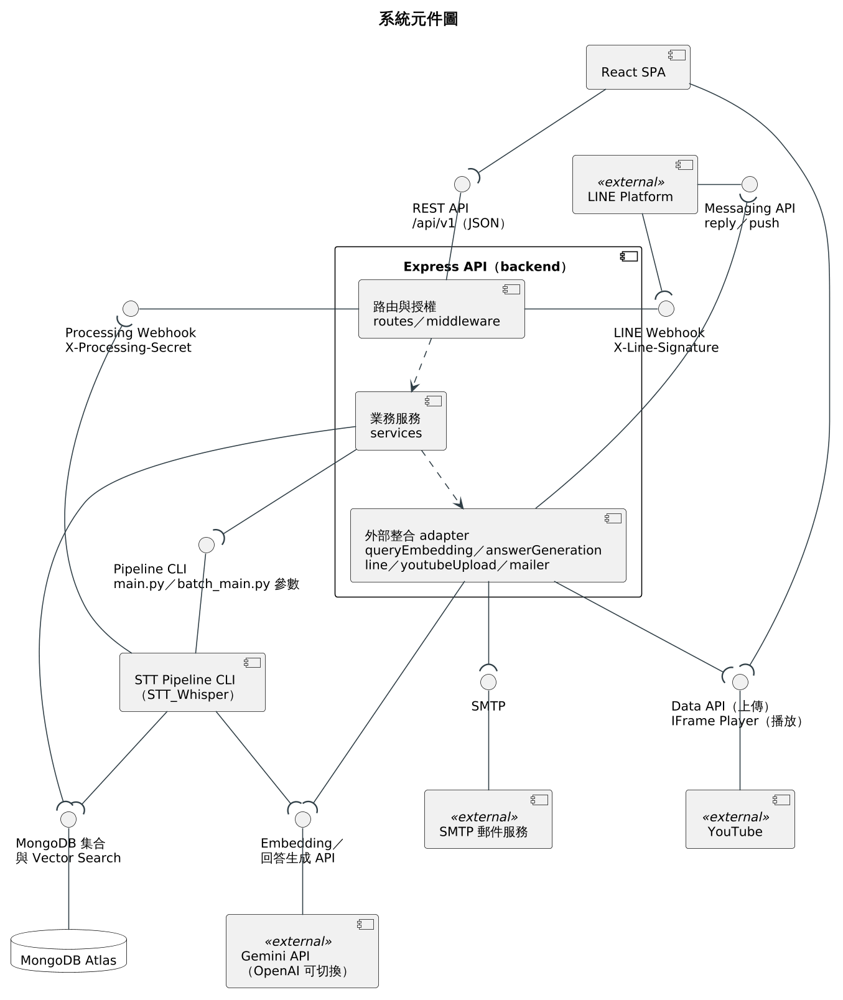

圖7-3-1 系統元件圖

如圖7-3-1所示，所有外部入口（網頁的 REST API、LINE Webhook、Pipeline 的 Processing Webhook）都先落在「路由與授權」子元件，而所有對外呼叫都集中在「外部整合 adapter」。因此更換 AI provider 或關閉某個外部服務時，只影響 adapter 與設定，不需要改動業務服務。Pipeline 與 API 之間是雙向合作：API 需要 Pipeline 的 CLI 介面啟動處理，Pipeline 需要 API 的 Processing Webhook 回報狀態；兩者都需要 MongoDB，但各自寫入不同集合。

## 7-4 狀態機（State machine），甚至時序圖（Timing diagram）

本節以九張狀態機圖描述九個物件的生命週期，每張只描述一個類別。轉換標籤採 `事件 [守衛條件] / 動作` 格式；狀態名稱沿用程式中的常數值，括號內附中文說明。各物件的狀態與約束彙整於本節末的表7-4-1。

### 登入 Session

圖7-4-1 描述前端 `AuthSession` 在頁面載入、登入、登出與管理員入口判斷時的狀態變化。

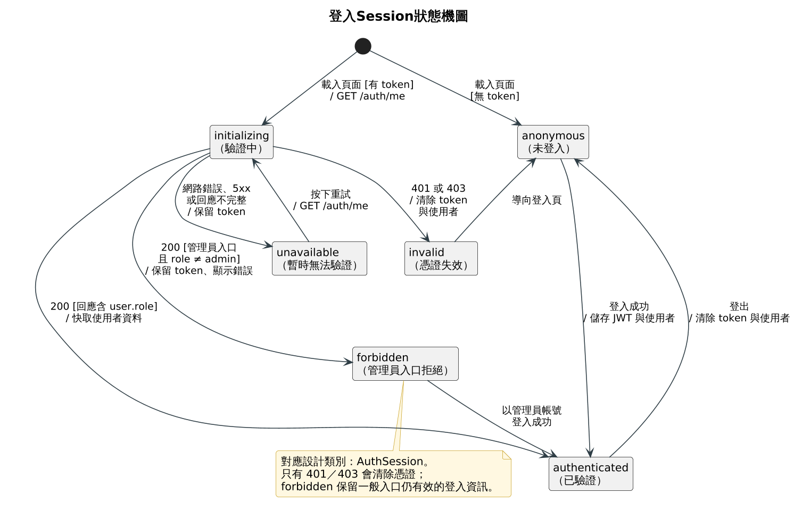

圖7-4-1 登入Session狀態機圖

頁面載入時若瀏覽器沒有 token，直接進入 `anonymous`；有 token 則進入驗證中（`initializing`，對應應用殼層的 `authInitializing` 旗標）並呼叫 `GET /auth/me`。後端回 200 且含角色時進入 `authenticated`；回 401 或 403 代表 token 已失效，前端清除 token 與使用者資料後經 `invalid` 回到登入頁；網路錯誤、5xx 或回應不完整時進入 `unavailable`，保留 token 讓使用者按重試再驗證一次，避免暫時性故障把仍有效的登入清掉。管理員入口另外檢查角色，非管理員帳號進入 `forbidden` 並顯示「此入口僅供管理員使用」，但不清除 token，使用者仍可由一般入口正常使用。

### 影片批次

圖7-4-2 描述教師一次上傳多支影片時，`VideoBatch` 的整體狀態如何由各項目的結果彙整而成。

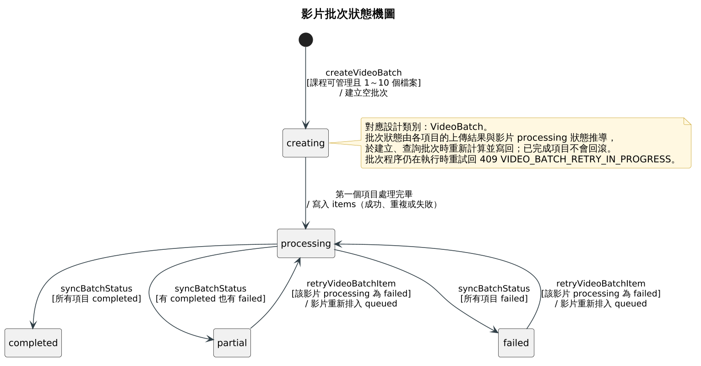

圖7-4-2 影片批次狀態機圖

教師上傳 1～10 個檔案時，系統先建立 `creating` 的空批次，每處理完一個檔案就把項目結果（成功、與課程既有影片重複、或失敗）寫入批次並進入 `processing`，因此部分檔案失敗時已成功的項目仍保留。之後每次建立或查詢批次，系統都依各項目的上傳結果與影片處理狀態重新推導批次狀態：仍有未結束項目時維持 `processing`，全部完成為 `completed`，全部失敗為 `failed`，兩者皆有為 `partial`。對 `partial` 或 `failed` 批次中處理失敗的影片按下重試，影片回到 `queued`，批次也隨之回到 `processing`；若批次程序仍在執行，重試回 409 `VIDEO_BATCH_RETRY_IN_PROGRESS`。

### 影片處理

圖7-4-3 描述單支影片 `processing` 子文件的狀態，與 `videoProcessing.service.js` 強制的轉換一一對應。

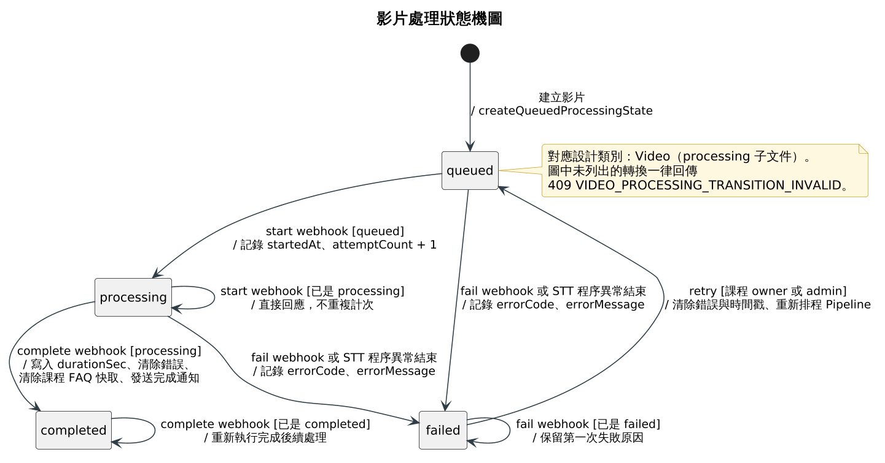

圖7-4-3 影片處理狀態機圖

影片建立時一律進入 `queued`。Pipeline 呼叫 start webhook 後由 `queued` 進入 `processing`，並記錄開始時間與嘗試次數；在 `processing` 狀態重送 start 只回應目前狀態，不重複計次。complete webhook 只接受 `processing`，完成時寫入影片長度、清除錯誤訊息、清除相關課程的 FAQ 快取、發送完成通知，並在 YouTube 自動上傳啟用時排程上傳；在 `completed` 狀態重送 complete 會重新執行這些後續處理，讓通知或快取清除失敗時可以安全重試。fail webhook 或 STT 程序異常結束可讓 `queued` 或 `processing` 進入 `failed`，重送 fail 保留第一次的失敗原因。只有課程教師或管理員可以對 `failed` 影片按重試，系統清除錯誤與時間戳記後回到 `queued` 並重新排程 Pipeline。圖中未列出的轉換（例如對 `completed` 影片重試）一律回 409 `VIDEO_PROCESSING_TRANSITION_INVALID`。

### QA 提問

圖7-4-4 描述一次提問從送出到產生最終結果的過程；最終結果即 `questions` 集合中 `status` 欄位的三個值。

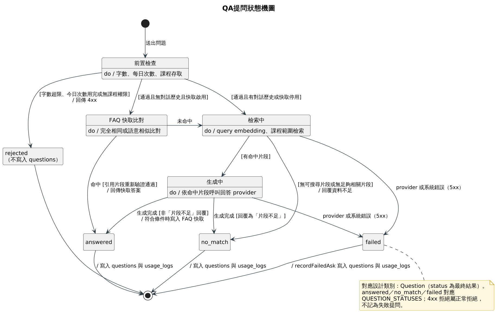

圖7-4-4 QA提問狀態機圖

提問先經前置檢查：問題超過字數上限、今日提問次數用完或沒有課程權限時直接回傳 4xx，這屬於正常拒絕，不寫入 `questions`。通過檢查後，沒有對話歷史且 FAQ 快取啟用時先比對快取，命中且引用片段重新驗證通過即回傳快取答案；未命中或有對話歷史時進入檢索，以 query embedding 在課程範圍內搜尋片段。課程沒有可搜尋片段或找不到足夠相關片段時結果為 `no_match`；有命中片段則交由回答 provider 生成答案，若回覆為「片段不足」的固定文字也記為 `no_match`，否則為 `answered`，並在符合條件時寫入 FAQ 快取。檢索或生成過程中發生 provider 或系統錯誤（5xx）時結果為 `failed`，由 `recordFailedAsk` 留下失敗紀錄。三種結果都會寫入 `questions` 與 `usage_logs`，供統計與後台查詢。

### LINE 對話範圍

圖7-4-5 描述 `User` 文件中 `lineUserId`、`lineConversationState` 與 `activeCourseId` 三個欄位共同形成的 LINE 對話範圍。

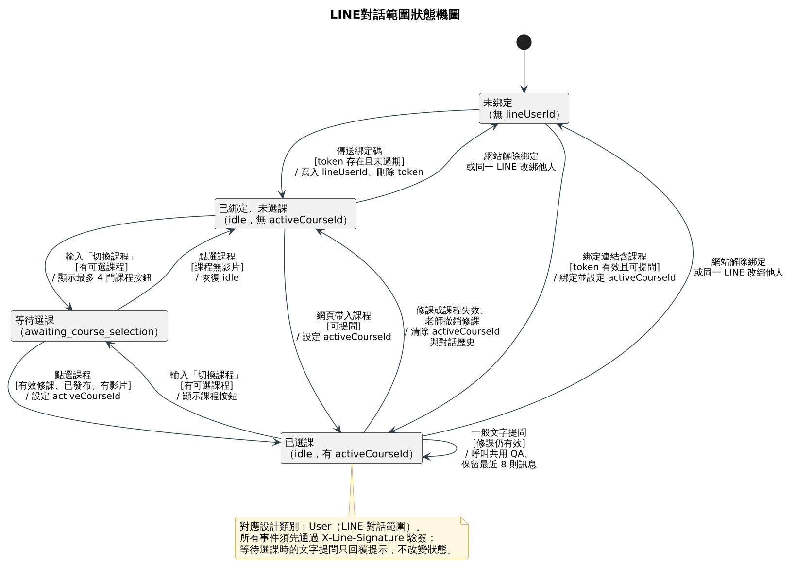

圖7-4-5 LINE對話範圍狀態機圖

所有 LINE 事件都須先通過 `X-Line-Signature` 驗簽。使用者在 LINE 傳送有效且未過期的一次性綁定碼後，系統寫入 `lineUserId` 並刪除綁定碼，進入「已綁定、未選課」；若綁定連結同時帶有課程且可提問，則直接進入「已選課」。輸入「切換課程」時，系統列出有效修課且已發布的課程（最多 4 門按鈕）並進入 `awaiting_course_selection`；此時一般文字提問只會收到提示。點選的課程若有效修課、已發布且有影片，就設定 `activeCourseId` 進入「已選課」；課程沒有影片則回到 `idle`。從網頁「詢問助教」帶入課程也可直接進入「已選課」。已選課時一般文字訊息會呼叫共用 QA 服務，並保留最近 8 則訊息作為多輪對話脈絡（`MAX_CONVERSATION_TURNS` 預設 4 輪）。老師撤銷修課，或提問時發現修課或課程已失效，系統清除 `activeCourseId` 與對話歷史並回到「已綁定、未選課」。使用者在網站解除綁定，或同一 LINE 帳號改綁其他系統帳號時，回到「未綁定」。

### 修課

圖7-4-6 描述學生與課程之間的修課紀錄（`Enrollment`）如何建立、撤銷與恢復；它決定學生能否存取課程影片、問答、LINE 課程範圍與短影音。

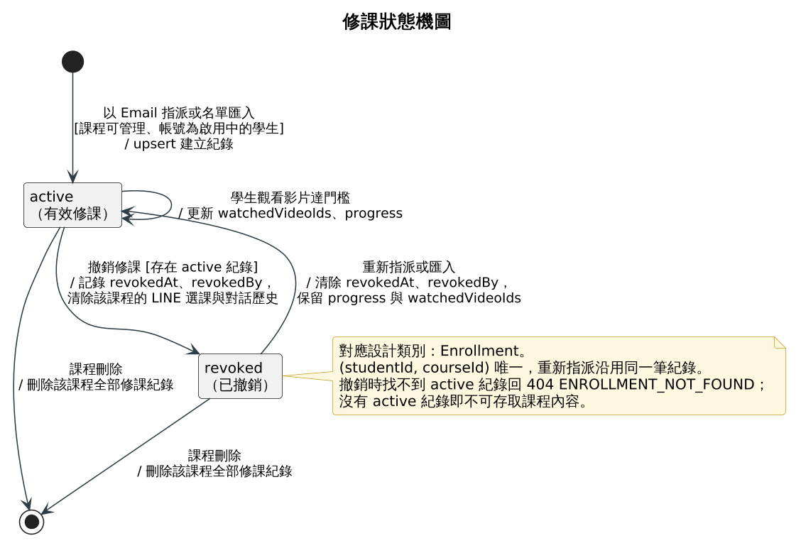

圖7-4-6 修課狀態機圖

- **建立（→ `active`）**：課程教師或管理員以 Email 指派，或以名單匯入；對象必須是啟用中的學生帳號。系統以 `(studentId, courseId)` upsert 建立紀錄，重複指派只更新指派者與指派時間，不會產生第二筆。
- **觀看進度（`active` 自我轉換）**：學生觀看影片達門檻時更新 `watchedVideoIds` 與 `progress`，狀態不變。
- **撤銷（`active` → `revoked`）**：必須存在 `active` 紀錄，否則回 404 `ENROLLMENT_NOT_FOUND`。撤銷時記錄撤銷者與時間，並清除該學生在這門課的 LINE 選課與對話歷史（對應圖7-4-5 回到「已綁定、未選課」）。
- **恢復（`revoked` → `active`）**：再次指派或匯入同一位學生時沿用原紀錄，清除撤銷資訊，保留原本的觀看進度。
- **刪除（→ 終止）**：課程被刪除時，該課程的全部修課紀錄一併刪除。

### 短影音腳本

圖7-4-7 描述短影音腳本（`ShortScript`）自凍結證據到上架或放棄的生命週期，轉換以 `shortScript.service.js` 的 `ALLOWED_TRANSITIONS` 為準。

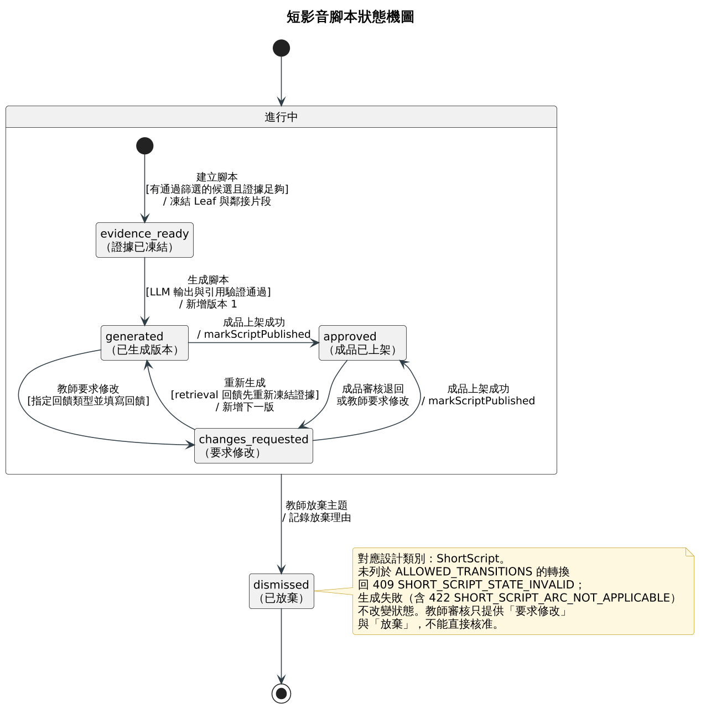

圖7-4-7 短影音腳本狀態機圖

- **建立（→ `evidence_ready`）**：教師選擇或接受系統推薦的提問主題；必須有通過篩選的候選且檢索到足夠片段，系統才凍結 Leaf 片段與鄰接片段作為證據，否則回 422，不建立腳本。
- **生成（`evidence_ready` → `generated`）**：以 LLM 生成腳本，引用只能來自凍結證據；生成失敗（含證據包不適用敘事弧線的 422 `SHORT_SCRIPT_ARC_NOT_APPLICABLE`）時狀態不變。
- **要求修改（`generated` → `changes_requested`）**：教師必須指定回饋類型（retrieval 或 narrative）並填寫回饋。
- **重新生成（`changes_requested` → `generated`）**：retrieval 類回饋先重新凍結證據，narrative 類沿用原證據改寫，新增下一個版本。
- **上架（`generated`／`changes_requested` → `approved`）**：只有該腳本的成品成功上架（圖7-4-8 進入 `published`）時，系統才把腳本標為 `approved`；教師審核介面沒有「核准」選項。
- **退回（`approved` → `changes_requested`）**：成品審核被退回時，系統依退回理由決定回饋類型（「內容有誤」為 retrieval，其餘為 narrative）；教師也可主動要求修改。
- **放棄（進行中任一狀態 → `dismissed`）**：教師放棄主題並記錄理由；`dismissed` 為終態，之後任何轉換都回 409 `SHORT_SCRIPT_STATE_INVALID`。

### 短影音成品

圖7-4-8 以 `status` 與 `reviewStatus` 兩個欄位的組合描述短影音成品（`ShortAsset`）的生命週期：`draft` 為複合狀態，內含審核的 `pending`、`approved`、`rejected`；`published` 時 `reviewStatus` 必為 `approved`。

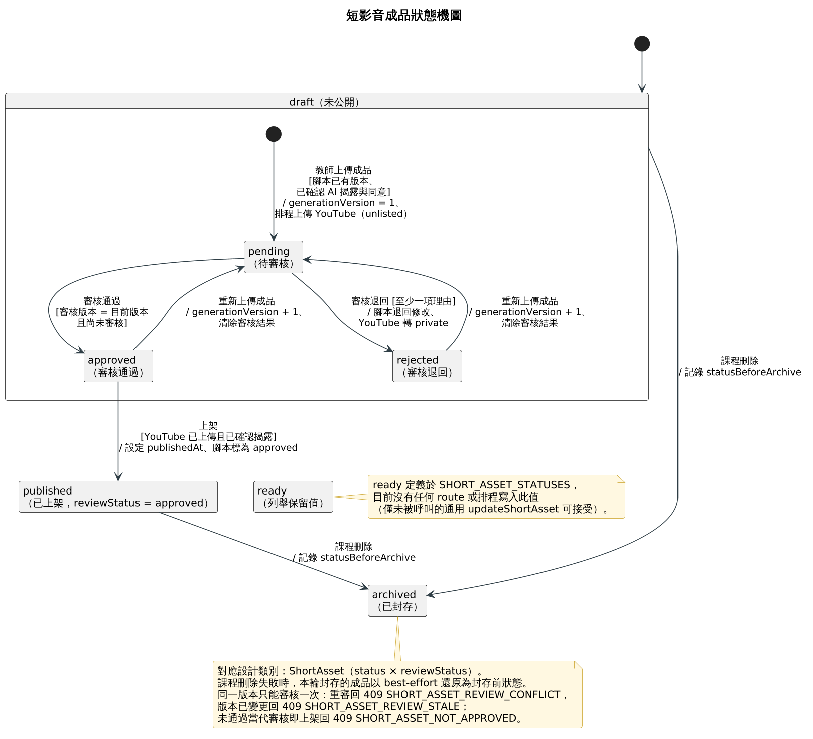

圖7-4-8 短影音成品狀態機圖

- **上傳（→ `draft`／`pending`）**：教師依腳本上傳成品檔案，必須勾選 AI 揭露與書面同意；系統建立第 1 代（`generationVersion = 1`）並排程以 unlisted 上傳 YouTube 供預覽。
- **審核通過（`pending` → `approved`）**：審核時送出的版本必須等於目前版本，且該版本尚未審核；否則回 409 `SHORT_ASSET_REVIEW_STALE` 或 `SHORT_ASSET_REVIEW_CONFLICT`。
- **審核退回（`pending` → `rejected`）**：至少附一項退回理由；系統同時把對應腳本退回 `changes_requested`（圖7-4-7），並把 YouTube 影片轉為 private。
- **重新上傳（`rejected`／`approved` → `pending`）**：尚未上架的成品重新上傳時換代，`generationVersion` 加 1 並清除審核結果；已上架的成品不會換代。
- **上架（`approved` → `published`）**：審核通過、YouTube 已上傳完成且已確認揭露時，系統設定 `publishedAt` 並把腳本標為 `approved`；審核比上傳早完成時，會在上傳完成後補做這一步。未通過當代審核即上架回 409 `SHORT_ASSET_NOT_APPROVED`。
- **封存（`draft`／`published` → `archived`）**：課程刪除時，該課程尚未封存的成品全部改為 `archived` 並記錄封存前狀態；若課程刪除失敗，系統以 best-effort 還原為封存前狀態。來源影片刪除不會觸發封存。
- **`ready`**：此值定義於 `SHORT_ASSET_STATUSES`，但目前沒有任何路由或排程寫入它，只有未被呼叫的通用更新函式 `updateShortAsset` 能接受，因此圖中以獨立狀態標示為保留值。

### YouTube 上傳

圖7-4-9 描述教師上傳的課程影片自動上傳到 YouTube 的過程，記錄在 `Video` 的 `youtubeUpload` 子文件；此功能由 `YOUTUBE_UPLOAD_ENABLED` 控制，預設關閉。

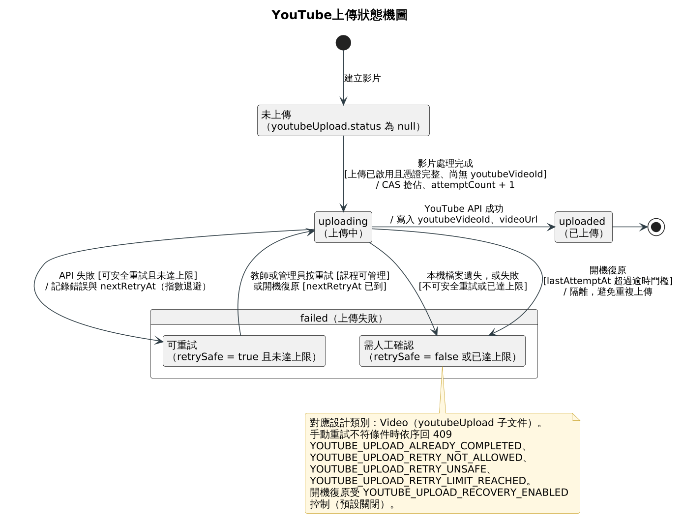

圖7-4-9 YouTube上傳狀態機圖

- **開始上傳（未上傳 → `uploading`）**：影片處理完成（圖7-4-3 進入 `completed`）後，若上傳已啟用且 OAuth 憑證完整、影片尚無 `youtubeVideoId`，系統以條件更新搶佔這支影片，避免重複上傳，並把嘗試次數加 1。
- **上傳成功（`uploading` → `uploaded`）**：寫入 `youtubeVideoId` 與影片網址；`uploaded` 為終態。
- **可重試的失敗（`uploading` → `failed`／可重試）**：錯誤發生在影片內容尚未送出前等可安全重試的情況，且未達次數上限（預設 3 次）時，記錄錯誤與下次重試時間（指數退避）。
- **需人工確認的失敗（`uploading` → `failed`／需人工確認）**：本機檔案遺失、失敗且不可安全重試或已達上限時進入此狀態；開機復原若發現 `uploading` 超過逾時門檻，也會隔離為此狀態，因為遠端可能已上傳成功，需先到 YouTube Studio 確認。
- **重試（`failed`／可重試 → `uploading`）**：課程教師或管理員手動重試，或開機復原在下次重試時間到達後自動重試；開機復原由 `YOUTUBE_UPLOAD_RECOVERY_ENABLED` 控制，預設關閉。手動重試不符條件時依序回 409 `YOUTUBE_UPLOAD_ALREADY_COMPLETED`、`YOUTUBE_UPLOAD_RETRY_NOT_ALLOWED`、`YOUTUBE_UPLOAD_RETRY_UNSAFE` 或 `YOUTUBE_UPLOAD_RETRY_LIMIT_REACHED`。

### 狀態彙整

表7-4-1 彙整本節九張狀態機的對象、狀態值與主要約束，並列出沒有另繪狀態機的 Course。

表7-4-1　主要狀態、事件與實作約束

| 對象 | 狀態 | 實作約束 | 圖 |
| --- | --- | --- | --- |
| 登入 Session（前端） | `anonymous`、`authenticated`、`invalid`、`unavailable`、`forbidden` | 只有 `/auth/me` 回 401／403 才清除 token；網路錯誤或 5xx 保留 token 供重試 | 圖7-4-1 |
| VideoBatch | `creating`、`processing`、`completed`、`partial`、`failed` | 狀態由各項目推導；單一批次 1～10 個檔案；已完成項目不回滾 | 圖7-4-2 |
| Video.processing | `queued`、`processing`、`completed`、`failed` | 每個 webhook 都檢查前置狀態，重送保持冪等；其他轉換回 409 `VIDEO_PROCESSING_TRANSITION_INVALID` | 圖7-4-3 |
| Question | `answered`、`no_match`、`failed` | 一次提問只寫入一筆最終結果；4xx 拒絕不寫入 `questions` | 圖7-4-4 |
| User 的 LINE 對話範圍 | `idle`、`awaiting_course_selection`，搭配 `lineUserId` 與 `activeCourseId` | webhook 先驗簽；選課須有效修課、課程已發布且有影片 | 圖7-4-5 |
| Course | `draft`、`published`、`archived` | 學生存取除課程已發布外，還需要有效的修課紀錄 | — |
| Enrollment | `active`、`revoked` | 同一 `(studentId, courseId)` 只有一筆紀錄，重新指派時由 `revoked` 回到 `active`；撤銷時同步清除該課程的 LINE 對話範圍；課程刪除時整批刪除 | 圖7-4-6 |
| ShortScript | `evidence_ready`、`generated`、`changes_requested`、`approved`、`dismissed` | `ALLOWED_TRANSITIONS` 未列出的轉換回 409 `SHORT_SCRIPT_STATE_INVALID`；`approved` 只由成品上架觸發；`dismissed` 為終態 | 圖7-4-7 |
| ShortAsset | `status`：`draft`、`ready`、`published`、`archived`；`reviewStatus`：`pending`、`approved`、`rejected` | 上架須當代審核通過，否則回 409 `SHORT_ASSET_NOT_APPROVED`；同一版本只能審核一次；`ready` 為列舉保留值，目前無寫入路徑 | 圖7-4-8 |
| Video.youtubeUpload | 未上傳（`null`）、`uploading`、`uploaded`、`failed` | 重試須 `retrySafe` 為真且未達次數上限；逾時未完成的上傳標記為不可重試的 `failed` | 圖7-4-9 |

短影音腳本與成品相關功能由 `SHORT_SCRIPT_AUTOMATION_ENABLED` 控制，預設關閉；成品由教師在系統外（教授主機上的 ComfyUI 與 MiniMax H3）產製後上傳，系統不提供自動剪輯或渲染，也尚未串接 ComfyUI。
