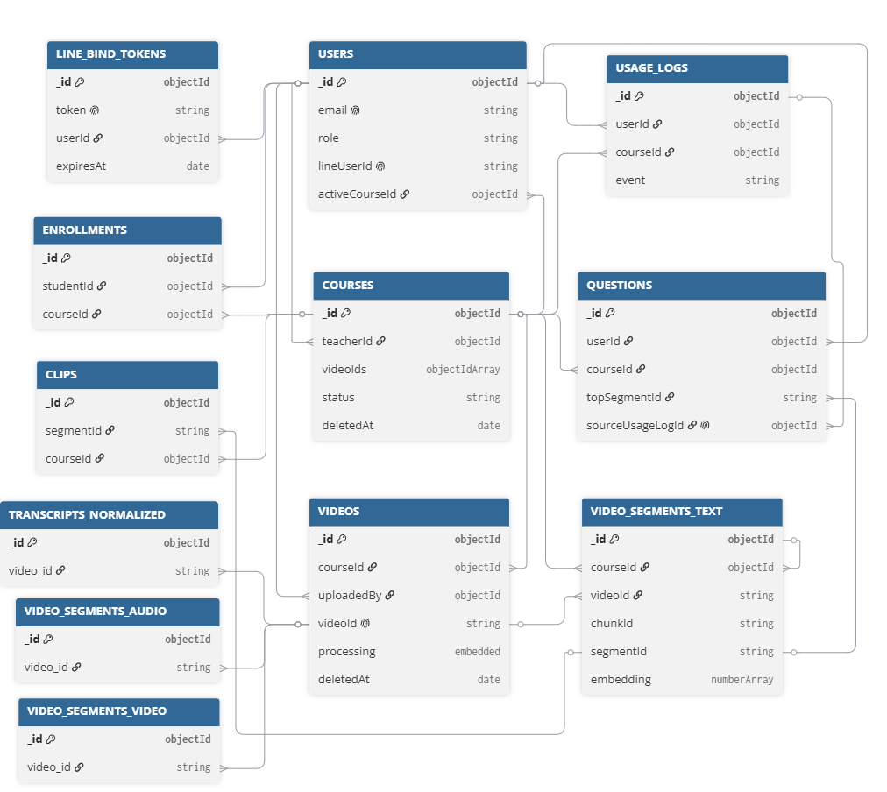

# 第8章 資料庫設計

> 狀態：初評原稿轉製，待核對現況。
> 原始資料日期：2026-06-02；Markdown 整理日期：2026-09-13。
> 來源：[初評系統手冊 DOCX](../source-documents/專題手冊_初評最終版.docx)，原第8章。

本章重用原稿文字、表格及嵌入圖像；尚未逐圖核對版面、合併儲存格與圖表編號，不代表最新版功能或正式驗收結果。

## 本次整理與待補

TODO：逐欄核對目前 Mongoose／Pipeline uploader／database 契約，補索引、限制、引用關係及各欄型別；原稿資料庫表屬 2026-06-02 快照，不作目前 Atlas 證據。

補充現況來源（尚待逐項套用）：[資料庫現況入口](../../../20_Architecture/database/README.md)。

[返回手冊索引](../README.md)

---

## 8-1 資料庫關聯表

本系統使用MongoDB作為主要資料庫，資料關係不完全等同於傳統關聯式資料庫的外鍵約束；正式關聯以後端Mongoose models、Service邏輯與MongoDB Index設定共同維護。圖8-11呈現初評階段系統的主要資料參考關係，並保留Pipeline產物與Legacy快取資料的邊界。[3]

圖8-11MongoDB Collection Relationship Diagram

表8-11主要資料關係摘要

| 範圍 | 主要關係 | 說明 |
| --- | --- | --- |
| 課程管理 | users(teacher) → courses → videos | 教師建立課程，課程包含影片。 |
| 修課關係 | users(student) ↔ courses，透過 enrollments 連接 | 學生與課程為多對多關係。 |
| 問答紀錄 | users + courses → questions | 每筆提問綁定提問者與課程。 |
| 文字檢索 | questions → video_segments_text | AI 回答會記錄命中的文字片段與時間戳。 |
| 使用紀錄 | users + courses → usage_logs | 記錄登入、觀看、提問與點擊行為。 |
| Pipeline產物 | videos.videoId → transcripts_normalized / video_segments | Pipeline 使用字串 ID 串接逐字稿與向量片段。 |
| LINE 綁定 | users → line_bind_tokens | 使用一次性 token 完成 LINE 帳號綁定。 |
| Legacy 快取 | video_segments_text → clips | clips 為精華片段快取，非正式權威資料來源。 |

補充限制如下：

enrollments.studentId+courseId應維持唯一，避免學生重複修同一門課。

questions.sourceUsagelogId使用sparse unique/partial index，避免同一筆usage log重複對應多筆question。

line_bind_tokens.expiresAt使用TTL index，過期後由MongoDB自動清除。

video_segments_text.embedding對應Atlas Vector Search index，供QA檢索使用。

## 8-2 表格及其Metadata

users用於記錄系統使用者帳號、角色、LINE綁定與對話狀態。courses記錄教師建立的課程、課程狀態與引用影片清單。videos記錄App上傳影片與Pipeline metadata，並保留影片處理狀態。video_segments_text記錄文字片段、時間戳與text embedding，供MVP QA檢索使用。enrollments記錄學生與課程的修課關係。questions記錄學生提問、AI回答、命中片段與runtime metadata。clips為Legacy/optional快取層，非正式權威資料來源。usage_logs記錄登入、觀看、提問與精華片段點擊等使用行為。line_bind_tokens記錄LINE一次性綁定token與過期時間。term_dictionary、transcripts_normalized、video_segments_audio與video_segments_video為STT/AI Pipeline輔助、產物或Phase2多模態檢索預留資料。[3]

本系統使用MongoDB為主要資料庫，因此以MongoDB/Mongoose的資料型態表示，例如ObjectId、String、Number、Boolean、Date、Array、Embedded Document與Mixed。資料長度若未固定限制，則以「-」表示；ObjectId欄位長度以24表示，代表MongoDB標準24位十六進位值。允許空值欄位僅標示「否」；空白代表可為null或非必填。備註欄以短標記呈現，例如PK、FK、UK、IDX、TTL、VECTOR。

表8-21資料表

| 資料表編號 | 資料表英文名稱 | 資料表中文名稱 |
| --- | --- | --- |
| 01 | users | 使用者資料 |
| 02 | courses | 課程資料 |
| 03 | videos | 影片資料 |
| 04 | video_segments_text | 文字片段向量資料 |
| 05 | enrollments | 修課紀錄 |
| 06 | questions | 提問紀錄 |
| 07 | clips | 精華片段快取（Legacy快取） |
| 08 | usage_logs | 使用紀錄 |
| 09 | line_bind_tokens | LINE綁定Token |
| 10 | term_dictionary | 專有名詞詞庫（Pipeline輔助） |
| 11 | transcripts_normalized | 正規化逐字稿（Pipeline產物） |
| 12 | video_segments_audio | 音訊片段向量資料（Pipeline預留） |
| 13 | video_segments_video | 影片片段向量資料（為後續階段多模態檢索規劃，主流程未使用） |

表8-22資料表描述-01使用者資料

| 中文名稱 | 使用者資料 | 資料表編號 | 01 |  |  |  |
| --- | --- | --- | --- | --- | --- | --- |
| 英文名稱 | users | 主索引 | _id |  |  |  |
| 資料檔陳述 | 記錄系統使用者帳號、角色、LINE綁定與LINE對話狀態 |  |  |  |  |  |
| 欄位名稱 | 資料型態 | 長度 | 允許空值 | 中文 | 備註 | 預設值 |
| _id | ObjectId | 24 | 否 | 使用者唯一識別碼 | PK | 自動 |
| name | String | - | 否 | 使用者顯示名稱 | required | - |
| email | String | - | 否 | 電子郵件 | UK | - |
| passwordHash | String | 60 | 否 | bcrypt密碼雜湊值 | bcrypt | - |
| role | String | - | 否 | 角色 | enum | student |
| isActive | Boolean | - | 否 | 帳號是否啟用 | - | true |
| lineUserId | String | - |  | LINE平台使用者ID | UK，sparse | null |
| lineBindAt | Date | - |  | LINE完成綁定時間 | - | null |
| activeCourseId | ObjectId | 24 |  | LINE Bot目前選定課程 | FK | null |
| lineConversationState | String | - | 否 | LINE對話狀態 | enum | idle |
| lineConversationHistory | Array<Embedded Document> | - | 否 | LINE對話歷史 | max6 | [] |
| lineConversationHistory[].role | String | - |  | 對話角色 | enum | - |
| lineConversationHistory[].content | String | - |  | 對話內容 | - | - |
| createdAt | Date | - | 否 | 建立時間 | timestamps | 自動 |
| updatedAt | Date | - | 否 | 最後更新時間 | timestamps | 自動 |

表8-23資料表描述-02課程資料

| 中文名稱 | 課程資料 | 資料表編號 | 02 |  |  |  |
| --- | --- | --- | --- | --- | --- | --- |
| 英文名稱 | courses | 主索引 | _id |  |  |  |
| 資料檔陳述 | 記錄教師建立的課程、課程狀態與課程引用影片清單 |  |  |  |  |  |
| 欄位名稱 | 資料型態 | 長度 | 允許空值 | 中文 | 備註 | 預設值 |
| _id | ObjectId | 24 | 否 | 課程唯一識別碼 | PK | 自動 |
| title | String | - | 否 | 課程名稱 | required | - |
| description | String | - | 否 | 課程描述 | - | '' |
| teacherId | ObjectId | 24 | 否 | 開課教師ID | FK，IDX | - |
| videoIds | Array<ObjectId> | - | 否 | 課程引用影片ID清單 | FK | [] |
| status | String | - | 否 | 課程狀態 | enum | draft |
| deletedAt | Date | - |  | 軟刪除時間 | null表示未刪除 | null |
| createdAt | Date | - | 否 | 建立時間 | timestamps | 自動 |
| updatedAt | Date | - | 否 | 最後更新時間 | timestamps | 自動 |

表8-24資料表描述-03影片資料

| 中文名稱 | 影片資料 | 資料表編號 | 03 |  |  |  |
| --- | --- | --- | --- | --- | --- | --- |
| 英文名稱 | videos | 主索引 | _id |  |  |  |
| 資料檔陳述 | 記錄App-owned課程影片、影片來源、檔案路徑與STT Pipeline處理狀態；歷史Pipeline metadata影片作為橋接資料 |  |  |  |  |  |
| 欄位名稱 | 資料型態 | 長度 | 允許空值 | 中文 | 備註 | 預設值 |
| _id | ObjectId | 24 | 否 | 影片唯一識別碼 | PK | 自動 |
| courseId | ObjectId | 24 | 否 | 所屬課程ID | FK，IDX | - |
| title | String | - | 否 | 影片標題 | required | - |
| sourceType | String | - | 否 | 影片來源 | enum | upload |
| sourceUrl | String | - |  | 外部來源URL | - | null |
| videoId | String | - |  | Pipeline影片識別字串 | UK，sparse | - |
| fileName | String | - |  | 原始檔案名稱 | - | null |
| filePath | String | - |  | 後端儲存本機路徑 | - | null |
| audioPath | String | - |  | Pipeline抽出音訊路徑 | - | null |
| storagePath | String | - |  | 雲端儲存路徑 | 保留欄位 | null |
| durationSec | Number | - |  | 影片長度（秒） | min0 | null |
| week | Number | - |  | 課程週次 | min0 | null |
| lesson | Number | - |  | 課程節次 | min0 | null |
| videoSource | String | - |  | Pipeline端影片來源描述 | - | null |
| videoUrl | String | - |  | 對外播放URL | - | null |
| uploadedBy | ObjectId | 24 | 否 | 上傳者ID | FK | - |
| processing | Embedded Document | - | 否 | 處理流程子文件 | required | - |
| processing.status | String | - | 否 | 處理狀態 | enum | - |
| processing.errorMessage | String | - |  | 失敗錯誤訊息 | - | null |
| processing.errorCode | String | - |  | 失敗錯誤代碼 | - | null |
| processing.queuedAt | Date | - |  | 排入佇列時間 | - | null |
| processing.startedAt | Date | - |  | 開始處理時間 | - | null |
| processing.completedAt | Date | - |  | 完成時間 | - | null |
| processing.failedAt | Date | - |  | 失敗時間 | - | null |
| processing.attemptCount | Number | - | 否 | 重試次數 | min0 | 0 |
| deletedAt | Date | - |  | 軟刪除時間 | - | null |
| createdAt | Date | - | 否 | 建立時間 | timestamps | 自動 |
| updatedAt | Date | - | 否 | 最後更新時間 | timestamps | 自動 |

表8-25資料表描述-04文字片段向量資料

| 中文名稱 | 文字片段向量資料 | 資料表編號 | 04 |  |  |  |
| --- | --- | --- | --- | --- | --- | --- |
| 英文名稱 | video_segments_text | 主索引 | _id |  |  |  |
| 資料檔陳述 | 記錄影片逐字稿切分後的文字片段、時間戳與文字向量，供QA文字檢索使用 |  |  |  |  |  |
| 欄位名稱 | 資料型態 | 長度 | 允許空值 | 中文 | 備註 | 預設值 |
| _id | ObjectId | 24 | 否 | 片段唯一識別碼 | PK | 自動 |
| courseId | ObjectId | 24 |  | 所屬課程ID | IDX | null |
| segmentId | String | - |  | 片段ID | IDX | null |
| chunkId | String | - |  | Chunk唯一識別字串 | Pipeline | null |
| videoId | String | - |  | 對應影片識別字串 | IDX | null |
| startSec | Number | - |  | 起始時間（秒） | min0 | null |
| endSec | Number | - |  | 結束時間（秒） | min0 | null |
| text | String | - |  | 片段逐字稿文字 | - | null |
| corrections | Array<Mixed> | - | 否 | 詞彙修正紀錄 | legacygap | [] |
| embedding | Array<Number> | 3072 | 否 | 文字向量 | VECTOR | [] |
| createdAt | Date | - | 否 | 建立時間 | timestamps | 自動 |
| updatedAt | Date | - | 否 | 最後更新時間 | timestamps | 自動 |

表8-26資料表描述-05修課紀錄

| 中文名稱 | 修課紀錄 | 資料表編號 | 05 |  |  |  |
| --- | --- | --- | --- | --- | --- | --- |
| 英文名稱 | enrollments | 主索引 | _id |  |  |  |
| 資料檔陳述 | 記錄學生與課程的修課關係、學習進度與LINE通知設定 |  |  |  |  |  |
| 欄位名稱 | 資料型態 | 長度 | 允許空值 | 中文 | 備註 | 預設值 |
| _id | ObjectId | 24 | 否 | 修課紀錄唯一識別碼 | PK | 自動 |
| studentId | ObjectId | 24 | 否 | 學生ID | FK，UK | - |
| courseId | ObjectId | 24 | 否 | 課程ID | FK，UK | - |
| enrolledAt | Date | - | 否 | 修課時間 | - | Date.now |
| progress | Number | - | 否 | 學習進度百分比 | 0-100 | 0 |
| lineNotify | Boolean | - | 否 | 是否啟用LINE通知 | - | false |
| createdAt | Date | - | 否 | 建立時間 | timestamps | 自動 |
| updatedAt | Date | - | 否 | 最後更新時間 | timestamps | 自動 |

表8-27資料表描述-06提問紀錄

| 中文名稱 | 提問紀錄 | 資料表編號 | 06 |  |  |  |
| --- | --- | --- | --- | --- | --- | --- |
| 英文名稱 | questions | 主索引 | _id |  |  |  |
| 資料檔陳述 | 記錄學生提問、AI回答、命中片段、推論過程metadata與來源usage log |  |  |  |  |  |
| 欄位名稱 | 資料型態 | 長度 | 允許空值 | 中文 | 備註 | 預設值 |
| _id | ObjectId | 24 | 否 | 提問紀錄唯一識別碼 | PK | 自動 |
| userId | ObjectId | 24 | 否 | 提問者ID | FK，IDX | - |
| courseId | ObjectId | 24 | 否 | 提問所屬課程 | FK，IDX | - |
| question | String | - | 否 | 學生提問內容 | text IDX | - |
| answer | String | - | 否 | AI生成回答 | text IDX | '' |
| status | String | - | 否 | 回答狀態 | enum，IDX | answered |
| source | String | - | 否 | 提問來源 | enum，IDX | api |
| matchCount | Number | - | 否 | 相似片段命中數量 | min0 | 0 |
| topSegmentId | String | - |  | 最相似片段segmentId | IDX | null |
| matches | Array<Embedded Document> | - | 否 | 相似片段陣列 | embedded | [] |
| matches[].segmentId | String | - |  | 命中片段ID | - | null |
| matches[].videoId | String | - |  | 命中片段影片ID | - | null |
| matches[].videoTitle | String | - |  | 命中影片標題 | - | null |
| matches[].startSec | Number | - |  | 命中片段起始秒 | min0 | null |
| matches[].endSec | Number | - |  | 命中片段結束秒 | min0 | null |
| matches[].score | Number | - |  | 相似度分數 | - | null |
| runtime | Mixed | - | 否 | QA推論runtime metadata | - | {} |
| sourceUsage logId | ObjectId | 24 |  | 來源Usage logID | UK，sparse | undefined |
| askedAt | Date | - | 否 | 提問時間 | IDX | Date.now |
| createdAt | Date | - | 否 | 建立時間 | timestamps | 自動 |
| updatedAt | Date | - | 否 | 最後更新時間 | timestamps | 自動 |

表8-28資料表描述-07精華片段快取

| 中文名稱 | 精華片段快取 | 資料表編號 | 07 |  |  |  |
| --- | --- | --- | --- | --- | --- | --- |
| 英文名稱 | clips | 主索引 | _id |  |  |  |
| 資料檔陳述 | 記錄可重複使用的精華片段URL、跳轉連結與重點摘要，目前屬Legacy快取 |  |  |  |  |  |
| 欄位名稱 | 資料型態 | 長度 | 允許空值 | 中文 | 備註 | 預設值 |
| _id | ObjectId | 24 | 否 | Clip唯一識別碼 | PK | 自動 |
| segmentId | String | - | 否 | 對應片段ID | UK | - |
| courseId | ObjectId | 24 |  | 所屬課程ID | IDX | null |
| clipUrl | String | - | 否 | 精華影片URL | required | - |
| keyPoints | Array<String> | - | 否 | 重點條列文字 | - | [] |
| jumpUrl | String | - |  | 原始影片跳轉URL | - | null |
| hitCount | Number | - | 否 | 點擊次數 | min0 | 0 |
| createdAt | Date | - | 否 | 建立時間 | timestamps | 自動 |
| updatedAt | Date | - | 否 | 最後更新時間 | timestamps | 自動 |

表8-29資料表描述-08使用紀錄

| 中文名稱 | 使用紀錄 | 資料表編號 | 08 |  |  |  |
| --- | --- | --- | --- | --- | --- | --- |
| 英文名稱 | usage_logs | 主索引 | _id |  |  |  |
| 資料檔陳述 | 記錄登入、觀看、提問與精華片段點擊等使用行為 |  |  |  |  |  |
| 欄位名稱 | 資料型態 | 長度 | 允許空值 | 中文 | 備註 | 預設值 |
| _id | ObjectId | 24 | 否 | 日誌唯一識別碼 | PK | 自動 |
| userId | ObjectId | 24 | 否 | 觸發事件使用者ID | FK，IDX | - |
| courseId | ObjectId | 24 |  | 事件所屬課程ID | FK，IDX | null |
| event | String | - | 否 | 事件類型 | enum | - |
| durationSec | Number | - |  | 事件持續秒數 | min0 | null |
| metadata | Mixed | - | 否 | 額外metadata | - | {} |
| timestamp | Date | - | 否 | 事件發生時間 | IDX | Date.now |
| createdAt | Date | - | 否 | 建立時間 | timestamps | 自動 |
| updatedAt | Date | - | 否 | 最後更新時間 | timestamps | 自動 |

表8-210資料表描述-09LINE綁定Token

| 中文名稱 | LINE綁定Token | 資料表編號 | 09 |  |  |  |
| --- | --- | --- | --- | --- | --- | --- |
| 英文名稱 | line_bind_tokens | 主索引 | _id |  |  |  |
| 資料檔陳述 | 記錄LINE綁定流程使用的一次性token與過期時間 |  |  |  |  |  |
| 欄位名稱 | 資料型態 | 長度 | 允許空值 | 中文 | 備註 | 預設值 |
| _id | ObjectId | 24 | 否 | 綁定Token唯一識別碼 | PK | 自動 |
| token | String | 64 | 否 | 綁定用64字元十六進位字串 | UK | - |
| userId | ObjectId | 24 | 否 | 綁定對象使用者ID | FK | - |
| createdAt | Date | - | 否 | Token建立時間 | TTL | Date.now |
| expiresAt | Date | - | 否 | Token過期時間 | TTL IDX | - |

表8-211資料表描述-10專有名詞詞庫

| 中文名稱 | 專有名詞詞庫 | 資料表編號 | 10 |  |  |  |
| --- | --- | --- | --- | --- | --- | --- |
| 英文名稱 | term_dictionary | 主索引 | _id |  |  |  |
| 資料檔陳述 | 記錄STT文字正規化時使用的專有名詞、別名與可能誤辨識寫法 |  |  |  |  |  |
| 欄位名稱 | 資料型態 | 長度 | 允許空值 | 中文 | 備註 | 預設值 |
| _id | ObjectId | 24 | 否 | 詞庫紀錄唯一識別碼 | PK | 自動 |
| correct | String | - | 否 | 正確專有名詞 | IDX | - |
| alternatives | Array<String> | - | 否 | 可能誤辨識或替代寫法 | Pipeline | [] |
| aliases | Array<String> | - | 否 | 別名清單 | legacy | [] |
| updatedAt | Date | - | 否 | 最後更新時間 | Pipeline | - |

表8-212資料表描述-11正規化逐字稿

| 中文名稱 | 正規化逐字稿 | 資料表編號 | 11 |  |  |  |
| --- | --- | --- | --- | --- | --- | --- |
| 英文名稱 | transcripts_normalized | 主索引 | _id |  |  |  |
| 資料檔陳述 | 記錄STT後經過專有名詞修正與正規化的逐字稿片段，是Pipeline中間產物 |  |  |  |  |  |
| 欄位名稱 | 資料型態 | 長度 | 允許空值 | 中文 | 備註 | 預設值 |
| _id | ObjectId | 24 | 否 | 正規化逐字稿識別碼 | PK | 自動 |
| video_id | String | - | 否 | 對應影片識別字串 | UK | - |
| segments | Array<Embedded Document> | - | 否 | 正規化逐字稿片段陣列 | Pipeline | [] |
| segments[].segment_id | String | - | 否 | 逐字稿片段ID | IDX | - |
| segments[].start_sec | Number | - | 否 | 片段起始秒數 | Pipeline | - |
| segments[].end_sec | Number | - | 否 | 片段結束秒數 | Pipeline | - |
| segments[].text | String | - | 否 | 正規化後文字 | - | - |
| segments[].original_text | String | - |  | 原始辨識文字 | - | - |
| segments[].corrections | Array<Mixed> | - | 否 | 詞彙修正紀錄 | - | [] |

表8-213資料表描述-12音訊片段向量資料

| 中文名稱 | 音訊片段向量資料 | 資料表編號 | 12 |  |  |  |
| --- | --- | --- | --- | --- | --- | --- |
| 英文名稱 | video_segments_audio | 主索引 | _id |  |  |  |
| 資料檔陳述 | 預留儲存音訊片段與audioembedding，目前尚未接MVP QA主流程 |  |  |  |  |  |
| 欄位名稱 | 資料型態 | 長度 | 允許空值 | 中文 | 備註 | 預設值 |
| _id | ObjectId | 24 | 否 | 音訊片段唯一識別碼 | PK | 自動 |
| segment_id | String | - | 否 | 音訊片段ID | UK | - |
| video_id | String | - | 否 | 對應影片識別字串 | IDX | - |
| start_sec | Number | - | 否 | 片段起始秒數 | Pipeline | - |
| end_sec | Number | - | 否 | 片段結束秒數 | Pipeline | - |
| audio_path | String | - | 否 | 音訊片段檔案路徑 | - | - |
| embedding | Array<Number> | - | 否 | 音訊向量 | VECTOR預留 | - |

表8-214資料表描述-13影片片段向量資料

| 中文名稱 | 影片片段向量資料 | 資料表編號 | 13 |  |  |  |
| --- | --- | --- | --- | --- | --- | --- |
| 英文名稱 | video_segments_video | 主索引 | _id |  |  |  |
| 資料檔陳述 | 記錄影片切片、clip檔案路徑與videoembedding，預計提供Phase2多模態檢索使用 |  |  |  |  |  |
| 欄位名稱 | 資料型態 | 長度 | 允許空值 | 中文 | 備註 | 預設值 |
| _id | ObjectId | 24 | 否 | 影片片段唯一識別碼 | PK | 自動 |
| clip_id | String | - | 否 | 影片片段ID | UK | - |
| video_id | String | - | 否 | 對應影片識別字串 | IDX | - |
| start_sec | Number | - | 否 | 片段起始秒數 | Pipeline | - |
| end_sec | Number | - | 否 | 片段結束秒數 | Pipeline | - |
| clip_path | String | - | 否 | 影片片段檔案路徑 | - | - |
| embedding | Array<Number> | 3072 | 否 | 影片向量 | VECTOR預留 | - |
