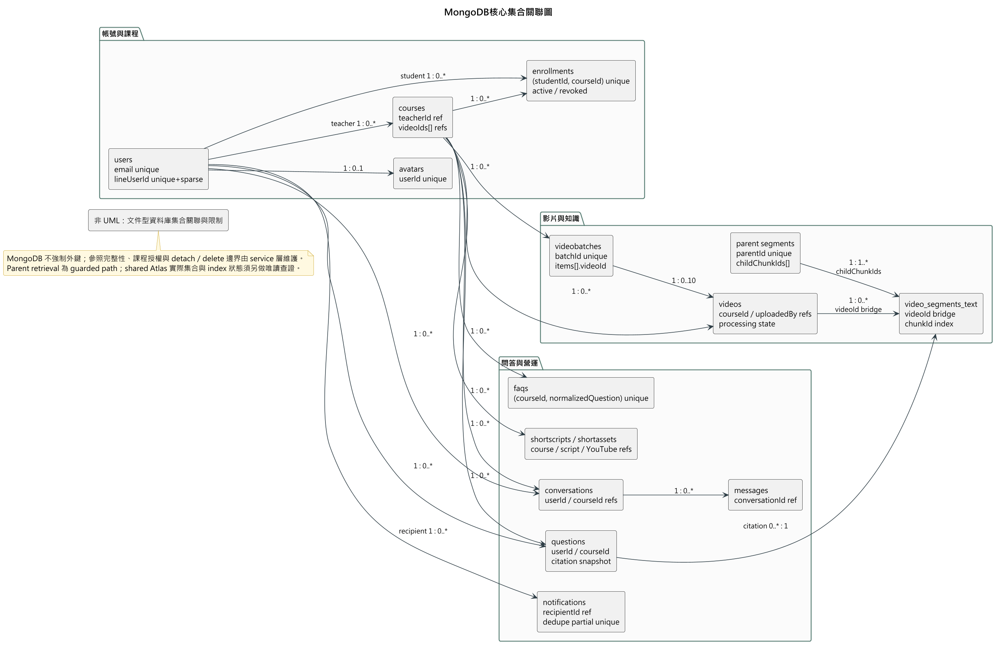

# 第8章 資料庫設計

> 本章依 2026-09-19 本機 `backend/src/models/`、Pipeline uploader 與 `database/tools/` 整理。這些是**程式碼宣告的資料契約**；未對 shared Atlas 執行讀取或寫入，故集合筆數、實際 index、Vector Search index 與資料品質均標示為未知，不能由本章推定為 production 狀態。

FocusFlow 使用 MongoDB。Mongoose schema 負責 app-owned 文件的欄位驗證及 source-declared index；跨集合關聯以 ObjectId、service 層權限判斷和應用程式流程維護，不具有關聯式資料庫的外鍵約束。Python Pipeline 及 database uploader 另有歷史／產物集合，必須遵守其欄位命名邊界。

[返回手冊索引](../README.md)

---

## 8-1 資料庫關聯表

### 核心關係與存取規則

表8-1-1　核心資料關係與存取規則

| 關係 | 實作方式與限制 |
| --- | --- |
| Teacher `1 ─ N` Course | `Course.teacherId → User._id`；課程另以 `videoIds[]` 保存已掛載影片的引用。 |
| Student `N ─ N` Course | `Enrollment.studentId` 與 `Enrollment.courseId`；複合 unique index 保證一名學生對同一課程只有一筆可復用關係。應用資料查詢須同時符合 active Enrollment 與 published Course；此規則不會自動保護目前匿名的 `/uploads` 靜態媒體路徑。 |
| Course `1 ─ N` Video | `Video.courseId` 與 Course 的 `videoIds[]` 共同支援查詢與掛載；service 層負責一致性、attach/detach 及刪除邊界。 |
| Video `1 ─ N` Leaf text segment | `video_segments_text.videoId` 是字串識別，通常與 `String(Video._id)` 的 bridge contract 對應；不能假定它永遠等於 `videos.videoId`。`courseId` 可能用於 scope，但既有資料是否完整需 live 查證。 |
| Parent `1 ─ N` Leaf | Parent 的 `childChunkIds[]` 有序指向 Leaf `chunkId`；兩者使用不同 collection／ID namespace。此路徑受 hierarchical retrieval gate 保護，目前不可當作已啟用主流程。 |
| User／Course `1 ─ N` Question、UsageLog | Question 記錄回答與引用快照，`sourceUsageLogId` 選擇性連到一次使用事件；UsageLog 是稽核歷史，刻意不設 TTL。 |
| Course `1 ─ N` FAQ／Notification／ShortAsset | FAQ 是課程快取；Notification 對 recipient 保存完成通知或公告；ShortAsset 保存 metadata／審核／封存，不代表完整短影音產線已完成。 |
| User `1 ─ 1` Avatar | `Avatar.userId` unique；二進位圖片不嵌入 User，User 只保存 mime type 和更新時間 metadata。 |

如圖8-1-1所示，核心集合依「帳號與課程」、「影片與知識」、「問答與營運」分組，箭頭表示文件中的識別欄位或有序 ID 清單，而非資料庫外鍵。圖中同時標出 Enrollment 複合唯一性、Avatar 一對一、VideoBatch 單批最多十項、Parent `childChunkIds[]` 及 Question citation snapshot 等重要契約。MongoDB 不會自動維護這些跨集合關係，因此 attach／detach、刪除、課程授權與資料回收仍由 service 層負責。

圖8-1-1 MongoDB核心集合關聯圖

> 本圖是文件型資料庫集合關聯圖，**不是 UML 類別圖或關聯式 ERD**。Parent retrieval 與 shared Atlas 實際集合／index 狀態仍須以唯讀 live evidence 驗證。

### 命名與混合資料邊界

- 新的 JavaScript／JSON／Mongoose 欄位原則上使用 **camelCase**，關聯欄位以 `xxxId` 命名。
- `video_segments_text` 是文字 QA Leaf collection，使用 `videoId`、`chunkId`、`startSec`、`endSec` 等 camelCase 欄位；`chunkId` 是目前 Leaf 的主要穩定識別。
- `video_segments_video` 仍是 pipeline／視覺 citation 邊界，使用 `video_id`、`clip_id`、`start_sec`、`end_sec`、`clip_path` 等 snake_case。它只支援 course-scoped visual citation，不是 caption QA 或正式剪輯／發布來源。
- `videos` 是暫時 mixed collection：app-owned record 以 `courseId`、`uploadedBy`、`title`、`processing.status` 等 camelCase 欄位辨識；歷史 Pipeline metadata 可見 `video_id` 等 snake_case 欄位。新程式不得因相容讀取而繼續寫入舊欄位。
- `database/tools/mongodb_uploader.py` 的 `segments` 模組以 `chunkId` upsert 並寫入符合 stable Leaf contract 的 camelCase 文件；同一工具的其他舊產物模組仍可能寫 pipeline snake_case metadata。`database/tools/legacy/import_video_segments_text.py` 會寫入不相容的 snake_case text fields，明確禁止作日常匯入。

## 8-2 表格及其 Metadata

### App-owned Mongoose collections

下表列出目前 schema 中可辨識的 collection、用途、核心欄位與**原始碼宣告**的限制。欄位的 `required`／enum 只在經 Mongoose 寫入且使用該 schema 時生效；它不會自動清理歷史文件。

表8-2-1　應用程式 Mongoose collections 與宣告限制

| Collection（Model） | 用途與核心欄位 | source-declared 限制／index |
| --- | --- | --- |
| `users`（User） | `name`、lowercase `email`、`passwordHash`、role、`isActive`、LINE 狀態、password-reset hash、avatar presence metadata。 | `email` unique；`lineUserId` unique+sparse；密碼雜湊及 LINE ID 不得回傳前端。 |
| `avatars`（Avatar） | 一人一筆圖片二進位 `data`、`mimeType`、`size`。 | `userId` required+unique；MIME 限 JPEG／PNG／WebP。 |
| `courses`（Course） | 課程名稱、描述、`teacherId`、`videoIds[]`、`draft/published/archived`、`deletedAt`。 | `teacherId` index；title、teacherId required。 |
| `enrollments`（Enrollment） | `studentId`、`courseId`、`active/revoked`、指派／撤銷稽核、progress、`watchedVideoIds[]`。 | `(studentId, courseId)` unique；progress 為 0–100。 |
| `videos`（Video） | App-owned 影片的來源、檔案／URL、`youtubeVideoId`、`youtubeUpload`、上傳者與 `processing` 子文件。 | `courseId`、`uploadedBy`、title、processing required；`videoId` unique+sparse；`courseId` 與 `(courseId,fileHash)` index。詳見 mixed boundary。 |
| `videobatches`（VideoBatch） | 多檔上傳 aggregate：`batchId`、course、建立者、items、`processingMode`、整體狀態。 | `batchId` unique；`courseId,createdAt` 及 `createdBy,createdAt` index；項目狀態保存上傳／處理失敗原因。 |
| `video_segments_text`（VideoSegment，名稱可由 env 覆寫） | 文字 QA Leaf：課程／影片／segment/chunk ID、時間、文字、embedding 及其完整產生契約。 | `courseId`、`segmentId`、`chunkId`、`videoId` 個別 index，另有 `(courseId,videoId)` index；embedding 維度及 Vector Search index 必須另外 live 確認。 |
| Parent segment collection（VideoSegmentParent，名稱由 env 指定） | Parent text、`childChunkIds[]`、範圍、3072 維 embedding、generation／fingerprint／active metadata。 | `parentId` unique；course/video、generation audit indexes。Parent publication 與 retrieval gate 尚未啟用。 |
| `video_segments_video`（VideoSegmentVideo，名稱可由 env 覆寫） | 視覺片段的 snake_case ID、路徑、時間與 embedding。 | `video_id`、`clip_id` index 由 schema 宣告；沒有 timestamps。不可與文字 segment 欄位混用。 |
| `questions`（Question） | 提問者、課程、問題、回答、來源、matches、runtime、query embedding、asked time。 | course/user/status/top segment 查詢 index、question+answer text index；`sourceUsageLogId` unique+sparse+partial index。 |
| `usage_logs`（UsageLog） | login／watch／ask 等歷史事件、user/course、duration、metadata、timestamp。 | user、course、timestamp index；**沒有 TTL**。 |
| `faqs`（Faq） | 課程題目快取、回答與引用快照、question embedding、命中統計。 | `(courseId,normalizedQuestion)` unique；`(courseId,hitCount)` index。快取命中前仍須重驗引用。 |
| `line_bind_tokens`（LineBindToken） | 一次性 token、使用者與到期時間。 | token unique；`expiresAt` TTL（0 秒）index；服務設定 token 到期時間。 |
| `notifications`（Notification） | 收件者、來源、內容、讀取狀態、關聯課程／影片及 dedupe key。 | recipient/read state 排序 indexes；`(recipientId,dedupeKey)` partial unique。 |
| `clips`（Clip） | 過渡期 clip URL、重點、跳轉與點擊數。 | `segmentId` unique；不是正式權威片段資料來源。 |
| `conversations`／`messages` | 會話及訊息紀錄：使用者、課程、訊息角色與狀態。 | Conversation 有 user/course/update-time index；Message 有 conversation/time 及 reply 關係 index。 |
| `shortscripts`／`shortassets` | 短影音腳本／成品的證據、版本、審核、揭露確認、YouTube metadata 與封存資料。 | Script 有 `(courseId,topicKey)` unique；Asset 有 feed 排序 index與 `youtubeVideoId` unique+sparse。程式存在不等於完整短影音製作與發布流程已完成。 |

### Pipeline 與 database tooling collections

表8-2-2　Pipeline 與 database tooling 資料契約

| 集合／產物 | 實際用途與契約邊界 |
| --- | --- |
| `transcripts_normalized` | Pipeline 正規化逐字稿產物，以 `video_id` 與內嵌 snake_case segments 為主。 |
| `term_dictionary` | STT 名詞修正資料；非使用者主流程資料。 |
| `video_segments_audio` | 音訊 embedding 產物；目前未接入 MVP text QA 主流程。 |
| `video_segments_video` | 視覺 embedding 產物；僅上述保守 visual citation 路徑使用。 |
| `raw_transcripts`、`stt_cache`、`video_segments` | setup／歷史工具可見的集合名稱；不可因腳本存在就稱 backend runtime 依賴。 |
| `runs/<runId>/manifest.json`、checkpoint、JSON／JSONL | Pipeline 的檔案系統產物，保存單次工作與 resume 狀態，不是 MongoDB collection。完成 publication 前不代表資料已可被 QA 使用。 |

### Index、Vector Search 與驗收邊界

`database/tools/setup/init_indexes.js` 是可執行的初始化**建議／寫入腳本**，不是 shared Atlas 現況證明；未經 DB owner 授權不得對 shared Atlas 執行。Mongoose 的 index 宣告也只描述 source，部署可能關閉 `autoIndex`。因此本次只可確認「程式希望有哪些 index」，不能確認 Atlas 實際有沒有建立、是否 READY、是否使用 IXSCAN，或資料是否符合 filter／embedding contract。

文字向量的目標契約是 `video_segments_text.embedding` 搭配 `text_embedding_index`，視覺向量為 `video_segments_video.embedding` 搭配 `video_embedding_index`；兩者都需要獨立的 Atlas live 查證。Parent 的 collection、filter、active generation、Leaf `chunkId` 分佈與 Parent→Child→citation read-only E2E 未重新驗證前，`HIERARCHICAL_RETRIEVAL_ENABLED` 必須保持 false。
