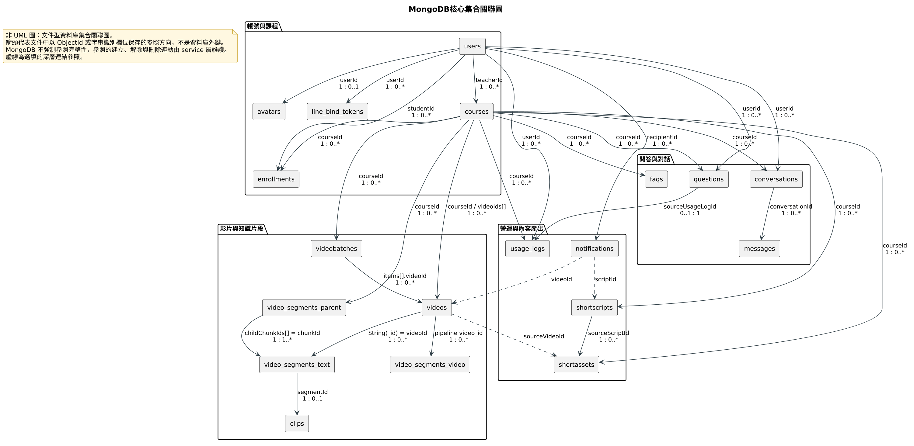

# 第8章 資料庫設計

FocusFlow 採用 MongoDB 文件型資料庫，透過 Node.js 端的 Mongoose ODM 定義綱要。選用文件型資料庫的理由有三：影片處理結果（逐字稿片段、向量、產生契約 metadata）欄位會隨 AI Pipeline 版本演進，需要能在不停機的情況下增修欄位；問答的引用快照、runtime 診斷資訊屬於巢狀且結構不固定的資料，以內嵌子文件保存比拆成多張關聯表更貼近使用方式；語意檢索所需的高維向量可直接以陣列欄位儲存，並由 Atlas Vector Search 建立索引。

本章分兩節。8-1 說明集合之間的參照關係與限制（Constraints），並以集合關聯圖呈現整體結構；8-2 逐一列出每個集合的欄位級 Meta data。兩節的內容一律以 `backend/src/models/` 目錄下的 19 份 Mongoose schema 原始碼為依據。

---

## 8-1 資料庫關聯圖

### 綱要與命名規則

| 項目 | 規則 |
| --- | --- |
| 集合命名 | Mongoose 預設將 Model 名稱轉為小寫複數（`User` → `users`）。需要對齊 AI Pipeline 既有契約的集合，在 schema 以 `collection` 選項明確指定，例如 `usage_logs`、`line_bind_tokens`、`video_segments_text`。 |
| 欄位命名 | JavaScript 與 JSON 一致採 camelCase；參照欄位命名為 `xxxId`。 |
| 主鍵 | 一律使用 MongoDB 自動產生的 `_id`（ObjectId），不另設代理鍵。 |
| 時間戳 | schema 啟用 `timestamps: true` 後自動維護 `createdAt` 與 `updatedAt`。 |
| 列舉值 | 一律集中定義於 `backend/src/constants/enums.js`，schema 以 `enum` 引用，避免字面值散落。 |

### 參照關係與限制（Constraints）

MongoDB **不提供外鍵與參照完整性檢查**。文件中的 `ObjectId` 欄位雖然以 Mongoose 的 `ref` 宣告關聯對象，但該宣告只供 `populate()` 查詢時解析用，資料庫本身不會阻止刪除被參照的文件，也不會自動連動刪除。因此本系統的所有跨集合參照都是**應用層維護的約定**：建立、解除與刪除連動一律由 service 層負責，例如影片自課程解除掛載時同步更新 `Course.videoIds`、刪除課程時清除該課程的問答快取。表8-1-1 的「維護層級」欄即標示每一條參照由哪一層保證。

表8-1-1　集合參照關係、基數與限制

| 參照關係 | 參照欄位 | 基數 | 限制（Constraints） | 維護層級 |
| --- | --- | --- | --- | --- |
| Course → User（授課教師） | `courses.teacherId` | 1 : 0..* | `teacherId` 必填；建有單欄索引供教師課程清單查詢 | 應用層 |
| Avatar → User | `avatars.userId` | 1 : 0..1 | `userId` 必填且唯一，資料庫層保證一人至多一張頭貼 | 資料庫層（唯一索引）＋應用層 |
| LineBindToken → User | `line_bind_tokens.userId` | 1 : 0..* | `token` 唯一；`expiresAt` 設 TTL 索引，到期文件由資料庫自動刪除 | 資料庫層（唯一索引、TTL）＋應用層 |
| Enrollment → Student、Course | `enrollments.studentId`、`enrollments.courseId` | N : M | `(studentId, courseId)` 複合唯一索引，一名學生對同一課程只保留一筆可重複啟用的關係；撤銷以 `status = revoked` 表示而非刪除 | 資料庫層（複合唯一索引）＋應用層 |
| Video → Course | `videos.courseId` 與 `courses.videoIds[]` | 1 : 0..* | 雙向記錄：課程端保有有序的 `videoIds[]`，影片端保有 `courseId`。兩者的一致性、掛載與解除掛載由 service 層維護 | 應用層 |
| VideoBatch → Course、Video | `videobatches.courseId`、`videobatches.items[].videoId` | 1 : 0..* | `batchId` 唯一；單批影片數量上限由 API 層驗證，不在 schema 層宣告 | 資料庫層（唯一索引）＋應用層 |
| VideoSegment（Leaf）→ Video | `video_segments_text.videoId`（字串） | 1 : 0..* | 以 `String(videos._id)` 為橋接鍵，非 ObjectId 型別；`videoId` 單欄索引與 `(courseId, videoId)` 複合索引支援課程範圍檢索 | 應用層（跨型別橋接） |
| VideoSegmentParent → VideoSegment（Leaf） | `video_segments_parent.childChunkIds[]` → `video_segments_text.chunkId` | 1 : 1..* | `childChunkIds` 必填且不得為空陣列，**順序本身是檢索契約的一部分**，不得排序或去重；`parentId` 唯一 | 應用層（含 schema validator） |
| Clip → VideoSegment | `clips.segmentId`（字串） | 1 : 0..1 | `segmentId` 必填且唯一 | 資料庫層（唯一索引）＋應用層 |
| Conversation → User、Course | `conversations.userId`、`conversations.courseId` | 1 : 0..* | 兩者皆必填並各自建索引，另有 `(userId, courseId, updatedAt)` 複合索引支援最近對話排序 | 應用層 |
| Message → Conversation、Message | `messages.conversationId`、`messages.replyToMessageId` | 1 : 0..* | `conversationId` 必填；`replyToMessageId` 為同集合自參照，指向被回覆的提問訊息 | 應用層 |
| Question → User、Course、UsageLog | `questions.userId`、`questions.courseId`、`questions.sourceUsageLogId` | 1 : 0..* | `sourceUsageLogId` 建 partial unique 索引（僅當值為 ObjectId 時納入索引），確保一筆使用紀錄至多回填一則提問 | 資料庫層（partial unique）＋應用層 |
| Faq → Course | `faqs.courseId` | 1 : 0..* | `(courseId, normalizedQuestion)` 複合唯一索引，同一課程的同一正規化問句只保留一筆快取 | 資料庫層（複合唯一索引）＋應用層 |
| UsageLog → User、Course | `usage_logs.userId`、`usage_logs.courseId` | 1 : 0..* | `userId` 必填、`courseId` 可為空（登入事件不屬於任何課程）；**刻意不設 TTL**，稽核歷史完整保留 | 應用層 |
| Notification → User、Course、Video、ShortScript | `notifications.recipientId`、`courseIds[]`、`videoId`、`scriptId` | 1 : 0..* | `(recipientId, dedupeKey)` partial unique 索引防止同一事件重複通知；系統公告不帶 `dedupeKey`，不參與該索引 | 資料庫層（partial unique）＋應用層 |
| ShortScript → Course | `shortscripts.courseId` | 1 : 0..* | `(courseId, topicKey)` 複合唯一索引，同一課程不重複產生相同主題的腳本 | 資料庫層（複合唯一索引）＋應用層 |
| ShortAsset → Course、Video、ShortScript | `shortassets.courseId`、`sourceVideoId`、`sourceScriptId`、`sourceVersionNo` | 1 : 0..* | `youtubeVideoId` 唯一且 sparse；`sourceScriptId` 搭配 `sourceVersionNo` 才能定位到腳本的特定版本 | 資料庫層（唯一索引）＋應用層 |

表8-1-2 彙整本系統在 schema 層實際使用的限制種類。除此之外的規則（例如單批上傳影片數量、每日提問次數上限、角色權限）屬於 API 與 service 層的業務限制，不寫入資料庫綱要。

表8-1-2　schema 層宣告的限制種類與使用位置

| 限制種類 | Mongoose 宣告 | 使用位置舉例 |
| --- | --- | --- |
| 必填 | `required: true` | 幾乎所有集合的識別與核心欄位 |
| 唯一 | `unique: true` | `users.email`、`videobatches.batchId`、`clips.segmentId` |
| 唯一（允許缺值） | `unique + sparse` | `users.lineUserId`、`videos.videoId`、`shortassets.youtubeVideoId` |
| 複合唯一 | `index({...}, { unique: true })` | `enrollments`、`faqs`、`shortscripts` |
| 條件式唯一 | `partialFilterExpression` | `questions.sourceUsageLogId`、`notifications.dedupeKey` |
| 列舉 | `enum` | 角色、課程狀態、處理狀態、審核狀態等 |
| 預設值 | `default` | 狀態欄位、計數欄位、陣列與子文件 |
| 數值範圍 | `min` / `max` | `enrollments.progress`（0～100）、各計數與秒數欄位（`min: 0`） |
| 字串長度 | `maxlength` | `notifications.title`（120）、`notifications.content`（2000）、`conversations.title`（120） |
| 自訂驗證 | `validate` | `video_segments_parent.childChunkIds`（非空陣列）、`embedding`（恰為 3072 個有限浮點數） |
| 自動過期 | TTL 索引 `expireAfterSeconds: 0` | `line_bind_tokens.expiresAt` |
| 字串正規化 | `trim` / `lowercase` | 所有字串欄位一律 `trim`；`users.email` 另加 `lowercase` |

### 集合關聯圖

如圖8-1-1所示，19 個應用集合依職責分為「帳號與課程」、「影片與知識片段」、「問答與對話」、「營運與內容產出」四組。實線箭頭代表文件中以 ObjectId 或字串識別欄位保存的參照方向並標註基數，虛線箭頭代表選填的深層連結參照（通知可指回觸發它的影片或腳本，成品可指回素材影片）。箭頭一律由「被參照方」指向「參照方」所屬集合，標籤即為持有參照值的欄位名稱。



圖8-1-1 MongoDB核心集合關聯圖

> 本圖是文件型資料庫的集合關聯圖，**不是 UML 類別圖，也不是關聯式 ERD**。圖中沒有外鍵符號，因為 MongoDB 不提供外鍵；圖中的每一條線都是應用層維護的參照約定。

## 8-2 表格及其 Meta data

本節逐一列出 19 個由 Mongoose schema 定義的集合。每張表的欄位意義如下：

- **欄位名稱**：文件中的欄位路徑。內嵌子文件以點號標示層級（例如 `processing.status`），陣列元素以 `[]` 標示（例如 `items[].itemId`）。
- **資料型態**：Mongoose 宣告的型別。文件型資料庫不宣告儲存長度，故本章不列「長度」欄；確有長度限制者（`maxlength`）列於「限制／索引」欄。
- **必填**：是否宣告 `required: true`。子文件內部的必填只在該子文件存在時生效。
- **預設值**：schema 宣告的 `default`；未宣告者以「—」表示。標示「欄位省略」者為刻意不寫入 `null`，以免 sparse 索引將顯式 `null` 納入索引。
- **限制／索引**：`enum`、`unique`、`min`／`max`、`maxlength`、`trim`、`ref` 與索引宣告。凡標示 `ref` 者，均為前述應用層維護的參照，資料庫不強制參照完整性。

所有集合的 `_id` 皆為 MongoDB 自動產生的 ObjectId 主鍵；啟用 `timestamps` 的集合另自動維護 `createdAt` 與 `updatedAt`，各表中合併為一列說明。

表8-2-1　集合總覽

| 編號 | Collection | Model | 中文名稱 | 用途 |
| --- | --- | --- | --- | --- |
| DB-01 | `users` | User | 使用者 | 帳號、角色、LINE 綁定狀態與密碼重設資料 |
| DB-02 | `avatars` | Avatar | 頭貼 | 頭貼圖片二進位本體，一人一筆 |
| DB-03 | `courses` | Course | 課程 | 課程基本資料、授課教師與已掛載影片清單 |
| DB-04 | `enrollments` | Enrollment | 修課關係 | 學生與課程的指派關係、觀看進度與撤銷稽核 |
| DB-05 | `videos` | Video | 影片 | 影片來源、檔案資訊、處理狀態與 YouTube 上傳狀態 |
| DB-06 | `videobatches` | VideoBatch | 影片批次 | 教師一次多檔上傳的批次彙總與逐檔結果 |
| DB-07 | `video_segments_text` | VideoSegment | 文字片段（Leaf） | 逐字稿切片、時間區間與文字向量，問答檢索的權威來源 |
| DB-08 | `video_segments_parent` | VideoSegmentParent | 上層片段（Parent） | 由多個 Leaf 聚合而成的上層脈絡片段與其向量 |
| DB-09 | `video_segments_video` | VideoSegmentVideo | 視覺片段 | 影像片段的路徑、時間區間與視覺向量 |
| DB-10 | `questions` | Question | 提問紀錄 | 每次提問的問題、回答、命中片段快照與執行環境 |
| DB-11 | `usage_logs` | UsageLog | 使用紀錄 | 登入、觀看、提問等事件的稽核歷史 |
| DB-12 | `faqs` | Faq | 問答快取 | 課程層級的常見問題快取與命中統計 |
| DB-13 | `line_bind_tokens` | LineBindToken | LINE 綁定權杖 | 一次性綁定權杖，到期自動刪除 |
| DB-14 | `notifications` | Notification | 站內通知 | 影片處理完成通知、系統公告與短影音退回通知 |
| DB-15 | `clips` | Clip | 精華片段 | 片段對應的播放連結、重點與跳轉網址 |
| DB-16 | `conversations` | Conversation | 對話 | 網頁多輪問答的對話容器 |
| DB-17 | `messages` | Message | 訊息 | 對話中的單則訊息、引用來源與回覆關係 |
| DB-18 | `shortscripts` | ShortScript | 短影音腳本 | 選題依據、凍結證據、多版腳本與審核狀態 |
| DB-19 | `shortassets` | ShortAsset | 短影音成品 | 成品審核、AI 揭露確認、YouTube 上架與封存資料 |

### DB-01 users

表8-2-2　`users` 欄位 Meta data（20 列）

| 欄位名稱 | 資料型態 | 必填 | 預設值 | 中文說明 | 限制／索引 |
| --- | --- | --- | --- | --- | --- |
| `_id` | ObjectId | 是 | 系統產生 | 使用者主鍵 | 主鍵 |
| `name` | String | 是 | — | 姓名 | `trim` |
| `email` | String | 是 | — | 登入信箱 | `trim`、`lowercase`、唯一索引 |
| `passwordHash` | String | 是 | — | bcrypt 密碼雜湊 | 不得出現在任何 API 回應 |
| `role` | String | 否 | `student` | 角色 | `enum`：`admin`／`teacher`／`student` |
| `isActive` | Boolean | 否 | `true` | 帳號是否啟用 | 停用帳號無法通過驗證 |
| `avatar` | 子文件 | 否 | `null` | 頭貼存在性 metadata | 子文件不配置 `_id`；圖片本體另存 `avatars` |
| `avatar.mimeType` | String | 是 | — | 頭貼影像格式 | `enum`：`image/jpeg`／`image/png`／`image/webp` |
| `avatar.updatedAt` | Date | 是 | — | 頭貼最後更新時間 | — |
| `lineUserId` | String | 否 | 欄位省略 | LINE 使用者識別碼 | `trim`、唯一＋sparse 索引；不得出現在 API 回應 |
| `lineBindAt` | Date | 否 | `null` | LINE 綁定完成時間 | — |
| `activeCourseId` | ObjectId | 否 | `null` | LINE 對話目前作用的課程 | `ref: Course`（應用層參照） |
| `lineConversationState` | String | 否 | `'idle'` | LINE 對話狀態 | — |
| `passwordReset` | 子文件 | 否 | `null` | 進行中的忘記密碼驗證 | 子文件不配置 `_id`；只保存雜湊 |
| `passwordReset.codeHash` | String | 是 | — | 驗證碼雜湊 | 不保存明碼 |
| `passwordReset.expiresAt` | Date | 是 | — | 驗證碼到期時間 | — |
| `passwordReset.attempts` | Number | 否 | `0` | 已嘗試次數 | 達上限後驗證碼作廢 |
| `passwordReset.requestedAt` | Date | 是 | — | 申請時間 | — |
| `lineConversationHistory[]` | 子文件陣列 | 否 | `[]` | LINE 多輪對話歷史 | 元素含 `role`（`enum`：`user`／`model`）與 `content`；服務層保留最近數則 |
| `createdAt`、`updatedAt` | Date | 是 | 自動維護 | 建立與更新時間 | `timestamps: true` |

### DB-02 avatars

表8-2-3　`avatars` 欄位 Meta data（6 列）

| 欄位名稱 | 資料型態 | 必填 | 預設值 | 中文說明 | 限制／索引 |
| --- | --- | --- | --- | --- | --- |
| `_id` | ObjectId | 是 | 系統產生 | 頭貼主鍵 | 主鍵 |
| `userId` | ObjectId | 是 | — | 所屬使用者 | `ref: User`；唯一索引，一人至多一筆 |
| `data` | Buffer | 是 | — | 圖片二進位內容 | 獨立集合儲存，避免每次讀取使用者都載入影像 |
| `mimeType` | String | 是 | — | 影像格式 | `enum`：`image/jpeg`／`image/png`／`image/webp` |
| `size` | Number | 是 | — | 檔案大小（位元組） | `min: 1` |
| `createdAt`、`updatedAt` | Date | 是 | 自動維護 | 建立與更新時間 | `timestamps: true` |

### DB-03 courses

表8-2-4　`courses` 欄位 Meta data（8 列）

| 欄位名稱 | 資料型態 | 必填 | 預設值 | 中文說明 | 限制／索引 |
| --- | --- | --- | --- | --- | --- |
| `_id` | ObjectId | 是 | 系統產生 | 課程主鍵 | 主鍵 |
| `title` | String | 是 | — | 課程名稱 | `trim` |
| `description` | String | 否 | `''` | 課程描述 | `trim` |
| `teacherId` | ObjectId | 是 | — | 授課教師 | `ref: User`；單欄索引 |
| `videoIds[]` | ObjectId 陣列 | 否 | `[]` | 已掛載影片的有序清單 | 元素 `ref: Video`；與 `videos.courseId` 互為對照 |
| `status` | String | 否 | `draft` | 課程狀態 | `enum`：`draft`／`published`／`archived` |
| `deletedAt` | Date | 否 | `null` | 軟刪除時間 | 非空即視為已刪除，資料保留供稽核 |
| `createdAt`、`updatedAt` | Date | 是 | 自動維護 | 建立與更新時間 | `timestamps: true` |

### DB-04 enrollments

表8-2-5　`enrollments` 欄位 Meta data（12 列）

| 欄位名稱 | 資料型態 | 必填 | 預設值 | 中文說明 | 限制／索引 |
| --- | --- | --- | --- | --- | --- |
| `_id` | ObjectId | 是 | 系統產生 | 修課關係主鍵 | 主鍵 |
| `studentId` | ObjectId | 是 | — | 學生 | `ref: User`；與 `courseId` 組成複合唯一索引 |
| `courseId` | ObjectId | 是 | — | 課程 | `ref: Course`；與 `studentId` 組成複合唯一索引 |
| `enrolledAt` | Date | 否 | `Date.now` | 加入課程時間 | — |
| `status` | String | 否 | `active` | 修課狀態 | `enum`：`active`／`revoked`；撤銷不刪除文件 |
| `assignedBy` | ObjectId | 否 | `null` | 指派者 | `ref: User` |
| `revokedAt` | Date | 否 | `null` | 撤銷時間 | — |
| `revokedBy` | ObjectId | 否 | `null` | 撤銷者 | `ref: User` |
| `progress` | Number | 否 | `0` | 觀看進度百分比 | `min: 0`、`max: 100` |
| `watchedVideoIds[]` | ObjectId 陣列 | 否 | `[]` | 已完成觀看的影片 | 用於計算進度 |
| `lineNotify` | Boolean | 否 | `false` | 是否接收 LINE 通知 | — |
| `createdAt`、`updatedAt` | Date | 是 | 自動維護 | 建立與更新時間 | `timestamps: true` |

> 複合唯一索引 `(studentId, courseId)` 同時使「指派學生」操作在重試時具冪等性：重複指派會落在同一筆文件上，而不會產生重複關係。

### DB-05 videos

表8-2-6　`videos` 欄位 Meta data（39 列）

| 欄位名稱 | 資料型態 | 必填 | 預設值 | 中文說明 | 限制／索引 |
| --- | --- | --- | --- | --- | --- |
| `_id` | ObjectId | 是 | 系統產生 | 影片主鍵 | 主鍵；其字串形式即片段的橋接鍵 |
| `courseId` | ObjectId | 是 | — | 所屬課程 | `ref: Course`；單欄索引，另與 `fileHash` 組複合索引 |
| `title` | String | 是 | — | 影片標題 | `trim` |
| `sourceType` | String | 否 | `upload` | 來源類型 | `enum`：`upload`／`external_url`／`youtube` |
| `sourceUrl` | String | 否 | `null` | 來源網址 | `trim` |
| `videoId` | String | 否 | 欄位省略 | Pipeline metadata 影片的外部識別碼 | `trim`、唯一＋sparse 索引 |
| `fileName` | String | 否 | `null` | 上傳檔名 | `trim` |
| `filePath` | String | 否 | `null` | 本機影片路徑 | `trim` |
| `audioPath` | String | 否 | `null` | 抽出音訊路徑 | `trim` |
| `durationSec` | Number | 否 | `null` | 影片長度（秒） | `min: 0` |
| `week` | Number | 否 | `null` | 週次 | `min: 0` |
| `lesson` | Number | 否 | `null` | 課次 | `min: 0` |
| `videoSource` | String | 否 | `null` | 來源描述 | `trim` |
| `videoUrl` | String | 否 | `null` | 播放網址 | `trim` |
| `youtubeVideoId` | String | 否 | `null` | YouTube 影片識別碼 | `trim` |
| `fileHash` | String | 否 | `null` | 檔案雜湊 | `trim`；與 `courseId` 組複合索引供同課程重複偵測 |
| `uploadedBy` | ObjectId | 是 | — | 上傳者 | `ref: User` |
| `processing` | 子文件 | 是 | — | 處理狀態彙總 | 子文件不配置 `_id` |
| `processing.status` | String | 是 | — | 處理狀態 | `enum`：`queued`／`processing`／`completed`／`failed` |
| `processing.errorMessage` | String | 否 | `null` | 失敗訊息 | `trim` |
| `processing.errorCode` | String | 否 | `null` | 失敗代碼 | `trim` |
| `processing.queuedAt` | Date | 否 | `null` | 排入佇列時間 | — |
| `processing.startedAt` | Date | 否 | `null` | 開始處理時間 | — |
| `processing.completedAt` | Date | 否 | `null` | 完成時間 | — |
| `processing.failedAt` | Date | 否 | `null` | 失敗時間 | — |
| `processing.attemptCount` | Number | 否 | `0` | 處理嘗試次數 | `min: 0` |
| `youtubeUpload` | 子文件 | 否 | `null` | 自動上傳 YouTube 的狀態 | 子文件不配置 `_id`；未啟用自動上傳時為 `null` |
| `youtubeUpload.status` | String | 是 | — | 上傳狀態 | `enum`：`uploading`／`uploaded`／`failed` |
| `youtubeUpload.error` | String | 否 | `null` | 失敗訊息 | `trim` |
| `youtubeUpload.uploadedAt` | Date | 否 | `null` | 上傳成功時間 | — |
| `youtubeUpload.attemptCount` | Number | 否 | `0` | 嘗試次數 | `min: 0` |
| `youtubeUpload.lastAttemptAt` | Date | 否 | `null` | 最近嘗試時間 | — |
| `youtubeUpload.failedAt` | Date | 否 | `null` | 失敗時間 | — |
| `youtubeUpload.retrySafe` | Boolean | 否 | `false` | 是否確定未送出影片內容 | 為 `false` 時不得自動重試，以免產生重複影片 |
| `youtubeUpload.nextRetryAt` | Date | 否 | `null` | 下次可重試時間 | — |
| `youtubeUpload.localCleanupAt` | Date | 否 | `null` | 本機檔案清理時間 | — |
| `youtubeUpload.localCleanupError` | String | 否 | `null` | 本機檔案清理失敗訊息 | `trim` |
| `deletedAt` | Date | 否 | `null` | 軟刪除時間 | — |
| `createdAt`、`updatedAt` | Date | 是 | 自動維護 | 建立與更新時間 | `timestamps: true` |

**混合集合邊界。** `videos` 是一個混合集合：除了由本系統建立的影片文件（app-owned）之外，同一集合也可能存在 AI Pipeline 產生的 metadata 文件。schema 因此提供兩個判別用的靜態方法：同時具備 `courseId`、`uploadedBy`、`title` 與 `processing.status` 者為 app-owned 文件；僅具備 `videoId`／`video_id` 而不符合前述條件者為 Pipeline metadata 文件。實務上 app-owned 影片**不寫入 `videoId` 欄位**，該欄位只出現在 Pipeline metadata 文件上。

**QA bridge contract。** 問答檢索的課程範圍沿以下路徑解析：

```text
courses.videoIds[] → videos._id → String(videos._id) → video_segments_text.videoId
```

也就是說，文字片段的 `videoId` 是**影片主鍵的字串形式**，不是 `videos.videoId` 欄位的值。以 `videos.videoId` 去連接 `video_segments_text` 會使所有 app-owned 影片對不到任何片段，這是本系統資料設計中最容易被誤解之處。視覺片段（`video_segments_video`）走另一條對應規則：其 `video_id` 採 Pipeline 的 `video_N` 命名，由影片文件的檔名、路徑或來源網址擷取後比對。

### DB-06 videobatches

表8-2-7　`videobatches` 欄位 Meta data（15 列）

| 欄位名稱 | 資料型態 | 必填 | 預設值 | 中文說明 | 限制／索引 |
| --- | --- | --- | --- | --- | --- |
| `_id` | ObjectId | 是 | 系統產生 | 批次主鍵 | 主鍵 |
| `batchId` | String | 是 | — | 批次識別碼 | `trim`、唯一索引；格式由 API 層驗證 |
| `courseId` | ObjectId | 是 | — | 所屬課程 | `ref: Course`；`(courseId, createdAt)` 複合索引 |
| `createdBy` | ObjectId | 是 | — | 建立者 | `ref: User`；`(createdBy, createdAt)` 複合索引 |
| `status` | String | 否 | `creating` | 批次整體狀態 | `enum`：`creating`／`processing`／`completed`／`partial`／`failed` |
| `processingMode` | String | 否 | `single_adapter` | 執行方式 | `enum`：`single_adapter`／`pipeline_batch` |
| `items[]` | 子文件陣列 | 否 | `[]` | 逐檔結果 | 元素不配置 `_id` |
| `items[].itemId` | String | 是 | — | 項目識別碼 | `trim` |
| `items[].originalName` | String | 是 | — | 原始檔名 | `trim` |
| `items[].title` | String | 是 | — | 影片標題 | `trim` |
| `items[].videoId` | ObjectId | 否 | `null` | 建立成功後對應的影片 | `ref: Video` |
| `items[].uploadStatus` | String | 是 | — | 該檔上傳結果 | `enum`：`uploaded`／`duplicate`／`failed` |
| `items[].errorCode` | String | 否 | `null` | 失敗代碼 | `trim` |
| `items[].errorMessage` | String | 否 | `null` | 失敗訊息 | `trim` |
| `createdAt`、`updatedAt` | Date | 是 | 自動維護 | 建立與更新時間 | `timestamps: true` |

> 批次狀態描述整體結果，個別項目另保有自己的上傳與處理狀態，因此部分成功的批次仍可逐檔觀察與重試。

### DB-07 video_segments_text

表8-2-8　`video_segments_text` 欄位 Meta data（20 列）

集合名稱由環境變數 `VIDEO_SEGMENT_COLLECTION` 決定，預設 `video_segments_text`，以便對齊 AI Pipeline 寫入的集合。

| 欄位名稱 | 資料型態 | 必填 | 預設值 | 中文說明 | 限制／索引 |
| --- | --- | --- | --- | --- | --- |
| `_id` | ObjectId | 是 | 系統產生 | 片段主鍵 | 主鍵 |
| `courseId` | ObjectId | 否 | `null` | 所屬課程 | `ref: Course`；單欄索引，另與 `videoId` 組複合索引 |
| `segmentId` | String | 否 | `null` | 早期片段識別碼 | `trim`、單欄索引 |
| `chunkId` | String | 否 | `null` | Leaf 片段的穩定識別碼 | `trim`、單欄索引；供 Parent 回查子片段 |
| `videoId` | String | 否 | `null` | 所屬影片（`String(videos._id)`） | `trim`、單欄索引；QA bridge contract 的橋接鍵 |
| `startSec` | Number | 否 | `null` | 片段起始秒數 | `min: 0` |
| `endSec` | Number | 否 | `null` | 片段結束秒數 | `min: 0` |
| `text` | String | 否 | `null` | 片段逐字稿文字 | `trim` |
| `corrections[]` | Mixed 陣列 | 否 | `[]` | 名詞修正紀錄 | 結構隨 Pipeline 版本演進，故不固定綱要 |
| `embedding[]` | Number 陣列 | 否 | `[]` | 文字向量 | 向量檢索的來源欄位 |
| `embeddingProvider` | String | 否 | `null` | 向量供應商 | `trim` |
| `embeddingModel` | String | 否 | `null` | 向量模型名稱 | `trim` |
| `embeddingDimension` | Number | 否 | `null` | 向量維度 | — |
| `embeddingTaskType` | String | 否 | `null` | 向量任務類型 | `trim`；僅供稽核既有資料 |
| `embeddingInstructionVersion` | String | 否 | `null` | 指令版本 | `trim` |
| `generationVersion` | String | 否 | `null` | 產生世代 | `trim` |
| `normalizationVersion` | String | 否 | `null` | 文字正規化版本 | `trim` |
| `embeddingContractVersion` | String | 否 | `null` | 向量契約版本 | `trim` |
| `embeddingSchemaVersion` | String | 否 | `null` | 向量綱要版本 | `trim` |
| `createdAt`、`updatedAt` | Date | 是 | 自動維護 | 建立與更新時間 | `timestamps: true` |

> 片段保存完整的向量產生契約（供應商、模型、維度、正規化與契約版本），而不只保存向量本身。維度相同並不足以證明兩批向量可互相比對，因此查詢端必須能判斷資料是否由相容的設定產生。

### DB-08 video_segments_parent

表8-2-9　`video_segments_parent` 欄位 Meta data（29 列）

集合名稱由環境變數 `VIDEO_SEGMENT_PARENT_COLLECTION` 決定，預設 `video_segments_parent`。Parent 與 Leaf 使用不同的識別碼命名空間，不共用集合。

| 欄位名稱 | 資料型態 | 必填 | 預設值 | 中文說明 | 限制／索引 |
| --- | --- | --- | --- | --- | --- |
| `_id` | ObjectId | 是 | 系統產生 | 上層片段主鍵 | 主鍵 |
| `parentId` | String | 是 | — | 上層片段識別碼 | `trim`、唯一索引；重跑同影片以此冪等覆寫 |
| `videoId` | String | 是 | — | 所屬影片（`String(videos._id)`） | `trim`；與 Leaf 同一命名空間 |
| `courseId` | ObjectId | 是 | — | 所屬課程 | `ref: Course`；`(courseId, videoId)` 複合索引 |
| `hierarchyLevel` | Number | 是 | `1` | 階層層級 | — |
| `documentType` | String | 是 | `parent_chunk` | 文件類型標記 | `trim` |
| `startSec` | Number | 是 | — | 起始秒數 | `min: 0` |
| `endSec` | Number | 是 | — | 結束秒數 | `min: 0` |
| `text` | String | 是 | — | 聚合後的上層文字 | — |
| `childChunkIds[]` | String 陣列 | 是 | — | 有序的子片段 `chunkId` 清單 | 自訂驗證：不得為空陣列；順序不得排序或去重 |
| `childCount` | Number | 是 | — | 子片段數量 | `min: 1` |
| `order` | Number | 是 | — | 於影片內的排序 | `min: 0` |
| `embedding[]` | Number 陣列 | 是 | — | 上層文字向量 | 自訂驗證：恰為 3072 個有限浮點數 |
| `embeddingProvider` | String | 否 | `null` | 向量供應商 | `trim` |
| `embeddingModel` | String | 否 | `null` | 向量模型名稱 | `trim` |
| `embeddingDimension` | Number | 是 | — | 向量維度 | `enum`：`3072` |
| `embeddingTaskType` | String | 否 | `null` | 向量任務類型 | `trim`；僅供稽核既有資料 |
| `embeddingSchemaVersion` | String | 否 | `null` | 向量綱要版本 | `trim` |
| `embeddingInstructionVersion` | String | 否 | `null` | 指令版本 | `trim` |
| `embeddingContractVersion` | String | 否 | `null` | 向量契約版本 | `trim` |
| `preprocessingVersion` | String | 否 | `null` | 前處理版本 | `trim` |
| `normalizationVersion` | String | 否 | `null` | 文字正規化版本 | `trim` |
| `hierarchyFingerprint` | String | 否 | `null` | 階層設定指紋 | `trim`；`(videoId, hierarchyFingerprint)` 複合索引 |
| `sourceLeafFingerprint` | String | 否 | `null` | 來源 Leaf 指紋 | `trim` |
| `parentEmbeddingFingerprint` | String | 否 | `null` | 上層向量指紋 | `trim` |
| `documentSchemaVersion` | String | 否 | `parent_document_v1` | 文件綱要版本 | `trim` |
| `generationVersion` | String | 否 | `null` | 產生世代 | `trim`；`(videoId, generationVersion, isActive)` 複合索引 |
| `isActive` | Boolean | 否 | `true` | 是否為目前可服務的世代 | 舊世代以此標記排除，不需刪除即可停止被檢索 |
| `createdAt`、`updatedAt` | Date | 是 | 自動維護 | 建立與更新時間 | `timestamps: true` |

> 檢索以 Leaf 片段為權威來源，Parent 提供上層脈絡；`generationVersion` 與 `isActive` 共同構成檢索過濾條件，使同一支影片重新處理後，舊世代的上層片段不會與新世代混用。

### DB-09 video_segments_video

表8-2-10　`video_segments_video` 欄位 Meta data（7 列）

集合名稱由環境變數 `VIDEO_SEGMENT_VIDEO_COLLECTION` 決定，預設 `video_segments_video`。此集合沿用 AI Pipeline 的 snake_case 欄位命名，是 19 個集合中唯一不採 camelCase 欄位命名者；其欄位不得與文字片段混用。

| 欄位名稱 | 資料型態 | 必填 | 預設值 | 中文說明 | 限制／索引 |
| --- | --- | --- | --- | --- | --- |
| `_id` | ObjectId | 是 | 系統產生 | 視覺片段主鍵 | 主鍵 |
| `video_id` | String | 否 | `null` | Pipeline 影片識別碼 | `trim`、單欄索引 |
| `clip_id` | String | 否 | `null` | 視覺片段識別碼 | `trim`、單欄索引 |
| `clip_path` | String | 否 | `null` | 片段檔案路徑 | `trim` |
| `start_sec` | Number | 否 | `null` | 起始秒數 | `min: 0` |
| `end_sec` | Number | 否 | `null` | 結束秒數 | `min: 0` |
| `embedding[]` | Number 陣列 | 否 | `[]` | 視覺向量 | 供課程範圍內的視覺引用使用 |

> 此集合**未啟用** `timestamps`，不記錄 `createdAt` 與 `updatedAt`：其文件由 Pipeline 整批覆寫，時間資訊改由執行產物側保存。

### DB-10 questions

表8-2-11　`questions` 欄位 Meta data（21 列）

| 欄位名稱 | 資料型態 | 必填 | 預設值 | 中文說明 | 限制／索引 |
| --- | --- | --- | --- | --- | --- |
| `_id` | ObjectId | 是 | 系統產生 | 提問主鍵 | 主鍵 |
| `userId` | ObjectId | 是 | — | 提問者 | `ref: User`；單欄索引，另有 `(userId, askedAt)` 複合索引 |
| `courseId` | ObjectId | 是 | — | 所屬課程 | `ref: Course`；單欄索引，另有多組以課程為首的複合索引 |
| `question` | String | 是 | — | 問題內容 | `trim`；與 `answer` 共同建立全文索引 |
| `answer` | String | 否 | `''` | 回答內容 | `trim`；與 `question` 共同建立全文索引 |
| `status` | String | 否 | `answered` | 回答結果 | `enum`：`answered`／`no_match`／`failed`；單欄索引 |
| `source` | String | 否 | `api` | 提問來源 | `enum`：`api`／`line`／`debug`；單欄索引 |
| `matchCount` | Number | 否 | `0` | 命中片段數 | `min: 0` |
| `topSegmentId` | String | 否 | `null` | 最相關片段識別碼 | `trim`、單欄索引；`(courseId, topSegmentId)` 複合索引 |
| `matches[]` | 子文件陣列 | 否 | `[]` | 命中片段快照 | 元素不配置 `_id`；為快照而非參照 |
| `matches[].segmentId` | String | 否 | `null` | 片段識別碼 | `trim` |
| `matches[].videoId` | String | 否 | `null` | 影片識別碼 | `trim` |
| `matches[].videoTitle` | String | 否 | `null` | 影片標題 | `trim` |
| `matches[].startSec` | Number | 否 | `null` | 片段起始秒數 | `min: 0` |
| `matches[].endSec` | Number | 否 | `null` | 片段結束秒數 | `min: 0` |
| `matches[].score` | Number | 否 | `null` | 相似度分數 | — |
| `runtime` | Mixed | 否 | `{}` | 執行環境與供應商診斷資訊 | 結構隨供應商設定而異，故不固定綱要 |
| `questionEmbedding[]` | Number 陣列 | 否 | `[]` | 問題向量 | 供同義題分群使用，沿用問答流程既有的向量 |
| `sourceUsageLogId` | ObjectId | 否 | 欄位省略 | 對應的使用事件 | `ref: UsageLog`；partial unique 索引（僅索引 ObjectId 值） |
| `askedAt` | Date | 否 | `Date.now` | 提問時間 | 單欄索引；多組複合索引以此遞減排序 |
| `createdAt`、`updatedAt` | Date | 是 | 自動維護 | 建立與更新時間 | `timestamps: true` |

> `matches[]` 保存的是回答當下的片段內容快照，而非指向片段文件的參照。影片其後被重新處理或刪除時，既有提問紀錄仍可完整重現當時的回答依據。

### DB-11 usage_logs

表8-2-12　`usage_logs` 欄位 Meta data（8 列）

| 欄位名稱 | 資料型態 | 必填 | 預設值 | 中文說明 | 限制／索引 |
| --- | --- | --- | --- | --- | --- |
| `_id` | ObjectId | 是 | 系統產生 | 使用紀錄主鍵 | 主鍵 |
| `userId` | ObjectId | 是 | — | 使用者 | `ref: User`；單欄索引 |
| `courseId` | ObjectId | 否 | `null` | 相關課程 | `ref: Course`；單欄索引；登入事件為 `null` |
| `event` | String | 是 | — | 事件類型 | `enum`：`login`／`watch`／`video_open`／`ask`／`clip_view`／`short_script_generate` |
| `durationSec` | Number | 否 | `null` | 事件持續秒數 | `min: 0` |
| `metadata` | Mixed | 否 | `{}` | 事件附帶資訊 | 依事件類型而異，故不固定綱要 |
| `timestamp` | Date | 否 | `Date.now` | 事件發生時間 | 單欄索引 |
| `createdAt`、`updatedAt` | Date | 是 | 自動維護 | 建立與更新時間 | `timestamps: true` |

> 本集合**刻意不設 TTL 索引**。使用紀錄屬於稽核歷史，刪除影片或課程時一併保留，後台統計與資料回填皆依賴完整歷史。`watch` 與 `video_open` 分開記錄：前者代表首次達成觀看完成門檻（用於進度計算），後者代表每一次點開播放（用於管理端統計）。

### DB-12 faqs

表8-2-13　`faqs` 欄位 Meta data（12 列）

| 欄位名稱 | 資料型態 | 必填 | 預設值 | 中文說明 | 限制／索引 |
| --- | --- | --- | --- | --- | --- |
| `_id` | ObjectId | 是 | 系統產生 | 快取主鍵 | 主鍵 |
| `courseId` | ObjectId | 是 | — | 所屬課程 | `ref: Course`；單欄索引 |
| `question` | String | 是 | — | 原始問句 | `trim` |
| `normalizedQuestion` | String | 是 | — | 正規化後問句 | `trim`；`(courseId, normalizedQuestion)` 複合唯一索引 |
| `answer` | String | 是 | — | 快取的回答 | `trim` |
| `matches[]` | Mixed 陣列 | 否 | `[]` | 引用片段快照 | 保留問答回應的完整形狀，故以 Mixed 儲存 |
| `clip` | Mixed | 否 | `null` | 精華片段快照 | 同上 |
| `questionEmbedding[]` | Number 陣列 | 否 | `[]` | 問題向量 | 供相似問句比對 |
| `hitCount` | Number | 否 | `0` | 命中次數 | `min: 0`；`(courseId, hitCount)` 複合索引供容量淘汰 |
| `lastHitAt` | Date | 否 | `null` | 最近命中時間 | — |
| `lastAnsweredAt` | Date | 否 | `null` | 最近重新作答時間 | — |
| `createdAt`、`updatedAt` | Date | 是 | 自動維護 | 建立與更新時間 | `timestamps: true` |

> 快取的失效採事件驅動而非時間驅動：影片刪除、影片重新處理完成、課程刪除、影片掛載或自課程移除，都會清除該課程的快取。`(courseId, hitCount)` 索引則支援單一課程快取數量超限時淘汰命中次數最低者。

### DB-13 line_bind_tokens

表8-2-14　`line_bind_tokens` 欄位 Meta data（5 列）

| 欄位名稱 | 資料型態 | 必填 | 預設值 | 中文說明 | 限制／索引 |
| --- | --- | --- | --- | --- | --- |
| `_id` | ObjectId | 是 | 系統產生 | 權杖主鍵 | 主鍵 |
| `token` | String | 是 | — | 一次性綁定權杖 | 唯一索引；由服務層產生隨機十六進位字串 |
| `userId` | ObjectId | 是 | — | 權杖所屬使用者 | `ref: User` |
| `createdAt` | Date | 否 | `Date.now` | 建立時間 | 本集合以顯式欄位記錄，未啟用 `timestamps` |
| `expiresAt` | Date | 是 | — | 到期時間 | TTL 索引 `expireAfterSeconds: 0`，到期文件由資料庫自動刪除 |

> TTL 索引使過期權杖不需應用層排程即自動清除，是本系統唯一由資料庫負責生命週期的集合。

### DB-14 notifications

表8-2-15　`notifications` 欄位 Meta data（13 列）

| 欄位名稱 | 資料型態 | 必填 | 預設值 | 中文說明 | 限制／索引 |
| --- | --- | --- | --- | --- | --- |
| `_id` | ObjectId | 是 | 系統產生 | 通知主鍵 | 主鍵 |
| `recipientId` | ObjectId | 是 | — | 收件者 | `ref: User`；為三組複合索引的首欄 |
| `source` | String | 是 | — | 通知來源 | `enum`：`video_completed`／`system_maintenance`／`short_asset_rejected` |
| `title` | String | 是 | — | 通知標題 | `trim`、`maxlength: 120` |
| `content` | String | 是 | — | 通知內容 | `trim`、`maxlength: 2000` |
| `urgent` | Boolean | 是 | `false` | 是否為緊急通知 | — |
| `readAt` | Date | 否 | `null` | 已讀時間 | `(recipientId, readAt, createdAt, _id)` 複合索引支援未讀篩選與游標分頁 |
| `createdBy` | ObjectId | 否 | `null` | 發送者 | `ref: User`；系統自動通知為 `null` |
| `courseIds[]` | ObjectId 陣列 | 是 | `[]` | 相關課程 | 元素 `ref: Course` |
| `videoId` | ObjectId | 否 | `null` | 相關影片 | `ref: Video`；供影片完成通知深層連結 |
| `scriptId` | ObjectId | 否 | `null` | 相關短影音腳本 | `ref: ShortScript`；供退回通知連回腳本 |
| `dedupeKey` | String | 否 | 欄位省略 | 去重鍵 | `trim`；`(recipientId, dedupeKey)` partial unique 索引（僅索引字串值） |
| `createdAt`、`updatedAt` | Date | 是 | 自動維護 | 建立與更新時間 | `timestamps: true` |

> `dedupeKey` 的 setter 會把 `null` 正規化為「欄位不存在」，使系統公告（刻意不帶去重鍵）不參與 partial unique 索引；同一事件的重複通知則由該索引在資料庫層擋下。

### DB-15 clips

表8-2-16　`clips` 欄位 Meta data（8 列）

| 欄位名稱 | 資料型態 | 必填 | 預設值 | 中文說明 | 限制／索引 |
| --- | --- | --- | --- | --- | --- |
| `_id` | ObjectId | 是 | 系統產生 | 精華片段主鍵 | 主鍵 |
| `segmentId` | String | 是 | — | 對應的片段識別碼 | `trim`、唯一索引 |
| `courseId` | ObjectId | 否 | `null` | 所屬課程 | `ref: Course` |
| `clipUrl` | String | 是 | — | 片段播放網址 | `trim` |
| `keyPoints[]` | String 陣列 | 否 | `[]` | 重點條列 | — |
| `jumpUrl` | String | 否 | `null` | 跳轉至原影片時間點的網址 | `trim` |
| `hitCount` | Number | 否 | `0` | 被引用次數 | `min: 0` |
| `createdAt`、`updatedAt` | Date | 是 | 自動維護 | 建立與更新時間 | `timestamps: true` |

### DB-16 conversations

表8-2-17　`conversations` 欄位 Meta data（5 列）

| 欄位名稱 | 資料型態 | 必填 | 預設值 | 中文說明 | 限制／索引 |
| --- | --- | --- | --- | --- | --- |
| `_id` | ObjectId | 是 | 系統產生 | 對話主鍵 | 主鍵 |
| `userId` | ObjectId | 是 | — | 對話擁有者 | `ref: User`；單欄索引 |
| `courseId` | ObjectId | 是 | — | 對話所屬課程 | `ref: Course`；單欄索引 |
| `title` | String | 否 | `新對話` | 對話標題 | `trim`、`maxlength: 120`；首次提問後由系統命名 |
| `createdAt`、`updatedAt` | Date | 是 | 自動維護 | 建立與更新時間 | `timestamps: true`；`(userId, courseId, updatedAt)` 複合索引支援最近對話排序 |

### DB-17 messages

表8-2-18　`messages` 欄位 Meta data（20 列）

| 欄位名稱 | 資料型態 | 必填 | 預設值 | 中文說明 | 限制／索引 |
| --- | --- | --- | --- | --- | --- |
| `_id` | ObjectId | 是 | 系統產生 | 訊息主鍵 | 主鍵 |
| `conversationId` | ObjectId | 是 | — | 所屬對話 | `ref: Conversation`；單欄索引，另有 `(conversationId, createdAt)` 複合索引 |
| `role` | String | 是 | — | 訊息角色 | `enum`：`user`／`assistant` |
| `content` | String | 是 | — | 訊息內容 | `trim` |
| `status` | String | 否 | `completed` | 訊息狀態 | `enum`：`pending`／`completed`／`failed`；單欄索引 |
| `replyToMessageId` | ObjectId | 否 | `null` | 所回覆的訊息 | `ref: Message`（同集合自參照）；`(conversationId, replyToMessageId)` 複合索引 |
| `errorCode` | String | 否 | `null` | 失敗代碼 | `trim` |
| `sources[]` | 子文件陣列 | 否 | `[]` | 引用來源快照 | 元素不配置 `_id` |
| `sources[].videoId` | String | 否 | `null` | 影片識別碼 | `trim` |
| `sources[].chunkId` | String | 否 | `null` | Leaf 片段識別碼 | `trim` |
| `sources[].segmentId` | String | 否 | `null` | 早期片段識別碼 | `trim` |
| `sources[].parentIds[]` | String 陣列 | 否 | `[]` | 對應的上層片段 | — |
| `sources[].startSec` | Number | 否 | `null` | 起始秒數 | `min: 0` |
| `sources[].endSec` | Number | 否 | `null` | 結束秒數 | `min: 0` |
| `sources[].videoTitle` | String | 否 | `null` | 影片標題 | `trim` |
| `sources[].transcript` | String | 否 | `''` | 引用的逐字稿文字 | `trim` |
| `sources[].score` | Number | 否 | `null` | 相似度分數 | — |
| `standaloneQuestion` | String | 否 | `null` | 改寫為獨立語意後的問句 | `trim`；多輪對話中用於檢索 |
| `runtime` | Mixed | 否 | `{}` | 執行環境診斷資訊 | 不固定綱要 |
| `createdAt`、`updatedAt` | Date | 是 | 自動維護 | 建立與更新時間 | `timestamps: true` |

### DB-18 shortscripts

表8-2-19　`shortscripts` 欄位 Meta data（33 列）

| 欄位名稱 | 資料型態 | 必填 | 預設值 | 中文說明 | 限制／索引 |
| --- | --- | --- | --- | --- | --- |
| `_id` | ObjectId | 是 | 系統產生 | 腳本主鍵 | 主鍵 |
| `courseId` | ObjectId | 是 | — | 所屬課程 | `ref: Course`；單欄索引 |
| `topic` | String | 是 | — | 主題名稱 | `trim` |
| `topicKey` | String | 是 | — | 主題正規化鍵 | `trim`；`(courseId, topicKey)` 複合唯一索引 |
| `sourceQuestions[]` | 子文件陣列 | 否 | `[]` | 合併前的原始提問 | 元素不配置 `_id`；來源為提問紀錄 |
| `sourceQuestions[].question` | String | 是 | — | 原始問句 | `trim` |
| `sourceQuestions[].askCount` | Number | 否 | `0` | 提問次數 | `min: 0` |
| `sourceQuestions[].uniqueAskerCount` | Number | 否 | `0` | 提問人數 | `min: 0`；比次數更能反映需求 |
| `selectionReason` | Mixed | 否 | `null` | 選題排名依據 | 供教師追溯為何選中此題 |
| `evidence[]` | 子文件陣列 | 否 | `[]` | 凍結的證據片段 | 元素不配置 `_id`；為快照而非參照 |
| `evidence[].code` | String | 是 | — | 證據編號 | `trim`；生成結果僅得引用此編號 |
| `evidence[].chunkId` | String | 是 | — | 來源 Leaf 片段識別碼 | `trim` |
| `evidence[].videoId` | String | 否 | `null` | 來源影片識別碼 | `trim` |
| `evidence[].videoTitle` | String | 否 | `null` | 來源影片標題 | `trim` |
| `evidence[].startSec` | Number | 否 | `null` | 起始秒數 | — |
| `evidence[].endSec` | Number | 否 | `null` | 結束秒數 | — |
| `evidence[].rawText` | String | 否 | `''` | 未修飾的逐字稿原文 | 不做自動糾錯，以保留可比對回原片段的能力 |
| `evidence[].expandedFrom` | String | 否 | `null` | 由哪一筆鄰接擴展而來 | `trim`；區分直接命中與擴展補入 |
| `evidenceFrozenAt` | Date | 否 | `null` | 證據凍結時間 | — |
| `versions[]` | 子文件陣列 | 否 | `[]` | 歷次腳本版本 | 元素不配置 `_id` |
| `versions[].versionNo` | Number | 是 | — | 版本序號 | `min: 1` |
| `versions[].payload` | Mixed | 否 | `null` | 腳本內容 | 結構依敘事格式而定 |
| `versions[].generatedAt` | Date | 否 | `null` | 生成時間 | — |
| `versions[].feedback` | String | 否 | `null` | 審核回饋 | `trim` |
| `versions[].feedbackType` | String | 否 | `null` | 回饋類型 | `enum`：`retrieval`／`narrative`／`null` |
| `versions[].reviewedBy` | ObjectId | 否 | `null` | 審核者 | `ref: User` |
| `versions[].reviewedAt` | Date | 否 | `null` | 審核時間 | — |
| `versions[].evidenceFrozenAt` | Date | 否 | `null` | 此版所用證據的凍結時間 | 檢索類回饋會重新凍結證據 |
| `versions[].rejectedAsAsset` | Boolean | 否 | `false` | 回饋是否來自成品被退回 | 區分腳本階段與成品階段發現的問題 |
| `status` | String | 否 | `evidence_ready` | 腳本狀態 | `enum`：`evidence_ready`／`generated`／`changes_requested`／`approved`／`dismissed`；單欄索引，另有 `(courseId, status, createdAt)` 複合索引 |
| `dismissReason` | String | 否 | `null` | 否決原因 | `trim`；留痕以免同一主題重複被選中 |
| `createdBy` | ObjectId | 否 | `null` | 建立者 | `ref: User` |
| `createdAt`、`updatedAt` | Date | 是 | 自動維護 | 建立與更新時間 | `timestamps: true` |

> `evidence[]` 是快照而非參照：來源影片其後被刪除、重新處理或自課程移除，都不影響已凍結的證據內容，腳本的引用因此始終可追溯。

### DB-19 shortassets

表8-2-20　`shortassets` 欄位 Meta data（43 列）

| 欄位名稱 | 資料型態 | 必填 | 預設值 | 中文說明 | 限制／索引 |
| --- | --- | --- | --- | --- | --- |
| `_id` | ObjectId | 是 | 系統產生 | 成品主鍵 | 主鍵 |
| `courseId` | ObjectId | 是 | — | 所屬課程 | `ref: Course`；為學生瀏覽用複合索引的首欄 |
| `sourceVideoId` | ObjectId | 否 | `null` | 素材影片 | `ref: Video` |
| `jobId` | String | 否 | `null` | 製作工作識別碼 | `trim` |
| `sourceScriptId` | ObjectId | 否 | `null` | 依據的腳本 | `ref: ShortScript`；單欄索引 |
| `sourceVersionNo` | Number | 否 | `null` | 依據的腳本版本 | `min: 1`；與 `sourceScriptId` 併用才能定位到正確版本 |
| `filePath` | String | 否 | `null` | 教師上傳的本機成品路徑 | `trim`；審核通過後上架時使用 |
| `disclosure` | 子文件 | 否 | 空物件 | AI 揭露與同意確認 | 子文件不配置 `_id` |
| `disclosure.aiDisclosureConfirmed` | Boolean | 否 | `false` | 已確認標示 AI 生成 | — |
| `disclosure.consentConfirmed` | Boolean | 否 | `false` | 已取得教師數位分身書面同意 | — |
| `disclosure.confirmedBy` | ObjectId | 否 | `null` | 確認者 | `ref: User` |
| `disclosure.confirmedAt` | Date | 否 | `null` | 確認時間 | — |
| `youtubeUpload` | 子文件 | 否 | 空物件 | 上架稽核紀錄 | 子文件不配置 `_id` |
| `youtubeUpload.status` | String | 否 | `null` | 上傳狀態 | `enum`：`uploading`／`uploaded`／`failed`／`null` |
| `youtubeUpload.error` | String | 否 | `null` | 失敗訊息 | `trim` |
| `youtubeUpload.attemptCount` | Number | 否 | `0` | 嘗試次數 | `min: 0` |
| `youtubeUpload.lastAttemptAt` | Date | 否 | `null` | 最近嘗試時間 | — |
| `youtubeUpload.uploadedAt` | Date | 否 | `null` | 上傳成功時間 | — |
| `youtubeUpload.failedAt` | Date | 否 | `null` | 失敗時間 | — |
| `youtubeUpload.retrySafe` | Boolean | 否 | `false` | 是否確定未送出影片內容 | 為 `false` 時不自動重試 |
| `title` | String | 是 | — | 成品標題 | `trim` |
| `description` | String | 否 | `''` | 成品描述 | `trim` |
| `status` | String | 否 | `draft` | 上架狀態 | `enum`：`draft`／`ready`／`published`／`archived` |
| `reviewStatus` | String | 否 | `pending` | 審核狀態 | `enum`：`pending`／`approved`／`rejected` |
| `reviewedBy` | ObjectId | 否 | `null` | 審核者 | `ref: User` |
| `reviewedAt` | Date | 否 | `null` | 審核時間 | — |
| `reviewReasons[]` | 子文件陣列 | 否 | `[]` | 審核意見 | 元素含 `code`（`enum`：`contentIncorrect`／`audioIssue`／`visualQuality`／`subtitleIssue`／`incomplete`／`other`）與 `note`（`trim`、`maxlength: 500`） |
| `generationVersion` | Number | 否 | `1` | 目前生成版本 | `min: 1` |
| `reviewedGenerationVersion` | Number | 否 | `null` | 已審核的生成版本 | `min: 1`；與 `generationVersion` 不一致時代表尚未審核當前版本 |
| `reviewHistory[]` | 子文件陣列 | 否 | `[]` | 歷次審核決定 | 元素含 `generationVersion`、`status`（不含 `pending`）、`reviewedBy`、`reviewedAt`、`reasons[]`，皆為必填 |
| `youtubeVideoId` | String | 否 | 欄位省略 | YouTube 影片識別碼 | `trim`、唯一＋sparse 索引 |
| `youtubeUrl` | String | 否 | `null` | YouTube 觀看網址 | `trim` |
| `thumbnail` | String | 否 | `null` | 縮圖網址 | `trim` |
| `publishedAt` | Date | 否 | `null` | 上架時間 | 為學生瀏覽複合索引的排序欄位 |
| `archivedAt` | Date | 否 | `null` | 封存時間 | — |
| `archivedBy` | ObjectId | 否 | `null` | 封存者 | `ref: User` |
| `archiveReason` | String | 否 | `null` | 封存原因 | `trim` |
| `statusBeforeArchive` | String | 否 | `null` | 封存前狀態 | `enum`：四種上架狀態或 `null`；供還原使用 |
| `courseSnapshot` | 子文件 | 否 | `null` | 課程快照 | 含 `courseId`、`title`、`teacherId`、`status`，皆為必填；課程其後更名不影響已發布成品的顯示 |
| `youtubeAvailability` | String | 否 | `pending` | 影片可播放性 | `enum`：`pending`／`playable`／`unavailable`／`unknown`；為學生瀏覽複合索引的一欄 |
| `youtubePrivacyStatus` | String | 否 | `unknown` | 影片隱私設定 | `enum`：`public`／`unlisted`／`private`／`unknown` |
| `lastCheckedAt` | Date | 否 | `null` | 最近同步 YouTube 狀態的時間 | — |
| `createdAt`、`updatedAt` | Date | 是 | 自動維護 | 建立與更新時間 | `timestamps: true` |

> 上架前必須先通過審核，且審核對象必須是當前的 `generationVersion`；`disclosure` 的兩項確認也必須完成。上傳至 YouTube 是不可逆的對外動作，因此這些前置條件與確認時間都寫入文件保留稽核軌跡。學生端瀏覽使用 `(courseId, status, youtubeAvailability, publishedAt, _id)` 複合索引，一次滿足課程範圍、上架狀態、可播放性過濾與游標分頁。

### AI Pipeline 與資料匯入工具的集合邊界

除上述 19 個由 Mongoose 定義的集合外，AI Pipeline 與資料匯入工具另有自己的集合與檔案產物。表8-2-21 列出這些邊界，供跨服務作業時對照；它們不由 backend runtime 讀寫。

表8-2-21　AI Pipeline 與匯入工具的集合／產物邊界

| 集合或產物 | 用途與欄位邊界 |
| --- | --- |
| `transcripts_normalized` | Pipeline 正規化逐字稿產物，以 `video_id` 與內嵌 snake_case segments 為主 |
| `term_dictionary` | 語音辨識的名詞修正字典，不屬於使用者主流程資料 |
| `video_segments_audio` | 音訊向量產物，不參與文字問答檢索 |
| `raw_transcripts`、`stt_cache`、`video_segments` | 初始化與歷史工具可見的集合名稱，屬 Pipeline 側的資料邊界 |
| `runs/<runId>/manifest.json`、checkpoint、JSON／JSONL | Pipeline 的檔案系統產物，保存單次執行與續跑狀態，不是 MongoDB 集合 |

匯入工具的命名邊界一併說明如下：`database/tools/mongodb_uploader.py` 的片段模組以 `chunkId` 進行 upsert，寫入符合 Leaf 契約的 camelCase 文件；`database/tools/legacy/` 下的舊版匯入程式寫入 snake_case 文字欄位，與目前的 `video_segments_text` 契約不相容，僅作歷史保存。

### 索引設計與向量檢索

本系統的索引依三類用途設計，皆在 Mongoose schema 中宣告，隨應用啟動時建立：

1. **唯一性保證**：`users.email`、`videobatches.batchId`、`clips.segmentId` 等單欄唯一索引，以及 `enrollments`、`faqs`、`shortscripts` 的複合唯一索引。這類索引把唯一性交給資料庫保證，service 層因而不需自行查重，重試也具冪等性。對於可以沒有值的欄位（`users.lineUserId`、`videos.videoId`、`shortassets.youtubeVideoId`）採 sparse 索引，並在寫入時省略欄位而非寫入 `null`，以免多筆顯式 `null` 互相衝突。`questions.sourceUsageLogId` 與 `notifications.dedupeKey` 則改用 partial 索引，只索引符合型別條件的文件。
2. **查詢與排序**：以查詢實際的過濾與排序組合建立複合索引，欄位順序與查詢一致。例如問答歷史以課程為範圍、時間遞減排序，故建 `(courseId, askedAt: -1)`；通知列表需同時過濾收件者與未讀狀態並以游標分頁，故建 `(recipientId, readAt, createdAt: -1, _id: -1)`；片段檢索先限定課程再限定影片，故建 `(courseId, videoId)`。`questions` 另建 `question` 與 `answer` 的全文索引，支援後台以關鍵字搜尋歷史問答。
3. **生命週期**：`line_bind_tokens.expiresAt` 的 TTL 索引使過期權杖自動刪除。其餘集合刻意不設 TTL——尤其 `usage_logs` 屬於稽核歷史，必須完整保留。

語意檢索由 MongoDB Atlas Vector Search 負責，採分集合設計：文字向量與視覺向量各自獨立，不共用集合也不共用索引。目標契約如表8-2-22。

表8-2-22　向量欄位與檢索索引契約

| 集合 | 向量欄位 | 目標索引名稱 | 維度 | 用途 |
| --- | --- | --- | --- | --- |
| `video_segments_text` | `embedding` | `text_embedding_index` | 依產生模型而定，記錄於 `embeddingDimension` | 文字問答的片段檢索 |
| `video_segments_parent` | `embedding` | 由環境變數指定 | 3072（schema 強制驗證） | 上層脈絡檢索 |
| `video_segments_video` | `embedding` | `video_embedding_index` | 依產生模型而定 | 課程範圍內的視覺引用 |

向量檢索有兩種執行模式，由環境變數切換：`atlas` 模式將過濾條件與相似度計算交給 Atlas Vector Search；`memory` 模式在應用程式內載入範圍內片段後計算相似度，供不具備 Atlas Vector Search 的本機開發環境使用。兩種模式共用同一組欄位契約，因此切換模式不需改變資料。
