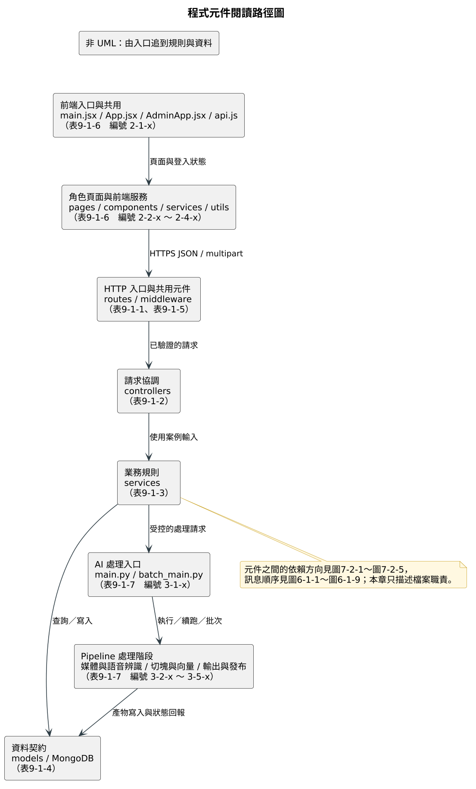

# 第9章 程式

> 本章列出 FocusFlow 三個服務的程式元件清單與規格描述，並擇優節錄能說明授權、狀態轉換與來源式回答的短程式片段，而非貼上完整原始碼。

[返回手冊索引](../README.md)

---

## 9-1 元件清單及其規格描述

### 元件編號規則與章節分工

元件編號採階層式 `層－類－序` 三碼：第一碼為服務（`1` Backend、`2` Frontend、`3` AI Pipeline），第二碼為該服務內的技術分層，第三碼為該分層內的流水號。例如 `1-3-33` 表示 Backend 服務層的第 33 個元件。表9-1-1 至表9-1-7 為完整檔案清單，表9-1-8 至表9-1-11 再對其中的代表性元件展開輸入、輸出、責任與邊界。

本章描述的是**檔案職責**，與相鄰章節的分工如下：元件之間的依賴方向見圖7-2-1 至圖7-2-5 的套件圖，元件之間的訊息順序見圖6-1-1 至圖6-1-9 的循序圖，狀態欄位的合法轉換見圖7-4-1 至圖7-4-5 的狀態機圖，資料欄位的完整儲存契約見 8-2 的集合 Meta data。本章不重述這些內容，需要時以圖號互指。

如圖9-1-1所示，程式閱讀應由前端入口與 session 開始，沿 HTTP route、middleware、controller、service 到 model 與 MongoDB；只有受控的業務流程才呼叫 Python Pipeline。圖中每一層對應下列清單中的一張表。此圖是閱讀與追溯指引，不是 UML 元件圖。



圖9-1-1 程式元件閱讀路徑圖

### Backend 程式元件清單

表9-1-1　Backend HTTP 路由層（`backend/src/routes/`）

| 編號 | 檔案名稱 | 功能 |
| --- | --- | --- |
| 1-1-1 | `index.js` | 匯集各模組 router 並掛載於 `/api/v1`；短影片腳本 router 需排在影片 router 之前，避免路徑被先行匹配。 |
| 1-1-2 | `auth.routes.js` | 宣告登入、自助註冊、忘記密碼兩階段、`/auth/me` 讀取與更新、密碼變更與頭像上傳／讀取路徑。 |
| 1-1-3 | `course.routes.js` | 宣告課程 CRUD、修課名單管理、觀看與點開進度回報、課程 FAQ 查詢與清除路徑。 |
| 1-1-4 | `video.routes.js` | 宣告影片建立（本機檔案或 YouTube 網址）、多檔批次上傳、查詢、處理重試、跨課程掛載與刪除路徑。 |
| 1-1-5 | `internal-video.routes.js` | 宣告 Pipeline 回報處理開始、完成與失敗的內部 webhook；以共享密鑰驗證，不掛 JWT。 |
| 1-1-6 | `qa.routes.js` | 宣告學生提問端點，先經 JWT 驗證再交由 QA controller。 |
| 1-1-7 | `conversation.routes.js` | 宣告多輪對話的建立、列表、訊息讀寫與單則訊息重新產生路徑。 |
| 1-1-8 | `line.routes.js` | 宣告 LINE webhook 驗證端點與事件接收、綁定碼發放與解除綁定路徑。 |
| 1-1-9 | `notification.routes.js` | 宣告站內通知列表、單筆已讀與全部已讀路徑。 |
| 1-1-10 | `stats.routes.js` | 宣告教師與學生儀表板統計查詢路徑，並依角色授權。 |
| 1-1-11 | `admin.routes.js` | 宣告管理員專用的統計、使用者、影片、事件、系統狀態查詢與公告發送路徑；整個 router 先驗管理員角色。 |
| 1-1-12 | `shorts.routes.js` | 宣告教師與管理員的短影片成品審核列表、單筆讀取與審核送出路徑。 |
| 1-1-13 | `short-script.routes.js` | 宣告短影片腳本候選、建立、版本生成、審核與成品上傳路徑；由 feature flag 決定整組路由是否存在。 |
| 1-1-14 | `youtube.routes.js` | 宣告學生端短影片清單查詢路徑。 |
| 1-1-15 | `health.routes.js` | 宣告 `/health`，回報資料庫、QA、LINE、短影片同步與 YouTube 上傳的 runtime 設定狀態。 |

表9-1-2　Backend 控制器層（`backend/src/controllers/`）

| 編號 | 檔案名稱 | 功能 |
| --- | --- | --- |
| 1-2-1 | `auth.controller.js` | 解析登入、註冊、密碼重設、個人資料與頭像請求，呼叫對應 service 後以統一格式回應。 |
| 1-2-2 | `course.controller.js` | 檢查課程標題等必要欄位，處理課程 CRUD 與觀看進度回報的請求與回應。 |
| 1-2-3 | `enrollment.controller.js` | 處理修課名單列表、指派、撤銷與批次匯入的 HTTP 邊界，授權規則留在 service。 |
| 1-2-4 | `video.controller.js` | 轉譯影片建立、查詢、處理狀態、重試、掛載與解除掛載，以及三個內部 processing webhook 的請求。 |
| 1-2-5 | `videoBatch.controller.js` | 處理多檔上傳批次的建立、查詢與單項重試，只回傳批次聚合而不外露 Pipeline 程序細節。 |
| 1-2-6 | `qa.controller.js` | 檢查課程 ID 與問題非空、偵測編碼損毀的輸入，再呼叫 QA service。 |
| 1-2-7 | `conversation.controller.js` | 解析對話與訊息請求參數，轉交對話 service。 |
| 1-2-8 | `line.controller.js` | 將 LINE webhook 的事件陣列交給 service 處理，並處理綁定碼發放與解除綁定。 |
| 1-2-9 | `notification.controller.js` | 在 HTTP 邊界解析並限制通知查詢參數，處理單筆與全部已讀。 |
| 1-2-10 | `faq.controller.js` | 處理課程 FAQ 快取的列表查詢與清除。 |
| 1-2-11 | `admin.controller.js` | 處理管理員統計、使用者管理、影片管理、近期事件與系統狀態查詢。 |
| 1-2-12 | `shorts.controller.js` | 處理短影片成品的審核列表、單筆讀取與審核結果送出。 |
| 1-2-13 | `shortScript.controller.js` | 處理腳本候選預覽、建立、版本生成、審核、成品上傳與上架重試。 |
| 1-2-14 | `youtube.controller.js` | 處理學生端短影片清單查詢與分頁參數。 |

表9-1-3　Backend 服務層（`backend/src/services/`）

| 編號 | 檔案名稱 | 功能 |
| --- | --- | --- |
| 1-3-1 | `admin.service.js` | 管理員總覽統計、使用者清單與角色／啟用狀態更新、影片清單與刪除、近期事件與事件統計。 |
| 1-3-2 | `answerGeneration.service.js` | 組裝回答 prompt 並呼叫回答 provider；集中定義「答不出來」罐頭字串與其辨識規則。 |
| 1-3-3 | `askLimits.service.js` | 提問字數上限與學生每日提問次數的共用檢查，以台北時間換日並合併網頁與 LINE 兩個入口。 |
| 1-3-4 | `auth.service.js` | 登入驗證、學生與教師自助註冊、取得目前使用者、修改密碼與個人資料。 |
| 1-3-5 | `avatar.service.js` | 以檔案簽章判斷頭像實際格式，將影像位元組寫入 `avatars` 集合並供授權讀取。 |
| 1-3-6 | `bridgeScope.service.js` | 建立課程與影片的片段查詢範圍，統一 `_id`、`videoId`、`video_id` 三種識別碼的對應。 |
| 1-3-7 | `childExpansion.service.js` | 由 Parent 命中結果回查對應 Leaf 片段，並在查詢與正規化後各做一次範圍過濾。 |
| 1-3-8 | `contextualQuestion.service.js` | 判斷追問句並依對話歷史補回主題，使代名詞式提問仍可檢索。 |
| 1-3-9 | `conversation.service.js` | 多輪對話的建立、訊息讀寫、重新產生回答與來源快照組裝。 |
| 1-3-10 | `conversationTurnAnalytics.service.js` | 以唯讀連線彙總網頁與 LINE 的完整問答輪次統計，並攔截任何寫入指令。 |
| 1-3-11 | `costControl.service.js` | 以月為單位彙總用量，超出設定額度時拒絕新的提問。 |
| 1-3-12 | `course.service.js` | 課程建立、查詢、更新、刪除與觀看進度記錄，並在刪除時一併清理影片與跨課程引用。 |
| 1-3-13 | `courseAccess.service.js` | 集中角色判斷、有效修課查詢，以及課程讀取權與管理權的斷言。 |
| 1-3-14 | `demoSeed.service.js` | 以固定 ID 建立可重複收斂的示範資料，並可保守回復示範基準而不動其他資料。 |
| 1-3-15 | `embeddingContract.service.js` | 定義 Backend、Pipeline 與資料庫必須一致的向量契約欄位與比較規則。 |
| 1-3-16 | `enrollment.service.js` | 修課關係的列表、指派（可重複執行）、撤銷與名單匯入。 |
| 1-3-17 | `faqCache.service.js` | FAQ 兩層快取：正規化文字完全命中與 embedding 相似度命中，並負責課程層失效與容量淘汰。 |
| 1-3-18 | `hierarchicalDataReadiness.service.js` | 以唯讀查詢比對 Parent、Leaf 與索引的契約一致性，作為階層式檢索的啟用條件。 |
| 1-3-19 | `hierarchicalRetrieval.service.js` | 串接 Parent 檢索與 Child 展開的檢索流程。 |
| 1-3-20 | `hierarchicalRollout.service.js` | 解析階層式檢索的推行模式與影片允許清單，決定實際採用的檢索路徑。 |
| 1-3-21 | `leafContextAssembly.service.js` | 將 Leaf 片段去重、依上限截斷後組成送入 prompt 的上下文。 |
| 1-3-22 | `leafContextSelection.service.js` | 在既有檢索結果上補入同影片的鄰接片段，並輸出取捨過程的診斷資訊。 |
| 1-3-23 | `line.service.js` | LINE 綁定碼產生與解除、webhook 事件處理、對話狀態機與課程切換選單。 |
| 1-3-24 | `loginThrottle.service.js` | 以 Email 為單位累計登入失敗次數，達上限時暫時鎖定並回傳一致的提示資訊。 |
| 1-3-25 | `mailer.service.js` | SMTP 寄信封裝；未設定寄信帳號時由呼叫端降級處理而非中止啟動。 |
| 1-3-26 | `mediaIntegrity.service.js` | 以容器簽章檢查上傳影片確實為合法的 MP4、MOV 或 MKV。 |
| 1-3-27 | `notification.service.js` | 站內通知的建立、列表、已讀、系統公告，以及影片處理完成時的去重擴散。 |
| 1-3-28 | `parentSearch.service.js` | Parent 向量檢索與命中結果的契約驗證。 |
| 1-3-29 | `parentSearchAdapter.service.js` | 組出 Parent 向量查詢管線並封裝資料庫錯誤，不外洩命名空間與連線細節。 |
| 1-3-30 | `parentVectorIndex.service.js` | Parent 集合的一般索引與向量索引定義及建立。 |
| 1-3-31 | `passwordReset.service.js` | 忘記密碼流程：寄出六位數驗證碼、只儲存雜湊、對未知 Email 回傳相同結果。 |
| 1-3-32 | `pilotUsageReport.service.js` | 產生只到次數層級的使用統計，不輸出姓名、Email 或提問內容。 |
| 1-3-33 | `qa.service.js` | 問答主流程：權限重驗、FAQ 快取、查詢向量、片段檢索、回答生成、引用組裝與紀錄寫入。 |
| 1-3-34 | `qaScopeMonitoring.service.js` | 檢索候選的範圍過濾，並記錄範圍為空的事件供追查。 |
| 1-3-35 | `queryEmbedding.service.js` | 產生查詢向量並固定輸出單位長度向量，使查詢與資料落在同一向量空間。 |
| 1-3-36 | `questionRecording.service.js` | 將提問、回答、命中片段、runtime 快照與來源用量紀錄寫入 `questions`。 |
| 1-3-37 | `retrievalEvaluation.service.js` | 以 Hit@K 與倒數排名等指標評估檢索結果並彙總。 |
| 1-3-38 | `runtimeDiagnostics.service.js` | 組出 `/health` 的 QA、LINE 與多模態 runtime 快照，設定不合法時直接回設定錯誤。 |
| 1-3-39 | `shortAsset.service.js` | 短影片成品的建立、審核、退回回饋、學生端清單與課程刪除時的封存。 |
| 1-3-40 | `shortAssetPublish.service.js` | 短影片成品上架流程：由腳本建立成品、上傳 YouTube、重試與退回後轉為私人。 |
| 1-3-41 | `shortScript.service.js` | 腳本建立與證據凍結、版本生成、審核狀態轉換與成品退回時的回寫。 |
| 1-3-42 | `shortScriptGeneration.service.js` | 八拍腳本生成與生成後驗證：引用必須落在本次證據包內，另檢查轉折、字幕長度與繁體字。 |
| 1-3-43 | `shortScriptTopic.service.js` | 由 `questions` 彙整候選主題並依熱度排序，排除已處理過的主題。 |
| 1-3-44 | `shortsSync.service.js` | 定期向 YouTube 同步短影片狀態與統計，含批次大小、重試與節流控制。 |
| 1-3-45 | `sttProcessLifecycle.service.js` | 管理 Pipeline 子程序的環境變數組裝、輸出記錄與結束碼描述。 |
| 1-3-46 | `studentPilotRuntime.service.js` | 讀取並驗證試用情境所需的 runtime 旗標組合。 |
| 1-3-47 | `systemStatus.service.js` | 由本程序可觀察的事實（資料庫連線、runtime 設定、Python 虛擬環境、處理佇列）組出系統服務狀態。 |
| 1-3-48 | `teacherStats.service.js` | 教師與學生儀表板統計，並將指向已刪除影片的歷史紀錄合併標示為內容已下架。 |
| 1-3-49 | `usageLog.service.js` | 寫入登入、提問、觀看等使用事件紀錄。 |
| 1-3-50 | `video.service.js` | 影片建立、查詢、刪除、跨課程掛載與解除、排程與重試 Pipeline，並解析 STT 虛擬環境的 Python 路徑。 |
| 1-3-51 | `videoBatch.service.js` | 多檔上傳批次的持久化聚合：逐項保存、部分失敗不回滾成功項、狀態由逐項結果彙整。 |
| 1-3-52 | `videoBatchProcessing.service.js` | 批次的本機程序邊界：原子寫出批次請求檔，啟動或續跑 Pipeline 子程序。 |
| 1-3-53 | `videoBatchReconciliation.service.js` | 以 Pipeline manifest 對帳批次狀態，先驗證識別與筆數再套用任何狀態轉換。 |
| 1-3-54 | `videoMigration.service.js` | 啟動時清理影片文件中明確為 null 的舊欄位殘留。 |
| 1-3-55 | `videoProcessing.service.js` | 影片處理狀態機，以及完成後的 FAQ 清除、通知擴散與 YouTube 上傳排程。 |
| 1-3-56 | `videoProcessingQueue.service.js` | 控制同時執行的影片處理數量並提供佇列快照。 |
| 1-3-57 | `videoVectorIndex.service.js` | 畫面片段集合的向量索引定義與建立。 |
| 1-3-58 | `youtube.service.js` | 讀取頻道上傳播放清單並以短期快取提供短影片清單。 |
| 1-3-59 | `youtubeUpload.service.js` | YouTube OAuth 取得存取權杖、上傳影片、刪除時轉為私人、上傳狀態快照與待辦上傳回復。 |

表9-1-4　Backend 資料模型層（`backend/src/models/`）

| 編號 | 檔案名稱 | 功能 |
| --- | --- | --- |
| 1-4-1 | `user.model.js` | 使用者帳號：姓名、Email、密碼雜湊、角色、啟用狀態、LINE 綁定、頭像存在與否及密碼重設暫存欄位。 |
| 1-4-2 | `course.model.js` | 課程：標題、說明、授課教師、發布狀態與已掛載影片的引用清單。 |
| 1-4-3 | `enrollment.model.js` | 修課關係：學生與課程的唯一關係，撤銷後可重新啟用而不遺失進度。 |
| 1-4-4 | `video.model.js` | 影片：課程歸屬、上傳者、來源、時長、處理狀態子文件與 YouTube 上傳狀態子文件。 |
| 1-4-5 | `videoBatch.model.js` | 影片批次：批次識別碼、課程、建立者、執行模式與逐項狀態。 |
| 1-4-6 | `videoSegment.model.js` | Leaf 文字片段：逐字稿、起訖秒數、向量與完整向量契約欄位；集合名稱由環境變數決定。 |
| 1-4-7 | `videoSegmentParent.model.js` | Parent 片段：涵蓋範圍、有序的子片段識別碼清單與向量契約欄位。 |
| 1-4-8 | `videoSegmentVideo.model.js` | 畫面片段：課程範圍內的畫面引用資料，集合名稱由環境變數決定。 |
| 1-4-9 | `question.model.js` | 提問紀錄：問題、回答、狀態、來源通道、命中片段快照、runtime 快照與提問向量。 |
| 1-4-10 | `conversation.model.js` | 對話：所屬課程、擁有者與標題。 |
| 1-4-11 | `message.model.js` | 對話訊息：角色、內容、狀態與引用來源子文件。 |
| 1-4-12 | `faq.model.js` | FAQ 快取：正規化問題、答案、命中次數、問題向量與 QA 回應快照。 |
| 1-4-13 | `usageLog.model.js` | 使用事件紀錄：使用者、課程、事件種類與時長，刻意不設存活期限。 |
| 1-4-14 | `notification.model.js` | 站內通知：接收者、種類、內容、已讀狀態與用於去重的部分唯一索引。 |
| 1-4-15 | `avatar.model.js` | 頭像影像本體：每位使用者一份文件，與 `users` 分離以免每次查詢攜帶影像位元組。 |
| 1-4-16 | `lineBindToken.model.js` | LINE 一次性綁定碼：隨機字串、所屬使用者與到期時間，以 TTL 索引自動清除。 |
| 1-4-17 | `clip.model.js` | 影片片段引用資料。 |
| 1-4-18 | `shortScript.model.js` | 短影片腳本：凍結證據片段、候選主題來源、八拍內容與審核狀態。 |
| 1-4-19 | `shortAsset.model.js` | 短影片成品：課程快照、審核歷程與原因、AI 揭露確認與上架稽核紀錄。 |

表9-1-5　Backend 應用程式入口與共用元件

| 編號 | 檔案名稱 | 功能 |
| --- | --- | --- |
| 1-5-1 | `src/server.js` | 連線資料庫、執行欄位遷移與可選示範資料植入、啟動排程與回復程序，最後啟動 Express。 |
| 1-5-2 | `src/app.js` | 建立 Express 應用：安全標頭、CORS、請求日誌、body 解析（保留原始 body 供簽章驗證）、API 文件與路由掛載。 |
| 1-5-3 | `src/docs/openapi.js` | 讀取 OpenAPI 規格與 Swagger UI 自訂樣式，供 `/docs` 使用。 |
| 1-5-4 | `config/env.js` | 集中讀取並檢核環境變數，明確解析 `.env` 位置，不依賴呼叫端的工作目錄。 |
| 1-5-5 | `config/database.js` | 建立與關閉 MongoDB 連線。 |
| 1-5-6 | `config/cors.js` | 依允許來源清單組出 CORS 選項。 |
| 1-5-7 | `constants/enums.js` | 集中角色、課程狀態、影片處理狀態、批次狀態、提問狀態與使用事件等列舉值。 |
| 1-5-8 | `middleware/auth.middleware.js` | 驗證 JWT 後重新查詢啟用中的使用者，將公開欄位掛到請求上。 |
| 1-5-9 | `middleware/role.middleware.js` | 依允許角色清單授權，必須排在認證 middleware 之後。 |
| 1-5-10 | `middleware/lineSignature.middleware.js` | 以原始請求本體計算 HMAC-SHA256 並比對 LINE 簽章標頭。 |
| 1-5-11 | `middleware/internalProcessingAuth.middleware.js` | 以共享密鑰驗證 Pipeline 回報 webhook，不使用 JWT。 |
| 1-5-12 | `middleware/upload.middleware.js` | 影片上傳限制：單檔與最多十檔的批次、副檔名與大小檢查、檔名解碼與失敗後清理。 |
| 1-5-13 | `middleware/avatarUpload.middleware.js` | 頭像上傳限制：單一檔案部分與位元組上限。 |
| 1-5-14 | `middleware/securityHeaders.middleware.js` | 為後端回應加上內容型別、框架嵌入、來源政策等安全標頭。 |
| 1-5-15 | `middleware/error.middleware.js` | 集中錯誤轉譯：輸出統一錯誤格式，僅在非正式環境回傳除錯細節。 |
| 1-5-16 | `middleware/notFound.middleware.js` | 未匹配路徑的 404 回應。 |
| 1-5-17 | `utils/apiResponse.js` | 組出統一的成功與錯誤回應結構。 |
| 1-5-18 | `utils/appError.js` | 帶 HTTP 狀態碼與錯誤代碼的應用錯誤類別。 |
| 1-5-19 | `utils/asyncHandler.js` | 包裝非同步 controller，使例外自動進入錯誤 middleware。 |
| 1-5-20 | `utils/objectId.js` | 驗證 MongoDB 識別碼格式，格式錯誤時拋出驗證錯誤。 |
| 1-5-21 | `utils/publicUser.js` | 以白名單輸出可對外的使用者欄位，排除密碼雜湊與 LINE 識別碼。 |
| 1-5-22 | `utils/vectorSimilarity.js` | 共用的餘弦相似度計算。 |
| 1-5-23 | `utils/textEncoding.js` | 偵測疑似編碼損毀的輸入文字。 |
| 1-5-24 | `utils/logPreview.js` | 截斷過長文字以供記錄，避免日誌塞入完整內容。 |
| 1-5-25 | `utils/logger.js` | 事件層級的警告記錄封裝。 |

`backend/src/data/` 內的兩份檢索評估資料集屬測試與評估素材，不列入本表；`backend/src/scripts/` 的維運與資料工具程式列於 9-2 的表9-2-1。

### Frontend 程式元件清單

表9-1-6　前端頁面與元件（`frontend/focus-flow/src/`）

| 編號 | 檔案名稱 | 功能 |
| --- | --- | --- |
| 2-1-1 | `main.jsx` | 應用程式進入點，依網址路徑決定掛載一般入口或獨立管理員入口。 |
| 2-1-2 | `App.jsx` | 一般入口：首頁、登入、學生與教師註冊，以及登入後的儀表板切換。 |
| 2-1-3 | `AdminApp.jsx` | 管理員入口：獨立登入畫面與管理員儀表板，非管理員帳號視為無權限而不強制登出。 |
| 2-1-4 | `api.js` | 集中 API 位址、權杖存取、請求送出與錯誤解析，並輸出後端來源位址。 |
| 2-1-5 | `authSession.js` | 以 `/auth/me` 還原登入狀態，區分匿名、已登入、憑證無效、服務暫時不可用與無權限五種結果。 |
| 2-2-1 | `components/DashboardApp.jsx` | 組合側邊欄、頂欄與角色頁面，是登入後的版面容器。 |
| 2-2-2 | `components/Sidebar.jsx` | 依角色顯示導覽項目與使用者資訊。 |
| 2-2-3 | `components/Topbar.jsx` | 頁面標題、通知選單、頭像顯示與腳本深層連結的接收。 |
| 2-2-4 | `components/navigationConfig.js` | 集中三種角色的導覽項目、角色標籤與頁面路徑對應。 |
| 2-2-5 | `components/LoginPage.jsx` | 一般登入表單，含身分選擇與忘記密碼入口。 |
| 2-2-6 | `components/AdminLoginPage.jsx` | 管理員專用登入表單。 |
| 2-2-7 | `components/RegisterPage.jsx` | 學生與教師自助註冊表單與欄位檢查。 |
| 2-2-8 | `components/ForgotPasswordModal.jsx` | 忘記密碼兩步驟對話框：寄送驗證碼與以驗證碼設定新密碼。 |
| 2-2-9 | `components/EnrollmentManagerModal.jsx` | 課程修課名單的查詢、加入與移除對話框。 |
| 2-2-10 | `components/IssueReportLauncher.jsx` | 問題回報入口，導向外部表單。 |
| 2-2-11 | `components/StepIndicator.jsx` | 多步驟流程的進度指示元件。 |
| 2-2-12 | `components/Icons.jsx` | 集中管理介面用的向量圖示。 |
| 2-2-13 | `components/Button3D.jsx` | 首頁使用的立體按鈕視覺元件。 |
| 2-2-14 | `components/BubbleScene.jsx` | 首頁 3D 角色與粒子場景。 |
| 2-2-15 | `components/LiquidGradientBg.jsx` | 首頁流動漸層背景。 |
| 2-3-1 | `pages/StudentDashboard.jsx` | 學生總覽：課程進度、提問統計與近期活動。 |
| 2-3-2 | `pages/StudentCourses.jsx` | 學生課程頁：影片播放、提問對話、引用片段展開與時間點跳轉。 |
| 2-3-3 | `pages/StudentLineBot.jsx` | LINE 綁定說明頁：顯示綁定碼與加入好友的 QR Code。 |
| 2-3-4 | `pages/StudentShortsWall.jsx` | 學生短影片牆：分頁載入已上架的教學短片。 |
| 2-3-5 | `pages/TeacherDashboard.jsx` | 教師總覽：課程、影片處理狀態與學生提問熱點。 |
| 2-3-6 | `pages/TeacherCourses.jsx` | 教師課程管理：建立與編輯課程、發布狀態切換、名單管理與影片列表。 |
| 2-3-7 | `pages/TeacherUpload.jsx` | 教師上傳頁：多檔選取、逐檔驗證與進度顯示，重新整理後可恢復追蹤。 |
| 2-3-8 | `pages/TeacherShortScripts.jsx` | 教師短影片腳本頁：候選主題、腳本生成、版本檢視與成品上傳。 |
| 2-3-9 | `pages/TeacherVideoReview.jsx` | 教師短影片成品審核頁：逐步檢視、退回原因勾選與審核送出。 |
| 2-3-10 | `pages/AdminOverview.jsx` | 管理員系統總覽：整體用量與系統服務狀態。 |
| 2-3-11 | `pages/AdminUsers.jsx` | 管理員使用者管理：角色與啟用狀態調整。 |
| 2-3-12 | `pages/AdminCourses.jsx` | 管理員課程管理與名單檢視。 |
| 2-3-13 | `pages/AdminVideos.jsx` | 管理員影片管理：處理狀態檢視與刪除。 |
| 2-3-14 | `pages/AdminStats.jsx` | 管理員使用統計：事件分布與趨勢。 |
| 2-3-15 | `pages/Profile.jsx` | 個人資料頁：姓名與 Email 修改、密碼變更與頭像更換。 |
| 2-3-16 | `pages/qaConversationUtils.js` | 問答訊息與來源清單的顯示轉換與截斷規則。 |
| 2-3-17 | `pages/teacherUploadUtils.js` | 上傳檔案的鍵值、大小格式化、副檔名與容量檢查與清單合併。 |
| 2-4-1 | `services/videoUpload.js` | 課程影片上傳的前端服務：逐檔送出並回報每一檔的狀態。 |
| 2-4-2 | `services/videoReview.js` | 短影片審核的 API 呼叫與退回原因代碼。 |
| 2-4-3 | `services/shortScript.js` | 短影片腳本的 API 呼叫，並可分辨「功能未啟用」與「資源不存在」。 |
| 2-4-4 | `services/shortScriptTemplate.js` | 將腳本資料組成可直接複製的完整腳本文字，固定章節寫在前端常數。 |
| 2-4-5 | `utils/avatarImage.js` | 依伺服器端中繼資料決定頭像版本並取得可顯示的影像位址。 |
| 2-4-6 | `utils/errorMessages.js` | 將後端錯誤代碼與狀態碼轉為使用者看得懂的中文訊息。 |
| 2-4-7 | `utils/pageRouting.js` | 頁面狀態與網址同步，使重新整理停在原頁、瀏覽器上一頁可返回。 |
| 2-4-8 | `utils/profileUser.js` | 個人資料表單狀態與登入狀態的同步。 |
| 2-4-9 | `utils/scriptDeepLink.js` | 跨頁面請求開啟指定腳本，同時支援尚未掛載與已掛載兩種情況。 |
| 2-4-10 | `utils/userDisplay.js` | 顯示名稱與歡迎詞的產生，資料不完整時不回退為固定示範身分。 |
| 2-4-11 | `hooks/useModalDialog.js` | 對話框共用行為：焦點限制、Esc 關閉、背景捲動鎖定與焦點還原。 |
| 2-4-12 | `constants/videoReviewReasons.js` | 短影片退回原因的代碼、標籤與填寫提示。 |

樣式檔（`App.css`、`index.css`）與圖片素材不屬於程式元件，不列入本表。

### AI Pipeline 程式元件清單

表9-1-7　AI Pipeline（`STT_Whisper/src/`）

| 編號 | 檔案名稱 | 功能 |
| --- | --- | --- |
| 3-1-1 | `main.py` | 單支影片的流程入口：音訊擷取、語音辨識、正規化、切塊、向量、產物驗證、上傳與處理狀態回報。 |
| 3-1-2 | `batch_main.py` | 批次入口：以既有單支流程為單位，支援批次輸入、批次請求檔與批次續跑。 |
| 3-1-3 | `batch_manager.py` | 批次 manifest 與摘要保存、併發上限、單支失敗隔離，並以跨程序租約避免同批次雙工作程序。 |
| 3-1-4 | `job_manager.py` | 單次執行的 manifest 保存，記錄每支影片與每個階段的狀態。 |
| 3-1-5 | `resume_checkpoint.py` | 續跑計畫與檢查點驗證，僅在產物合法時跳過已完成階段。 |
| 3-1-6 | `run_summary.py` | 執行摘要產物：階段結果統計與上傳結果紀錄。 |
| 3-1-7 | `config.py` | 由環境變數與命令列覆寫組成的設定層，並建立執行所需目錄。 |
| 3-1-8 | `utils.py` | 影片中繼資料與逐字稿片段的共用資料結構與輔助函式。 |
| 3-2-1 | `scan_videos.py` | 掃描來源影片、由目錄與檔名推斷課程欄位、讀取時長。 |
| 3-2-2 | `extract_audio.py` | 以 FFmpeg 產生 Whisper 可用的 16kHz 單聲道 WAV。 |
| 3-2-3 | `transcribe.py` | 以 faster-whisper 轉寫並提供逐字稿快取重用。 |
| 3-2-4 | `normalize_transcript.py` | 技術名詞正規化與修正歷程保存。 |
| 3-2-5 | `stt_accuracy.py` | 語音辨識設定指紋、診斷資訊與離線正確率指標。 |
| 3-3-1 | `chunking.py` | 以規則將逐字稿片段合併為適合語意檢索的 chunk。 |
| 3-3-2 | `chunk_strategy.py` | 切塊設定快照與決定性指紋，供續跑時比對。 |
| 3-3-3 | `embedding.py` | 文字與音訊 chunk 的 Gemini 向量產生與狀態記錄。 |
| 3-3-4 | `embedding_contract.py` | Pipeline 端的向量契約與檢索用文件格式。 |
| 3-3-5 | `debug_gemini_embedding.py` | 單筆向量請求的除錯輔助工具。 |
| 3-3-6 | `validate_gemini_embedding.py` | 向量輸出的離線驗證工具。 |
| 3-4-1 | `hierarchy_chunking.py` | 由既有 Leaf chunk 決定性推導第一層 Parent chunk。 |
| 3-4-2 | `hierarchy_strategy.py` | 階層設定的合法性驗證與指紋。 |
| 3-4-3 | `build_parent_chunk_artifact.py` | 產生並驗證 Parent chunk 產物。 |
| 3-4-4 | `parent_embedding.py` | Parent 向量產生，保持決定性順序並可續用已成功的結果。 |
| 3-4-5 | `parent_embedding_strategy.py` | Parent 向量的設定與指紋契約，含對階層設定的相依。 |
| 3-4-6 | `embed_parent_chunk_artifact.py` | 指定範圍的 Parent 向量生成命令列工具。 |
| 3-4-7 | `parent_mongodb_uploader.py` | Parent 產物驗證與 upsert 規劃，錯誤紀錄不含原文與向量。 |
| 3-4-8 | `publish_parent_embeddings.py` | 驗證與發布兩階段分離的 Parent 發布命令列工具。 |
| 3-5-1 | `export_outputs.py` | 標準 JSON 與 JSONL 輸出：影片中繼資料、逐字稿與正規化結果。 |
| 3-5-2 | `mongodb_uploader.py` | 將執行產物 upsert 進既有集合，並寫出逐集合的上傳報告。 |
| 3-5-3 | `rebuild_student_pilot_leaf_embeddings.py` | 固定範圍 Leaf 向量的重建工具，前置條件不符時直接停止。 |
| 3-5-4 | `video_multimodal_pipeline.py` | 短片畫面向量的側支流程。 |

`__init__.py` 為套件標記檔，不列入本表。

### 代表性元件規格描述

表9-1-1 至表9-1-7 為完整檔案清單；以下四表就其中最能說明系統邊界的元件，補充輸入、輸出、責任、錯誤處理與對應測試檔。

表9-1-8　應用程式入口與共用契約

| 元件／入口 | 輸入與輸出 | 主要責任 | 錯誤／安全邊界 | 對應測試檔 |
| --- | --- | --- | --- | --- |
| `backend/src/server.js` → `app.js` → `routes/index.js` | HTTP request → 標準 JSON response | 啟動 Express，掛載 `/api/v1` 模組、`/health` 與 API docs；路由分派到 controller。 | 受保護業務 API 使用 JWT 與角色授權；登入、註冊、密碼重設、health 與 docs 為公開端點；LINE webhook 驗簽，內部 processing webhook 驗共享密鑰。回應一律使用共用成功／錯誤格式。 | `docs.routes.test.js`、`health.routes.test.js`、各 route 測試。 |
| `frontend/focus-flow/src/main.jsx` | 瀏覽器網址 → `App` 或 `AdminApp` | 僅將 `/admin` 導向獨立管理員入口，其餘進一般入口。 | 網址分流是版面選擇，不取代後端角色授權。 | `authSession.test.js`、`pageRouting.test.js`。 |
| `frontend/focus-flow/src/api.js: apiFetch()` | 路徑、請求選項、本地權杖 → 解析後 JSON 或含狀態碼與錯誤碼的 Error | 集中 API 位址、Bearer 權杖注入與失敗回應解析。 | 前端持有權杖不是授權證明；後端每次請求都重驗 JWT 與權限。 | `errorMessages.test.js` 與各呼叫頁面測試。 |
| `frontend/focus-flow/src/authSession.js: restoreAuthSession()` | 已儲存權杖、`/auth/me` → 匿名／已登入／憑證無效／服務不可用 | 在畫面啟動時以伺服器端使用者資料還原登入狀態。 | 僅 401 與 403 清除憑證；網路或 5xx 保留可重試的登入狀態。`requireAdminSession()` 讓非管理員為無權限，而不強制登出。 | `authSession.test.js`、`avatarSync.test.js`。 |

表9-1-9　課程、影片與處理元件規格

| 元件／函式 | 輸入與輸出 | 主要責任 | 錯誤／邊界 | 對應測試檔 |
| --- | --- | --- | --- | --- |
| `video.routes.js`、`video.controller.js` | 單檔、YouTube 網址或批次 multipart 請求 → 影片或批次呈現資料 | 宣告教師與管理員的建立、讀取、重試、掛載與解除、刪除及多檔上傳路徑。 | 單一批次最多十檔；route 層先驗 JWT、角色與檔案格式。 | `course-video.routes.test.js`、`video-batch.routes.test.js`。 |
| `video.service.js: createCourseVideo()`、`createCourseVideoFromYouTube()` | 課程、來源檔或網址、中繼資料、使用者 → 課程所屬影片 | 驗證課程管理權、建立 `processing.queued` 狀態，再安排單支 Pipeline 執行。 | 影片建立成功與 Pipeline 執行成功是兩個獨立結果；排程失敗會保留可診斷的失敗狀態。 | `course-video.routes.test.js`、`video-processing-queue.service.test.js`。 |
| `videoBatch.service.js: createVideoBatch()` | 課程、最多十個檔案、標題、使用者 → 批次紀錄與逐檔結果 | 保存持久化批次、處理部分上傳失敗，並依設定選擇單支排程或批次 Pipeline 兩種執行模式。 | 兩種執行模式提供相同的批次 API 呈現，前端不需知道實際執行者；已成功的項目不因其他項目失敗而回滾。 | `video-batch.routes.test.js`、`video-batch-processing.service.test.js`。 |
| `videoProcessing.service.js: start/complete/fail/retryVideoProcessing()` | 影片 ID、webhook 中繼資料 → 更新後的處理中繼資料 | 實作 `queued → processing → completed/failed` 與 `failed → queued`，完成時處理 FAQ 清除、通知與可選的 YouTube 排程。 | 拒絕非法轉換並回 409；start 與 complete webhook 可冪等重送；內部路由需 `X-Processing-Secret` 而非 JWT。合法轉換見圖7-4-3。 | `stt-process-lifecycle.service.test.js`、`course-video.routes.test.js`、`youtube-upload.service.test.js`。 |
| `videoUpload.js: uploadCourseVideos()` | 課程、檔案項目、狀態回呼 → 逐檔上傳結果與介面狀態 | 前端保留項目順序並驗證回傳格式，使重新整理後仍可恢復追蹤。 | 後端回應成功但格式無法追蹤時視為錯誤，避免顯示假成功。 | `videoUpload.test.js`、`teacherUploadUtils.test.js`。 |

表9-1-10　QA 與 LINE 元件規格

| 元件／函式 | 輸入與輸出 | 主要責任 | 錯誤／邊界 | 對應測試檔 |
| --- | --- | --- | --- | --- |
| `qa.routes.js` → `qa.controller.js` → `qa.service.js: askQuestion()` | 已登入使用者、課程 ID、問題 → 回答、引用、回答狀態、runtime | 重驗課程存取範圍，依序使用 FAQ 快取、查詢向量、Leaf 檢索與回答生成，並寫入提問與用量紀錄。 | 學生須具備有效修課且課程已發布；證據不足時回傳無答案訊號而非虛構內容。對外引用契約為 `citations`，`matches[]` 為相容欄位。 | `qa.routes.test.js`、`qa.service.test.js`、`citation-contract.test.js`、`faq-cache.service.test.js`。 |
| `qa.service.js: searchSegmentsWithAtlas()`、`searchSegmentsInMemory()` | 範圍內影片與課程、查詢向量或文字 → 排序後的命中片段 | 分別提供 Atlas 向量檢索與本機記憶體檢索兩條路徑。 | 索引名稱、向量契約、過濾欄位與資料範圍任一不符時即拒絕檢索，不以降級結果冒充命中。 | `qa.service.test.js`、`query-embedding.service.test.js`、`qa-retrieve-only.service.test.js`。 |
| `line.routes.js`、`lineSignature.middleware.js`、`line.service.js` | LINE 簽章事件或綁定請求 → 回覆訊息或綁定結果 | 簽章驗證、一次性綁定碼、課程切換與共用 QA 流程的轉接。 | 以原始請求本體計算 HMAC-SHA256；綁定碼有存活期限；訊息順序見圖6-1-5。 | `line.routes.test.js`。 |
| `questionRecording.service.js` 與 `usageLog.model.js` | QA 結果、使用者、課程 → 提問紀錄與用量紀錄 | 保存問答內容、命中片段與 runtime 快照，以及對應的用量紀錄識別碼。 | 這些紀錄供統計與追溯使用，不作為對外揭露模型推理過程的介面。 | `qa.routes.test.js`、`conversation-turn-analytics.test.js`。 |

表9-1-11　Pipeline、檢索資料與交接元件規格

| 元件／入口 | 輸入與輸出 | 主要責任 | 錯誤／邊界 | 對應測試檔 |
| --- | --- | --- | --- | --- |
| `STT_Whisper/src/main.py` | 影片路徑或 YouTube 網址、選用 `--video-id`、`--resume-run-id` → 執行產物、摘要、結束碼 | 執行音訊擷取、語音辨識、正規化、Leaf 切塊、向量、產物驗證、上傳與處理狀態回報。 | webhook 缺設定或失敗僅記錄警告；資料庫上傳失敗使整次執行標記失敗並保留摘要。 | `test_job_manager.py`、`test_resume_checkpoint.py`、`test_mongodb_uploader.py`。 |
| `job_manager.py`、`resume_checkpoint.py` | 執行 manifest、階段結果、產物指紋 → 可恢復的續跑計畫 | 保存每支影片與每個階段的狀態，僅在產物合法時跳過已完成階段。 | 續跑前比對 manifest 與設定指紋，指紋不符即重跑該階段。 | `test_job_manager.py`、`test_resume_checkpoint.py`。 |
| `batch_main.py`、`batch_manager.py` | `--batch-input`、`--batch-request`、`--batch-resume` → 批次 manifest、摘要、結束碼 | 建立或恢復有界批次，以執行租約防止同批次雙工作程序；限制併發數並提供逐項重試。 | 無效請求或重複工作程序以非零結束碼安全停止，不改動既有批次狀態。 | `test_batch_manager.py`。 |
| `STT_Whisper/src/mongodb_uploader.py: upload_all()` | 已驗證的執行產物 → MongoDB upsert 報告 | 依設定將 Pipeline 產物寫入既有集合，並輸出上傳摘要。 | 每次上傳都產生逐集合的計數報告，作為寫入結果的判讀依據。 | `test_mongodb_uploader.py`、`test_parent_mongodb_uploader.py`。 |
| `database/tools/mongodb_uploader.py` | 既有輸出與 `.env` → 各集合 upsert | 日常資料匯入工具；文字片段以 camelCase `chunkId` 寫入 Leaf 契約。 | 同目錄的歷史工具沿用 Pipeline 的 snake_case 欄位命名，兩者的欄位契約不可互換使用。 | 由 Pipeline 上傳測試與 8-2 的集合契約共同約束。 |

### 代表性程式片段

以下片段只保留能解釋設計決策的核心分支，讓讀者可由規格敘述回查實際規則。完整程式、錯誤處理與測試以各原始檔為準。

**（一）Session 還原只在 401／403 清除憑證**

用途：`frontend/focus-flow/src/authSession.js` 將權杖無效與暫時性服務錯誤分開，避免斷網或 API 5xx 時把仍可能有效的登入狀態誤刪。

```javascript
export function isInvalidSessionError(error) {
  return error?.status === 401 || error?.status === 403;
}

try {
  const response = await apiFetchImpl('/auth/me');
  const user = response?.data?.user;
  // 省略：成功但缺少公開 user 契約時視為服務不可用
  setUserImpl(user);
  return { status: AUTH_SESSION_STATUS.AUTHENTICATED, user };
} catch (error) {
  if (isInvalidSessionError(error)) {
    clearTokenImpl();
    clearUserImpl();
    return { status: AUTH_SESSION_STATUS.INVALID, error };
  }
  return { status: AUTH_SESSION_STATUS.UNAVAILABLE, error };
}
```

**（二）影片處理 webhook 同時檢查合法前態與冪等重送**

用途：`backend/src/services/videoProcessing.service.js` 只允許 `queued` 進入 `processing`，重送 start 事件直接承認而不重複累計嘗試次數；完成事件亦可安全重送，用於修復通知或快取等副作用。

```javascript
// startVideoProcessing()
if (currentStatus === VIDEO_PROCESSING_STATUSES.PROCESSING) {
  return video;
}
if (currentStatus !== VIDEO_PROCESSING_STATUSES.QUEUED) {
  throw createTransitionError(currentStatus, VIDEO_PROCESSING_STATUSES.PROCESSING);
}

// completeVideoProcessing()
if (currentStatus === VIDEO_PROCESSING_STATUSES.COMPLETED) {
  await runCompletionSideEffects(video);
  return video;
}
if (currentStatus !== VIDEO_PROCESSING_STATUSES.PROCESSING) {
  throw createTransitionError(currentStatus, VIDEO_PROCESSING_STATUSES.COMPLETED);
}
```

**（三）批次狀態由逐項結果彙整，不回滾成功項目**

用途：`backend/src/services/videoBatch.service.js` 先計算已達終態的項目數，再區分完成、部分完成與失敗；因此部分失敗可被保存並只針對失敗項重試。

```javascript
function deriveBatchStatus(items) {
  const completed = items.filter(
    (item) => item.processingStatus === VIDEO_PROCESSING_STATUSES.COMPLETED,
  ).length;
  const failed = items.filter(
    (item) => item.status === VIDEO_BATCH_STATUSES.FAILED,
  ).length;
  const terminal = completed + failed;
  if (terminal < items.length) return VIDEO_BATCH_STATUSES.PROCESSING;
  if (completed && failed) return VIDEO_BATCH_STATUSES.PARTIAL;
  if (completed) return VIDEO_BATCH_STATUSES.COMPLETED;
  return VIDEO_BATCH_STATUSES.FAILED;
}
```

**（四）來源不足的回答不進 FAQ 快取，並以無命中狀態記錄**

用途：`backend/src/services/qa.service.js` 只有 runtime 正常、不是拒答且不含對話歷史時才保存 FAQ；沒有充分證據的回覆記錄為 `NO_MATCH` 且不保存提問向量，避免把安全拒答永久快取成舊答案。

```javascript
const shouldSaveFaq = faqCacheEnabled
  && !runtime.degraded
  && !isNoAnswerReply(answerResult.text)
  && !(Array.isArray(conversationHistory) && conversationHistory.length);

await Promise.all([
  recordQuestion({
    userId: user.id,
    courseId: course._id,
    question: trimmedQuestion,
    answer: answerResult.text,
    status: noAnswerReply ? QUESTION_STATUSES.NO_MATCH : QUESTION_STATUSES.ANSWERED,
    source,
    matches,
    runtime,
    sourceUsageLogId: usageLog?._id,
    questionEmbedding: noAnswerReply ? null : queryVector,
  }),
  shouldSaveFaq ? saveFaqEntry({ /* 省略：課程、問答、引用與向量 */ }) : Promise.resolve(),
]);
```

## 9-2 其他附屬之各種元件

### 技術性保護元件

- **JWT 與角色授權：**`authenticate()` 驗證權杖後重新查詢啟用中的使用者；route 以 `authorizeRoles()` 限制角色。密碼僅存 bcrypt 雜湊，公開欄位轉換不輸出雜湊與 LINE 識別碼。
- **輸入驗證與錯誤回應：**controller 驗證基本格式與 MongoDB 識別碼；service 拋出帶 HTTP 狀態碼與錯誤代碼的 `AppError`，統一回傳 `success`、`message`、`data` 或錯誤代碼。對外錯誤不輸出堆疊、資料庫查詢語句或密鑰。
- **檔案與頭像：**影片上傳由 multer 限制副檔名、大小與檔數，並以容器簽章複驗；頭像僅接受 JPEG、PNG 與 WebP，位元組存於 `avatars` 集合，使一般使用者查詢不攜帶影像資料。
- **通知與快取：**影片完成通知以去重索引支援重送；FAQ 快取命中前會再次確認引用仍位於目前允許範圍，失效即回到正式檢索。

### 維運與資料工具程式

`backend/src/scripts/` 收納不參與請求處理的命令列工具。下表列出已掛入 `package.json` 指令、具固定用途的工具；未掛入指令的一次性檢索診斷程式不列入。

表9-2-1　維運與資料工具程式

| 編號 | 檔案名稱 | 對應指令 | 功能 |
| --- | --- | --- | --- |
| 1-6-1 | `seedDemoUsers.js` | `seed`、`seed:reset` | 建立或回復示範帳號與示範課程資料。 |
| 1-6-2 | `ensureQuestionsCollection.js` | `db:ensure-questions` | 建立 `questions` 集合並同步其索引定義。 |
| 1-6-3 | `backfillQuestionsFromUsageLogs.js` | `db:backfill-questions` | 由既有用量紀錄回補提問紀錄。 |
| 1-6-4 | `ensureVideoVectorIndex.js` | `db:ensure-video-vector-index` | 依程式定義建立畫面片段集合的向量索引。 |
| 1-6-5 | `ensureParentStorage.js` | `db:ensure-parent-storage` | 依程式定義建立 Parent 集合的一般索引與向量索引。 |
| 1-6-6 | `repairLegacyEnrollments.js` | `db:repair-legacy-enrollments` | 修補缺少狀態欄位的舊修課紀錄，預設為試算模式。 |
| 1-6-7 | `importStudents.js` | `db:import-students` | 由 CSV 名單建立學生帳號；預設試算，既有 Email 不覆寫。 |
| 1-6-8 | `syncLocalMongoToAtlas.js` | `db:sync-atlas` | 將本機資料庫內容同步至 Atlas。 |
| 1-6-9 | `migrateAvatarsToMongo.js` | `db:migrate-avatars` | 將檔案系統上的舊頭像移入 `avatars` 集合。 |
| 1-6-10 | `verifyShortsDeployment.js` | `smoke:shorts:readonly` | 唯讀檢查健康端點、短影片清單格式與 YouTube 可達性。 |
| 1-6-11 | `phase2_2_hierarchical_e2e_runner.js` | `preflight:*`、`e2e:*`、`baseline:*` | 階層式檢索的唯讀前置檢查與端對端檢索比對。 |
| 1-6-12 | `phase3a_q04_diagnostic.js` | `diagnose:q04` | 針對單一問題重跑檢索與回答生成並輸出診斷資料。 |
| 1-6-13 | `printStudentPilotFlagSnapshot.js` | `snapshot:student-pilot` | 輸出試用情境所需的 runtime 旗標快照。 |
| 1-6-14 | `pilotUsageReport.js` | `report:pilot-usage` | 唯讀產生指定期間的使用統計，預設排除示範帳號。 |

### 相依套件版本

下列三表彙整三個服務實際宣告的直接相依。原則是只列執行期相依（`dependencies` 與 `requirements.txt`），不列僅供開發與檢查的次要工具；建置與開發工具另在表後說明。版本號直接取自 `backend/package.json`、`frontend/focus-flow/package.json` 與 `STT_Whisper/requirements.txt`，`^` 表示相容的次版本更新，`>=` 表示最低版本。

表9-2-2　Backend 相依套件

| 套件名稱 | 版本 | 用途 |
| --- | --- | --- |
| `express` | `^4.19.2` | HTTP 伺服器與路由框架。 |
| `mongoose` | `^8.13.2` | MongoDB 物件文件對應，定義 schema、索引與查詢。 |
| `mongodb` | `^7.1.1` | 官方原生驅動，供索引建立與需繞過 schema 的維運查詢使用。 |
| `jsonwebtoken` | `^9.0.2` | JWT 簽發與驗證。 |
| `bcryptjs` | `^2.4.3` | 密碼雜湊與比對。 |
| `multer` | `^2.0.0` | multipart 影片與頭像上傳處理。 |
| `cors` | `^2.8.5` | 跨來源資源共用設定。 |
| `dotenv` | `^16.4.5` | 由 `.env` 載入環境變數。 |
| `morgan` | `^1.10.0` | HTTP 請求記錄。 |
| `nodemailer` | `^6.10.1` | 忘記密碼驗證碼的 SMTP 寄送。 |
| `swagger-ui-express` | `^5.0.1` | 於 `/docs` 提供 API 文件介面。 |
| `js-yaml` | `^4.1.1` | 讀取 OpenAPI YAML 規格。 |

表9-2-3　Frontend 相依套件

| 套件名稱 | 版本 | 用途 |
| --- | --- | --- |
| `react` | `^19.2.4` | 使用者介面函式庫。 |
| `react-dom` | `^19.2.4` | React 的瀏覽器渲染器。 |
| `three` | `^0.183.2` | 首頁 3D 場景與背景效果。 |
| `gsap` | `^3.14.2` | 介面動畫。 |
| `qrcode.react` | `^4.2.0` | LINE 綁定與影片連結的 QR Code 產生。 |

前端建置與檢查工具為 Vite `^8.0.4`、`@vitejs/plugin-react` `^6.0.1` 與 ESLint `^9.39.4`；後端開發時另使用 nodemon `^3.1.0` 自動重啟。這些工具只在開發與建置階段執行，不進入執行期相依。

表9-2-4　AI Pipeline 相依套件

| 套件名稱 | 版本 | 用途 |
| --- | --- | --- |
| `faster-whisper` | `>=1.1.0` | 語音辨識模型推論。 |
| `imageio-ffmpeg` | `>=0.5.1` | 提供 FFmpeg 執行檔以擷取音訊。 |
| `yt-dlp` | `>=2026.3.17` | 由 YouTube 網址取得影片來源。 |
| `google-genai` | `>=1.0.0` | Gemini 向量與模型呼叫。 |
| `sentence-transformers` | `>=3.0.1` | 本機文字向量模型支援。 |
| `numpy` | `>=1.26.4` | 向量運算與正規化。 |
| `rapidfuzz` | `>=3.13.0` | 技術名詞正規化的模糊比對。 |
| `pymongo` | `>=4.11.0` | 將產物寫入 MongoDB。 |
| `python-dotenv` | `>=1.0.1` | 由 `.env` 載入設定。 |
| `tqdm` | `>=4.66.4` | 命令列執行進度顯示。 |

### 系統範圍界線

以下說明系統在設計上**不提供**的能力，以界定第 9 章所列元件的職責範圍：

- **檢索來源以 Leaf 文字片段為準。**Parent 階層的產物、儲存與檢索轉接層由 `HIERARCHICAL_RETRIEVAL_ENABLED` 與資料契約檢查共同控制，條件不成立時一律回到 Leaf 檢索，系統不以推測結果替代。
- **畫面片段不產生內容答案。**`video_segments_video` 提供課程範圍內的畫面引用，其資料不含逐字稿，因此系統不由畫面內容生成回答，也不以其作為影片剪輯或發布的來源。
- **短影片不做自動剪輯與渲染。**系統負責由逐字稿證據生成腳本、審核流程與上架，不提供由來源影片自動剪輯、9:16 畫面渲染或字幕合成；成品影片由教師上傳後進入審核與上架流程。
- **上傳至 YouTube 的影片採不公開連結。**私人影片無法以內嵌播放器供學生觀看，因此系統採用「取得連結即可觀看」的不公開設定；刪除影片或課程時，自家頻道上由系統上傳的副本會一併轉為私人。
