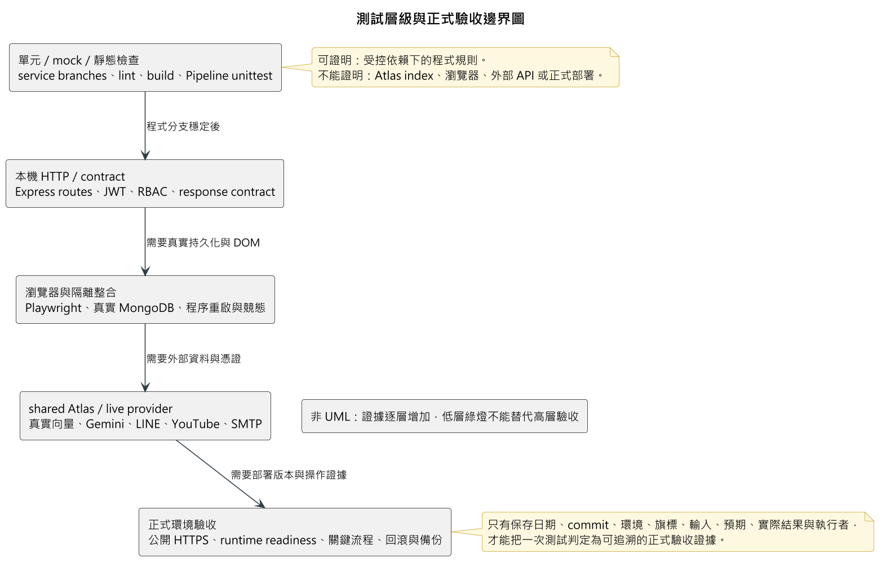

# 第10章 測試模型

> 整理基準：2026-09-19。本輪已重新執行目前 checkout 的 Backend、Frontend 與 Pipeline 本機自動化測試，以及 Frontend lint／build；未執行瀏覽器、shared Atlas、外部服務或正式部署驗收。歷史案例仍保留原執行日期與適用邊界。

## 10-1 測試計畫

### 10-1-1 測試目標與原則

FocusFlow 的測試不只確認頁面能否開啟，還須驗證角色權限、課程資料隔離、影片處理狀態、問答來源與時間戳，以及外部服務失敗時是否安全停止。測試採下列原則：

1. 每項功能至少包含正常、未登入或越權、輸入錯誤、依賴服務失敗與可重試情境。
2. 學生內容權限以「有效修課資格且課程已發布」為必要條件；空範圍不得退回全資料查詢。
3. QA 的回答品質與程式正確性分開評估。程式測試通過不等於答案品質、引用品質或正式課程驗收通過。
4. 本機 mock、隔離 MongoDB、瀏覽器、shared Atlas／live provider 與正式環境證據分層保存，不以低層綠燈代替高層驗收。
5. 每次驗收應記錄 commit、日期、環境、旗標快照、題庫或輸入資料、預期與實際結果、原始輸出及執行者。

Backend 使用 Node.js 內建 `node:test`，route 測試會啟動真實 Express app，但主要共用 harness 以 in-memory store 取代 Mongoose 實際資料庫操作；Frontend 使用 Node.js 測試輔助函式與服務契約，另以 lint、build 及指定 Playwright 情境補足；Pipeline 使用 Python `unittest`。目前未設定強制 coverage 百分比，故通過數不能取代需求覆蓋率審查。

如圖10-1-1所示，證據可信度會隨測試層級提高：單元／mock 可證明受控依賴下的程式規則，本機 HTTP 可驗證路由與契約，瀏覽器／隔離整合才能涵蓋 DOM 與持久化，shared Atlas／live provider 及正式環境則各有獨立門檻。低層綠燈不能替代高層驗收。

圖10-1-1 測試層級與正式驗收邊界圖

> 本圖是測試證據層級示意，**不是 UML 圖**。一次正式驗收只有在日期、commit、環境、旗標、輸入、預期、實際結果與執行者均可追溯時，才能作為該版本的交付證據。

### 10-1-2 測試層級與環境矩陣

表10-1-1　測試層級與證據邊界

| 層級 | 主要目的 | 目前入口或證據 | 能證明 | 不能證明 |
|---|---|---|---|---|
| 本機單元／mock | 驗證 service、資料轉換、狀態機、錯誤契約與安全分支 | `backend/package.json` 的 `npm test`、`frontend/focus-flow/package.json` 的 `npm test`、Pipeline `tests/` | 程式分支在受控依賴下符合預期 | 真實 MongoDB index、網頁 DOM、外部 API 或正式部署 |
| 本機 HTTP + in-memory Mongoose | 驗證 route、JWT、RBAC、HTTP status 與錯誤碼 | Backend 共用 test harness | Express 路由及主要授權規則 | 真實 MongoDB 原子性、unique index、交易或 Atlas Search |
| 隔離 MongoDB／程序重啟 | 驗證真實 Mongoose、index、持久化、批次重啟與競態 | 2026-07-26 與 2026-08-13 的隔離驗收紀錄 | 指定版本在隔離 MongoDB 的行為 | shared Atlas 現況或 production 資料 |
| 瀏覽器／Playwright | 驗證登入、導覽、Dashboard、通知、頭像及角色頁面串接 | 2026-07-26、2026-08-13 的指定 Chromium／Playwright 紀錄 | 指定瀏覽器情境可完成 | 全裝置、全瀏覽器、長時間穩定性 |
| shared Atlas／live provider | 驗證真實向量、index、Gemini、LINE 或 YouTube | 各功能 dated evidence；須逐項標記 read-only 或 write | 指定時間與憑證下的外部整合 | 永久可用、目前部署仍使用同一設定 |
| 正式環境 | 驗證公開網域、反向代理、TLS、runtime readiness 與關鍵流程 | 部署紀錄、CI/CD 結果、正式 smoke | 指定部署版本在當時環境的結果 | 尚未執行的學生試用、壓力、備援或續約驗收 |

### 10-1-3 需求與測試追溯矩陣

第 5 章已以 `FR`／`NFR` 建立第一階段需求編號。本節先按需求群組連結現有測試與證據；最終版應補到個別需求與測試案例的一對一或一對多對照，避免另造衝突編碼。

表10-1-2　需求群組與測試追溯

| 需求群組 | 主要案例 | 預期結果 | 目前證據狀態 |
|---|---|---|---|
| 身分驗證與角色入口 | 學生／教師一般登入、管理員 `/admin`、role mismatch、重新整理 session restore、忘記密碼 | 僅進入相符角色；session restore 中只有 `/auth/me` 的 401／403 會清除失效 session；暫時性 5xx／斷線可重試 | 2026-07-26 指定隔離 MongoDB + Playwright；後續 auth helper tests 存在，未於本輪重跑 |
| 課程與修課授權 | teacher/admin 指派、CSV 匯入、撤銷、學生查課、他課存取 | 僅 `active Enrollment ∩ published Course` 可見；撤銷後失去課程、QA、Shorts、通知與 LINE scope | 2026-08-30 本機回歸；shared Atlas 正式學生試用仍有獨立驗收門檻 |
| 影片與批次處理 | 多檔 multipart、部分失敗、重複檔、狀態輪詢、單項 retry、重啟恢復、他教師存取 | 每項有穩定 itemId／videoId；成功項不被失敗項回滾；越權 403；失敗可依狀態重試 | 2026-08-13 隔離 MongoDB 7 E2E；真實 STT／Gemini、壓力與正式部署 E2E 未完成 |
| 網頁／LINE 問答 | 一般問題、追問、課外題、無可用影片、provider 失敗、額度超限 | 回答只用授權課程；拒答不編造；回傳狀態、引用與時間戳；失敗明確可重試 | 2026-08-30 本機回歸；2026-09-01 baseline 與 2026-09-03 品質評測；不同環境不可合併成單一「通過」 |
| 通知與個人資料 | 未讀、單筆／全部已讀、公告、處理完成通知、頭像格式／大小、密碼變更 | 權限與錯誤狀態正確，private avatar 不成為公開靜態檔 | 2026-07-26 指定功能驗收；2026-09-11 後頭像已改存 MongoDB，仍須以新版環境再做交付驗收 |
| Shorts、短腳本與短片審核 | 學生修課 feed、空狀態、腳本旗標關閉、生成／退回、成品送審、通過／拒絕與 stale version | 學生只見已發布且可播放素材；關旗標時腳本 API 為 404；審核結果需讀回確認 | 2026-08-13 Shorts 正式唯讀驗收；SP-1／SP-2 與後續前端測試分層保存；短腳本旗標預設關閉 |
| 維運與安全 | `/health`、CORS、QA readiness、憑證、部署失敗、備份還原 | 設定缺漏 fail-fast 或 degraded；secret 不進版控；可回復到已知版本與可驗證資料 | TLS 有 2026-09-10 紀錄；CORS、正式備份還原與首次自動續約仍待完整驗收 |

### 10-1-4 測試資料與通過準則

QA 評測依 [QA 評測說明](../../../30_Features/QA_Evaluation/README.md) 分成正確性、忠實性、完整性、引用與時間戳、清晰度及拒答恰當性。正式接受測試至少應同時滿足：

- 功能案例無 Critical／High 未處理缺陷；越權與跨課程引用為 0。
- 引用的 `videoId`、片段 ID 與時間區間可回查原始資料，且可由使用者跳轉至可播放來源。
- 題庫、旗標、模型／embedding 契約與原始輸出皆可重現；人工修補後須重跑，不以舊結果代替。
- 外部依賴失敗不得靜默降級成看似正常的成功；是否允許 template fallback 需在該次驗收規格中先定義。
- 正式環境應另檢查 HTTPS、CORS、健康狀態、備份可還原性、資源與錯誤監控。

## 10-2 測試個案與測試結果資料

### 10-2-1 代表性測試案例記錄

下表把既有原始證據轉為評審可追溯的案例格式；「通過」只適用表列日期、環境與預期範圍。本輪重新執行的本機驗證另列於表10-2-3，不回溯改寫下列歷史案例。

表10-2-1　代表性測試案例、實際結果與判定

| 案例／需求 | 前置條件與步驟 | 預期結果 | 原紀錄的實際結果 | 判定與邊界 |
|---|---|---|---|---|
| TC-BATCH-01；FR-09、FR-10、NFR-04 | 2026-08-13／14 隔離 MongoDB 7；以教師上傳兩支本地測試影片，觀察部分失敗，重播 processing webhook，重啟 Backend，再以另一教師讀取 | 批次保留單項結果並彙總 partial；重播不增加 attempt；重啟後資料仍在；他教師被拒絕 | `1 completed + 1 failed = partial`；重播後 attempts `[1,1]`；重啟後狀態與原錯誤保留；另一教師回 403 | **PASS（隔離 MongoDB）**；未使用 Whisper、Gemini、shared Atlas 或正式部署 |
| TC-QA-BASE-01；FR-14、FR-15、NFR-01、NFR-05 | 2026-09-01；專用 Atlas 唯讀角色，OpenCV 15 支影片／129 筆 Leaf；執行 Q01–Q12 與 N01–N02，人工比對回答、Leaf、citation 與時間 | 回答由教材支持、引用精準、拒答不帶無關 citation、不得跨課程 | 正向題 0 PASS／10 WEAK／2 FAIL；N01 整體 WEAK、N02 FAIL；跨課程隔離 PASS、DB write 0，時間欄位與 Leaf 一致 | **FAIL／WEAK baseline**；明確不是 final，證明當時仍有錯答與引用過廣 |
| TC-QA-REG-02；FR-14、FR-15、NFR-05 | 2026-09-03；相同 50 題題庫，以 memory retrieval、Gemini query／answer、FAQ 關閉執行並評分 | 比基準線改善，無致命錯誤；保存題庫、設定與原始 run | 50 題完成；加權 4.68／5（基準 4.35）；致命錯誤 0；時間定位 4.81、完整性 4.30 | **改善記錄，未設定正式 Pass 門檻**；不是 shared Atlas、所有課程或正式學生試用驗收 |
| TC-TLS-01；NFR-12 | 2026-09-10 正式 VM；查驗憑證 issuer／效期、以 HTTPS 存取，確認 acme.sh cron 與 hook | 公開網域使用受信任憑證且 HTTPS 回應；續約機制存在 | Let's Encrypt 正式憑證有效至 2026-12-09，HTTPS 200；cron 已建立，首次實際自動續約尚未發生 | **PASS（簽發與當日 HTTPS）**；續約、全系統功能與持續可用性仍待驗證 |

### 10-2-2 已保存的 dated evidence

表10-2-2　已保存的測試與部署證據

| 日期與證據 | 原紀錄結果 | 判讀 |
|---|---|---|
| [2026-07-26 現況紀錄](../../../../backend/docs/current-state.md) | Backend 262／262；Frontend lint／build；role-aware auth、註冊、通知、頭像有隔離 MongoDB + Playwright 指定驗收 | 僅代表該日期與指定功能；不是目前 checkout 重跑結果 |
| [2026-08-13 多影片批次紀錄](../../../current-status.md#2026-08-13-多影片批次整合與隔離重啟驗收) | 隔離 MongoDB 7 下兩支影片形成 `1 completed + 1 failed = partial`，重啟後狀態保留，另一教師讀取 403 | 未使用 shared Atlas、Whisper、Gemini 或正式部署 |
| [2026-08-30 Phase 1](../../../30_Features/Student_Pilot_Backend/evidence/2026-08-30_phase1-implementation-results.md) | Backend 64 suites／500 tests 全數通過 | 本機回歸；不是 shared Atlas、Gemini、YouTube、LINE 或 production acceptance |
| [2026-09-01 baseline](../../../30_Features/Student_Pilot_Backend/evidence/2026-09-01_baseline_manual-review.md) | 12＋2 題人工複核；跨課程隔離通過，但整體為 WEAK，含錯答與引用過廣 | baseline，不可冒充 final；未另做跨裝置影片播放驗證 |
| [2026-09-03 第二輪評測](../../../30_Features/QA_Evaluation/reports/2026-09-03-第二輪評測結果.md) | 指定題庫加權 4.68／5；保存原始 run 與一次 provider 斷線補跑 | 只適用該題庫、模型與執行設定，不代表所有課程 |
| [短腳本 SP-1](../../../30_Features/Short_Script_Automation/evidence/2026-09-04_sp1-acceptance.md)、[SP-2](../../../30_Features/Short_Script_Automation/evidence/2026-09-04_sp2-acceptance.md) | 選題與生成階段證據已保存；SP-2 多數測試為 mock，另有同日真實 LLM 試跑紀錄 | 不代表短片拍攝、成品上架、學生可見與長期運作皆完成 |
| [2026-09-10 TLS 紀錄](../../../40_Operations/deployment/2026-09-10_Lets_Encrypt憑證申請紀錄.md) | 網域憑證受信任、HTTPS 200；cron 與續約設定存在 | 首次實際自動續約尚未發生；憑證成功不等於系統正式上線 |

### 10-2-3 2026-09-19 本輪本機驗證

表10-2-3　2026-09-19 本輪本機驗證結果

| 區域 | 實際指令 | 結果 | 可證明與邊界 |
|---|---|---|---|
| Backend | `npm.cmd test` | **876 passed／0 failed**；104 suites | 目前 checkout 的 Node.js 自動化測試通過；主要 route harness 使用 in-memory store，不能證明真實 MongoDB／Atlas 原子性、index 或正式 runtime |
| Frontend | `npm.cmd test` | **68 passed／0 failed**；32 groups | 前端 helper 與服務契約測試通過；未涵蓋本輪 browser／DOM E2E |
| Frontend 靜態檢查 | `npm.cmd run lint` | **PASS** | ESLint 規則通過；不等於使用者流程或可及性人工驗收 |
| Frontend 建置 | `npm.cmd run build` | **PASS** | Vite production build 成功；仍有單一約 1,051 kB bundle 超過 500 kB 的效能警告，不是 build failure |
| AI Pipeline | `.venv\Scripts\python.exe -m unittest discover -s tests -p 'test_*.py'` | **189 passed** | Pipeline 本機單元／契約測試通過；未呼叫真實 STT、Gemini、MongoDB 或外部下載服務 |

本表是「來源已修訂且本機測試通過」的證據，不代表內容已部署、已由正式環境 live 驗收，亦不代表本手冊已完成指導老師或複評委員的正式接受。

### 10-2-4 仍待補齊的正式驗收

1. 以定版需求編號建立逐案例結果表，補執行者、commit、瀏覽器／裝置、實際輸出與缺陷單。
2. 完成學生試用 final 題庫、shared Atlas 唯讀證據、真實 citation 播放與 LINE 正式 webhook 回歸。
3. 對多影片批次執行真實 STT／Gemini、容量／壓力、程序異常與 production E2E；在此之前 `VIDEO_BATCH_PIPELINE_ENABLED` 應維持既定安全設定。
4. 補 MongoDB 備份還原演練、部署回滾、CORS 白名單與憑證首次自動續約驗證。
5. 對短腳本／成品審核完成 feature-on 的 browser E2E、真實 YouTube lifecycle 與學生修課可見性驗收。

原始結果應保留在各功能 `evidence/`、評測 `runs/` 或正式驗收附件；本章只做索引與邊界判讀，不複製或改寫原始結果。

[返回手冊索引](../README.md)
