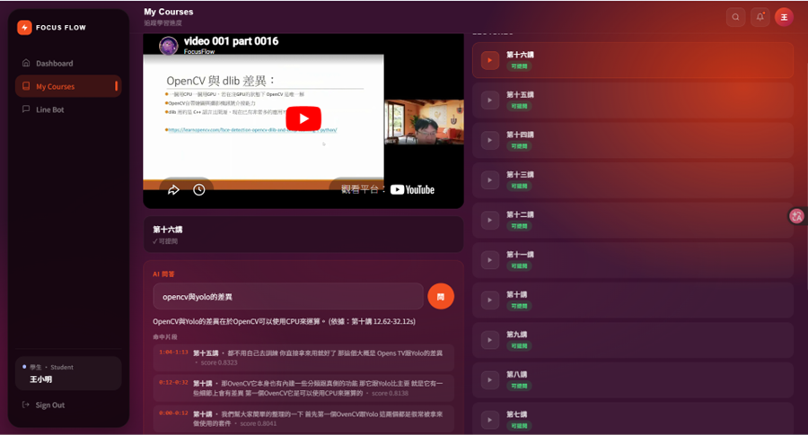
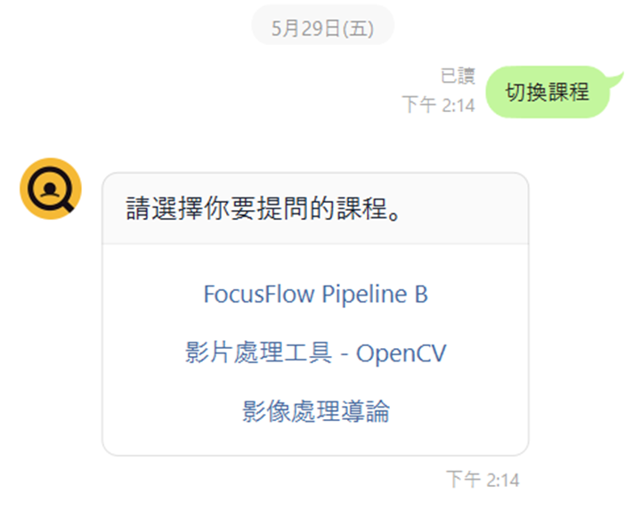
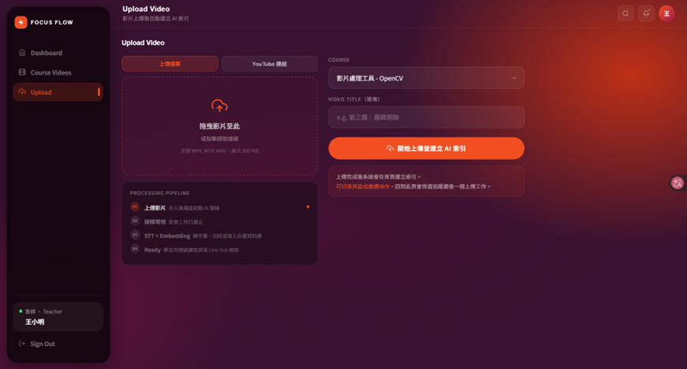
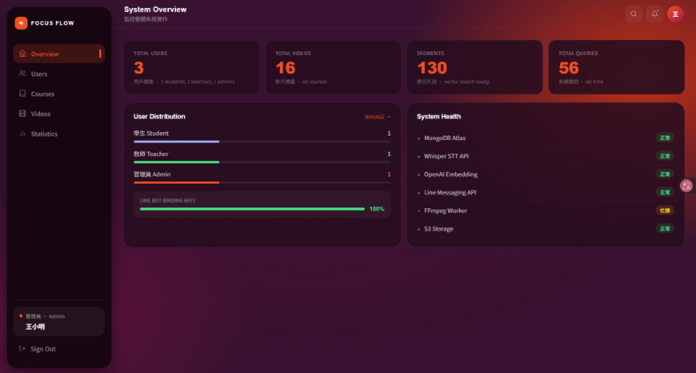
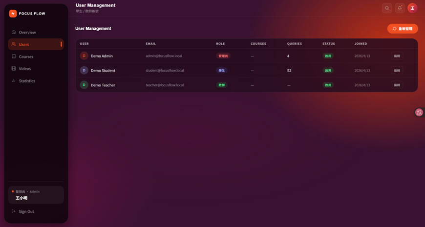
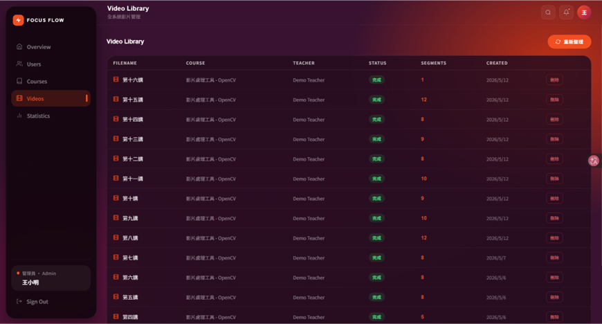
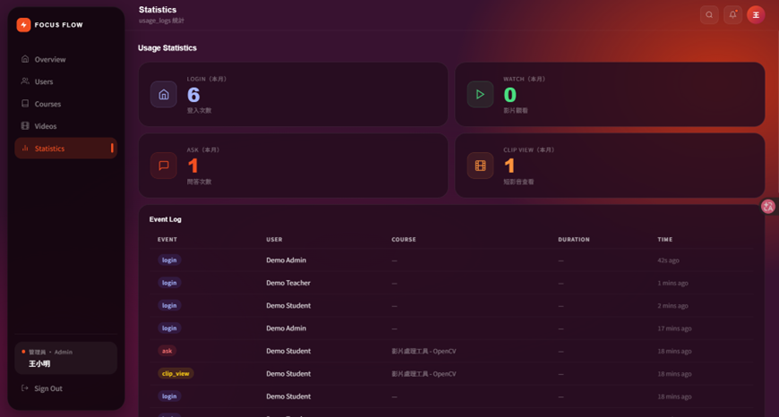

# 第12章 使用手冊

> 整理基準：2026-09-14。本章依目前 Frontend、API routes 與權限規則撰寫。文末保留的初評畫面來自 2026-06-02 原稿，只供版面與功能演進比對，不代表目前 UI；本階段未新增、改名、刪除或重繪圖片。

## 12-1 使用前提與共同操作

FocusFlow 有學生、教師與管理員三種角色。學生與教師由網站一般入口登入；管理員使用 `/admin` 獨立入口。登入時選擇的角色必須與帳號相同，角色不符會被拒絕。只有學生可由一般入口自助註冊；教師與管理員帳號由管理流程建立。

學生能否看到課程，不以「帳號已註冊」或「課程存在」判定，而必須同時符合：

- 教師或管理員已將學生列入該課修課名單；
- 修課資格仍為 active；
- 課程狀態為 published。

系統沒有學生自助選課、邀請碼或註冊後自動加入所有課程。若學生課程清單為空，應先請該課 owner 教師或管理員檢查課程狀態與修課名單。

### 12-1-1 登入、重新整理與登出

1. 由首頁按「立即開始」，選擇學生或教師，輸入 Email 與密碼後按「登入系統」。管理員直接開啟 `/admin` 並使用管理員帳號。
2. 成功後進入該角色 Dashboard；若角色選錯，改選正確角色再登入。
3. 網頁重新整理時會透過 `/auth/me` 驗證保存的 session。若 Backend 暫時無法連線，頁面顯示「重新驗證」；此情況不代表帳號已登出。
4. 點右上角頭像開啟選單，可進入個人資料或登出。登出後瀏覽器會清除本機 token 與使用者快取。

### 12-1-2 忘記密碼

1. 在一般登入頁按「忘記密碼」，輸入 Email 並要求寄送 6 位數驗證碼。
2. 驗證碼有效 10 分鐘；輸入驗證碼與兩次相同的新密碼，新密碼至少 8 碼。
3. 成功後回登入頁使用新密碼。若顯示寄信功能尚未開啟，代表該部署未完成 SMTP 設定，需聯絡授課教師或管理員，不能由使用者自行繞過。

### 12-1-3 通知與個人資料

- 所有已登入角色可按右上角鈴鐺查看通知、載入更多、將單則或全部標為已讀。教師收到短腳本退回通知時，點通知可導向相應腳本。
- 管理員可在同一通知面板填寫標題、內容及是否緊急，向 active 學生發送系統公告。
- 個人資料頁可修改姓名與帳號資料、變更密碼及上傳頭像。選圖支援 JPEG、PNG、WebP；Frontend 接受的原始檔最大 5 MiB 並先縮圖，Backend 最終上傳限制為 1 MiB。格式或內容不合法時不會更新。
- 頭像為驗證後讀取的 private asset，不應以公開 `/uploads` URL 分享。

## 12-2 學生操作

### 12-2-1 Dashboard

登入後可查看最近 7 天提問次數、已修課 published 課程的平均進度、累計提問數與回答命中率。Course Progress 可進入完整課程清單；Recent Queries 會顯示問題、課程、時間與命中狀態。若原影片後來被移除，歷史紀錄仍保留並標示「內容已下架」。

成功結果：統計只計入目前有權存取的課程，且頁面不因新帳號沒有資料而報錯。若讀取失敗，頁面會顯示載入錯誤，可在網路或 Backend 恢復後重新整理。

### 12-2-2 我的課程、影片與學習進度

1. 從側邊欄開啟「My Courses」。清單只顯示目前有效修課且已發布的課程。
2. 按「進入課程」後，從右側影片清單選擇教材。可播放來源可能是 YouTube 或 Backend 保留的本機上傳檔；只有 metadata 而沒有可播放來源時會顯示不可播放。
3. 播放影片時系統會記錄開啟事件；播放結束或達到目前程式定義的觀看門檻後，更新已觀看進度。
4. 按返回按鈕回課程清單。若課程突然消失，先確認修課資格是否被撤銷或課程是否改為 draft／archived。

### 12-2-3 網頁多輪問答與時間戳回溯

1. 進入課程後，在問答區輸入問題並送出；沒有可回答影片時，系統會明確告知，不會從其他課程找答案。
2. 系統會建立或沿用該課程對話；「新對話」可另開一串，近期對話可重新載入。後續追問會在 Backend 允許的對話輪數內帶入前文。
3. 成功回答下方會列出來源片段。預設只顯示部分來源，按「顯示更多」可展開，以免被引用的片段無法操作。
4. 有可播放影片的來源卡可用滑鼠點擊，或以鍵盤 Enter／Space 啟動；播放器會跳到 `startSec` 對應時間並開始播放。
5. 回答失敗且畫面提供「重新嘗試」時，可對該則訊息 retry。不要連續建立多個相同對話來代替重試。

成功結果：回答、answer status、citations 與時間區間屬同一課程 scope；點來源能回到對應影片。常見失敗包括 401 session 失效、403 修課權限不足、429 QA 額度超限、課程無 live video、Atlas／provider 尚未 ready 或暫時性連線錯誤。錯誤時應保留題目與課程脈絡，依畫面訊息重試或聯絡管理者，不把 template／空答案視為已驗收的 AI 回答。

### 12-2-4 LINE Bot 綁定、切課與提問

1. 開啟「Line Bot」頁；系統會產生一次性綁定 token。用手機掃描 QR code 加入 Bot，或複製 token 到聊天室送出。
2. 綁定 token 的有效時間為 10 分鐘且僅能使用一次；過期或失敗時重新取得。
3. 完成綁定後輸入「切換課程」，Bot 只列出目前有效修課、已發布且有可回答影片的課程。
4. 選定課程後直接輸入問題。也可在網頁課程清單按「詢問助教」，掃描含該課程資訊的 QR code，以便綁定並切到該課。
5. LINE 回答會附來源與影片時間資訊；若影片尚無 YouTube 跳轉連結，訊息會提示回網站課程頁查看對應時間點。

若 Bot 無回覆，先確認前端顯示已綁定，再由管理者檢查 webhook 與 `/health.runtime.line`。歷史 live smoke 不保證目前 ngrok／正式網域或 channel credential 仍有效。

### 12-2-5 教學短片

1. 開啟「教學短片」，檢視卡片牆；按卡片以 9:16 modal 播放，按 `Esc`、關閉按鈕或背景離開。
2. 有下一頁時按「載入更多」；也可由頁首連結前往 FocusFlow YouTube 頻道。
3. 學生 feed 只回傳有效修課課程中 published 且 YouTube playable 的 ShortAsset。空畫面可能代表目前修課尚無已通過素材，不代表能改用未授權頻道清單。

## 12-3 教師操作

### 12-3-1 Dashboard 與課程管理

教師 Dashboard 顯示課程數、影片數、近期影片、常見提問片段等教學概況；統計是輔助判讀，不等同完整學習成效分析。

1. 開啟「Course Videos」，按「新增課程」，輸入名稱、說明並選擇 draft、published 或 archived 狀態。
2. 展開課程可查看影片與處理狀態。教師只能管理自己有權限的課程；管理員不受 owner 限制。
3. 「管理學生」可用完整 Email 精確加入既有學生，或匯入 UTF-8 CSV。CSV 第一列須含「姓名、Email、學號」（也接受頁面列出的英文欄名），單次最多 200 筆；已有學生帳號者只加入課程。
4. 現行程式對沒有帳號的列會以學號建立可登入的初始憑證，且未找到首次登入強制改密碼機制；學號具可預測性，屬帳號接管風險。未完成產品／安全決策與補強前，正式環境應只匯入既有帳號，或停用 CSV 自動建帳，不應把學號初始密碼當成可接受的正式操作流程。
5. 匯入前確認檔名與筆數，完成後檢查新建、加入與略過結果。Email 重複、格式錯誤、學號過短、非學生帳號或已停用帳號會列為略過。
6. 撤銷學生資格需二次確認；撤銷會立即移除該課存取與相符 LINE scope，但保留既有提問／使用歷史。
7. 可將其他課程中由系統管理的影片「掛載」到目前課程，不複製檔案也不重新處理；解除掛載只移除該課引用。刪除原始影片或整門課則是不同且具破壞性的操作，確認視窗後才執行。

### 12-3-2 多影片上傳與處理追蹤

目前 Upload UI 採單一 multipart batch API，不是前端逐支呼叫單檔 API。

1. 先建立可管理的課程，進入「Upload」，選擇目標課程。
2. 拖放或選取 MP4、MOV、MKV；單支最大 500 MB，一批最多 10 支。重複選取的同一檔案會被前端去重。
3. 單支上傳可自訂標題；多支時各片標題由檔名產生。確認檔案後按「上傳影片並建立 AI 索引」。
4. Backend 建立一筆 durable batch 與每支影片的 itemId／videoId；個別失敗或重複不會回滾已成功項目。畫面依序顯示上傳、排隊、STT + Embedding 與 Ready。
5. 上傳後可重新整理頁面，batchId 及安全的追蹤狀態保存在 URL／local storage，頁面會每 3 秒讀取最新狀態。`processing.completed` 只表示目前 Pipeline 已完成；資料是否已 publication、索引是否 READY、QA 是否可用仍須由 run report、資料契約與 `/health.runtime.qa` 分別確認。若啟用且設定完整，YouTube 上傳是後續獨立狀態。
6. 失敗項顯示「重新處理」時可只重試該 videoId。若批次仍在執行、來源檔已不存在或前一次上傳可能已送出 bytes，系統可能拒絕重試，應依錯誤訊息與管理者檢查結果處理。

`VIDEO_BATCH_PIPELINE_ENABLED=false` 時，Batch API 仍建立批次紀錄，但每支影片沿用既有 single-video processing adapter；開啟時才由 Pipeline batch orchestration 處理。兩者都是同一 UI 的可能 runtime 模式，不能只看畫面宣稱真實 batch Pipeline 已啟用。2026-08-13／14 已有隔離 MongoDB 7 證據，但真實 STT／Gemini、壓力與正式部署 E2E 尚未完成。

在「Course Videos」也可對 processing failed 的原始影片按「重試處理」，對可安全重試的 YouTube failed 項按「重傳 YouTube」。掛載進來的影片不可由本課重試或刪除，只能解除掛載。

### 12-3-3 短影片腳本（選用功能）

此頁已存在於教師導覽，但 Backend 的 `SHORT_SCRIPT_AUTOMATION_ENABLED` 預設為 false；關閉時整組腳本 API 回 404，頁面顯示功能未啟用。只有部署者完成資料、Gemini、YouTube 與驗收後才應開啟。

Feature-on 時的操作流程：

1. 選擇課程，檢視依學生提問彙整的候選主題；可用自動首選或指定一項建立腳本工作。
2. 開啟腳本並按「生成腳本」，檢視引用證據、分鏡、口白、字幕與視覺隱喻方案。
3. 可複製 Markdown；需要修改時選擇回饋類型並填寫具體問題，再退回並重新生成。版本與回饋會保留，不應把舊版誤當最新版。
4. 成品完成後切到「成品上架」，選取影片、填寫 YouTube 標題／說明，並確認 AI 揭露與肖像／素材授權已處理。系統只記錄勾選與時間，不會代為查驗同意書。
5. 按「上傳成品並送審」後檢查 asset 的 upload、privacy、generation 與 review 狀態；只有標示 retry-safe 的上架失敗才可按「重試上架」。

### 12-3-4 短影片審核

1. 開啟「短影片審核」，從待審清單選取成品並檢查課程、generation version、影片或縮圖及描述。
2. 通過時先進入確認頁，再按「確認通過並公開」。通過後 ShortAsset 對符合修課資格的學生可見；影片在成品上傳階段已以非公開狀態傳至 YouTube，審核不應重複上傳。
3. 不通過時至少選擇一個結構化理由；畫面標為必填的理由需補具體說明。確認頁再次核對後送出。
4. 伺服器保存後會讀回最新狀態；完成畫面才算本次審核成功。若顯示「審核已送出、讀回失敗」，只能按「只重新讀取最新狀態」，不可重複送審。
5. 若他人已處理同一 generation，系統會回 stale／conflict 並要求重新載入。退回成品不對學生公開，並會依現行 lifecycle 將該 YouTube 影片轉回 private；外部動作失敗時仍須由管理者至 YouTube Studio 核對。

## 12-4 管理員操作

1. 由 `/admin` 登入。一般學生或教師帳號會顯示「此入口僅供管理員使用」，不能因 local storage 中的舊角色值進入後台。
2. Overview 查看使用者、課程、影片及提問等總覽；數字載入失敗時不應以 `—` 當成零資料。
3. Users 可重新整理名單、編輯姓名、角色與 `isActive`。停用帳號會影響後續登入與資源存取；變更角色前須評估既有課程 owner、Enrollment 與歷史資料。
4. Courses 可新增、編輯、刪除課程，指定教師與狀態，並使用與教師相同的修課學生管理功能。刪除會觸發多項 cascade 與 ShortAsset 封存，操作前須確認備份及 YouTube 影響。
5. Videos 可檢視全站影片、課程、處理狀態與建立日期；刪除前會再次確認。影片刪除可能清除片段並把 FocusFlow 上傳的 YouTube 影片轉 private，但 UsageLog／Question 歷史會保留並由 UI 標示內容已下架。
6. Statistics 顯示 ASK、WATCH、影片開啟等事件統計與近期事件。被刪除課程的歷史事件仍可存在，不應視為孤兒資料立即清除。
7. 右上鈴鐺可發送全站學生公告；送出後畫面回報實際收件人數。沒有標題或內容、權限不足或 Backend 失敗時不會宣稱已發送。

## 12-5 功能限制與使用者回報資訊

- Hierarchical Parent retrieval、短腳本自動化、Pipeline batch orchestration、YouTube recovery／本地檔案 cleanup 都有預設關閉或 rollout gate；介面存在不代表 production 已啟用。
- `video_segments_video` 目前只供保守的視覺 citation／timestamp，不是 caption QA 或完整自動剪片來源。
- Shorts feed 與短影片腳本／審核是不同流程：前者只顯示授權且 published／playable 的 ShortAsset，不能由頻道公開清單推定授權。
- 公開網站應使用 `https://focusflow.ntub.edu.tw`；既有部署紀錄指出 port 80 對外不通。是否為目前正式服務仍須由維運人員以 `/health` 與部署版本確認。
- 回報問題時請提供：發生時間、角色、頁面、課程／影片或 batch ID、畫面錯誤訊息與可重現步驟。不要附密碼、token、`.env`、完整 MongoDB URI、OAuth credential 或含個資的整份名單。

## 12-6 初評歷史畫面（全部待換圖）

以下圖片與圖說沿用 2026-06-02 初評原稿，檔名與編號均不符合本階段定版規範。它們可能缺少 role-aware login、嚴格 Enrollment、多輪問答、通知／頭像、multipart batch、短腳本與短片審核等現況；只供下一階段重拍比對，不應引用為現行操作證據。最終圖號須在全冊章節結構確認後，依「圖{章}-{節}-{流水號}-{繁體中文名稱}-vX-x.png」統一處理。

### 學生端歷史圖

圖12-2-1　學生儀表板（初評歷史圖，待重截）

初評舊圖：學生儀表板，待重拍 Dashboard 統計、內容下架標示與通知入口。

圖12-2-2　學生課程列表（初評歷史圖，待重截）

初評舊圖：我的課程，待重拍 Enrollment 限定課程、影片清單與問答區。

圖12-2-3　LINE Bot 綁定（初評歷史圖，待重截）

初評舊圖：LINE Bot 綁定，待重拍一次性 token、QR code 與已綁定狀態。

圖12-2-4　網頁課程問答（初評歷史圖，待重截）

初評舊圖：網頁問答，待重拍多輪對話、展開來源及 citation timestamp 跳轉。

圖12-2-5　LINE 課程切換（初評歷史圖，待重截）

初評舊圖：LINE 課程切換，待以現行修課與 live-video 過濾結果重拍。

圖12-2-6　LINE 課程問答（初評歷史圖，待重截）

初評舊圖：LINE 問答，待重拍來源、時間戳及無 YouTube 連結時的網站提示。

### 教師端歷史圖

圖12-3-1　教師儀表板（初評歷史圖，待重截）

初評舊圖：教師儀表板，待以現行統計欄位重拍。

圖12-3-2　教師課程管理（初評歷史圖，待重截）

初評舊圖：課程管理，待重拍課程狀態、修課名單、影片掛載／解除與 retry。

圖12-3-3　教師影片上傳（初評歷史圖，待重截）

初評舊圖：影片上傳，已不符合現行本機多檔 multipart batch、處理追蹤與重新整理恢復流程；YouTube URL 入口目前未在 UI 提供。

### 管理員端歷史圖

圖12-4-1　管理員系統總覽（初評歷史圖，待重截）

初評舊圖：系統總覽，待以目前 Overview 重拍。

圖12-4-2　管理員使用者管理（初評歷史圖，待重截）

初評舊圖：使用者管理，待重拍角色與帳號啟停編輯。

圖12-4-3　管理員課程管理（初評歷史圖，待重截）

初評舊圖：課程維護，待重拍教師指派、狀態與修課名單。

圖12-4-4　管理員影片管理（初評歷史圖，待重截）

初評舊圖：影片資料庫，待重拍全站 processing status 與刪除確認。

圖12-4-5　管理員使用統計（初評歷史圖，待重截）

初評舊圖：使用統計，待重拍事件分類、內容已下架語意與日期。

目前尚無初評圖片可代表學生 Shorts、共用 Profile／Notifications、教師 CSV Enrollment、短影片腳本、成品上架及短影片審核，下一階段須新增對應畫面；本階段只記錄缺口。

[返回手冊索引](../README.md)
