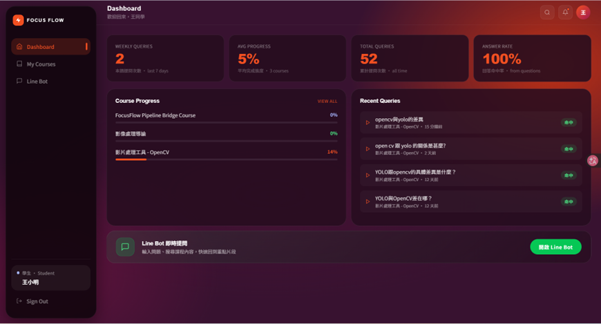
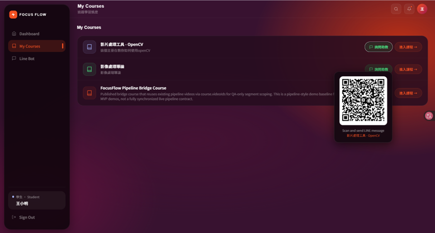
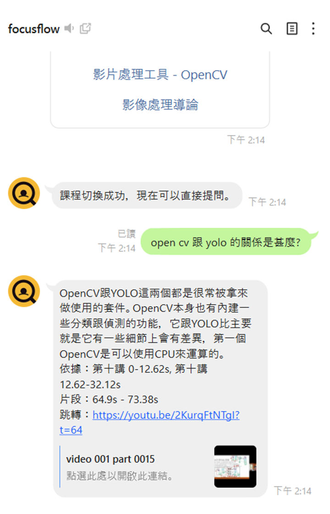
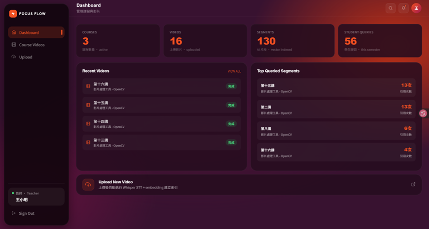
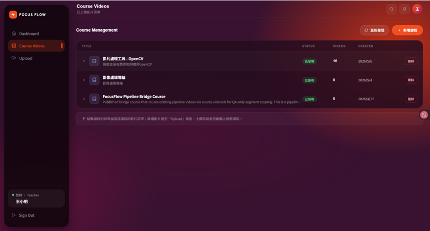
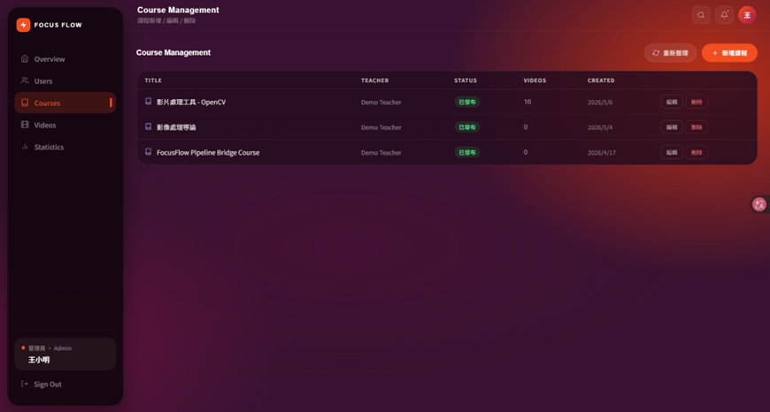

# 第12章 使用手冊

> 狀態：初評原稿轉製，待核對現況。
> 原始資料日期：2026-06-02；Markdown 整理日期：2026-09-13。
> 來源：[初評系統手冊 DOCX](../source-documents/專題手冊_初評最終版.docx)，原第12章。

本章重用原稿文字、表格及嵌入圖像；尚未逐圖核對版面、合併儲存格與圖表編號，不代表最新版功能或正式驗收結果。

## 本次整理與待補

TODO：保留初評畫面供比對；逐一換成新版 Student／Teacher／Admin 截圖，新增操作步驟、畫面移轉、錯誤處理與使用前提。教師上傳 UI 與初評描述已有差異。

補充現況來源（尚待逐項套用）：[原第12章畫面](../source-documents/FocusFlow_第12章使用畫面.docx)、[前端 README](../../../../frontend/focus-flow/README.md)。

[返回手冊索引](../README.md)

---

## 12-1 初評階段已完成系統頁面展示

學生儀表板

學生登入系統後，首先進入學生儀表板頁面，如圖 12-11所示。此頁面提供學生個人學習概況，包括最近提問次數、平均課程進度等資訊，協助學生掌握自身學習狀況。

此外，系統亦顯示目前修習課程之學習進度與近期提問紀錄，方便學生快速檢視過往查詢內容。頁面下方提供LINE Bot快速入口，學生可直接透過LINE進行課程問答與影片片段查詢。

圖 12-12 學生儀表板畫面

我的課程

如圖 12-13所示，學生可於我的課程頁面查看目前已加入之課程清單。系統顯示課程名稱與課程簡介，協助學生快速辨識課程內容。

每門課程皆提供進入課程及詢問助教功能。學生可直接進入課程觀看教材內容，或透過詢問助教功能取得專屬QR Code，快速切換至對應課程之LINE Bot 問答環境。

圖 12-13 我的課程畫面

LINE Bot 綁定

完成LINE綁定後可直接於LINE提問課程問題。

圖 12-14 LINE Bot 綁定畫面

網頁課程問答與影片片段回溯

學生進入課程後，可直接於課程頁面輸入問題進行AI問答。系統會根據影片逐字稿與向量資料庫進行語意檢索，回傳最相關答案，並列出命中片段與時間區間。學生可直接點擊對應片段回到影片講解位置進行複習，有效提升課後學習效率。

圖 12-15 網頁課程問答與影片片段回溯畫面

LINE Bot 課程切換

使用者於LINE Bot輸入課程切換指令後，系統會列出目前可使用之課程供選擇。完成切換後，後續所有提問皆會以所選課程之影片資料、逐字稿及向量資料庫作為檢索來源，以提升回答準確度並避免不同課程資料混淆。

圖 12-16 LINE Bot 課程切換畫面

LINE Bot 智慧問答

學生可直接於LINE Bot輸入自然語言問題。系統透過RAG技術檢索最相關之課程內容，再由大型語言模型產生回答，並回傳引用來源與影片時間區間，協助學生快速理解課程內容。

圖 12-17 LINE Bot 智慧問答畫面

教師儀表板

教師登入系統後，可於教師儀表板查看課程使用狀況，如圖 12-18所示。系統提供課程數量、影片數量、AI切片數量以及學生提問統計等資訊。

透過統計資料，教師可掌握學生學習需求與課程使用情況，作為後續教材改善與課程規劃之依據。

圖 12-18 教師儀表板畫面

課程管理

如圖 12-19所示，教師可於課程管理頁面新增、編輯及管理課程資料。系統提供課程名稱、課程狀態、影片數量及建立日期等資訊。

教師可依據教學需求建立不同課程，作為後續教材上傳與AI問答知識庫建置之基礎。

圖 12-19 課程管理畫面

影片上傳

教師可透過影片上傳功能新增教材內容，如圖 12-110所示。系統支援本機影片上傳與YouTube連結匯入兩種方式。

影片上傳完成後，系統將自動執行語音辨識、影片切片及向量嵌入（Embedding）等處理流程，建立AI檢索索引，供後續學生進行智慧問答與影片片段查詢。

圖 12-110 影片上傳畫面

系統總覽

管理員可即時監控系統運行狀態。

圖 12-111 系統總覽畫面

使用者管理

管理員可維護各類使用者帳號。

圖 12-112 使用者管理畫面

課程維護

管理員可新增、編輯與刪除課程。

圖 12-113 課程維護畫面

影片資料庫

管理員可查看影片與切片資料。

圖 12-114 影片資料庫畫面

使用統計

系統提供登入、提問與觀看統計。

圖 12-115 使用統計畫面
