# 第12章 使用手冊

本章依學生、教師與管理員三種角色，介紹 FocusFlow 各畫面的用途與操作方式。12-1 先以畫面移轉圖說明畫面之間如何切換，12-2 起再依角色逐一說明操作步驟。截圖中的紅框與編號標示操作位置，正文以相同編號（例如①、②）對應說明。

## 12-1 畫面移轉與使用前提

FocusFlow 的網址為 `https://focusflow.ntub.edu.tw`，建議使用電腦版 Chrome、Edge 或 Safari 瀏覽器。學生與教師由網站首頁進入登入頁；管理員則使用獨立的管理員入口 `https://focusflow.ntub.edu.tw/admin`。

學生帳號可自行註冊，但註冊後不會自動看到任何課程。學生必須由授課教師或管理員加入課程的修課名單，且該課程已經「發布」，才能在「我的課程」看到課程內容、觀看影片與向 AI 提問。若登入後課程清單是空的，請先聯絡授課教師確認修課名單。

下列畫面移轉圖以類似狀態轉換圖（State Transition Diagram）的方式表示：每個圓角方框代表一個畫面或彈出視窗，箭頭上的文字是讓畫面切換的操作，實心黑點代表開始使用的位置。登入後，左側的側邊欄可以隨時切換到同一角色的其他頁面，因此圖中只畫出從總覽出發的主要路徑。

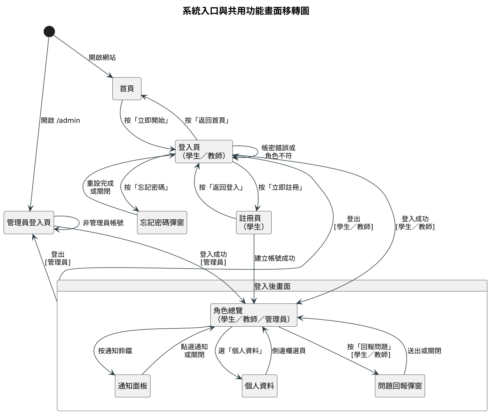

圖12-1-1　系統入口與共用功能畫面移轉圖

圖12-1-1 說明所有角色共用的入口與功能。一般使用者從首頁按「立即開始」進入登入頁，可在此註冊、重設密碼或登入；管理員則由 `/admin` 進入管理員登入頁。登入後，通知、個人資料與問題回報三項功能在各角色的畫面中都可以使用，登出後會回到各自的登入頁。

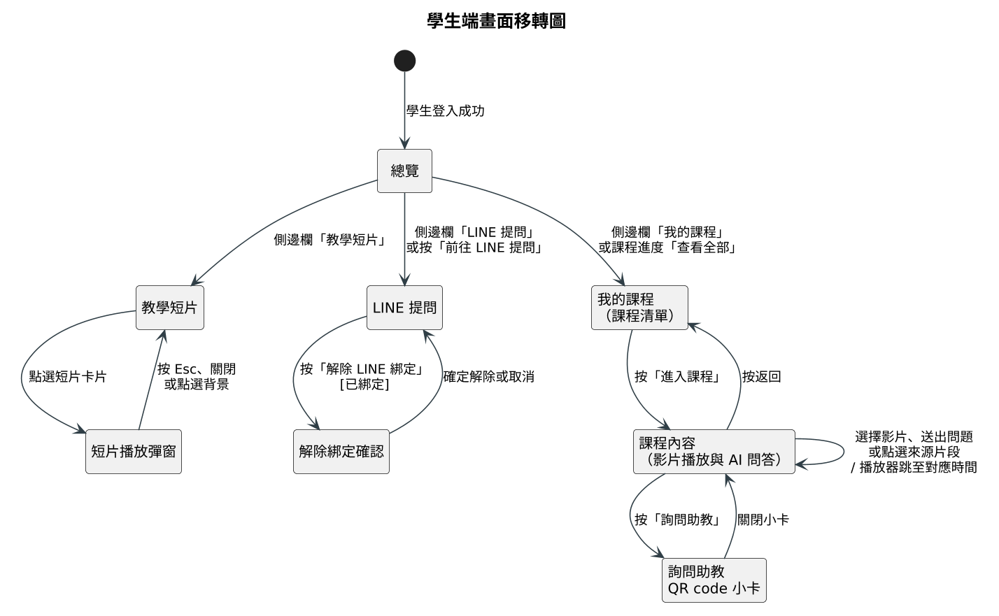

圖12-1-2　學生端畫面移轉圖

圖12-1-2 是學生登入後的畫面切換。學生的主要學習路徑為「我的課程 → 課程內容」，在課程內容頁選擇影片、提問並點選來源片段都不會離開頁面；「詢問助教」會在同一頁展開 QR code 小卡，方便改用手機 LINE 提問。

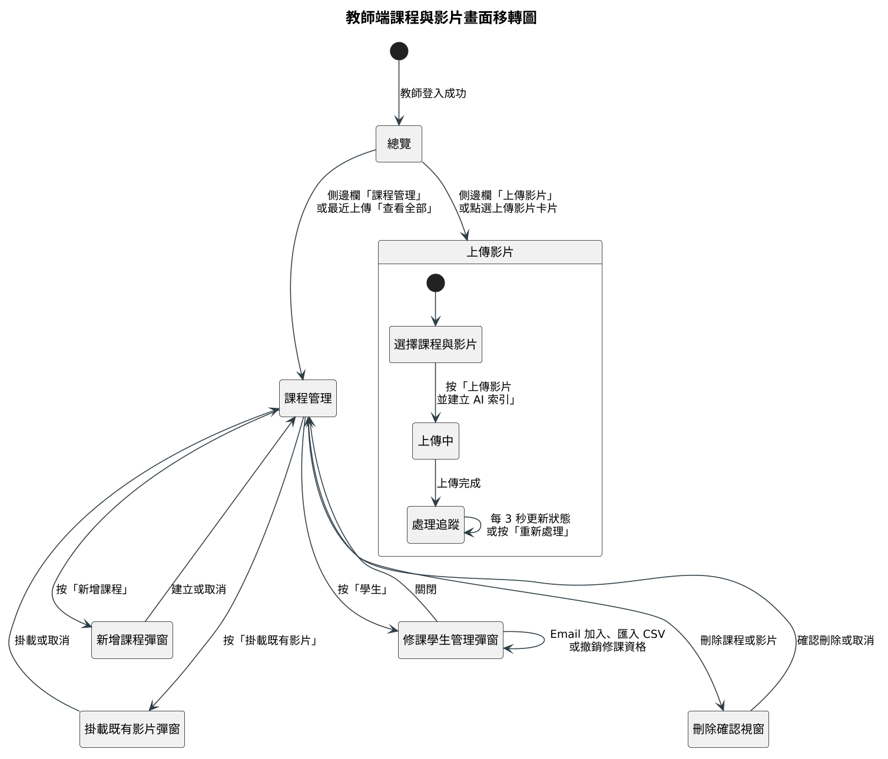

圖12-1-3　教師端課程與影片畫面移轉圖

圖12-1-3 是教師管理課程與上傳影片的畫面切換。課程管理頁的新增課程、修課學生、掛載影片與刪除都以彈出視窗完成，關閉後回到課程列表；上傳影片頁則依「選擇課程與影片 → 上傳中 → 處理追蹤」的順序推進。

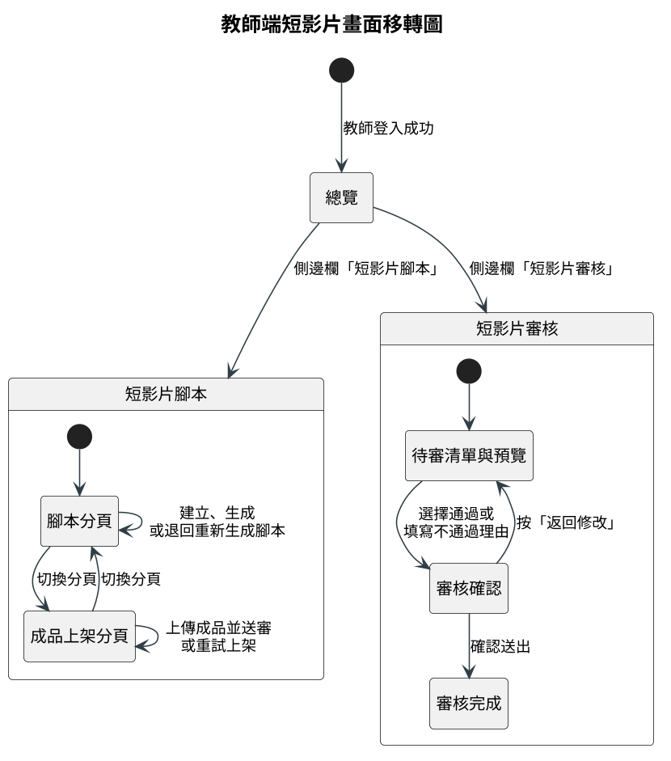

圖12-1-4　教師端短影片畫面移轉圖

圖12-1-4 是教師製作與審核教學短片的畫面切換。短影片腳本頁分為「腳本內容」與「成品上傳」兩個分頁；短影片審核頁則依「待審清單與預覽 → 審核確認 → 審核完成」三個步驟進行，在確認步驟仍可返回修改。

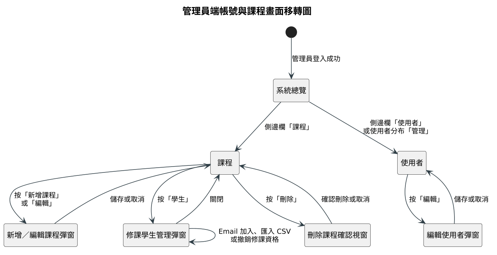

圖12-1-5　管理員端帳號與課程畫面移轉圖

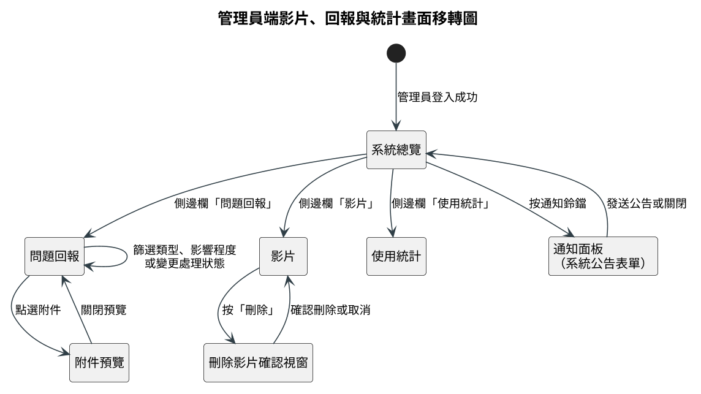

圖12-1-6　管理員端影片、回報與統計畫面移轉圖

圖12-1-5 與圖12-1-6 是管理員登入後的畫面切換。使用者與課程的新增、編輯、刪除都在彈出視窗中完成；問題回報頁可直接在列表上篩選與變更處理狀態；系統公告則由通知面板發送。

## 12-2 註冊、登入與共用功能（UC-01、UC-06）

### 12-2-1 註冊學生帳號

第一次使用的學生，請在登入頁按下方的「立即註冊」進入註冊畫面（圖12-2-1）。在①填入姓名、Email、密碼，並再輸入一次密碼確認，接著按②「建立帳號」。註冊成功後，系統會直接登入並進入學生總覽。若已經有帳號，按③「返回登入」即可回到登入頁。

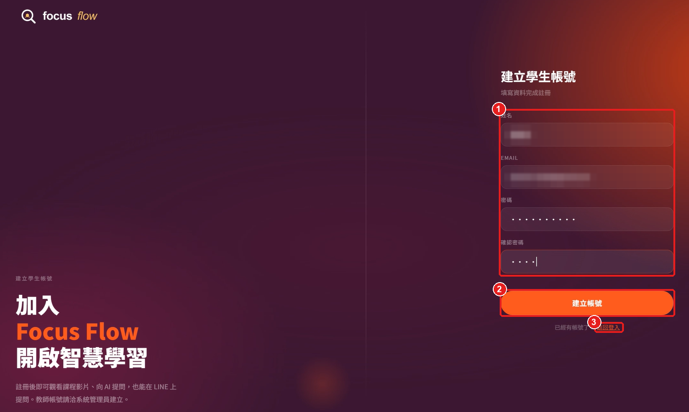

圖12-2-1　學生註冊畫面

剛註冊的帳號尚未被加入任何課程，因此總覽中的統計數字都是 0；請等授課教師把你加入修課名單後再開始上課。教師與管理員帳號不開放自行註冊，需由系統管理員建立。

### 12-2-2 學生與教師登入

學生與教師使用同一個登入頁（圖12-2-2）。先在①選擇身分為「學生」或「教師」，再於②輸入 Email 與密碼，按③「登入系統」即可進入對應的總覽頁。選擇的身分必須與帳號相符，例如教師帳號選了「學生」會無法登入，這時只要改選正確身分再登入一次即可。為了保護帳號，同一個 Email 在短時間內連續輸錯密碼，系統會暫時鎖定登入，請稍候再試。

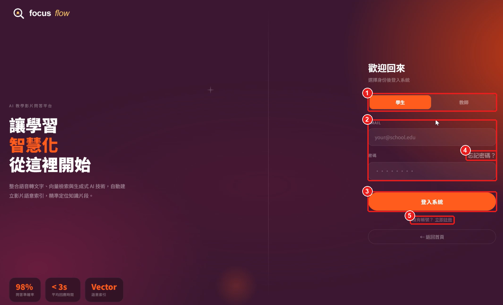

圖12-2-2　學生與教師登入畫面

忘記密碼時，按④「忘記密碼？」開啟重設視窗，操作步驟如下：

1. 輸入註冊時使用的 Email，按「寄送驗證碼」。
2. 到信箱收取 6 位數驗證碼，驗證碼 10 分鐘內有效。
3. 在視窗中輸入驗證碼，以及兩次相同的新密碼（至少 8 碼），送出後按「回到登入」，改用新密碼登入。

若畫面顯示系統尚未開啟寄信功能，或一直收不到驗證信，請聯絡授課教師協助重設密碼。沒有帳號的學生則可按⑤「立即註冊」建立帳號。

### 12-2-3 管理員登入

管理員請直接在瀏覽器網址列輸入 `/admin` 路徑，開啟管理員專用的登入頁（圖12-2-3），輸入管理員帳號的 Email 與密碼後按「登入管理後台」。這個入口只接受管理員帳號，學生或教師帳號登入時會顯示「此入口僅供管理員使用」。

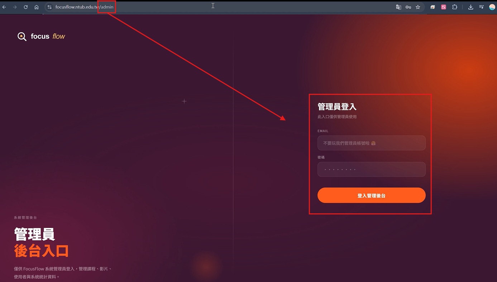

圖12-2-3　管理員登入畫面

### 12-2-4 通知、個人資料、問題回報與登出

登入後，每個畫面都有幾個固定的共用功能，位置如圖12-2-4 所示。

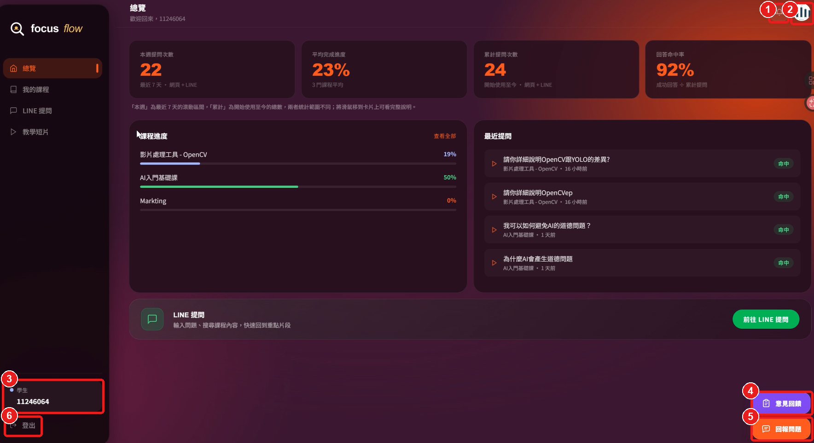

圖12-2-4　共用功能位置

1. **通知**：按右上角①鈴鐺開啟通知面板，未讀通知會特別標示。可以點選單則通知、將全部標為已讀，或按「載入更多」查看較早的通知。例如教師的短片被退回時，點選該則通知就會直接開啟對應的腳本。
2. **個人資料**：按②頭像，或按左下角③使用者名稱卡片，都可進入個人資料頁。在這裡可以修改姓名與 Email、變更密碼（需輸入目前密碼與兩次新密碼），也可以點擊頭像上傳新的照片，支援 JPEG、PNG 與 WebP 格式。
3. **意見回饋**：學生與教師的畫面右下角有④「意見回饋」按鈕，會開啟外部意見調查表單，填寫對系統的整體感想。
4. **問題回報**：遇到錯誤或操作困難時，按⑤「回報問題」開啟回報視窗，選擇回報類型（登入／帳號、課程或影片、AI 問答、LINE Bot、教學短片、畫面操作、其他）與影響程度，描述遇到的狀況後送出。可以附上最多 3 張截圖（JPEG、PNG 或 WebP，單張 10 MB 內），送出後管理員會在後台看到你的回報。
5. **登出**：按左下角⑥「登出」即可結束使用，系統會回到登入頁。在公用電腦上使用後，請務必登出。

## 12-3 學生操作

### 12-3-1 學生總覽（UC-04）

學生登入後會先看到總覽頁（圖12-3-1）。①上方四張卡片顯示本週提問次數、平均完成進度、累計提問次數與回答命中率，把滑鼠移到卡片上可以看到完整說明。②「課程進度」列出每門課已看完的影片比例，按「查看全部」會進入我的課程；③「最近提問」列出最近問過的問題與所屬課程。若要改用手機提問，按④「前往 LINE 提問」即可開始綁定 LINE。

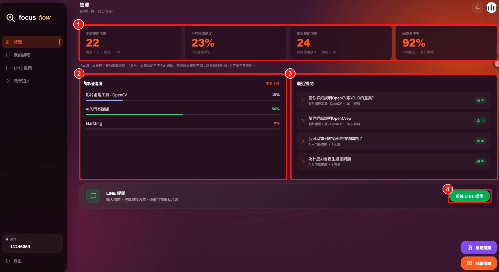

圖12-3-1　學生總覽

### 12-3-2 觀看課程影片（UC-04）

在側邊欄點選「我的課程」，會列出你目前修習且已發布的課程（圖12-3-2），③顯示各課程的影片觀看進度。按①「進入課程」開啟課程內容；若想改用手機 LINE 詢問這門課，則按②「詢問助教」（操作方式見 12-3-5）。

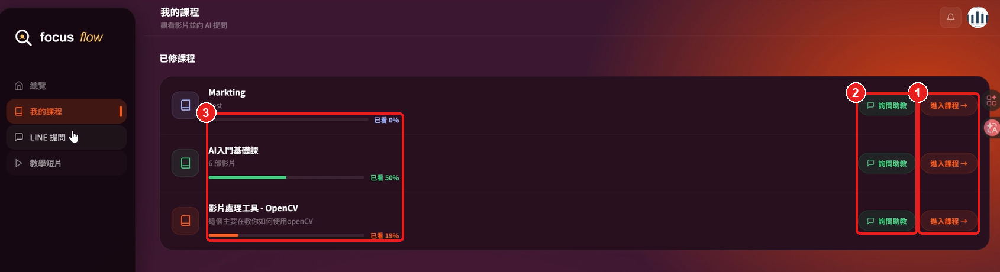

圖12-3-2　我的課程清單

進入課程後，畫面分成三個區塊（圖12-3-3）。從右側①「影片清單」點選要看的影片，影片會在左上方②播放器中播放；影片看完後，課程進度會自動更新。播放器下方的③「AI 問答」區可以直接針對這門課的影片內容提問，④「新對話」則用來開始一段新的問答。看完後按頁面上方的返回按鈕，即可回到課程清單。

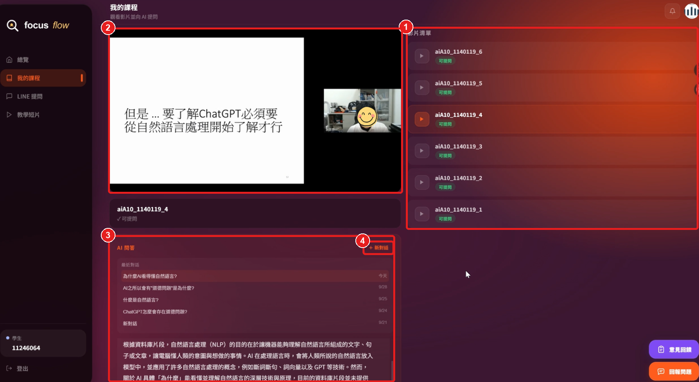

圖12-3-3　課程影片與 AI 問答區

### 12-3-3 向 AI 提問並回到影片片段（UC-04）

在 AI 問答區下方的輸入框輸入問題後，按「送出」或鍵盤 Enter 即可提問（圖12-3-4 上）。每則問題最多 50 個字，每位學生每天可以提問 5 次，網頁與 LINE 的提問次數合併計算。送出後，畫面會顯示「AI 正在搜尋課程片段並整理答案」，通常需要 10 到 20 秒（圖12-3-4 下），請耐心等候，不要重複送出。

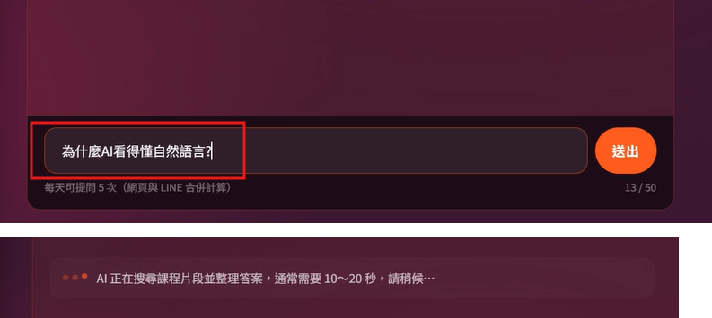

圖12-3-4　輸入問題與等待回答

AI 只會根據這門課的影片內容回答，不會引用其他課程。回答下方的紅框處會列出「參考課程片段」，每個片段都標示了所屬影片與時間區間（圖12-3-5）；片段較多時，按「顯示更多」可以展開全部片段。

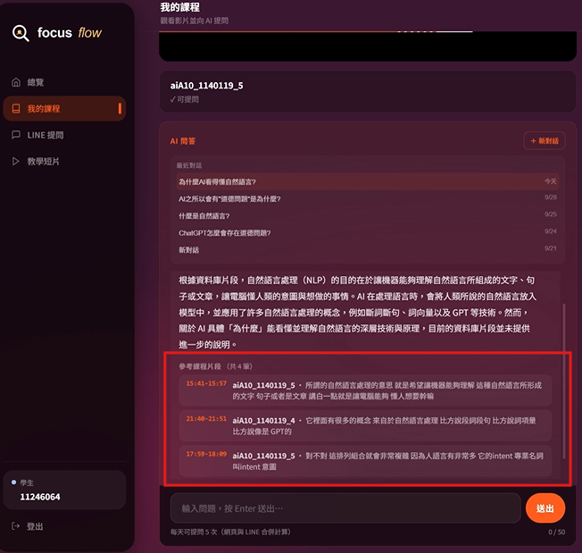

圖12-3-5　AI 回答與參考片段

想確認 AI 的回答是否正確，可以直接點選任一個參考片段，播放器會切換到該片段所屬的影片，並從對應的時間點開始播放（圖12-3-6）。這樣就不必從頭看完整支影片，只要看與問題相關的那幾十秒即可。

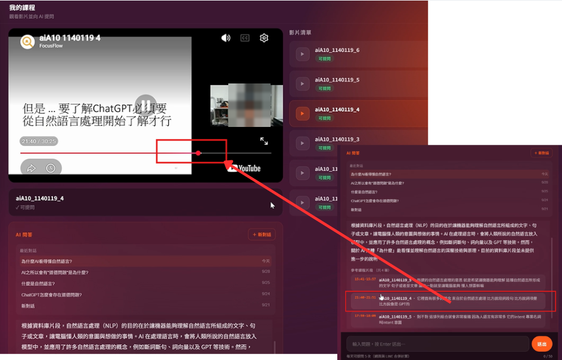

圖12-3-6　點選片段跳轉影片

同一段對話中可以繼續追問，AI 會參考前面的問題與回答，理解「那它和程式語言有什麼差異？」這類省略主詞的問題（圖12-3-7 下）。①「最近對話」列出這門課過去的對話，點選即可載入當時的問答紀錄繼續問；若想換一個全新的主題，按②「新對話」開始，避免前後問題互相干擾。若回答失敗且畫面出現「重新嘗試」，直接按該按鈕重送即可。

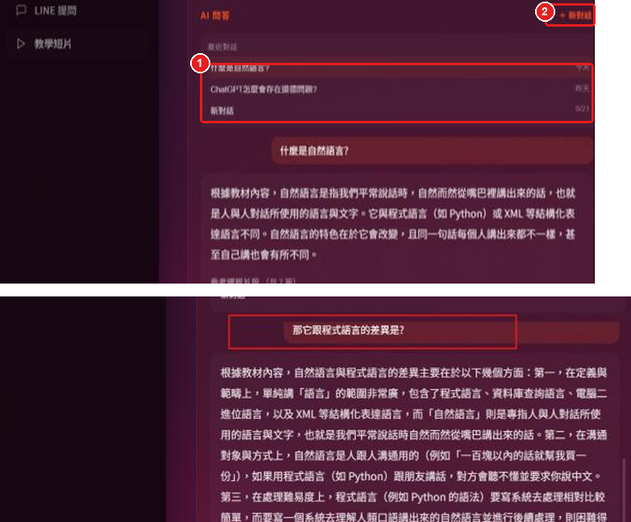

圖12-3-7　多輪問答與最近對話

### 12-3-4 綁定 LINE 並在 LINE 提問（UC-05）

綁定 LINE 後，就能在手機 LINE 上直接詢問課程內容。在側邊欄點選「LINE 提問」，依畫面上的三個步驟完成綁定（圖12-3-8）：

1. 依①的說明加入 FocusFlow 的 LINE 官方帳號：用手機掃描②的 QR code，或在手機上直接按「在手機上開啟 LINE」。
2. 系統會自動產生一組一次性綁定碼，顯示在③，有效時間為 10 分鐘。
3. 按「複製」後，把綁定碼貼到 LINE 聊天室送出；用手機開啟時，綁定碼會自動帶入。

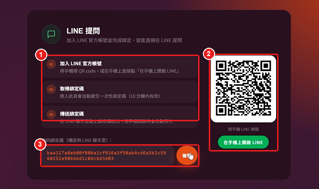

圖12-3-8　LINE 綁定指引

綁定碼送出後，LINE 會回覆「帳號綁定成功」，並請你先選擇課程（圖12-3-9）。之後在 LINE 聊天室輸入「切換課程」，就能從目前修習的課程中選擇要詢問的課程，接著直接輸入問題即可。回到網頁的 LINE 提問頁，也會看到帳號已綁定。

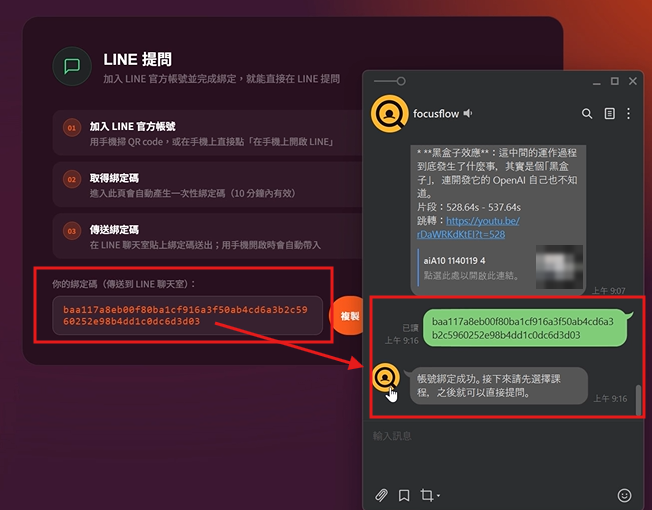

圖12-3-9　LINE 綁定成功

綁定碼過期時，重新整理 LINE 提問頁即可取得新的綁定碼。換手機或想改用其他 LINE 帳號時，在已綁定的 LINE 提問頁按「解除 LINE 綁定」並確認，再用新的帳號重新綁定。

### 12-3-5 詢問助教（UC-05）

在我的課程清單或課程內容頁按「詢問助教」，會在頁面上展開一張 QR code 小卡（圖12-3-10 左）。用手機 LINE 掃描後送出訊息，LINE 會完成綁定並自動切換到這門課（圖12-3-10 中），之後就能直接提問。LINE 的回答同樣會附上參考片段、時間區間與影片連結（圖12-3-10 右），點選連結即可從對應時間開始觀看；若該影片沒有提供連結，請回到網站的課程頁查看對應時間點。

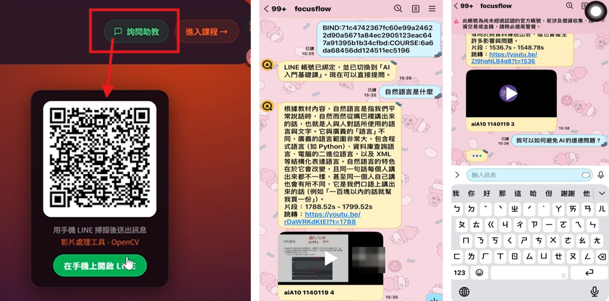

圖12-3-10　詢問助教與 LINE 提問

### 12-3-6 觀看教學短片（UC-07）

在側邊欄點選「教學短片」，會以卡片牆顯示你修習課程中已審核通過的短片（圖12-3-11），每張卡片標示短片標題、所屬課程與發布時間。點選紅框中的卡片即可播放。

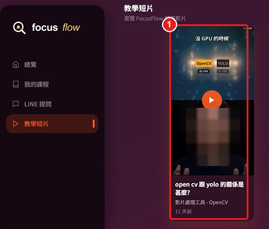

圖12-3-11　教學短片牆

短片會以直式播放視窗開啟（圖12-3-12），按鍵盤 Esc、右上角的關閉按鈕，或點選視窗外的背景，就能回到卡片牆。短片較多時，捲到最下方按「載入更多」查看其他短片；頁面上方也有連結可前往 FocusFlow 的 YouTube 頻道。若卡片牆是空的，代表你修習的課程目前還沒有審核通過的短片。

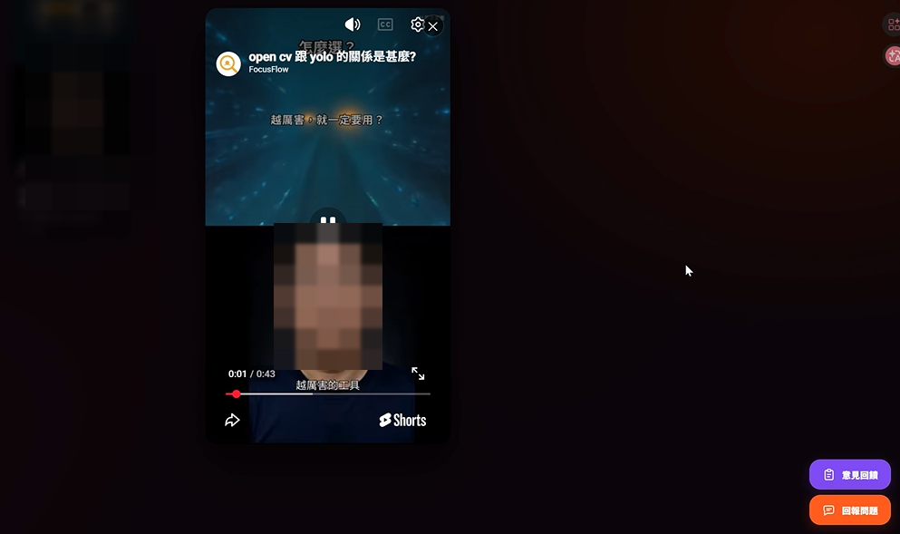

圖12-3-12　教學短片播放

## 12-4 教師操作

### 12-4-1 教師總覽

教師登入後會看到總覽頁（圖12-4-1）。①側邊欄提供總覽、課程管理、上傳影片、短影片腳本與短影片審核五個功能。②上方卡片顯示目前授課的課程數、影片數、可供 AI 搜尋的片段數與學生累計提問次數；下方左側是最近上傳的影片與處理狀態，按③「查看全部」會進入課程管理；右側「最常被引用的影片」列出學生提問時最常被 AI 引用的影片，可作為調整教材重點的參考。按④「上傳新影片」可直接前往上傳頁。

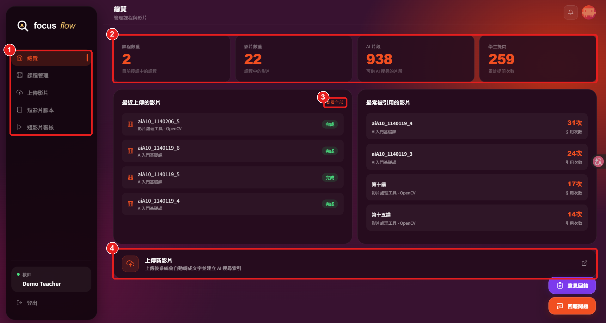

圖12-4-1　教師總覽

### 12-4-2 管理課程與修課學生（UC-02）

在側邊欄點選「課程管理」，會列出你授課的所有課程及其狀態、影片數與建立日期（圖12-4-2）。按①「新增課程」開啟新增視窗，填寫課程名稱與說明，並選擇狀態：「草稿」只有教師看得到，「已發布」讓修課學生可以看到，「已封存」則表示課程已結束。建立完成後，新課程會出現在列表中。

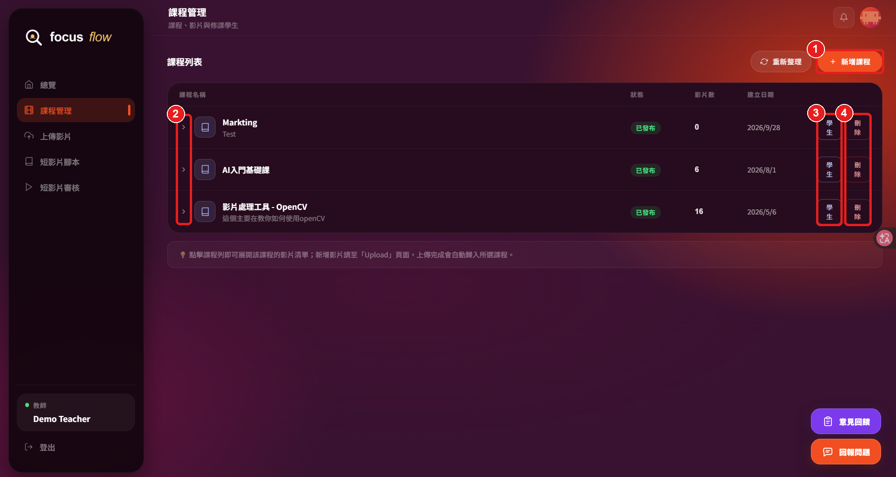

圖12-4-2　課程列表

在課程名稱左側按②展開箭頭，可以查看該課程的影片清單與處理狀態（圖12-4-3）。按①「掛載既有影片」可以把你其他課程中的影片加入這門課，不需要重新上傳，也不需要重新處理；掛載進來的影片旁會有「解除」按鈕，解除只會把影片從這門課移除，不會刪除影片本身。②影片清單中的影片若要永久刪除，按③「刪除」並在確認視窗中再次確認。

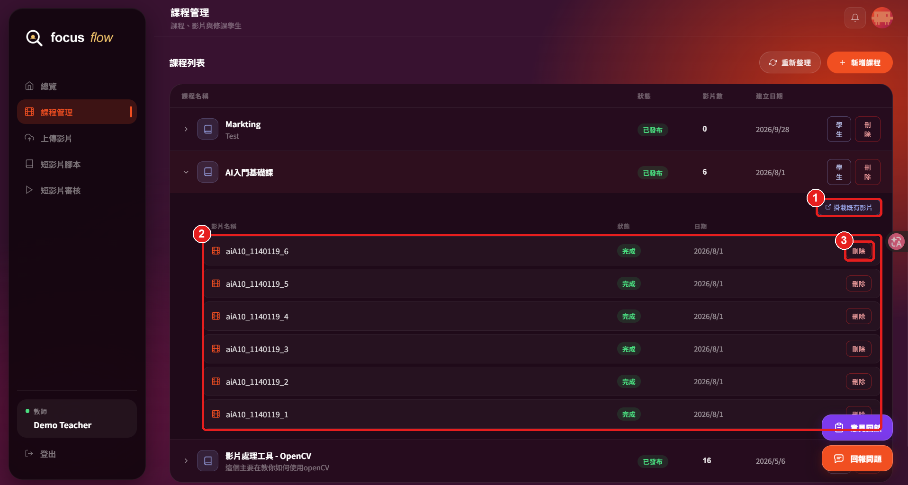

圖12-4-3　展開課程影片

學生必須在修課名單中才能看到課程。在課程列表按該課程的③「學生」，開啟修課學生管理視窗（圖12-4-4），有兩種加入方式：

1. **逐筆加入**：在①輸入學生註冊時使用的完整 Email，按「加入學生」。系統不會列出全站學生名單，必須輸入完整 Email 才能找到學生。
2. **匯入名單**：按②「匯入 CSV 名單」，選擇 UTF-8 編碼的 CSV 檔，第一列欄位為「姓名、Email、學號」，一次最多 200 筆。已有帳號的學生會直接加入課程；還沒有帳號的學生，系統會自動建立帳號，初始密碼為學號。匯入完成後，畫面會顯示新建、加入與略過的筆數，請提醒自動建立帳號的學生在第一次登入後到個人資料頁修改密碼。

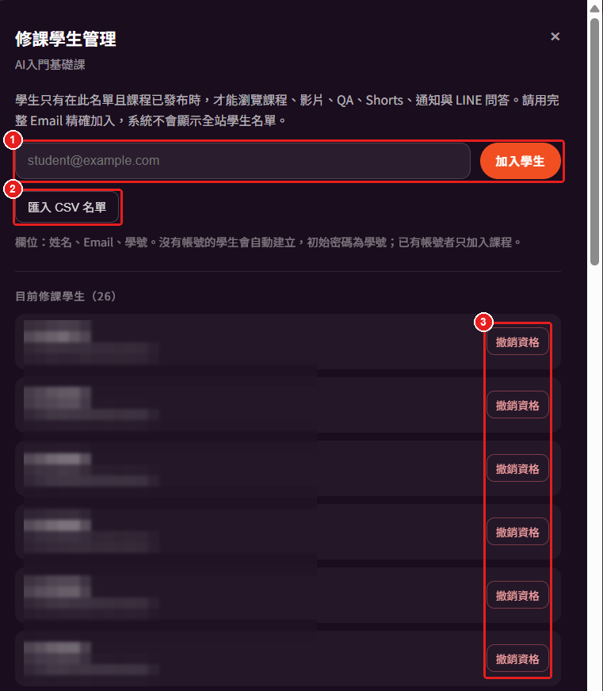

圖12-4-4　修課學生管理

學生退選時，在名單中按③「撤銷資格」並確認。撤銷後學生會立即無法存取這門課，但過去的提問紀錄仍會保留。

課程結束且不再需要時，可在課程列表按④「刪除」。系統會跳出確認視窗（圖12-4-5），①提醒刪除課程會一併移除課程底下所有影片、AI 片段、學生選課、提問紀錄與 LINE 課程選擇狀態，而且無法復原；確定要刪除才按②「確認刪除」，否則按「取消」。若只是想暫停開放，建議把課程狀態改為「已封存」，不要直接刪除。

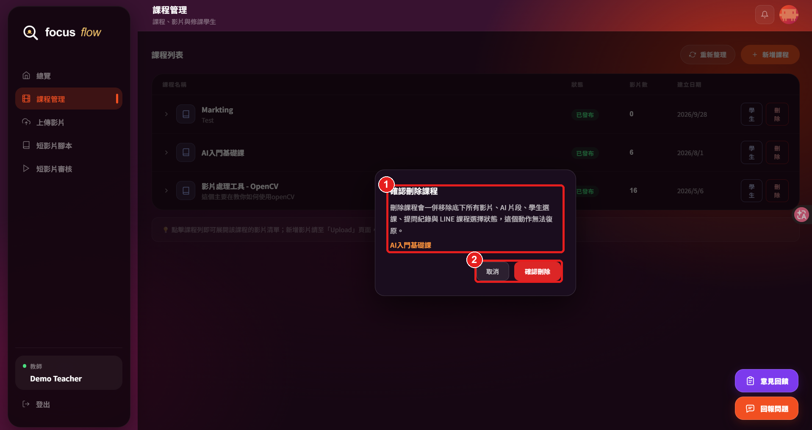

圖12-4-5　刪除課程確認

### 12-4-3 上傳影片並建立 AI 索引（UC-03）

在側邊欄點選「上傳影片」進入上傳頁（圖12-4-6），依下列步驟操作：

1. 將影片檔拖曳到①虛線框中，或點擊虛線框選擇檔案。支援 MP4、MOV、MKV 格式，單支最大 500 MB，一次最多可選 10 支。
2. 在②「課程」下拉選單選擇影片要放入的課程。
3. 只上傳一支影片時，可以在③輸入影片標題，例如「第三講：邏輯迴歸」；一次上傳多支時，標題會使用檔名。
4. 按④「上傳影片並建立 AI 索引」開始上傳。

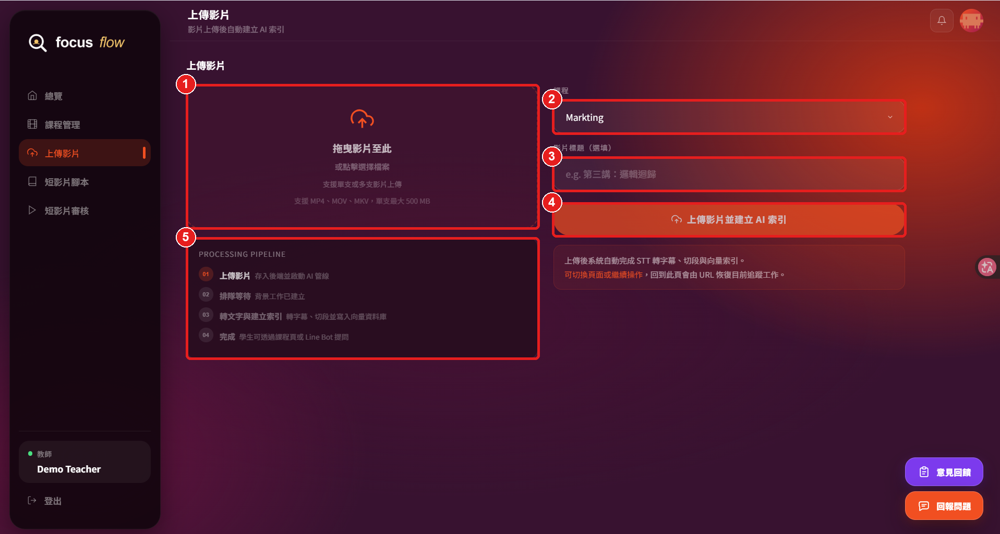

圖12-4-6　上傳影片

上傳後，⑤處理進度會依序顯示「上傳影片、排隊等待、轉文字與建立索引、完成」四個階段，並每 3 秒自動更新一次。處理需要一段時間，這段期間可以切換到其他頁面繼續工作，回到上傳頁時會自動恢復目前的追蹤進度。處理完成後，學生就能在課程頁和 LINE 針對這支影片提問；系統也會把影片以「不公開」方式上傳到 FocusFlow 的 YouTube 頻道供課程頁播放，「不公開」代表只有取得連結的人看得到，不會出現在搜尋結果中。

若某支影片處理失敗，進度旁會出現「重新處理」，按下即可只重試這一支影片，不影響同一批中已成功的影片。在課程管理的影片清單中，處理失敗的影片同樣可以按「重試處理」；YouTube 上傳失敗時，則可按「重傳 YouTube」。

### 12-4-4 製作短影片腳本（UC-08）

短影片腳本功能會根據學生常問的問題，自動挑選主題並產生短影片腳本，供教師錄製教學短片。在側邊欄點選「短影片腳本」後（圖12-4-7）：

1. 在①的下拉選單選擇課程。②「腳本」列出這門課已建立的腳本與狀態，③「候選主題」則把學生問過的相似問題合併成主題，並標示幾個人問過、共問了幾次。
2. 建立腳本有兩種方式：直接按①「自動選題建立腳本」，系統會挑選提問最多、且課程內容足以回答的主題；或先在③點選想做的主題，再按「用選定主題建立腳本」。
3. 點選一份腳本後，右側④「腳本內容」分頁會顯示腳本的主題、分鏡、口白與字幕。⑤「視覺隱喻」可從系統建議中選擇一組畫面比喻，選擇的內容會寫進複製出的腳本。
4. 腳本沒有問題時，按⑥「複製完整腳本」，貼到錄製或剪輯的工作流程中使用；若不滿意，按「這版不要，重新生成」，選擇回饋類型並說明想修改的地方，系統會依回饋產生新版本，舊版本與回饋都會保留。

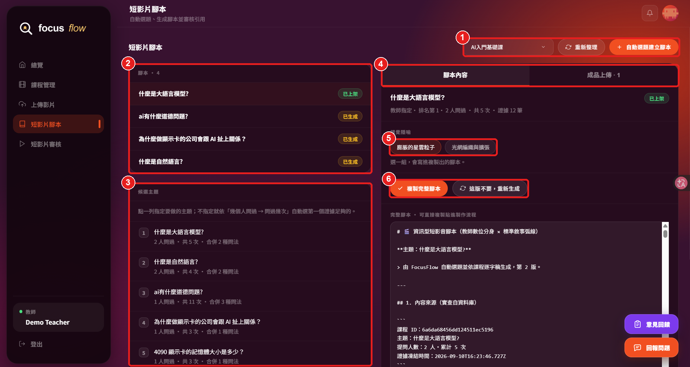

圖12-4-7　短影片腳本內容

新建立的腳本會先出現在①腳本清單中，狀態為「證據已凍結，待生成」，表示系統已經找好這個主題可引用的課程片段（圖12-4-8）。按②「生成腳本」後稍等片刻，狀態變為「已生成」，即可檢視腳本內容。

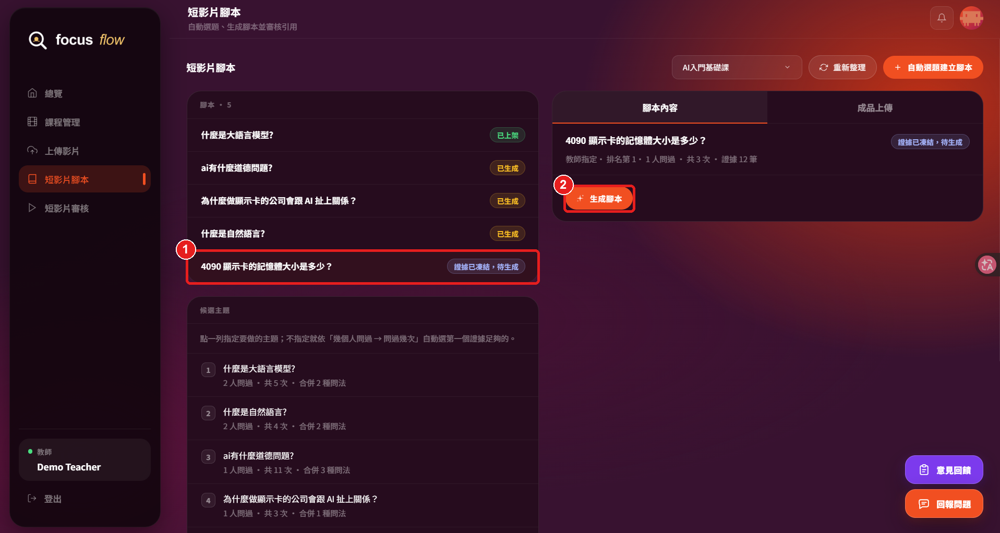

圖12-4-8　建立新腳本

### 12-4-5 上傳短影片成品並送審（UC-08）

依腳本錄製好短影片後，在同一份腳本切換到①「成品上傳」分頁（圖12-4-9）：

1. 將短影片拖曳到②虛線框，或點擊選擇檔案，支援 MP4、MOV、MKV，單支最大 500 MB。
2. 在③確認 YouTube 標題，並視需要填寫影片說明，說明會一併顯示在 YouTube 上。
3. 在④勾選兩項上傳前確認：影片若含 AI 生成畫面或數位分身，已加上全片常駐的 AI 標示；若使用教師的數位分身，已取得該教師的書面同意。系統只記錄你的確認與時間，不會代為檢查或取得同意書。
4. 按⑤「上傳成品並送審」。

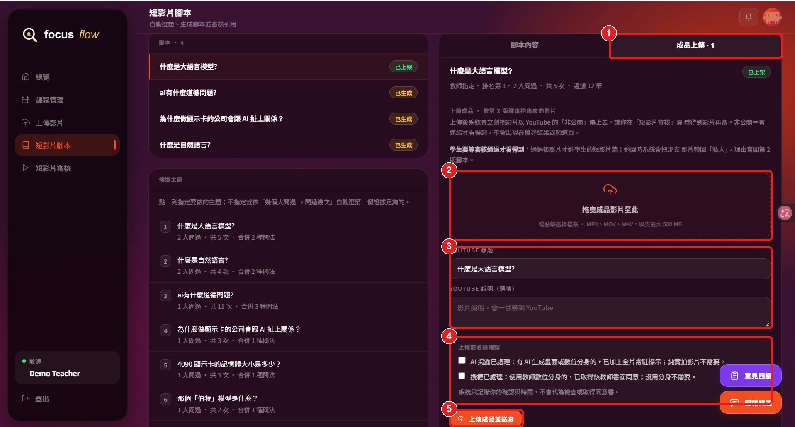

圖12-4-9　成品上傳

送出後，畫面會顯示①「已送出」的提示：系統正在把影片以「不公開」方式上傳到 YouTube，完成後就能在「短影片審核」頁審核（圖12-4-10）。下方②「這份腳本的成品」會列出成品目前的狀態，審核通過之前標示為「待審核」，學生還看不到這支短片。

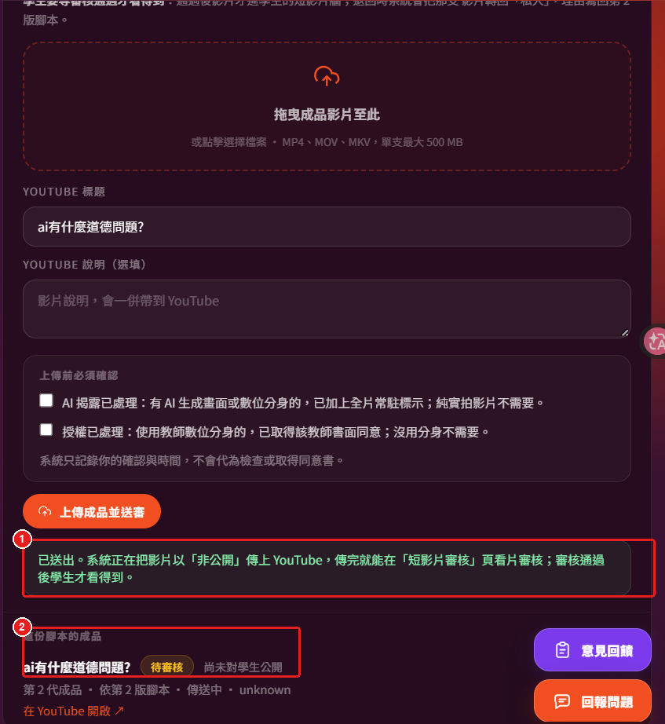

圖12-4-10　成品送審結果

### 12-4-6 審核短影片（UC-08）

在側邊欄點選「短影片審核」，在①「待審短影片」下拉選單中選擇要審核的短片（圖12-4-11）。②上方的進度條顯示目前位於「審核短影片、確認送出、完成」三個步驟中的哪一步。

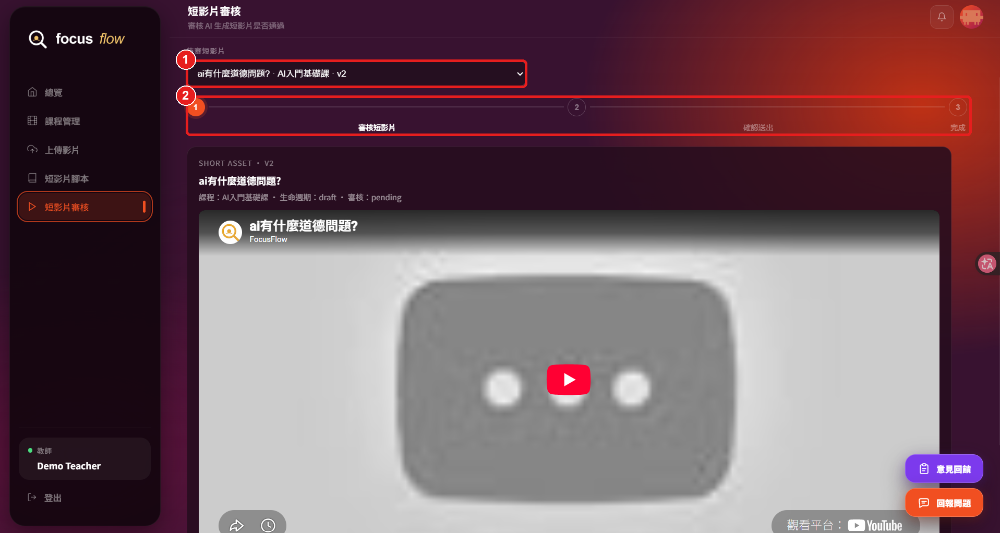

圖12-4-11　選擇待審短影片

在畫面中播放短片檢查內容，也可以按①「在 YouTube 開啟預覽」以完整畫面觀看（圖12-4-12）。檢查完畢後，在②選擇「通過並公開給學生」或「不通過」。

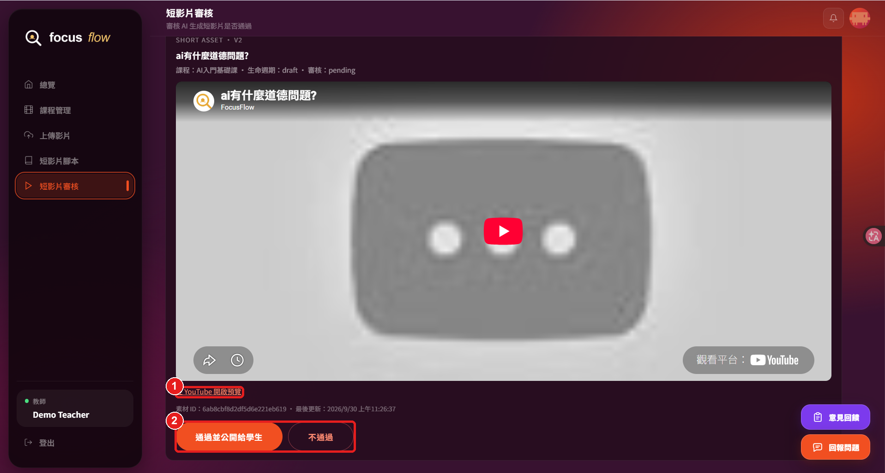

圖12-4-12　審核決定

選擇「不通過」時，右側會出現退回理由（圖12-4-13）。在①勾選一個或多個理由：內容不正確、聲音問題、畫面品質問題、字幕問題、內容不完整或其他；勾選「其他」時必須填寫說明，其餘理由可視需要補充。填寫完成後按②「下一步：確認理由」。

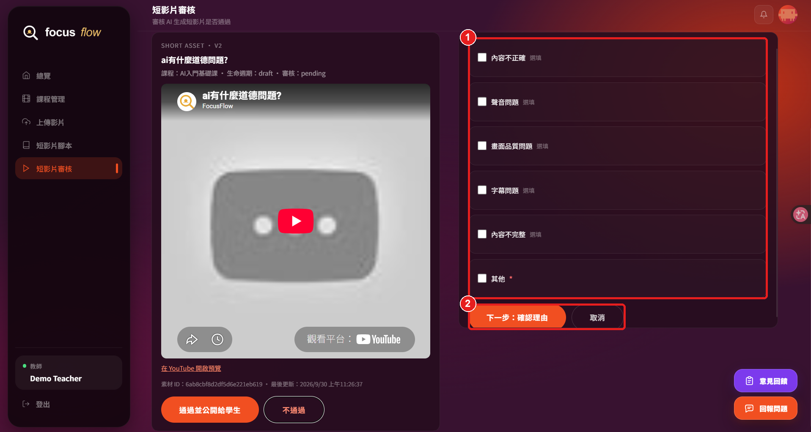

圖12-4-13　不通過理由

進入第二步後，①會說明送出後的結果，請再次確認（圖12-4-14）：審核通過時，短片會出現在修課學生的短片牆，影片不會重新上傳，也不會改變它在 YouTube 上的隱私設定；退回時，學生看不到這支短片，系統會把影片在 YouTube 上轉為「私人」，並通知製作的教師。確認無誤後按②「確認通過並公開」（退回時按鈕為「確認送出」）；若想修改決定，按「返回修改」回到上一步。畫面顯示「完成」後，審核才算成功。

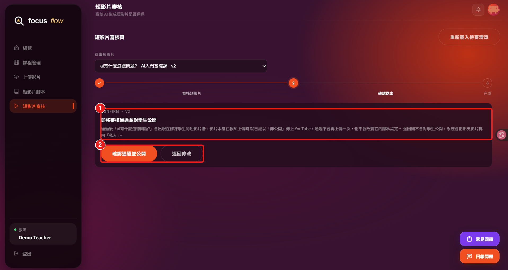

圖12-4-14　確認送出審核

若畫面提示這支短片已被其他教師處理，請按「重新載入待審清單」取得最新狀態，不要重複送出審核。

## 12-5 管理員操作（UC-09）

### 12-5-1 系統總覽

管理員登入後會看到系統總覽（圖12-5-1）。①上方卡片顯示使用者總數（並分列學生、教師、管理員人數）、影片總數、可供 AI 搜尋的索引片段數與累計提問數。②「使用者分布」以長條顯示各角色人數與 LINE 綁定率，按③「管理」會進入使用者管理。④「系統服務」列出資料庫、AI 問答、LINE Bot、語音轉文字 Pipeline 與 YouTube 自動上傳的運作狀態，全部顯示「正常」代表各項服務可以使用；若有服務出現異常，學生提問或教師上傳可能會失敗，請優先處理。

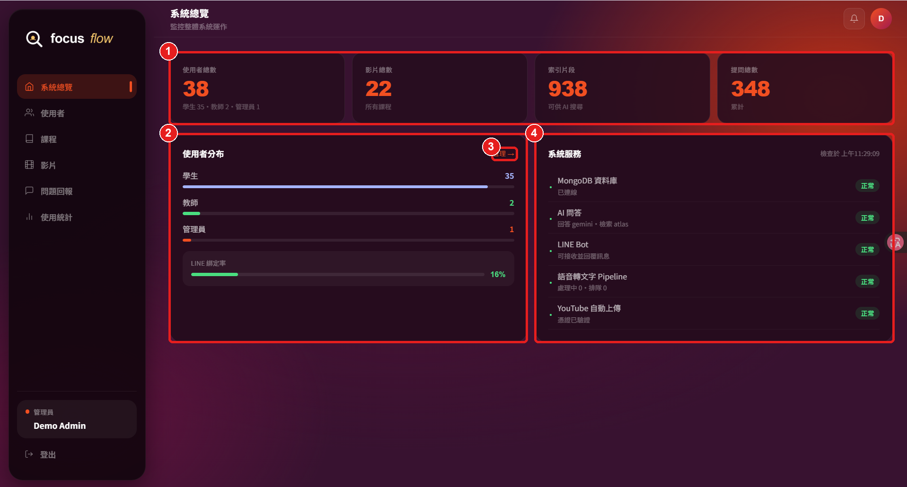

圖12-5-1　系統總覽

### 12-5-2 管理使用者

在側邊欄點選「使用者」，會列出所有帳號的姓名、Email、身分、修課數、提問數、狀態與加入日期（圖12-5-2）。按①「編輯」開啟編輯視窗，可以修改：

1. **姓名與身分**：變更學生、教師或管理員身分前，請先確認該帳號的課程與修課資料，避免影響既有課程。
2. **每日提問上限**（僅限學生）：可選擇跟隨全站預設、不限次數，或為這位學生設定自訂次數。
3. **帳號啟用**：取消勾選即可停用帳號，停用後該帳號將無法登入。

修改後按「儲存」生效。其他人剛註冊或修改資料時，按②「重新整理」即可取得最新名單。

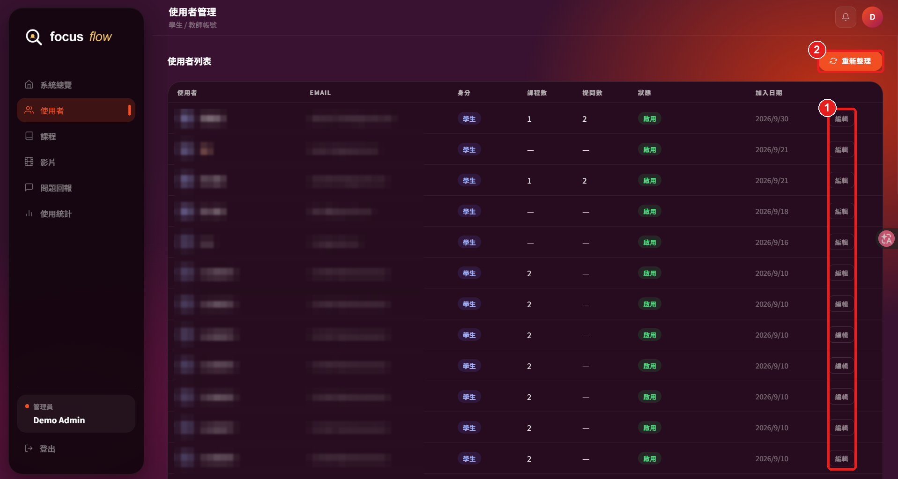

圖12-5-2　使用者管理

### 12-5-3 管理課程

在側邊欄點選「課程」，會列出全站所有課程與授課教師（圖12-5-3）。管理員不受授課教師的限制，可以管理任何一門課：

1. 按①「新增課程」建立課程，並指定授課教師。
2. 按②「學生」管理修課名單，操作方式與教師相同（見 12-4-2）。
3. 按③「編輯」修改課程名稱、描述、狀態與授課教師（圖12-5-4）。例如教師異動時，只要在②「授課教師」改選新的教師，再按③「儲存修改」即可。
4. 按④「刪除」刪除課程，系統會提醒課程及其所有影片、AI 索引片段、選課紀錄都將永久刪除，確認後才會執行。

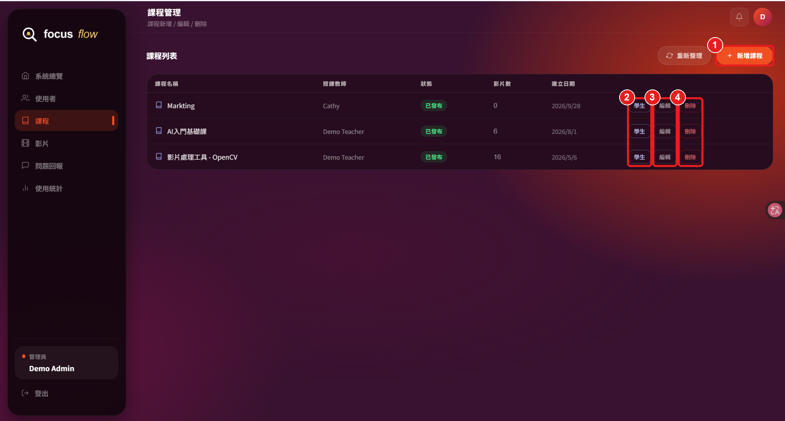

圖12-5-3　課程管理

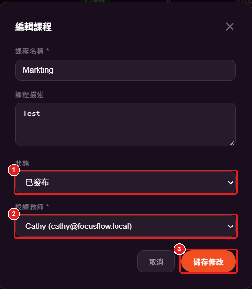

圖12-5-4　編輯課程

### 12-5-4 管理影片

在側邊欄點選「影片」，會列出全站所有影片的所屬課程、教師、處理狀態、片段數與建立日期（圖12-5-5）。①「狀態」與「片段數」可以用來確認影片是否已處理完成：狀態為「完成」且片段數大於 0，代表學生已經可以針對這支影片提問。按②「刪除」可刪除影片，確認後系統會移除影片及其 AI 片段，並把 FocusFlow 上傳的 YouTube 影片轉為私人；學生過去的提問紀錄仍會保留，並標示「內容已下架」。

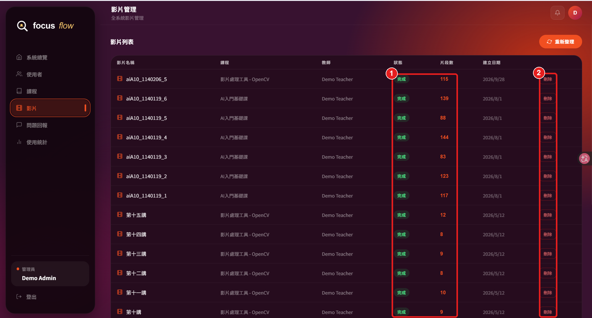

圖12-5-5　影片管理

### 12-5-5 處理問題回報

學生與教師送出的問題回報，會集中在「問題回報」頁（圖12-5-6），列出提交者、類型、影響程度、內容、附件、狀態與時間。可以用①的篩選選單依類型、影響程度與處理狀態篩選；有附件的回報，點選附件即可預覽截圖。處理回報時，在②狀態欄點開選單，依進度改為③「待處理、處理中、已解決、已結案」其中之一，方便其他管理員掌握處理情形。

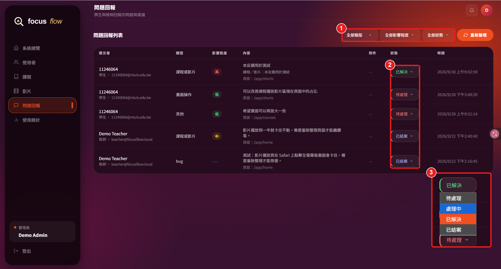

圖12-5-6　問題回報

### 12-5-6 查看使用統計

在側邊欄點選「使用統計」，①上方卡片顯示本月的登入次數、影片點開次數、提問次數與短影音查看次數（圖12-5-7）；②「事件紀錄」依時間列出最近的使用事件，包含事件類型、使用者、課程與發生時間。課程被刪除後，它過去的事件紀錄仍會保留在統計中。

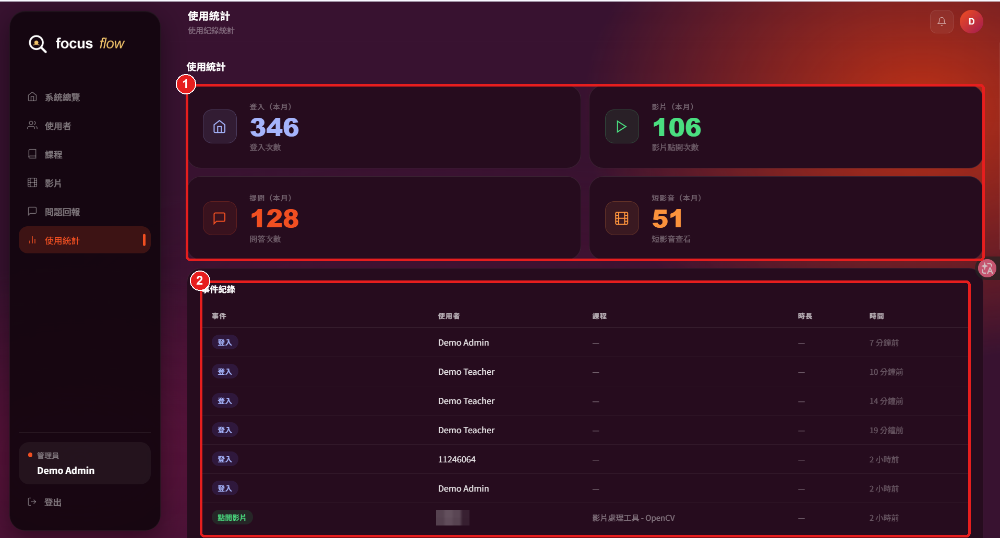

圖12-5-7　使用統計

### 12-5-7 發送系統公告

管理員可以向所有學生發送系統公告，例如停機維護通知：

1. 按右上角的鈴鐺開啟通知面板。
2. 在「發送系統公告」區填寫標題與內容；需要學生特別注意時，勾選「緊急公告」。
3. 按「發送」後，畫面會顯示公告實際送達的學生人數。標題或內容沒有填寫時，公告不會送出。

學生下次開啟通知面板時就會看到這則公告，緊急公告會以醒目標示呈現。

## 12-6 常見問題

**登入後「我的課程」是空的？**

學生必須被加入課程的修課名單，而且課程必須是「已發布」狀態才會出現。請聯絡授課教師確認；教師可在課程管理按「學生」檢查名單。

**AI 回答「目前資料庫片段不足以回答這個問題」？**

代表這門課的影片內容沒有提到你問的主題。可以換個說法、把問題問得更具體，或確認問題是否屬於這門課的範圍。

**提示「今天的提問次數已用完」？**

每位學生每天可提問的次數有限，網頁與 LINE 合併計算，隔天會自動恢復。若課程需要更多提問次數，請授課教師聯絡管理員調整。

**LINE Bot 沒有回應？**

先確認網頁的 LINE 提問頁顯示已綁定，並在 LINE 輸入「切換課程」選擇課程後再提問。若仍沒有回應，請使用「回報問題」通知管理員。

**影片上傳後一直停在處理中？**

長影片需要較長的處理時間，可以先切換到其他頁面，稍後回到上傳頁查看。若顯示處理失敗，按「重新處理」重試；多次失敗時，請回報問題並附上影片名稱。

**回報問題時要提供哪些資訊？**

請描述發生時間、所在頁面、課程或影片名稱、畫面上的錯誤訊息，以及如何重現問題，必要時附上截圖。請勿在回報內容中填寫密碼或其他個人敏感資料。
