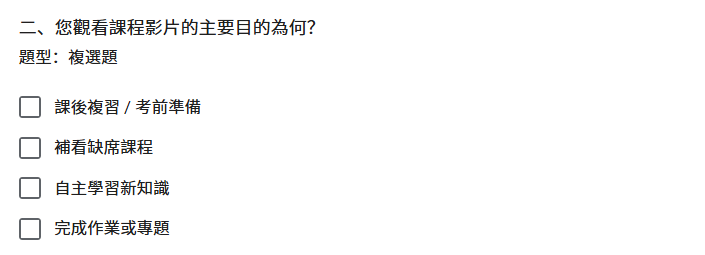
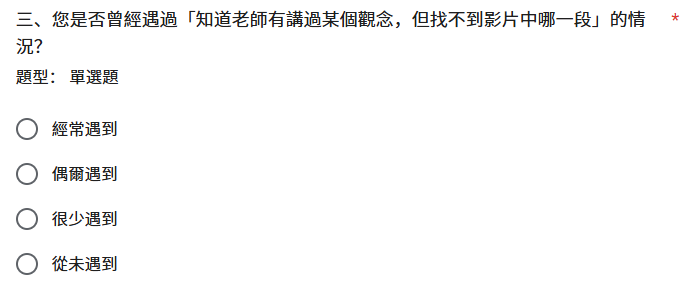
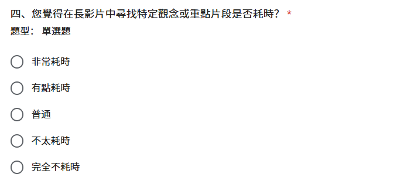
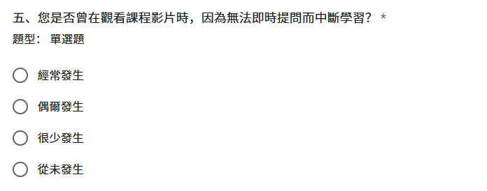
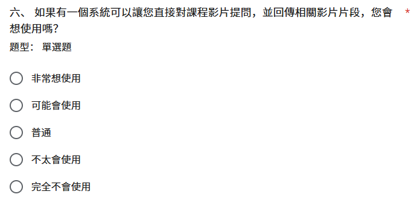
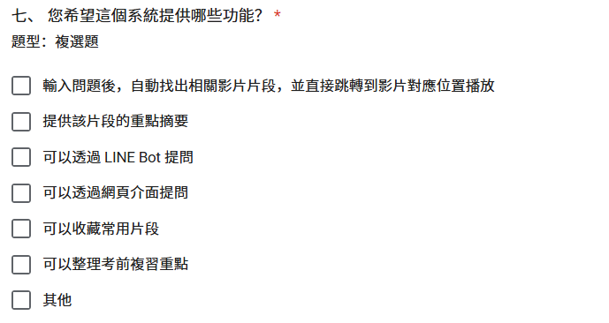
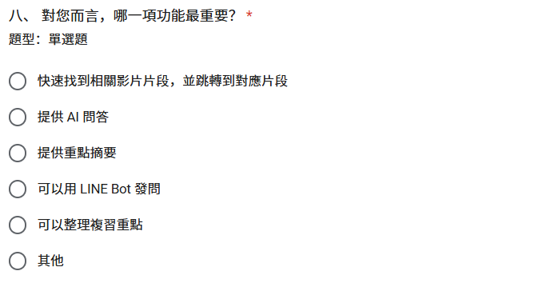
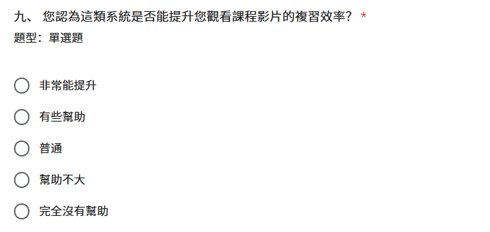
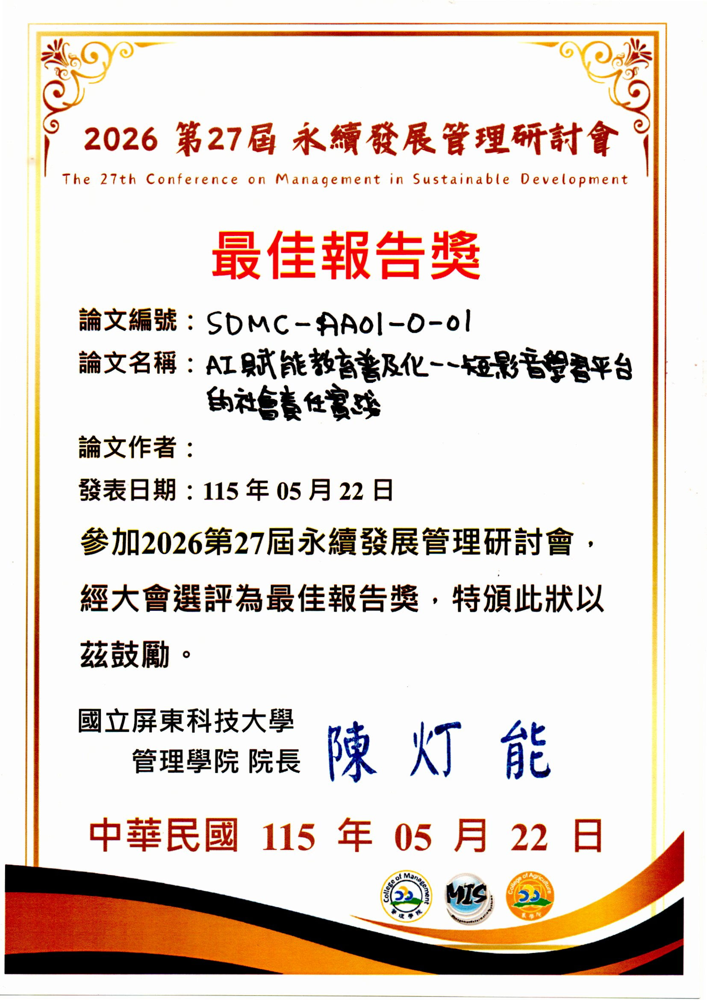

# 第15章 附錄

本章保存專題過程的原始佐證，包括會議紀錄、需求問卷、發表證明，以及初評與複評意見的修正追蹤。會議中的規劃與技術決議只代表當時狀態；若與目前程式或前文不同，應以前文章節標示的現行實作為準，不將歷史討論改寫成已完成成果。

來源為 [初評系統手冊 DOCX](../source-documents/專題手冊_初評最終版.docx) 與 [會議索引](../../../50_Meetings/README.md)。問卷及證明圖片目前沿用初評原件，待第二階段完成圖名、圖號與版面整理。

---

## 15-1 會議紀錄

國立臺北商業大學　資訊管理系

表15-1-1　第1次專題討論會議紀錄[4]

| 會議日期：中華民國 115 年 01 月 22 日 | 會議地點：線上 |
| --- | --- |
| 會議主席：蒯思齊 | 會議記錄：邱偉豪 |
| 開會時間：10:00 | 散會時間：12：00 |
| 會議議題：讀書彙報(寒假_1th |  |
| 開會人員：指導老師　蒯思齊組員　邱偉豪、張庭語、張家瑜、鍾百陶 |  |
| 會議內容： 一、討論內容 本次會議主要說明神經網路與監督式學習的基本概念。教授指出，神經網路具有黑盒子特性，無法像傳統程式一樣手動寫出完整判斷規則，而是由模型從資料中自行學習特徵。 硬體方面，深度學習高度依賴 NVIDIA GPU，主要原因是 GPU 適合處理張量與矩陣運算，效率高於一般 CPU。模型設計方面，以 MNIST 為例，輸出層需設為 10 個神經元，對應 0 到 9 共 10 種分類結果。 教授也強調 Label 的重要性。Label 即標準答案，若資料沒有標籤，模型就無法計算 Loss，也無法透過反向傳播修正參數。因此專題選題時不能只看是否有資料，還要確認資料是否有對應標準答案，否則可能變成非監督式學習或需要大量人工標註。 二、決議事項 名詞統一使用台灣說法：啟動函數。 GPU 對矩陣運算與張量處理非常重要。 監督式學習必須具備 Label，否則模型無法修正學習。 專題選題時需確認資料是否具備標準答案。 若資料無 Label，將增加人工標註成本與專題難度。 本次未完成報告內容，於下次會議繼續。 |  |
| 下次開會時間：中華民國 115 年 01 月 27 日 下次會議內容：簡報製作 |  |

國立臺北商業大學　資訊管理系

表15-1-2　第2次專題討論會議紀錄

| 會議日期：中華民國 115 年 01 月 27 日 | 會議地點：線上 |
| --- | --- |
| 會議主席：蒯思齊 | 會議記錄：邱偉豪 |
| 開會時間：14:00 | 散會時間：16:00 |
| 會議議題：讀書彙報(寒假_2th |  |
| 開會人員：指導老師　蒯思齊組員　邱偉豪、張庭語、張家瑜、鍾百陶 |  |
| 缺席人員：無 |  |
| 會議內容： 一、討論內容 本次會議討論 NLP 與 CNN 的模型選擇策略。CNN 不只可用於影像，也能處理文字中的關鍵特徵，例如倒裝句、意圖判斷等，因此不一定所有 NLP 問題都需使用 LSTM。 CNN 架構方面，現代主流多採連續小卷積核堆疊，再搭配 Pooling，相較傳統大卷積可減少參數、增加非線性，並支援更深層網路。 教授也說明 AI 的核心挑戰是泛化性。模型容易因規則改變而失效，可透過 Dropout 與資料增強降低 Overfitting。實務部署上，模型訓練完成後需透過 Flask API 架設服務，才能整合成 Line Bot 等實際產品。 二、決議事項 期末專題選題應避免純計算或死記硬背型題目。 專題方向可朝泛化性高或具創意應用的主題發展。 技術學習需釐清 CNN 原理，如 Padding 與 Pooling。 題目確定後，可參考老師提供的範例與 AI 跨域班資料。 後續可使用本地端顯卡資源協助模型訓練。 |  |
| 下次開會時間：中華民國 115 年 02 月 03 日 下次會議內容：簡報製作 |  |

國立臺北商業大學　資訊管理系

表15-1-3　第3次專題討論會議紀錄

| 會議日期：中華民國 115 年 02 月 03 日 | 會議地點：線上 |
| --- | --- |
| 會議主席：蒯思齊 | 會議記錄：邱偉豪 |
| 開會時間：14:00 | 散會時間：16:00 |
| 會議議題：讀書彙報(寒假_3th |  |
| 開會人員：指導老師　蒯思齊組員　邱偉豪、張庭語、張家瑜、鍾百陶 |  |
| 缺席人員：無 |  |
| 會議內容： 一、討論內容 進行簡報報告。 二、決議事項 下次開會時間 02 月 10 日 |  |
| 下次開會時間：中華民國 115 年 02 月 10 日 下次會議內容：簡報製作 |  |

國立臺北商業大學　資訊管理系

表15-1-4　第4次專題討論會議紀錄

| 會議日期：中華民國 115 年 02 月 10 日 | 會議地點：線上 |
| --- | --- |
| 會議主席：蒯思齊 | 會議記錄：邱偉豪 |
| 開會時間：14:00 | 散會時間：16:00 |
| 會議議題：讀書彙報(寒假_4th |  |
| 開會人員：指導老師　蒯思齊組員　邱偉豪、張庭語、張家瑜、鍾百陶 |  |
| 缺席人員：無 |  |
| 會議內容： 一、討論內容 本次會議介紹生成式模型核心技術，包含 DeepDream、神經風格遷移、VAE 與 GAN 的運作原理與差異，並討論自編碼器的壓縮概念，以及 Temperature 參數如何影響生成結果的隨機性。 模型訓練方面，說明超參數優化、模型集成、混合精度與遷移學習等加速方法。遷移學習可重用預訓練模型已學到的通用特徵，縮短訓練時間。CNN 特徵提取則由淺層辨識線條、邊緣等基本元素，深層辨識較完整的物體特徵。 另有同學反映 API Key 出現 429 Error，老師說明免費版 API 有頻率與總量限制，付費版或教育版額度較高。 二、決議事項 下週因過年暫停會議一次。 Temperature 相關內容可觀看老師錄製影片。 後續可透過實作調整 Temperature，觀察生成結果差異。 |  |
| 下次開會時間：中華民國 115 年 02 月 24 日 |  |

國立臺北商業大學　資訊管理系

表15-1-5　第5次專題討論會議紀錄

| 會議日期：中華民國 115 年 02 月 24 日 | 會議地點：線上 |
| --- | --- |
| 會議主席：蒯思齊 | 會議記錄：邱偉豪 |
| 開會時間：14:00 | 散會時間：16:00 |
| 會議議題：讀書彙報(過年後_1th |  |
| 開會人員：指導老師　蒯思齊組員　邱偉豪、張庭語、張家瑜、鍾百陶 |  |
| 缺席人員：無 |  |
| 會議內容： 一、討論內容 本次會議討論專題可能會使用 AI 與 n8n，組員需先熟悉 n8n 基本操作。因系統規模較大、token 消耗可能偏高，老師預計在本機端部署 Ollama，提供 API 使用，校外連線需透過學校 VPN。 老師示範以 Ollama 運行本地端大語言模型，並說明本地部署對企業資料保密的重要性。高效能模型對硬體需求高，例如大型模型可能需要約 70GB 記憶體，一般單張 RTX 4090 或 5090 不一定足夠。 商業模式方面，教授強調系統必須具備創造收益或降低成本的價值，可從訂閱制、廣告引流、企業降本等方向思考，例如長者陪伴 AI、會計報帳 AI、ERP 或 CRM 等應用。 二、決議事項 開學沒意外會要交企畫書，每人下周二前想一個主題出來 開學準備： 需申請學校 VPN 帳號以便在校外呼叫校內伺服器資源（如 Ollama API）。 會議時間協調：開學後週二下午的定期專題指導時間（下午 5:30 - 6:30 ） |  |
| 下次開會時間：中華民國 115 年 03 月 03 日 下次會議內容： 看跨域班影片 GitHub 研究 想專題主題 借討論室 |  |

國立臺北商業大學　資訊管理系

表15-1-6　第6次專題討論會議紀錄

| 會議日期：中華民國 115 年 03 月 03 日 | 會議地點：圖書館討論室 |
| --- | --- |
| 會議主席：蒯思齊 | 會議記錄：邱偉豪 |
| 開會時間：17:30 | 散會時間：19:30 |
| 會議議題：開學後_1th |  |
| 開會人員：指導老師　蒯思齊組員　邱偉豪、張庭語、張家瑜、鍾百陶 |  |
| 缺席人員：無 |  |
| 會議內容： 一、討論內容 大家分享查到的專題主題並討論 二、決議事項 最終確定從兩個題目中2選1： AI x 智慧衣櫥：穿搭推薦與服裝管理 短影音成癮 x 自我管理：FocusFlow |  |
| 下次開會時間：中華民國 115 年 03 月 10 日 下次會議內容：想專題主題 |  |

國立臺北商業大學　資訊管理系

表15-1-7　第7次專題討論會議紀錄

| 會議日期：中華民國 115 年 03 月 10 日 | 會議地點：圖書館討論室 |
| --- | --- |
| 會議主席：蒯思齊 | 會議記錄：邱偉豪 |
| 開會時間：17:30 | 散會時間：19:00 |
| 會議議題：確定題目_2th |  |
| 開會人員：指導老師　蒯思齊組員　邱偉豪、張庭語、張家瑜、鍾百陶 |  |
| 缺席人員：無 |  |
| 會議內容： 一、討論內容 回報確定的題目短影音 二、決議事項 最終確定短影音，並決定使用教授自己就已經錄製了一些上課錄影的 VOD。 並制定接下來行動方針為調查一下現在市面上的短影音生成服務 (如最有名的 Sora2 或是 Seedance 2 之類的)， 了解一下他們可以做什麼。 |  |
| 下次開會時間：中華民國 115 年 03 月 24 日 下次會議內容： 決定專題題目 收集短影音製作的服務與模型的資料(邱偉豪、鍾百陶) 收集語音轉文字技術的資料(張庭語) 收集如 BLIP 等畫面描述技術的資料(張家瑜) |  |

國立臺北商業大學　資訊管理系

表15-1-8　第8次專題討論會議紀錄

| 會議日期：中華民國 115 年 03 月 24 日 | 會議地點：圖書館討論室 |
| --- | --- |
| 會議主席：蒯思齊 | 會議記錄：張家瑜 |
| 開會時間：17:30 | 散會時間：19:30 |
| 會議議題：確認 ChatGPT 規劃、Codex 實作的 AI 分工流程，並建立 GitHub 留痕與 AI 使用紀錄方式。 |  |
| 開會人員：指導老師　蒯思齊組員　邱偉豪、張庭語、張家瑜、鍾百陶 |  |
| 缺席人員：無 |  |
| 會議內容： 一、討論內容 本次會議確認專題開發採 ChatGPT 規劃、Codex 實作的 AI 分工流程。先由 ChatGPT 進行產品規劃、功能流程與架構設計，再整理成結構化 prompt 交給 Codex 產生程式實作，以降低 token 浪費並提高生成品質。 教授提醒，AI 產出最多只能完成約 80%，剩餘 20% 仍需由團隊補齊、修正與客製化。專題報告中也要清楚區分 AI 產出與團隊自行判斷、修改、取捨的部分。 6/2 文件撰寫方向以目前最具體可行的工具、系統設計、技術規劃與開發流程為主，後續成果可依工具迭代調整。GitHub 需從現在開始持續更新，保留會議紀錄、實作、簡報、文件版本與修改歷程。 二、決議事項 採用 ChatGPT 規劃、Codex 實作的 AI 分工方式。 將規劃內容整理成結構化 prompt，供後續開發與報告使用。 AI 產出需由團隊修正與客製化，並說明人為貢獻。 專題以高標願景為方向，以可用核心成果為落地目標。 6/2 文件先寫最具體可行方案，保留後續調整彈性。 GitHub 需持續上傳會議紀錄、實作、簡報、文件與版本紀錄。 |  |
| 下次開會時間：中華民國 115 年 03 月 31 日 下次會議內容： 三月底前完成需繳交資料。 建立 AI 使用紀錄模板，固定記錄目標、模型工具、prompt、AI 原始輸出、團隊修改內容、修改原因與最終版本。 |  |

國立臺北商業大學　資訊管理系

表15-1-9　第9次專題討論會議紀錄

| 會議日期：中華民國 115 年 03 月 31 日 | 會議地點：圖書館討論室 |
| --- | --- |
| 會議主席：蒯思齊 | 會議記錄：邱偉豪 |
| 開會時間：17:30 | 散會時間：19:30 |
| 會議議題：確認系統由遊戲化轉向數位學習證明，並規劃以 Whisper、RAG、MongoDB、網頁前端與 LINE Bot 完成影片問答 MVP。 |  |
| 開會人員：指導老師　蒯思齊組員　邱偉豪、張庭語、張家瑜、鍾百陶 |  |
| 會議內容： 一、討論內容 本次會議討論系統價值與技術架構。遊戲化機制原先考慮加入養寵物功能，但教授建議專題應從趣味性轉向實質價值，改以學習歷程證明與數位證書作為核心。系統也可記錄學生技術偏好、提問紀錄與觀看熱點，作為面試或升學輔助資料。 技術架構方面，專案採 GitHub branch 管理版本，對話紀錄以 JSON 格式儲存，前端包含登入頁、課程選擇與 LINE Bot QR Code。資料庫優先使用 MongoDB，以利彈性調整。 MVP 第一階段聚焦影片問答功能，流程為 Whisper 語音轉文字、建立索引，再由 LLM 生成答案。未來可擴充短影音生成答案與跨課程學習路徑規劃。 二、決議事項 放棄寵物機制，改開發數位學習證明系統。 核心價值改為學習歷程紀錄、數位證書與學習數據分析。 語音轉文字使用 Whisper。 問答架構採 RAG。 資料庫優先使用 MongoDB。 互動介面採網頁前端加 LINE Bot。 5 月初完成 MVP 串接，6 月 2 日進行第一階段成果驗收。 |  |
| 下次開會時間：中華民國 115 年 04 月 07 日 |  |

國立臺北商業大學　資訊管理系

表15-1-10　第10次專題討論會議紀錄

| 會議日期：中華民國 115 年 04 月 07 日 | 會議地點：圖書館討論室 |
| --- | --- |
| 會議主席：蒯思齊 | 會議記錄：鍾百陶 |
| 開會時間：15:00 | 散會時間：16:30 |
| 會議議題：系統實作進度匯報與技術架構優化 |  |
| 開會人員：指導老師　蒯思齊組員　邱偉豪、張家瑜、張庭語、鍾百陶 |  |
| 缺席人員：無 |  |
| 會議內容： 一、討論內容 本次會議確認系統由文字檢索改為 Gemini Embedding 2 多模態檢索，直接整合影片畫面、聲音與文字，避免影像資訊流失與向量空間不一致。 影片處理採 15 至 30 秒規則式切段，每段建立多模態向量。video_segments 需新增 embedding、startSec、endSec 欄位，以支援精準跳轉與後續剪片。 Whisper 保留為字幕顯示與術語校正輔助，不再作為主要檢索依據；query_embedding.service.js 改串 Google Vertex AI Gemini Embedding 模型。 系統採地端運算加雲端播放架構。地端負責 FFmpeg、影片切片、embedding 與逐字稿；雲端負責影片或短片播放，前端與 LINE Bot 透過 video_url 或 clip 連結存取。 LINE Webhook 驗證失敗主因為 express.json() 改寫 raw body，後續需改用 express.raw({ type: 'application/json' }) 驗簽，並將 secrets 全面移至 .env 管理。 二、決議事項 改採 Gemini Embedding 2 作為多模態檢索核心。 影片統一切為 15 至 30 秒片段建立向量。 video_segments 新增多模態 embedding 與 startSec、endSec 欄位。 Whisper 改為字幕與術語校正輔助。 採用「地端運算 + 雲端播放」架構。 建立 queued、processing、completed、failed 四種處理狀態。 /videos/:videoId/processing 作為正式進度查詢 API。 LINE webhook 改用 raw body 驗簽，secrets 全面移至 .env。 LINE 綁定維持 QR Code 搭配一次性 token。 |  |
| 下次開會時間：中華民國 115 年 04 月 21 日 |  |

國立臺北商業大學　資訊管理系

表15-1-11　第11次專題討論會議紀錄

| 會議日期：中華民國 115 年 04 月 21 日 | 會議地點：資研討室 |
| --- | --- |
| 會議主席：蒯思齊 | 會議記錄：張家瑜 |
| 開會時間：15:00 | 散會時間：16:30 |
| 會議議題：第一階段進度匯報與展示規劃 |  |
| 開會人員：指導老師　蒯思齊組員　邱偉豪、張家瑜、張庭語、鍾百陶 |  |
| 缺席人員：無 |  |
| 會議內容： 一、討論內容 本次會議確認專題進度與展示方向。資料庫資料與索引已完成，Embedding 現階段以文字搜尋為主，圖片搜尋後續再擴充。 LINE Bot 目前採一次性 token 驗證，重點是完成網頁、LINE Bot、影片問答與時間戳回覆的完整流程。6 月 2 日報告以核心流程展示為主。Backend 已完成 JWT、課程 API、影片處理、問答 API、LINE 整合與 Swagger 文件，後續需確認資料庫與 LINE 對話紀錄完整性。學生影片上傳因版權疑慮，傾向不開放，影片改採 YouTube 不公開連結託管。 教授提醒需理解 AI 生成程式碼，特別是 Embedding、向量比對與 Cosine Similarity 原理。 二、決議事項 現階段以文字搜尋與核心展示流程為主，圖片搜尋後續再擴充。 LINE Bot 維持一次性 token 驗證，並串接網頁選課、QR Code、影片問答與時間戳回覆流程。 影片採 YouTube 不公開連結託管，不開放學生直接上傳影片。 前端 UI 可先用 AI 生成初版，再手動微調。 Backend 須確保資料庫與 LINE 對話紀錄完整性。 團隊需能說明 AI 程式碼、Embedding、向量比對與 Cosine Similarity 原理。 可評估報名全國技專院校專題競賽。 |  |
| 下次開會時間：中華民國 115 年 05 月 05 日 下次會議內容： 於 2026/04/24 前完成論文線上報名及繳費。 完成 LINE Bot 與網頁整合，確保影片觀看與問答順暢。 完成 GitHub 技術架構文件與專題手冊。 製作 Canva 專題簡報，供 05/22 論文研討會與 06/02 校內報告使用。 深入理解 AI 生成程式碼，能說明功能、流程與底層邏輯。 |  |

國立臺北商業大學　資訊管理系

表15-1-12　第12次專題討論會議紀錄

| 會議日期：中華民國 115 年 05 月 05 日 | 會議地點：資研討室 |
| --- | --- |
| 會議主席：蒯思齊 | 會議記錄：張庭語 |
| 開會時間：15:00 | 散會時間：16:30 |
| 會議議題：計畫書優化與系統架構討論 |  |
| 開會人員：指導老師　蒯思齊組員　邱偉豪、張庭語、鍾百陶、張家瑜 |  |
| 缺席人員：無 |  |
| 會議內容： 一、討論內容 本次會議確認 LINE Bot 與 YouTube 為主要展示流程。初期採手動上傳 YouTube，後端儲存 youtubeVideoId，LINE Bot 回覆含時間戳的 YouTube 連結，讓使用者可跳轉至對應片段。自動上傳 YouTube 因涉及 API、OAuth 與審核流程，列為後續優化。 計畫書需改為工程化描述，補上 Gemini Embedding、Cosine Similarity、Line Messaging API 等技術內容，並加入課外線上學習相關數據。目標客群收斂為大專院校學生。 文件與圖表部分，需重繪系統架構圖、資料庫 Schema 圖，並補上 7–12 月甘特圖。展示環境確定使用 Linux 虛擬機。 二、決議事項 LINE Bot 作為主要展示入口，影片互動採 YouTube timestamp 連結跳轉。 計畫書補強工程化技術內容、市場需求數據，TA 鎖定大專院校學生。 系統架構圖、資料庫 Schema 圖與 7–12 月甘特圖需重繪或補齊。 展示環境確定使用 Linux。 下次會議前完成文件擴充、圖表重繪與準確度評估資料。 |  |
| 下次開會時間：中華民國 115 年 05 月 12 日 下次會議內容： 張庭語：補強技術可行性章節，加入 Gemini Embedding、Cosine Similarity、Line Messaging API。補充課外線上學習數據，並將 TA 改為大專院校學生。 邱偉豪：重繪系統架構與流程圖。重繪資料庫 Schema 圖。製作 7–12 月甘特圖。 開發團隊：完成系統準確度評估報告。 |  |

國立臺北商業大學　資訊管理系

表15-1-13　第13次專題討論會議紀錄

| 會議日期：中華民國 115 年 05 月 12 日 | 會議地點：資研討室 |
| --- | --- |
| 會議主席：蒯思齊 | 會議記錄：邱偉豪 |
| 開會時間：15:00 | 散會時間：15:48 |
| 會議議題：計畫書各章節修訂與簡報優化 |  |
| 開會人員：指導老師　蒯思齊組員　邱偉豪、張庭語、鍾百陶、張家瑜 |  |
| 會議內容： 一、討論內容 本次會議主要檢討專題文件、簡報與系統設計。前言需補強研究背景，加入台灣線上教育市場成長趨勢圖，並完整標示資料來源；若引用非公開資料，需註明授權方式與使用限制。 文件排版原則採先文字後圖。使用者案例圖需取消 LINE Bot 獨立節點，並新增權限控管區塊，限定管理員可修改權限。系統架構圖、元件圖與資料庫關聯圖需調整版面，並確認黑白列印後仍清楚。 簡報需大幅精簡文字，改以流程圖、架構圖與趨勢圖呈現，並使用淺色背景與較大字體。系統功能方面，影片 Embedding 改採影片切段方式實作，問答系統後續可加入快取與離峰摘要機制。 二、決議事項 前言需加入線上教育市場趨勢圖，並標示資料來源。 問卷調查聚焦於影片片段查找效率與學習成效。 簡報需精簡文字，增加流程圖、架構圖與視覺化內容。 簡報改用淺色背景並加大字體。 使用者案例圖取消 LINE Bot 獨立節點。 新增「權限控管」區塊，僅管理員可修改權限。 系統架構圖、元件圖與資料庫關聯圖需重新調整版面。 影片 Embedding 採影片切段方式實作。 問答系統後續規劃快取與離峰摘要機制。 |  |
| 下次開會時間：中華民國 115 年 05 月 19 日 下次會議內容： 張庭語：修改前言，加入台灣線上教育市場成長趨勢圖。 張庭語：完善問卷問項，聚焦效率提升與學習成效，於本週五前完成。 張庭語：調整使用者案例圖，取消 LINE Bot 節點並新增權限控管區塊。 全體組員：優化簡報格式，將文字轉為流程圖、架構圖等視覺化內容。 邱偉豪：優化系統架構圖，改用淺色色塊並參考範例重新製作。 |  |

國立臺北商業大學　資訊管理系

表15-1-14　第14次專題討論會議紀錄

| 會議日期：中華民國 115 年 05 月 19 日 | 會議地點：資研討室 |
| --- | --- |
| 會議主席：蒯思齊 | 會議記錄：邱偉豪 |
| 開會時間：15:00 | 散會時間：15:48 |
| 會議議題：簡報架構、系統設計與競賽規劃 |  |
| 開會人員：指導老師　蒯思齊組員　邱偉豪、張庭語、鍾百陶、張家瑜 |  |
| 會議內容： 一、討論內容 本次會議確認專題簡報架構，簡報需從學生觀看教學影片的痛點切入，包含影片過長、重點難定位、複習效率低等問題，凸顯 FocusFlow 可將教學影片轉為可問答的知識庫。 系統設計以三種角色呈現：學生可透過 Web 或 LINE Bot 提問並跳轉重點片段；老師可上傳 MP4 或 YouTube 教材，由後端自動完成音訊提取、轉錄、切段與向量化；管理者負責平台管理、帳號停權與資料審核。 市場需求以問卷數據佐證，並以圖表呈現。推廣規劃採校內測試、他校推廣、SaaS 授權三階段。技術呈現需聚焦核心，減少程式碼細節，並補強 AI 生成正確性的檢核機制。另需加入約 3 分鐘系統操作示範影片，協助評審理解功能。 二、決議事項 簡報以痛點、應用場景與核心價值為主。 補上系統操作示範影片。 強化 AI 生成正確性檢核說明。 架構圖精簡呈現 MongoDB、影片切段、向量檢索與 LINE Bot 流程。 市場需求以問卷圖表呈現。 推廣規劃採校內測試、他校推廣、SaaS 授權三階段。 至少參與三項專題競賽。 |  |
| 下次開會時間：待團隊依原始紀錄確認（初評原稿誤植為中華民國 115 年 02 月 10 日） 下次會議內容： 全體組員：5/22 前往屏東科大參與 ESG 論文研討會。 張庭語、鍾百陶：補齊技術說明，包括 AI 正確性檢核、相似度比較方式與影片切段方法。 張家瑜：修改專題簡報，移除不必要技術細節，加入實際應用場景。 邱偉豪：更新系統架構流程圖，使流程更直觀。並製作專題情境展示影片。 全體組員：準備 2026 第 31 屆大專校院資訊應用服務創新競賽所需文件與行銷素材。 |  |

## 15-2 問卷題目

本節保留初評使用的問卷畫面，作為需求調查題目來源。最終版應另補樣本數、調查期間、受訪者條件、資料清理方式與分析結果；只有問卷題目不足以證明使用者需求或系統成效。

為了瞭解使用者需求，本研究將問卷區分為三個題組，分別為基本資料、課程影片使用痛點、AI影片問答需求。問卷之主要題目如下：

圖15-2-1　問卷受訪者身分（初評歷史圖）

圖15-2-2　觀看課程影片目的（初評歷史圖）

圖15-2-3　找不到課程片段經驗（初評歷史圖）

圖15-2-4　搜尋課程片段耗時（初評歷史圖）

圖15-2-5　無法即時提問造成學習中斷（初評歷史圖）

圖15-2-6　課程問答系統使用意願（初評歷史圖）

圖15-2-7　課程問答系統期望功能（初評歷史圖）

圖15-2-8　課程問答系統重要功能（初評歷史圖）

圖15-2-9　課程問答系統預期成效（初評歷史圖）

## 15-3 發表證明

圖15-3-1　專題發表證明（初評歷史圖；活動名稱與日期待確認）

## 15-4 初評及複評意見修正追蹤

校方規範要求同時記錄初評與複評意見。每一項意見應連到實際修正章節或可檢查的成果；若尚未處理，應保留未完成狀態與負責人，不以空白或籠統的「已修正」代替。

表15-4-1　初評及複評意見修正追蹤

| 階段 | 評審建議事項 | 修正情形與目前狀態 | 對應章節或證據 | 確認人 |
|---|---|---|---|---|
| 初評 | 待團隊依評審原文填入 | 待處理 | 待補 | 待確認 |
| 複評 | 複評後填寫 | 尚未發生 | 不適用 | 待確認 |
