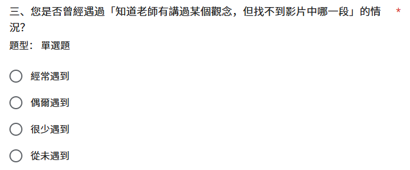
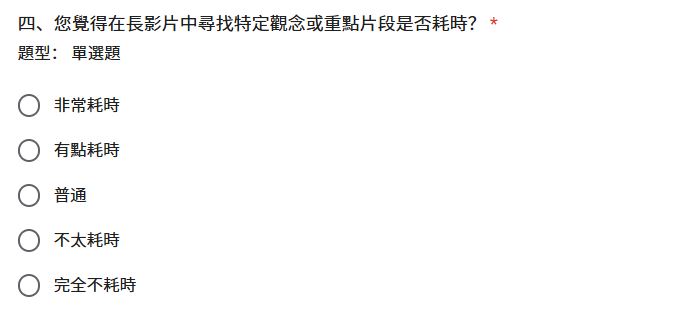
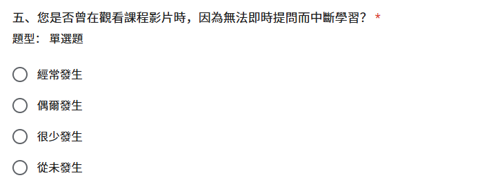
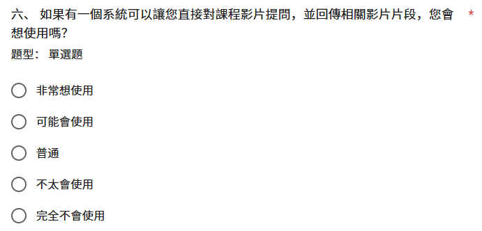
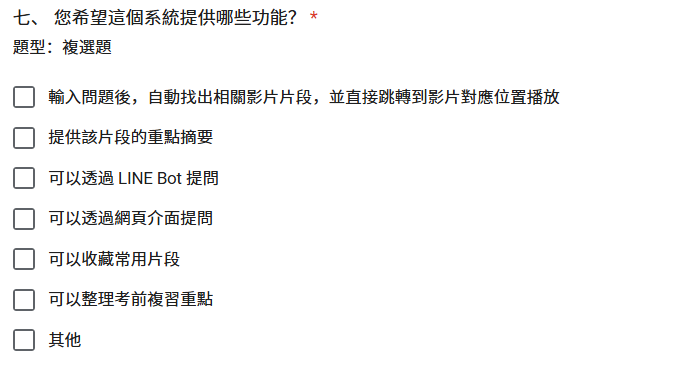
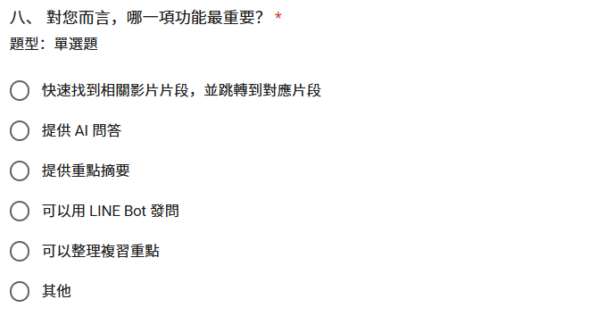
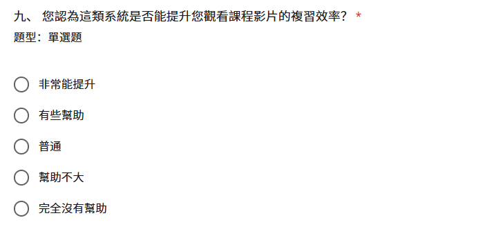
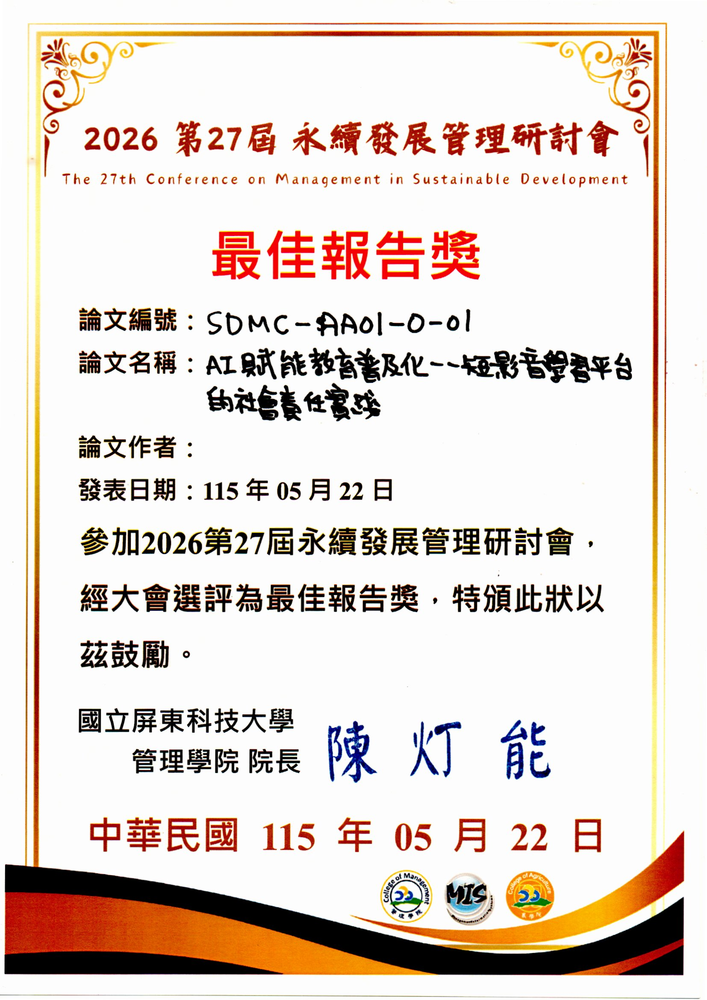

# 附錄

## 附錄一　會議紀錄

國立臺北商業大學　資訊管理系

附表1-1　第1次專題討論會議紀錄

| 會議日期：中華民國 115 年 01 月 22 日 | 會議地點：線上 |
| --- | --- |
| 會議主席：蒯思齊 | 會議記錄：邱偉豪 |
| 開會時間：10:00 | 散會時間：12：00 |
| 會議議題：讀書彙報(寒假_1th |  |
| 開會人員：指導老師　蒯思齊組員　邱偉豪、張庭語、張家瑜、鍾百陶 |  |
| 會議內容： 一、討論內容 本次會議主要說明神經網路與監督式學習的基本概念。教授指出，神經網路具有黑盒子特性，無法像傳統程式一樣手動寫出完整判斷規則，而是由模型從資料中自行學習特徵。 硬體方面，深度學習高度依賴 NVIDIA GPU，主要原因是 GPU 適合處理張量與矩陣運算，效率高於一般 CPU。模型設計方面，以 MNIST 為例，輸出層需設為 10 個神經元，對應 0 到 9 共 10 種分類結果。 教授也強調 Label 的重要性。Label 即標準答案，若資料沒有標籤，模型就無法計算 Loss，也無法透過反向傳播修正參數。因此專題選題時不能只看是否有資料，還要確認資料是否有對應標準答案，否則可能變成非監督式學習或需要大量人工標註。 二、決議事項 名詞統一使用台灣說法：啟動函數。 GPU 對矩陣運算與張量處理非常重要。 監督式學習必須具備 Label，否則模型無法修正學習。 專題選題時需確認資料是否具備標準答案。 若資料無 Label，將增加人工標註成本與專題難度。 本次未完成報告內容，於下次會議繼續。 |  |
| 下次開會時間：中華民國 115 年 01 月 27 日 下次會議內容：簡報製作 |  |

國立臺北商業大學　資訊管理系

附表1-2　第2次專題討論會議紀錄

| 會議日期：中華民國 115 年 01 月 27 日 | 會議地點：線上 |
| --- | --- |
| 會議主席：蒯思齊 | 會議記錄：邱偉豪 |
| 開會時間：14:00 | 散會時間：16:00 |
| 會議議題：讀書彙報(寒假_2th |  |
| 開會人員：指導老師　蒯思齊組員　邱偉豪、張庭語、張家瑜、鍾百陶 |  |
| 缺席人員：無 |  |
| 會議內容： 一、討論內容 本次會議討論 NLP 與 CNN 的模型選擇策略。CNN 不只可用於影像，也能處理文字中的關鍵特徵，例如倒裝句、意圖判斷等，因此不一定所有 NLP 問題都需使用 LSTM。 CNN 架構方面，現代主流多採連續小卷積核堆疊，再搭配 Pooling，相較傳統大卷積可減少參數、增加非線性，並支援更深層網路。 教授也說明 AI 的核心挑戰是泛化性。模型容易因規則改變而失效，可透過 Dropout 與資料增強降低 Overfitting。實務部署上，模型訓練完成後需透過 Flask API 架設服務，才能整合成 Line Bot 等實際產品。 二、決議事項 期末專題選題應避免純計算或死記硬背型題目。 專題方向可朝泛化性高或具創意應用的主題發展。 技術學習需釐清 CNN 原理，如 Padding 與 Pooling。 題目確定後，可參考老師提供的範例與 AI 跨域班資料。 後續可使用本地端顯卡資源協助模型訓練。 |  |
| 下次開會時間：中華民國 115 年 02 月 03 日 下次會議內容：簡報製作 |  |

國立臺北商業大學　資訊管理系

附表1-3　第3次專題討論會議紀錄

| 會議日期：中華民國 115 年 02 月 03 日 | 會議地點：線上 |
| --- | --- |
| 會議主席：蒯思齊 | 會議記錄：邱偉豪 |
| 開會時間：14:00 | 散會時間：16:00 |
| 會議議題：讀書彙報(寒假_3th |  |
| 開會人員：指導老師　蒯思齊組員　邱偉豪、張庭語、張家瑜、鍾百陶 |  |
| 缺席人員：無 |  |
| 會議內容： 一、討論內容 進行簡報報告。 二、決議事項 下次開會時間 02 月 10 日 |  |
| 下次開會時間：中華民國 115 年 02 月 10 日 下次會議內容：簡報製作 |  |

國立臺北商業大學　資訊管理系

附表1-4　第4次專題討論會議紀錄

| 會議日期：中華民國 115 年 02 月 10 日 | 會議地點：線上 |
| --- | --- |
| 會議主席：蒯思齊 | 會議記錄：邱偉豪 |
| 開會時間：14:00 | 散會時間：16:00 |
| 會議議題：讀書彙報(寒假_4th |  |
| 開會人員：指導老師　蒯思齊組員　邱偉豪、張庭語、張家瑜、鍾百陶 |  |
| 缺席人員：無 |  |
| 會議內容： 一、討論內容 本次會議介紹生成式模型核心技術，包含 DeepDream、神經風格遷移、VAE 與 GAN 的運作原理與差異，並討論自編碼器的壓縮概念，以及 Temperature 參數如何影響生成結果的隨機性。 模型訓練方面，說明超參數優化、模型集成、混合精度與遷移學習等加速方法。遷移學習可重用預訓練模型已學到的通用特徵，縮短訓練時間。CNN 特徵提取則由淺層辨識線條、邊緣等基本元素，深層辨識較完整的物體特徵。 另有同學反映 API Key 出現 429 Error，老師說明免費版 API 有頻率與總量限制，付費版或教育版額度較高。 二、決議事項 下週因過年暫停會議一次。 Temperature 相關內容可觀看老師錄製影片。 後續可透過實作調整 Temperature，觀察生成結果差異。 |  |
| 下次開會時間：中華民國 115 年 02 月 24 日 |  |

國立臺北商業大學　資訊管理系

附表1-5　第5次專題討論會議紀錄

| 會議日期：中華民國 115 年 02 月 24 日 | 會議地點：線上 |
| --- | --- |
| 會議主席：蒯思齊 | 會議記錄：邱偉豪 |
| 開會時間：14:00 | 散會時間：16:00 |
| 會議議題：讀書彙報(過年後_1th |  |
| 開會人員：指導老師　蒯思齊組員　邱偉豪、張庭語、張家瑜、鍾百陶 |  |
| 缺席人員：無 |  |
| 會議內容： 一、討論內容 本次會議討論專題可能會使用 AI 與 n8n，組員需先熟悉 n8n 基本操作。因系統規模較大、token 消耗可能偏高，老師預計在本機端部署 Ollama，提供 API 使用，校外連線需透過學校 VPN。 老師示範以 Ollama 運行本地端大語言模型，並說明本地部署對企業資料保密的重要性。高效能模型對硬體需求高，例如大型模型可能需要約 70GB 記憶體，一般單張 RTX 4090 或 5090 不一定足夠。 商業模式方面，教授強調系統必須具備創造收益或降低成本的價值，可從訂閱制、廣告引流、企業降本等方向思考，例如長者陪伴 AI、會計報帳 AI、ERP 或 CRM 等應用。 二、決議事項 開學沒意外會要交企畫書，每人下周二前想一個主題出來 開學準備： 需申請學校 VPN 帳號以便在校外呼叫校內伺服器資源（如 Ollama API）。 會議時間協調：開學後週二下午的定期專題指導時間（下午 5:30 - 6:30 ） |  |
| 下次開會時間：中華民國 115 年 03 月 03 日 下次會議內容： 看跨域班影片 GitHub 研究 想專題主題 借討論室 |  |

國立臺北商業大學　資訊管理系

附表1-6　第6次專題討論會議紀錄

| 會議日期：中華民國 115 年 03 月 03 日 | 會議地點：圖書館討論室 |
| --- | --- |
| 會議主席：蒯思齊 | 會議記錄：邱偉豪 |
| 開會時間：17:30 | 散會時間：19:30 |
| 會議議題：開學後_1th |  |
| 開會人員：指導老師　蒯思齊組員　邱偉豪、張庭語、張家瑜、鍾百陶 |  |
| 缺席人員：無 |  |
| 會議內容： 一、討論內容 大家分享查到的專題主題並討論 二、決議事項 最終確定從兩個題目中2選1： AI x 智慧衣櫥：穿搭推薦與服裝管理 短影音成癮 x 自我管理：FocusFlow |  |
| 下次開會時間：中華民國 115 年 03 月 10 日 下次會議內容：想專題主題 |  |

國立臺北商業大學　資訊管理系

附表1-7　第7次專題討論會議紀錄

| 會議日期：中華民國 115 年 03 月 10 日 | 會議地點：圖書館討論室 |
| --- | --- |
| 會議主席：蒯思齊 | 會議記錄：邱偉豪 |
| 開會時間：17:30 | 散會時間：19:00 |
| 會議議題：確定題目_2th |  |
| 開會人員：指導老師　蒯思齊組員　邱偉豪、張庭語、張家瑜、鍾百陶 |  |
| 缺席人員：無 |  |
| 會議內容： 一、討論內容 回報確定的題目短影音 二、決議事項 最終確定短影音，並決定使用教授自己就已經錄製了一些上課錄影的 VOD。 並制定接下來行動方針為調查一下現在市面上的短影音生成服務 (如最有名的 Sora2 或是 Seedance 2 之類的)， 了解一下他們可以做什麼。 |  |
| 下次開會時間：中華民國 115 年 03 月 24 日 下次會議內容： 決定專題題目 收集短影音製作的服務與模型的資料(邱偉豪、鍾百陶) 收集語音轉文字技術的資料(張庭語) 收集如 BLIP 等畫面描述技術的資料(張家瑜) |  |

國立臺北商業大學　資訊管理系

附表1-8　第8次專題討論會議紀錄

| 會議日期：中華民國 115 年 03 月 24 日 | 會議地點：圖書館討論室 |
| --- | --- |
| 會議主席：蒯思齊 | 會議記錄：張家瑜 |
| 開會時間：17:30 | 散會時間：19:30 |
| 會議議題：確認 ChatGPT 規劃、Codex 實作的 AI 分工流程，並建立 GitHub 留痕與 AI 使用紀錄方式。 |  |
| 開會人員：指導老師　蒯思齊組員　邱偉豪、張庭語、張家瑜、鍾百陶 |  |
| 缺席人員：無 |  |
| 會議內容： 一、討論內容 本次會議確認專題開發採 ChatGPT 規劃、Codex 實作的 AI 分工流程。先由 ChatGPT 進行產品規劃、功能流程與架構設計，再整理成結構化 prompt 交給 Codex 產生程式實作，以降低 token 浪費並提高生成品質。 教授提醒，AI 產出最多只能完成約 80%，剩餘 20% 仍需由團隊補齊、修正與客製化。專題報告中也要清楚區分 AI 產出與團隊自行判斷、修改、取捨的部分。 6/2 文件撰寫方向以目前最具體可行的工具、系統設計、技術規劃與開發流程為主，後續成果可依工具迭代調整。GitHub 需從現在開始持續更新，保留會議紀錄、實作、簡報、文件版本與修改歷程。 二、決議事項 採用 ChatGPT 規劃、Codex 實作的 AI 分工方式。 將規劃內容整理成結構化 prompt，供後續開發與報告使用。 AI 產出需由團隊修正與客製化，並說明人為貢獻。 專題以高標願景為方向，以可用核心成果為落地目標。 6/2 文件先寫最具體可行方案，保留後續調整彈性。 GitHub 需持續上傳會議紀錄、實作、簡報、文件與版本紀錄。 |  |
| 下次開會時間：中華民國 115 年 03 月 31 日 下次會議內容： 三月底前完成需繳交資料。 建立 AI 使用紀錄模板，固定記錄目標、模型工具、prompt、AI 原始輸出、團隊修改內容、修改原因與最終版本。 |  |

國立臺北商業大學　資訊管理系

附表1-9　第9次專題討論會議紀錄

| 會議日期：中華民國 115 年 03 月 31 日 | 會議地點：圖書館討論室 |
| --- | --- |
| 會議主席：蒯思齊 | 會議記錄：邱偉豪 |
| 開會時間：17:30 | 散會時間：19:30 |
| 會議議題：確認系統由遊戲化轉向數位學習證明，並規劃以 Whisper、RAG、MongoDB、網頁前端與 LINE Bot 完成影片問答 MVP。 |  |
| 開會人員：指導老師　蒯思齊組員　邱偉豪、張庭語、張家瑜、鍾百陶 |  |
| 會議內容： 一、討論內容 本次會議討論系統價值與技術架構。遊戲化機制原先考慮加入養寵物功能，但教授建議專題應從趣味性轉向實質價值，改以學習歷程證明與數位證書作為核心。系統也可記錄學生技術偏好、提問紀錄與觀看熱點，作為面試或升學輔助資料。 技術架構方面，專案採 GitHub branch 管理版本，對話紀錄以 JSON 格式儲存，前端包含登入頁、課程選擇與 LINE Bot QR Code。資料庫優先使用 MongoDB，以利彈性調整。 MVP 第一階段聚焦影片問答功能，流程為 Whisper 語音轉文字、建立索引，再由 LLM 生成答案。未來可擴充短影音生成答案與跨課程學習路徑規劃。 二、決議事項 放棄寵物機制，改開發數位學習證明系統。 核心價值改為學習歷程紀錄、數位證書與學習數據分析。 語音轉文字使用 Whisper。 問答架構採 RAG。 資料庫優先使用 MongoDB。 互動介面採網頁前端加 LINE Bot。 5 月初完成 MVP 串接，6 月 2 日進行第一階段成果驗收。 |  |
| 下次開會時間：中華民國 115 年 04 月 07 日 |  |

國立臺北商業大學　資訊管理系

附表1-10　第10次專題討論會議紀錄

| 會議日期：中華民國 115 年 04 月 07 日 | 會議地點：圖書館討論室 |
| --- | --- |
| 會議主席：蒯思齊 | 會議記錄：鍾百陶 |
| 開會時間：15:00 | 散會時間：16:30 |
| 會議議題：系統實作進度匯報與技術架構優化 |  |
| 開會人員：指導老師　蒯思齊組員　邱偉豪、張家瑜、張庭語、鍾百陶 |  |
| 缺席人員：無 |  |
| 會議內容： 一、討論內容 本次會議確認系統由文字檢索改為 Gemini Embedding 2 多模態檢索，直接整合影片畫面、聲音與文字，避免影像資訊流失與向量空間不一致。 影片處理採 15 至 30 秒規則式切段，每段建立多模態向量。video_segments 需新增 embedding、startSec、endSec 欄位，以支援精準跳轉與後續剪片。 Whisper 保留為字幕顯示與術語校正輔助，不再作為主要檢索依據；query_embedding.service.js 改串 Google Vertex AI Gemini Embedding 模型。 系統採地端運算加雲端播放架構。地端負責 FFmpeg、影片切片、embedding 與逐字稿；雲端負責影片或短片播放，前端與 LINE Bot 透過 video_url 或 clip 連結存取。 LINE Webhook 驗證失敗主因為 express.json() 改寫 raw body，後續需改用 express.raw({ type: 'application/json' }) 驗簽，並將 secrets 全面移至 .env 管理。 二、決議事項 改採 Gemini Embedding 2 作為多模態檢索核心。 影片統一切為 15 至 30 秒片段建立向量。 video_segments 新增多模態 embedding 與 startSec、endSec 欄位。 Whisper 改為字幕與術語校正輔助。 採用「地端運算 + 雲端播放」架構。 建立 queued、processing、completed、failed 四種處理狀態。 /videos/:videoId/processing 作為正式進度查詢 API。 LINE webhook 改用 raw body 驗簽，secrets 全面移至 .env。 LINE 綁定維持 QR Code 搭配一次性 token。 |  |
| 下次開會時間：中華民國 115 年 04 月 21 日 |  |

國立臺北商業大學　資訊管理系

附表1-11　第11次專題討論會議紀錄

| 會議日期：中華民國 115 年 04 月 21 日 | 會議地點：資研討室 |
| --- | --- |
| 會議主席：蒯思齊 | 會議記錄：張家瑜 |
| 開會時間：15:00 | 散會時間：16:30 |
| 會議議題：第一階段進度匯報與展示規劃 |  |
| 開會人員：指導老師　蒯思齊組員　邱偉豪、張家瑜、張庭語、鍾百陶 |  |
| 缺席人員：無 |  |
| 會議內容： 一、討論內容 本次會議確認專題進度與展示方向。資料庫資料與索引已完成，Embedding 現階段以文字搜尋為主，圖片搜尋後續再擴充。 LINE Bot 目前採一次性 token 驗證，重點是完成網頁、LINE Bot、影片問答與時間戳回覆的完整流程。6 月 2 日報告以核心流程展示為主。Backend 已完成 JWT、課程 API、影片處理、問答 API、LINE 整合與 Swagger 文件，後續需確認資料庫與 LINE 對話紀錄完整性。學生影片上傳因版權疑慮，傾向不開放，影片改採 YouTube 不公開連結託管。 教授提醒需理解 AI 生成程式碼，特別是 Embedding、向量比對與 Cosine Similarity 原理。 二、決議事項 現階段以文字搜尋與核心展示流程為主，圖片搜尋後續再擴充。 LINE Bot 維持一次性 token 驗證，並串接網頁選課、QR Code、影片問答與時間戳回覆流程。 影片採 YouTube 不公開連結託管，不開放學生直接上傳影片。 前端 UI 可先用 AI 生成初版，再手動微調。 Backend 須確保資料庫與 LINE 對話紀錄完整性。 團隊需能說明 AI 程式碼、Embedding、向量比對與 Cosine Similarity 原理。 可評估報名全國技專院校專題競賽。 |  |
| 下次開會時間：中華民國 115 年 05 月 05 日 下次會議內容： 於 2026/04/24 前完成論文線上報名及繳費。 完成 LINE Bot 與網頁整合，確保影片觀看與問答順暢。 完成 GitHub 技術架構文件與專題手冊。 製作 Canva 專題簡報，供 05/22 論文研討會與 06/02 校內報告使用。 深入理解 AI 生成程式碼，能說明功能、流程與底層邏輯。 |  |

國立臺北商業大學　資訊管理系

附表1-12　第12次專題討論會議紀錄

| 會議日期：中華民國 115 年 05 月 05 日 | 會議地點：資研討室 |
| --- | --- |
| 會議主席：蒯思齊 | 會議記錄：張庭語 |
| 開會時間：15:00 | 散會時間：16:30 |
| 會議議題：計畫書優化與系統架構討論 |  |
| 開會人員：指導老師　蒯思齊組員　邱偉豪、張庭語、鍾百陶、張家瑜 |  |
| 缺席人員：無 |  |
| 會議內容： 一、討論內容 本次會議確認 LINE Bot 與 YouTube 為主要展示流程。初期採手動上傳 YouTube，後端儲存 youtubeVideoId，LINE Bot 回覆含時間戳的 YouTube 連結，讓使用者可跳轉至對應片段。自動上傳 YouTube 因涉及 API、OAuth 與審核流程，列為後續優化。 計畫書需改為工程化描述，補上 Gemini Embedding、Cosine Similarity、Line Messaging API 等技術內容，並加入課外線上學習相關數據。目標客群收斂為大專院校學生。 文件與圖表部分，需重繪系統架構圖、資料庫 Schema 圖，並補上 7–12 月甘特圖。展示環境確定使用 Linux 虛擬機。 二、決議事項 LINE Bot 作為主要展示入口，影片互動採 YouTube timestamp 連結跳轉。 計畫書補強工程化技術內容、市場需求數據，TA 鎖定大專院校學生。 系統架構圖、資料庫 Schema 圖與 7–12 月甘特圖需重繪或補齊。 展示環境確定使用 Linux。 下次會議前完成文件擴充、圖表重繪與準確度評估資料。 |  |
| 下次開會時間：中華民國 115 年 05 月 12 日 下次會議內容： 張庭語：補強技術可行性章節，加入 Gemini Embedding、Cosine Similarity、Line Messaging API。補充課外線上學習數據，並將 TA 改為大專院校學生。 邱偉豪：重繪系統架構與流程圖。重繪資料庫 Schema 圖。製作 7–12 月甘特圖。 開發團隊：完成系統準確度評估報告。 |  |

國立臺北商業大學　資訊管理系

附表1-13　第13次專題討論會議紀錄

| 會議日期：中華民國 115 年 05 月 12 日 | 會議地點：資研討室 |
| --- | --- |
| 會議主席：蒯思齊 | 會議記錄：邱偉豪 |
| 開會時間：15:00 | 散會時間：15:48 |
| 會議議題：計畫書各章節修訂與簡報優化 |  |
| 開會人員：指導老師　蒯思齊組員　邱偉豪、張庭語、鍾百陶、張家瑜 |  |
| 會議內容： 一、討論內容 本次會議主要檢討專題文件、簡報與系統設計。前言需補強研究背景，加入台灣線上教育市場成長趨勢圖，並完整標示資料來源；若引用非公開資料，需註明授權方式與使用限制。 文件排版原則採先文字後圖。使用者案例圖需取消 LINE Bot 獨立節點，並新增權限控管區塊，限定管理員可修改權限。系統架構圖、元件圖與資料庫關聯圖需調整版面，並確認黑白列印後仍清楚。 簡報需大幅精簡文字，改以流程圖、架構圖與趨勢圖呈現，並使用淺色背景與較大字體。系統功能方面，影片 Embedding 改採影片切段方式實作，問答系統後續可加入快取與離峰摘要機制。 二、決議事項 前言需加入線上教育市場趨勢圖，並標示資料來源。 問卷調查聚焦於影片片段查找效率與學習成效。 簡報需精簡文字，增加流程圖、架構圖與視覺化內容。 簡報改用淺色背景並加大字體。 使用者案例圖取消 LINE Bot 獨立節點。 新增「權限控管」區塊，僅管理員可修改權限。 系統架構圖、元件圖與資料庫關聯圖需重新調整版面。 影片 Embedding 採影片切段方式實作。 問答系統後續規劃快取與離峰摘要機制。 |  |
| 下次開會時間：中華民國 115 年 05 月 19 日 下次會議內容： 張庭語：修改前言，加入台灣線上教育市場成長趨勢圖。 張庭語：完善問卷問項，聚焦效率提升與學習成效，於本週五前完成。 張庭語：調整使用者案例圖，取消 LINE Bot 節點並新增權限控管區塊。 全體組員：優化簡報格式，將文字轉為流程圖、架構圖等視覺化內容。 邱偉豪：優化系統架構圖，改用淺色色塊並參考範例重新製作。 |  |

國立臺北商業大學　資訊管理系

附表1-14　第14次專題討論會議紀錄

| 會議日期：中華民國 115 年 05 月 19 日 | 會議地點：資研討室 |
| --- | --- |
| 會議主席：蒯思齊 | 會議記錄：邱偉豪 |
| 開會時間：15:00 | 散會時間：15:48 |
| 會議議題：簡報架構、系統設計與競賽規劃 |  |
| 開會人員：指導老師　蒯思齊組員　邱偉豪、張庭語、鍾百陶、張家瑜 |  |
| 會議內容： 一、討論內容 本次會議確認專題簡報架構，簡報需從學生觀看教學影片的痛點切入，包含影片過長、重點難定位、複習效率低等問題，凸顯 FocusFlow 可將教學影片轉為可問答的知識庫。 系統設計以三種角色呈現：學生可透過 Web 或 LINE Bot 提問並跳轉重點片段；老師可上傳 MP4 或 YouTube 教材，由後端自動完成音訊提取、轉錄、切段與向量化；管理者負責平台管理、帳號停權與資料審核。 市場需求以問卷數據佐證，並以圖表呈現。推廣規劃採校內測試、他校推廣、SaaS 授權三階段。技術呈現需聚焦核心，減少程式碼細節，並補強 AI 生成正確性的檢核機制。另需加入約 3 分鐘系統操作示範影片，協助評審理解功能。 二、決議事項 簡報以痛點、應用場景與核心價值為主。 補上系統操作示範影片。 強化 AI 生成正確性檢核說明。 架構圖精簡呈現 MongoDB、影片切段、向量檢索與 LINE Bot 流程。 市場需求以問卷圖表呈現。 推廣規劃採校內測試、他校推廣、SaaS 授權三階段。 至少參與三項專題競賽。 |  |
| 下次開會時間：中華民國 115 年 06 月 02 日 下次會議內容： 全體組員：5/22 前往屏東科大參與 ESG 論文研討會。 張庭語、鍾百陶：補齊技術說明，包括 AI 正確性檢核、相似度比較方式與影片切段方法。 張家瑜：修改專題簡報，移除不必要技術細節，加入實際應用場景。 邱偉豪：更新系統架構流程圖，使流程更直觀。並製作專題情境展示影片。 全體組員：準備 2026 第 31 屆大專校院資訊應用服務創新競賽所需文件與行銷素材。 |  |

國立臺北商業大學　資訊管理系

附表1-15　第15次專題討論會議紀錄

| 會議日期：中華民國 115 年 06 月 02 日 | 會議地點：— |
| --- | --- |
| 會議主席：蒯思齊 | 會議記錄：— |
| 開會時間：— | 散會時間：— |
| 會議議題：第一階段簡報、SWOT 與商業模式修正 |  |
| 開會人員：指導老師　蒯思齊組員　邱偉豪、張庭語、鍾百陶、張家瑜 |  |
| 會議內容： 一、討論內容 本次會議檢視第一階段簡報。簡報頁面順序需重新調整，教師端說明需能回應評審提到的 NotebookLM 競品問題，排練時間以約 13 分鐘為目標。 SWOT 的劣勢應改寫為與競品相比的弱點，例如算力限制、知名度、用戶量與資料量不足；MVP 現況、Embedding 切段與依賴影片品質不宜列為劣勢。商業模式需補上不同階段的學生數、影片量、收費與成本估算，推廣對象可分為學校與補習班。 簡報需說清楚介面、功能規劃、切段策略與系統流程中哪些是團隊的設計與判斷，降低 AI 生成感。另需預先準備評審可能的提問，可用 TronClass 無法搜尋影片、不能即時提問等痛點作為對照，並事先開好展示環境。 二、決議事項 簡報頁面順序與教師端內容需再調整，回應 NotebookLM 競品問題。 SWOT 劣勢改寫為與競品相比的弱點。 商業模式補上使用量、影片量、收費與成本估算。 簡報需凸顯團隊實際貢獻，降低 AI 生成感。 評審問答從商業模式與系統實作兩個方向預先準備。 現場展示前先開好程式與系統環境。 |  |
| 下次開會時間：中華民國 115 年 06 月 09 日 下次會議內容： 全體組員：調整簡報頁面順序與教師端說明，補強商業模式數據與成本估算，整理團隊貢獻與 AI 協作邊界說明，產出評審可能問答清單。 張庭語、張家瑜：重寫 SWOT 劣勢段落。 邱偉豪：預先開好 Demo 系統與展示環境。 |  |

國立臺北商業大學　資訊管理系

附表1-16　第16次專題討論會議紀錄

| 會議日期：中華民國 115 年 06 月 09 日 | 會議地點：— |
| --- | --- |
| 會議主席：蒯思齊 | 會議記錄：— |
| 開會時間：— | 散會時間：— |
| 會議議題：第一階段簡報練習 |  |
| 開會人員：指導老師　蒯思齊組員　邱偉豪、張庭語、鍾百陶、張家瑜 |  |
| 會議內容： 一、討論內容 本次會議進行第一階段簡報的完整排練。老師建議開頭介紹要更有力，總時間控制在 15 分鐘內，目前排練約 12 至 14 分鐘，每位成員口說時間控制在 2.5 分鐘以內。 與 NotebookLM、TronClass 等競品的比較講得太久，只需用一兩句話點出最大差異；操作畫面與 Whisper 設定等技術細節不需口頭展開，口說重心放在問題、解法、展示效果與價值。 現場展示需突顯 AI 回答與片段定位的即時性，並測試轉接頭、網路、平板瀏覽器電腦模式與前端介面呈現效果，建議準備兩台電腦。簡報另需補強規模化潛力與教師端管理後台的應用價值，並確認上台站位與服裝。 二、決議事項 各成員修改講稿，每人控制在 2.5 分鐘以內。 競品比較只保留最大差異，不逐頁細講操作畫面。 技術細節不口頭展開，投影片有帶到即可。 正式展示準備兩台電腦，一台播投影片，一台開好系統待命。 測試平板以瀏覽器電腦模式呈現前端介面。 報告當天採正裝，並先確認上台站位順序。 |  |
| 下次開會時間：中華民國 115 年 06 月 16 日 下次會議內容： 全體組員：將最新版簡報傳給老師確認，修改講稿並再進行一次完整計時排練，確認上台站位順序。 邱偉豪：準備兩台電腦作為簡報與系統展示設備，測試平板瀏覽器電腦模式與前端介面。 |  |

國立臺北商業大學　資訊管理系

附表1-17　第17次專題討論會議紀錄

| 會議日期：中華民國 115 年 06 月 16 日 | 會議地點：— |
| --- | --- |
| 會議主席：蒯思齊 | 會議記錄：— |
| 開會時間：— | 散會時間：— |
| 會議議題：評審意見檢討 |  |
| 開會人員：指導老師　蒯思齊組員　邱偉豪、張庭語、鍾百陶、張家瑜 |  |
| 會議內容： 一、討論內容 本次會議檢討評審的提問，包含影片問答範圍、合作對象、影片存放與權限、成本收益、STP 市場區隔與產品定位，以及特徵值與相似度演算法、分析類別圖與設計類別圖的差異、程序圖流程、課程選擇設計、伺服器承載與 LMS 整合等。 影片處理流程改為老師直接上傳到系統，由伺服器自動轉傳到綁定的 YouTube 頻道，再切分後送入 RAG，並移除原本貼 YouTube 連結的介面。系統核心需說明完整流程：Whisper 轉錄、切段、Embedding、相似度比對、門檻判斷到回傳片段；資料不足時回覆「目前資料不足以回答」，回覆需能直接跳轉到影片片段。 商業面需依使用量區間估算伺服器、儲存、API、轉錄與維護成本，並可將系統包裝成 API 或模組掛接 LMS。評審建議的知識圖譜列為未來發展方向。上次評審現場因使用評審電腦，出現影片播不出來、文件開啟很卡、無法即時翻到指定頁數等問題，下次評審需自備電腦並安排專人記錄評審提問。 二、決議事項 影片改由老師直接上傳，移除貼 YouTube 連結介面。 上傳流程統一為老師上傳、伺服器自動轉傳綁定的 YouTube、切分後送入 RAG。 知識圖譜列為未來方向，暫不實作。 暑假先專心期末考，系統暫不大改。 後續會議改為週二上午 10 點，以 Google Meet 遠端進行。 下次評審需補強特徵值與相似度演算法、分析與設計類別圖差異、成本收益估算、LMS 整合與伺服器承載說明。 |  |
| 下次開會時間：中華民國 115 年 07 月 07 日 下次會議內容： 邱偉豪、張庭語：準備 Gemini Embedding 2 運作原理說明。 邱偉豪、鍾百陶：補強特徵值與相似度演算法的完整流程。 張庭語：準備分析類別圖與設計類別圖差異說明，補充 STP 市場區隔變數。 邱偉豪：修正程序圖並補上影片上傳流程，將影片上傳流程改為自動化，為查詢結果片段加入可直接跳轉播放的連結，評估自架伺服器承載能力與成本。 全體組員：估算成本、收益與擴展可行性，重新檢視課程選擇設計，收斂產品定位，規劃 LMS 掛接與授權模式，準備評審設備並安排專人記錄評審問題。 |  |

國立臺北商業大學　資訊管理系

附表1-18　第18次專題討論會議紀錄

| 會議日期：中華民國 115 年 07 月 07 日 | 會議地點：— |
| --- | --- |
| 會議主席：蒯思齊 | 會議記錄：— |
| 開會時間：— | 散會時間：— |
| 會議議題：Phase 2 規劃與上線部署討論 |  |
| 開會人員：指導老師　蒯思齊組員　邱偉豪、張庭語、鍾百陶、張家瑜 |  |
| 會議內容： 一、討論內容 老師提醒系統開發完成只是起點，上線後的持續運作、狀態監控與迭代才是重點，需要真實使用者持續使用，才能暴露穩定性、效能與體驗問題。部署上建議先使用系上虛擬機測試，效能不足再遷移至公有雲，並詢問系上技師能否申請固定 DNS。 成本方面，務必在雲端平台設定每月 API 費率上限，系統需限制每位使用者的 token 用量並定期重置。影片分段方面，固定時間切段可能把完整語意截斷，建議加入 Chunk Overlap，後續建立短期、中期、長期多層向量索引，以提升範圍較大問題的召回率。 各成員的 Phase 2 規劃包含：老師上傳本地影片後自動推送至 YouTube、批次處理多支影片與提升回答品質、統一後端資料結構與找不到答案時的回覆邏輯、前端整合 YouTube Shorts 頁面並修正手機版顯示。另討論將高頻問題轉成短影片並建立常見問題資料庫，以及競賽報名類別與文件時程。 二、決議事項 系統先部署至系上虛擬機測試，效能不足再評估遷移至公有雲。 設定雲端 API 每月費率上限，並實作每位使用者 token 上限與定期重置機制。 新增系統狀態監控功能。 影片分段加入 Chunk Overlap，並規劃多層向量索引。 短影片統一上傳 YouTube Shorts，系統以 iframe 引用。 建立常見問題資料庫，避免相同問題重複生成。 7/10 前完成比賽報名，8/7 前繳交出賽文件，計畫書需補入相關學術參考文獻。 |  |
| 下次開會時間：中華民國 115 年 07 月 14 日 下次會議內容： 邱偉豪：新增系統狀態監控功能，將系統部署至系上虛擬機，設定雲端 API 費率上限，詢問系上能否申請固定 DNS，申請 YouTube API。 後端負責人：實作使用者 token 上限與重置機制，統一資料結構格式。 AI Pipeline 負責人：影片分段加入 Chunk Overlap，規劃多層向量索引。 前端負責人：整合 YouTube Shorts 頁面，修正課程進度顯示問題。 全體組員：完成比賽報名與出賽文件，補充學術參考文獻。 |  |

國立臺北商業大學　資訊管理系

附表1-19　第19次專題討論會議紀錄

| 會議日期：中華民國 115 年 07 月 14 日 | 會議地點：— |
| --- | --- |
| 會議主席：蒯思齊 | 會議記錄：— |
| 開會時間：10:49 | 散會時間：— |
| 會議議題：營運效益分析與各組進度報告 |  |
| 開會人員：指導老師　蒯思齊組員　邱偉豪、張庭語、鍾百陶、張家瑜 |  |
| 會議內容： 一、討論內容 競賽計畫書需撰寫營運計畫與效益分析，教授提醒需以可查證的假設精算成本與收益：先設定每月使用人數、課程數、影片處理量與提問次數，再估算公有雲 VM、LLM API、Embedding API、儲存與流量成本；收益除訂閱或授權費外，可將替代助教回覆問題所節省的工時列為可量化效益，並計算損益平衡點。教授另建立專題專用的 API 專案，可用其獨立用量提高成本估算準確度。 問答成本方面，後端已有 FAQ 快取基礎，下一步是完善與驗證：字面相同的問題直接回傳既有答案，語意相近的問題命中後沿用先前結果，且答案必須綁定課程。AI Pipeline 已完成流程狀態管理、執行批次與輸出版本管理、中斷續跑與 checkpoint 恢復，接著強化 MongoDB 上傳並進行加入 Chunk Overlap 的分段優化；檢索候選數量由 Top 5 擴至 Top 20 的做法延後，待有評估數據再決定。 Shorts 需先釐清生成方式，課程過濾由後端比對學生修課清單。本地影片上傳至 YouTube 的單一管道已整合，上傳後的 Embedding 失敗疑為 API 額度耗盡，改用教授新建專案的 API 重測。 二、決議事項 設定每月使用情境，估算 VM、LLM、Embedding、儲存與流量成本，並計算損益平衡點。 詢問學校技師能否提供校外存取所需的網域。 使用教授新建的專題 API 專案執行後續測試並估算成本。 完善並驗證依課程區分的 FAQ 快取。 Phase 2 先完成 MongoDB 上傳強化與影片分段優化，Top 20 與 Reranker 延後。 「一部影片上傳至多個課程」暫緩處理。 取消 7/21 會議，下一次教授會議改為 7/28。 |  |
| 下次開會時間：中華民國 115 年 07 月 28 日 下次會議內容： 全體組員：建立營運成本與效益試算表，產出競賽計畫書初版並確認參賽組別，準備兩週進度報告。 邱偉豪：整理公有雲 VM 規格與費用資料，完善並驗證依課程區分的 FAQ 快取。 鍾百陶：詢問學校技師能否開放校外存取的網域，以新 API 重測影片上傳與 Embedding 流程並整理用量。 張庭語：依最新順序推進 Phase 2，盤點 MongoDB 上傳與現有影片分段邏輯。 張家瑜：研究 Shorts 生成方式及修課過濾機制。 |  |

國立臺北商業大學　資訊管理系

附表1-20　第20次專題討論會議紀錄

| 會議日期：中華民國 115 年 07 月 28 日 | 會議地點：— |
| --- | --- |
| 會議主席：蒯思齊 | 會議記錄：— |
| 開會時間：10:58 | 散會時間：— |
| 會議議題：各組進度報告與競賽組別討論 |  |
| 開會人員：指導老師　蒯思齊組員　邱偉豪、張庭語、鍾百陶、張家瑜 |  |
| 會議內容： 一、討論內容 系統已能由手機及外網透過 IP 存取，伺服器使用 Nginx 串接前後端，focusflow.ntub.edu.tw 已申請但尚未連通；YouTube OAuth 已申請，自動上傳仍處理失敗。教授建議刪除影片時不直接永久刪除 YouTube 教材，改研究未公開影片與分享權限管理。 前端已完成通知欄、個人頁、頭像、手機版與品牌視覺調整，管理員入口待確認後改由指定網址進入。Pipeline 已能同時上傳兩部影片並完成處理；圖片 Embedding 的切分策略需針對教學影片設計，多輪問答本版暫緩。後端將檢索候選數由 3 筆提高至 15 筆，加入課程外問題的拒答提示，並完成 FAQ 快取與通知功能。 成本估算以 Azure 每月約新臺幣 5,500 元、50 人每人每週 20 題、18 週為假設，Embedding 成本尚待實測；教授建議效益分析加入「隨處學習」與「助教不足」兩項價值。競賽方面 NIICC 已完成報名，教授建議選擇教育 AI 專門組。短影片生成方式尚未定案，本週先蒐集工具資料。 二、決議事項 YouTube 影片刪除優先研究未公開影片與分享權限管理，先確認 API 是否可自動化。 圖片 Embedding 依教學影片特性設計切分策略。 損益平衡分析加入「隨處學習」與「助教不足」的效益佐證，並標示尚待實測的成本。 競賽選擇教育 AI 專門組，7/29 參加訓練營，8/7 前完成企劃書與需求書。 短影片生成本週只做方案調研。 多輪問答本版暫緩。 |  |
| 下次開會時間：中華民國 115 年 08 月 04 日 下次會議內容： 鍾百陶：驗證 YouTube 未公開影片與撤銷權限能否由 API 自動化，排查 YouTube 自動上傳失敗並追蹤 DNS 連線。 張家瑜：修正前端測試問題、移除管理員入口並處理手機版重複標題。 張庭語：提出教學影片圖片 Embedding 的切分策略，推進多層級切段與檢索。 邱偉豪：修正後端問題並持續驗證 FAQ 快取、通知與頭貼，補強雲端成本與損益平衡資料，參加 NIICC 臺北訓練營。 全體組員：完成競賽企劃書與需求書，蒐集短影片製作工具資料。 |  |

國立臺北商業大學　資訊管理系

附表1-21　第21次專題討論會議紀錄

| 會議日期：中華民國 115 年 08 月 04 日 | 會議地點：— |
| --- | --- |
| 會議主席：蒯思齊 | 會議記錄：— |
| 開會時間：— | 散會時間：— |
| 會議議題：多層檢索進度與短影片生成方向調整 |  |
| 開會人員：指導老師　蒯思齊組員　邱偉豪、張庭語、鍾百陶、張家瑜 |  |
| 會議內容： 一、討論內容 鍾百陶已完成使用者需求清單與範例文件；競賽期間須避免一稿多投，報名文件需在 8/7 前提交。 多層級檢索方面，張庭語已建立副分段並完成向量化，由副分段尋找大方向、子分段提供精確逐字稿與時間戳，向量化使用 Gemini 文字向量模型產生 3072 維向量，並加入版本指紋與續跑機制。邱偉豪已完成 Parent Search 與問答串接，併入主線時保留安全回退，下一步整合 MongoDB 資料並進行端到端測試。教授建議把多層級檢索的設計邏輯放入簡報，並以 A/B 測試比較新舊檢索的回答效果。 權限方面，課程由教師或管理員指派，下架影片應採停用或封存而非永久刪除。短影片原規劃由長影片挑選片段剪輯，教授認為純剪輯仍可能語意不完整，方向改為研究生成式 AI 直接生成影片；生成內容只可使用影片資料庫內的資料，教師審核不通過時先選擇畫面、字幕或聲音等原因分類，再進入對應的重新生成流程。 二、決議事項 短影片方向改為研究生成式 AI 直接生成影片，內容來源只限影片資料庫內的資料。 蒐集理想短影片範例，以成品風格反推設計方向。 教師審核未通過時先選擇原因分類再填寫描述，系統依類別重新生成。 多層級檢索的設計邏輯與實作截圖放入簡報；通過端到端及 A/B 測試後再進行圖片 Embedding。 移除前端管理員入口，修改環境變數以排查 YouTube 上傳問題。 使用開源或外部工具前需評估資料隱私。 下次會議暫定週二晚上 8 點後。 |  |
| 下次開會時間：中華民國 115 年 08 月 11 日 下次會議內容： 全體組員：提交競賽報名文件，研究生成式 AI 短影片方案並整合成共同文件，蒐集理想短影片範例。 張庭語：將副分段向量資料存入 MongoDB，完成端到端與 A/B 測試，修改環境變數並排查 YouTube 上傳問題。 邱偉豪：整合 MongoDB 多層資料與 Parent Search，補齊權限邊界測試並留存實作截圖。 張家瑜：移除前端一般介面的管理員入口。 |  |

國立臺北商業大學　資訊管理系

附表1-22　第22次專題討論會議紀錄

| 會議日期：中華民國 115 年 08 月 11 日 | 會議地點：— |
| --- | --- |
| 會議主席：蒯思齊 | 會議記錄：— |
| 開會時間：19:57 | 散會時間：— |
| 會議議題：QA 評測策略與短影片生成規劃 |  |
| 開會人員：指導老師　蒯思齊組員　邱偉豪、張庭語、鍾百陶、張家瑜 |  |
| 會議內容： 一、討論內容 評審可能追問如何證明系統回答正確。教授示範由 Agent 自動設計題目、撰寫標準答案，讓系統完成問答後交由 AI 評分，再依分數與題型分析系統擅長與不擅長之處，作為簡報與短影片的選題依據。 教授展示比較 R-CNN 與 YOLO 的教學短影片，影片引用上課畫面，讓觀眾看出回答根據課程內容；影片以影片生成模型在本地設備執行，生成一分鐘影片約需 76 分鐘。 張庭語已將 Parent Embedding 統一切換至 gemini-embedding-2 並重新處理 47 筆資料；目前測試範圍仍只有 1 支影片，不足以全面啟用，推出方式保留關閉、部分開啟與全面開啟三種模式。另發現同一問題在 LINE 與網頁版得到不同回答，需確認根因後修復。 短影片初步流程為審題、取得 QA 答案、填入腳本、產生提示詞、生成畫面、合成語音、教師審核到發布；先以 VEO API 驗證效果與成本，並研究成功短影片的腳本公式，預計設計約 10 支劇本交由教授在本地設備產生樣本。 二、決議事項 建立 QA 自動出題、標準答案與 AI 評分流程，分析系統擅長與不擅長的題型。 短影片需呈現可辨識的課程內容，發布前保留教師審核。 先嘗試 VEO API 並評估效果與成本，不合適則改由教授以本地設備產生樣本。 全體研究短影片腳本公式，設計約 10 支劇本。 多層檢索先採限制性推出。 確認並修復 LINE 與網頁版回答不一致的問題。 競賽參加資訊應用組，文件於 9/3 前提交學校。 |  |
| 下次開會時間：中華民國 115 年 08 月 18 日 下次會議內容： 鍾百陶：建立 10 個 QA 評測問題，執行 AI 評分並整理擅長與不擅長的題型。 張庭語：修復 LINE 聊天機器人回答異常，完成後協助競賽文件。 邱偉豪：嘗試 VEO API 進行影片生成測試並保留實作紀錄。 全體組員：研究短影片腳本公式，依 QA 內容設計約 10 支短影片劇本，確認競賽文件格式與分工，確認課表並決定下次會議時間。 |  |

國立臺北商業大學　資訊管理系

附表1-23　第23次專題討論會議紀錄

| 會議日期：中華民國 115 年 08 月 18 日 | 會議地點：— |
| --- | --- |
| 會議主席：蒯思齊 | 會議記錄：— |
| 開會時間：20:44 | 散會時間：21:27 |
| 會議議題：系統上線、競賽文件與短影片審核規劃 |  |
| 開會人員：指導老師　蒯思齊組員　鍾百陶、張庭語、張家瑜 |  |
| 缺席人員：邱偉豪（請假） |  |
| 會議內容： 一、討論內容 QA 評測不宜只把 RAG 找出的片段交給另一個 AI 評分，應將原始教材、逐字稿整理成完整資料集，讓獨立的 AI 從中查找依據並比較系統回答。 LINE Bot 與網頁版行為不一致的問題已修正。服務已可透過 focusflow.ntub.edu.tw 及 HTTPS 連線，但瀏覽器仍顯示憑證不受信任，80 port 實際仍無法連入；教授認為現階段 LINE webhook 能透過 HTTPS 正常連線即可先沿用現有設定。競賽文件初稿已完成，送件前先交教授審閱。 短影片方面，鍾百陶已整理多份腳本，邱偉豪分析短影片結構並進行 Veo 生成測試；測試可生成講師形象與簡單背景，但技術圖、文字與精確教學內容仍不足。教授將提供範例影片供流程測試，團隊需整併腳本後儘早交付。系統其餘進度包含修課權限與學生名單管理、多影片處理與中斷後續跑、YouTube 上傳失敗後的復原流程；LINE 提問尚未存入 MongoDB，仍需補齊。 教授離席後，組內討論將多輪問答排在圖片 Embedding 之前，並提出建立教師端短影片審核頁面，提供通過、不通過與回饋欄位；此為組內提案，尚待確認正式規格。 二、決議事項 QA 評測改以完整原始教材為獨立對照來源。 現有 HTTPS 暫時沿用，80 port、憑證信任與正式展示安全性仍需驗證。 競賽文件先交教授審閱，依回饋調整後再送件。 合併現有短影片腳本與腳本公式，儘早交給教授安排生成樣本。 Veo 測試結果保留為技術比較資料，目前品質不足以直接上架。 LINE 提問寫入 MongoDB 等缺口另列待辦。 下週會議照常，8/31 當週停會。 |  |
| 下次開會時間：中華民國 115 年 08 月 25 日 下次會議內容： 鍾百陶：重新設計 QA 評測流程，整理完整原始教材並建立獨立答案比對機制。 鍾百陶、邱偉豪：合併短影片腳本與腳本公式，整理成單一版本交給教授。 張庭語：將競賽文件交教授審閱，依回饋調整後完成送件。 全體組員：確認 80 port、HTTPS 憑證與正式展示環境，補上 LINE 提問寫入 MongoDB 的流程，規劃教師端短影片審核頁面與回饋欄位，確認開學後固定會議時段。 |  |

## 附錄二　問卷題目

為了瞭解使用者需求，本研究將問卷區分為三個題組，分別為基本資料、課程影片使用痛點、AI影片問答需求。問卷之主要題目如下：

第一題詢問受訪者的身分（附圖2-1），為單選題，選項包含大學生、研究生、高中職學生、社會人士／自學者與其他。

附圖2-1　問卷受訪者身分

第二題詢問受訪者觀看課程影片的主要目的（附圖2-2），為複選題，選項有課後複習／考前準備、補看缺席課程、自主學習新知識與完成作業或專題。

附圖2-2　觀看課程影片目的

第三題詢問受訪者是否曾遇過「知道老師有講過某個觀念，但找不到影片中哪一段」的情況（附圖2-3），為單選題，頻率由經常遇到到從未遇到。

附圖2-3　找不到課程片段經驗

第四題詢問在長影片中尋找特定觀念或重點片段是否耗時（附圖2-4），為單選題，程度由非常耗時到完全不耗時。

附圖2-4　搜尋課程片段耗時

第五題詢問觀看課程影片時，是否曾因為無法即時提問而中斷學習（附圖2-5），為單選題，頻率由經常發生到從未發生。

附圖2-5　無法即時提問造成學習中斷

第六題進入系統需求題組，詢問若有系統能直接對課程影片提問並回傳相關影片片段，受訪者是否想使用（附圖2-6），為單選題，意願由非常想使用到完全不會使用。

附圖2-6　課程問答系統使用意願

第七題詢問受訪者希望系統提供哪些功能（附圖2-7），為複選題，選項包含自動找出並跳轉到相關片段、重點摘要、LINE Bot 與網頁介面提問、收藏常用片段與整理考前複習重點。

附圖2-7　課程問答系統期望功能

第八題請受訪者在上述功能中選出最重要的一項（附圖2-8），為單選題。

附圖2-8　課程問答系統重要功能

第九題詢問這類系統是否能提升受訪者觀看課程影片的複習效率（附圖2-9），為單選題，程度由非常能提升到完全沒有幫助。

附圖2-9　課程問答系統預期成效

## 附錄三　發表證明

附圖3-1 為團隊以論文〈AI賦能教育普及化——短影音學習平台的社會責任實踐〉，於 2026 年 5 月 22 日在「2026 第 27 屆永續發展管理研討會」發表後取得的最佳報告獎獎狀。

附圖3-1　專題發表證明

## 附錄四　評審意見修正追蹤

附表4-1 逐項列出評審提出的意見、修正情形與對應的章節或證據，評審意見以委員編號識別。

附表4-1　評審意見修正追蹤

| 評審建議事項 | 修正情形 |
| --- | --- |
| 委員 1-1 說明影片到可被檢索與提問的向量化過程，與中間調整的步驟 | 已修正：新增向量化與檢索流程圖、各階段說明、程式預設／正式環境／現有資料三套參數對照與 Atlas 實查結果，以及 8 項有出處的參數調整紀錄 對應章節或證據：第 7 章 7-2「向量化流程與參數調整」（圖7-2-6、表7-2-2～表7-2-5） |
| 委員 1-2 展示如何以「複雜」的提問進行精準的回答，並能跳轉至特定的影片片段 | 於簡報與現場展示處理；書面已補一組同時包含兩個子問題的實際檢索排序（僅檢索，未含回答生成） 對應章節或證據：第 7 章表7-2-6；跳轉機制見圖6-1-4b 步驟 7～11 |
| 委員 2-1 評分項目包含個人簡報儀態，除簡報內容外，也可適度由每位成員分別回覆評審問答 | 於簡報與現場展示處理 對應章節或證據：簡報與現場問答 |
| 委員 2-2 為防範數位資產外流，可考慮介接 Vimeo 等專業串流平台並啟用網域層級隱私限制 | 已修正（書面規劃）：TOWS 的 WT 策略新增「正式商轉時改用具網域層級嵌入限制的串流平台（如 Vimeo）」，並說明目前 YouTube 不公開影片的連結外流風險；列為未來規劃，試用期不實作，平台費用待評估 對應章節或證據：第 2 章表2-4-2 WT 策略第 4 點；2-1 四 |
| 委員 2-3 建議切入補習班線上函授與數位學習市場，規劃教育業者商務合作方案 | 已修正（書面規劃）：市場區隔新增「補習班線上函授與數位學習業者」並說明適合原因；新增依課程授權、依學生數計價、白牌導入三種合作方案；尚未與業者接洽，商業模式九宮格（表2-2-1、圖2-2-1）未改 對應章節或證據：第 2 章 2-3 市場區隔、表2-2-3 |
| 委員 3-1 商業模式的成本及收益請量化評估，以支持系統實踐的可行性 | 已修正：表2-1-3 補上 MongoDB Atlas（目前 M0 免費方案，NT$0）；表2-1-4 依官方公告價估算 Flex 與 M10 付費方案；表2-1-5 依例行維運清單估算一學期維運人力約 NT$9,300；表2-1-6 合併上述成本，推導學校授權與補習班授權的每位學生損益平衡價格，並以三個假設價格試算所需學生數（價格為假設值，非報價） 對應章節或證據：第 2 章表2-1-3～表2-1-6 |
| 委員 3-2 影片存放 YouTube 以節省空間，沒有授權帳密要如何存取未公開的影片，請再評估 | 已修正：逐步說明以專題頻道 OAuth 授權上傳、預設不公開、學生以 iframe 嵌入播放不需帳密、不用私人影片的原因、刪除時轉私人，並指出連結外流風險與後續對策 對應章節或證據：第 2 章 2-1 四；上傳觸發與狀態見圖6-1-3b、圖7-4-9 |
| 委員 3-3 餘弦相似度計算，影片的這些特徵值如何產生？請補強說明 | 已修正：說明特徵值是逐字稿片段經 `gemini-embedding-2` 產生的 3072 維語意向量（非人工特徵、非畫面特徵），補上公式、Atlas 與程式兩處計算位置、一組實際相似度排序，以及影像與音訊向量的實作現況 對應章節或證據：第 7 章 7-2「餘弦相似度如何計算」「影像與音訊向量的現況」（表7-2-6、表7-2-7）；第 9 章表9-1-34；第 1 章 1-3 目標 3、第 3 章表3-2-1 文字向量嵌入列 |
| 委員 3-4 圖6-1-2 未見系統提及的 YouTube 部分，請修正 | 已修正：先前版本的圖6-1-2「教師上傳影片與系統處理」已拆分為現行的圖6-1-3a、圖6-1-3b；YouTube 自動上傳畫在圖6-1-3b 的 `opt 已設定 YouTube 自動上傳` 區塊，圖6-1-3a 另以灰框註明其觸發時機（處理完成後），上傳狀態見圖7-4-9 對應章節或證據：第 6 章 6-1-3（圖6-1-3a v1-1、圖6-1-3b）；第 7 章圖7-4-9 |
| 委員 3-5 設計類別圖為何完全沒有 method，請重新分析 | 已修正：服務視圖（a 圖）列出實際函式；資料視圖（b 圖）的 Video 補上程式中實際存在的兩個 static；6-2 補充「行為集中在服務層」的設計決策與理由，並以表格列出每個實體由哪些服務方法操作；第 5 章補充分析類別列責任、不列方法的原因 對應章節或證據：第 6 章 6-2（圖6-2-1b v1-1、表6-2-5、表6-2-9、表6-2-13）；第 5 章表5-4-3 |
