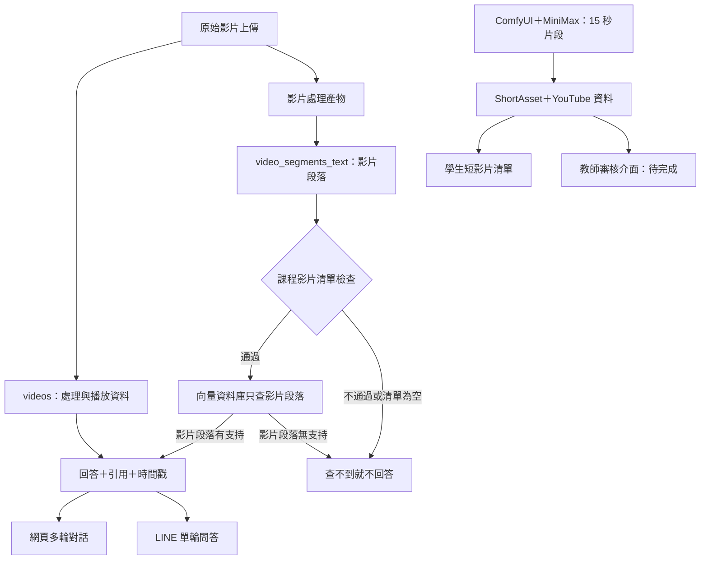
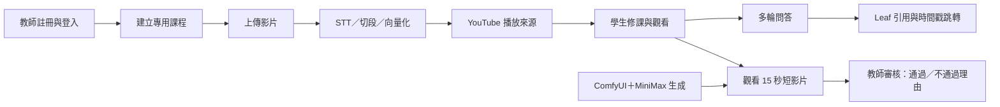

# 2026 年 9 月學生試用版後端規格草案

| 欄位 | 內容 |
|------|------|
| 文件狀態 | 定稿；2026-08-27 八項決議已納入 |
| 版本 | v1.0（決議定案版） |
| 更新日期 | 2026-08-27 |
| 學生試用期限 | 2026-09-30 前開放小規模學生試用 |
| 可能複評時間 | 2026-10-15 前後；確切日期待教授通知 |
| 固定示範課程 | 影片處理工具 - OpenCV（`69fb4d4c069e21f4e65b74dc`） |
| 文件用途 | 以最少頁數說清楚完整流程、資料流、缺口與不崩潰底線 |
| 現況依據 | 2026-08-25 會後決策、2026-08-27 八項決議，以及同日的程式碼與資料庫唯讀調查；證據等級見附錄 E |

本文件分成白話主文與技術附錄。第 1 至 8 章供所有人閱讀。

附錄供實作與驗收查核。證據等級與現況標示見附錄 E。

---

## 這份文件在講什麼（先讀這頁）

### 我們在做的系統

FocusFlow 讓學生對課程影片提問。教師上傳影片，系統自動轉成文字

並切成小段；學生看影片時可以直接問問題，系統只從這門課的影片

內容找答案，並附上「這句話出自第幾分鐘」的引用，點了可以跳到

影片對應位置。系統另外會自動生成 15 秒短影片，教師可以審核通過

或退回。

### 九月底要達成什麼

讓學生實際登入試用一次。標準不是功能做完，而是從登入、觀看、

問答到看短影片，整條路走得完、不當機。示範內容固定用「影片處理

工具 - OpenCV」這一堂課的 15 支影片，不擴充到其他課程。

### 現在還差三件事

1. 課程隔離不夠嚴：目前程式在某些情況下，可能把別的課程的影片

   內容當成答案。已定位出五個具體漏洞，其中一個會在課程

   影片清單為空時把查詢條件整個拿掉，變成查全部資料。

   這是唯一「沒做完就不能開放試用」的項目。
2. 問答品質沒有正式證據：需要跑 12 題正式問答，加 2 題故意問不到

   答案的題目，把回答與引用存成檔案，才能拿給評審看。
3. 短影片審核的後端沒接：前端畫面已完成，但按下送出目前是假的，

   資料沒有真的存進資料庫。審核對象是短影片，不是正式影片。

### 這份文件刻意不做什麼

效能調優、多人同時使用、影片批次處理、其他課程。這些不是做不到，

是本輪刻意不做。專題定位是概念驗證，先讓流程走完整比較重要。

### 各章怎麼讀

- 只想知道系統怎麼運作：第 1、2 章
- 想知道 Demo 用哪些影片：第 3 章
- 想知道評審會看到什麼問答：第 4 章
- 負責實作：第 5、6 章
- 負責驗收：第 7 章
- 名詞看不懂：附錄 A
- 負責環境設定與錯誤訊息：附錄 K

---

開工前必須先讀附錄 K。未確認執行環境之前，不得開始產出任何證據。

---

## 1. 這一輪要證明什麼

> 這章說明九月底要做到哪裡。

FocusFlow 本輪是概念驗證，不是企業級產品開發。

目標是讓評審看見一條走得完的使用流程。

本輪取捨固定依下列順序判斷：

1. **整合成完整流程**：先讓使用者從頭到尾走完。
2. **功能完整度**：核心流程穩定後再補細節。
3. **執行效率**：效能、批次吞吐與多人同時使用排在最後。

試玩只用一堂簡單課程與少量整理過的影片。

問答只驗證課程內容、引用與基本追問。

系統不延伸成通用知識助理。

時程與完整系統流程見附錄 H。

---

## 2. 使用者從頭到尾會經過什麼

> 這章說明完整流程目前走到哪裡。

本章使用「可跑、半通、未串」三種現況。

「可跑」代表已在預定試用環境完整走過，並留有證據檔。

「半通」代表仍需手動介入、經常失敗，或尚未完成實測。

「未串」代表前後端或資料流程尚未真正連接。

LINE 不在本輪完整流程內。

第 5 章仍會測 LINE，因為它共用問答的隔離規則。

| 步驟 | 現況 | 負責模組 | 缺口 | 是否擋試用 |
|------|------|----------|------|------------|
| 1. 學生／教師註冊與登入 | 可跑 | 前端、後端 | 無已知功能層面缺口 | 否 |
| 2. 教師建立課程並上傳影片 | 半通 | 前端、後端 | 建課、上傳與後端交接尚未完整實測。前端多檔上傳仍依序呼叫單支介面。 | 否 |
| 3. 執行語音轉文字、切段與向量化 | 半通 | 後端、STT 處理模組、資料庫 | OpenCV 正式影片已完成 15/15/15。需確認可從失敗影片或檢查點重試，不重跑整批。 | 否 |
| 4. 學生取得已發布課程並觀看影片 | 半通 | 前端、後端 | 尚未用實際學生修課關係驗證課程、影片與時間戳跳轉。依本章「可跑」需有證據檔的定義，暫列半通。 | 否 |
| 5. 多輪問答、引用來源與時間戳跳轉 | 半通 | 前端、後端、向量資料庫、Gemini | 網頁多輪、歷史改寫與逐輪引用已實作。第 5 章修正與 12＋2 題證據未完成。 | 是 |
| 6. 學生觀看短影片 | 半通 | 前端、後端、Shorts、YouTube | 修課限定清單與學生頁已串接。15 秒產物、上架資料與試用環境實測待驗證。 | 否 |
| 7. 教師審核短影片 | 未串 | 前端、後端、Shorts | 後端需依附錄 D.1 完成審核介面、結構化保存與讀回。前端須將審核對象由正式影片改為短影片，並移除示範資料。 | 否 |

影片處理順序已確定：先完成影片上架。

後端審核介面完成後，再重跑教師審核並保存正式證據。

前端假畫面顯示成功，不算審核完成。

### 2.1 完整流程的資料流



系統只回答課程影片內容。

對話歷史只用來理解追問，不是知識來源。

影片段落無法支持答案時，系統就回覆無答案。

系統不改用模型的通用知識補答。

---

## 3. Demo 要用哪些影片

> 這章說明示範課程與影片範圍。

### 3.1 課程範圍與整體狀態

| 項目 | 2026-08-25 狀態 |
|------|------------------|
| 課程 | 影片處理工具 - OpenCV |
| `courseId` | `69fb4d4c069e21f4e65b74dc` |
| 課程狀態 | `published` |
| 影片紀錄 | 全課共 16 筆：正式示範 15 筆、測試片 1 筆 |
| 影片處理 | 全課三階段皆為 16/16/16；正式範圍為 15/15/15 |
| YouTube | 15 支正式影片都有 `youtubeVideoId`。只有測試片 `TEST_0720` 缺少。 |
| 影片段落 | 正式範圍 129 筆，平均每支約 8.6 筆，範圍 5～12 筆。全課共 132 筆。 |
| 歷史問答 | 74 筆：`api` 44、`line` 29、`debug` 1；對外歷史統計為 73 筆 |
| 上層段落 | 本輪不要求、不啟用；示範課程只用影片段落產生引用 |

### 3.2 逐支影片清單

下表列出本輪唯讀查核的 16 筆影片。

欄位對應與查核方法見附錄 H。

| # | 目前標題 | `videos._id` | 影片處理 | YouTube | 影片段落 |
|---|----------|--------------|----------|---------|----------|
| 1 | 第一講 | `69fb55edb52433fda32db4e8` | 完成 | `yWhzdAefaQU` | 6 |
| 2 | 第二講 | `69fb57edb52433fda32db706` | 完成 | `9DabT5D_j5I` | 11 |
| 3 | 第三講 | `69fb59cfb52433fda32db827` | 完成 | `jTLzkxYQwGE` | 5 |
| 4 | 第四講 | `69fb5b5eb52433fda32db907` | 完成 | `1EumI0A9zIw` | 5 |
| 5 | 第五講 | `69fb5c8db52433fda32dbab5` | 完成 | `G72iAOHLwdM` | 8 |
| 6 | 第六講 | `69fb5d78b52433fda32dbc81` | 完成 | `525ItlVdo6E` | 8 |
| 7 | 第七講 | `69fc291cadf6d9dc08eb4cb7` | 完成 | `ideoMCtYzDM` | 8 |
| 8 | 第八講 | `6a02f2d417c615e872035a68` | 完成 | `EtrffNWmQuQ` | 12 |
| 9 | 第九講 | `6a02f34d17c615e872035b3d` | 完成 | `DA38Ivwrm4E` | 10 |
| 10 | 第十講 | `6a02f38c17c615e872035b94` | 完成 | `-YiAefCatxA` | 9 |
| 11 | 第十一講 | `6a02f3b217c615e872035beb` | 完成 | `_ZDapJpaMlc` | 10 |
| 12 | 第十二講 | `6a02f42a17c615e872035c42` | 完成 | `_31wZJQ8HKo` | 8 |
| 13 | 第十三講 | `6a02f46317c615e872035c93` | 完成 | `4Nkw98RZ3Xo` | 9 |
| 14 | 第十四講 | `6a02f48c17c615e872035cea` | 完成 | `IlGyegM8AUY` | 8 |
| 15 | 第十五講 | `6a02f4b017c615e872035d41` | 完成 | `2KurqFtNTgI` | 12 |
| 16 | `TEST_0720`（測試片；不列入正式範圍） | `6a5deabebece4943079410bd` | 完成 | 缺少；目前為本地檔 | 3（不計入正式 129 筆） |

### 3.3 示範限制

正式範圍只有 15 支影片與 129 筆影片段落。

切段密度偏低，可能不足以支撐深入問答與跨段推理。

第 4 章的 12 題實測，才是答案品質證據。

`TEST_0720` 是測試影片，不列入正式示範或驗收。

它的紀錄與 3 筆影片段落會保留在資料庫，不刪除。

但它仍在課程影片清單內，所以學生提問時這 3 筆段落有可能被搜到。

它沒有 YouTube 來源，引用了也無法跳轉播放。因此本輪採兩層處理：

1. **引用階段丟棄**：組裝引用前先檢查影片有沒有可播放來源。

   沒有就不納入引用，並記下 `qa.citation_dropped_no_playable_source`。

   這是通用修正，不只適用於 `TEST_0720`。
2. **測試腰本排除**：12＋2 題的測試腰本將 `TEST_0720` 的影片編號

   從清單中排除，確保正式證據只涵蓋 129 筆段落。排除只作用於測試腰本，

   不修改資料庫。

不採取的做法是將 `TEST_0720` 從課程中移除。該影片仍有 11 筆問題、1 筆對話、

5 筆訊息與 11 筆使用紀錄引用。移除會造成新的残留資料，風險高於效益。

15 支正式影片都有 YouTube 遠端來源。

Demo 前仍須完成跨電腦或跨網路播放實測。

15 支正式影片會在 Demo 前改成可理解的單元名稱。

題目仍須依逐字稿與影片段落設計，不能只看新名稱。

YouTube 沿用專題既有頻道，並維持 `unlisted`。

資料存放、歷史問答、放棄課程與清理細節見附錄 H。

---

## 4. 評審會看到哪些問答

> 這章說明 12＋2 題怎麼設計與通過。

本章不預填尚未跑出的問題、答案或引用。

正式問題必須從實際逐字稿與影片段落反推。

不能只依「第一講」等檔名臆造題目。

### 4.1 題目配置

| 編號 | 類型 | 候選主來源 | 正式題目 | 產出規則 |
|------|------|------------|----------|----------|
| Q01 | 基礎事實 | 第八講（12 段） | 待從影片段落反推 | 單一或相鄰段落必須能明確回答 |
| Q02 | 基礎事實 | 第十五講（12 段） | 待從影片段落反推 | 同上 |
| Q03 | 基礎事實 | 第二講（11 段） | 待從影片段落反推 | 同上 |
| Q04 | 基礎事實 | 第九講（10 段） | 待從影片段落反推 | 同上 |
| Q05 | 流程原理 | 第十一講（10 段） | 待從影片段落反推 | 問題需涵蓋步驟、原因或操作關係 |
| Q06 | 流程原理 | 第十講（9 段） | 待從影片段落反推 | 同上 |
| Q07 | 流程原理 | 第十三講（9 段） | 待從影片段落反推 | 同上 |
| Q08 | 流程原理 | 第五講（8 段） | 待從影片段落反推 | 同上 |
| Q09 | 比較與跨段推理 | 優先第八講／第十五講 | 待從影片段落反推 | 至少需要兩個有明確關係的段落 |
| Q10 | 比較與跨段推理 | 優先第二講／第九講 | 待從影片段落反推 | 同上 |
| Q11 | 比較與跨段推理 | 優先第十一講／第十講 | 待從影片段落反推 | 同上 |
| Q12 | 比較與跨段推理 | 優先第十三講／第五講 | 待從影片段落反推 | 同上 |
| N01 | 負向：跨課程 | 「影像處理導論」的真實影片段落 | 待從影片段落反推 | 外課可回答，但 OpenCV 課程影片清單內不可命中 |
| N02 | 負向：無答案 | OpenCV 正式範圍全部段落 | 待從影片段落反推 | 人工確認 129 筆段落都不支持答案 |

12 題正式問答集中在影片段落較多的 8 支影片。

這是取樣驗證，不代表 15 支影片的全課覆蓋。

目前切段密度偏低，所以先測較可能有足夠內容的影片。

讀完逐字稿後，可以改用其他正式影片。

每次調整都必須在題庫記錄原因。

測試腳本的改造細節見附錄 I。

N01 指定使用「影像處理導論」（`69f82564736febac6db8e97b`）的段落。

該課共 279 筆段落。唯讀調查顯示內容以語言與文字處理為主，

影像、像素與 OpenCV 相關為 0 筆。

這代表它與 OpenCV 課程的語意距離大，適合驗證隔離是不是真的生效。

但也代表它不是強度最高的誘導題。選題時要挑與 OpenCV 用詞相近的段落，

例如模型或分類器類（該課有 14 筆），才有測試価值。

### 4.2 通過條件

- 12/12 正式題全部使用向量資料庫搜尋影片段落。
- 12/12 沒有備援路徑，也沒有資料庫寫入。
- 每筆引用的 `videoId` 都在 OpenCV 課程影片清單內。
- 課程影片清單已排除 `TEST_0720`，正式證據只涵蓋 129 筆段落。
- 每筆引用都能回到合理時間戳，且該影片有可播放來源。
- 12/12 答案由邱偉豪主審正確性。
- 張庭語複核引用與時間戳。
- 影片段落密度不足時，該題判定失敗。
- 不得降低標準或補上通用知識。
- N01 不得回傳其他課程的引用。
- N02 必須回覆無答案，而且引用為空。
- 兩題負向題都要通過，結果為 2/2。
- 題庫、設定、原始 JSON 與人工複核表要一起保存。
- 證據存於儲存庫的 `docs/evidence/`，並同步歸檔至 Notion。
- 證據保留至 2026 年十月中旬複評結束。
- 證據必須去識別化，機密資料不得入庫。

執行環境必須確認走 Atlas，見附錄 K。用本機模式跑出來的結果不算證據。

評分門檻與證據取得有固定順序，見附錄 I.2。先調門檻再修隔離是錯的做法。

---

## 5. 只回答本課程的內容

> 這章確保學生問問題時，只會拿到自己這門課的內容。

這是唯一「沒做完就不能開放學生試用」的項目。

專題可以功能少，但不能把別的課程內容回答給學生。

**現在的問題**

程式有五個地方在課程範圍沒設好的時候，還是會把別的課程內容

當成答案回覆。

其中最嚴重的一個，會在課程影片清單為空時把查詢條件整個拿掉，

變成搜尋資料庫裡全部 1,651 筆段落。

**要做什麼**

把所有問答路徑改成「查不到就不回答」，不要退而求其次去別的

地方找。共九項修正，其中「清單為空時直接回錯誤」優先於其他八項。

改完後用六種方式測試它真的擋得住：網頁問答、本機模式、快取答案、

多輪追問、LINE，以及課程影片清單為空。六種全部通過才解除阻擋。

技術細節、程式位置與測試方法見附錄 G。

---

## 6. 這一輪不做什麼

> 這章說明九月底刻意不做的範圍。

本輪先完成整合流程，再補功能，最後才改善效率。

跨課程隔離不可取捨，所以不列在表內。

| 本輪不做／不優先做 | 原因 | 功能開關與預設 | 日後恢復條件 |
|---------------------|------|----------------|--------------|
| 多影片批次處理正式上線 | 單支上傳足以證明完整流程。先避免批次、續跑與部署問題拖累概念驗證。 | `VIDEO_BATCH_PIPELINE_ENABLED=false` | 真實 STT／Gemini、重啟續跑、部分失敗與部署環境完整實測通過 |
| YouTube 自動上傳復原常態啟用 | 15 支正式影片已有遠端來源。本輪不增加自動復原的複雜度。 | `YOUTUBE_UPLOAD_RECOVERY_ENABLED=false` | 重試安全、過期上傳、重複上傳與人工介入均用正式帳號驗證 |
| YouTube 本地檔自動清理 | 跨電腦播放先用 YouTube。第一階段保留原檔。 | `YOUTUBE_UPLOAD_CLEANUP_ENABLED=false` | 15/15 遠端播放通過，另行核准清理策略、路徑、共享引用與回復方法 |
| 上層段落與階層檢索 | 影片段落能正確引用，就符合概念驗證。進階檢索會增加驗收成本。 | `HIERARCHICAL_RETRIEVAL_ENABLED=false` | 上層段落產生、篩選／索引、上層到子段落引用與唯讀正式實測通過 |
| 問答完整評測 | 本輪只建立 12＋2 題最小證據，不追求全課或大量題庫。 | 不適用；不是執行時功能開關 | 段落密度、人工標註資源與長期負責人確認 |
| 問答效能調優 | 執行效率是第三優先。先確保流程可完成與重試。 | 不適用；不新增假開關 | 流程穩定後，再依實際瓶頸與量測結果排程 |
| 多人同時使用與壓力目標 | 小規模試玩先驗證功能與安全，不以企業容量為成敗。 | 不適用；不新增假開關 | 人數、服務水準、預算與部署容量確定後再定門檻 |
| 短影片自動化正式產線 | 本輪只證明 ComfyUI＋MiniMax 的 15 秒影片可上架、觀看與審核。 | 正式背景程序尚未串接，也沒有統一開關 | 生成、ShortAsset 生命週期、審核、發布與失敗重試串成完整流程 |

日後新增影片時，可受控啟用 `YOUTUBE_UPLOAD_ENABLED`。

這不代表復原或清理功能會自動啟用。

每次操作仍須保存實際結果。

不能只看功能開關就宣稱完成。

正式產線串接後，再新增預設關閉的正式功能開關。

---

## 7. 怎樣算可以開放給學生

> 這章列出開放前必須通過的驗收。

本章取代 v0.5 的 48 步完整彩排，只保留最小驗收集合。

它要證明流程跑得完、壞了也不崩潰，而且能從失敗點重試。

每項都要記錄日期、環境、操作者、結果與證據連結。

### 7.1 最少要驗收哪些事

| 驗收項目 | 操作 | 可觀察的通過判定 | 失敗後重試點 |
|----------|------|------------------|--------------|
| 學生／教師註冊登入 | 各完成一次註冊、錯誤輸入、登出與重登 | 進入正確角色頁；錯誤有白話提示；不空白或無限載入 | 修正欄位或重新登入，不重建帳號 |
| 教師建課與上傳 | 用專用測試課程上傳一支小型正式測試影片 | 課程與影片編號可追蹤；錯誤有原因；不改 OpenCV 課程 | 從上傳步驟重試，不刪課重建 |
| 影片處理 | 完成語音轉文字、切段、向量化，並測一次失敗 | 三階段狀態可辨識；後端與頁面不崩潰；只重跑必要工作 | 從失敗影片或檢查點重試 |
| 學生選課觀看 | 用有效修課關係進入已發布的 OpenCV 課程 | 只看有權課程；播放與引用跳轉可用；載入失敗可重試 | 重新載入該影片，不重新登入 |
| 12＋2 題問答 | 依第 4 章用唯讀測試腳本執行 | 12/12 用向量資料庫，零備援、零寫入；引用全屬 OpenCV；負向 2/2 | 只重跑失敗題，並保留前次證據 |
| 跨課程隔離 | 執行第 5 章五條負向測試 | 外課引用為 0；空清單不查全部資料；監控可見拒絕 | 修正該路徑後重測；未通過不開放 |
| 學生短影片 | 用測試學生播放一支已上架短影片 | 頁面不空白；無資料、YouTube 或介面錯誤時可重試 | 重載清單或單支影片，不重新登入 |
| 教師短影片審核 | 後端介面完成後，對同一支短影片各送一次通過與不通過，並測一次過期送出 | 三步驟完成；六類理由以 `{code,note}` 保存並讀回；過期送出回 409 且不覆寫 | 保留選擇與說明，從送出步驟重試 |
| 壞了也不崩潰 | 讓向量資料庫、Gemini、Shorts 介面回傳錯誤 | 不崩潰、不空白、不永久等待；不洩漏錯誤堆疊或機密 | 外部服務恢復後，從原操作重試 |

### 7.2 開放前檢查表

2026-09-30 前，以下條件必須同時成立：

- 第 5 章的跨課程隔離阻擋項目已解除，九項修正完成，P1 至 P6 全部通過。
- 執行環境確認走 Atlas，且啟動時的功能開關快照已存檔。見附錄 K。
- 15 支 OpenCV 正式影片沒有 `processing` 或 `failed` 狀態。
- 第 4 章 12＋2 題已完成，且沒有用歷史問答冒充證據。
- 「影像處理導論」的示範學生修課關係已攤銀。見附錄 H.7。
- 教師測試課程的建課、上傳與失敗重試至少實測一次。
- 外部服務失敗時，核心頁面不崩潰、不空白，而且可重試。
- 短影片審核介面若仍未串接，必須標示「未完成」。
- 前端示範資料不能出現在正式 Demo 證據中。
- 教授可依完整流程優先順序決定是否縮減 Demo。
- 未完成的功能不能偽稱已通過。

R25 的紀錄檔截短本輪要做，屬於附錄 G.4 的範圍。

R24 與 R26 只保留在附錄 C 作為營運保護，不是本輪開放學生試用前的必要條件。

---

## 8. 已定案與仍在觀察的事

> v0.9 的唯一待確認項目 E02 已於 2026-08-27 定案。本章改為記錄決議與後續觀察項。

### 8.1 管理員入口

**定案：維持現狀，不加功能開關，在文件標明風險。**

前端已移除可點擊的入口，只有手動輸入 `/admin` 才會到管理員登入頁。

試用期間團隊仍需使用後台，加上預設關閉的開關只會增加自己人的操作成本。

後端 8 條管理員路由都有登入與角色檢查，這不是權限破口。

保留的風險是登入頁對外可見且沒有次數限制，判定為中等風險並接受。

詳細唯讀查核見附錄 J.1。

### 8.2 仍在觀察，不擋本輪

| 項目 | 目前處理 | 何時回頭看 |
|------|----------|------------|
| 多輪對話 4 輪上限是否合適 | 維持現值。組員對這個數字有疑慮，但目前沒有實測依據支持改成別的數字 | 取得 12＋2 題正式證據後，依實際追問行為判断 |
| 102 筆残留段落的成因 | 唯讀調查沒有找到成因，現行介面也無法清理 | P6 通過即代表不會被檢索到。成因留待日後有寫入授權時追查 |
| 影像處理導論仍是 `published` | 攤銀示範學生修課關係後已無帳號可存取，接受 | 試用結束後評估是否下架 |
| 登入端點沒有次數限制 | 本輪不做 | 試用結束後與 8.1 一併處理 |

---

# 技術附錄

## 附錄 A：白話名詞與錯誤回應

| 主文固定用詞 | 原文／程式用詞 | 白話說明 |
|--------------|---------------|----------|
| 修課關係 | Enrollment | 學生與課程的關係；存取條件為 active Enrollment 與 published Course 的交集 |
| 影片段落 | Leaf | 可直接搜尋、引用並附時間戳的小段課程內容 |
| 上層段落 | Parent | 將多個影片段落組成較大主題的進階檢索資料；本輪關閉 |
| 引用 | Citation | 回答使用的影片、影片段落與時間戳證據 |
| 課程影片清單 | allowlist／allowedVideoIds | 後端依目前課程影片建立的可用 `videoId` 清單 |
| 沒有歸屬的殘留段落 | orphan Leaf | 原影片不存在或不在有效課程，但段落仍留在資料庫 |
| 查不到就不回答 | fail-closed | 權限或範圍無法確認時直接拒絕，不放寬查詢 |
| 壞了也不崩潰 | fail-safe | 失敗時顯示狀態、保留進度並可重試 |
| 向量資料庫 | Atlas | 本輪用來搜尋影片段落的 MongoDB Atlas 向量搜尋服務 |
| 開放前檢查表 | Gate | 開放學生試用前必須一起通過的條件 |
| 測試腳本 | runner | 自動執行題目並輸出證據檔的程式 |
| 介面規格 | contract | 前後端交換資料與錯誤的固定規則 |
| 功能開關 | feature flag | 讓高風險或未驗收功能預設關閉的設定 |

最小錯誤語意：

- 無課程權限：拒絕，不透露課程是否存在或內容。
- 課程影片清單為空：停止檢索，顯示暫無可問答影片。
- 向量資料庫或 Gemini 失敗：顯示暫時不可用並可重試。
- YouTube 失敗：保留本地檔與已完成的影片處理狀態，只重試上傳或播放。
- 審核介面失敗：保留教師選擇與理由，不顯示完成。

完整錯誤碼、HTTP 狀態碼與前端文案見附錄 K。

## 附錄 B：多輪問答固定規則

- 網頁端多輪對話已完成：可建立、開啟與延續 Conversation，並保存每輪 Message 與 citation。
- 有歷史記錄時，系統會把追問改寫成可獨立檢索的問題；例如代名詞與省略主詞可依同一對話近期脈絡補足。
- **對話脈絡與知識來源分離**：歷史內容只用來理解使用者想問什麼，不能把上一輪回答當成本輪事實。
- 每一輪都重新執行目前課程的 Leaf retrieval，並保存該輪自己的 citation。
- 新 Conversation 不得帶入其他對話或其他課程歷史。
- 同一問題可以再次詢問；防重只處理同一次網路請求重送，不比較問題文字。
- 失敗重試沿用原本學生訊息，不新增重複問題。
- FAQ cache 不用於本次 12＋2 題 runner；正式 runtime 命中 FAQ 時仍須重新驗證 match allowlist。
- 系統只使用課程影片內容；找不到 Leaf 支持時回覆無答案，不使用通用知識回退。
- LINE 仍使用自己的對話狀態／歷史機制；不宣稱和網頁共用同一份 Conversation。

## 附錄 C：R01–R26 降級對照

只保留能對應完整流程或附錄營運保護的項目。

下表的步驟編號對應主文第 2 章的 7 個步驟，已隨 v1.0 重新校正。

v0.9 之前的版本為 8 個步驟，編號不可直接沿用。

原管理員專屬 R04 已於 v0.6 移除，為保留追溯性仍列一行說明。

R06 只保留教師 owner 邊界。本表不是主文件排程軍。

| 原編號 | 保留要求 | 對應 Happy Path | 本輪定位 |
|--------|----------|----------------|----------|
| R01 | 學生註冊成功與輸入錯誤提示 | 步驟 1 | 最小驗收 |
| R02 | 學生／教師登入與角色入口正確 | 步驟 1 | 最小驗收；不含管理員 |
| R03 | 教師註冊／帳號取得流程可控且可追蹤 | 步驟 1 | 待試用環境實測；不擴張管理員需求 |
| R04 | （管理員專屬需求，v0.6 已移除） | 不適用 | 不列入本輪；保留編號以維持追溯性 |
| R05 | 學生只存取 active Enrollment ∩ published Course | 步驟 4、5、6 | Release blocker 的上層授權 |
| R06 | 教師只能管理自己的課程 | 步驟 2、7 | 最小權限邊界 |
| R07 | 撤銷修課後失去課程與問答權限 | 步驟 4、5、6 | 負向驗收 |
| R08 | 單次問答保持可用 | 步驟 5 | 保留相容路徑 |
| R09 | 多輪使用同一對話近期歷史 | 步驟 5 | 已實作；規則見附錄 B |
| R10 | 每輪重新搜尋並建立自己的來源 | 步驟 5 | 已實作；隔離需強化 |
| R11 | 相同問題可再次詢問 | 步驟 5 | 固定規則 |
| R12 | 同一次請求重送不重複工作 | 步驟 5 | 非本輪主軸；fail-safe 回歸 |
| R13 | 同一對話避免同時處理兩個新問題 | 步驟 5 | 非本輪主軸；fail-safe 回歸 |
| R14 | 無答案時不編造 | 步驟 5 | N02 必測 |
| R15 | 學生對話刪除 | 步驟 5 | 功能完整度；不是 POC 開放 Gate |
| R16 | 技術處理完成不等於短影片審核完成 | 步驟 3、7 | 審核 API 未串前不得偽稱完成 |
| R17 | 教師可通過或結構化退回短影片 | 步驟 7 | 前端完成、後端未串 |
| R18 | 退回後可依理由修正並重跑審核 | 步驟 7 | 後端完成後驗證 |
| R19 | 重新生成後舊審核不可直接沿用 | 步驟 7 | 後端 contract 要求 |
| R20 | 審核歷史可讀回 | 步驟 7 | 後端 contract 要求 |
| R21 | 重複／過期審核不互相覆寫 | 步驟 7 | 後端 contract 要求 |
| R22 | 一般校外網路可完成核心流程 | 步驟 1～7 | 9 月試用環境驗收 |
| R23 | 正式入口使用可信任 HTTPS | 步驟 1～7 | 部署依賴；未通過只能內部展示 |
| R24 | 付費服務呼叫前檢查額度 | 步驟 5 | 附錄營運保護；非試用前必要 |
| R25 | 一般 log 不保存完整問題、回答或 secret | 步驟 3、5、7 | 本輪要做最小截短，見附錄 G.4 |
| R26 | 備份與隔離還原 | 步驟 2～7 | 附錄營運保護；非試用前必要 |

## 附錄 D：短影片與 Parent 技術邊界

### D.1 教師短影片審核 contract

**審核對象是短影片（ShortAsset），不是正式影片。**

這一點 v0.9 沒有寫清楚。前端目前的審核頁把對象當成正式影片，需要改。

正式影片的人工審核本輪不做，不列入範圍。

#### D.1.1 前端現有三步驟

1. 審核：選擇通過，或勾選至少一個不通過理由。
2. 確認送出：顯示本次決策與理由，確認後才呼叫介面。
3. 完成：只有後端成功保存後才能顯示；目前的假畫面不算完成。

前端需要改的三件事：

- 審核對象由正式影片改為短影片，並改呼叫真實端點。
- 移除頁面內的示範資料。
- 補上衝突與過期兩種錯誤的處理分支，見 D.1.4。

#### D.1.2 六類不通過理由

理由必須以結構化陣列保存，並可由讀取介面原樣取回，供後續優化腰本生成。

| `code` | 顯示名稱 | `note` 規則 |
|--------|----------|--------------|
| `contentIncorrect` | 內容不正確 | 可補充錯誤段落或知識點 |
| `audioIssue` | 聲音問題 | 可補充雜音、語速或同步問題 |
| `visualQuality` | 畫面品質問題 | 可補充模糊、扭曲等問題 |
| `subtitleIssue` | 字幕問題 | 可補充缺漏、不同步、錯字與時間點 |
| `incomplete` | 內容不完整 | 可補充截断或缺少段落 |
| `other` | 其他 | `note` 必填 |

讀回時不得把六類理由壓成單一自由文字。

#### D.1.3 需要新增的資料欄位

`shortassets` 目前只有 `status`（`draft`、`ready`、`published`、`archived`），沒有任何審核欄位。

審核狀態與上架狀態是兩件不同的事，不可共用 `status`。需新增：

| 欄位 | 型別 | 說明 |
|------|------|------|
| `reviewStatus` | `pending`／`approved`／`rejected` | 審核狀態，預設 `pending` |
| `reviewedBy` | 使用者參照 | 審核者 |
| `reviewedAt` | 時間 | 審核時間 |
| `reviewReasons` | `[{ code, note }]` | 不通過理由陣列 |
| `generationVersion` | 數字 | 生成版本，預設 1；重新生成時遞增 |
| `reviewedGenerationVersion` | 數字 | 本次審核針對的生成版本 |

最後兩個欄位是 R19「重新生成後舊審核不可直接沿用」的實作基礎。

#### D.1.4 介面與錯誤

端點：`POST /api/v1/shorts/:shortAssetId/review`

請求內容：

- `status`：`approved` 或 `rejected`
- `expectedGenerationVersion`：教師畫面上看到的生成版本
- `reasons`：`[{ code, note }]`；`rejected` 至少要有一個

判定順序固定如下：

1. 短影片不存在 → `SHORT_ASSET_NOT_FOUND`，404
2. 無權限 → `SHORT_ASSET_ACCESS_DENIED`，403
3. `expectedGenerationVersion` 與目前的 `generationVersion` 不符 → `SHORT_ASSET_REVIEW_STALE`，409
4. 已有相同版本的審核紀錄 → `SHORT_ASSET_REVIEW_CONFLICT`，409

第 3 項對應「教師開著頁面時影片被重新生成」。

第 4 項對應「同一份審核被送出兩次」。

兩者都回 409，但錯誤碼不同，前端文案也不同。見附錄 K.4。

寫入採用比對後更新的方式，避免兩位教師同時送出互相覆寫。

`avatar.service.js` 已有同樣的實作可以參照，不需重新設計。

#### D.1.5 生成架構

短影片生成架構固定為 **ComfyUI＋MiniMax，每段 15 秒**。

本輪先完成上架，待後端審核介面完成後再重跑審核。

這是作業順序，不代表未審核內容已取得正式教學核准。


### D.2 Parent 可行性證據

Parent／階層檢索本輪維持關閉，不要求 OpenCV 每支影片具備 active Parent。AI入門基礎課目前的 3 個 active Parent 只作為「多層檢索資料曾可產生」的可行性證據；它不代表 OpenCV readiness、不代表正式 index／filter 通過，也不納入示範課程條件。

## 附錄 E：證據等級

| 標示 | 可以代表什麼 | 不能代表什麼 |
|------|--------------|--------------|
| 已實作 | Repo 中已有程式 | 不代表功能已在正式環境通過 |
| 本機／模擬測試通過 | 自動化測試或本機操作成功 | 不代表真實 Atlas、Gemini、LINE、YouTube 或校外部署成功 |
| Atlas 唯讀查核 | 指定時間只讀取得資料與計數 | 不代表資料已清理、index 已修改或未來不會變動 |
| 正式環境驗收通過 | 在核准網址、資料庫、帳號與外部服務完成指定流程 | 只代表記錄當下，不代表永久有效 |
| 歷史紀錄 | 過去曾有資料或執行結果 | 不代表本輪 Demo 品質或目前 runtime 狀態 |
| 待確認 | 教授或團隊尚未決定，或證據互相衝突 | 不能當成已承諾功能 |
| 未完成 | 尚未實作、未串接或驗收失敗 | 必須如實放入進度與最終報告 |

現況只使用「可跑／半通／未串」三種標示。

本機、歷史或唯讀盤點證據都不等於正式環境驗收通過。

本文件中的 OpenCV 全課 16 筆影片／132 筆 Leaf、正式示範範圍 15 筆影片／129 筆 Leaf、74 筆歷史問題、全域 1,651 筆無 `courseId` Leaf、102 筆 `video_001` orphan，以及放棄課程的 279 筆 Leaf，均為 2026-08-25 Atlas 唯讀查核；本輪沒有 Atlas 寫入。

下列項目來自 2026-08-27 的程式碼唯讀盤點與 Atlas 唯讀調查：五個隔離漏洞的程式位置、

功能開關預設值差異、「影像處理導論」的課程與修課關係狀態、279 筆段落的內容分布，

以及 `shortassets` 的現有欄位。這些同樣是唯讀證據，本輪仍未對 Atlas 寫入。

## 附錄 F：變更紀錄

| 日期 | 版本 | 內容 |
|------|------|------|
| 2026-08-27 | v1.0 | 納入 2026-08-27 八項決議。隔離漏洞由 3 個增為 5 個並新增全表查詢 VUL-04；要改的項目由 7 項增為 9 項；路徑負向測試由 5 條增為 6 條並定名 P1 至 P6；新增評分門檻與證據的四步順序；新增附錄 K 環境與錯誤契約；「影像處理導論」由規劃刪除改為不刪除並攤銀示範學生修課關係；審核對象明定為短影片並補上資料欄位與衝突判定；`/admin` 定案為維持現狀並標明風險；修正附錄 C 步驟編號偏移與 R04 缺漏；估時由 5 至 8 人日調為 7 至 11 人日。 |
| 2026-08-25 | v0.9 | 提升主文可讀性；技術內容移至附錄，數字、結論與判定不變。 |
| 2026-08-25 | v0.7 | 依 v0.6 審閱結果定案 YouTube、影片改名、證據保存、人工複核與 `TEST_0720` 範圍；正式示範調整為 15 支／129 Leaf，移除最後一支補上傳工作，補充 8 支影片取樣問答、`/admin` 唯讀風險與 5 至 8 人日排程風險，僅保留 E02 為待確認。 |
| 2026-08-25 | v0.6 | 因教授會議方向調整，改以 POC、完整 Happy Path 與 fail-safe 為主軸；主文件重構為八章，固定 OpenCV 示範課程，新增逐支 Leaf／YouTube 清單、12＋2 題唯讀重跑、跨課程 fail-closed release blocker、POC 取捨與最小崩潰底線；R01–R26 降級為附錄，管理員需求移出主流程，時程改為 8/31 定稿、九月底前試用及十月中旬可能複評。 |
| 2026-08-25 | v0.5 | 補齊學生、教師、管理員完整使用流程，新增 48 步試用前彩排。 |
| 2026-08-25 | v0.4 | 依 4 人學生團隊能力重整，改為白話主文件與技術附錄。 |
| 2026-08-25 | v0.3 | 新增正式影片人工審核、退件、重新處理與再審方向。 |
| 2026-08-24 | v0.2 | 依目前程式整理多輪 QA、權限、Atlas、Pipeline、YouTube、Parent／Leaf 與 Shorts 狀態。 |
| 2026-08-24 | v0.1 | 建立 9 月學生試用版後端規格草案。 |

## 附錄 G：課程隔離的技術細節

### G.1 問題的根源

影片段落裡沒有記課程編號。全部 1,651 段都沒有。

課程範圍完全靠程式在查詢時，臨時組出一份影片清單來控制。

清單來源有兩個：課程掛的影片，以及影片自己記的課程。

一支影片可以掛在多門課上。

所以補上課程編號，也不能取代這份清單。

本輪不補欄位，改為強化程式判斷。

### G.2 目前的五個漏洞

v0.9 只列出三個。2026-08-27 的程式碼唯讀盤點另外找到兩個，

其中一個嚴重程度高於原有三項。

| 編號 | 位置 | 問題 | 嚴重度 |
|------|------|------|--------|
| VUL-01 | `bridgeScope.service.js` `buildSegmentLookupQuery()` | 產生「課程編號相同或影片編號相同」的雙條件，只要課程編號相同就可能放行 | 中 |
| VUL-02 | `bridgeScope.service.js` `segmentMatchesScope()` | 回傳後的逐筆確認也會只憑課程編號放行 | 中 |
| VUL-03 | `faqCache.service.js` | 快取答案命中時直接回傳舊引用，沒有重新確認影片是否仍在清單內 | 中 |
| VUL-04 | `bridgeScope.service.js:324` | 條件陣列為空時直接 `return {}`，等於送出沒有任何條件的查詢，變成全表搜尋 | **最高** |
| VUL-05 | `bridgeScope.service.js:87-96` | 組清單時同時接受 `_id`、`id`、`videoId`、`video_id` 四種欄位，比對面過寬 | 低 |

**VUL-04 為什麼最嚴重**

前面三項是「條件放得太鬆」，VUL-04 是「條件整個不見」。

課程沒有影片、修課關係失效或上游組清單失敗時，條件陣列會是空的。

此時查詢等於沒有範圍，會把資料庫裡全部 1,651 筆段落都納入候選。

這正是主文第 5 章所說「唯一不能不做」的核心。

**已有正確樣本可照拄**

`qa.service.js:544-557` 的 visual 路徑已經是正確做法：清單為空時直接回空結果，

並附帶明確錯誤碼。Leaf 路徑照這個模式改，不需重新設計。

**另有 102 段沒有歸屬的殘留資料**

它們的影片編號都是 `video_001`。

本輪保留這些資料，不刪除、不修改，也不回填。

上面的修正會自然擋掉它們。P6 負向測試會確認這一點。

**Parent 路徑也要一併處理**

`childExpansion.service.js` 同樣呼叫上述兩個函式。

本輪 Parent 檢索關閉，實際影響低。

但修改時必須一併處理，否則將來啟用 Parent 就會再度破功。


### G.3 要改的九項

1. 段落回傳一律要求影片編號在清單內。
   課程編號相同不算通過。
2. 清單為空時直接回錯誤。
   不可以變成沒有範圍的查詢，也不可以退回本機全表搜尋。
3. 向量資料庫查詢時，把清單當成必要條件。
   查回來之後，再逐筆確認一次。不合格的全部丟掉並記錄。
4. 本機模式套用同一份清單。
   不因測試資料缺欄位而放寬。
5. 快取命中時，逐筆確認引用的影片。
   任何一筆不在清單內，整筆快取作廢。不可以只用其中一部分。
6. 多輪追問每一輪都重新組一次清單。
   上一輪的引用不能自動變成這一輪的答案來源。
7. LINE 使用和網頁完全相同的規則。
8. 移除 `buildSegmentLookupQuery()` 條件為空時的 `return {}`。
   改為回傳一個永遠不會命中的條件，或直接由上層攬下。
   對應 VUL-04，這一項優先於其他八項。
9. 收斂影片編號的比對欄位。
   只接受資料管線實際寫入的那一種，不再同時接受四種寫法。
   對應 VUL-05。

第 8 項與第 9 項要同時修改 `childExpansion.service.js` 內的呼叫點。


### G.4 監控要記的事件

監控事件使用固定命名，方便後續查詢與比對。

| 事件名稱 | 何時記錄 | 對應漏洞 |
|----------|----------|----------|
| `qa.scope_empty` | 課程影片清單為空而拒絕檢索 | VUL-04 |
| `qa.scope_mismatch_dropped` | 逐筆確認後丟棄不合格結果 | VUL-01、VUL-02 |
| `qa.faq_scope_revalidation_failed` | 快取重新確認失敗而作廢 | VUL-03 |
| `qa.citation_dropped_no_playable_source` | 引用因影片沒有可播放來源而丟棄 | 見第 3.3 節 |
| `runtime.flag_snapshot` | 服務啟動時記錄本次生效的功能開關 | 見附錄 K |

一般紀錄檔不要保存完整的問題或答案。

目前 `conversation.service.js` 會印出完整的原始問題，

`answerGeneration.service.js` 會印出完整回應內容。

本輪要把這兩處改成只印長度與前 80 字，其餘截断。

這項修改範圍小、風險低，且與附錄 C 的 R25 一致。


### G.5 六條路徑的負向測試

負向測試分兩層，編號不要混用。

- **問答層**：N01、N02，見第 4.1 節，測的是題目與答案內容。
- **路徑層**：P1 至 P6，見下表，測的是程式路徑擋不擋得住。

| 編號 | 路徑 | 怎麼測 | 應該看到 |
|------|------|--------|----------|
| P1 | 網頁問答 | 用 A 課學生身分，問只有 B 課能答的問題 | 沒有 B 課影片被命中，直接回無答案 |
| P2 | 本機模式 | 測試資料同時放 A、B 兩課段落 | 回傳的全部屬於 A；清單為空時直接停止 |
| P3 | 快取答案 | 在 A 課建一筆帶 B 課引用的快取 | 命中後確認失敗，不回傳舊答案 |
| P4 | 多輪追問 | 第一輪問 A，第二輪誘導它講 B | 可以理解追問語意，但答案只能來自 A |
| P5 | LINE | 綁定 A 後問 B 的內容，或嘗試切到沒修的 B | 切課被拒絕或回無答案 |
| P6 | 空清單 | 指定一門沒有任何影片的已發布課程提問 | 檢索結果為空，並記下 `qa.scope_empty` |

P6 是本輪新增，直接針對 VUL-04。

六條全部通過才解除阻擋。

那 102 段殘留資料留著當測試背景。不可以拿它們當成功證據。


## 附錄 H：時程、系統流程與示範資料細節

### H.1 時程

| 日期 | 里程碑 | 完成判定 |
|------|--------|----------|
| 2026-08-31 | 規格書定稿 | 第 8 章決策有結論；未完成項目與 owner 已標示 |
| 2026-09-30 前 | 開放學生試用 | 第 5 章 release blocker 與第 7 章最小驗收通過 |
| 2026-10-15 前後 | 可能複評 | 使用 9 月試用證據回報成果與問題；確切日期待通知 |

### H.2 完整系統流程



每個節點失敗時，都要停在該節點並顯示錯誤。

每個節點也要提供重試，而且保留前一節點完成的資料。

使用者不必重新登入，也不必重跑整段流程。

跨課程資料隔離是所有問答路徑共同的安全邊界。

概念驗證縮小範圍時，這項邊界仍然保留。

### H.3 影片欄位對應與查核方法

逐支影片清單來自本輪 Atlas 唯讀查核。

這 16 筆 `videos` 文件沒有額外的 `videoId` 欄位。

每筆文件只有自己的 MongoDB `_id`。

Pipeline 會把 `_id` 的字串值寫入 `video_segments_text.videoId`。

因此影片段落的 `videoId` 確實存在且有值。

第 5 章的課程影片清單就是比對這個欄位。

### H.4 示範資料的補充限制

正式範圍的 129 筆 Leaf 分散在 15 支影片。

平均每支約 8.6 段。含 `TEST_0720` 的全課總數才是 132 筆。

`TEST_0720` 的四項特征一致：名稱、3 筆 Leaf、缺少 YouTube、只有本地檔。

歷史 74 筆問答保留、不修改、不刪除，也不作為 Demo 驗收證據。

`api` 表示網頁與 API 路徑，不保證每筆都由網頁畫面發出。

`line` 表示 LINE Bot。所有對外統計都排除 `debug`。

這 74 筆的檢索後端分布沒有統計，也不打算補統計。

歷史紀錄無論來自哪個檢索後端，都不作為本輪驗收證據。


### H.5 資料存放與取用

| 資料 | 存放位置 | 取用方式 |
|------|----------|----------|
| 課程與影片 metadata | `courses`、`videos` | Backend 依 Enrollment、課程狀態及影片 allowlist 取得 |
| 可引用文字片段 | `video_segments_text` | 本輪只走 Leaf；Atlas vector search 後再驗證 `videoId` allowlist |
| 影片播放 | YouTube `youtubeVideoId`／URL | 網頁 iframe 與 citation 時間戳跳轉；本地路徑不保證跨電腦 |
| 問答紀錄 | `questions` | 保留 `source=api、line、debug`；歷史資料不作正式證據 |
| 多輪對話 | `conversations`、`messages` | 對話脈絡用於改寫追問；每輪知識仍重新由 Leaf 取得 |
| 短影片 | `shortassets` 與 YouTube metadata | 學生 feed 只取有修課權限、已發布且可播放的 ShortAsset |

### H.6 YouTube 上傳成功後的 `videos` 回寫契約

本地檔案上傳 YouTube 成功後，Backend 至少回寫：

- `youtubeVideoId`
- `sourceUrl` 與 `videoUrl`：YouTube watch URL
- `videoSource`：切換為 YouTube 播放來源
- `youtubeUpload.status=uploaded`
- `youtubeUpload.uploadedAt`、`attemptCount`、`lastAttemptAt`
- 清空 `youtubeUpload.error`、`failedAt`、`nextRetryAt`，並保持 `retrySafe=false`

`sourceType` 必須保持 `upload`，表示原始來源是檔案上傳。

遠端播放不會把它改成 `youtube`。

第一階段一律保留 `filePath`。

完成遠端播放驗收後，才能另行確認清理策略。

還要先設定 `YOUTUBE_UPLOAD_CLEANUP_ENABLED=true`，才可評估安全清理。

### H.7 「影像處理導論」的處理方式

「影像處理導論」（`69f82564736febac6db8e97b`）不作示範課程。

2026-08-27 的 Atlas 唯讀調查推翻了原本的刪除計畫。本節記錄實際定案。

**唯讀調查結果**

| 項目 | 實際狀況 |
|------|----------|
| 課程狀態 | `published`，不是已下架 |
| 影片數 | `videoIds` 4 筆 |
| 兩支正式影片 | `6a67ffcb95668cc2b904f3b9`、`6a67ffd295668cc2b904f3c4`，各約 1800.1 秒 |
| 原始檔 | `filePath` 指向的本機路徑確認不存在 |
| 播放來源 | `youtubeVideoId` 為空，`youtubeUpload` 為空 |
| 影片段落 | 166＋113＝279 筆，`videoId` 全為字串且無重複 |
| 修課關係 | 1 筆 active，屬於儲存庫內的示範學生帳號 |

**定案：本輪不刪除**

原先規劃刪除 2 筆影片與 279 筆段落。這個計畫本輪不執行，理由如下：

1. 刪除沒有解決任何已知問題。這 279 筆段落不在 OpenCV 的課程影片清單內，
   附錄 G 的修正完成後就不會被檢索到。
2. 刪除本身有風險。現有刪除流程沒有交易保護，中途失敗會留下部分狀態，
   反而可能制造新的殘留資料。
3. 真正的風險不是資料存在，而是「有帳號可以存取」。

**實際要做的事：攤銀示範學生的修課關係**

那 1 筆 active 修課關係屬於儲存庫內建的示範學生。

只要把它改成 `revoked`，就沒有任何帳號能進入這門課。

課程本身維持 `published`，資料完全保留。

這是本輪唯一允許的資料庫寫入，執行前後都要保存查詢結果。

**保留的已知風險**

課程狀態仍是 `published`，代表它在教師端仍會出現。

兩支正式影片沒有可播放來源，任何人進去都看不到內容。

這兩點屬於已知且可接受的風險，不影響學生試用。

**原始檔與資料矛盾的記錄**

兩支正式影片的原始檔已不在可用位置，年代不明，會議決定不再追查。

會議資料認定兩支測試片約 13 秒與 20 秒，Atlas 的第二筆 `durationSec` 是 120 秒。

這項矛盾保留記錄，不影響上述定案。

**日後若要刪除**

必須另行取得 Atlas 寫入授權，並且先完成備份。

刪除時必須連帶處理 279 筆段落，避免制造新的殘留資料。

現有 `video_001` 的 102 筆殘留段落就是前例。

---


## 附錄 I：12＋2 題測試腰本細節

優先改造既有的 [phase2_2_hierarchical_e2e_runner.js](../backend/src/scripts/phase2_2_hierarchical_e2e_runner.js)。

保留專用唯讀角色檢查與 MongoDB command monitoring，不從零另寫。

### I.1 改造要求

1. 拿掉「必須有 Parent hit 才通過」。
   也拿掉 Parent search、Child expansion 與 `chunkId_1` 驗收。
   測試直接執行 Leaf-only Atlas retrieval。
2. 強制 `QA_VECTOR_SEARCH_MODE=atlas`、`FAQ_CACHE_ENABLED=false`。
   同時設定 `HIERARCHICAL_RETRIEVAL_ENABLED=false`。
3. Atlas 查詢失敗、索引不相容或無法完成查詢時，該題直接失敗。
   不得退回 memory、lexical、FAQ 或 Parent。
4. 只執行 query embedding、Atlas Leaf 搜尋、答案生成與 citation 組裝，接著輸出證據檔。
   不呼叫一般 QA controller 或 service 的落庫路徑。
   因此不會寫入 `questions`、`usage_logs`、`messages` 或 FAQ。
5. 使用只具目標資料庫 `read` 角色的專用帳號。
   `connectionStatus` 顯示其他角色時，立即停止。
6. 監控寫入命令。偵測到任何寫入時，整次執行失敗。
   寫入包含 `insert`、`update`、`delete`、`findAndModify`、`bulkWrite`。
   建立或刪除 index 也算寫入。
7. 每題輸出搜尋 backend、fallback 清單、引用 `videoId` 與時間戳。
   也要輸出寫入命令計數與人工複核欄位。
   不得輸出資料庫連線字串或金鑰。
8. 從課程影片清單中排除 `TEST_0720`（`6a5deabebece4943079410bd`）。
   確保正式證據只涵蓋 129 筆段落。
   排除動作只作用於測試腰本，不修改資料庫。

### I.2 執行順序

評分門檻與證據取得有先後關係，順序不可調換。

| 步驟 | 內容 | 為什麼在這個位置 |
|------|------|------------------|
| 1 | 完成附錄 G 的九項隔離修正 | 門檻與答案品質都建立在正確的檢索範圍上。範圍錯的時候調門檻沒有意義 |
| 2 | 用目前門檻跑一次 12＋2 題，取得基線證據 | 有基線才能量化門檻調整的效果，複評時也才說得清楚 |
| 3 | 依基線結果調整評分門檻 | 調整幅度與依據都要記錄，不得憑感覺 |
| 4 | 門檻凍結後重跑 12＋2 題，取得正式證據 | 正式證據必須在最終設定下產生 |

步驟 2 的基線證據要明確標註為基線，不對外作為驗收結果。

步驟 3 每次調整後，N01、N02 與 P1 至 P6 都必須重跑。

放寬門檻的方向與「查不到就不回答」相反，這一點要特別留意。

### I.3 證據保存

歷史 74 筆問答一律不計入通過率。

本次重跑也不修改或刪除歷史問答。

題庫、腰本設定、原始 JSON 結果與人工複核表要一起保存。

保存位置是儲存庫的 `docs/evidence/`，並同步歸檔至 Notion。

該目錄目前不存在，第一次執行前要先建立。

資料保留至 2026 年十月中旬複評結束。

證據必須去識別化。資料庫連線字串、token、金鑰與其他機密資料一律不得入庫。

---


## 附錄 J：管理員入口與排程補充

### J.1 管理員入口：定案與風險

2026-08-27 定案：**維持現狀，不加功能開關，在文件標明風險。**

理由是試用期間團隊仍需使用後台。加上預設關閉的開關，

只會讓自己人每次都要改設定。

**唯讀查核結果**

目前 Atlas 有 1 個管理員角色帳號。

前端已移除可點擊的管理員入口，但 `frontend/focus-flow/src/main.jsx` 仍會在路徑為 `/admin` 時載入 `AdminApp`。

也就是說必須手動輸入網址才會到管理員登入頁，不會有人誤入。

系統不會把使用者導回一般入口。

註冊 controller 會接收 request body 的 `role`，但 service 只允許 `student` 或 `teacher`。

使用者不能自行註冊為管理員。

`/api/v1/admin` 下 8 條路由都有登入與管理員角色保護。

唯讀查核沒有發現缺少角色檢查的路由。

普通學生不能進入管理員後台，也不能讀取管理員資料。

**保留的風險**

手動輸入 `/admin` 仍會看到管理員登入頁，登入端點也沒有次數限制。

這是攻擊面，不是權限破口。

判定為中等風險並接受。試用結束後應評估加上路由開關或登入次數限制。


### J.2 排程風險

開放前有四項連動工作。

第一項是完成附錄 G 的九項隔離修正。

第二項是取得基線證據。

第三項是調整評分門檻並重跑，取得正式證據。

第四項是完成六條路徑的負向驗收，即 P1 至 P6。

四項工作合計估計 7 至 11 人日。

v0.9 的估計是 5 至 8 人日。上調的原因是隔離漏洞由 3 個增為 5 個，

負向測試由 5 條增為 6 條，並且新增了基線證據與重跑兩個步驟。

這是規劃估計，不是已完成工時。

短影片審核的後端介面另計，見附錄 D.1。

同期還要處理競賽文件與專題手冊。這些工作存在人力互相排擠的風險。

如果 2026-09-30 前無法全部完成，優先順序固定如下：

**跨課程隔離 > 12＋2 題證據 > 短影片審核介面 > 其他工作**。

跨課程隔離未完成時，不得開放學生試用。

其餘項目可如實標示並縮減 Demo 範圍。

不得用假資料、歷史紀錄或未驗收結果代替。


### J.3 已定案項目

除 E02 外，下列項目不再列為選項：

- Parent 關閉與 Leaf-only。
- OpenCV 課程與 `questions.source`。
- orphan 處理與歷史問答用途。
- 跨課程 fail-closed 與教師專用測試課程。
- YouTube 頻道、隱私與影片改名。
- 證據保存與人工複核。
- `TEST_0720` 判定與 `durationSec` 備註。

---

## 附錄 K：環境設定與錯誤訊息

本附錄為 v1.0 新增。開工前必須先讀。

### K.1 必須確認的環境設定

**學生試用時系統必須走 Atlas 向量搜尋。這是硬性要求，不是建議。**

目前最大的地雷是 `QA_VECTOR_SEARCH_MODE`：

程式預設值是 `memory`，但 `.env.example` 寫的是 `atlas`。

兩者不一致。只要沒有把環境變數設對，系統就會安靜地走本機模式，

而本機模式跑出來的結果不能當成正式證據。

本輪要求的七項設定：

| 設定 | 本輪要求值 | 說明 |
|------|------------|------|
| `QA_VECTOR_SEARCH_MODE` | `atlas` | 硬性要求，不得使用 `memory` |
| `FAQ_CACHE_ENABLED` | 取證據時 `false` | 實際試用可以開，但須完成 G.3 第 5 項 |
| `HIERARCHICAL_RETRIEVAL_ENABLED` | `false` | 本輪不用 Parent 檢索 |
| `HIERARCHICAL_RETRIEVAL_ROLLOUT_MODE` | `off` | 同上 |
| `VIDEO_BATCH_PIPELINE_ENABLED` | `false` | 本輪不做批次處理 |
| `DEMO_SEED_ENABLED` | `false` | 避免示範資料污染正式證據 |
| `ENABLE_GEMINI_EMBEDDING` | 程式與 `.env.example` 須一致 | 目前兩處不一致，須先確認實際要用哪一個 |

兩項強制要求：

1. 服務啟動時確認 `QA_VECTOR_SEARCH_MODE`。不是 `atlas` 就直接停止啟動，
   並印出明確原因。不可以只印警告然後繼續跑。
2. 啟動時把上述七項設定的實際生效值記下來，事件名稱為 `runtime.flag_snapshot`。
   這份紀錄要與證據一起存進 `docs/evidence/`。

這份記錄就是「環境變數快照」：把跑驗收那一刻的設定拍下來存起來。

沒有它，日後沒人能證明證據是在哪種設定下產生的。

### K.2 錯誤回應的固定格式

所有錯誤回應一律使用現有格式，不另創新：

```json
{
  "success": false,
  "message": "人語訊息",
  "error": { "code": "ERROR_CODE", "details": {} }
}
```

正式部署環境不回傳 `details`。

### K.3 本輪新增的錯誤碼

| 錯誤碼 | HTTP | 何時發生 |
|--------|------|----------|
| `QA_LEAF_SCOPE_EMPTY` | 200 | 課程影片清單為空，拒絕檢索並回無答案 |
| `QA_FAQ_SCOPE_REVALIDATION_FAILED` | 200 | 快取重新確認失敗，舊答案作廢 |
| `QA_CITATION_DROPPED` | 200 | 引用因影片沒有可播放來源而丟棄 |
| `SHORT_ASSET_NOT_FOUND` | 404 | 短影片不存在 |
| `SHORT_ASSET_ACCESS_DENIED` | 403 | 非該課程教師 |
| `SHORT_ASSET_REVIEW_STALE` | 409 | 審核針對的生成版本已過期 |
| `SHORT_ASSET_REVIEW_CONFLICT` | 409 | 同一版本已有審核紀錄 |
| `SHORT_ASSET_NOT_APPROVED` | 409 | 尚未通過審核就要求上架 |

前三項刻意回 200。

它們不是系統錯誤，而是「正常運作下的正確拒答」。

前端不要把這三種情況顯示成系統异常。

### K.4 對學生與教師顯示什麼

| 情況 | 顯示文案方向 |
|------|--------------|
| 本課影片沒有支持的答案 | 告知目前課程影片沒有提到，並建議改問法。不推測、不道歉式報錯 |
| 課程還沒有可用影片 | 告知該課程尚未建置可問答的影片內容 |
| 引用影片無法播放 | 不顯示該筆引用，也不顯示失效連結 |
| 審核過期（409 STALE） | 告知影片已重新生成，請重新檢視後再送出 |
| 審核衝突（409 CONFLICT） | 告知這份審核已被送出，不需重送 |
| 額度不足（429） | 告知今日問答次數已用完 |
| 外部服務失敗（5xx） | 告知服務暫時不可用，並提供重試 |

兩種 409 文案不可以合併。前者要重新審核，後者不需要。

任何錯誤不得顯示堆疊軌跡、資料庫連線字串或金鑰。
