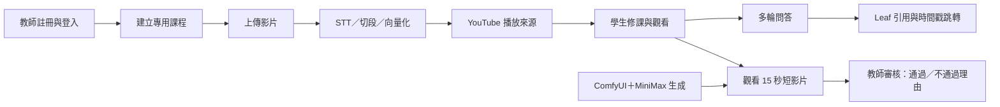
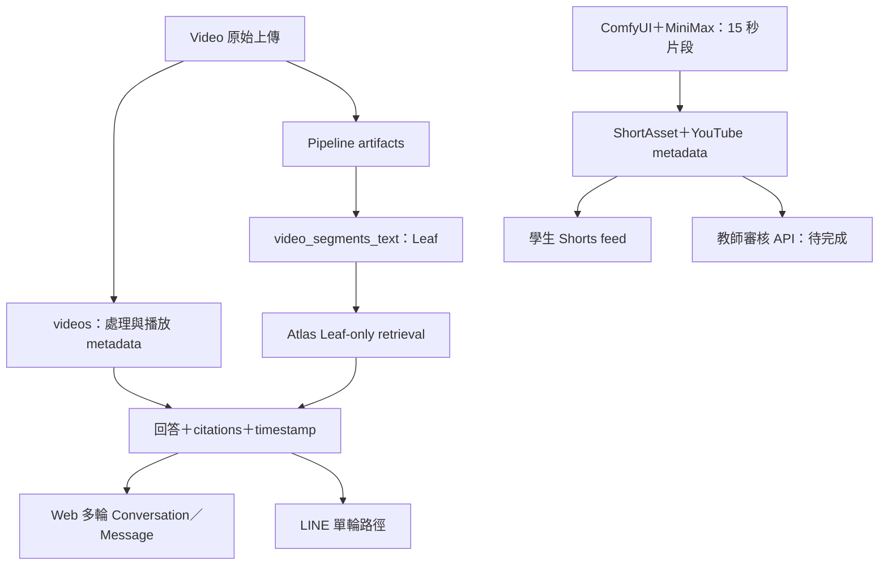

# 2026 年 9 月學生試用版後端規格草案

| 欄位 | 內容 |
|------|------|
| 文件狀態 | Draft；待第 8 章確認後於 2026-08-31 定稿 |
| 版本 | v0.6（2026-08-25 教授會議方向調整版） |
| 更新日期 | 2026-08-25 |
| 學生試用期限 | 2026-09-30 前開放小規模學生試用 |
| 可能複評時間 | 2026-10-15 前後；確切日期待教授通知 |
| 固定示範課程 | 影片處理工具 - OpenCV（`69fb4d4c069e21f4e65b74dc`） |
| 文件用途 | 以最少頁數說清楚完整流程、資料流、缺口與不崩潰底線 |
| 現況依據 | 2026-08-25 會後決策、目前 repo 程式與本輪 Atlas 唯讀查核；證據等級見附錄 E |

本文件採「白話主文件＋技術附錄」雙層結構。第 1 至 8 章供教授、評審與全體組員閱讀；附錄供實作與驗收查核。現況只使用「可跑／半通／未串」三種標示；本機、歷史或唯讀盤點證據都不等於正式環境驗收通過。

---

## 1. 目的與定位

FocusFlow 本輪是 **POC（概念驗證）**，目標不是完成一套企業級產品，而是讓評審能沿著一條完整流程看到：教師準備課程與影片，系統完成處理，學生可以觀看、問答、取得引用與觀看短影片，教師也能回饋短影片品質。

本輪取捨固定依下列順序判斷：

1. **整合成完整流程**：先讓 Happy Path 從頭到尾能走完。
2. **功能完整度**：核心流程穩定後才補細節。
3. **執行效率**：效能調優、批次吞吐與多人並發不是第一優先。

驗收採 **fail-safe，不採 fail-crash**：允許單一功能失敗，但不允許整頁空白、系統崩潰或長時間無回應。失敗時必須顯示可理解的狀態，保留已完成進度，並能從失敗步驟重試；使用者不必重新登入，也不必重跑整段流程。

試玩內容不追求完整課程。固定使用一堂簡單課程與少量整理過的影片，問答只驗證課程內容檢索、引用與基本追問，不延伸成通用知識助理。

### 1.1 時程

| 日期 | 里程碑 | 完成判定 |
|------|--------|----------|
| 2026-08-31 | 規格書定稿 | 第 8 章決策有結論；未完成項目與 owner 已標示 |
| 2026-09-30 前 | 開放學生試用 | 第 5 章 release blocker 與第 7 章最小驗收通過 |
| 2026-10-15 前後 | 可能複評 | 使用 9 月試用證據回報成果與問題；確切日期待通知 |

### 1.2 一張圖要表達的系統流程

圖中每個節點失敗時都要停在該節點、顯示錯誤並提供重試；不能讓前一節點已完成的資料失效。跨課程資料隔離是所有問答路徑共同的安全邊界，不因 POC 縮小範圍而取消。

---

## 2. Happy Path 逐步流程

本章是主文件核心。「半通」代表需要手動介入、尚未完成正式環境驗收，或有會影響試用的缺口；「未串」代表前後端或資料流程尚未真正連接。

| 步驟 | 現況 | 負責模組 | 缺口 |
|------|------|----------|------|
| 1. 學生／教師註冊與登入 | 可跑 | Frontend、Backend | 需在預定試用環境各實測一次成功、錯誤輸入、登出後重登與失敗後重試；管理員不在本輪 Happy Path |
| 2. 教師建立課程並上傳影片 | 可跑 | Frontend、Backend | 必須另開專用測試課程實測一次，不得在固定示範課程反覆建課、刪課；前端多檔上傳仍是依序呼叫單支 API |
| 3. Pipeline 執行 STT、切段與向量化 | 半通 | Backend、STT Pipeline、Database | OpenCV 既有資料已完成 16/16/16；新上傳影片仍須驗證處理失敗可從該支影片重試，且不重跑整批 |
| 4. 完成可跨電腦播放的 YouTube 來源 | 半通 | Backend、YouTube | OpenCV 目前 15/16 有 `youtubeVideoId`；最後 1 支需補上傳並驗證遠端播放；上傳復原與本地檔清理預設關閉 |
| 5. 學生取得已發布課程並觀看影片 | 可跑 | Frontend、Backend | 試用前仍要用實際學生 Enrollment 驗證課程、影片與時間戳跳轉；影片數量統計排除測試片，且不得有 `processing` 或 `failed` 狀態 |
| 6. 多輪問答、引用來源與時間戳跳轉 | 半通 | Frontend、Backend、Atlas、Gemini | 網頁多輪流程、歷史改寫與逐輪引用已實作；第 5 章 fail-closed 強化與 12＋2 題正式證據尚未完成，未通過前不得開放學生試用 |
| 7. 學生觀看短影片 | 半通 | Frontend、Backend、Shorts、YouTube | 修課限定 Shorts feed 與學生頁已串接；ComfyUI＋MiniMax 每段 15 秒的正式產物、上架資料與試用環境 E2E 待驗證 |
| 8. 教師審核短影片 | 未串 | Frontend、Backend、Shorts | 前端三步驟「審核影片→確認送出→完成」與六類理由已完成，但目前只送 mock；需完成後端 API、結構化保存與讀回，再重跑審核 |

本輪影片處理順序採：**先完成影片上架；待後端審核 API 完成後，再重跑教師短影片審核並保存正式證據。** 前端 mock 顯示成功不能當成審核完成。

### 2.1 Happy Path 資料流

系統只回答課程影片內容。對話歷史只用來理解追問，不是知識來源；如果 Leaf 沒有支持答案，就回覆無答案，不得改用模型通用知識補答。

---

## 3. 固定示範課程

### 3.1 課程範圍與整體狀態

| 項目 | 2026-08-25 狀態 |
|------|------------------|
| 課程 | 影片處理工具 - OpenCV |
| `courseId` | `69fb4d4c069e21f4e65b74dc` |
| 課程狀態 | `published` |
| 影片紀錄 | 16 筆 |
| Pipeline | STT 16/16、切段 16/16、向量化 16/16 完成 |
| YouTube | 15/16 有 `youtubeVideoId`；`TEST_0720` 尚缺 |
| Leaf | 132 筆；平均 8.25 筆／影片，範圍 3～12 筆 |
| 歷史問答 | 74 筆：`api` 44、`line` 29、`debug` 1；對外歷史統計為 73 筆 |
| Parent | 本輪不要求、不啟用；示範課程只以 Leaf 產生引用 |

### 3.2 逐支影片清單

下表來自本輪 Atlas 唯讀查核。`videoId` 欄位皆為空，因此 Leaf 以 `videos._id` 對應。影片顯示名稱是否改成可理解的單元名稱，留在第 8 章決定。

| # | 目前標題 | `videos._id` | Pipeline | YouTube | Leaf |
|---|----------|--------------|----------|---------|------|
| 1 | 第一講 | `69fb55edb52433fda32db4e8` | 完成 | `yWhzdAefaQU` | 6 |
| 2 | 第二講 | `69fb57edb52433fda32db706` | 完成 | `9DabT5D_j5I` | 11 |
| 3 | 第三講 | `69fb59cfb52433fda32db827` | 完成 | `jTLzkxYQwGE` | 5 |
| 4 | 第四講 | `69fb5b5eb52433fda32db907` | 完成 | `1EumI0A9zIw` | 5 |
| 5 | 第五講 | `69fb5c8db52433fda32dbab5` | 完成 | `G72iAOHLwdM` | 8 |
| 6 | 第六講 | `69fb5d78b52433fda32dbc81` | 完成 | `525ItlVdo6E` | 8 |
| 7 | 第七講 | `69fc291cadf6d9dc08eb4cb7` | 完成 | `ideoMCtYzDM` | 8 |
| 8 | 第八講 | `6a02f2d417c615e872035a68` | 完成 | `EtrffNWmQuQ` | 12 |
| 9 | 第九講 | `6a02f34d17c615e872035b3d` | 完成 | `DA38Ivwrm4E` | 10 |
| 10 | 第十講 | `6a02f38c17c615e872035b94` | 完成 | `-YiAefCatxA` | 9 |
| 11 | 第十一講 | `6a02f3b217c615e872035beb` | 完成 | `_ZDapJpaMlc` | 10 |
| 12 | 第十二講 | `6a02f42a17c615e872035c42` | 完成 | `_31wZJQ8HKo` | 8 |
| 13 | 第十三講 | `6a02f46317c615e872035c93` | 完成 | `4Nkw98RZ3Xo` | 9 |
| 14 | 第十四講 | `6a02f48c17c615e872035cea` | 完成 | `IlGyegM8AUY` | 8 |
| 15 | 第十五講 | `6a02f4b017c615e872035d41` | 完成 | `2KurqFtNTgI` | 12 |
| 16 | TEST_0720 | `6a5deabebece4943079410bd` | 完成 | 缺少；目前為本地檔 | 3 |

### 3.3 已知弱點與使用限制

1. **切段密度偏低，不得淡化。** 132 筆 Leaf 分散在 16 支影片，平均每支約 8 段；最低只有 3 段。這可能不足以支撐深入問答、比較題與跨段推理，必須由第 4 章 12 題重跑實測，不可用「Pipeline 已完成」代替答案品質證據。
2. 影片數量少的定義不設上限，但只計正式教學影片；測試影片不列入，且正式範圍不得存在 `processing` 或 `failed` 狀態。`TEST_0720` 是否屬正式教學影片與本規則有衝突，列入第 8 章證據矛盾。
3. 本地 `filePath` 只對存有檔案的那台電腦有效，換電腦、換部署主機或清理暫存檔後可能無法播放。因此示範課程要求全部影片具備 YouTube 遠端播放來源；最後 1 支補上傳是試用前工作。
4. 歷史 74 筆問答保留、不修改、不刪除，也不作為 Demo 驗收證據。對外說明來源時，`api` 表示網頁與 API 路徑，**不保證每筆皆由網頁 UI 發出**；`line` 表示 LINE Bot；所有對外統計排除 `debug`。

### 3.4 資料存放與取用

| 資料 | 存放位置 | 取用方式 |
|------|----------|----------|
| 課程與影片 metadata | `courses`、`videos` | Backend 依 Enrollment、課程狀態及影片 allowlist 取得 |
| 可引用文字片段 | `video_segments_text` | 本輪只走 Leaf；Atlas vector search 回傳後再做 `videoId` allowlist 驗證 |
| 影片播放 | YouTube `youtubeVideoId`／URL | 網頁 iframe 與 citation 時間戳跳轉；本地路徑不作跨電腦保證 |
| 問答紀錄 | `questions` | 保留原始 `source=api|line|debug`；歷史資料不作正式證據 |
| 多輪對話 | `conversations`、`messages` | 對話脈絡用於改寫追問；每輪知識仍重新由 Leaf 取得 |
| 短影片 | `shortassets` 與 YouTube metadata | 學生 feed 只取有修課權限、已發布且可播放的 ShortAsset |

### 3.5 YouTube 上傳成功後的 `videos` 回寫契約

本地檔案上傳 YouTube 成功後，Backend 至少回寫：

- `youtubeVideoId`
- `sourceUrl` 與 `videoUrl`：YouTube watch URL
- `videoSource`：切換為 YouTube 播放來源
- `youtubeUpload.status=uploaded`
- `youtubeUpload.uploadedAt`、`attemptCount`、`lastAttemptAt`
- 清空本次成功後的 `youtubeUpload.error`、`failedAt`、`nextRetryAt`，並保持 `retrySafe=false`

`sourceType` **必須保持 `upload`**，表示原始來源是檔案上傳，不得因遠端播放改成 `youtube`。第一階段一律保留 `filePath`；只有遠端播放驗收通過、另行確認清理策略且 `YOUTUBE_UPLOAD_CLEANUP_ENABLED=true` 後，才可評估安全清理。

### 3.6 放棄「影像處理導論」與資料清理項目

「影像處理導論」（`69f82564736febac6db8e97b`）不再作示範課程。4 筆影片中，`aiA10_1140123_1`、`aiA10_1140123_2` 各約 30 分鐘，才是正式教學內容；另外兩筆為測試片。兩支正式影片的原始檔已不在可用位置且年代不明，會議決定不再追查。會議資料認定兩支測試片約 13 秒與 20 秒，但 Atlas 的第二筆 `durationSec` 目前為 120 秒，屬 metadata 不一致，不影響放棄該課程的決策。

本輪只寫規格，不執行刪除。日後資料清理必須另行取得 Atlas 寫入授權，並依下列順序進行：

| 階段 | 必做確認／動作 | 判定方式 |
|------|----------------|----------|
| 前置 1 | 再次確認兩支正式影片原始檔、備份與可用主機位置均無法取回，且年代無法確認 | 由影片／Pipeline 負責人留下查找位置、日期與結論 |
| 前置 2 | 鎖定影片 `6a67ffcb95668cc2b904f3b9`（`aiA10_1140123_1`）與 `6a67ffd295668cc2b904f3c4`（`aiA10_1140123_2`） | ID、標題、約 1800.1 秒長度三者一致 |
| 前置 3 | 唯讀確認兩筆影片沒有被其他保留課程掛載，並產生刪除 manifest | 列出所有 `courses.videoIds` 反向引用；若有其他課程引用即停止 |
| 前置 4 | 唯讀確認 Leaf 精確為 166＋113＝279 筆，且都對應上述兩個影片 ID | 數量或 ID 不符即停止，不得用廣泛條件刪除 |
| 清理 | 在同一受控維護作業刪除 2 筆 `videos` 與其 279 筆 Leaf | 只使用 manifest 中的固定 ID；不得波及兩筆測試片或其他課程 |
| 後驗 | 查核 2 筆影片與 279 筆 Leaf 均為 0，其他影片／Leaf 數量不變 | 保存前後計數與操作者紀錄；失敗時停止後續動作 |

必須連帶刪除 279 筆 Leaf，否則會製造新的 orphan，重演現有 `video_001` 102 筆 orphan Leaf 問題。兩筆測試片與課程本身是否另行清理不在這個已定案項目的授權範圍內，不得順手擴張刪除。

---

## 4. 問答範例劇本

本章定義重跑計畫與通過條件，不預填尚未跑出的問題、答案或引用。正式問題必須從實際 transcript／Leaf 內容反推，不能依「第一講」「第八講」等檔名臆造。

### 4.1 題目配置

| 編號 | 類型 | 候選主來源 | 正式題目 | 產出規則 |
|------|------|------------|----------|----------|
| Q01 | 基礎事實 | 第八講（12 Leaf） | 待從 Leaf 反推 | 必須能由單一或相鄰 Leaf 明確回答 |
| Q02 | 基礎事實 | 第十五講（12 Leaf） | 待從 Leaf 反推 | 同上 |
| Q03 | 基礎事實 | 第二講（11 Leaf） | 待從 Leaf 反推 | 同上 |
| Q04 | 基礎事實 | 第九講（10 Leaf） | 待從 Leaf 反推 | 同上 |
| Q05 | 流程原理 | 第十一講（10 Leaf） | 待從 Leaf 反推 | 問題需涵蓋步驟、原因或操作關係 |
| Q06 | 流程原理 | 第十講（9 Leaf） | 待從 Leaf 反推 | 同上 |
| Q07 | 流程原理 | 第十三講（9 Leaf） | 待從 Leaf 反推 | 同上 |
| Q08 | 流程原理 | 第五講（8 Leaf） | 待從 Leaf 反推 | 同上 |
| Q09 | 比較與跨段推理 | 優先第八講／第十五講 | 待從 Leaf 反推 | 至少需要兩個有明確關係的 Leaf；不可硬湊 |
| Q10 | 比較與跨段推理 | 優先第二講／第九講 | 待從 Leaf 反推 | 同上 |
| Q11 | 比較與跨段推理 | 優先第十一講／第十講 | 待從 Leaf 反推 | 同上 |
| Q12 | 比較與跨段推理 | 優先第十三講／第五講 | 待從 Leaf 反推 | 同上 |
| N01 | 負向：跨課程 | 另一門課的真實 Leaf | 待從 Leaf 反推 | 問題在外課可回答、在 OpenCV allowlist 內不可命中 |
| N02 | 負向：無答案 | OpenCV Leaf 全集 | 待從 Leaf 反推 | 人工確認 132 筆 Leaf 均不支持答案 |

上表先依 Leaf 數較多的影片安排候選來源。實際讀完 transcript 後若內容不足以支撐指定難度，允許換到其他影片，但要在題庫紀錄調整原因，不能為了填滿 12 題而製造沒有資料依據的題目。

### 4.2 Leaf-only 零寫入 runner

優先改造既有 [phase2_2_hierarchical_e2e_runner.js](../backend/src/scripts/phase2_2_hierarchical_e2e_runner.js)，保留其專用唯讀角色檢查與 MongoDB command monitoring，不從零另寫。改造要求：

1. 拿掉「必須有 Parent hit 才通過」、Parent search、Child expansion 與 `chunkId_1` 驗收；直接執行 Leaf-only Atlas retrieval。
2. 強制 `QA_VECTOR_SEARCH_MODE=atlas`、`FAQ_CACHE_ENABLED=false`、`HIERARCHICAL_RETRIEVAL_ENABLED=false`。
3. Atlas 查詢失敗、索引不相容或無法完成查詢時，該題直接失敗；不得退回 memory、lexical、FAQ 或 Parent。
4. 不呼叫會寫入 `questions`、`usage_logs`、`messages` 或 FAQ 的一般 QA controller/service 落庫路徑；runner 只執行 query embedding、Atlas Leaf 搜尋、答案生成、citation 組裝與輸出證據檔。
5. 使用只具目標資料庫 `read` 角色的專用帳號；若 `connectionStatus` 顯示其他角色即停止。
6. command monitoring 偵測到 `insert`、`update`、`delete`、`findAndModify`、`bulkWrite`、建／刪 index 或其他寫入命令時，整次執行失敗。
7. 每題輸出搜尋 backend、fallback 清單、引用 `videoId`、時間戳、寫入命令計數與人工複核欄位；不得輸出資料庫 URI 或金鑰。

### 4.3 通過條件

- 12/12 正式題全部使用 Atlas Leaf retrieval。
- 12/12 為零 fallback、零資料庫寫入。
- 每筆 citation 的 `videoId` 都在 OpenCV 示範課程 allowlist，並能回到合理時間戳。
- 12/12 答案由指定人工複核者確認受 Leaf 支持；若 Leaf 密度不足，該題判定失敗，不得降低標準或補通用知識。
- N01 跨課程題不得回傳外課 citation；N02 無答案題必須回覆無答案且 citation 為空。兩題都要 2/2 通過。
- 題庫、runner 設定、原始 JSON 結果與人工複核表一併保存；保存位置與期間依第 8 章決定。

歷史 74 筆問答一律不計入上述通過率，也不因本次重跑而修改或刪除。

---

## 5. 跨課程資料隔離

**本章是學生試用前 release blocker，也是安全底線，不在 POC 可取捨範圍內。** POC 可以少功能，但不能把其他課程內容回答給目前學生。

### 5.1 現況與風險

- `video_segments_text` 共 1,651 筆 Leaf，全部沒有 `courseId`；範圍控制實際完全依賴應用層從課程影片建立的 `allowedVideoIds`。
- 現行 `buildSegmentLookupQuery()` 仍可產生「`courseId` 或 `videoId`」條件，`segmentMatchesScope()` 也可僅憑 `courseId` 通過。這與本輪「Leaf 一律以 `videoId` allowlist」的 fail-closed 目標不一致。
- 現有 `video_001` 有 102 筆 orphan Leaf。這些資料本輪不回填、不修改、不刪除，必須靠空 allowlist 拒絕、命中後再驗證與監控自然排除。
- FAQ exact／semantic hit 目前可直接回傳快取中的 `matches`，尚未逐筆重新驗證是否仍在目前 allowlist。
- Video 可掛載多門課，單一 `courseId` 無法取代 `allowedVideoIds`。因此不做 Leaf `courseId` 回填；回填成本高，也不能解決共享影片與孤兒資料的根本問題。

### 5.2 必須完成的 fail-closed 強化

1. Leaf 查詢與回傳一律要求 `segment.videoId ∈ allowedVideoIds`；禁止只因 `courseId` 相同就通過。
2. `allowedVideoIds` 為空時直接回安全錯誤／無可搜尋影片，不得產生無範圍 Atlas 查詢，也不得退回 memory 全表搜尋。
3. Atlas `$vectorSearch` filter 必須以 allowlist 為必要條件；查回後再次逐筆驗證，不合格 match 全部丟棄並記監控事件。
4. memory 路徑也使用相同的 `videoId` allowlist post-filter，不得因本機測試資料缺欄位放寬。
5. FAQ cache 命中時，回傳前逐筆驗證 `matches[].videoId`；任一 match 不在 allowlist 時整筆 cache miss／失效，不可部分沿用舊回答。
6. 多輪 Conversation 每一輪都依目前 Enrollment 與課程影片重建 allowlist；歷史 citation 不能自動成為本輪知識來源。
7. LINE 切課與提問時使用和 Web 相同的課程存取與 allowlist 規則。
8. 監控至少記錄：空 allowlist 拒絕次數、post-filter 移除數、FAQ scope mismatch、orphan `videoId` 命中嘗試；不得把完整問題或回答寫入一般 log。

### 5.3 五條路徑的負向驗收

| 路徑 | 測試方式 | 必須觀察到的結果 |
|------|----------|------------------|
| Atlas | 用課程 A 身分提出只在課程 B Leaf 可回答的問題 | 課程 B `videoId` 命中 0；不得 fallback；安全無答案 |
| memory | 隔離測試資料同時放入 A、B Leaf | 回傳 match 全部屬於 A allowlist；空 allowlist 時直接停止 |
| FAQ | 在 A 建立帶外課 match 的測試 cache | 命中後重新驗證失敗，不回傳舊答案或外課 citation |
| 多輪 Conversation | 第一輪在 A，第二輪用追問誘導 B 的內容 | 查詢改寫可用歷史語意，但本輪 evidence 仍只能來自 A |
| LINE | 綁定 A 後詢問 B 才有的內容或嘗試切到未修課 B | 切課被拒絕或回安全無答案；不得取得 B citation |

五條路徑全部通過後才能解除 release blocker。102 筆 orphan Leaf 保留作監控與負向測試背景資料，但不得改成 Demo 成功證據。

---

## 6. POC 取捨清單

每項取捨都回到第 1 章的固定順序：先完成整合流程，再補功能完整度，最後才做效率。跨課程資料隔離不列在表內，因為它不可取捨。

| 本輪不做／不優先做 | 原因 | Feature flag 與預設 | 日後恢復條件 |
|---------------------|------|---------------------|--------------|
| 多影片批次處理正式上線 | 單支上傳足以證明完整流程；先避免 batch、resume 與部署問題拖累 POC | `VIDEO_BATCH_PIPELINE_ENABLED=false` | 真實 STT／Gemini、重啟 resume、partial failure 與部署環境 E2E 通過 |
| YouTube 自動上傳復原常態啟用 | 本輪只需補 1 支；人工可控重試優先於自動恢復複雜度 | `YOUTUBE_UPLOAD_RECOVERY_ENABLED=false` | retry safety、stale upload、重複上傳與人工介入流程在正式帳號驗證 |
| YouTube 本地檔自動清理 | 跨電腦播放先靠 YouTube；第一階段保留原檔降低不可逆風險 | `YOUTUBE_UPLOAD_CLEANUP_ENABLED=false` | 16/16 遠端播放驗收通過，另行核准清理策略，確認路徑、共享引用與回復方法 |
| Parent／階層檢索 | Leaf 能產生正確引用即符合 POC；Parent 會增加資料、index 與 fallback 驗收成本 | `HIERARCHICAL_RETRIEVAL_ENABLED=false` | active Parent generation、filter/index、Parent→Child→Citation 與唯讀 live E2E 全部通過 |
| QA 完整評測 | 本輪只建立 12＋2 題最小證據，不追求完整課程與大量題庫 | 不適用；不是 runtime feature flag | Leaf 密度改善、人工標註資源與長期評測 owner 確認 |
| QA 效能調優 | 執行效率是第三優先；先保證流程完成且失敗可重試 | 不適用；不新增假 flag | Happy Path 與 fail-safe 穩定後，以實際瓶頸與量測結果排程 |
| 多人並發／壓力目標 | 小規模試玩先驗證功能與安全，不以企業級容量為 POC 成敗 | 不適用；不新增假 flag | 試用人數、SLO、外部服務預算與部署容量確定後再定門檻 |
| 短影片自動化正式產線 | 本輪證明 ComfyUI＋MiniMax 每段 15 秒、可上架、可觀看、可審核即可 | 不適用；正式 worker 尚未串接，目前沒有可核對的統一 runtime flag | 生成 worker、ShortAsset lifecycle、審核 API、發布與失敗重試串成 E2E；屆時再新增預設關閉的正式 flag |

`YOUTUBE_UPLOAD_ENABLED` 可在受控補上傳作業中啟用，但它不代表 recovery 或 cleanup 自動啟用。每次操作仍需保存實際結果，不能只看 flag 值宣稱完成。

---

## 7. 崩潰底線驗收標準

本章取代 v0.5 的 48 步完整彩排，只保留能證明「流程跑得完、失敗不崩潰、可從失敗點重試」的最小集合。每項均需記錄日期、環境、操作者、結果與證據連結。

### 7.1 最小驗收集合

| 驗收項目 | 操作 | 可觀察的通過判定 | 失敗後重試點 |
|----------|------|------------------|--------------|
| 學生／教師註冊登入 | 各完成一次註冊、錯誤輸入、登出與重登 | 成功進入正確角色頁；錯誤有白話提示；無空白畫面或無限 loading | 修正欄位或重新送出登入，不重建帳號 |
| 教師建課與上傳 | 在專用測試課程建立課程、上傳一支小型正式測試影片 | 課程與 video ID 可追蹤；上傳失敗顯示原因；不得改動 OpenCV 示範課程 | 從上傳步驟重試，不刪課重建 |
| Pipeline | 讓測試影片走 STT、切段、向量化，並模擬／觀察一次失敗 | 三階段狀態可辨識；失敗不使 backend／頁面崩潰；重試後只重跑必要工作 | 從失敗影片／checkpoint 重試 |
| YouTube 播放 | 補上傳 OpenCV 缺少的 1 支，跨兩台裝置或兩種網路播放 | 16 支預定正式影片皆有可用遠端來源；失敗保留 `filePath` 與錯誤狀態 | 從 YouTube upload retry 重試，不重跑 STT |
| 學生選課觀看 | 以 active Enrollment 進入 published OpenCV 課程並播放、跳時間戳 | 只看到有權課程；播放與 citation 跳轉可用；影片載入失敗顯示重試 | 重新載入該影片，不重新登入 |
| 12＋2 題問答 | 依第 4 章用唯讀 runner 執行 | 12/12 Atlas、零 fallback、零寫入、引用全屬 OpenCV；負向 2/2 通過 | 只重跑失敗題並保留前次證據 |
| 跨課程隔離 | 執行第 5 章五條路徑負向測試 | 外課 citation 0；空 allowlist 不查全域；監控可見拒絕 | 修正該路徑後重跑負向測試；未通過不得開放試用 |
| 學生 Shorts | 使用測試學生開啟 feed 並播放一支已上架短影片 | 頁面不空白；無資料、YouTube 失敗或 API 錯誤都有狀態與重試 | 重載 feed／單支影片，不重新登入 |
| 教師 Shorts 審核 | 後端 API 完成後各送一次通過與不通過 | 三步驟可完成；六類理由以 `{code,note}` 保存並可讀回；API 失敗不得顯示完成 | 保留選擇與說明，從確認送出重試 |
| Fail-safe 回歸 | 分別讓 Atlas、Gemini、Shorts API 回傳可控錯誤 | 無 server crash、白畫面或永久 pending；錯誤不洩漏 stack／secret | 外部服務恢復後從原操作重試 |

### 7.2 開放學生試用的最小 Gate

2026-09-30 前只有在下列條件同時成立時才可開放：

- 第 5 章跨課程隔離 release blocker 已解除。
- OpenCV 正式示範影片沒有 `processing`／`failed` 狀態，且需展示者都有遠端播放來源。
- 第 4 章 12＋2 題完成，未用歷史問答冒充證據。
- 教師專用測試課程的建課、上傳、失敗重試至少實測一次。
- 核心頁面遇到外部服務失敗時不崩潰、不空白、可重試。
- Short 審核 API 若仍未串接，必須如實標示「未完成」，前端 mock 不得出現在正式 Demo 證據中；是否因此縮減 Demo 由教授依完整流程優先順序判斷，但不能偽稱已通過。

R24 額度、R25 日誌與 R26 備份／還原只保留在附錄 C，作為營運保護，不列為本輪學生試用前必要 Gate。

---

## 8. 待確認事項

### 8.1 尚未定案的政策

| 編號 | 待確認事項 | 目前傾向 | 未確認前處理 |
|------|------------|----------|--------------|
| D01 | YouTube 頻道歸屬與隱私設定 | 沿用專題既有頻道，維持 `unlisted` | 不改成 public；補上傳前由頻道 owner 確認 |
| D02 | 影片對外顯示名稱是否改為可理解的單元名稱 | 將「第一講」等名稱改成能看懂的單元名稱 | 問答題目不得依現有泛稱臆造內容 |
| D03 | 12＋2 題問答證據檔保存位置與保存期間 | repo 內保存去識別化題庫、設定與結果；secret 不入庫 | runner 可先產出本機檔，但不能刪除或對外發布 |
| D04 | 12 題人工複核由誰執行 | 課程內容熟悉者主審，另一名組員確認 citation | 無指定複核者時不能標示人工複核通過 |

### 8.2 證據矛盾，需在 2026-08-31 前釐清

| 編號 | 現況衝突 | 影響 |
|------|----------|------|
| E01 | 會議定義測試影片不計入，但 OpenCV 的第 16 筆名為 `TEST_0720`、只有 3 Leaf，且正是唯一缺少 YouTube 的本地影片 | 需確認它是否為正式教學內容；若是測試片，正式示範數量應為 15 而非 16，且補上傳目標需重新指定 |
| E02 | 本輪指示為「前端已移除管理員入口」，但目前 repo 的 `frontend/focus-flow/src/main.jsx` 仍以 `/admin` 載入 `AdminApp` | 本規格已刪除管理員 Happy Path 與必要需求；仍需確認是 repo 尚未同步，或只代表本輪 Demo 不展示管理員 |
| E03 | 會議資料稱「影像處理導論」第二支測試片約 20 秒，但 Atlas `durationSec` 為 120 秒 | 不影響只刪兩支正式影片＋279 Leaf 的既定範圍；執行任何清理前仍需在 manifest 記錄此 metadata 異常 |

除上述項目外，本文件不再把已在 2026-08-25 會議定案的 Parent 關閉、Leaf-only、OpenCV 課程、`questions.source`、orphan 處理、歷史問答用途、跨課程 fail-closed 與教師專用測試課程重新列為選項。

---

# 技術附錄

## 附錄 A：白話名詞與 fail-safe 回應

| 名詞 | 白話說明 |
|------|----------|
| Enrollment | 學生與課程的修課關係；本輪存取條件為 active Enrollment 與 published Course 的交集 |
| Leaf | 可直接搜尋、引用並附時間戳的小段課程內容；本輪正式問答唯一知識來源 |
| Parent | 將多個 Leaf 組成較大主題的進階檢索資料；本輪關閉 |
| Citation | 本輪回答使用的影片、Leaf 與時間戳證據 |
| Allowlist | 後端依目前課程影片建立的可用 `videoId` 清單 |
| Orphan Leaf | 原影片紀錄已不存在或不在任何有效課程，但 Leaf 仍留在資料庫 |
| Fail closed | 權限或範圍無法確認時直接拒絕，不放寬查詢 |
| Fail safe | 功能失敗時顯示狀態、保留進度並可重試，不讓整體崩潰 |
| Feature flag | 讓高風險或未驗收功能預設關閉的設定開關 |

最小錯誤語意：

- 無課程權限：拒絕，不透露課程是否存在或內容。
- allowlist 為空：停止檢索，顯示課程暫無可問答影片。
- Atlas／Gemini 失敗：顯示服務暫時不可用並可重試，不回退通用知識。
- YouTube 失敗：保留本地檔與已完成 Pipeline 狀態，只重試上傳／播放。
- 審核 API 失敗：不得進入完成步驟，保留教師選擇與理由供重送。

## 附錄 B：多輪問答固定規則

- 網頁端多輪對話已完成：可建立、開啟與延續 Conversation，並保存每輪 Message 與 citation。
- 有歷史記錄時，系統會把追問改寫成可獨立檢索的問題；例如代名詞與省略主詞可依同一對話近期脈絡補足。
- **對話脈絡與知識來源分離**：歷史內容只用來理解使用者想問什麼，不能把上一輪回答當成本輪事實。
- 每一輪都重新執行目前課程的 Leaf retrieval，並保存該輪自己的 citation。
- 新 Conversation 不得帶入其他對話或其他課程歷史。
- 同一問題可以再次詢問；防重只處理同一次網路請求重送，不比較問題文字。
- 失敗重試沿用原本學生訊息，不新增重複問題。
- FAQ cache 不用於本次 12＋2 題 runner；正式 runtime 命中 FAQ 時仍須重新驗證 match allowlist。
- 系統只使用課程影片內容；找不到 Leaf 支持時回覆無答案，不使用通用知識回退。
- LINE 仍使用自己的對話狀態／歷史機制；不宣稱和網頁共用同一份 Conversation。

## 附錄 C：R01–R26 降級對照

只保留能對應 Happy Path 或附錄營運保護的項目。原管理員專屬 R04 與管理員代理流程已移除；R06 只保留教師 owner 邊界。下表不再是主文件排程軸。

| 原編號 | 保留要求 | 對應 Happy Path | 本輪定位 |
|--------|----------|----------------|----------|
| R01 | 學生註冊成功與輸入錯誤提示 | 步驟 1 | 最小驗收 |
| R02 | 學生／教師登入與角色入口正確 | 步驟 1 | 最小驗收；不含管理員 |
| R03 | 教師註冊／帳號取得流程可控且可追蹤 | 步驟 1 | 待試用環境實測；不擴張管理員需求 |
| R05 | 學生只存取 active Enrollment ∩ published Course | 步驟 5、6、7 | Release blocker 的上層授權 |
| R06 | 教師只能管理自己的課程 | 步驟 2、8 | 最小權限邊界 |
| R07 | 撤銷修課後失去課程與問答權限 | 步驟 5、6、7 | 負向驗收 |
| R08 | 單次問答保持可用 | 步驟 6 | 保留相容路徑 |
| R09 | 多輪使用同一對話近期歷史 | 步驟 6 | 已實作；規則見附錄 B |
| R10 | 每輪重新搜尋並建立自己的來源 | 步驟 6 | 已實作；隔離需強化 |
| R11 | 相同問題可再次詢問 | 步驟 6 | 固定規則 |
| R12 | 同一次請求重送不重複工作 | 步驟 6 | 非本輪主軸；fail-safe 回歸 |
| R13 | 同一對話避免同時處理兩個新問題 | 步驟 6 | 非本輪主軸；fail-safe 回歸 |
| R14 | 無答案時不編造 | 步驟 6 | N02 必測 |
| R15 | 學生對話刪除 | 步驟 6 | 功能完整度；不是 POC 開放 Gate |
| R16 | 技術處理完成不等於短影片審核完成 | 步驟 3、8 | 審核 API 未串前不得偽稱完成 |
| R17 | 教師可通過或結構化退回短影片 | 步驟 8 | 前端完成、後端未串 |
| R18 | 退回後可依理由修正並重跑審核 | 步驟 8 | 後端完成後驗證 |
| R19 | 重新生成後舊審核不可直接沿用 | 步驟 8 | 後端 contract 要求 |
| R20 | 審核歷史可讀回 | 步驟 8 | 後端 contract 要求 |
| R21 | 重複／過期審核不互相覆寫 | 步驟 8 | 後端 contract 要求 |
| R22 | 一般校外網路可完成核心流程 | 步驟 1～8 | 9 月試用環境驗收 |
| R23 | 正式入口使用可信任 HTTPS | 步驟 1～8 | 部署依賴；未通過只能內部展示 |
| R24 | 付費服務呼叫前檢查額度 | 步驟 6 | 附錄營運保護；非試用前必要 |
| R25 | 一般 log 不保存完整問題、回答或 secret | 步驟 3、6、8 | 附錄營運保護；安全原則仍適用 |
| R26 | 備份與隔離還原 | 步驟 2～8 | 附錄營運保護；非試用前必要 |

## 附錄 D：短影片與 Parent 技術邊界

### D.1 教師短影片審核 contract

前端現有三步驟：

1. 審核影片：選擇通過，或勾選至少一個不通過理由。
2. 確認送出：顯示本次決策與理由，確認後才呼叫 API。
3. 完成：只有後端成功保存後才能顯示；目前 mock 不算完成。

六類不通過理由必須以結構化陣列保存並可由讀取 API 原樣取回，供後續優化腳本生成：

| `code` | 顯示名稱 | `note` 規則 |
|--------|----------|--------------|
| `contentIncorrect` | 內容不正確 | 可補充錯誤段落／知識點 |
| `audioIssue` | 聲音問題 | 可補充雜音、語速或同步問題 |
| `visualQuality` | 畫面品質問題 | 可補充模糊、扭曲等問題 |
| `subtitleIssue` | 字幕問題 | 可補充缺漏、不同步、錯字與時間點 |
| `incomplete` | 內容不完整 | 可補充截斷或缺少段落 |
| `other` | 其他 | `note` 必填 |

最小 payload 形狀為 `status: approved|rejected` 與 `reasons: [{ code, note }]`；`rejected` 至少一個理由。後端還要保存教師、ShortAsset／生成版本與時間，讀回時不得把六類理由壓成單一自由文字。

短影片生成架構固定為 **ComfyUI＋MiniMax，每段 15 秒**。本輪先上架影片，待後端 review API 完成後再重跑審核；這是作業順序，不代表未審核內容已取得正式教學核准。

### D.2 Parent 可行性證據

Parent／階層檢索本輪維持關閉，不要求 OpenCV 每支影片具備 active Parent。AI入門基礎課目前的 3 個 active Parent 只作為「多層檢索資料曾可產生」的可行性證據；它不代表 OpenCV readiness、不代表正式 index／filter 通過，也不納入示範課程條件。

## 附錄 E：證據等級

| 標示 | 可以代表什麼 | 不能代表什麼 |
|------|--------------|--------------|
| 已實作 | Repo 中已有程式 | 不代表功能已在正式環境通過 |
| 本機／模擬測試通過 | 自動化測試或本機操作成功 | 不代表真實 Atlas、Gemini、LINE、YouTube 或校外部署成功 |
| Atlas 唯讀查核 | 指定時間只讀取得資料與計數 | 不代表資料已清理、index 已修改或未來不會變動 |
| 正式環境驗收通過 | 在核准網址、資料庫、帳號與外部服務完成指定流程 | 只代表記錄當下，不代表永久有效 |
| 歷史紀錄 | 過去曾有資料或執行結果 | 不代表本輪 Demo 品質或目前 runtime 狀態 |
| 待確認 | 教授或團隊尚未決定，或證據互相衝突 | 不能當成已承諾功能 |
| 未完成 | 尚未實作、未串接或驗收失敗 | 必須如實放入進度與最終報告 |

本文件中的 OpenCV 16 筆影片、132 Leaf、74 筆歷史問題、全域 1,651 筆無 `courseId` Leaf、102 筆 `video_001` orphan，以及放棄課程的 279 筆 Leaf，均為 2026-08-25 Atlas 唯讀查核；本輪沒有 Atlas 寫入。

## 附錄 F：變更紀錄

| 日期 | 版本 | 內容 |
|------|------|------|
| 2026-08-25 | v0.6 | 因教授會議方向調整，改以 POC、完整 Happy Path 與 fail-safe 為主軸；主文件重構為八章，固定 OpenCV 示範課程，新增逐支 Leaf／YouTube 清單、12＋2 題唯讀重跑、跨課程 fail-closed release blocker、POC 取捨與最小崩潰底線；R01–R26 降級為附錄，管理員需求移出主流程，時程改為 8/31 定稿、九月底前試用及十月中旬可能複評。 |
| 2026-08-25 | v0.5 | 補齊學生、教師、管理員完整使用流程，新增 48 步試用前彩排。 |
| 2026-08-25 | v0.4 | 依 4 人學生團隊能力重整，改為白話主文件與技術附錄。 |
| 2026-08-25 | v0.3 | 新增正式影片人工審核、退件、重新處理與再審方向。 |
| 2026-08-24 | v0.2 | 依目前程式整理多輪 QA、權限、Atlas、Pipeline、YouTube、Parent／Leaf 與 Shorts 狀態。 |
| 2026-08-24 | v0.1 | 建立 9 月學生試用版後端規格草案。 |
